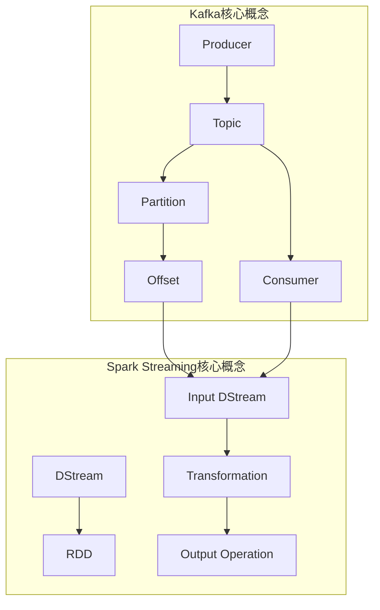
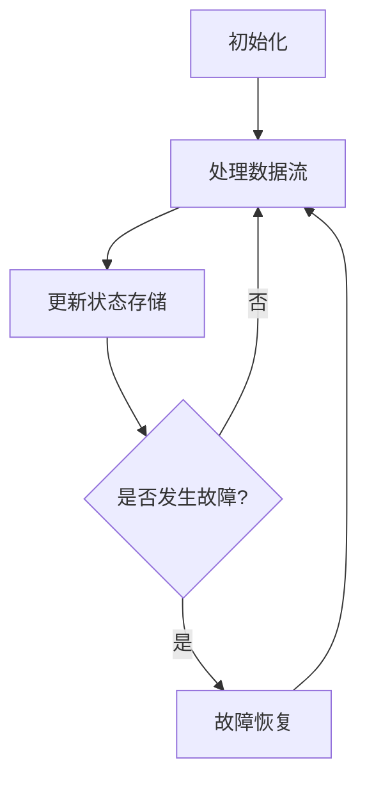
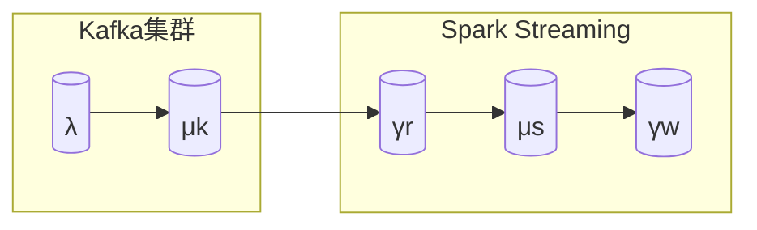

以下是根据您提供的要求和大纲，撰写的技术博客文章正文部分：

# Kafka-Spark Streaming整合原理与代码实例讲解

## 1. 背景介绍

### 1.1 问题的由来

在当今大数据时代，数据量的快速增长使得传统的批处理系统难以满足实时数据处理的需求。为了解决这一问题,流式计算应运而生。流式计算是一种新兴的大数据处理范式,能够实时地对持续到达的数据进行处理和分析。

Apache Kafka和Apache Spark Streaming是当前流式计算领域两个备受关注的开源项目。Kafka是一个分布式的发布-订阅消息队列系统,而Spark Streaming则是Spark核心的一个扩展库,用于构建可扩展、高吞吐量、容错的流处理应用程序。将Kafka与Spark Streaming整合起来,可以充分利用两者的优势,构建高效、可靠的实时数据处理管道。

### 1.2 研究现状

目前,已有多个开源项目和商业产品支持Kafka与Spark Streaming的整合,如Apache Kafka、Apache Spark、Amazon Kinesis等。但由于缺乏系统的原理解析和最佳实践指南,开发人员在实际应用中仍然面临诸多挑战,如数据一致性、容错性、吞吐量优化等。

### 1.3 研究意义

深入探讨Kafka-Spark Streaming整合原理及实践经验,对于指导开发人员构建高质量的实时数据处理系统具有重要意义。本文将系统地阐述两者整合的核心概念、关键算法、数学模型,并结合实际应用场景,提供完整的代码示例,帮助读者全面掌握相关知识。

### 1.4 本文结构

本文共分为8个部分:第2部分介绍核心概念;第3部分详解核心算法原理;第4部分讲解数学模型和公式推导;第5部分提供代码实例;第6部分探讨实际应用场景;第7部分推荐相关工具和资源;第8部分总结并展望未来发展趋势和挑战。

## 2. 核心概念与联系



Kafka和Spark Streaming都有自己的核心概念:

1. **Kafka**
   - Topic: 消息的逻辑分类,类似于文件系统中的目录
   - Partition: Topic的分区,消息以Partition为单位进行并行处理
   - Offset: 消息在Partition内的唯一标识
   - Producer: 消息生产者,向Topic发送消息
   - Consumer: 消息消费者,从Topic拉取消息

2. **Spark Streaming**
   - DStream(Discretized Stream): 表示一个连续的数据流
   - RDD(Resilient Distributed Dataset): DStream是由一系列RDD组成的
   - Input DStream: 从外部数据源(如Kafka)获取数据流
   - Transformation: 对DStream应用的转换操作(map、flatMap等)
   - Output Operation: 将处理结果推送到外部系统(HDFS、数据库等)

在Kafka-Spark Streaming整合中,Spark Streaming通过Input DStream从Kafka消费Topic的消息,并对消息流进行各种Transformation,最终通过Output Operation将结果输出。Kafka的Offset用于记录Spark Streaming消费的位置,以实现精确一次(Exactly-Once)语义。

## 3. 核心算法原理与具体操作步骤

### 3.1 算法原理概述

Kafka-Spark Streaming整合的核心算法是**预写式日志(Write Ahead Log)**,用于实现端到端的精确一次语义。其基本思想是:

1. 在处理数据之前,先将数据持久化存储到一个重播日志(Replayable Source)中
2. 从重播日志中读取数据进行处理
3. 一旦处理完成,就将处理结果和最新的日志偏移量原子性地存储到状态存储(State Store)中
4. 如果发生故障,可以从状态存储中恢复最新的偏移量,并重播日志从故障位置继续处理

这种算法可确保数据不会重复处理或丢失,从而实现端到端的精确一次语义。

### 3.2 算法步骤详解

1. **初始化**
   - 从状态存储(如Zookeeper)中获取最新的Kafka偏移量
   - 创建Kafka Direct Stream,从最新偏移量开始消费Kafka消息

2. **处理数据流**
   - 对Kafka消息流执行所需的Transformation操作
   - 将处理结果输出到外部系统(如HDFS)

3. **更新状态存储**
   - 将处理结果和最新偏移量原子性地存储到状态存储中
   - 使用Spark的CheckPoint机制定期保存状态存储的快照

4. **故障恢复**
   - 从状态存储中获取最新的偏移量
   - 重新创建Kafka Direct Stream,从故障位置继续消费消息



### 3.3 算法优缺点

**优点**:
- 端到端精确一次语义,不会重复处理或丢失数据
- 良好的容错性,可从故障位置恢复处理
- 状态存储支持各种后端(HDFS、Zookeeper等)

**缺点**:
- 引入了状态存储开销,对存储系统有额外要求
- 需要定期执行CheckPoint操作,保存状态快照
- 恢复时需要重放并重新处理部分数据,会有一定延迟

### 3.4 算法应用领域

预写式日志算法广泛应用于需要端到端精确一次语义的流处理场景,如:

- 金融交易处理
- 物联网数据分析
- 在线广告点击流分析
- 电商用户行为分析
- 社交网络Feed流处理
- 安全监控与审计日志处理

## 4. 数学模型和公式详细讲解举例说明

### 4.1 数学模型构建

为了量化分析Kafka-Spark Streaming整合系统的性能,我们构建了一个简化的数学模型。该模型考虑了以下几个关键因素:

- 数据生产速率 $\lambda$ (条/秒)
- Kafka集群的总吞吐量 $\mu_k$ (条/秒)
- Spark Streaming的处理吞吐量 $\mu_s$ (条/秒)
- 重放日志的写入速率 $\gamma_w$ (条/秒)
- 重放日志的读取速率 $\gamma_r$ (条/秒)

我们将整个系统视为一个开放式队列网络模型,如下图所示:



### 4.2 公式推导过程

我们的目标是确保系统处于稳定状态,即:

$$\lambda \leq \min(\mu_k, \mu_s)$$

否则,系统将发生数据堆积或丢失。

在稳定状态下,重放日志的写入速率等于数据生产速率:

$$\gamma_w = \lambda$$

而重放日志的读取速率应该等于Spark Streaming的处理吞吐量:

$$\gamma_r = \mu_s$$

为了避免重放日志发生堆积,还需要满足:

$$\gamma_r \geq \gamma_w$$

将上述条件代入,我们可以得到:

$$\mu_s \geq \lambda$$

这个条件与前面的稳定状态条件是一致的,即Spark Streaming的处理吞吐量必须大于等于数据生产速率。

### 4.3 案例分析与讲解

假设我们有一个在线广告点击流处理系统,每秒钟产生100,000条点击日志,需要对这些日志进行实时处理和分析。

设定参数如下:
- $\lambda = 100,000$ 条/秒
- $\mu_k = 200,000$ 条/秒 (Kafka集群共10个Broker节点)
- $\mu_s = 150,000$ 条/秒 (Spark Streaming集群共20个Executor)

由于 $\mu_s \geq \lambda$,因此满足稳定状态条件。

我们还需要确保重放日志的读写速率满足:

$$\gamma_r \geq \gamma_w = \lambda = 100,000$$

如果选择HDFS作为重放日志存储,假设写入速率 $\gamma_w = 100,000$ 条/秒,读取速率 $\gamma_r = 120,000$ 条/秒,则满足条件。

通过这个案例,我们可以看到数学模型如何指导系统的容量规划,并确保端到端的数据处理能力。

### 4.4 常见问题解答

**Q: 为什么需要重放日志?直接从Kafka消费数据不行吗?**

A: 重放日志的目的是实现精确一次语义。如果直接从Kafka消费数据,一旦发生故障,将无法获知消费的最新位置,从而可能导致数据重复处理或丢失。而通过重放日志,我们可以准确地记录和恢复处理位置。

**Q: 如何选择合适的重放日志存储?**

A: 重放日志存储的选择取决于具体的应用场景和性能要求。常用选择包括HDFS、Apache HBase和Amazon S3。HDFS适合吞吐量较高、延迟要求不太严格的场景;HBase则更加实时,但写入成本较高;S3则提供了低成本、高持久性的对象存储。您需要根据实际需求权衡各种存储的优缺点。

**Q: 状态存储和重放日志有什么区别?**

A: 状态存储用于保存处理结果和最新的偏移量,而重放日志则存储原始的输入数据。状态存储通常对写入延迟有较高要求,常用的实现包括Zookeeper、Redis等。而重放日志的写入延迟要求相对宽松一些。

## 5. 项目实践:代码实例和详细解释说明

### 5.1 开发环境搭建

本示例使用以下版本:

- Scala 2.12
- Apache Kafka 2.8.1
- Apache Spark 3.2.1

1. 安装并启动Kafka集群
2. 安装并配置Spark集群
3. 在Spark中添加Kafka集成库依赖:

```xml
<dependency>
    <groupId>org.apache.spark</groupId>
    <artifactId>spark-streaming-kafka-0-10_2.12</artifactId>
    <version>3.2.1</version>
</dependency>
```

### 5.2 源代码详细实现

```scala
import org.apache.kafka.clients.consumer.ConsumerRecord
import org.apache.kafka.common.serialization.StringDeserializer
import org.apache.spark.SparkConf
import org.apache.spark.streaming.kafka010.ConsumerStrategies.Subscribe
import org.apache.spark.streaming.kafka010.KafkaUtils
import org.apache.spark.streaming.kafka010.LocationStrategies.PreferConsistent
import org.apache.spark.streaming.{Seconds, StreamingContext}

object KafkaSparkStreamingIntegration {

  def main(args: Array[String]): Unit = {

    val sparkConf = new SparkConf().setAppName("KafkaSparkStreamingIntegration")
    val ssc = new StreamingContext(sparkConf, Seconds(5))

    val kafkaParams = Map[String, Object](
      "bootstrap.servers" -> "kafka1:9092,kafka2:9092",
      "key.deserializer" -> classOf[StringDeserializer],
      "value.deserializer" -> classOf[StringDeserializer],
      "group.id" -> "spark-streaming-consumer",
      "auto.offset.reset" -> "latest",
      "enable.auto.commit" -> (false: java.lang.Boolean)
    )

    val topics = Array("test-topic")
    val stream = KafkaUtils.createDirectStream[String, String](
      ssc,
      PreferConsistent,
      Subscribe[String, String](topics, kafkaParams)
    )

    val lines = stream.map(record => record.value)
    val words = lines.flatMap(_.split(" "))
    val wordCounts = words.map(x => (x, 1)).reduceByKey(_ + _)

    wordCounts.print()

    ssc.checkpoint("checkpoint/")
    ssc.start()
    ssc.awaitTermination()
  }
}
```

### 5.3 代码解读与分