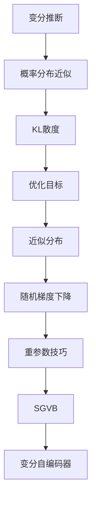

# 变分推断原理与代码实战案例讲解

## 1. 背景介绍

### 1.1 问题的由来

在机器学习和统计建模领域中,我们经常会遇到一些复杂的概率分布,这些分布难以直接对其进行精确的概率计算和推理。例如,在深度学习中,我们需要推断隐藏层的参数分布;在贝叶斯建模中,我们需要推断后验分布;在一些结构化模型中,我们需要推断潜在变量的分布等。这些问题都涉及到对复杂概率分布进行推理和计算的需求。

然而,由于这些复杂概率分布往往具有高维、非凸、存在耦合等特点,使得直接对其进行精确推理和计算变得极其困难,甚至是不可能的。传统的马尔可夫蒙特卡罗(MCMC)方法虽然可以给出无偏估计,但收敛速度通常很慢,尤其是在高维情况下。

### 1.2 研究现状

为了解决这一难题,变分推断(Variational Inference,VI)作为一种重要的近似推断方法应运而生。变分推断的核心思想是:通过优化一个更简单的近似分布,使其与复杂的目标分布尽可能地接近,从而达到近似推断的目的。

变分推断方法的发展经历了从平均场(Mean Field)到结构化平均场(Structured Mean Field)再到更加先进的随机梯度下降变分贝叶斯(Stochastic Gradient Descent Variational Bayes,SGVB)等多个阶段。近年来,随着深度学习的兴起,变分自编码器(Variational Auto-Encoder,VAE)等变分方法在深度生成模型中得到了广泛应用。

### 1.3 研究意义

变分推断方法为我们提供了一种高效、可扩展的近似推断方式,使我们能够在保证一定精度的前提下,对复杂概率模型进行快速推理。这对于诸多领域都具有重要意义:

1. **深度学习**:变分推断为深度生成模型(如VAE)提供了高效的参数估计和推理方法。
2. **贝叶斯建模**:变分贝叶斯方法使我们能够高效地近似复杂后验分布。
3. **结构化模型**:变分推断为推断结构化模型(如图模型)中的潜在变量分布提供了可行方案。
4. **概率编程**:概率编程系统可以利用变分推断方法来高效推断复杂概率模型。

总之,变分推断方法为我们解决了机器学习和统计建模中的一类核心难题,具有重要的理论价值和广阔的应用前景。

### 1.4 本文结构

本文将全面介绍变分推断的原理、算法细节以及实战案例,内容安排如下:

1. 背景介绍
2. 核心概念与联系
3. 核心算法原理与具体操作步骤
4. 数学模型和公式详细讲解与案例分析
5. 项目实践:代码实例和详细解释说明
6. 实际应用场景
7. 工具和资源推荐
8. 总结:未来发展趋势与挑战
9. 附录:常见问题与解答

## 2. 核心概念与联系

变分推断(Variational Inference)的核心思想是通过优化一个更简单的近似分布(Approximate Distribution),使其与复杂的目标分布(Target Distribution)尽可能接近,从而达到对目标分布的近似推断。

这里的"接近"是通过最小化两个分布之间的KL散度(Kullback-Leibler Divergence)来定义的。KL散度可以衡量两个概率分布之间的差异程度,是变分推断优化目标(Optimization Objective)的核心部分。

为了优化近似分布,通常采用基于随机梯度下降(Stochastic Gradient Descent)的方法,结合重参数技巧(Reparameterization Trick)来估计梯度。这种基于随机梯度下降的变分贝叶斯(Stochastic Gradient Variational Bayes,SGVB)方法是现代变分推断的核心算法。

SGVB算法在深度生成模型中的一个典型应用就是变分自编码器(Variational Auto-Encoder,VAE),它使用神经网络来构建编码器和解码器,并通过SGVB算法来高效地推断隐变量的分布。

## 3. 核心算法原理与具体操作步骤

### 3.1 算法原理概述

变分推断算法的核心思想是:

1. 构建一个更简单的近似分布 $q(z)$ 来拟合复杂的目标分布 $p(z)$
2. 定义两个分布之间的KL散度 $KL(q(z)||p(z))$ 作为优化目标
3. 通过优化近似分布 $q(z)$ 的参数,使KL散度最小化,从而使 $q(z)$ 尽可能接近 $p(z)$

具体来说,我们希望找到一个近似分布 $q^*(z)$,使得:

$$q^*(z) = \arg\min_{q(z)} KL(q(z)||p(z))$$

根据KL散度的定义,我们可以将优化目标重写为:

$$q^*(z) = \arg\min_{q(z)} \mathbb{E}_{q(z)}[\log q(z) - \log p(z)]$$

这个目标函数被称为Evidence Lower Bound(ELBO),最小化ELBO等价于最小化KL散度。

由于直接优化ELBO通常是困难的,所以我们通常采用基于随机梯度下降的方法来迭代地优化近似分布的参数,这就是SGVB算法的核心思路。

### 3.2 算法步骤详解

SGVB算法的具体步骤如下:

1. **初始化**:初始化近似分布 $q(z;\phi)$ 的参数 $\phi$
2. **采样**:从 $q(z;\phi)$ 中采样出 $M$ 个样本 $\{z^{(1)}, z^{(2)}, \cdots, z^{(M)}\}$
3. **计算ELBO梯度估计**:
   $$\nabla_\phi \mathcal{L}(\phi) \approx \frac{1}{M}\sum_{m=1}^M \nabla_\phi \log q(z^{(m)};\phi)(\log p(x,z^{(m)}) - \log q(z^{(m)};\phi))$$
4. **梯度上升**:使用优化器(如Adam)根据梯度估计值,对参数 $\phi$ 进行更新
5. **重复步骤2-4**:重复以上采样-计算梯度-更新参数的过程,直到收敛

其中,第3步中的梯度估计公式是利用重参数技巧(Reparameterization Trick)推导得到的。重参数技巧的核心思想是将随机变量 $z$ 重新参数化为确定性变换加上一个辅助噪声项,从而使得采样过程可以被优化。

### 3.3 算法优缺点

**优点**:

1. **高效**:SGVB算法通过有效地近似ELBO梯度,可以快速收敛到较优解。
2. **可扩展**:借助随机梯度下降,SGVB可以有效处理大规模数据和高维模型。
3. **通用性**:SGVB作为一种黑盒推断算法,可以广泛应用于各种概率模型。

**缺点**:

1. **近似性**:SGVB只能给出目标分布的近似解,无法保证收敛到真实后验分布。
2. **参数初始化敏感**:SGVB对初始化参数值比较敏感,不当的初始化可能导致收敛到次优解。
3. **超参数选择**:SGVB涉及多个超参数(如学习率、批量大小等),需要一定技巧来合理设置。

### 3.4 算法应用领域

SGVB算法及其变体已被广泛应用于以下领域:

1. **深度生成模型**:变分自编码器(VAE)、生成对抗网络(GAN)等
2. **贝叶斯神经网络**:通过SGVB对神经网络权重进行贝叶斯推断
3. **主题模型**:对话题模型(如LDA)的隐含主题分布进行变分推断
4. **时序模型**:对隐马尔可夫模型(HMM)和kalman滤波器等进行变分推断
5. **计算机视觉**:对图像分割、目标检测等视觉任务中的潜在变量分布进行变分推断
6. **自然语言处理**:对话模型、机器翻译等任务中的变分推断应用

总的来说,SGVB算法为我们提供了一种通用、高效、可扩展的近似推断方式,在机器学习和统计建模的诸多领域发挥着重要作用。

## 4. 数学模型和公式详细讲解与举例说明

### 4.1 数学模型构建

在正式推导SGVB算法之前,我们先构建一个通用的概率模型。假设我们有一个连续潜在变量 $z$ 和观测数据 $x$,它们的联合分布为:

$$p(x,z) = p(x|z)p(z)$$

其中, $p(x|z)$ 是条件概率密度函数,描述了在给定潜在变量 $z$ 的情况下观测数据 $x$ 的分布;$p(z)$ 是潜在变量 $z$ 的先验分布。

我们的目标是基于观测数据 $x$,推断出潜在变量 $z$ 的后验分布 $p(z|x)$。根据贝叶斯公式,我们有:

$$p(z|x) = \frac{p(x|z)p(z)}{p(x)}$$

其中,

$$p(x) = \int p(x|z)p(z)dz$$

是证据(Evidence),它是一个对于 $z$ 的边际分布。

由于证据项 $p(x)$ 往往难以计算,所以直接计算后验分布 $p(z|x)$ 是非常困难的。这就是我们需要借助变分推断的原因。

### 4.2 公式推导过程

我们构建一个更简单的近似分布 $q(z;\phi)$ 来拟合真实的后验分布 $p(z|x)$,其中 $\phi$ 是近似分布的参数。我们的目标是通过优化参数 $\phi$,使得 $q(z;\phi)$ 尽可能接近 $p(z|x)$。

为了衡量两个分布的差异,我们定义KL散度:

$$KL(q(z;\phi)||p(z|x)) = \mathbb{E}_{q(z;\phi)}[\log q(z;\phi) - \log p(z|x)]$$

根据对数证据下界(Evidence Lower Bound, ELBO)的定义,我们有:

$$\begin{aligned}
\log p(x) &= \mathbb{E}_{q(z;\phi)}[\log p(x)] \
          &= \mathbb{E}_{q(z;\phi)}[\log \frac{p(x,z)}{p(z|x)}] \
          &= \mathbb{E}_{q(z;\phi)}[\log p(x,z) - \log q(z;\phi) + \log q(z;\phi) - \log p(z|x)] \
          &= \mathbb{E}_{q(z;\phi)}[\log p(x,z) - \log q(z;\phi)] + KL(q(z;\phi)||p(z|x)) \
          &\geq \mathbb{E}_{q(z;\phi)}[\log p(x,z) - \log q(z;\phi)]
\end{aligned}$$

上式的最后一步是由于KL散度非负性质。

定义:

$$\mathcal{L}(\phi) = \mathbb{E}_{q(z;\phi)}[\log p(x,z) - \log q(z;\phi)]$$

我们有:

$$\log p(x) \geq \mathcal{L}(\phi)$$

也就是说, $\mathcal{L}(\phi)$ 是对数证据 $\log p(x)$ 的一个下界,因此被称为Evidence Lower Bound(ELBO)。

最大化ELBO等价于最小化KL散度,因此我们的目标是找到参数 $\phi^*$ 使得:

$$\phi^* = \arg\max_\phi \mathcal{L}(\phi)$$

由于直接优化ELBO通常很困难,我们采用基于随机梯度下降的方式来迭代地优化