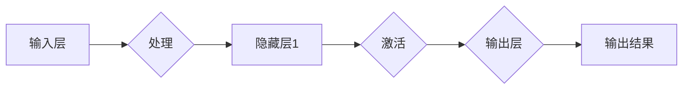

> 神经网络、深度学习、机器学习、人工智能、认知计算、社会进步

# 神经网络：推动社会进步的力量

## 1. 背景介绍

自20世纪50年代以来，人工智能领域经历了多次兴衰。其中，神经网络作为人工智能的核心技术之一，在近年来迎来了前所未有的发展。得益于计算能力的提升和大数据的涌现，神经网络在图像识别、语音识别、自然语言处理等领域的应用取得了突破性的成果，为人类社会带来了深刻的变革。本文将深入探讨神经网络的原理、应用和未来发展趋势，展现其在推动社会进步中的巨大力量。

## 2. 核心概念与联系

### 2.1 核心概念

#### 2.1.1 神经元

神经元是神经网络的基本单元，类似于人脑中的神经元。每个神经元通过突触与其他神经元连接，接收来自其他神经元的信号，并进行计算和输出。

#### 2.1.2 网络结构

神经网络由多个层组成，包括输入层、隐藏层和输出层。输入层接收外部输入，隐藏层对输入数据进行处理，输出层产生最终结果。

#### 2.1.3 激活函数

激活函数用于引入非线性，使神经网络能够学习复杂的非线性关系。常见的激活函数包括Sigmoid、ReLU、Tanh等。

#### 2.1.4 权值和偏置

权值和偏置是神经网络中的可学习参数，用于控制神经元之间的连接强度和偏移。

### 2.2 核心概念原理和架构的 Mermaid 流程图



## 3. 核心算法原理 & 具体操作步骤

### 3.1 算法原理概述

神经网络通过模拟人脑神经元之间的连接和信号传递机制，学习输入数据与输出结果之间的复杂映射关系。其主要原理包括：

- 神经元间的信号传递：输入层的神经元接收输入数据，经过隐藏层处理后，最终由输出层产生结果。
- 权值和偏置的调整：通过梯度下降等优化算法，调整网络中的权值和偏置，使网络的输出结果更接近真实值。
- 激活函数的应用：引入非线性，使神经网络能够学习复杂的非线性关系。

### 3.2 算法步骤详解

1. 初始化网络参数：随机初始化网络的权值和偏置。
2. 前向传播：将输入数据传递到神经网络，计算输出结果。
3. 计算损失：计算输出结果与真实值之间的差异，得到损失函数。
4. 反向传播：根据损失函数计算梯度，反向更新网络的权值和偏置。
5. 重复步骤2-4，直至网络收敛。

### 3.3 算法优缺点

#### 优点：

- 能够处理复杂非线性关系。
- 自动学习输入数据和输出结果之间的映射关系。
- 可用于解决各种机器学习问题，如图像识别、语音识别、自然语言处理等。

#### 缺点：

- 计算复杂度较高，训练过程耗时长。
- 对输入数据的质量和分布敏感。
- 容易过拟合。

### 3.4 算法应用领域

- 图像识别：如人脸识别、物体识别等。
- 语音识别：如语音转文字、语音识别等。
- 自然语言处理：如机器翻译、文本生成等。
- 推荐系统：如电影推荐、商品推荐等。

## 4. 数学模型和公式 & 详细讲解 & 举例说明

### 4.1 数学模型构建

神经网络可以用以下数学模型表示：

$$
y = f(W \cdot x + b)
$$

其中，$y$ 为输出结果，$x$ 为输入数据，$W$ 为权值，$b$ 为偏置，$f$ 为激活函数。

### 4.2 公式推导过程

以下以Sigmoid激活函数为例，介绍神经网络公式的推导过程。

#### Sigmoid激活函数：

$$
f(x) = \frac{1}{1 + e^{-x}}
$$

#### 前向传播：

$$
y = f(W \cdot x + b)
$$

#### 反向传播：

$$
\frac{\partial L}{\partial W} = (y - t) \cdot f'(x) \cdot x
$$

其中，$L$ 为损失函数，$t$ 为真实标签，$f'(x)$ 为Sigmoid函数的导数。

### 4.3 案例分析与讲解

#### 案例一：图像识别

使用神经网络进行图像识别的流程如下：

1. 将图像数据划分为训练集、验证集和测试集。
2. 使用预训练的神经网络模型（如VGG、ResNet等）作为基础模型。
3. 将训练集数据输入基础模型进行微调，调整网络的权值和偏置。
4. 在验证集上评估模型性能，调整超参数，如学习率、批大小等。
5. 在测试集上评估模型性能，得到最终的识别结果。

#### 案例二：语音识别

使用神经网络进行语音识别的流程如下：

1. 收集语音数据，包括标注的文本。
2. 使用预训练的语音识别模型（如DeepSpeech、Mocha-RNN等）作为基础模型。
3. 将语音数据输入基础模型进行微调，调整网络的权值和偏置。
4. 在测试集上评估模型性能，得到最终的识别结果。

## 5. 项目实践：代码实例和详细解释说明

### 5.1 开发环境搭建

1. 安装Python环境。
2. 安装TensorFlow或PyTorch等深度学习框架。
3. 安装必要的依赖库，如NumPy、SciPy等。

### 5.2 源代码详细实现

以下是一个简单的神经网络实现示例，使用PyTorch框架：

```python
import torch
import torch.nn as nn

class NeuralNetwork(nn.Module):
    def __init__(self):
        super(NeuralNetwork, self).__init__()
        self.fc1 = nn.Linear(784, 128)
        self.fc2 = nn.Linear(128, 10)

    def forward(self, x):
        x = torch.relu(self.fc1(x))
        x = self.fc2(x)
        return x

# 创建神经网络模型
model = NeuralNetwork()

# 定义损失函数和优化器
criterion = nn.CrossEntropyLoss()
optimizer = torch.optim.SGD(model.parameters(), lr=0.01)

# 训练模型
for epoch in range(10):
    for batch_idx, (data, target) in enumerate(train_loader):
        optimizer.zero_grad()
        output = model(data)
        loss = criterion(output, target)
        loss.backward()
        optimizer.step()
        if batch_idx % 100 == 0:
            print(f'Train Epoch: {epoch} [{batch_idx * len(data)}/{len(train_loader.dataset)} ({100. * batch_idx / len(train_loader):.0f}%)]\tLoss: {loss.item():.6f}')

# 保存模型
torch.save(model.state_dict(), 'model.pth')
```

### 5.3 代码解读与分析

以上代码实现了一个非常简单的神经网络，包含一个输入层、一个隐藏层和一个输出层。在训练过程中，使用SGD优化器和交叉熵损失函数进行模型参数的优化。

### 5.4 运行结果展示

运行上述代码，模型将在训练集上进行迭代训练，并打印出每个epoch的损失值。最终，将模型参数保存到`model.pth`文件中，以便后续使用。

## 6. 实际应用场景

### 6.1 医疗领域

神经网络在医疗领域的应用主要包括：

- 疾病诊断：如癌症检测、糖尿病预测等。
- 病理图像分析：如细胞核识别、肿瘤检测等。
- 药物研发：如新药发现、药物筛选等。

### 6.2 金融领域

神经网络在金融领域的应用主要包括：

- 风险评估：如信用评分、贷款审批等。
- 量化交易：如高频交易、算法交易等。
- 智能投顾：如资产配置、投资建议等。

### 6.3 自动驾驶

神经网络在自动驾驶领域的应用主要包括：

- 道路识别：如车道线识别、交通标志识别等。
- 预测：如行人意图预测、障碍物检测等。
- 控制决策：如车辆控制、路径规划等。

## 7. 工具和资源推荐

### 7.1 学习资源推荐

- 《深度学习》（Goodfellow et al.）
- 《神经网络与深度学习》（邱锡鹏）
- Coursera上的《机器学习》课程（Andrew Ng）
- fast.ai的《Practical Deep Learning for Coders》课程

### 7.2 开发工具推荐

- TensorFlow
- PyTorch
- Keras
- Jupyter Notebook

### 7.3 相关论文推荐

- "A Few Useful Things to Know about Machine Learning" (Jürgen Schmidhuber)
- "Deep Learning" (Ian Goodfellow, Yoshua Bengio, Aaron Courville)
- "Convolutional Neural Networks" (Yann LeCun, Yann Bengio, Geoffrey Hinton)

## 8. 总结：未来发展趋势与挑战

### 8.1 研究成果总结

神经网络作为人工智能的核心技术之一，在近年来取得了突破性的进展。通过模拟人脑神经元之间的连接和信号传递机制，神经网络能够学习复杂的非线性关系，并广泛应用于图像识别、语音识别、自然语言处理等领域的实际问题。

### 8.2 未来发展趋势

- 神经网络的规模将进一步扩大，以处理更加复杂的问题。
- 深度学习算法将更加高效，训练时间将大幅缩短。
- 神经网络将与其他人工智能技术（如强化学习、迁移学习等）深度融合，推动人工智能技术的进一步发展。

### 8.3 面临的挑战

- 计算资源消耗巨大，需要更高的计算能力。
- 模型可解释性不足，难以理解模型的决策过程。
- 模型训练数据存在偏差，可能导致歧视性输出。

### 8.4 研究展望

未来，神经网络将在以下方向取得突破：

- 开发更加高效的深度学习算法，降低计算资源消耗。
- 提高模型的可解释性，增强人们对人工智能的信任。
- 优化模型训练数据，减少模型训练数据的偏差。

通过不断努力，神经网络将为人类社会带来更加美好的未来。

## 9. 附录：常见问题与解答

### 9.1 常见问题

#### Q1：什么是神经网络？

A1：神经网络是一种模拟人脑神经元连接和信号传递机制的计算机模型，用于处理复杂的非线性关系。

#### Q2：什么是深度学习？

A2：深度学习是一种使用神经网络进行学习的技术，通过构建多层神经网络，学习输入数据与输出结果之间的复杂映射关系。

#### Q3：神经网络在哪些领域有应用？

A3：神经网络在图像识别、语音识别、自然语言处理、医疗、金融、自动驾驶等领域有广泛应用。

#### Q4：如何提高神经网络的性能？

A4：可以通过增加网络层数、增加每层的神经元数量、选择合适的激活函数、调整优化器等手段提高神经网络的性能。

#### Q5：神经网络训练数据不足怎么办？

A5：可以采用数据增强、迁移学习、半监督学习等方法解决数据不足的问题。

### 9.2 解答

本文已对常见问题进行了详细解答，希望对读者有所帮助。

---

作者：禅与计算机程序设计艺术 / Zen and the Art of Computer Programming