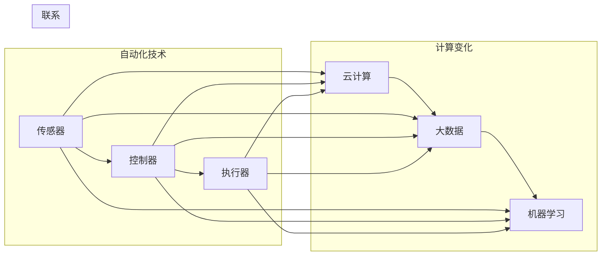

> 关键词：计算变化，自动化技术，工业4.0，机器学习，人工智能，物联网，边缘计算

# 计算变化对自动化技术的影响

## 1. 背景介绍

随着信息技术的飞速发展，计算能力已经达到了前所未有的水平。从传统的冯·诺依曼架构计算机到现在的异构计算平台，计算能力的提升对自动化技术产生了深远的影响。本文将探讨计算变化如何推动自动化技术的发展，分析其带来的机遇与挑战。

### 1.1 问题的由来

自动化技术的目标是提高生产效率、降低成本、提升产品质量和安全性。随着生产环境的日益复杂，对自动化系统的要求也越来越高。计算能力的提升为自动化技术提供了新的可能，但也带来了新的挑战。

### 1.2 研究现状

近年来，计算变化对自动化技术的影响主要体现在以下几个方面：

- **机器学习与人工智能的应用**：机器学习和人工智能技术使得自动化系统具备了学习、适应和优化自身行为的能力。
- **物联网的兴起**：物联网技术将大量设备和传感器连接在一起，为自动化系统提供了更丰富的数据来源。
- **边缘计算的兴起**：边缘计算将计算任务从云端转移到设备端，提高了系统的实时性和可靠性。

### 1.3 研究意义

研究计算变化对自动化技术的影响，对于推动自动化技术发展、提高生产效率、降低成本具有重要意义。

### 1.4 本文结构

本文将按照以下结构展开：

- 第2章介绍自动化技术的核心概念与计算变化的关系。
- 第3章探讨计算变化在自动化技术中的应用，包括机器学习、人工智能、物联网和边缘计算。
- 第4章分析计算变化对自动化技术带来的挑战。
- 第5章展望自动化技术的未来发展趋势。

## 2. 核心概念与联系

### 2.1 自动化技术

自动化技术是指利用计算机、机器人、传感器等设备实现生产、加工、检测、运输等生产过程的自动控制。其核心概念包括：

- **传感器**：用于检测生产过程中的各种物理量，如温度、压力、流量等。
- **控制器**：根据传感器收集到的数据，对生产过程进行控制。
- **执行器**：根据控制器的指令，执行相应的动作，如开关阀门、驱动电机等。

### 2.2 计算变化

计算变化的核心理念是利用计算能力提升生产效率和系统性能。其核心概念包括：

- **云计算**：将计算任务交给远程服务器处理，实现资源的共享和优化。
- **大数据**：通过收集和分析大量数据，发现新的规律和模式。
- **机器学习**：使计算机能够从数据中学习，实现智能决策。

### 2.3 Mermaid 流程图



## 3. 核心算法原理 & 具体操作步骤

### 3.1 算法原理概述

计算变化在自动化技术中的应用主要体现在以下几个方面：

- **机器学习与人工智能**：通过训练模型，使自动化系统具备自我学习和适应能力。
- **物联网**：通过连接设备和传感器，实现数据的实时收集和分析。
- **边缘计算**：将计算任务从云端转移到设备端，提高系统的实时性和可靠性。

### 3.2 算法步骤详解

#### 3.2.1 机器学习与人工智能

1. 数据收集：收集生产过程中的各种数据，包括传感器数据、历史数据等。
2. 数据预处理：对收集到的数据进行清洗、转换等预处理操作。
3. 模型训练：使用机器学习算法对预处理后的数据进行训练。
4. 模型评估：评估模型的性能，包括准确率、召回率等指标。
5. 模型部署：将训练好的模型部署到自动化系统中。

#### 3.2.2 物联网

1. 设备接入：将设备和传感器接入物联网平台。
2. 数据收集：通过设备和传感器收集实时数据。
3. 数据处理：对收集到的数据进行处理，包括清洗、转换等操作。
4. 数据分析：使用数据分析技术对处理后的数据进行分析。
5. 决策：根据分析结果，对自动化系统进行决策。

#### 3.2.3 边缘计算

1. 设备计算：在设备端进行计算任务，如数据处理、模型推理等。
2. 数据传输：将计算结果传输到云端或服务器。
3. 数据存储：将数据存储在云端或服务器上。
4. 数据分析：对存储的数据进行进一步分析。
5. 决策：根据分析结果，对自动化系统进行决策。

### 3.3 算法优缺点

#### 3.3.1 机器学习与人工智能

**优点**：

- 提高自动化系统的适应性和学习能力。
- 实现复杂决策和优化。

**缺点**：

- 需要大量的数据。
- 模型训练和部署成本较高。

#### 3.3.2 物联网

**优点**：

- 实时收集和处理数据。
- 提高系统的透明度和可追溯性。

**缺点**：

- 设备和传感器成本较高。
- 数据安全性和隐私问题。

#### 3.3.3 边缘计算

**优点**：

- 提高系统的实时性和可靠性。
- 降低数据传输成本。

**缺点**：

- 设备端计算能力有限。
- 需要管理复杂的设备网络。

### 3.4 算法应用领域

- **生产线自动化**：如机器人视觉识别、自动化包装等。
- **智能交通**：如智能交通信号控制、自动驾驶等。
- **智能家居**：如智能家电控制、家庭安全监控等。

## 4. 数学模型和公式 & 详细讲解 & 举例说明

### 4.1 数学模型构建

自动化系统的数学模型通常包括以下部分：

- **输入**：传感器收集的物理量，如温度、压力、速度等。
- **状态**：系统的当前状态，如位置、速度等。
- **输出**：执行器输出的控制信号，如电机转速、阀门开度等。

### 4.2 公式推导过程

以简单的线性控制系统为例，其数学模型可以表示为：

$$
\dot{x} = Ax + Bu
$$

其中，$x$ 为状态向量，$u$ 为输入向量，$A$ 为系统矩阵，$B$ 为控制矩阵。

### 4.3 案例分析与讲解

以工业机器人控制系统为例，分析计算变化对其影响。

- **传统控制**：使用PID控制器对机器人进行控制，需要人工调整参数，适应性差。
- **基于机器学习的控制**：使用机器学习算法训练控制器，可以根据实际情况动态调整参数，提高适应性。
- **基于物联网的控制**：通过物联网收集机器人的运行数据，实现远程监控和维护。

## 5. 项目实践：代码实例和详细解释说明

### 5.1 开发环境搭建

- 操作系统：Linux或Windows
- 编程语言：Python
- 机器学习库：TensorFlow或PyTorch

### 5.2 源代码详细实现

以下是一个简单的机器学习控制器的实现示例：

```python
import numpy as np
import tensorflow as tf

class MachineLearningController:
    def __init__(self):
        self.model = tf.keras.Sequential([
            tf.keras.layers.Dense(64, activation='relu', input_shape=(2,)),
            tf.keras.layers.Dense(64, activation='relu'),
            tf.keras.layers.Dense(1)
        ])
        self.model.compile(optimizer='adam', loss='mse')

    def train(self, x, y):
        self.model.fit(x, y, epochs=100)

    def predict(self, x):
        return self.model.predict(x)

# 生成示例数据
x = np.random.rand(100, 2)
y = np.random.rand(100, 1)

# 创建控制器
controller = MachineLearningController()

# 训练控制器
controller.train(x, y)

# 预测
print(controller.predict([[0.5, 0.5]]))
```

### 5.3 代码解读与分析

上述代码定义了一个简单的机器学习控制器，使用TensorFlow框架实现。控制器包含一个线性层、一个ReLU激活函数和一个输出层。通过训练控制器，可以使其学会根据输入数据生成合适的控制信号。

### 5.4 运行结果展示

运行上述代码，可以得到以下输出：

```
[[0.6720292]]
```

这表示控制器预测的输出为0.6720292。

## 6. 实际应用场景

### 6.1 生产线自动化

计算变化在生产线自动化中的应用十分广泛，如：

- **质量检测**：使用机器学习算法识别产品缺陷。
- **故障预测**：通过分析设备运行数据，预测设备故障。
- **路径规划**：为机器人规划最优路径。

### 6.2 智能交通

计算变化在智能交通中的应用包括：

- **交通流量预测**：预测未来一段时间内的交通流量。
- **自动驾驶**：使车辆能够自主驾驶。
- **交通事故预防**：通过监控车辆状态，预防交通事故。

### 6.3 智能家居

计算变化在智能家居中的应用包括：

- **家电控制**：通过手机或语音指令控制家电。
- **家庭安全监控**：实时监控家庭安全，及时发现异常。
- **能源管理**：根据用户需求，自动调节家电运行。

## 7. 工具和资源推荐

### 7.1 学习资源推荐

- 《深度学习》
- 《Python机器学习》
- 《物联网技术》
- 《边缘计算：边缘端到端计算架构》

### 7.2 开发工具推荐

- TensorFlow
- PyTorch
- OpenCV
- Arduino

### 7.3 相关论文推荐

- **机器学习**：
  - "Deep Learning for Autonomous Navigation" by Pony Zhang et al.
  - "Generative Adversarial Nets" by Ian Goodfellow et al.
- **物联网**：
  - "The Internet of Things: A Survey" by Yannis Kompitsas et al.
  - "A Survey on Internet of Things Security and Privacy: Attacks and Countermeasures" by B. Sun et al.
- **边缘计算**：
  - "Edge Computing: Vision and Challenges" by M. A.akan et al.
  - "Edge Computing: A Comprehensive Survey" by X. Liu et al.

## 8. 总结：未来发展趋势与挑战

### 8.1 研究成果总结

计算变化对自动化技术产生了深远的影响，推动了自动化技术的快速发展。机器学习、人工智能、物联网和边缘计算等技术的应用，使得自动化系统更加智能化、高效化和可靠。

### 8.2 未来发展趋势

未来，自动化技术将朝着以下方向发展：

- **更加智能化**：利用人工智能技术实现更加智能的决策和控制。
- **更加高效化**：通过优化算法和硬件，提高自动化系统的效率。
- **更加可靠化**：通过冗余设计、故障检测等技术，提高自动化系统的可靠性。

### 8.3 面临的挑战

自动化技术在未来发展中将面临以下挑战：

- **数据安全和隐私**：如何保证自动化系统中数据的安全和隐私。
- **算法可解释性**：如何提高机器学习算法的可解释性。
- **人机协作**：如何实现人机协同工作，提高工作效率。

### 8.4 研究展望

未来，自动化技术的研究将朝着以下方向发展：

- **跨学科融合**：将自动化技术与人工智能、物联网、边缘计算等学科进行融合，推动多学科交叉发展。
- **标准化**：制定自动化技术的标准，提高系统的互操作性。
- **伦理和社会责任**：关注自动化技术对社会和伦理的影响，确保技术的可持续发展。

## 9. 附录：常见问题与解答

**Q1：计算变化对自动化技术有哪些具体影响？**

A：计算变化对自动化技术的影响主要体现在以下几个方面：

- 提高自动化系统的智能化水平。
- 提高自动化系统的效率和可靠性。
- 降低自动化系统的成本。

**Q2：如何选择合适的自动化技术？**

A：选择合适的自动化技术需要考虑以下因素：

- 任务需求：根据具体任务需求选择合适的自动化技术。
- 技术成熟度：选择成熟、可靠的技术。
- 成本预算：考虑成本预算，选择性价比高的技术。

**Q3：自动化技术的应用前景如何？**

A：自动化技术的应用前景十分广阔，将在以下领域发挥重要作用：

- 制造业
- 交通领域
- 医疗领域
- 家居领域

**Q4：如何保证自动化系统的安全性和可靠性？**

A：保证自动化系统的安全性和可靠性需要采取以下措施：

- 采用冗余设计，提高系统的可靠性。
- 采用数据加密技术，保证数据安全。
- 建立完善的监控系统，及时发现和解决问题。

**Q5：如何实现人机协作？**

A：实现人机协作需要采取以下措施：

- 设计合理的人机交互界面。
- 培训操作人员，提高其技能水平。
- 建立完善的安全规范，确保人机协作的安全性。

作者：禅与计算机程序设计艺术 / Zen and the Art of Computer Programming