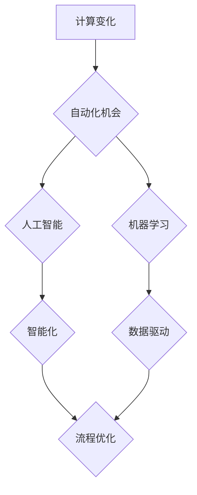

## 计算变化带来的自动化机会

> 关键词：自动化、人工智能、机器学习、流程优化、数据分析、软件开发、效率提升

### 1. 背景介绍

在当今数字时代，计算能力的飞速发展正在深刻地改变着我们生活的方方面面。从智能手机到云计算，从自动驾驶到个性化推荐，计算技术正在推动着社会进步和经济发展。而自动化，作为计算技术的重要应用之一，正在成为推动这一变革的关键力量。

自动化是指利用技术手段，使系统或流程能够自动执行预先定义的任务，从而解放人力，提高效率，降低成本。随着人工智能、机器学习等技术的不断发展，自动化技术正在变得越来越智能化、精准化和普惠化。

### 2. 核心概念与联系

**2.1 自动化概念**

自动化是指利用技术手段，使系统或流程能够自动执行预先定义的任务，从而解放人力，提高效率，降低成本。

**2.2 人工智能与自动化**

人工智能（AI）是赋予机器以类似人类智能的能力，例如学习、推理和决策。AI技术为自动化提供了强大的驱动力，使自动化系统能够更加智能化、自主化和适应性强。

**2.3 机器学习与自动化**

机器学习是人工智能的一个子领域，它使机器能够从数据中学习，并根据学习到的知识自动执行任务。机器学习算法可以帮助自动化系统识别模式、预测结果和进行决策，从而提高自动化系统的效率和准确性。

**2.4 流程图**



### 3. 核心算法原理 & 具体操作步骤

**3.1 算法原理概述**

自动化算法的核心原理是通过预先定义的规则或模型，自动执行任务。常见的自动化算法包括：

* **规则引擎:** 基于预先定义的规则，对输入数据进行判断和决策。
* **流程自动化引擎:** 自动化执行业务流程，例如审批流程、订单处理流程等。
* **机器学习算法:** 从数据中学习，并根据学习到的知识自动执行任务。

**3.2 算法步骤详解**

自动化算法的具体操作步骤通常包括以下几个阶段：

1. **需求分析:** 明确自动化目标和任务范围。
2. **流程建模:** 建立自动化任务的流程图或模型。
3. **规则定义或模型训练:** 根据任务需求，定义自动化规则或训练机器学习模型。
4. **系统集成:** 将自动化系统与现有系统集成。
5. **测试和部署:** 对自动化系统进行测试，并部署到生产环境。
6. **监控和维护:** 监控自动化系统的运行状态，并进行必要的维护和优化。

**3.3 算法优缺点**

**优点:**

* **提高效率:** 自动化可以解放人力，提高工作效率。
* **降低成本:** 自动化可以减少人工成本和错误成本。
* **提高准确性:** 自动化系统可以执行任务更加准确和一致。
* **提高安全性:** 自动化可以减少人为错误，提高系统安全性。

**缺点:**

* **初始投资成本高:** 自动化系统需要一定的开发和部署成本。
* **维护成本:** 自动化系统需要定期维护和更新。
* **缺乏灵活性:** 一些自动化系统难以适应变化的需求。
* **可能导致失业:** 自动化可能会取代一些人工工作。

**3.4 算法应用领域**

自动化技术广泛应用于各个领域，例如：

* **制造业:** 自动化生产线、机器人操作
* **金融业:** 自动化交易、风险管理
* **医疗保健业:** 自动化诊断、药物研发
* **零售业:** 自动化库存管理、客户服务
* **IT业:** 自动化运维、代码生成

### 4. 数学模型和公式 & 详细讲解 & 举例说明

**4.1 数学模型构建**

自动化过程可以抽象为一个数学模型，其中输入是任务需求，输出是自动化解决方案。

**4.2 公式推导过程**

自动化算法的性能可以评估为：

$$
Accuracy = \frac{TP + TN}{TP + TN + FP + FN}
$$

其中：

* TP: 真阳性 (True Positive)
* TN: 真阴性 (True Negative)
* FP: 假阳性 (False Positive)
* FN: 假阴性 (False Negative)

**4.3 案例分析与讲解**

例如，在图像识别任务中，我们可以使用机器学习算法训练一个模型，识别图像中的物体。模型的准确率可以根据公式计算，并根据准确率进行模型优化。

### 5. 项目实践：代码实例和详细解释说明

**5.1 开发环境搭建**

* 操作系统: Ubuntu 20.04
* 编程语言: Python 3.8
* 开发工具: PyCharm

**5.2 源代码详细实现**

```python
import pandas as pd
from sklearn.model_selection import train_test_split
from sklearn.linear_model import LogisticRegression
from sklearn.metrics import accuracy_score

# 加载数据
data = pd.read_csv("data.csv")

# 分割数据
X = data.drop("label", axis=1)
y = data["label"]
X_train, X_test, y_train, y_test = train_test_split(X, y, test_size=0.2, random_state=42)

# 训练模型
model = LogisticRegression()
model.fit(X_train, y_train)

# 预测结果
y_pred = model.predict(X_test)

# 计算准确率
accuracy = accuracy_score(y_test, y_pred)
print("准确率:", accuracy)
```

**5.3 代码解读与分析**

这段代码实现了简单的图像分类任务。首先，加载数据并将其分割为训练集和测试集。然后，使用逻辑回归模型训练分类器。最后，使用训练好的模型对测试集进行预测，并计算模型的准确率。

**5.4 运行结果展示**

运行代码后，会输出模型的准确率。

### 6. 实际应用场景

**6.1 自动化测试**

自动化测试可以自动执行软件测试用例，提高测试效率和覆盖率。

**6.2 代码生成**

代码生成工具可以根据用户需求自动生成代码，提高开发效率。

**6.3 数据分析**

自动化数据分析工具可以自动收集、清洗、分析和可视化数据，帮助用户洞察数据背后的规律。

**6.4 流程优化**

自动化流程优化工具可以分析业务流程，并自动识别和消除流程中的瓶颈和冗余环节，提高流程效率。

**6.5 未来应用展望**

随着人工智能和机器学习技术的不断发展，自动化技术将应用到更多领域，例如：

* **个性化教育:** 自动化系统可以根据学生的学习情况，提供个性化的学习内容和辅导。
* **智能医疗:** 自动化系统可以辅助医生进行诊断、治疗和预防疾病。
* **自动驾驶:** 自动化系统可以控制车辆自动驾驶，提高交通安全和效率。

### 7. 工具和资源推荐

**7.1 学习资源推荐**

* **书籍:**
    * 《自动化测试的艺术》
    * 《机器学习实战》
* **在线课程:**
    * Coursera: 自动化测试、机器学习
    * Udemy: 自动化开发、数据分析

**7.2 开发工具推荐**

* **自动化测试工具:** Selenium, Appium
* **代码生成工具:** GitHub Copilot, Tabnine
* **数据分析工具:** Pandas, Scikit-learn

**7.3 相关论文推荐**

* **自动化测试:**
    * "Automated Software Testing: A Survey"
* **机器学习:**
    * "Deep Learning"
    * "Machine Learning: A Probabilistic Perspective"

### 8. 总结：未来发展趋势与挑战

**8.1 研究成果总结**

自动化技术已经取得了显著的成果，并在各个领域得到了广泛应用。人工智能和机器学习技术的不断发展，为自动化技术提供了强大的驱动力。

**8.2 未来发展趋势**

未来，自动化技术将朝着以下方向发展：

* **更加智能化:** 自动化系统将更加智能化，能够更好地理解和响应用户的需求。
* **更加个性化:** 自动化系统将更加个性化，能够根据用户的不同需求提供定制化的服务。
* **更加安全可靠:** 自动化系统将更加安全可靠，能够更好地保护用户的隐私和数据安全。

**8.3 面临的挑战**

自动化技术的发展也面临着一些挑战：

* **伦理问题:** 自动化技术可能会导致失业和社会不平等，需要认真考虑其伦理问题。
* **安全问题:** 自动化系统可能会被恶意攻击，需要加强其安全防护。
* **可解释性问题:** 一些自动化系统难以解释其决策过程，需要提高其可解释性。

**8.4 研究展望**

未来，我们需要继续研究和探索自动化技术的应用，并积极应对其带来的挑战，以确保自动化技术能够更好地服务于人类社会。

### 9. 附录：常见问题与解答

**9.1 自动化会取代所有工作吗？**

自动化技术可能会取代一些重复性、规则性工作，但不会取代所有工作。未来，人类需要更加注重创造性、创新性和解决复杂问题的能力。

**9.2 如何学习自动化技术？**

学习自动化技术可以从以下几个方面入手：

* 学习编程语言，例如Python。
* 学习自动化测试工具，例如Selenium。
* 学习机器学习算法，例如逻辑回归。
* 参加在线课程或培训。

**9.3 自动化技术有哪些应用场景？**

自动化技术广泛应用于各个领域，例如：

* 制造业
* 金融业
* 医疗保健业
* 零售业
* IT业


作者：禅与计算机程序设计艺术 / Zen and the Art of Computer Programming 
