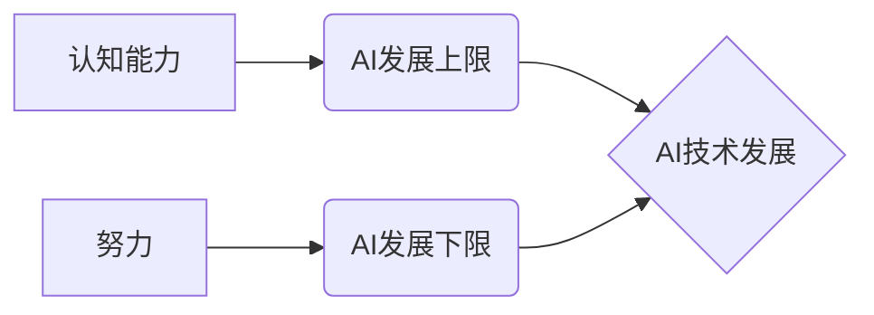

## 认知决定上限，努力决定下限

> 关键词：人工智能、认知能力、努力、技术进步、算法、实践、应用场景

### 1. 背景介绍

在当今科技飞速发展的时代，人工智能（AI）正以惊人的速度改变着我们的世界。从自动驾驶汽车到智能语音助手，AI技术已经渗透到我们生活的方方面面。然而，在AI领域的发展过程中，一个重要的命题始终萦绕着人们的思绪：AI的进步究竟受哪些因素制约？

一方面，AI的发展离不开强大的计算能力和海量数据。这些资源为AI模型提供了训练和学习的基石。另一方面，AI的进步也与人类的认知能力息息相关。人类的创造力和想象力是推动AI技术发展的源泉。

本文将探讨AI发展中的一个关键问题：**认知决定上限，努力决定下限**。我们将分析认知能力如何影响AI的发展上限，以及如何通过努力和实践不断突破这些上限。

### 2. 核心概念与联系

**2.1 认知能力与AI上限**

认知能力是指人类通过感知、思考、学习和解决问题等方式获取、理解和应用知识的能力。它包括记忆、推理、判断、语言理解、创造力等多个方面。

AI的发展本质上是模拟和超越人类认知能力的过程。然而，人类的认知能力是极其复杂的，涉及到大量的抽象思维、情感判断和社会交互等因素。目前，AI技术还无法完全复制和模拟这些复杂的认知过程。

因此，人类的认知能力可以看作是AI发展的一个上限。AI的发展只能在人类认知能力的范围内进行，而无法超越人类认知的边界。

**2.2 努力与AI下限**

尽管认知能力决定了AI发展的上限，但努力和实践可以不断推动AI技术的发展下限。

努力是指人类在AI领域不断探索、创新和改进。它包括：

* **算法研究:** 开发更强大、更智能的算法，以提高AI模型的性能和能力。
* **数据积累:** 收集和整理海量数据，为AI模型提供更丰富的训练素材。
* **硬件提升:** 开发更强大的计算硬件，以支持更复杂的AI模型训练和运行。
* **应用场景拓展:** 将AI技术应用到更多领域，探索AI技术的无限可能。

实践是指将AI技术应用到实际场景中，不断验证和改进算法，并根据实际需求进行调整和优化。

通过不断的努力和实践，人类可以不断突破AI技术的下限，将AI技术应用到更广泛的领域，解决更多实际问题。

**2.3 核心概念关系图**



### 3. 核心算法原理 & 具体操作步骤

**3.1 算法原理概述**

深度学习算法是目前AI领域最热门和最有效的算法之一。它通过构建多层神经网络，模拟人类大脑的学习过程，从而实现对复杂数据的学习和理解。

深度学习算法的核心原理是**反向传播算法**。该算法通过不断调整神经网络的权重，使模型的输出与实际目标值之间的误差最小化。

**3.2 算法步骤详解**

1. **数据预处理:** 将原始数据进行清洗、转换和格式化，使其适合深度学习模型的训练。
2. **网络结构设计:** 根据具体任务需求，设计深度神经网络的结构，包括神经元数量、层数和激活函数等。
3. **参数初始化:** 为神经网络中的权重和偏置赋予初始值。
4. **前向传播:** 将输入数据通过神经网络进行传递，计算输出结果。
5. **损失函数计算:** 计算模型输出与实际目标值之间的误差。
6. **反向传播:** 根据误差信号，反向传播到神经网络的各层，调整权重和偏置。
7. **优化算法:** 使用优化算法，例如梯度下降法，更新权重和偏置，使模型的误差最小化。
8. **模型评估:** 使用测试数据评估模型的性能，例如准确率、召回率等。
9. **模型调优:** 根据评估结果，调整网络结构、参数和训练策略，进一步提高模型性能。

**3.3 算法优缺点**

**优点:**

* **高精度:** 深度学习算法能够学习到复杂的数据模式，从而实现高精度的预测和分类。
* **自动化特征提取:** 深度学习模型能够自动学习数据中的特征，无需人工特征工程。
* **泛化能力强:** 深度学习模型能够对新的数据进行泛化，并取得良好的预测效果。

**缺点:**

* **数据依赖性强:** 深度学习算法需要大量的训练数据才能达到良好的性能。
* **计算资源消耗大:** 深度学习模型训练需要大量的计算资源，例如GPU。
* **可解释性差:** 深度学习模型的决策过程较为复杂，难以解释其背后的逻辑。

**3.4 算法应用领域**

深度学习算法已广泛应用于各个领域，例如：

* **图像识别:** 人脸识别、物体检测、图像分类等。
* **自然语言处理:** 语义理解、机器翻译、文本生成等。
* **语音识别:** 语音转文本、语音合成等。
* **推荐系统:** 商品推荐、内容推荐等。
* **医疗诊断:** 病情预测、疾病诊断等。

### 4. 数学模型和公式 & 详细讲解 & 举例说明

**4.1 数学模型构建**

深度学习模型可以看作是一个复杂的数学模型，其核心是**神经网络**。神经网络由多个层组成，每一层包含多个神经元。每个神经元接收来自上一层的输入信号，并通过激活函数进行处理，输出到下一层。

**4.2 公式推导过程**

深度学习模型的训练过程本质上是一个**优化问题**。目标是找到最优的模型参数，使得模型的输出与实际目标值之间的误差最小化。

常用的优化算法是**梯度下降法**。梯度下降法的核心思想是沿着误差梯度的反方向更新模型参数，从而逐渐降低误差。

梯度下降法的公式如下：

$$
\theta = \theta - \alpha \nabla L(\theta)
$$

其中：

* $\theta$ 是模型参数
* $\alpha$ 是学习率
* $L(\theta)$ 是损失函数

**4.3 案例分析与讲解**

假设我们有一个简单的线性回归问题，目标是预测房价。

我们可以使用一个单层神经网络模型，其中只有一个神经元。

模型的输入是房屋面积，输出是房价。

损失函数可以选用均方误差函数。

通过梯度下降法，我们可以不断更新模型参数，使得模型的预测结果与实际房价之间的误差最小化。

### 5. 项目实践：代码实例和详细解释说明

**5.1 开发环境搭建**

为了实现深度学习模型的开发和训练，我们需要搭建一个合适的开发环境。

常用的深度学习框架包括TensorFlow、PyTorch、Keras等。

我们可以选择其中一个框架，并根据其官方文档进行环境搭建。

**5.2 源代码详细实现**

以下是一个使用TensorFlow框架实现简单的线性回归模型的代码示例：

```python
import tensorflow as tf

# 定义模型参数
W = tf.Variable(0.0, dtype=tf.float32)
b = tf.Variable(0.0, dtype=tf.float32)

# 定义模型输入和输出
x = tf.placeholder(tf.float32, name="x")
y = tf.placeholder(tf.float32, name="y")

# 定义模型预测结果
y_pred = W * x + b

# 定义损失函数
loss = tf.reduce_mean(tf.square(y_pred - y))

# 定义优化算法
optimizer = tf.train.GradientDescentOptimizer(learning_rate=0.01)
train_op = optimizer.minimize(loss)

# 初始化变量
init = tf.global_variables_initializer()

# 创建会话
with tf.Session() as sess:
    sess.run(init)

    # 训练模型
    for i in range(1000):
        sess.run(train_op, feed_dict={x: [1.0, 2.0, 3.0], y: [2.0, 4.0, 6.0]})

    # 获取模型参数
    W_val, b_val = sess.run([W, b])

    # 打印模型参数
    print("W:", W_val)
    print("b:", b_val)
```

**5.3 代码解读与分析**

这段代码首先定义了模型参数W和b，以及模型输入和输出。然后定义了损失函数和优化算法，并使用梯度下降法训练模型。

训练过程中，我们使用训练数据对模型进行迭代更新，直到模型的损失函数达到最小值。

最后，我们获取了模型训练后的参数W和b，并打印出来。

**5.4 运行结果展示**

运行这段代码后，我们可以看到模型训练后的参数W和b的值。

这些参数代表了模型对房价的预测关系。

我们可以使用这些参数来预测新的房价。

### 6. 实际应用场景

**6.1 医疗诊断**

深度学习算法可以用于分析医学图像，例如X光片、CT扫描和MRI扫描，以辅助医生诊断疾病。

例如，深度学习模型可以用于检测肺癌、乳腺癌和脑肿瘤等疾病。

**6.2 金融风险评估**

深度学习算法可以用于分析金融数据，例如股票价格、交易记录和客户信息，以评估金融风险。

例如，深度学习模型可以用于识别欺诈交易、预测股票价格波动和评估客户信用风险。

**6.3 自动驾驶**

深度学习算法是自动驾驶汽车的核心技术之一。

深度学习模型可以用于识别道路上的物体，例如车辆、行人、交通信号灯等，并根据这些信息做出驾驶决策。

**6.4 未来应用展望**

随着人工智能技术的不断发展，深度学习算法将在更多领域得到应用。

例如，深度学习算法可以用于个性化教育、智能家居、机器人技术等领域。

### 7. 工具和资源推荐

**7.1 学习资源推荐**

* **深度学习课程:** Coursera、edX、Udacity等平台提供丰富的深度学习课程。
* **深度学习书籍:** 《深度学习》、《动手学深度学习》等书籍是深度学习学习的经典教材。
* **深度学习博客:** TensorFlow博客、PyTorch博客等博客提供最新的深度学习技术资讯和案例分享。

**7.2 开发工具推荐**

* **TensorFlow:** Google开发的开源深度学习框架。
* **PyTorch:** Facebook开发的开源深度学习框架。
* **Keras:** 构建深度学习模型的简单易用的高层API。

**7.3 相关论文推荐**

* **AlexNet:** 《ImageNet Classification with Deep Convolutional Neural Networks》
* **VGGNet:** 《Very Deep Convolutional Networks for Large-Scale Image Recognition》
* **ResNet:** 《Deep Residual Learning for Image Recognition》

### 8. 总结：未来发展趋势与挑战

**8.1 研究成果总结**

近年来，深度学习算法取得了令人瞩目的成就，在图像识别、自然语言处理、语音识别等领域取得了突破性的进展。

这些成果证明了深度学习算法的强大潜力，并推动了人工智能技术的快速发展。

**8.2 未来发展趋势**

未来，深度学习算法将朝着以下几个方向发展：

* **模型更深更广:** 研究更深层次、更广阔结构的神经网络模型，以提高模型的表达能力和泛化能力。
* **数据更丰富更智能:** 收集和利用更多类型、更高质量的数据，并开发更智能的数据处理和分析方法。
* **算法更有效更鲁棒:** 研究更有效的训练算法和正则化方法，提高模型的训练效率和鲁棒性。
* **应用更广泛更深入:** 将深度学习算法应用到更多领域，并深入到各个行业的各个环节。

**8.3 面临的挑战**

深度学习算法也面临着一些挑战：