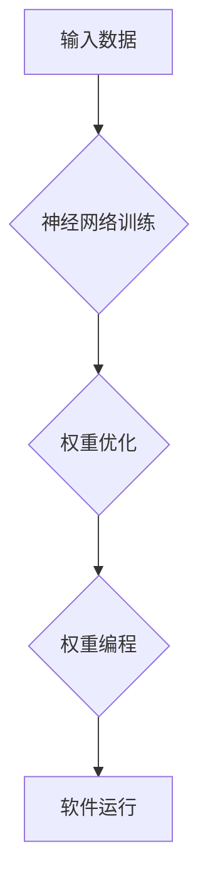

## 软件2.0:神经网络权重作为新的编程语言

> 关键词：神经网络、权重编程、软件架构、人工智能、机器学习、编程语言、软件2.0

## 1. 背景介绍

软件开发领域一直在不断演进，从最初的低级语言到如今的各种高级语言，我们一直在探索更简洁、更强大的表达方式来描述软件的行为。然而，随着人工智能技术的飞速发展，一个全新的概念正在逐渐浮现：**将神经网络权重作为新的编程语言**。

传统的编程语言依赖于人类设计的指令和逻辑，而神经网络权重则由机器学习算法自动学习和调整。这种转变意味着软件开发将从人工设计转向数据驱动，从明确的规则转向灵活的适应。

## 2. 核心概念与联系

### 2.1 神经网络权重

神经网络权重是连接神经元之间的参数，决定了神经元之间信息传递的强度。通过训练，神经网络会不断调整这些权重，以最小化预测误差，从而学习数据中的模式和规律。

### 2.2 权重编程

权重编程是一种全新的编程范式，将神经网络权重作为程序的代码。这意味着，我们可以直接操作和修改神经网络的权重，从而控制程序的行为。

### 2.3 软件2.0

软件2.0是指基于神经网络权重编程的新一代软件。它具有以下特点：

* **数据驱动:** 软件的行为由数据驱动，而不是人工设计的规则。
* **自适应:** 软件能够根据数据变化自动调整行为，实现更灵活的适应能力。
* **黑盒化:** 软件内部的决策过程可能难以理解，但能够通过数据验证其有效性。

**Mermaid 流程图**



## 3. 核心算法原理 & 具体操作步骤

### 3.1 算法原理概述

权重编程的核心算法是神经网络训练算法，例如反向传播算法。通过训练，神经网络会学习到数据中的模式和规律，并将这些模式编码到权重中。

### 3.2 算法步骤详解

1. **数据预处理:** 将输入数据转换为神经网络可以理解的格式。
2. **网络结构设计:** 根据任务需求设计神经网络的结构，包括神经元的数量、连接方式等。
3. **权重初始化:** 为神经网络的权重赋予初始值。
4. **前向传播:** 将输入数据通过神经网络传递，得到输出结果。
5. **损失函数计算:** 计算输出结果与真实值的差异，即损失函数值。
6. **反向传播:** 根据损失函数值，反向传播误差信息，更新神经网络的权重。
7. **迭代训练:** 重复步骤4-6，直到损失函数值达到预设阈值。

### 3.3 算法优缺点

**优点:**

* **强大的学习能力:** 神经网络能够学习到复杂的数据模式，实现高精度预测。
* **自适应性强:** 软件能够根据数据变化自动调整行为，适应不断变化的环境。
* **可解释性提升:** 通过分析权重，可以更好地理解软件的行为逻辑。

**缺点:**

* **训练成本高:** 神经网络训练需要大量的计算资源和时间。
* **黑盒化问题:** 神经网络的决策过程难以理解，缺乏透明度。
* **数据依赖性强:** 软件的性能取决于训练数据的质量和数量。

### 3.4 算法应用领域

权重编程技术在多个领域具有广泛的应用前景，例如：

* **自然语言处理:** 机器翻译、文本生成、情感分析等。
* **计算机视觉:** 图像识别、物体检测、图像生成等。
* **推荐系统:** 商品推荐、内容推荐、用户画像等。
* **自动驾驶:** 路径规划、目标识别、决策控制等。

## 4. 数学模型和公式 & 详细讲解 & 举例说明

### 4.1 数学模型构建

神经网络可以看作是一个复杂的数学模型，其核心是**激活函数**和**权重矩阵**。

* **激活函数:** 用于将神经元的输入转换为输出，引入非线性，使神经网络能够学习复杂的数据模式。常见的激活函数包括 sigmoid 函数、ReLU 函数等。
* **权重矩阵:** 连接神经元之间的参数，决定了信息传递的强度。

### 4.2 公式推导过程

反向传播算法的核心是**梯度下降**，通过不断更新权重，最小化损失函数值。

损失函数: $$L(W) = \frac{1}{N} \sum_{i=1}^{N} (y_i - \hat{y}_i)^2$$

其中:

* $W$ 是权重矩阵
* $N$ 是样本数量
* $y_i$ 是真实值
* $\hat{y}_i$ 是预测值

梯度: $$\frac{\partial L(W)}{\partial W} = \frac{1}{N} \sum_{i=1}^{N} (y_i - \hat{y}_i) \cdot \frac{\partial \hat{y}_i}{\partial W}$$

权重更新: $$W = W - \alpha \cdot \frac{\partial L(W)}{\partial W}$$

其中:

* $\alpha$ 是学习率

### 4.3 案例分析与讲解

假设我们有一个简单的线性回归问题，目标是预测房价。我们可以使用一个单层神经网络，输入房屋面积，输出房价。

通过训练，神经网络会学习到房屋面积与房价之间的关系，并将这个关系编码到权重中。最终，我们可以使用训练好的神经网络权重来预测新的房屋价格。

## 5. 项目实践：代码实例和详细解释说明

### 5.1 开发环境搭建

* Python 3.x
* TensorFlow 或 PyTorch 等深度学习框架

### 5.2 源代码详细实现

```python
import tensorflow as tf

# 定义模型
model = tf.keras.models.Sequential([
  tf.keras.layers.Dense(units=1, input_shape=[1])
])

# 编译模型
model.compile(optimizer='sgd', loss='mean_squared_error')

# 训练模型
model.fit(x_train, y_train, epochs=100)

# 保存模型权重
model.save_weights('model_weights.h5')
```

### 5.3 代码解读与分析

* 我们使用 TensorFlow 框架构建了一个简单的线性回归模型。
* 模型只有一个全连接层，输入维度为1，输出维度为1。
* 我们使用随机梯度下降算法进行模型训练，损失函数为均方误差。
* 训练完成后，我们保存了模型的权重到 `model_weights.h5` 文件中。

### 5.4 运行结果展示

通过加载保存的权重，我们可以使用训练好的模型进行预测。

```python
# 加载模型权重
model.load_weights('model_weights.h5')

# 预测房价
predicted_price = model.predict([house_area])
```

## 6. 实际应用场景

### 6.1 个性化推荐系统

权重编程可以用于构建个性化推荐系统，根据用户的历史行为和偏好，推荐更符合其需求的内容。

### 6.2 智能客服系统

权重编程可以用于构建智能客服系统，通过自然语言处理技术，理解用户的需求并提供相应的帮助。

### 6.3 自动化测试

权重编程可以用于构建自动化测试系统，通过学习代码的结构和行为，自动生成测试用例。

### 6.4 未来应用展望

随着人工智能技术的不断发展，权重编程技术将有更广泛的应用场景，例如：

* **自动代码生成:** 根据需求描述自动生成代码。
* **代码优化:** 通过学习代码的结构和性能，自动优化代码效率。
* **软件故障诊断:** 通过学习软件的行为模式，自动诊断软件故障。

## 7. 工具和资源推荐

### 7.1 学习资源推荐

* **书籍:**
    * Deep Learning by Ian Goodfellow, Yoshua Bengio, and Aaron Courville
    * Hands-On Machine Learning with Scikit-Learn, Keras & TensorFlow by Aurélien Géron
* **在线课程:**
    * TensorFlow Tutorials: https://www.tensorflow.org/tutorials
    * PyTorch Tutorials: https://pytorch.org/tutorials/

### 7.2 开发工具推荐

* **TensorFlow:** https://www.tensorflow.org/
* **PyTorch:** https://pytorch.org/
* **Keras:** https://keras.io/

### 7.3 相关论文推荐

* **Weight Agnostic Neural Networks**
* **Learning Transferable Features with Deep Neural Networks**
* **Attention Is All You Need**

## 8. 总结：未来发展趋势与挑战

### 8.1 研究成果总结

权重编程技术是一个新兴的领域，已经取得了一些重要的研究成果。例如，一些研究表明，权重编程可以实现比传统编程更灵活和高效的软件开发。

### 8.2 未来发展趋势

未来，权重编程技术将朝着以下几个方向发展:

* **更强大的学习能力:** 研究更先进的神经网络架构和训练算法，提高软件的学习能力和性能。
* **更易于理解和解释:** 研究更易于理解和解释的权重编程模型，提高软件的可解释性和透明度。
* **更广泛的应用场景:** 将权重编程技术应用到更多领域，例如自动代码生成、代码优化等。

### 8.3 面临的挑战

权重编程技术也面临一些挑战:

* **训练成本高:** 神经网络训练需要大量的计算资源和时间，这对于小型企业和个人开发者来说是一个障碍。
* **黑盒化问题:** 神经网络的决策过程难以理解，这可能会导致软件的不可靠性和安全性问题。
* **标准化问题:** 目前还没有统一的权重编程标准，这可能会导致不同平台和工具之间互不兼容。

### 8.4 研究展望

未来，我们需要继续研究权重编程技术，克服其面临的挑战，并将其应用到更多领域，从而推动软件开发的创新和进步。

## 9. 附录：常见问题与解答

**Q1: 权重编程与传统编程有什么区别？**

**A1:** 传统的编程语言依赖于人类设计的指令和逻辑，而权重编程则将神经网络权重作为程序的代码。这意味着，我们可以直接操作和修改神经网络的权重，从而控制程序的行为。

**Q2: 权重编程的学习难度如何？**

**A2:** 权重编程需要一定的数学和编程基础，但随着深度学习框架的不断发展，学习门槛也在逐渐降低。

**Q3: 权重编程的应用场景有哪些？**

**A3:** 权重编程技术在多个领域具有广泛的应用前景，例如自然语言处理、计算机视觉、推荐系统、自动驾驶等。

**Q4: 权重编程的未来发展趋势是什么？**

**A4:** 未来，权重编程技术将朝着更强大的学习能力、更易于理解和解释、更广泛的应用场景的方向发展。


作者：禅与计算机程序设计艺术 / Zen and the Art of Computer Programming 
