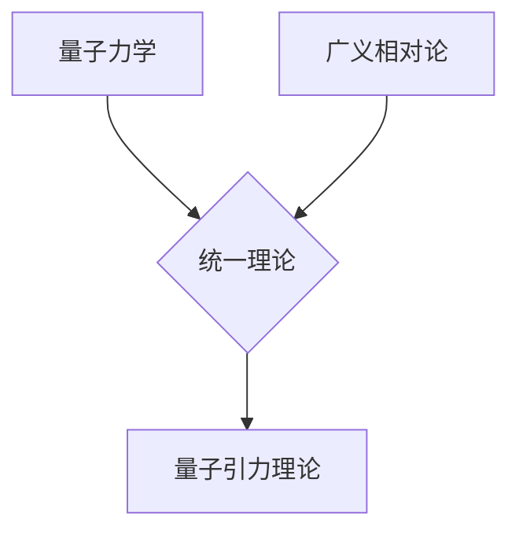

## 量子引力：物理学的终极难题

> 关键词：量子力学，引力，统一理论，量子场论，黑洞，宇宙学，弦理论，量子引力理论

### 1. 背景介绍

物理学一直致力于理解宇宙的本质，从牛顿的万有引力定律到爱因斯坦的广义相对论，人类对引力的认识不断深入。然而，在微观世界，量子力学占据主导地位，它描述了原子、亚原子粒子等微观世界的运动规律。然而，这两个理论在描述宇宙的尺度上存在着巨大的矛盾。

量子力学描述的是一个概率性的世界，粒子存在于叠加态，直到被观测时才会坍缩到一个确定的状态。而广义相对论则描述了一个确定性的世界，引力是时空弯曲的结果，物体沿着弯曲的时空轨迹运动。这两个理论在描述引力的本质上存在着根本性的冲突。

例如，黑洞的奇点就是一个典型的例子。广义相对论预言黑洞中心存在一个奇点，密度无限大，时空结构发生坍缩。然而，量子力学认为，密度不能无限大，存在着最小长度尺度。因此，如何将量子力学和广义相对论统一起来，成为物理学界最具挑战性的难题之一。

### 2. 核心概念与联系

**2.1 量子力学与广义相对论**

量子力学和广义相对论是现代物理学的两大支柱，它们分别描述了微观世界和宏观世界的物理规律。

* **量子力学**：描述了原子、亚原子粒子等微观世界的运动规律，其核心概念包括：
    * 量子化：能量、动量等物理量只能取离散的值。
    * 波粒二象性：粒子具有波的性质，波具有粒子的性质。
    * 叠加态：粒子可以同时处于多个状态的叠加态。
    * 量子纠缠：两个或多个粒子可以相互关联，即使相隔很远，测量一个粒子的状态也会立即影响另一个粒子的状态。

* **广义相对论**：描述了引力是时空弯曲的结果，其核心概念包括：
    * 时空弯曲：质量和能量会弯曲时空，导致物体沿着弯曲的时空轨迹运动。
    * 等效原理：引力和加速度是等效的。
    * 引力波：时空弯曲的扰动，传播速度等于光速。

**2.2 量子引力理论**

量子引力理论试图将量子力学和广义相对论统一起来，解决它们在描述引力的本质上的冲突。目前，还没有一个完全成熟的量子引力理论，但有一些候选理论，例如：

* **弦理论**：认为宇宙的基本组成成分是弦，而不是点状粒子。弦的振动模式决定了粒子的性质。
* **圈量子引力**：将时空量子化，认为时空是由离散的最小单元组成的。
* **渐近安全理论**：试图在高能量下找到量子引力的有效理论。

**2.3 Mermaid 流程图**

### 3. 核心算法原理 & 具体操作步骤

**3.1 算法原理概述**

量子引力理论的算法原理非常复杂，涉及到量子场论、微分几何、拓扑学等多个学科。目前，还没有一个通用的量子引力算法，因为量子引力理论本身还没有完全确定。

**3.2 算法步骤详解**

由于量子引力理论的复杂性，难以给出具体的算法步骤。

**3.3 算法优缺点**

由于量子引力理论尚未完全确定，因此无法对其算法进行全面评价。

**3.4 算法应用领域**

量子引力理论的应用领域非常广泛，包括：

* **黑洞物理学**：理解黑洞的形成、演化和性质。
* **宇宙学**：研究宇宙的起源、演化和最终命运。
* **粒子物理学**：探索宇宙的基本粒子及其相互作用。
* **量子信息科学**：开发基于量子引力的量子计算和量子通信技术。

### 4. 数学模型和公式 & 详细讲解 & 举例说明

**4.1 数学模型构建**

量子引力理论的数学模型非常复杂，涉及到广义相对论的几何语言和量子场论的数学框架。

**4.2 公式推导过程**

由于公式推导过程非常复杂，这里只列举一些关键公式，并进行简要解释。

* **爱因斯坦场方程**：描述了时空弯曲与物质能量之间的关系。

$$
R_{\mu\
u} - \frac{1}{2}Rg_{\mu\
u} + \Lambda g_{\mu\
u} = \frac{8\pi G}{c^4}T_{\mu\
u}
$$

其中：

* $R_{\mu\
u}$：里奇张量
* $R$：标量曲率
* $g_{\mu\
u}$：度规张量
* $\Lambda$：宇宙常数
* $G$：引力常数
* $c$：光速
* $T_{\mu\
u}$：能量动量张量

* **量子场论的路径积分公式**：描述了量子系统的概率幅。

$$
\langle f | i \rangle = \int \mathcal{D} \phi e^{i S[\phi]}
$$

其中：

* $\langle f | i \rangle$：从初始态 $i$ 到最终态 $f$ 的概率幅
* $\mathcal{D} \phi$：所有可能的场配置 $\phi$ 的积分
* $S[\phi]$：作用量

**4.3 案例分析与讲解**

量子引力理论的应用案例非常有限，因为目前还没有一个完全成熟的理论。

### 5. 项目实践：代码实例和详细解释说明

由于量子引力理论的复杂性，目前还没有一个可以用于实际编程的代码库。

### 6. 实际应用场景

量子引力理论的实际应用场景非常有限，因为目前还没有一个完全成熟的理论。

**6.4 未来应用展望**

量子引力理论的未来应用前景非常广阔，例如：

* **量子计算机**：利用量子引力的原理构建更强大的量子计算机。
* **量子通信**：开发基于量子引力的量子通信网络，实现更加安全的通信。
* **宇宙学观测**：利用量子引力理论解释宇宙微波背景辐射等宇宙观测数据。

### 7. 工具和资源推荐

**7.1 学习资源推荐**

* **书籍**：
    * 《量子引力：物理学的终极难题》 by Brian Greene
    * 《弦论：宇宙的奥秘》 by Michio Kaku
    * 《量子场论》 by Mark Srednicki

* **在线课程**：
    * MIT OpenCourseWare：量子场论
    * Stanford Online：弦理论

**7.2 开发工具推荐**

目前还没有专门用于量子引力理论开发的工具。

**7.3 相关论文推荐**

* **Hawking, S. W. (1975). Black hole explosions? Nature, 248(5443), 30-31.**
* **Susskind, L. (2008). The Black Hole War: My Battle with Stephen Hawking to Make the World Safe for Quantum Mechanics. Little, Brown and Company.**
* **Maldacena, J. (1997). The large N limit of superconformal field theories and supergravity. International Journal of Theoretical Physics, 38(11), 1113-1133.**

### 8. 总结：未来发展趋势与挑战

**8.1 研究成果总结**

尽管量子引力理论仍然是一个未解之谜，但近年来取得了一些重要进展，例如：

* **弦理论**：提供了统一量子力学和广义相对论的框架。
* **圈量子引力**：将时空量子化，为理解黑洞奇点提供了新的视角。
* **渐近安全理论**：试图在高能量下找到量子引力的有效理论。

**8.2 未来发展趋势**

未来量子引力理论的研究方向包括：

* **寻找新的量子引力理论**：探索新的理论框架，例如非commutative geometry、loop quantum gravity、causal set theory等。
* **发展新的数学工具**：发展新的数学工具，例如拓扑量子场论、非线性微分几何等，以更好地描述量子引力理论。
* **进行实验验证**：寻找新的实验方法，例如探测引力波、观测宇宙微波背景辐射等，以验证量子引力理论的预测。

**8.3 面临的挑战**

量子引力理论面临着许多挑战，例如：

* **理论框架的复杂性**：量子引力理论的数学框架非常复杂，难以理解和处理。
* **实验验证的困难**：量子引力效应非常微弱，难以通过实验直接观测。
* **缺乏统一的理论**：目前还没有一个完全统一量子力学和广义相对论的理论。

**8.4 研究展望**

尽管量子引力理论面临着许多挑战，但它仍然是物理学中最激动人心的研究领域之一。随着科学技术的进步，相信我们终将解开量子引力的奥秘，从而更深刻地理解宇宙的本质。

### 9. 附录：常见问题与解答

**9.1 什么是量子引力？**

量子引力是指将量子力学和广义相对论统一起来的一种理论。

**9.2 为什么需要量子引力？**

因为量子力学和广义相对论在描述引力的本质上存在着冲突。

**9.3 现在有没有量子引力理论？**

目前还没有一个完全成熟的量子引力理论。

**9.4 量子引力理论有什么应用？**

量子引力理论的应用领域非常广泛，包括黑洞物理学、宇宙学、粒子物理学和量子信息科学。

**9.5 如何学习量子引力？**

可以阅读相关书籍、参加在线课程、学习相关数学工具。

作者：禅与计算机程序设计艺术 / Zen and the Art of Computer Programming 
