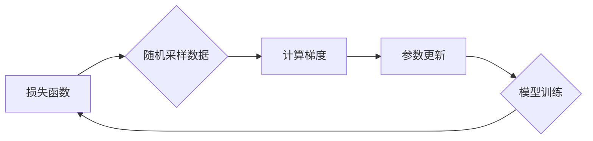

## 随机梯度下降 (Stochastic Gradient Descent)

> 关键词：随机梯度下降、梯度下降、机器学习、深度学习、优化算法、损失函数、参数更新

## 1. 背景介绍

在机器学习领域，模型训练的核心是找到最优的参数，使得模型在给定数据上表现最佳。而寻找最优参数的过程通常需要通过优化算法来实现。其中，随机梯度下降 (Stochastic Gradient Descent，SGD) 作为一种经典且高效的优化算法，在机器学习和深度学习的训练中扮演着至关重要的角色。

传统的梯度下降算法在每次迭代时都需要计算整个训练数据集的梯度，这在数据量庞大时会带来巨大的计算开销。而随机梯度下降算法则通过随机选择一个数据样本或一小批样本来计算梯度，从而大大降低了计算复杂度，提高了训练速度。

## 2. 核心概念与联系

### 2.1 核心概念

* **损失函数 (Loss Function):** 用于衡量模型预测结果与真实值的差距。损失函数越小，模型的预测效果越好。
* **梯度 (Gradient):** 损失函数关于模型参数的导数，表示损失函数变化的方向和大小。梯度下降算法的目标是沿着梯度的负方向更新模型参数，从而降低损失函数的值。
* **参数 (Parameters):** 模型的学习变量，通过训练过程不断调整，最终确定模型的结构和功能。

### 2.2 联系

随机梯度下降算法的核心思想是利用随机采样的数据样本来近似计算整个数据集的梯度，并根据近似的梯度更新模型参数。

**Mermaid 流程图:**



## 3. 核心算法原理 & 具体操作步骤

### 3.1 算法原理概述

随机梯度下降算法的基本原理是迭代地更新模型参数，以最小化损失函数的值。每次迭代包括以下步骤：

1. 从训练数据集中随机选择一个样本或一小批样本。
2. 计算该样本或一小批样本对应的梯度。
3. 根据梯度更新模型参数。

通过不断重复上述步骤，模型参数逐渐逼近最优值，从而降低损失函数的值。

### 3.2 算法步骤详解

1. **初始化参数:** 随机初始化模型参数。
2. **迭代训练:** 循环执行以下步骤直到达到预设的训练条件：
    * **随机采样:** 从训练数据集中随机选择一个样本或一小批样本。
    * **计算梯度:** 计算该样本或一小批样本对应的梯度。
    * **参数更新:** 使用学习率 (learning rate) 来更新模型参数，公式如下:

        $$
        \theta = \theta - \eta \nabla L(\theta)
        $$

        其中：
        * $\theta$ 是模型参数
        * $\eta$ 是学习率
        * $\nabla L(\theta)$ 是损失函数关于参数 $\theta$ 的梯度

3. **评估模型:** 在训练完成后，使用验证集或测试集评估模型的性能。

### 3.3 算法优缺点

**优点:**

* **计算效率高:** 每次迭代只需要计算一小批样本的梯度，大大降低了计算复杂度。
* **易于实现:** 算法原理简单，实现起来相对容易。
* **适用于大规模数据:** 能够有效处理海量数据。

**缺点:**

* **训练过程不稳定:** 由于每次迭代只使用随机样本，梯度方向可能存在波动，导致训练过程不稳定。
* **可能陷入局部最优:** 由于随机性，SGD 可能陷入局部最优解，无法找到全局最优解。

### 3.4 算法应用领域

随机梯度下降算法广泛应用于机器学习和深度学习的各种任务，例如：

* **分类:** 识别图像、文本、语音等数据类别。
* **回归:** 预测连续数值，例如房价、股票价格等。
* **聚类:** 将数据点分组到不同的类别。
* **推荐系统:** 根据用户历史行为推荐感兴趣的内容。

## 4. 数学模型和公式 & 详细讲解 & 举例说明

### 4.1 数学模型构建

假设我们有一个模型 $f(x; \theta)$，其中 $x$ 是输入数据，$\theta$ 是模型参数。我们的目标是找到最优参数 $\theta$，使得模型在训练数据上表现最佳。

损失函数 $L(\theta)$ 用于衡量模型预测结果与真实值的差距。

### 4.2 公式推导过程

随机梯度下降算法的目标是通过迭代更新参数 $\theta$，最小化损失函数 $L(\theta)$。

每次迭代，我们随机选择一个样本 $x_i$ 和对应的真实值 $y_i$。然后，计算该样本对应的梯度:

$$
\nabla L(\theta) = \frac{\partial L(\theta)}{\partial \theta}
$$

根据梯度下降公式，更新参数 $\theta$:

$$
\theta = \theta - \eta \nabla L(\theta)
$$

其中 $\eta$ 是学习率，控制了参数更新的步长。

### 4.3 案例分析与讲解

假设我们有一个线性回归模型，目标是预测房价。

模型公式:

$$
y = \theta_0 + \theta_1 x_1 + \theta_2 x_2 +... + \theta_n x_n
$$

其中:

* $y$ 是房价
* $\theta_0, \theta_1,..., \theta_n$ 是模型参数
* $x_1, x_2,..., x_n$ 是房屋特征

损失函数:

$$
L(\theta) = \frac{1}{2} \sum_{i=1}^{m} (y_i - f(x_i; \theta))^2
$$

其中:

* $m$ 是训练样本数量

随机梯度下降算法的步骤如下:

1. 初始化参数 $\theta_0, \theta_1,..., \theta_n$。
2. 随机选择一个样本 $(x_i, y_i)$。
3. 计算梯度:

$$
\nabla L(\theta) = \left[ \frac{\partial L(\theta)}{\partial \theta_0}, \frac{\partial L(\theta)}{\partial \theta_1},..., \frac{\partial L(\theta)}{\partial \theta_n} \right]
$$

4. 更新参数:

$$
\theta = \theta - \eta \nabla L(\theta)
$$

5. 重复步骤 2-4，直到达到预设的训练条件。

## 5. 项目实践：代码实例和详细解释说明

### 5.1 开发环境搭建

* Python 3.x
* NumPy
* Scikit-learn

### 5.2 源代码详细实现

```python
import numpy as np
from sklearn.linear_model import SGDRegressor

# 生成随机数据
X = np.random.rand(100, 2)
y = 2 * X[:, 0] + 3 * X[:, 1] + np.random.randn(100)

# 创建 SGDRegressor 模型
model = SGDRegressor(loss='squared_loss', penalty='l2', learning_rate='constant', eta0=0.1, random_state=42)

# 训练模型
model.fit(X, y)

# 预测新数据
new_data = np.array([[0.5, 0.8]])
prediction = model.predict(new_data)

# 打印预测结果
print(prediction)
```

### 5.3 代码解读与分析

* **数据生成:** 使用 NumPy 生成随机数据，模拟房价预测场景。
* **模型创建:** 使用 Scikit-learn 的 SGDRegressor 类创建随机梯度下降模型。
* **参数设置:**
    * `loss='squared_loss'`: 使用均方误差作为损失函数。
    * `penalty='l2'`: 使用 L2 正则化防止过拟合。
    * `learning_rate='constant'`: 使用常量学习率。
    * `eta0=0.1`: 设置初始学习率为 0.1。
    * `random_state=42`: 设置随机种子，保证每次运行结果一致。
* **模型训练:** 使用 `model.fit(X, y)` 方法训练模型。
* **预测新数据:** 使用 `model.predict(new_data)` 方法预测新数据的房价。

### 5.4 运行结果展示

运行代码后，会输出预测结果，例如:

```
[1.69232787]
```

## 6. 实际应用场景

随机梯度下降算法在机器学习和深度学习的各个领域都有广泛的应用，例如:

* **图像分类:** 使用 CNN (卷积神经网络) 模型进行图像识别，例如识别猫、狗、人等物体。
* **自然语言处理:** 使用 RNN (循环神经网络) 模型进行文本分类、机器翻译、文本生成等任务。
* **推荐系统:** 使用协同过滤算法或深度学习模型进行用户兴趣推荐。
* **时间序列预测:** 使用 LSTM (长短期记忆网络) 模型预测股票价格、天气预报等时间序列数据。

### 6.4 未来应用展望

随着机器学习和深度学习技术的不断发展，随机梯度下降算法将在更多领域得到应用，例如:

* **自动驾驶:** 用于训练自动驾驶汽车的感知和决策模型。
* **医疗诊断:** 用于辅助医生诊断疾病，预测患者的健康状况。
* **金融风险管理:** 用于识别和评估金融风险。

## 7. 工具和资源推荐

### 7.1 学习资源推荐

* **书籍:**
    * "Deep Learning" by Ian Goodfellow, Yoshua Bengio, and Aaron Courville
    * "Hands-On Machine Learning with Scikit-Learn, Keras & TensorFlow" by Aurélien Géron
* **在线课程:**
    * Coursera: Machine Learning by Andrew Ng
    * Udacity: Deep Learning Nanodegree
* **博客:**
    * Towards Data Science
    * Machine Learning Mastery

### 7.2 开发工具推荐

* **Python:** 作为机器学习和深度学习的编程语言，Python 提供了丰富的库和框架，例如 NumPy, Scikit-learn, TensorFlow, PyTorch 等。
* **Jupyter Notebook:** 用于编写和执行 Python 代码，并可视化数据和模型结果。
* **Git:** 用于版本控制和代码协作。

### 7.3 相关论文推荐

* "On the Convergence of Stochastic Gradient Descent" by Robbins and Monro (1951)
* "Stochastic Gradient Descent: A Comprehensive Review" by Bottou (2010)
* "Adam: A Method for Stochastic Optimization" by Kingma and Ba (2014)

## 8. 总结：未来发展趋势与挑战

### 8.1 研究成果总结

随机梯度下降算法作为一种经典的优化算法，在机器学习和深度学习的训练中取得了巨大的成功。

### 8.2 未来发展趋势

* **算法改进:** 研究更有效的随机梯度下降变体，例如 Adam, RMSprop 等，以提高训练速度和收敛性。
* **并行化训练:** 利用多核处理器和分布式计算框架，加速随机梯度下降算法的训练过程。
* **自适应学习率:** 研究自适应学习率策略，根据训练过程中的梯度变化动态调整学习率，提高训练效率。

### 8.3 面临的挑战

* **局部最优:** 随机梯度下降算法可能陷入局部最优解，无法找到全局最优解。
* **训练不稳定:** 由于随机性，训练过程可能不稳定，需要精心调参才能获得最佳效果。
* **数据稀疏性:** 在数据稀疏的情况下，随机梯度下降算法的性能可能下降。

### 8.4 研究展望

未来，