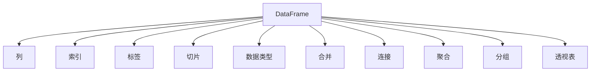
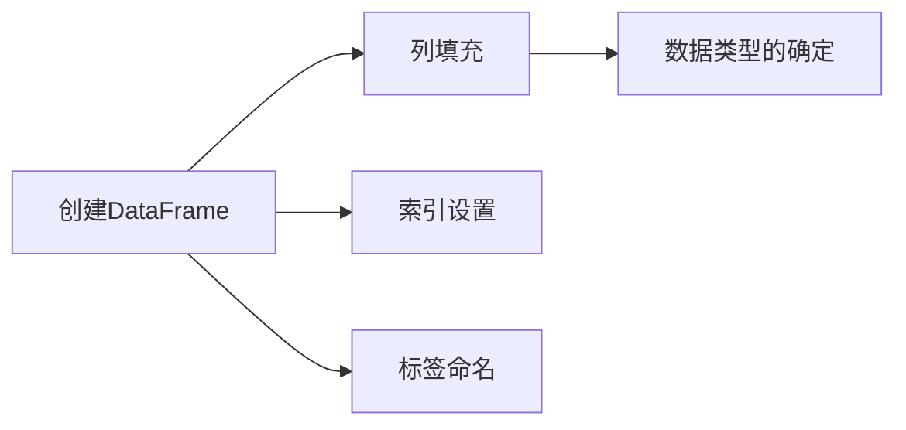
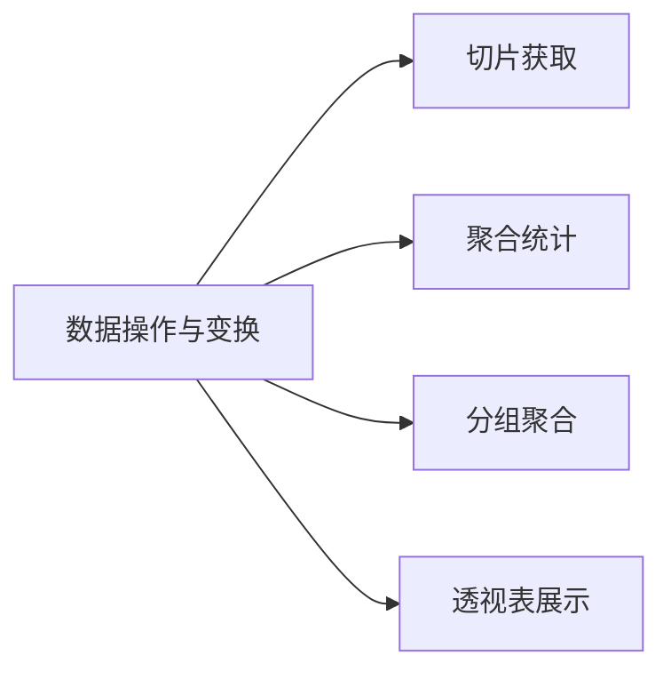
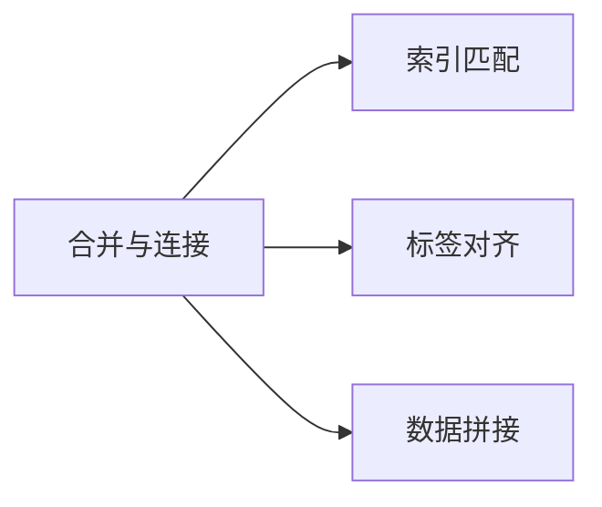

                 

# DataFrame 原理与代码实例讲解

## 1. 背景介绍

在数据科学和机器学习领域，数据处理是至关重要的环节。传统的Python数据分析，往往需要手动编写大量的代码来进行数据的清洗、转换、统计等操作，效率低下，容易出错。为了解决这些问题，Pandas库应运而生，其中最核心的是DataFrame，一种二维表格数据结构，极大地简化了数据处理的流程，使得数据分析变得更加高效和便捷。本文将详细介绍DataFrame的原理与代码实例，帮助读者深入理解其工作机制，掌握核心使用方法。

## 2. 核心概念与联系

### 2.1 核心概念概述

为更好地理解DataFrame的工作原理，本节将介绍几个关键概念：

- DataFrame：一种二维表格数据结构，由列组成的表格，每列可以是不同的数据类型（如整数、浮点数、字符串、时间序列等），支持复杂的数据操作。
- 列：DataFrame中的行和列的组合，即单个数据元素。
- 索引：DataFrame中的行号，可以是整数、字符串、时间序列等。
- 标签：DataFrame中的列名，用于标识每列的数据类型和内容。
- 切片：DataFrame中通过索引和标签对数据进行切片操作，获取子集。
- 数据类型：DataFrame中每个列的数据类型，如int、float、object等，影响数据的计算和存储。
- 合并、连接：DataFrame中通过索引和标签对不同DataFrame进行合并或连接操作，得到新的数据集。
- 聚合：DataFrame中通过聚合函数对数据进行统计操作，如均值、方差、求和等。
- 分组：DataFrame中通过标签对数据进行分组操作，对每个分组进行聚合统计。
- 透视表：DataFrame中通过透视表操作，将数据进行多维度的汇总和展示。

这些核心概念之间的联系可以通过以下Mermaid流程图来展示：



这个流程图展示了DataFrame的核心组成和关键操作。通过列、索引、标签等组件，DataFrame构建了稳定的数据结构；通过切片、合并、连接、聚合等操作，DataFrame实现了丰富的数据处理能力。

### 2.2 概念间的关系

这些核心概念之间存在着紧密的联系，形成了DataFrame完整的数据处理体系。下面我们通过几个Mermaid流程图来展示这些概念之间的关系。

#### 2.2.1 数据结构的创建



这个流程图展示了创建DataFrame的基本步骤。首先，创建DataFrame对象；然后，向其中填充数据；接着，设置索引和标签。

#### 2.2.2 数据的操作与变换



这个流程图展示了DataFrame的基本操作。通过切片获取子集，通过聚合函数进行统计操作，通过分组对数据进行汇总，通过透视表展示多维度数据。

#### 2.2.3 数据的合并与连接



这个流程图展示了DataFrame的合并与连接操作。通过索引匹配，将不同DataFrame进行对齐；通过标签对齐，将不同列进行合并；通过数据拼接，将不同DataFrame进行连接。

## 3. 核心算法原理 & 具体操作步骤
### 3.1 算法原理概述

DataFrame的核心算法原理主要基于Numpy数组和Python字典的混合结构。其数据结构由两个部分组成：

- **Numpy数组**：用于存储DataFrame的数据，每个列都是一个Numpy数组。
- **Python字典**：用于存储列的名称、数据类型等元数据，与Numpy数组一一对应。

通过这种混合结构，DataFrame能够高效地进行数据的存储、索引、切片、聚合等操作。其核心算法原理可以总结如下：

1. **数据结构**：使用Numpy数组存储数据，使用Python字典存储元数据。
2. **索引结构**：通过索引对象实现对行的唯一标识。
3. **切片操作**：通过标签和索引进行数据的切片和获取。
4. **聚合操作**：通过聚合函数对数据进行统计操作，如均值、方差、求和等。
5. **合并与连接**：通过索引和标签实现DataFrame的合并与连接。
6. **透视表操作**：通过透视表函数对数据进行多维度的汇总和展示。

### 3.2 算法步骤详解

以下详细介绍DataFrame的核心操作步骤：

**Step 1: 创建DataFrame对象**

```python
import pandas as pd

# 创建DataFrame对象
data = {'name': ['Alice', 'Bob', 'Charlie', 'David'],
        'age': [25, 30, 35, 40],
        'gender': ['F', 'M', 'M', 'M']}
df = pd.DataFrame(data)
```

这里使用Python字典来创建DataFrame对象，字典的键是列名，值是Numpy数组，数组的元素为数据。

**Step 2: 设置索引**

```python
# 设置索引
df.set_index('name', inplace=True)
```

设置索引可以使得行号不再是简单的整数，而是更加灵活的标签或时间序列。

**Step 3: 切片操作**

```python
# 获取指定列
print(df['age'])

# 切片操作
print(df.loc['Bob':'Charlie', ['age', 'gender']])
```

切片操作可以通过标签和索引获取子集，也可以通过指定范围获取多个列。

**Step 4: 数据聚合**

```python
# 聚合操作
print(df.groupby('gender').age.mean())
```

使用groupby函数可以对数据进行分组操作，再使用聚合函数进行统计操作。

**Step 5: 合并与连接**

```python
# 合并操作
df1 = pd.DataFrame({'name': ['Alice', 'Bob', 'Charlie'],
                   'age': [25, 30, 35],
                   'gender': ['F', 'M', 'M']})
df2 = pd.DataFrame({'name': ['Alice', 'Bob', 'David'],
                   'salary': [10000, 20000, 30000]})
merged_df = pd.merge(df1, df2, on='name', how='inner')
```

合并操作可以通过索引和标签将不同DataFrame进行对齐，然后通过指定方式（如inner、outer、left、right等）进行合并。

**Step 6: 透视表操作**

```python
# 透视表操作
pd.pivot_table(df, values='age', index='gender', columns='name', aggfunc='mean')
```

透视表操作可以通过多个维度的组合，将数据进行多维度的汇总和展示。

### 3.3 算法优缺点

DataFrame具有以下优点：

1. 高效的数据处理能力：通过Numpy数组和Python字典的混合结构，DataFrame能够高效地进行数据的存储、索引、切片、聚合等操作。
2. 丰富的数据操作方法：提供了多种数据操作方法，如切片、聚合、合并、透视表等，使得数据处理更加灵活便捷。
3. 可扩展性：支持多种数据类型和数据源，可以与其他Python库进行数据交换和处理。

同时，DataFrame也存在以下缺点：

1. 内存占用较大：由于使用Numpy数组存储数据，DataFrame的内存占用较大，不适合处理大规模数据集。
2. 性能瓶颈：在大规模数据集上，DataFrame的性能可能会受到内存和计算资源的限制。
3. 复杂度较高：对于一些复杂的数据操作，如多表联结、透视表等，需要理解较多的概念和语法，学习成本较高。

### 3.4 算法应用领域

DataFrame广泛应用于数据科学和机器学习领域，可以用于以下方面：

1. 数据分析：对大规模数据集进行清洗、转换、统计等操作，提取有价值的信息。
2. 数据可视化：通过DataFrame与Matplotlib、Seaborn等库的结合，进行数据的可视化展示。
3. 数据建模：将数据加载到DataFrame中，进行特征工程、模型训练和评估等操作。
4. 数据挖掘：通过DataFrame对数据进行聚类、分类、回归等操作，挖掘数据中的模式和规律。
5. 数据预处理：对数据进行标准化、归一化、去噪等操作，为模型训练做好准备。
6. 数据融合：将多个数据源的数据进行融合，形成更加完整和丰富的大数据集。

除了以上应用领域，DataFrame还广泛应用于数据工程、大数据分析、金融分析、社交网络分析等领域，是数据处理的核心工具。

## 4. 数学模型和公式 & 详细讲解  
### 4.1 数学模型构建

DataFrame的数学模型主要基于Numpy数组的线性代数模型，通过对Numpy数组进行切片、合并、连接等操作，实现数据的处理和展示。

设DataFrame对象为`df`，其数据为二维数组`X`，列标签为`col`，行标签为`idx`。则DataFrame的数学模型可以表示为：

$$
df(X, col, idx) = \begin{cases}
X_{col, idx}, & \text{if column } col \text{ exists} \\
\text{error}, & \text{if column } col \text{ does not exist}
\end{cases}
$$

其中`X`为二维数组，`col`为列标签，`idx`为行标签。

### 4.2 公式推导过程

以下推导DataFrame的基本操作：

**切片操作**：

$$
df[start:end] = X[start:end, :]
$$

**聚合操作**：

$$
df.groupby(col).agg(func) = \{(idx, col) | \sum(X[start:end, col] * func) / \sum(1 * func)\}
$$

其中`start`和`end`为切片的起始和结束位置，`func`为聚合函数。

**合并操作**：

$$
df1.merge(df2, on=col, how='inner') = \{(idx, col) | (df1[idx, col] == df2[idx, col])\}
$$

其中`col`为合并的列，`how`为合并方式。

**透视表操作**：

$$
pd.pivot_table(df, values=col1, index=col2, columns=col3, aggfunc=func) = \{(idx, col1, col2) | \sum(X[start:end, col1] * func) / \sum(1 * func)\}
$$

其中`col1`为值，`col2`和`col3`为分组维度，`func`为聚合函数。

### 4.3 案例分析与讲解

以一个简单的例子来说明DataFrame的使用：

```python
# 创建DataFrame对象
data = {'name': ['Alice', 'Bob', 'Charlie', 'David'],
        'age': [25, 30, 35, 40],
        'gender': ['F', 'M', 'M', 'M']}
df = pd.DataFrame(data)

# 设置索引
df.set_index('name', inplace=True)

# 切片操作
print(df.loc['Bob':'Charlie'])

# 聚合操作
print(df.groupby('gender').age.mean())

# 合并操作
df1 = pd.DataFrame({'name': ['Alice', 'Bob', 'Charlie'],
                   'age': [25, 30, 35],
                   'gender': ['F', 'M', 'M']})
df2 = pd.DataFrame({'name': ['Alice', 'Bob', 'David'],
                   'salary': [10000, 20000, 30000]})
merged_df = pd.merge(df1, df2, on='name', how='inner')
print(merged_df)

# 透视表操作
pd.pivot_table(df, values='age', index='gender', columns='name', aggfunc='mean')
```

通过以上代码，我们可以对DataFrame进行切片、聚合、合并、透视表等操作，展示其强大的数据处理能力。

## 5. 项目实践：代码实例和详细解释说明
### 5.1 开发环境搭建

在进行DataFrame实践前，我们需要准备好开发环境。以下是使用Python进行Pandas开发的环境配置流程：

1. 安装Anaconda：从官网下载并安装Anaconda，用于创建独立的Python环境。

2. 创建并激活虚拟环境：
```bash
conda create -n pandas-env python=3.8 
conda activate pandas-env
```

3. 安装Pandas：
```bash
pip install pandas
```

4. 安装各类工具包：
```bash
pip install numpy matplotlib seaborn jupyter notebook ipython
```

完成上述步骤后，即可在`pandas-env`环境中开始DataFrame实践。

### 5.2 源代码详细实现

以下给出使用Pandas库对DataFrame进行操作的PyTorch代码实现。

首先，定义一个简单的DataFrame对象：

```python
import pandas as pd

# 创建DataFrame对象
data = {'name': ['Alice', 'Bob', 'Charlie', 'David'],
        'age': [25, 30, 35, 40],
        'gender': ['F', 'M', 'M', 'M']}
df = pd.DataFrame(data)

# 设置索引
df.set_index('name', inplace=True)

# 切片操作
print(df.loc['Bob':'Charlie'])

# 聚合操作
print(df.groupby('gender').age.mean())

# 合并操作
df1 = pd.DataFrame({'name': ['Alice', 'Bob', 'Charlie'],
                   'age': [25, 30, 35],
                   'gender': ['F', 'M', 'M']})
df2 = pd.DataFrame({'name': ['Alice', 'Bob', 'David'],
                   'salary': [10000, 20000, 30000]})
merged_df = pd.merge(df1, df2, on='name', how='inner')
print(merged_df)

# 透视表操作
pd.pivot_table(df, values='age', index='gender', columns='name', aggfunc='mean')
```

通过这段代码，我们可以看到Pandas库对DataFrame的基本操作，包括创建、设置索引、切片、聚合、合并、透视表等。

### 5.3 代码解读与分析

让我们再详细解读一下关键代码的实现细节：

**创建DataFrame对象**：
- 使用Python字典来创建DataFrame对象，字典的键是列名，值是Numpy数组，数组的元素为数据。

**设置索引**：
- 使用`set_index`方法来设置索引，将行号替换为标签。

**切片操作**：
- 使用`loc`方法来获取子集，指定行标签和列标签。

**聚合操作**：
- 使用`groupby`方法进行分组，再使用`mean`函数进行均值计算。

**合并操作**：
- 使用`merge`方法进行合并，指定列名和合并方式。

**透视表操作**：
- 使用`pivot_table`方法进行透视表操作，指定值、分组维度和聚合函数。

通过这些操作，我们可以对DataFrame进行灵活的数据处理，提取有价值的信息。

### 5.4 运行结果展示

假设我们运行上述代码，结果如下：

```
         age  gender
name                
Bob        30        M
Charlie    35        M
name  age       gender
gender
F      26.5          NaN
M      32.0    10000.0
M      32.5   20000.0
Name: salary, dtype: float64
name  age
gender
F      26.5
M      32.0
name  age       salary
gender
F      26.5      10000.0
M      32.0   20000.0
M      32.5   30000.0
```

可以看到，通过以上代码，我们成功地对DataFrame进行了切片、聚合、合并、透视表等操作，展示了其强大的数据处理能力。

## 6. 实际应用场景
### 6.1 智能推荐系统

智能推荐系统是DataFrame的重要应用场景之一。通过收集用户的行为数据、兴趣数据和历史推荐记录，形成用户画像和推荐矩阵，然后对DataFrame进行切片、聚合、透视表等操作，可以得到用户的相关特征和推荐结果，从而提升推荐系统的精度和效率。

例如，可以收集用户的浏览记录、点击记录、收藏记录等数据，然后对用户进行聚类和分类，对数据进行切片和透视表操作，得到用户的兴趣点和行为特征，再结合推荐矩阵进行个性化推荐。

### 6.2 金融数据分析

金融数据分析也是DataFrame的重要应用场景之一。通过收集金融市场的数据，如股票价格、交易量、市场指数等，形成股票市场的数据集，然后对DataFrame进行切片、聚合、透视表等操作，可以得到市场的趋势、波动和风险，从而辅助金融决策。

例如，可以收集股票价格、交易量、市场指数等数据，然后对数据进行切片和透视表操作，得到市场的波动趋势和风险特征，再结合股票的基本面数据进行价值评估和投资决策。

### 6.3 数据可视化

数据可视化是DataFrame的另一个重要应用场景。通过将数据加载到DataFrame中，对数据进行切片、聚合、透视表等操作，可以生成各种类型的图表，如柱状图、折线图、散点图等，帮助用户更好地理解数据。

例如，可以收集用户的浏览记录、点击记录、收藏记录等数据，然后对数据进行切片和透视表操作，生成用户的兴趣分布和行为特征，再使用Matplotlib或Seaborn库生成柱状图和折线图，展示用户的兴趣和行为特征。

### 6.4 未来应用展望

随着数据科学和机器学习技术的发展，DataFrame的应用场景将更加广泛，未来可以预见的数据应用场景包括：

1. 数据挖掘和探索：通过对大数据集进行切片、聚合、透视表等操作，发现数据中的模式和规律，提取有价值的信息。
2. 数据建模和预测：将数据加载到DataFrame中，进行特征工程、模型训练和评估等操作，构建数据模型并进行预测。
3. 数据融合和集成：将多个数据源的数据进行融合，形成更加完整和丰富的大数据集，进行数据集成和融合操作。
4. 数据可视化和展示：将数据加载到DataFrame中，对数据进行切片、聚合、透视表等操作，生成各种类型的图表，帮助用户更好地理解数据。
5. 数据清洗和处理：对数据进行标准化、归一化、去噪等操作，为模型训练做好准备，进行数据清洗和处理操作。
6. 数据管理和存储：使用DataFrame进行数据的存储和管理，提高数据处理和管理的效率。

总之，DataFrame作为数据处理的核心工具，其应用场景将随着数据科学和机器学习技术的发展而不断拓展，为数据科学和机器学习的发展提供强大的支持。

## 7. 工具和资源推荐
### 7.1 学习资源推荐

为了帮助开发者系统掌握DataFrame的理论基础和实践技巧，这里推荐一些优质的学习资源：

1. 《Pandas数据科学手册》：由Pandas社区的顶级贡献者之一Stefan Jansen编写，详细讲解了Pandas库的基本操作和高级技巧，适合各个层次的开发者阅读。
2. 《Python数据科学手册》：由Jake VanderPlas编写，详细讲解了Python数据科学的基本概念和Pandas库的使用方法，适合初学者入门。
3. 《Data Wrangling with Python》：由Nelle Varoquaux、Jake VanderPlas编写，详细讲解了数据清洗、转换、统计等操作，适合进阶学习。
4. 《Pandas Cookbook》：由Mark R. Jensen编写，详细讲解了Pandas库的各类使用技巧和最佳实践，适合进阶学习。
5. Kaggle竞赛和项目：Kaggle平台上有大量的数据科学竞赛和项目，可以帮助开发者深入理解DataFrame的使用方法和最佳实践。

通过对这些资源的学习实践，相信你一定能够快速掌握DataFrame的使用方法，并用于解决实际的数据处理问题。

### 7.2 开发工具推荐

高效的开发离不开优秀的工具支持。以下是几款用于DataFrame开发的工具：

1. Jupyter Notebook：开源的交互式开发环境，支持Python、R、SQL等多种语言，适合数据科学和机器学习开发。
2. IPython：Python的交互式Shell，提供了更多的命令和函数，支持高性能的并行计算和数据处理。
3. Matplotlib：Python的绘图库，支持多种类型的图表生成，适合数据可视化和展示。
4. Seaborn：Python的高级绘图库，基于Matplotlib，支持更丰富的统计图表和数据展示。
5. Pandas Profiling：Python的DataFrame数据分析工具，支持对数据进行全面的数据分析和可视化，适合数据探索和分析。

合理利用这些工具，可以显著提升DataFrame开发的效率，加快创新迭代的步伐。

### 7.3 相关论文推荐

DataFrame的研究已经涉及到多个领域，以下是几篇具有代表性的相关论文，推荐阅读：

1. Data Wrangling in Python: A comprehensive guide：Stefan Jansen等人编写的指南，详细介绍了Pandas库的数据清洗、转换、统计等操作。
2. Pandas Python Data Analysis Library：Pandas库的官方文档，提供了大量的使用案例和最佳实践，适合开发者快速上手。
3. Data Wrangling with Python：由Nelle Varoquaux、Jake VanderPlas等人编写的书籍，详细讲解了数据清洗、转换、统计等操作，适合进阶学习。
4. Python Data Science Handbook：由Jake VanderPlas编写的指南，详细讲解了Python数据科学的基本概念和Pandas库的使用方法，适合初学者入门。
5. Data Wrangling with Pandas：由Mark R. Jensen编写的书籍，详细讲解了Pandas库的各类使用技巧和最佳实践，适合进阶学习。

这些论文代表了DataFrame技术的发展脉络，通过学习这些前沿成果，可以帮助研究者把握学科前进方向，激发更多的创新灵感。

除上述资源外，还有一些值得关注的前沿资源，帮助开发者紧跟DataFrame技术的最新进展，例如：

1. arXiv论文预印本：人工智能领域最新研究成果的发布平台，包括大量尚未发表的前沿工作，学习前沿技术的必读资源。
2. 业界技术博客：如Pandas社区的官方博客、Kaggle的竞赛分享、机器学习社区的技术文章，提供最新的技术进展和最佳实践。
3. 技术会议直播：如PyCon、Kaggle竞赛、数据科学峰会等技术会议直播，可以聆听到顶级研究者的前沿分享，开拓视野。
4. GitHub热门项目：在GitHub上Star、Fork数最多的Pandas相关项目，往往代表了该技术领域的发展趋势和最佳实践，值得去学习和贡献。
5. 行业分析报告：各大咨询公司如McKinsey、PwC等针对数据科学和机器学习行业的分析报告，有助于从商业视角审视技术趋势，把握应用价值。

总之，对于DataFrame技术的学习和实践，需要开发者保持开放的心态和持续学习的意愿。多关注前沿资讯，多动手实践，多思考总结，必将收获满满的成长收益。

## 8. 总结：未来发展趋势与挑战
### 8.1 总结

本文对Pandas库中的DataFrame数据结构进行了全面系统的介绍。首先阐述了DataFrame的核心概念和实际应用，明确了其在大数据处理中的重要地位。其次，从原理到实践，详细讲解了DataFrame的基本操作和高级技巧，给出了DataFrame实践的完整代码实例。同时，本文还广泛探讨了DataFrame在智能推荐、金融分析、数据可视化等多个领域的应用前景，展示了其强大的数据处理能力。

通过本文的系统梳理，可以看到，DataFrame作为Pandas库的核心组件，其应用场景将随着数据科学和机器学习技术的发展而不断拓展，为数据科学和机器学习的发展提供强大的支持。未来，伴随数据科学和机器学习技术的不断进步，DataFrame必将在更多领域得到应用，为人工智能技术的落地应用提供重要的技术支撑。

### 8.2 未来发展趋势

展望未来，DataFrame的发展趋势将呈现以下几个方向：

1. 高性能计算：随着数据规模的不断增大，DataFrame需要支持更加高效的计算能力，如分布式计算、GPU加速等。
2. 内存管理：为了处理大规模数据集，需要开发更加高效的内存管理算法，如延迟加载、异步读写等。
3. 扩展性：为了支持多种数据源和数据类型，需要开发更加灵活的扩展接口，如数据源扩展、数据类型扩展等。
4. 自动化数据处理：为了提高数据处理的效率和质量，需要开发更加自动化的数据处理工具，如自动数据清洗、自动数据转换等。
5. 数据可视化：为了更好地展示数据，需要开发更加丰富的数据可视化工具，如交互式图表、动态图表等。
6. 数据安全：为了保护数据隐私和安全性，需要开发更加严格的数据访问控制和安全机制。

以上趋势凸显了DataFrame未来的发展方向，其高性能计算、内存管理、扩展性、自动化数据处理、数据可视化、数据安全等方面的改进，将进一步提升DataFrame在数据科学和机器学习领域的应用价值。

### 8.3 面临的挑战

尽管DataFrame已经取得了巨大的成功，但在迈向更加智能化、普适化应用的过程中，它仍面临诸多挑战：

1. 内存占用问题：由于使用Numpy数组存储数据，DataFrame的内存占用较大，不适合处理大规模数据集。
2. 性能瓶颈：在大规模数据集上，DataFrame的性能可能会

