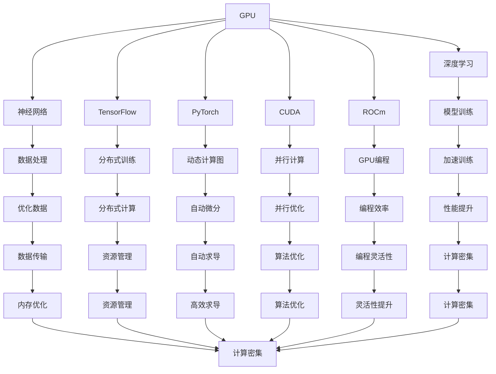

                 

# GPU技术在AI中的应用

> 关键词：GPU加速,深度学习,神经网络,机器学习,并行计算,GPU编程

## 1. 背景介绍

### 1.1 问题由来

随着人工智能（AI）技术的不断进步，深度学习模型在图像识别、自然语言处理、语音识别等领域取得了重大突破，但这些模型的训练和推理过程需要巨大的计算资源。传统的CPU处理器在处理大规模并行计算时存在瓶颈，因此GPU（图形处理器）因其高并行性而成为AI领域中不可或缺的计算工具。GPU技术在AI中的应用不仅加速了深度学习模型的训练和推理，还推动了AI技术在更多领域的应用和发展。

### 1.2 问题核心关键点

GPU技术在AI中的应用主要体现在以下几个方面：

- **并行计算能力**：GPU拥有远高于CPU的并行计算能力，可以同时处理大量的数据和任务，极大地加速了深度学习模型的训练过程。
- **内存带宽**：GPU拥有更高的内存带宽，可以更快地进行数据传输，提高了数据处理效率。
- **优化算法**：GPU硬件和软件平台（如CUDA、ROCm等）提供了许多针对深度学习优化的算法和编程模型，进一步提升了计算性能。
- **多线程并行**：GPU支持多线程并行，可以在一个硬件设备上同时处理多个线程任务，提高了资源利用率和计算效率。

### 1.3 问题研究意义

GPU技术在AI中的应用对推动AI技术的快速发展具有重要意义：

- **加速模型训练**：GPU加速了深度学习模型的训练过程，使得研究人员和工程师可以更快地验证和改进模型，缩短了模型开发周期。
- **提高模型精度**：通过并行计算和优化算法，GPU能够训练更加复杂和深层的神经网络，提升模型的预测精度和泛化能力。
- **促进技术普及**：GPU技术的应用降低了AI技术的入门门槛，使得更多企业和个人可以借助GPU进行AI应用开发，加速了AI技术的产业化进程。
- **推动应用创新**：GPU技术加速了AI模型的部署和应用，催生了更多创新应用场景，如自动驾驶、医疗诊断、金融预测等，促进了社会各领域的数字化转型。

## 2. 核心概念与联系

### 2.1 核心概念概述

为了更好地理解GPU技术在AI中的应用，本节将介绍几个关键概念：

- **GPU**：一种专门用于图形和科学计算的处理器，拥有高并行计算能力和巨大的内存带宽，能够快速处理大规模数据。
- **深度学习**：一种基于神经网络的机器学习方法，通过多层非线性变换学习数据特征和模式。
- **神经网络**：一种由多个神经元层级组成的网络结构，用于处理和分析复杂数据。
- **TensorFlow**：谷歌开发的深度学习框架，支持GPU加速，提供了丰富的API和工具库。
- **PyTorch**：Facebook开发的深度学习框架，同样支持GPU加速，易于使用和扩展。
- **CUDA**：NVIDIA开发的GPU编程框架，提供了高效的并行计算能力。
- **ROCm**：AMD开发的GPU编程框架，与CUDA类似，用于AMD GPU的深度学习应用开发。

### 2.2 概念间的关系

这些核心概念之间的关系可以通过以下Mermaid流程图来展示：



这个流程图展示了GPU技术在AI应用中的核心概念及其相互关系：

1. GPU作为计算平台，提供高并行性和高内存带宽，加速深度学习模型的训练和推理。
2. 深度学习通过神经网络模型处理和分析数据，GPU提供了高效的计算能力支持。
3. TensorFlow和PyTorch等框架提供了GPU编程接口，使深度学习模型的开发和训练更加高效。
4. CUDA和ROCm等GPU编程框架提供了优化的并行计算和内存管理，进一步提升GPU的计算性能。
5. 分布式训练和自动微分等技术使得深度学习模型能够在分布式环境下高效运行。
6. 数据优化和算法优化等技术提高了模型的训练效率和精度。

通过这些概念的联系，我们可以更清晰地理解GPU技术在AI应用中的作用和价值。

## 3. 核心算法原理 & 具体操作步骤

### 3.1 算法原理概述

GPU技术在AI中的应用主要基于并行计算和优化算法。深度学习模型的训练过程可以分解为多个并行计算任务，每个任务对应模型的一个参数或一组参数。GPU通过同时处理多个任务，实现高效的并行计算。

具体而言，GPU加速深度学习模型的训练过程可以分为以下几个步骤：

1. **数据预处理**：将输入数据转换为GPU可用的格式，如TensorFlow中的Tensor。
2. **模型定义**：在TensorFlow或PyTorch等框架中定义深度学习模型。
3. **模型训练**：将模型和数据传递给GPU，并使用GPU并行计算加速模型训练过程。
4. **模型优化**：使用优化算法（如梯度下降）调整模型参数，以最小化损失函数。
5. **模型评估**：在验证集或测试集上评估模型的性能，并根据评估结果调整模型参数。

### 3.2 算法步骤详解

以下是基于TensorFlow框架的GPU加速深度学习模型训练的详细步骤：

1. **数据准备**：
   - 准备训练集、验证集和测试集，确保数据格式符合TensorFlow的要求。
   - 对数据进行预处理，包括归一化、数据增强等操作。

2. **模型定义**：
   - 使用TensorFlow或Keras等高层次API定义神经网络模型。
   - 指定模型的架构，如卷积层、全连接层、池化层等。
   - 定义损失函数和优化器，如交叉熵损失和Adam优化器。

3. **模型编译**：
   - 将模型编译为可执行的TensorFlow图，并进行优化。
   - 设置训练参数，如学习率、批次大小等。

4. **模型训练**：
   - 在GPU上执行模型训练，将数据和模型传递给GPU。
   - 使用CUDA或其他GPU加速库进行并行计算。
   - 记录训练过程中的损失和性能指标。

5. **模型评估**：
   - 在验证集或测试集上评估模型性能，计算准确率、精确率、召回率等指标。
   - 根据评估结果调整模型参数或重新训练模型。

6. **模型保存和部署**：
   - 将训练好的模型保存为TensorFlow SavedModel格式。
   - 部署模型到生产环境，进行推理预测。

### 3.3 算法优缺点

GPU技术在AI中的应用具有以下优点：

- **加速模型训练**：GPU的并行计算能力可以显著加速深度学习模型的训练过程。
- **提高模型精度**：GPU提供了高效的并行计算和优化算法，能够训练更加复杂和深层的神经网络。
- **降低计算成本**：GPU加速使得深度学习模型的训练和推理更加高效，降低了计算资源的成本。

同时，GPU技术在AI中的应用也存在一些缺点：

- **硬件成本高**：GPU硬件成本较高，对于一些小型项目或个人开发者可能难以负担。
- **编程复杂度**：GPU编程需要掌握复杂的并行计算和内存管理技术，增加了开发难度。
- **模型适配问题**：不是所有深度学习模型都能充分利用GPU的并行计算能力，需要对模型进行适配。

### 3.4 算法应用领域

GPU技术在AI中的应用广泛，主要包括以下几个领域：

- **图像处理**：GPU加速的深度学习模型在图像识别、图像分割、图像生成等方面取得了显著进展。
- **自然语言处理**：GPU加速的深度学习模型在自然语言处理领域，如机器翻译、文本分类、情感分析等方面表现优异。
- **语音识别**：GPU加速的深度学习模型在语音识别领域，如语音转文本、文本转语音等方面取得了重大突破。
- **推荐系统**：GPU加速的深度学习模型在推荐系统领域，如协同过滤、深度学习推荐等方面展示了强大的潜力。
- **自动驾驶**：GPU加速的深度学习模型在自动驾驶领域，如目标检测、场景理解等方面提供了关键支持。

## 4. 数学模型和公式 & 详细讲解 & 举例说明

### 4.1 数学模型构建

假设有一个简单的神经网络模型，其输入为 $x$，输出为 $y$，参数为 $\theta$。模型的计算过程可以表示为：

$$
y = f(x; \theta)
$$

其中 $f$ 为非线性激活函数，$\theta$ 为模型参数。训练模型的目标是最小化损失函数 $L(y, \hat{y})$，其中 $\hat{y}$ 为模型的预测输出。

### 4.2 公式推导过程

以二分类问题为例，假设模型的预测输出为 $y=\hat{y}$，真实标签为 $y$。交叉熵损失函数可以表示为：

$$
L(y, \hat{y}) = -\frac{1}{N}\sum_{i=1}^N[y_i\log \hat{y}_i + (1-y_i)\log(1-\hat{y}_i)]
$$

其中 $N$ 为样本数量，$y_i$ 和 $\hat{y}_i$ 分别表示第 $i$ 个样本的真实标签和预测输出。

在TensorFlow中，可以使用以下代码实现交叉熵损失函数的计算：

```python
import tensorflow as tf

# 定义交叉熵损失函数
def cross_entropy_loss(y_true, y_pred):
    return tf.reduce_mean(tf.nn.sigmoid_cross_entropy_with_logits(labels=y_true, logits=y_pred))
```

### 4.3 案例分析与讲解

假设有一个简单的图像分类模型，输入为图像像素矩阵 $x$，输出为类别概率向量 $y$。使用GPU加速模型训练的过程如下：

1. **数据准备**：
   - 准备训练集、验证集和测试集，并将图像数据转换为TensorFlow的Tensor格式。
   - 对图像数据进行预处理，如归一化、数据增强等操作。

2. **模型定义**：
   - 使用TensorFlow定义卷积神经网络（CNN）模型。
   - 设置模型的架构，如卷积层、池化层、全连接层等。
   - 定义交叉熵损失函数和Adam优化器。

3. **模型编译**：
   - 将模型编译为可执行的TensorFlow图，并进行优化。
   - 设置训练参数，如学习率、批次大小等。

4. **模型训练**：
   - 在GPU上执行模型训练，将数据和模型传递给GPU。
   - 使用CUDA或其他GPU加速库进行并行计算。
   - 记录训练过程中的损失和性能指标。

5. **模型评估**：
   - 在验证集或测试集上评估模型性能，计算准确率、精确率、召回率等指标。
   - 根据评估结果调整模型参数或重新训练模型。

6. **模型保存和部署**：
   - 将训练好的模型保存为TensorFlow SavedModel格式。
   - 部署模型到生产环境，进行推理预测。

## 5. 项目实践：代码实例和详细解释说明

### 5.1 开发环境搭建

在进行GPU加速深度学习模型的开发前，需要准备好开发环境。以下是使用Python进行TensorFlow开发的常见环境配置流程：

1. 安装Anaconda：从官网下载并安装Anaconda，用于创建独立的Python环境。

2. 创建并激活虚拟环境：
```bash
conda create -n tf-env python=3.8 
conda activate tf-env
```

3. 安装TensorFlow：根据GPU版本，从官网获取对应的安装命令。例如：
```bash
pip install tensorflow==2.6
```

4. 安装必要的依赖：
```bash
pip install numpy scipy matplotlib scikit-learn pandas jupyter notebook ipython
```

5. 安装CUDA和cuDNN（如果需要使用NVIDIA GPU）：
```bash
conda install -c conda-forge cudatoolkit=11.2
conda install -c conda-forge cudnn=8.0
```

完成上述步骤后，即可在`tf-env`环境中开始TensorFlow开发。

### 5.2 源代码详细实现

以下是使用TensorFlow对简单的图像分类模型进行GPU加速训练的代码实现：

```python
import tensorflow as tf
from tensorflow.keras import layers
from tensorflow.keras.datasets import cifar10

# 加载数据集
(x_train, y_train), (x_test, y_test) = cifar10.load_data()

# 数据预处理
x_train = x_train / 255.0
x_test = x_test / 255.0

# 定义模型
model = tf.keras.Sequential([
    layers.Conv2D(32, (3, 3), activation='relu', padding='same', input_shape=(32, 32, 3)),
    layers.MaxPooling2D((2, 2)),
    layers.Conv2D(64, (3, 3), activation='relu', padding='same'),
    layers.MaxPooling2D((2, 2)),
    layers.Conv2D(64, (3, 3), activation='relu', padding='same'),
    layers.Flatten(),
    layers.Dense(10, activation='softmax')
])

# 编译模型
model.compile(optimizer='adam', loss='sparse_categorical_crossentropy', metrics=['accuracy'])

# 训练模型
model.fit(x_train, y_train, epochs=10, validation_data=(x_test, y_test), use_tpu=False)

# 评估模型
model.evaluate(x_test, y_test, verbose=2)
```

这段代码实现了一个简单的卷积神经网络模型，用于图像分类任务。使用GPU加速训练过程，代码中使用了`use_tpu=False`参数，指定模型在CPU上训练。在实际应用中，可以通过设置`use_tpu=True`参数，将模型迁移到TPU上进行加速训练。

### 5.3 代码解读与分析

让我们再详细解读一下关键代码的实现细节：

**加载和预处理数据**：
- `cifar10.load_data()`：从TensorFlow数据集模块加载CIFAR-10数据集。
- `x_train = x_train / 255.0`：将图像像素值归一化到0-1之间。

**定义模型**：
- `Sequential`：定义一个顺序模型。
- `Conv2D`：定义卷积层，使用ReLU激活函数。
- `MaxPooling2D`：定义池化层，使用最大池化操作。
- `Dense`：定义全连接层，输出类别概率。

**编译模型**：
- `model.compile`：编译模型，指定优化器、损失函数和评估指标。

**训练模型**：
- `model.fit`：在GPU上执行模型训练，将数据和模型传递给GPU。
- `use_tpu=False`：指定模型在CPU上训练。

**评估模型**：
- `model.evaluate`：在测试集上评估模型性能，输出准确率等指标。

通过这段代码，我们可以看到如何使用TensorFlow进行GPU加速的深度学习模型训练。GPU的并行计算能力显著加速了模型的训练过程，提高了模型的精度和泛化能力。

## 6. 实际应用场景

### 6.1 智能安防系统

智能安防系统通过GPU加速的深度学习模型，实时分析视频监控数据，进行人脸识别、行为分析和异常检测等任务。GPU加速使得模型在实时性要求较高的场景下仍能保持高效运行，为公共安全提供有力保障。

### 6.2 医疗影像诊断

在医疗影像诊断领域，GPU加速的深度学习模型可以实时处理和分析医学影像数据，辅助医生进行疾病诊断和治疗方案制定。例如，使用卷积神经网络（CNN）进行乳腺癌筛查，使用循环神经网络（RNN）进行心电图分析，这些任务都需要高效的并行计算支持。

### 6.3 自动驾驶

自动驾驶技术中，GPU加速的深度学习模型用于实时处理传感器数据，进行目标检测、场景理解和决策规划等任务。例如，使用卷积神经网络（CNN）进行图像识别，使用循环神经网络（RNN）进行轨迹预测，这些模型需要在短时间内完成复杂的计算任务，GPU加速提供了关键支持。

### 6.4 金融预测

在金融预测领域，GPU加速的深度学习模型可以实时处理和分析海量交易数据，预测股票价格、市场趋势和风险评估等。例如，使用长短期记忆网络（LSTM）进行时间序列预测，使用卷积神经网络（CNN）进行图像分析，这些模型需要在高并发环境下高效运行，GPU加速提供了必要保障。

## 7. 工具和资源推荐

### 7.1 学习资源推荐

为了帮助开发者系统掌握GPU加速深度学习技术，这里推荐一些优质的学习资源：

1. TensorFlow官方文档：提供了丰富的TensorFlow API和工具库，是学习GPU加速深度学习的首选资料。
2. PyTorch官方文档：提供了Python实现的深度学习框架，同样支持GPU加速，是学习深度学习的另一重要资源。
3. NVIDIA深度学习之路：NVIDIA官方提供的深度学习教程，介绍了GPU加速深度学习的核心技术和应用场景。
4. PyTorch深度学习入门教程：使用PyTorch进行GPU加速深度学习开发，是入门级学习资源。
5. 深度学习理论与实战：讲解深度学习理论和实践的全面教材，涉及GPU加速深度学习的内容。

通过对这些资源的学习实践，相信你一定能够快速掌握GPU加速深度学习技术，并将其应用于实际项目中。

### 7.2 开发工具推荐

高效的开发离不开优秀的工具支持。以下是几款用于GPU加速深度学习开发的常用工具：

1. TensorFlow：谷歌开发的深度学习框架，支持GPU加速，提供了丰富的API和工具库。
2. PyTorch：Facebook开发的深度学习框架，同样支持GPU加速，易于使用和扩展。
3. Caffe2：由Facebook开发的高性能深度学习框架，支持GPU加速，适用于大规模分布式训练。
4. MXNet：由Apache开发的多语言深度学习框架，支持GPU加速，具有灵活的分布式计算能力。
5. CUDNN：NVIDIA开发的深度学习库，提供了高效的卷积神经网络（CNN）计算能力。
6. cuBLAS：NVIDIA开发的线性代数库，提供了高效的矩阵运算能力。

合理利用这些工具，可以显著提升GPU加速深度学习模型的开发效率，加快创新迭代的步伐。

### 7.3 相关论文推荐

GPU加速深度学习技术的发展源于学界的持续研究。以下是几篇奠基性的相关论文，推荐阅读：

1. Caffe: Convolutional Architecture for Fast Feature Embedding：提出了Caffe深度学习框架，并展示了GPU加速在图像识别任务中的应用。
2. Efficient Deep Learning for Computer Vision：介绍了深度学习在计算机视觉中的应用，并讨论了GPU加速的必要性。
3. Scalable Deep Learning with GPU-Accelerated Computing：介绍了GPU加速深度学习的技术细节和应用场景，涵盖了优化算法、编程模型等关键技术。
4. Fast R-CNN：提出了基于GPU加速的区域卷积神经网络（R-CNN）模型，应用于目标检测任务，展示了GPU加速的高效性。
5. ImageNet Classification with Deep Convolutional Neural Networks：介绍了深度卷积神经网络（CNN）在图像分类任务中的应用，并展示了GPU加速的显著效果。

这些论文代表了大语言模型微调技术的发展脉络。通过学习这些前沿成果，可以帮助研究者把握学科前进方向，激发更多的创新灵感。

## 8. 总结：未来发展趋势与挑战

### 8.1 总结

本文对GPU技术在AI中的应用进行了全面系统的介绍。首先阐述了GPU加速深度学习模型的背景和意义，明确了GPU加速在提升模型训练和推理效率方面的独特价值。其次，从原理到实践，详细讲解了GPU加速深度学习模型的数学原理和关键步骤，给出了GPU加速深度学习模型的完整代码实例。同时，本文还广泛探讨了GPU加速深度学习模型在智能安防、医疗影像、自动驾驶、金融预测等多个行业领域的应用前景，展示了GPU加速深度学习模型的巨大潜力。此外，本文精选了GPU加速深度学习模型的各类学习资源，力求为读者提供全方位的技术指引。

通过本文的系统梳理，可以看到，GPU技术在AI应用中的广泛应用，加速了深度学习模型的训练和推理过程，提升了模型的精度和泛化能力，推动了AI技术在更多领域的应用和发展。GPU技术作为人工智能领域的重要基础设施，必将在未来的AI应用中扮演更加重要的角色。

### 8.2 未来发展趋势

展望未来，GPU加速深度学习技术将呈现以下几个发展趋势：

1. **更大规模模型的训练**：随着算力成本的下降和数据规模的扩张，更大规模的深度学习模型将在GPU上得到训练，推动AI技术向更加智能化的方向发展。
2. **更高精度的模型**：通过GPU加速，深度学习模型可以训练更加复杂和深层的神经网络，提升模型的精度和泛化能力。
3. **分布式训练**：GPU加速的分布式训练技术将得到进一步发展，支持更大规模数据的训练和更大模型的训练。
4. **更高的计算效率**：通过优化GPU硬件和软件平台，进一步提升深度学习模型的计算效率，降低计算成本。
5. **更广泛的应用场景**：GPU加速深度学习技术将在更多领域得到应用，如自动驾驶、医疗影像、金融预测等，推动各领域的数字化转型。

### 8.3 面临的挑战

尽管GPU加速深度学习技术已经取得了重大进展，但在实际应用中仍面临一些挑战：

1. **硬件成本高**：GPU硬件成本较高，对于一些小型项目或个人开发者可能难以负担。
2. **编程复杂度**：GPU编程需要掌握复杂的并行计算和内存管理技术，增加了开发难度。
3. **模型适配问题**：不是所有深度学习模型都能充分利用GPU的并行计算能力，需要对模型进行适配。
4. **数据和资源管理**：在分布式训练中，数据和资源的分布管理问题仍然是一个挑战，需要进一步优化。
5. **计算资源需求大**：大规模深度学习模型的训练和推理需要大量的计算资源，如何高效利用这些资源仍然是一个挑战。

### 8.4 研究展望

面对GPU加速深度学习技术所面临的挑战，未来的研究需要在以下几个方面寻求新的突破：

1. **优化GPU硬件和软件平台**：通过硬件和软件的协同优化，提升GPU的计算效率和能效比。
2. **探索更高效的网络结构**：研究新的深度学习网络结构，提高模型训练和推理的效率。
3. **开发更多GPU加速框架**：开发更多深度学习框架和工具库，支持GPU加速的深度学习开发。
4. **研究分布式训练技术**：进一步研究分布式训练技术，支持更大规模数据的训练和更大模型的训练。
5. **探索新的优化算法**：研究新的优化算法，提升深度学习模型的训练效率和性能。

这些研究方向将推动GPU加速深度学习技术的发展，为AI应用提供更高效、更智能的计算支持。

## 9. 附录：常见问题与解答

**Q1：使用GPU加速深度学习模型是否会影响精度？**

A: 通常情况下，使用GPU加速深度学习模型不会影响精度。GPU加速主要是通过并行计算提升模型的训练和推理效率，而不是改变模型的计算过程和结果。但是，如果模型的计算过程复杂，存在数据传输和内存管理等问题，可能会影响精度。

**Q2：如何在GPU上高效利用内存资源？**

A: 在GPU上高效利用内存资源，需要注意以下几点：
1. 数据批量处理：将数据分批次传递给GPU，避免单批次数据过大导致内存不足。
2. 使用TensorCore：利用NVIDIA GPU的TensorCore加速矩阵运算，提高计算效率。
3. 数据缓存优化：使用GPU缓存机制，减少数据传输和内存访问，提升计算速度。
4. 内存复用：通过数据的复用，减少内存分配和释放次数，提高内存利用率。

**Q3：GPU加速深度学习模型是否适合所有深度学习任务？**

A: GPU加速深度学习模型主要适合需要大规模并行计算的深度学习任务，如卷积神经网络（CNN）、循环神经网络（RNN）、生成对抗网络（GAN）等。对于一些简单的深度学习任务，如全连接网络（MLP），可能不需要使用GPU加速。

**Q4：如何在GPU上实现高效的分布式训练？**

A: 在GPU上实现高效的分布式训练，需要注意以下几点：
1. 数据分布式存储：将数据分散存储在多个GPU节点上，避免数据传输瓶颈。
2. 模型分布式计算：将模型的不同层分布在不同的GPU节点上进行计算，提高并行计算效率。
3. 参数分布式优化：使用分布式优化器，如Horovod

