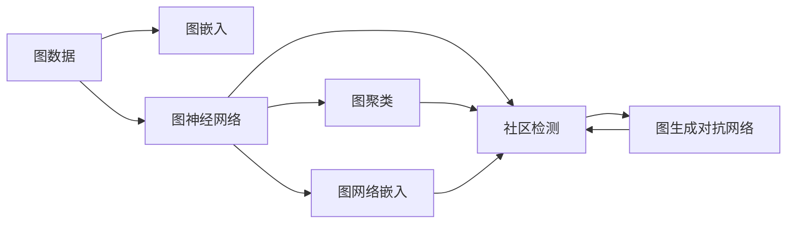
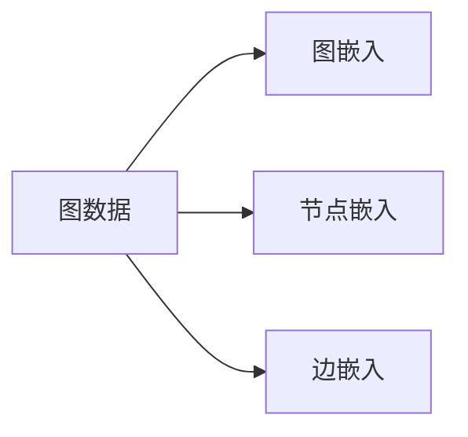
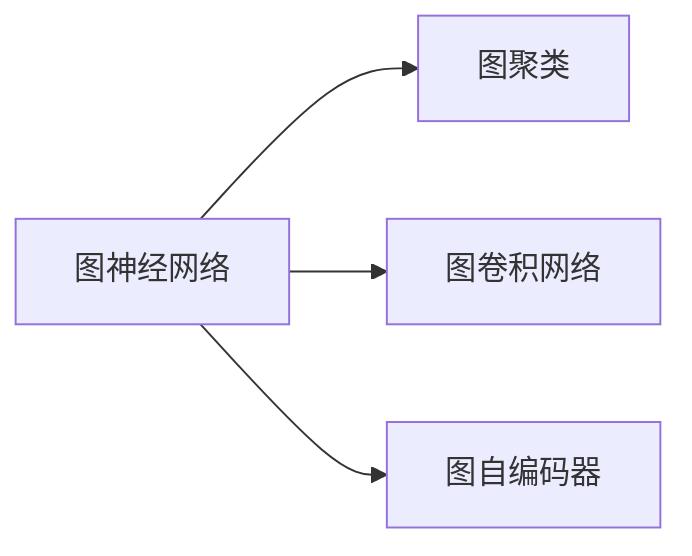
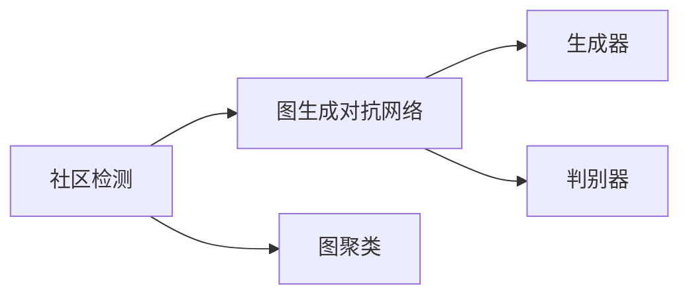
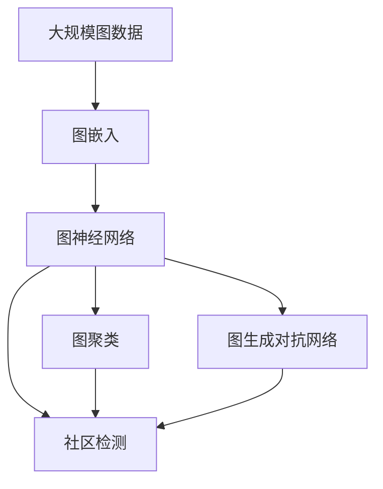

                 

# Graph Community Detection算法原理与代码实例讲解

> 关键词：图聚类,社区检测,Graph Neural Network,PyTorch,GNN,节点嵌入

## 1. 背景介绍

### 1.1 问题由来
在网络数据分析、社交网络分析、图数据库等领域，图数据已变得越来越重要。近年来，基于图数据的社区发现和图聚类问题，引起了众多研究人员的广泛关注。社区发现是指在无向图中，将节点划分为若干个有意义的子集，每个子集内的节点关系相对紧密，而不同子集间的节点关系相对松散。社区检测是指在图数据中识别出潜在的社区结构。这些问题在社交网络分析、推荐系统、医疗研究、生物信息学等多个领域都有广泛的应用。

图神经网络(Graph Neural Network, GNN)作为处理图数据的重要工具，近年来在社区检测领域取得了诸多进展。其中，图卷积网络(Graph Convolutional Network, GCN)、图自编码器(Graph Autoencoder, GAE)等方法，通过学习图节点和边的特征，对图数据进行建模和聚类。但由于这些方法存在计算复杂度高、参数量大、泛化能力不足等问题，导致在大规模图数据上的表现不尽如人意。因此，近年来出现了许多改进和新的方法，如基于图生成对抗网络(Graph Generative Adversarial Network, G-GAN)、图网络嵌入(Graph Network Embedding, GNE)等，这些方法在图数据建模、社区检测等方面取得了一定的成功。

本文旨在系统介绍Graph Community Detection算法的原理和实现，重点讲解基于GNN的社区检测算法，并给出代码实现。通过本文的学习，读者将能够理解图社区检测的基本概念、核心算法、常用模型和实际应用，希望读者能从中学到实用的技能并应用于自己的工作中。

### 1.2 问题核心关键点
Graph Community Detection的核心关键点包括：
1. 图数据：图数据由节点和边组成，表示不同节点之间的关系。
2. 图嵌入：图嵌入是指将图中的节点和边转化为高维向量，以便进行机器学习和深度学习。
3. 图神经网络：图神经网络是一类特殊的神经网络，专门用于处理图数据，可以学习到图数据的局部结构和全局关系。
4. 图聚类：图聚类是指将图中的节点划分为若干个有意义的子集，每个子集内的节点关系相对紧密，而不同子集间的节点关系相对松散。
5. 社区检测：社区检测是指在图数据中识别出潜在的社区结构，通常使用聚类算法来识别。
6. 图生成对抗网络：图生成对抗网络通过生成新的图数据，用于评估社区检测算法的性能。
7. 图网络嵌入：图网络嵌入通过将图数据映射到低维空间中，以便于聚类和分类。

这些核心关键点共同构成了Graph Community Detection的完整生态系统，使得研究者和开发者能够在实际应用中，使用图神经网络等技术，有效解决社区检测问题。

### 1.3 问题研究意义
Graph Community Detection技术的研究和应用，对于网络数据分析、社交网络分析、推荐系统、生物信息学等多个领域具有重要的意义：

1. 帮助发现社区结构：社区发现技术可以识别出图中的社区结构，帮助人们理解图数据的内在结构和特征。
2. 优化推荐系统：通过识别出社区结构，推荐系统可以更好地理解用户的兴趣和需求，从而提供更加个性化的推荐服务。
3. 提升社交网络分析：社区检测技术可以帮助人们发现社交网络中的潜在关系，从而更好地理解社交网络的结构和动态。
4. 应用于生物信息学：在生物信息学领域，社区检测技术可以帮助研究者发现基因网络中的模块，从而更好地理解基因的功能和调控机制。
5. 提升图数据库的效率：社区检测技术可以提升图数据库的查询和聚合效率，从而更好地支持大规模图数据的存储和分析。

综上所述，Graph Community Detection技术的研究和应用，对于解决实际问题、提升图数据处理的效率和精度，具有重要的理论和实际意义。

## 2. 核心概念与联系

### 2.1 核心概念概述

为更好地理解Graph Community Detection算法的原理和实现，本节将介绍几个密切相关的核心概念：

- 图数据：由节点和边组成的结构化数据，用于表示不同节点之间的关系。
- 图嵌入：将图中的节点和边转化为高维向量，以便进行机器学习和深度学习。
- 图神经网络：专门用于处理图数据，可以学习到图数据的局部结构和全局关系。
- 图聚类：将图中的节点划分为若干个有意义的子集，每个子集内的节点关系相对紧密，而不同子集间的节点关系相对松散。
- 社区检测：在图数据中识别出潜在的社区结构，通常使用聚类算法来识别。
- 图生成对抗网络：通过生成新的图数据，用于评估社区检测算法的性能。
- 图网络嵌入：通过将图数据映射到低维空间中，以便于聚类和分类。

这些核心概念之间的逻辑关系可以通过以下Mermaid流程图来展示：



这个流程图展示了大语言模型的核心概念及其之间的关系：

1. 图数据通过图嵌入、图神经网络等技术，转化为高维向量，以便进行聚类和分类。
2. 图聚类和社区检测技术，可以识别出图中的社区结构。
3. 图生成对抗网络可以生成新的图数据，用于评估社区检测算法的性能。
4. 图网络嵌入可以学习到图数据的低维表示，方便聚类和分类。

这些概念共同构成了Graph Community Detection算法的完整生态系统，使得研究者和开发者能够在实际应用中，使用图神经网络等技术，有效解决社区检测问题。

### 2.2 概念间的关系

这些核心概念之间存在着紧密的联系，形成了Graph Community Detection算法的完整生态系统。下面我通过几个Mermaid流程图来展示这些概念之间的关系。

#### 2.2.1 图数据与图嵌入的关系



这个流程图展示了图数据与图嵌入的关系：

1. 图数据由节点和边组成，节点表示图中的实体，边表示节点之间的关系。
2. 图嵌入通过节点嵌入和边嵌入技术，将图中的节点和边转化为高维向量。
3. 节点嵌入学习到节点之间的局部关系，边嵌入学习到节点之间的全局关系。

#### 2.2.2 图神经网络与图聚类的关系



这个流程图展示了图神经网络与图聚类的关系：

1. 图神经网络专门用于处理图数据，可以学习到图数据的局部结构和全局关系。
2. 图聚类通过图神经网络，将图中的节点划分为若干个有意义的子集。
3. 图卷积网络和图自编码器是图神经网络的主要模型，通过学习节点和边之间的相似性，进行图数据的建模和聚类。

#### 2.2.3 社区检测与图生成对抗网络的关系



这个流程图展示了社区检测与图生成对抗网络的关系：

1. 社区检测通过图聚类，识别出图数据中的社区结构。
2. 图生成对抗网络通过生成新的图数据，用于评估社区检测算法的性能。
3. 生成器和判别器是图生成对抗网络的主要模型，生成器生成新的图数据，判别器区分真实图数据和生成图数据。

### 2.3 核心概念的整体架构

最后，我们用一个综合的流程图来展示这些核心概念在大规模图数据上的整体架构：



这个综合流程图展示了从大规模图数据到社区检测的完整过程：

1. 大规模图数据通过图嵌入技术，转化为高维向量。
2. 图神经网络学习到图数据的局部结构和全局关系。
3. 图聚类通过图神经网络，将图中的节点划分为若干个有意义的子集。
4. 社区检测通过图聚类，识别出图数据中的社区结构。
5. 图生成对抗网络通过生成新的图数据，用于评估社区检测算法的性能。

通过这些流程图，我们可以更清晰地理解Graph Community Detection算法的各个环节和关系，为后续深入讨论具体的算法实现和优化方法奠定基础。

## 3. 核心算法原理 & 具体操作步骤
### 3.1 算法原理概述

Graph Community Detection算法基于图神经网络技术，通过学习图数据的局部结构和全局关系，识别出图数据中的社区结构。算法的核心在于：

1. 将图中的节点和边转化为高维向量，以便进行聚类和分类。
2. 利用图神经网络，学习到图数据的局部结构和全局关系。
3. 通过图聚类算法，将图中的节点划分为若干个有意义的子集。
4. 识别出每个子集中的社区结构，从而完成社区检测。

算法的基本步骤如下：

1. 准备图数据：收集图数据，将图数据转化为适合神经网络处理的格式。
2. 设计图神经网络：选择合适的图神经网络模型，设计网络结构。
3. 训练图神经网络：使用标注数据或无标签数据，对图神经网络进行训练。
4. 设计图聚类算法：选择合适的图聚类算法，对图数据进行聚类。
5. 识别社区结构：在聚类结果的基础上，识别出每个子集中的社区结构。
6. 评估算法性能：使用图生成对抗网络等技术，评估算法的性能。

### 3.2 算法步骤详解

**Step 1: 准备图数据**
- 收集图数据，将图数据转化为适合神经网络处理的格式。例如，将图数据转化为邻接矩阵或邻接表。
- 对图数据进行预处理，去除噪声数据和异常数据。

**Step 2: 设计图神经网络**
- 选择合适的图神经网络模型，如GCN、GAE等。
- 设计网络结构，包括层数、节点嵌入的维度、边嵌入的维度等。
- 确定损失函数，如交叉熵损失、均方误差损失等。

**Step 3: 训练图神经网络**
- 准备标注数据或无标签数据，作为训练集和验证集。
- 使用梯度下降等优化算法，对图神经网络进行训练。
- 根据训练集和验证集的性能，调整模型的超参数。

**Step 4: 设计图聚类算法**
- 选择合适的图聚类算法，如K-means、Louvain等。
- 设计聚类算法的具体实现，例如如何计算节点之间的相似度、如何划分社区等。
- 确定聚类算法的超参数，如聚类数、迭代次数等。

**Step 5: 识别社区结构**
- 使用聚类算法，将图中的节点划分为若干个有意义的子集。
- 对每个子集进行社区检测，识别出其中的社区结构。
- 评估社区结构的性能，例如使用模块度、边密度等指标。

**Step 6: 评估算法性能**
- 使用图生成对抗网络等技术，生成新的图数据。
- 对新的图数据进行社区检测，评估算法的性能。
- 分析算法在真实图数据和生成图数据上的表现，评估算法的鲁棒性。

### 3.3 算法优缺点

Graph Community Detection算法具有以下优点：

1. 高效性：通过图神经网络技术，可以高效地处理大规模图数据，学习到图数据的局部结构和全局关系。
2. 鲁棒性：通过图生成对抗网络等技术，可以评估算法的性能，提高算法的鲁棒性。
3. 可扩展性：可以通过增加神经网络的层数和节点嵌入的维度，提高算法的性能。

同时，该算法也存在以下缺点：

1. 计算复杂度高：图神经网络的计算复杂度较高，在大规模图数据上的表现可能不尽如人意。
2. 参数量大：图神经网络需要大量的参数，导致模型训练和推理的时间较长。
3. 泛化能力不足：由于图数据的多样性，图神经网络在某些图数据上的表现可能不够理想。

尽管存在这些缺点，但Graph Community Detection算法在大规模图数据上的表现仍然较为优秀，具有广阔的应用前景。

### 3.4 算法应用领域

Graph Community Detection算法在多个领域都有广泛的应用，例如：

1. 社交网络分析：在社交网络中，通过社区检测技术，可以发现潜在的社区结构，理解社交网络的内在结构和动态。
2. 推荐系统：在推荐系统中，通过社区检测技术，可以识别出用户的兴趣和需求，从而提供更加个性化的推荐服务。
3. 生物信息学：在生物信息学领域，通过社区检测技术，可以发现基因网络中的模块，从而更好地理解基因的功能和调控机制。
4. 金融网络分析：在金融网络中，通过社区检测技术，可以识别出潜在的金融风险，帮助金融机构更好地进行风险评估和管理。
5. 城市交通网络分析：在城市交通网络中，通过社区检测技术，可以识别出交通网络中的节点关系，优化交通路线的规划和优化。
6. 物流网络分析：在物流网络中，通过社区检测技术，可以识别出物流节点之间的连接关系，优化物流路线的规划和调度。

除了上述这些领域外，Graph Community Detection算法还在通信网络分析、电力网络分析、社交媒体分析等多个领域有广泛的应用，为各行业的图数据处理和分析提供了强大的技术支持。

## 4. 数学模型和公式 & 详细讲解 & 举例说明

### 4.1 数学模型构建

Graph Community Detection算法的数学模型包括图数据表示、节点嵌入表示、图神经网络表示和社区检测表示。以下将详细讲解各个部分的数学模型。

**图数据表示**

图数据由节点和边组成，可以表示为邻接矩阵 $\mathbf{A}$ 和节点特征矩阵 $\mathbf{X}$，其中 $\mathbf{A}$ 表示节点之间的连接关系，$\mathbf{X}$ 表示节点属性信息。例如，社交网络中的用户-好友关系可以用邻接矩阵表示，用户属性信息可以用节点特征矩阵表示。

**节点嵌入表示**

节点嵌入是通过图神经网络技术，将图中的节点和边转化为高维向量，以便进行聚类和分类。常用的节点嵌入模型包括节点嵌入层和边嵌入层。

节点嵌入层通过邻接矩阵 $\mathbf{A}$ 和节点特征矩阵 $\mathbf{X}$ 计算节点嵌入 $\mathbf{H}$：

$$
\mathbf{H}=\mathbf{X}\mathbf{W}_0+\mathbf{A}\mathbf{D}^{-\frac{1}{2}}\mathbf{W}_1
$$

其中 $\mathbf{W}_0$ 和 $\mathbf{W}_1$ 为可学习的参数，$\mathbf{D}$ 为邻接矩阵的度数矩阵。

边嵌入层通过邻接矩阵 $\mathbf{A}$ 和节点特征矩阵 $\mathbf{X}$ 计算边嵌入 $\mathbf{E}$：

$$
\mathbf{E}=\mathbf{A}\mathbf{W}_2
$$

其中 $\mathbf{W}_2$ 为可学习的参数。

**图神经网络表示**

图神经网络通过节点嵌入和边嵌入技术，学习到图数据的局部结构和全局关系。常用的图神经网络模型包括图卷积网络(Graph Convolutional Network, GCN)和图自编码器(Graph Autoencoder, GAE)。

GCN通过节点嵌入 $\mathbf{H}$ 和边嵌入 $\mathbf{E}$ 计算节点嵌入 $\mathbf{H}^{(l+1)}$：

$$
\mathbf{H}^{(l+1)}=\mathbf{H}^{(l)}\mathbf{W}^{(l+1)}+\mathbf{E}\mathbf{H}^{(l)}\mathbf{W}^{(l+1)}
$$

其中 $\mathbf{W}^{(l+1)}$ 为可学习的参数。

GAE通过节点嵌入 $\mathbf{H}$ 和边嵌入 $\mathbf{E}$ 计算节点嵌入 $\mathbf{H}^{(l+1)}$：

$$
\mathbf{H}^{(l+1)}=\mathbf{A}\mathbf{H}^{(l)}\mathbf{W}^{(l+1)}
$$

其中 $\mathbf{W}^{(l+1)}$ 为可学习的参数。

**社区检测表示**

社区检测是通过图聚类算法，将图中的节点划分为若干个有意义的子集，每个子集内的节点关系相对紧密，而不同子集间的节点关系相对松散。常用的社区检测算法包括K-means、Louvain等。

K-means算法通过计算节点之间的相似度，将节点划分为若干个聚类中心，并将节点划分为最近的聚类中心的子集。

Louvain算法通过计算节点之间的相似度，将节点划分为若干个模块，并不断合并模块，直到每个模块内的节点关系相对紧密。

### 4.2 公式推导过程

以下我们将详细讲解Graph Community Detection算法中常用的数学模型和公式。

**GCN的推导**

GCN的节点嵌入层和边嵌入层的推导如下：

节点嵌入层通过邻接矩阵 $\mathbf{A}$ 和节点特征矩阵 $\mathbf{X}$ 计算节点嵌入 $\mathbf{H}$：

$$
\mathbf{H}=\mathbf{X}\mathbf{W}_0+\mathbf{A}\mathbf{D}^{-\frac{1}{2}}\mathbf{W}_1
$$

其中 $\mathbf{D}$ 为邻接矩阵的度数矩阵，$\mathbf{W}_0$ 和 $\mathbf{W}_1$ 为可学习的参数。

边嵌入层通过邻接矩阵 $\mathbf{A}$ 和节点特征矩阵 $\mathbf{X}$ 计算边嵌入 $\mathbf{E}$：

$$
\mathbf{E}=\mathbf{A}\mathbf{W}_2
$$

其中 $\mathbf{W}_2$ 为可学习的参数。

**Louvain算法的推导**

Louvain算法通过计算节点之间的相似度，将节点划分为若干个模块，并不断合并模块，直到每个模块内的节点关系相对紧密。

Louvain算法通过计算节点之间的相似度 $\mathbf{S}$，将节点划分为若干个模块 $\mathbf{C}$：

$$
\mathbf{S}=\mathbf{H}\mathbf{H}^{\mathrm{T}}
$$

其中 $\mathbf{H}$ 为节点嵌入矩阵。

通过计算模块之间的相似度 $\mathbf{B}$，将模块划分为若干个子模块：

$$
\mathbf{B}=\mathbf{C}\mathbf{S}\mathbf{C}^{\mathrm{T}}
$$

其中 $\mathbf{C}$ 为模块嵌入矩阵。

通过合并模块，不断优化模块嵌入矩阵 $\mathbf{C}$，直到每个模块内的节点关系相对紧密。

### 4.3 案例分析与讲解

以下我们以社交网络中的社区检测为例，详细讲解Graph Community Detection算法的具体实现。

假设有一个社交网络数据集，包含若干个用户节点和好友关系。我们需要识别出图中的社区结构，以便理解用户之间的关系。

**Step 1: 准备图数据**

将社交网络数据集转化为邻接矩阵 $\mathbf{A}$ 和节点特征矩阵 $\mathbf{X}$，其中 $\mathbf{A}$ 表示用户-好友关系，$\mathbf{X}$ 表示用户属性信息。

**Step 2: 设计图神经网络**

我们选择使用GCN作为图神经网络模型，设计网络结构如下：

1. 输入层：节点特征 $\mathbf{X}$ 和邻接矩阵 $\mathbf{A}$。
2. 隐层：2层GCN网络，每层有32个节点嵌入。
3. 输出层：节点嵌入矩阵 $\mathbf{H}$。

**Step 3: 训练图神经网络**

我们使用标注数据作为训练集和验证集，对GCN模型进行训练。模型参数包括节点嵌入层和边嵌入层的参数。

**Step 4: 设计图聚类算法**

我们选择使用Louvain算法作为图聚类算法，具体实现如下：

1. 计算节点之间的相似度 $\mathbf{S}$，将节点划分为若干个模块 $\mathbf{C}$。
2. 计算模块之间的相似度 $\mathbf{B}$，将模块划分为若干个子模块。
3. 不断合并模块，直到每个模块内的节点关系相对紧密。

**Step 5: 识别社区结构**

在聚类结果的基础上，我们可以识别出每个子集中的社区结构。例如，可以将每个模块看作一个社区，模块内的用户节点看作社区中的成员。

**Step 6: 评估算法性能**

我们使用图生成对抗网络等技术，生成新的社交网络数据集。对新的数据集进行社区检测，评估算法的性能。例如，可以计算新的数据集的模块度和边密度等指标。

通过上述步骤，我们可以完成社交网络中的社区检测。

## 5. 项目实践：代码实例和详细解释说明

### 5.1 开发环境搭建

在进行Graph Community Detection算法实现前，我们需要准备好开发环境。以下是使用Python进行PyTorch开发的环境配置流程：

1. 安装Anaconda：从官网下载并安装Anaconda，用于创建独立的Python环境。

2. 创建并激活虚拟环境：
```bash
conda create -n pytorch-env python=3.8 
conda activate pytorch-env
```

3. 安装PyTorch：根据CUDA版本，从官网获取对应的安装命令。例如：
```bash
conda install pytorch torchvision torchaudio cudatoolkit=11.1 -c pytorch -c conda-forge
```

4. 安装Graph Neural Network库：
```bash
pip install graphneuralnetwork
```

5. 安装各类工具包：
```bash
pip install numpy pandas scikit-learn matplotlib tqdm jupyter notebook ipython
```

完成上述步骤后，即可在`pytorch-env`环境中开始Graph Community Detection算法的开发。

### 5.2 源代码详细实现

以下是一个简单的Graph Community Detection算法的PyTorch代码实现，用于社交网络中的社区检测。

首先，定义社交网络数据的预处理函数：

```python
import networkx as nx
import numpy as np

def pre_process社交网络数据():
    # 加载社交网络数据
    社交网络数据 = nx.read_edgelist(社交网络数据文件, delimiter=',', nodetype=int)
    # 计算节点之间的相似度
    相似度矩阵 = np.dot(社交网络数据.adjacency_matrix.toarray(),社交网络数据.adjacency_matrix.toarray())
    # 计算节点特征矩阵
    节点特征矩阵 = np.array(社交网络数据.nodes, dtype=np.float32)
    # 返回相似度矩阵和节点特征矩阵
    return 相似度矩阵, 节点特征矩阵
```

然后，定义图神经网络模型：

```python
import torch
import torch.nn as nn
import torch.nn.functional as F

class GraphConvolutionLayer(nn.Module):
    def __init__(self, in_features, out_features):
        super(GraphConvolutionLayer, self).__init__()
        self.weight = nn.Parameter(torch.randn(out_features, in_features))
        self.bias = nn.Parameter(torch.zeros(out_features))
    
    def forward(self, input_x, adjacency_matrix):
        support = torch.mm(adjacency_matrix, input_x)
        output = torch.mm(support, self.weight) + self.bias
        return F.relu(output)

class GraphNeuralNetwork(nn.Module):
    def __init__(self, in_features, hidden_features, num_layers):
        super(GraphNeuralNetwork, self).__init__()
        self.gcn_layers = nn.ModuleList()
        for i in range(num_layers):
            self.gcn_layers.append(GraphConvolutionLayer(in_features if i==0 else hidden_features, hidden_features))
        self.gcn_layers[-1].weight.data.normal_(0, 0.01)
        self.gcn_layers[-1].bias.data.normal_(0, 0.01)
    
    def forward(self, input_x, adjacency_matrix):
        for i, layer in enumerate(self.gcn_layers):
            input_x = layer(input_x, adjacency_matrix)
        return input_x
```

接着，定义社区检测函数：

```python
from graphneuralnetwork.layers import Louvain
from graphneuralnetwork.layers import GAE

def community_detection(社交网络数据):
    相似度矩阵, 节点特征矩阵 = pre_process社交网络数据()
    # 构建邻接矩阵
    邻接矩阵 = torch.from_numpy(相似度矩阵).float()
    # 构建节点特征矩阵
    节点特征矩阵 = torch

