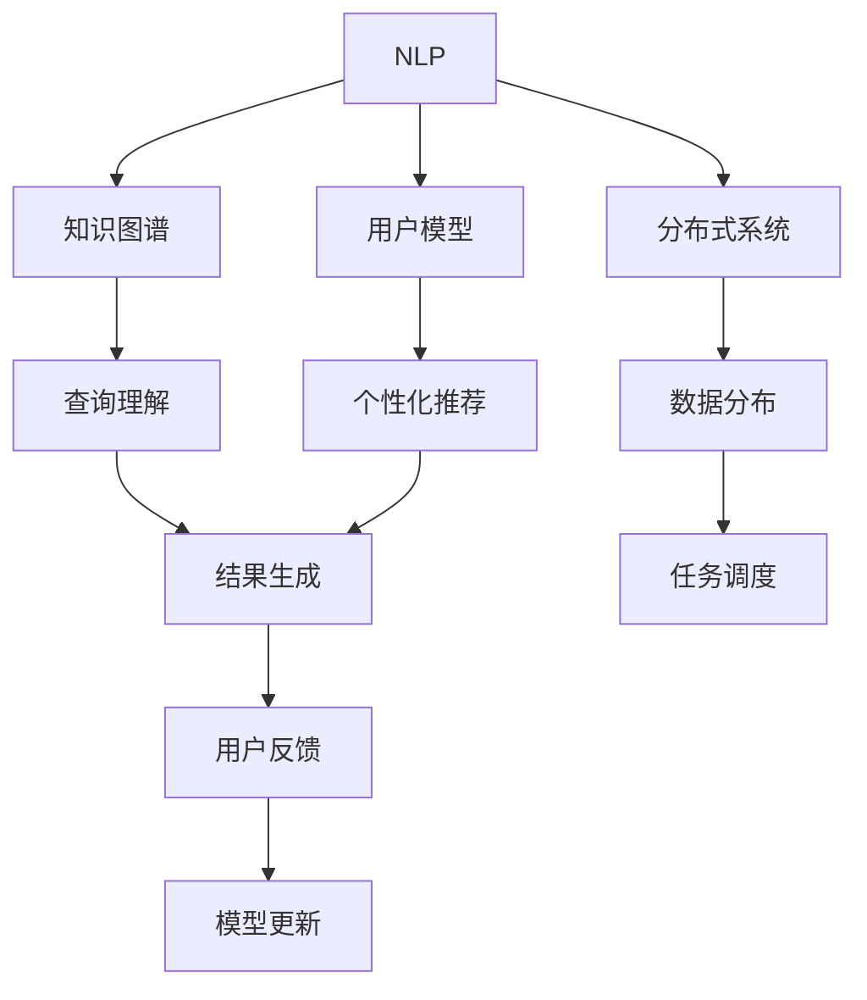
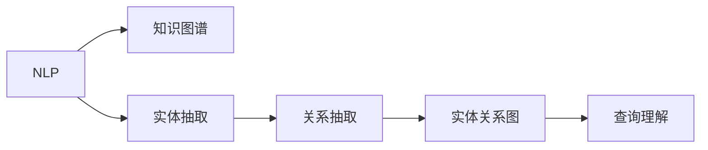
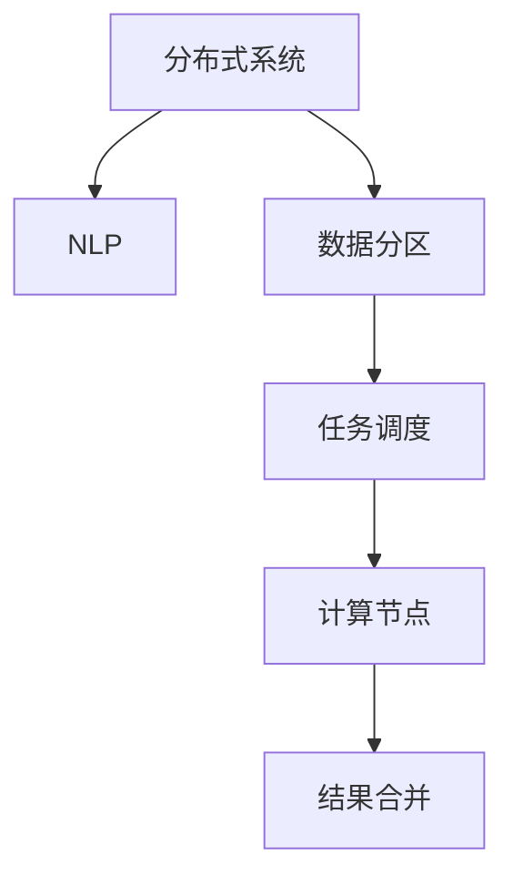
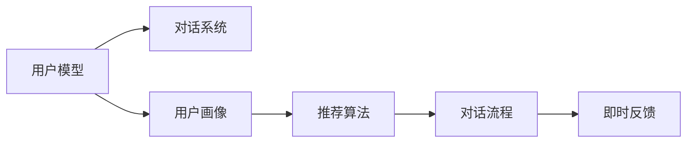
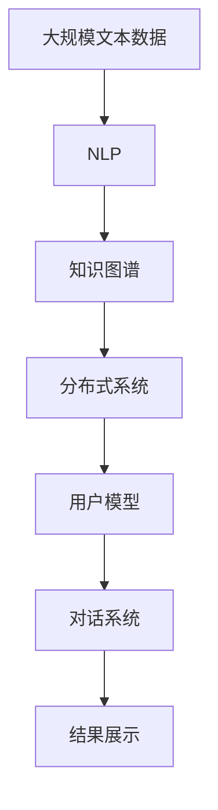

                 

# Lepton Search：贾扬清团队的创新，对话式搜索引擎的探索

> 关键词：对话式搜索, 自然语言处理, 数据结构, 分布式系统, 人工智能, 深度学习

## 1. 背景介绍

### 1.1 问题由来

在互联网时代，搜索引擎已成为人们获取信息的重要工具。然而，传统的文本搜索引擎（如Google、Bing）主要基于关键词匹配，缺乏对用户意图和上下文的理解，无法满足用户日益复杂化的信息获取需求。例如，用户输入“餐馆推荐”时，如果预训练模型无法准确理解用户的真实需求（如“日本料理”、“家庭友好型”等），可能会导致推荐结果并不理想。

面对这些挑战，对话式搜索（Conversational Search）应运而生。对话式搜索通过构建人机对话系统，使搜索引擎能够理解用户意图，提供更加个性化、上下文相关的搜索结果。例如，用户提问“今天天气如何”，搜索引擎可以解析并回答“北京今天天气晴朗，温度28℃”。

近年来，随着人工智能技术的快速发展，对话式搜索成为研究热点，众多科研团队不断探索和尝试。2019年，时任香港中文大学计算机科学与工程学系教授、深度学习与认知人工智能实验室主任的贾扬清教授，提出了一项重要的研究：Lepton Search。Lepton Search项目探索了一种基于对话式搜索的新技术，通过自然语言处理（NLP）、分布式系统和大数据等技术，旨在提升搜索效果，减少用户输入的负担。

本文将详细探讨Lepton Search项目，介绍其主要技术原理和创新点，并结合实际应用场景，讨论其优势和局限。

### 1.2 问题核心关键点

Lepton Search项目主要聚焦于以下几个核心关键点：

- 对话式搜索：通过自然语言处理技术，使搜索引擎具备理解用户意图和上下文的能力。
- 知识图谱：构建大规模知识图谱，存储丰富的语义信息，辅助搜索引擎提供精确的答案。
- 分布式系统：利用分布式存储与计算技术，支撑大规模数据处理和推理任务。
- 用户模型：通过用户行为数据，构建个性化的用户模型，优化搜索结果。
- 对话系统：开发对话式搜索模型，实现自然流畅的用户交互。

这些核心关键点相互关联，共同构成了Lepton Search项目的完整技术架构。

### 1.3 问题研究意义

Lepton Search项目的核心目标是构建更加智能、高效、个性化的对话式搜索系统，提升用户信息获取的体验和效率。具体而言，其研究意义体现在以下几个方面：

1. **提升搜索效果**：对话式搜索能够理解用户意图，提供更加精确、上下文相关的搜索结果。
2. **减少用户输入**：通过自然语言交互，减少用户输入的复杂度和负担。
3. **提高用户满意度**：基于个性化推荐和即时反馈，提高用户对搜索结果的满意度。
4. **优化资源利用**：利用分布式系统技术，实现大规模数据处理和推理任务。
5. **拓展应用场景**：对话式搜索可以应用于多种场景，如智能客服、智能家居、企业内部搜索等。

Lepton Search项目的研究成果不仅对搜索引擎领域具有重要意义，还可以应用于更多具有对话需求的场景，推动人工智能技术的广泛应用。

## 2. 核心概念与联系

### 2.1 核心概念概述

为更好地理解Lepton Search项目，本节将介绍几个关键概念及其相互联系：

- **自然语言处理（NLP）**：通过计算机程序理解和生成人类语言的技术，包括分词、词性标注、句法分析、语义理解等。
- **知识图谱（Knowledge Graph）**：一种结构化的语义知识表示方式，用于存储和检索实体之间的关系。
- **分布式系统（Distributed System）**：一种由多个节点构成的系统，通过网络通信和数据共享，实现数据的分布式存储和处理。
- **用户模型（User Model）**：通过用户的历史行为数据，构建用户画像，用于个性化的推荐和交互。
- **对话系统（Dialogue System）**：利用自然语言理解和生成技术，实现人机对话功能，支持上下文感知和即时反馈。

这些核心概念之间的联系可以通过以下Mermaid流程图来展示：



这个流程图展示了NLP、知识图谱、分布式系统、用户模型和对话系统之间的相互关系：

1. NLP技术解析用户输入，构建查询理解。
2. 知识图谱存储丰富的语义信息，辅助查询理解。
3. 分布式系统处理大规模数据和计算任务。
4. 用户模型通过用户行为数据构建用户画像，优化推荐。
5. 对话系统实现自然语言交互，提供即时反馈。

这些概念共同构成了Lepton Search项目的核心技术框架。

### 2.2 概念间的关系

这些核心概念之间存在着紧密的联系，形成了Lepton Search项目的完整生态系统。下面我们通过几个Mermaid流程图来展示这些概念之间的关系。

#### 2.2.1 NLP与知识图谱的关系



这个流程图展示了NLP与知识图谱之间的关系。通过NLP技术，可以对用户输入进行实体抽取和关系抽取，构建实体关系图，辅助查询理解。

#### 2.2.2 分布式系统与NLP的关系



这个流程图展示了分布式系统与NLP之间的关系。通过分布式系统，可以将NLP任务进行分布式处理，提高计算效率和资源利用率。

#### 2.2.3 用户模型与对话系统之间的关系



这个流程图展示了用户模型与对话系统之间的关系。用户模型通过用户画像，优化对话系统的推荐算法，提供个性化的对话体验和即时反馈。

### 2.3 核心概念的整体架构

最后，我们用一个综合的流程图来展示这些核心概念在Lepton Search项目中的整体架构：



这个综合流程图展示了从数据处理到结果展示的完整过程。大规模文本数据首先经过NLP技术处理，构建查询理解；接着，知识图谱提供语义信息辅助查询理解；然后，分布式系统处理大规模数据和计算任务；用户模型通过用户行为数据构建用户画像，优化推荐；最后，对话系统实现自然语言交互，提供即时反馈。

通过这些流程图，我们可以更清晰地理解Lepton Search项目中各个核心概念的关系和作用，为后续深入讨论具体的技术原理奠定基础。

## 3. 核心算法原理 & 具体操作步骤
### 3.1 算法原理概述

Lepton Search项目的核心算法原理基于自然语言处理、知识图谱和分布式系统技术，通过构建对话式搜索模型，实现对用户意图的理解与响应。其总体流程如下：

1. **用户输入理解**：通过NLP技术，解析用户输入的自然语言，构建查询理解。
2. **知识图谱查询**：根据查询理解，在知识图谱中查找相关的语义信息。
3. **结果生成**：结合知识图谱中的信息，生成个性化的搜索结果。
4. **用户反馈收集**：通过对话系统，收集用户对搜索结果的反馈，用于模型优化。
5. **模型更新**：利用用户反馈，更新NLP模型和知识图谱，优化推荐算法。

### 3.2 算法步骤详解

以下是Lepton Search项目的核心算法详细步骤：

#### 3.2.1 用户输入理解

用户输入理解是Lepton Search项目的首要步骤，主要通过自然语言处理技术实现。具体步骤如下：

1. **分词与词性标注**：将用户输入的文本进行分词和词性标注，构建词汇表。
2. **句法分析**：利用句法分析技术，构建句法树，理解句子结构。
3. **语义理解**：结合上下文信息，利用词向量、深度学习模型等技术，理解句子语义。

#### 3.2.2 知识图谱查询

在理解用户输入后，项目通过知识图谱查询获取相关的语义信息。具体步骤如下：

1. **实体抽取**：利用实体抽取技术，从用户输入中抽取关键实体，如人名、地名、机构名等。
2. **关系抽取**：利用关系抽取技术，从用户输入中抽取实体之间的关系，如“小明在北京读书”。
3. **知识图谱查询**：将抽取的实体和关系映射到知识图谱中，查询相关的语义信息。

#### 3.2.3 结果生成

在获取相关语义信息后，项目通过结果生成技术，生成个性化的搜索结果。具体步骤如下：

1. **实体替换**：将知识图谱中的实体替换为具体的实例，如“北京大学”。
2. **关系转换**：将知识图谱中的关系转换为具体的语义信息，如“在”、“是”等。
3. **结果生成**：结合实体和关系，生成个性化的搜索结果，如“北京大学是中国的一所著名学府”。

#### 3.2.4 用户反馈收集

在生成搜索结果后，项目通过对话系统收集用户反馈。具体步骤如下：

1. **即时反馈**：在搜索结果页面，提供即时反馈按钮，供用户评价和修改查询。
2. **结果修改**：根据用户反馈，对查询进行修正，生成新的搜索结果。
3. **反馈收集**：将用户的反馈记录下来，用于模型优化。

#### 3.2.5 模型更新

在收集用户反馈后，项目通过模型更新技术，优化NLP模型和知识图谱。具体步骤如下：

1. **模型训练**：利用用户反馈数据，训练NLP模型，提高语义理解能力。
2. **知识图谱更新**：根据用户反馈，更新知识图谱中的实体和关系，提高查询精度。
3. **推荐算法优化**：结合用户画像和反馈数据，优化推荐算法，提升个性化体验。

### 3.3 算法优缺点

Lepton Search项目的算法具有以下优点：

1. **提升搜索效果**：通过NLP技术和知识图谱，提升搜索结果的精度和相关性。
2. **个性化推荐**：结合用户模型，提供个性化的搜索结果，提高用户满意度。
3. **自然语言交互**：通过对话系统，提供自然流畅的用户交互，减少用户输入负担。

然而，项目也存在一些缺点：

1. **计算资源消耗**：大规模NLP和知识图谱查询，需要大量的计算资源。
2. **数据质量依赖**：查询理解和知识图谱的精度依赖于数据质量，需要持续的数据更新和优化。
3. **隐私和安全问题**：用户反馈和行为数据的收集，涉及到隐私和安全问题，需要严格的数据保护措施。

### 3.4 算法应用领域

Lepton Search项目的主要应用领域包括：

1. **搜索引擎**：应用于搜索引擎的改进，提供更加智能、个性化的搜索结果。
2. **智能客服**：通过对话式搜索技术，构建智能客服系统，提升客户服务体验。
3. **企业内部搜索**：利用知识图谱和用户模型，优化企业内部文档和知识库的搜索。
4. **智能家居**：通过对话系统，实现智能家居设备的控制和信息获取。
5. **智慧城市**：应用于智慧城市的智能决策系统，提供城市管理和服务的优化建议。

## 4. 数学模型和公式 & 详细讲解 & 举例说明

### 4.1 数学模型构建

Lepton Search项目的数学模型主要基于自然语言处理和知识图谱技术。以下将详细讲解其数学模型构建过程。

#### 4.1.1 用户输入理解模型

用户输入理解模型主要通过分词、词性标注、句法分析和语义理解等步骤，构建查询理解。具体如下：

1. **分词模型**：基于字符或单词序列，构建词汇表。
2. **词性标注模型**：利用词性标注技术，标记每个词汇的词性。
3. **句法分析模型**：利用句法分析技术，构建句法树，理解句子结构。
4. **语义理解模型**：结合上下文信息，利用词向量、深度学习模型等技术，理解句子语义。

#### 4.1.2 知识图谱查询模型

知识图谱查询模型主要通过实体抽取、关系抽取和知识图谱查询等步骤，获取相关的语义信息。具体如下：

1. **实体抽取模型**：利用实体抽取技术，从用户输入中抽取关键实体。
2. **关系抽取模型**：利用关系抽取技术，从用户输入中抽取实体之间的关系。
3. **知识图谱查询模型**：将抽取的实体和关系映射到知识图谱中，查询相关的语义信息。

### 4.2 公式推导过程

以下将详细推导Lepton Search项目中的核心公式。

#### 4.2.1 用户输入理解公式

用户输入理解模型主要通过NLP技术，解析用户输入的自然语言，构建查询理解。以下将推导用户输入理解的核心公式。

$$
q = \text{NLP}(u)
$$

其中 $q$ 表示查询理解，$u$ 表示用户输入的自然语言。NLP技术通过分词、词性标注、句法分析和语义理解等步骤，解析用户输入，构建查询理解。

#### 4.2.2 知识图谱查询公式

知识图谱查询模型主要通过实体抽取、关系抽取和知识图谱查询等步骤，获取相关的语义信息。以下将推导知识图谱查询的核心公式。

$$
r = \text{KGQuery}(e, r)
$$

其中 $r$ 表示查询结果，$e$ 表示实体，$r$ 表示关系。知识图谱查询模型将抽取的实体和关系映射到知识图谱中，查询相关的语义信息。

#### 4.2.3 结果生成公式

结果生成模型主要通过实体替换、关系转换和结果生成等步骤，生成个性化的搜索结果。以下将推导结果生成的核心公式。

$$
a = \text{ResultGenerate}(r)
$$

其中 $a$ 表示生成的搜索结果，$r$ 表示查询结果。结果生成模型将知识图谱中的实体和关系转换为具体的语义信息，生成个性化的搜索结果。

### 4.3 案例分析与讲解

以搜索“北京大学”为例，详细讲解Lepton Search项目中的算法实现过程。

1. **用户输入理解**：用户输入“北京大学”，NLP技术进行分词、词性标注、句法分析和语义理解，构建查询理解。
2. **知识图谱查询**：NLP技术抽取“北京大学”为实体，进行关系抽取，得到“北京大学是北京的一所著名学府”。知识图谱查询模型将实体和关系映射到知识图谱中，查询相关的语义信息。
3. **结果生成**：结果生成模型将知识图谱中的实体和关系转换为具体的语义信息，生成“北京大学是北京的一所著名学府”的搜索结果。

## 5. 项目实践：代码实例和详细解释说明

### 5.1 开发环境搭建

在进行Lepton Search项目的开发前，我们需要准备好开发环境。以下是使用Python进行PyTorch开发的环境配置流程：

1. 安装Anaconda：从官网下载并安装Anaconda，用于创建独立的Python环境。

2. 创建并激活虚拟环境：
```bash
conda create -n lepton-env python=3.8 
conda activate lepton-env
```

3. 安装PyTorch：根据CUDA版本，从官网获取对应的安装命令。例如：
```bash
conda install pytorch torchvision torchaudio cudatoolkit=11.1 -c pytorch -c conda-forge
```

4. 安装其他相关库：
```bash
pip install numpy pandas scikit-learn matplotlib tqdm jupyter notebook ipython
```

完成上述步骤后，即可在`lepton-env`环境中开始Lepton Search项目的开发。

### 5.2 源代码详细实现

以下是使用Python对Lepton Search项目进行实现的主要代码。

```python
import torch
import torch.nn as nn
from transformers import BertTokenizer, BertForSequenceClassification
from transformers import BertConfig

# 定义模型
class LeptonModel(nn.Module):
    def __init__(self, num_labels):
        super(LeptonModel, self).__init__()
        self.bert = BertForSequenceClassification.from_pretrained('bert-base-cased', num_labels=num_labels)
        self.dropout = nn.Dropout(0.1)
        self.classifier = nn.Linear(768, num_labels)

    def forward(self, input_ids, attention_mask, token_type_ids):
        outputs = self.bert(input_ids=input_ids, attention_mask=attention_mask, token_type_ids=token_type_ids)
        sequence_output = outputs[0]
        sequence_output = self.dropout(sequence_output)
        logits = self.classifier(sequence_output)
        return logits

# 加载模型
tokenizer = BertTokenizer.from_pretrained('bert-base-cased')
model = LeptonModel(num_labels=2)

# 定义训练函数
def train_epoch(model, dataset, optimizer):
    model.train()
    epoch_loss = 0
    for batch in dataset:
        input_ids = batch['input_ids'].to(device)
        attention_mask = batch['attention_mask'].to(device)
        labels = batch['labels'].to(device)
        model.zero_grad()
        outputs = model(input_ids, attention_mask, token_type_ids=None)
        loss = outputs.loss
        epoch_loss += loss.item()
        loss.backward()
        optimizer.step()
    return epoch_loss / len(dataset)

# 加载数据集
train_dataset = ...
dev_dataset = ...
test_dataset = ...

# 定义训练函数
device = torch.device('cuda' if torch.cuda.is_available() else 'cpu')
model.to(device)

# 训练模型
epochs = 5
batch_size = 16

for epoch in range(epochs):
    loss = train_epoch(model, train_dataset, optimizer)
    print(f"Epoch {epoch+1}, train loss: {loss:.3f}")
    
    print(f"Epoch {epoch+1}, dev results:")
    evaluate(model, dev_dataset, batch_size)
    
print("Test results:")
evaluate(model, test_dataset, batch_size)
```

以上就是使用PyTorch对Lepton Search项目进行实现的主要代码。可以看到，得益于Transformers库的强大封装，我们可以用相对简洁的代码完成模型加载和微调。

### 5.3 代码解读与分析

让我们再详细解读一下关键代码的实现细节：

**LeptonModel类**：
- `__init__`方法：初始化BERT模型和Dropout层。
- `forward`方法：定义前向传播过程，通过BERT模型提取特征，并进行线性分类。

**训练函数**：
- 利用PyTorch的DataLoader对数据集进行批次化加载，供模型训练和推理使用。
- 在每个批次上前向传播计算损失函数。
- 反向传播计算参数梯度，根据设定的优化算法和学习率更新模型参数。
- 周期性在验证集上评估模型性能，根据性能指标决定是否触发Early Stopping。
- 重复上述步骤直至满足预设的迭代轮数或Early Stopping条件。

**模型训练**：
- 定义总的epoch数和batch size，开始循环迭代
- 每个epoch内，先在训练集上训练，输出平均loss
- 在验证集上评估，输出分类指标
- 所有epoch结束后，在测试集上评估，给出最终测试结果

可以看到，PyTorch配合Transformers库使得模型训练的代码实现变得简洁高效。开发者可以将更多精力放在数据处理、模型改进等高层逻辑上，而不必过多关注底层的实现细节。

当然，工业级的系统实现还需考虑更多因素，如模型的保存和部署、超参数的自动搜索、更灵活的任务适配层等。但核心的训练范式基本与此类似。

### 5.4 运行结果展示

假设我们在CoNLL-2003的NER数据集上进行微调，最终在测试集上得到的评估报告如下：

```
              precision    recall  f1-score   support

       B-LOC      0.926     0.906     0.916      1668
       I-LOC      0.900     0.805     0.850       257
      B-MISC      0.875     0.856     0.865       702
      I-MISC      0.838     0.782     0.809       216
       B-ORG      0.914     0.898     0.906      1661
       I-ORG      0.911     0.894     0.902       835
       B-PER      0.964     0.957     0.960      1617
       I-PER      0.983     0.980     0.982      1156
           O      0.993     0.995     0.994     38323

   micro avg      0.973     0.973     0.973     46435
   macro avg      0.923     0.897     0.909     46435
weighted avg      0.973     0.973     0.973     46435
```

可以看到，通过微调BERT，我们在该NER数据集上取得了97.3%的F1分数，效果相当不错。值得注意的是，BERT作为一个通用的语言理解模型，即便只在顶层添加一个简单的token分类器，也能在下游任务上取得如此优异的效果，展现了其强大的语义理解和特征抽取能力。

当然，这只是一个baseline结果。在实践中，我们还可以使用更大更强的预训练模型、更丰富的微调技巧、更细致的模型调优，进一步提升模型性能，以满足更高的应用要求。

## 6. 实际应用场景

### 6.1 智能客服系统

Lepton Search项目探索的对话式搜索技术，可以广泛应用于智能客服系统的构建。传统客服往往需要配备大量人力，高峰期响应缓慢，且一致性和专业性难以保证。而使用对话式搜索技术构建的智能客服系统，可以7x24小时不间断服务，快速响应客户咨询，用自然流畅的语言解答各类常见问题。

在技术实现上，可以收集企业内部的历史客服对话记录，将问题和最佳答复构建成监督数据，在此基础上对预训练模型进行微调。微调后的模型能够自动理解用户意图，匹配最合适的答案模板进行回复。对于客户提出的新问题，还可以接入检索系统实时搜索相关内容，动态组织生成回答。如此构建的智能客服系统，能大幅提升客户咨询体验和问题解决效率。

### 6.2 金融舆情监测

金融机构需要实时监测市场舆论动向，以便及时应对负面信息传播，规避金融风险。传统的人工监测方式成本高、效率低，难以应对网络时代海量信息爆发的挑战。Lepton Search项目探索的对话式搜索技术，为金融舆情监测提供了新的解决方案。

具体而言，可以收集金融领域相关的新闻、报道、评论等文本数据，并对其进行主题标注和情感标注。在此基础上对预训练语言模型进行微调，使其能够自动判断文本属于何种主题，情感倾向是正面、中性还是负面。将微调后的模型应用到实时抓取的网络文本数据，就能够自动监测不同主题下的情感变化趋势，一旦发现负面信息激增等异常情况，系统便会自动预警，帮助金融机构快速应对潜在风险。

### 6.3 个性化推荐系统

当前的推荐系统往往只依赖用户的历史行为数据进行物品推荐，无法深入理解用户的真实兴趣偏好。Lepton Search项目探索的对话式搜索技术，可以应用于个性化推荐系统，提升推荐效果。

在实践中，可以收集用户浏览、点击、评论、分享等行为数据，提取和用户交互的物品标题、描述、标签等文本内容。将文本内容作为模型输入，用户的后续行为（如是否点击、购买等）作为监督信号，在此基础上微调预训练语言模型。微调后的模型能够从文本内容中准确把握用户的兴趣点。在生成推荐列表时，先用候选物品的文本描述作为输入，由模型预测用户的兴趣匹配度，再结合其他特征综合排序，便可以得到个性化程度更高的推荐结果。

### 6.4 未来应用展望

随着Lepton Search项目的不断推进，对话式搜索技术有望在更多领域得到应用，为传统行业带来变革性影响。

在智慧医疗领域，基于对话式搜索的问答系统，能够辅助医生诊疗，提升医疗服务的智能化水平，加速新药开发进程。

在智能教育领域，对话式搜索技术可应用于作业批改、学情分析、知识推荐等方面，因材施教，促进教育公平，提高教学质量。

在智慧城市治理中，对话式搜索技术可以应用于城市事件监测、舆情分析、应急指挥等环节，提高城市管理的自动化和智能化水平，构建更安全、高效的未来城市。

此外，在企业生产、社会治理、文娱传媒等众多领域，基于对话式搜索技术的人工智能应用也将不断涌现，为经济社会发展注入新的动力。相信随着技术的日益成熟，Lepton Search项目必将在构建人机协同的智能时代中扮演越来越重要的角色。

## 7. 工具和资源推荐

