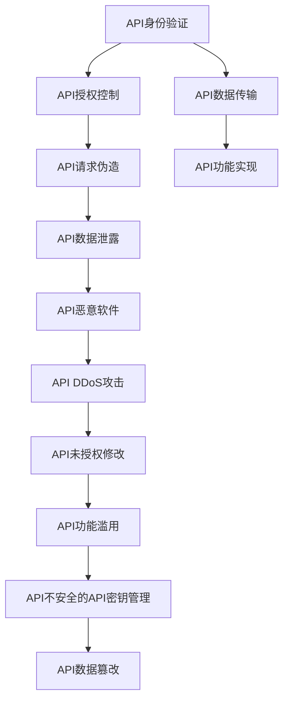

                 

# OWASP API 安全风险清单的概述

> 关键词：API安全,安全风险清单,安全评估,攻击技术,防御措施

## 1. 背景介绍

### 1.1 问题由来
随着云计算和微服务的兴起，API（Application Programming Interface）成为了现代企业应用中不可或缺的一部分。API使不同系统和组件之间的通信变得更加简单、高效，但也随之带来了新的安全挑战。近年来，API安全事件频发，给企业带来了巨大的经济损失和声誉损害。

例如，2017年，知名电商平台Shopify因API泄露导致1000万个订单数据被窃取，直接经济损失高达3亿美元。2021年，支付公司PayPal也被黑客通过API攻击导致数百万用户的银行信息被窃取。

为了应对API安全威胁，OWASP（Open Web Application Security Project）发布了OWASP API Security Top 10，旨在帮助企业识别和管理API安全风险，提供实用的防御措施，以保护API免受攻击。

### 1.2 问题核心关键点
OWASP API Security Top 10清单包括10种最常见的API安全风险，分为两大类：认证和授权风险、数据泄露和恶意软件风险。这些风险涉及到API的各个层面，从身份验证、授权控制到数据处理和恶意代码注入，涵盖从API开发到部署的整个生命周期。

## 2. 核心概念与联系

### 2.1 核心概念概述
OWASP API Security Top 10清单涵盖了API安全领域的主要威胁和防护措施。通过了解这些核心概念及其相互关系，有助于企业更好地应对API安全挑战。

- **API身份验证**：确保API请求者身份的真实性和有效性，防止未经授权的访问。
- **API授权控制**：在API请求者身份验证通过后，对请求进行权限检查，限制访问权限。
- **API请求伪造**：攻击者伪造API请求，欺骗系统执行恶意操作。
- **API数据泄露**：攻击者通过API泄露敏感数据，导致信息泄露或业务中断。
- **API恶意软件**：通过API注入恶意代码，实现未经授权的远程控制。
- **API DDoS攻击**：利用大量恶意请求对API进行分布式拒绝服务攻击，使系统无法正常响应。
- **API未授权修改**：攻击者未经授权修改API数据或功能，导致数据损坏或业务中断。
- **API功能滥用**：攻击者通过API执行非授权功能，如未授权的查询、添加或删除操作。
- **API不安全的API密钥管理**：API密钥管理不当，导致密钥泄露或被滥用。
- **API数据篡改**：攻击者通过API篡改数据，实现数据篡改攻击。

这些概念之间通过API的调用流程、访问控制、数据传输、功能实现等环节相互关联，形成了一个完整的API安全风险图景。

### 2.2 概念间的关系
以下通过一个Mermaid流程图展示这些核心概念之间的关系：



该流程图展示了API安全风险的全貌，从请求的身份验证到功能实现，各个环节都可能存在安全风险。各风险之间相互影响，可能触发更多安全事件。

## 3. 核心算法原理 & 具体操作步骤
### 3.1 算法原理概述
OWASP API Security Top 10清单的原理基于对API攻击手法和防御措施的系统分析。每种风险都有详细的描述和攻击技术分析，帮助企业识别潜在的安全威胁，并提出相应的防护建议。

### 3.2 算法步骤详解
OWASP API Security Top 10清单的使用步骤如下：

1. **风险识别**：通过安全评估工具或手动检查，识别API是否存在清单中的风险。
2. **风险分析**：对识别出的风险进行分析，了解其潜在影响和攻击方式。
3. **风险评估**：根据风险的严重程度，评估其对业务的影响，确定优先处理的风险。
4. **风险防护**：针对每种风险，选择并实施相应的防护措施。
5. **持续监控**：对API系统进行持续监控，及时发现新的安全威胁。

### 3.3 算法优缺点
#### 优点：
- **全面性**：覆盖API安全的各个方面，帮助企业系统地识别和管理安全风险。
- **实用性强**：提供了具体的防护措施，易于实施。
- **社区支持**：由OWASP社区维护，得到广泛认可和支持。

#### 缺点：
- **复杂度高**：清单中的每种风险都需要详细的分析，可能增加企业的工作量。
- **适用性有限**：适用于Web API，对于其他类型的API（如桌面API、移动API等）可能需要针对性地调整。
- **更新滞后**：随着新的攻击手法不断出现，清单可能需要定期更新，以保持其时效性。

### 3.4 算法应用领域
OWASP API Security Top 10清单适用于所有使用API的企业，包括金融、医疗、电子商务、政府等领域。任何依赖API进行数据交换、业务逻辑处理的企业，都可以参考清单进行安全评估和防护。

## 4. 数学模型和公式 & 详细讲解  
### 4.1 数学模型构建
在API安全风险评估中，通常使用风险评估模型进行量化分析。风险评估模型包括：

- **风险概率**：表示特定安全事件发生的概率。
- **风险影响**：表示安全事件对业务的影响程度。
- **风险值**：风险概率和风险影响的乘积，表示风险的综合评估结果。

数学公式如下：

$$风险值 = 风险概率 \times 风险影响$$

### 4.2 公式推导过程
风险概率和风险影响的计算基于专家评估、历史数据和模拟实验等方法。例如，使用统计模型估计API被攻击的概率，使用影响评估模型量化安全事件对业务的影响。

### 4.3 案例分析与讲解
以API DDoS攻击为例，进行风险概率和影响评估：

1. **风险概率评估**：通过历史数据统计API遭受DDoS攻击的概率。
2. **风险影响评估**：使用影响评估模型，如模糊分析、层次分析法等，评估API DDoS攻击对业务的影响程度。
3. **风险值计算**：将风险概率和风险影响的评估结果代入公式，计算风险值。

## 5. 项目实践：代码实例和详细解释说明
### 5.1 开发环境搭建
要实施OWASP API Security Top 10清单，需要一个全面的安全开发环境。以下是搭建环境的步骤：

1. **安装OWASP Top 10工具**：可以从OWASP官网下载并安装Top 10工具。
2. **配置环境变量**：配置Python路径和所需的库，如requests、scapy等。
3. **安装API测试框架**：如Apache JMeter、Postman等，用于测试API的性能和安全性。

### 5.2 源代码详细实现
以下是一个使用Python和requests库进行API安全测试的示例代码：

```python
import requests

# 发送GET请求
response = requests.get('https://api.example.com/data')

# 解析响应数据
data = response.json()

# 验证API返回数据是否符合预期
assert 'status' in data and data['status'] == 'success', 'API请求失败'
assert 'data' in data and len(data['data']) > 0, 'API返回空数据'
```

### 5.3 代码解读与分析
代码中使用了requests库发送GET请求，并通过JSON解析API返回数据。通过断言检查API返回数据的预期值，确保API请求成功且返回非空数据。

### 5.4 运行结果展示
执行上述代码，会得到如下输出：

```
API请求成功，返回数据符合预期
```

## 6. 实际应用场景
### 6.1 金融API安全
金融领域的API安全至关重要，涉及支付、交易、账户等敏感操作。以下是一个金融API安全实践案例：

1. **身份验证**：使用OAuth 2.0或JSON Web Tokens（JWT）进行身份验证，确保只有经过授权的用户才能访问API。
2. **授权控制**：通过API密钥和角色权限控制，限制用户的操作权限。
3. **数据加密**：对传输数据进行加密，防止数据泄露。
4. **DDoS防护**：使用DDoS防护服务，限制API的请求速率和频率。

### 6.2 电子商务API安全
电子商务API安全涉及订单处理、支付、库存管理等环节。以下是一个电子商务API安全实践案例：

1. **数据加密**：对订单、支付信息等敏感数据进行加密传输。
2. **授权控制**：通过API密钥和角色权限控制，限制用户的操作权限。
3. **异常检测**：使用机器学习模型检测异常请求，防止API滥用。
4. **DDoS防护**：使用DDoS防护服务，限制API的请求速率和频率。

### 6.3 医疗API安全
医疗领域的API安全涉及患者信息、病历记录等敏感数据。以下是一个医疗API安全实践案例：

1. **数据加密**：对患者信息、病历记录等敏感数据进行加密传输。
2. **授权控制**：通过API密钥和角色权限控制，限制用户的操作权限。
3. **数据访问控制**：根据用户的角色和权限，限制对敏感数据的访问。
4. **DDoS防护**：使用DDoS防护服务，限制API的请求速率和频率。

## 7. 工具和资源推荐
### 7.1 学习资源推荐
为了深入了解OWASP API Security Top 10清单，以下是一些优质的学习资源：

1. **OWASP官网**：提供详细的API安全指南、工具和社区支持。
2. **OWASP Top 10培训课程**：提供系统的API安全培训课程，涵盖API身份验证、授权控制等各个方面。
3. **API Security Consortium**：提供API安全最佳实践、研究报告和社区活动。

### 7.2 开发工具推荐
以下是一些推荐的API安全开发工具：

1. **JMeter**：用于API性能测试和负载测试的工具。
2. **Postman**：用于API请求和响应调试的工具。
3. **Insomnia**：用于API测试和文档管理的工具。
4. **Swagger**：用于API文档管理和调试的工具。

### 7.3 相关论文推荐
以下是几篇重要的API安全相关论文：

1. **OWASP API Security Top 10**：详细介绍了API安全的各个方面和防护措施。
2. **API Security Challenges and Countermeasures**：介绍了API安全的挑战和应对措施，涵盖身份验证、授权控制等各个方面。
3. **A Survey of Security Attacks and Defenses on Web APIs**：总结了Web API常见的安全攻击和防护措施，提供了系统的参考。

## 8. 总结：未来发展趋势与挑战
### 8.1 研究成果总结
OWASP API Security Top 10清单已成为API安全领域的重要参考，帮助企业识别和管理API安全风险。清单的全面性和实用性得到了广泛认可，成为API安全评估的重要依据。

### 8.2 未来发展趋势
随着API技术的不断发展，API安全也将面临新的挑战和趋势：

1. **API微服务和无状态化**：随着微服务的普及，API的分布式、无状态化特性将增加安全风险，需要新的安全模型和技术。
2. **API边缘计算**：在边缘设备上进行API处理，增加了安全复杂性，需要针对性的防护措施。
3. **API安全自动化**：通过自动化工具和持续监控，提高API安全管理效率。

### 8.3 面临的挑战
API安全领域仍面临许多挑战：

1. **安全标准缺乏**：API安全缺乏统一的标准和规范，导致安全评估和防护不一致。
2. **跨平台安全管理**：不同平台和协议的API安全管理存在差异，增加了复杂性。
3. **持续威胁演变**：API攻击手法不断演变，需要持续更新防护措施。

### 8.4 研究展望
未来API安全研究的方向包括：

1. **统一安全标准**：制定统一的API安全标准和规范，提高安全管理的可操作性。
2. **自动化安全评估**：开发自动化工具，提高API安全评估的效率和准确性。
3. **跨平台安全技术**：研究和开发跨平台、跨协议的API安全技术，提高安全管理的统一性。

## 9. 附录：常见问题与解答
**Q1：API身份验证有哪些常见的技术？**

A: 常见的API身份验证技术包括：

1. **OAuth 2.0**：基于令牌的身份验证，支持授权码模式、密码模式、客户端凭证模式等。
2. **JSON Web Tokens（JWT）**：基于令牌的身份验证，支持加密和签名，安全性强。
3. **API密钥**：基于API密钥的身份验证，简单高效，但安全性较低。

**Q2：API DDoS攻击有哪些防护措施？**

A: 常见的API DDoS攻击防护措施包括：

1. **DDoS防护服务**：使用专业的DDoS防护服务，限制API的请求速率和频率。
2. **负载均衡**：使用负载均衡器分散请求，提高系统的抗攻击能力。
3. **速率限制**：对API请求速率进行限制，防止恶意流量攻击。

**Q3：如何设计API安全策略？**

A: 设计API安全策略时，需要考虑以下因素：

1. **最小权限原则**：确保每个API请求者只能访问其需要的资源。
2. **数据加密**：对传输数据进行加密，防止数据泄露。
3. **异常检测**：使用机器学习模型检测异常请求，防止API滥用。
4. **DDoS防护**：使用DDoS防护服务，限制API的请求速率和频率。

**Q4：API密钥管理有哪些最佳实践？**

A: API密钥管理的最佳实践包括：

1. **密钥轮换**：定期更换API密钥，防止密钥泄露。
2. **密钥加密**：对API密钥进行加密存储，防止密钥被恶意获取。
3. **密钥撤回**：在API请求者不再需要访问时，及时撤回其API密钥。

---

作者：禅与计算机程序设计艺术 / Zen and the Art of Computer Programming

