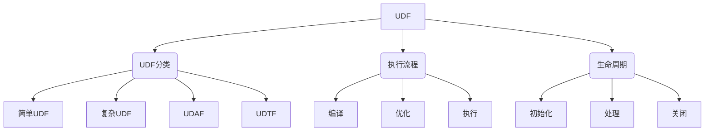
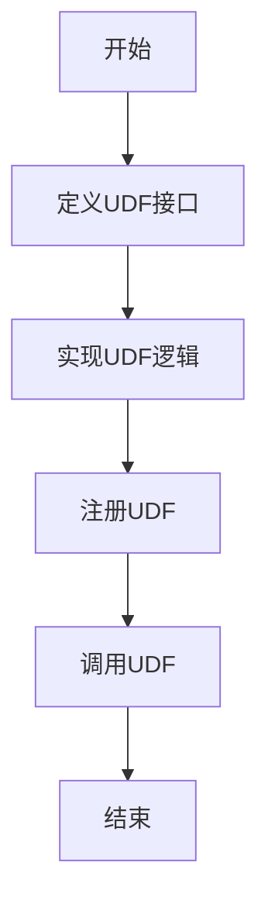

# Hive UDF自定义函数原理与代码实例讲解

## 1. 背景介绍

### 1.1 问题的由来

在大数据时代,海量数据的存储和处理成为了一个巨大的挑战。Apache Hive作为一种建立在Hadoop之上的数据仓库工具,为结构化数据的存储和查询提供了强大的支持。然而,Hive内置的函数库虽然功能丰富,但仍难以满足所有的业务需求。因此,能够根据实际需求自定义函数(User-Defined Function, UDF)就显得尤为重要。

### 1.2 研究现状

目前,Hive UDF的应用已经非常广泛,涉及多个领域,如数据清洗、数据转换、字符串处理、日期处理等。越来越多的开发者开始关注如何高效地编写UDF,以提高数据处理的灵活性和效率。不过,由于缺乏系统的指导,开发人员在实现UDF时仍然面临诸多挑战,如性能优化、异常处理等。

### 1.3 研究意义

本文将深入探讨Hive UDF的原理和实现方法,旨在为读者提供一个全面的指南,帮助他们掌握自定义函数的开发技巧。通过理解UDF的内部机制,读者将能够编写出高效、健壮的函数,从而更好地满足特定的业务需求。此外,本文还将介绍一些优化技巧和最佳实践,为提高UDF的性能和可维护性提供参考。

### 1.4 本文结构

本文将从以下几个方面全面介绍Hive UDF:

1. 核心概念与联系
2. 核心算法原理与具体操作步骤
3. 数学模型和公式详细讲解与案例分析
4. 项目实践:代码实例和详细解释说明
5. 实际应用场景
6. 工具和资源推荐
7. 总结:未来发展趋势与挑战
8. 附录:常见问题与解答

## 2. 核心概念与联系

在深入探讨Hive UDF之前,我们需要先了解一些核心概念,如UDF的分类、执行流程等,以及它们之间的关系。



### 2.1 UDF分类

根据功能和用途的不同,Hive UDF可以分为以下四种类型:

1. **简单UDF(User-Defined Scalar Function)**: 接受一个或多个输入参数,并返回单个标量值。常用于字符串处理、数学计算等场景。

2. **复杂UDF(User-Defined Complex Function)**: 可以处理复杂的数据结构,如Map、Array等。通常用于数据转换和清洗。

3. **UDAF(User-Defined Aggregate Function)**: 用于聚合操作,如求和、计数等。与SQL中的聚合函数类似。

4. **UDTF(User-Defined Table-Valued Function)**: 将一行输入数据转换为多行输出,常用于数据扩展和规范化。

### 2.2 执行流程

Hive在执行查询时,会经历以下几个主要阶段:

1. **编译**: 将HiveQL语句转换为查询计划。
2. **优化**: 对查询计划进行优化,以提高执行效率。
3. **执行**: 根据优化后的查询计划,在Hadoop集群上执行MapReduce作业。

在执行阶段,Hive会根据需要动态加载和调用相应的UDF。

### 2.3 生命周期

每个UDF实例都会经历以下三个生命周期阶段:

1. **初始化(Initialize)**: 在第一次使用UDF时调用,用于完成初始化工作。
2. **处理(Evaluate)**: 对每条输入记录调用,执行具体的函数逻辑。
3. **关闭(Close)**: 在UDF不再使用时调用,用于释放资源。

理解UDF的生命周期有助于编写出健壮、高效的函数代码。

## 3. 核心算法原理与具体操作步骤

### 3.1 算法原理概述

Hive UDF的核心算法原理可以概括为以下几个方面:

1. **解析和编译**: Hive会将HiveQL语句解析为抽象语法树(AST),然后通过编译器将AST转换为查询计划。在这个过程中,Hive会识别出UDF的调用,并根据UDF的类型和签名动态加载相应的类。

2. **执行流水线**: 查询计划由一系列的操作符(Operator)组成,形成一个执行流水线。当数据流经某个操作符时,如果该操作符涉及UDF的调用,则会执行相应的UDF代码。

3. **数据流转换**: UDF的主要作用是对输入数据进行转换或计算,生成新的输出数据。根据UDF的类型不同,输入输出数据的结构也有所不同。

4. **并行计算**: Hive利用了Hadoop的分布式计算能力,可以在多个节点上并行执行UDF,从而提高数据处理的效率。

5. **优化策略**: Hive提供了多种优化策略,如谓词下推、分区裁剪等,以减少UDF的计算量,提升查询性能。

### 3.2 算法步骤详解

实现一个Hive UDF通常需要以下几个步骤:



1. **定义UDF接口**: 根据UDF的类型,选择合适的接口进行实现,如`UDF`、`GenericUDF`、`GenericUDTF`等。这些接口定义了UDF需要实现的方法,如`initialize`、`evaluate`等。

2. **实现UDF逻辑**: 在接口方法中编写具体的函数逻辑,完成数据的转换或计算。需要注意的是,UDF的实现必须是无状态的,不能依赖外部数据或状态。

3. **注册UDF**: 在Hive中注册自定义函数,使其可以在HiveQL语句中被调用。可以通过`CREATE FUNCTION`语句永久注册,或者使用`TEMPORARY FUNCTION`临时注册。

4. **调用UDF**: 在HiveQL语句中像调用内置函数一样使用自定义函数,Hive会自动加载并执行相应的UDF代码。

5. **优化和测试**: 编写单元测试用例,测试UDF的正确性和性能。根据需要,可以对UDF进行优化,如使用缓存、预计算等策略,以提高执行效率。

### 3.3 算法优缺点

实现Hive UDF的优点包括:

- **灵活性强**: 可以根据具体需求定制功能,不受内置函数的限制。
- **可扩展性好**: 通过编写UDF,可以方便地扩展Hive的功能。
- **性能可控**: 自定义函数的性能可以通过优化代码来提升。

不过,Hive UDF也存在一些缺点和限制:

- **开发成本高**: 编写UDF需要一定的编程能力,并且需要了解Hive的内部机制。
- **可移植性差**: UDF的代码通常是特定于Hive的,难以在其他系统中复用。
- **性能瓶颈**: 虽然可以通过优化提升性能,但仍然可能受到Hive本身架构的限制。

### 3.4 算法应用领域

Hive UDF可以应用于多个领域,包括但不限于:

- **数据清洗**: 使用UDF对原始数据进行格式化、去重、填充缺失值等处理。
- **数据转换**: 将数据从一种格式转换为另一种格式,如JSON到表格、表格到Parquet等。
- **字符串处理**: 实现自定义的字符串操作,如提取、替换、格式化等。
- **数学计算**: 执行复杂的数学或统计计算,如机器学习算法等。
- **日期时间处理**: 对日期和时间值进行解析、格式化、计算等操作。
- **自定义聚合**: 实现特殊的聚合函数,如计算中位数、众数等。

## 4. 数学模型和公式详细讲解与举例说明

在实现某些复杂的Hive UDF时,我们可能需要借助数学模型和公式来描述和求解问题。本节将介绍一些常见的数学模型,并详细讲解相关公式的推导过程和应用案例。

### 4.1 数学模型构建

构建数学模型的一般步骤如下:

1. **确定问题**: 明确需要解决的问题,了解问题的背景和约束条件。
2. **识别变量**: 找出影响问题的主要变量,并确定它们之间的关系。
3. **建立假设**: 根据问题的特点和已知条件,提出合理的假设和简化。
4. **构建模型**: 使用数学符号和公式描述问题,建立数学模型。
5. **求解和分析**: 使用适当的数学方法求解模型,并分析结果的合理性。
6. **验证和优化**: 通过实际数据或案例验证模型的有效性,并根据需要进行优化和调整。

### 4.2 公式推导过程

以计算字符串相似度的Levenshtein距离为例,我们将详细推导相关公式。

Levenshtein距离是一种用于衡量两个字符串之间差异的度量,它表示将一个字符串转换为另一个字符串所需的最小编辑操作次数(插入、删除或替换一个字符)。

设两个字符串分别为$s_1$和$s_2$,长度分别为$m$和$n$,则Levenshtein距离$d(s_1, s_2)$可以通过以下递归公式计算:

$$
d(s_1, s_2) = \begin{cases}
    m & \text{if } n = 0 \
    n & \text{if } m = 0 \
    d(s_1[0..m-2], s_2[0..n-1]) + 1 & \text{if } s_1[m-1] \neq s_2[n-1] \
    d(s_1[0..m-2], s_2[0..n-2]) + \min\begin{cases}
        1 & \text{(插入)} \
        1 & \text{(删除)} \
        \text{sub}(s_1[m-1], s_2[n-1]) & \text{(替换)}
    \end{cases} & \text{if } s_1[m-1] = s_2[n-1]
\end{cases}
$$

其中, $\text{sub}(x, y)$ 表示替换字符 $x$ 为字符 $y$ 的代价,通常取值为 0 或 1。

该公式的推导过程如下:

1. 如果其中一个字符串为空,则距离就是另一个字符串的长度。
2. 如果两个字符串的最后一个字符不相同,则距离等于去掉最后一个字符后两个字符串的距离加 1。
3. 如果两个字符串的最后一个字符相同,则距离等于去掉最后一个字符后两个字符串的距离,加上最小的编辑代价(插入、删除或替换)。

通过这个递归公式,我们可以计算出任意两个字符串之间的Levenshtein距离。

### 4.3 案例分析与讲解

现在,我们来看一个具体的案例,计算"kitten"和"sitting"两个单词之间的Levenshtein距离。

根据上述公式,我们可以构建一个二维数组来存储中间结果:

```
    k i t t e n
  0 1 2 3 4 5 6
s 1 1 2 3 4 5 6
i 2 2 1 2 3 4 5
t 3 3 2 1 2 3 4
t 4 4 3 2 1 2 3
i 5 5 4 3 2 1 2
n 6 6 5 4 3 2 1
g 7 7 6 5 4 3 2
```

可以看到,最终的Levenshtein距离为 3,即需要 3 次编辑操作(替换 k 为 s、插入 g、插入 g)才能将"kitten"转换为"sitting"。

该算法的时间复杂度为 $O(mn)$,