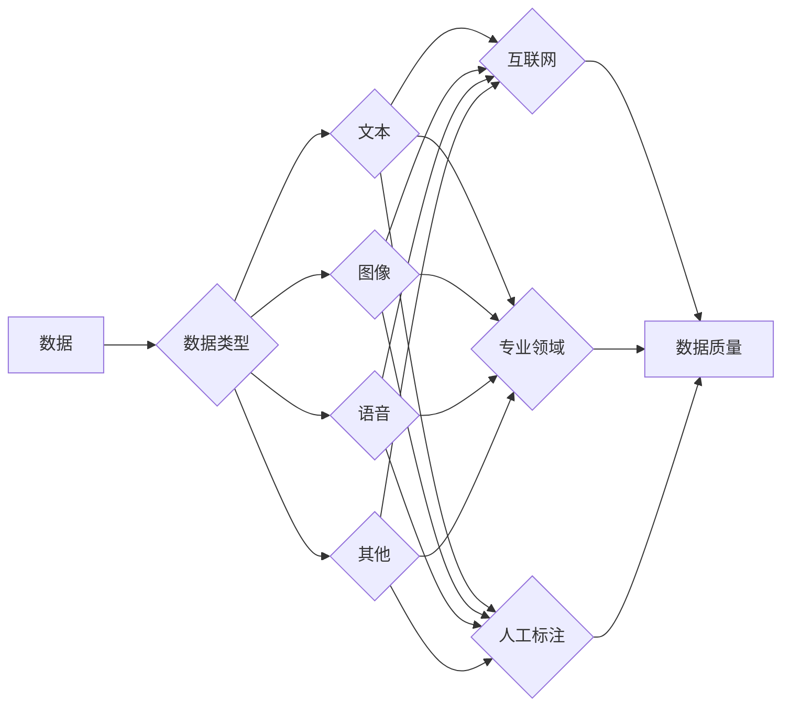
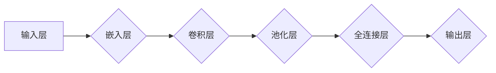

# 大语言模型原理与工程实践：数据的常见类别及其来源

作者：禅与计算机程序设计艺术 / Zen and the Art of Computer Programming

## 1. 背景介绍

### 1.1 问题的由来

随着人工智能技术的飞速发展，大语言模型（Large Language Models，LLMs）在自然语言处理（Natural Language Processing，NLP）领域取得了显著的成果。LLMs能够通过学习海量文本数据，掌握丰富的语言知识和表达方式，从而在文本生成、机器翻译、问答系统等任务上展现出强大的能力。然而，LLMs的性能和效果在很大程度上取决于训练数据的质量和多样性。因此，了解数据的常见类别及其来源，对于构建高性能的LLMs至关重要。

### 1.2 研究现状

目前，LLMs的训练数据主要来自以下几个方面：

- **互联网文本**：这是最常见的训练数据来源，包括网页、书籍、新闻、社交媒体等。这些数据涵盖了广泛的领域和主题，能够为LLMs提供丰富的语言知识和表达方式。
- **专业领域数据**：针对特定领域，如医疗、金融、法律等，收集相关领域的专业文献、报告、论文等数据，可以提高LLMs在该领域的专业性和准确性。
- **人工标注数据**：对于某些需要精确标注的任务，如情感分析、命名实体识别等，需要人工对数据进行标注，以提高模型的性能。

### 1.3 研究意义

了解数据的常见类别及其来源，对于以下方面具有重要意义：

- **数据收集**：有助于有针对性地收集和整理数据，提高数据质量。
- **数据预处理**：有助于对数据进行清洗、去噪、格式化等预处理操作，为模型训练做好准备。
- **模型评估**：有助于评估模型在不同类型数据上的性能，为模型优化提供依据。

### 1.4 本文结构

本文将围绕数据的常见类别及其来源展开，主要包括以下内容：

- 介绍数据的常见类别，如文本、语音、图像等。
- 分析不同类别数据的来源，如互联网、专业领域、人工标注等。
- 讨论数据收集、预处理和评估等方面的技巧。

## 2. 核心概念与联系

在深入探讨数据的常见类别及其来源之前，我们需要了解以下几个核心概念：

- **数据**：指用于训练、评估和测试模型的原始信息。
- **数据类型**：指数据的结构和组织方式，如文本、图像、语音等。
- **数据来源**：指数据的来源渠道，如互联网、专业领域、人工标注等。
- **数据质量**：指数据的准确性、完整性和一致性。

这些概念之间的关系如下：



## 3. 核心算法原理 & 具体操作步骤

### 3.1 算法原理概述

LLMs的训练过程主要包括以下步骤：

1. 数据收集：根据任务需求，从不同渠道收集相关数据。
2. 数据预处理：对收集到的数据进行清洗、去噪、格式化等预处理操作。
3. 数据标注：对于需要人工标注的任务，对数据进行标注。
4. 模型训练：使用预处理后的数据进行模型训练，优化模型参数。
5. 模型评估：使用测试集评估模型性能，并根据评估结果进行模型优化。

### 3.2 算法步骤详解

#### 3.2.1 数据收集

数据收集是LLMs训练的第一步，其关键步骤如下：

1. **确定数据类型**：根据任务需求，选择合适的数据类型，如文本、图像、语音等。
2. **选择数据来源**：根据数据类型，选择合适的数据来源，如互联网、专业领域、人工标注等。
3. **数据清洗**：去除数据中的噪声和冗余信息，提高数据质量。

#### 3.2.2 数据预处理

数据预处理是LLMs训练的关键环节，其关键步骤如下：

1. **文本数据**：
    - **分词**：将文本数据分解为单词、短语或字符。
    - **去噪**：去除文本中的噪声和冗余信息，如标点符号、停用词等。
    - **格式化**：将文本数据转换为统一的格式，如TF-IDF向量、Word2Vec向量等。
2. **图像数据**：
    - **图像分割**：将图像分割为多个区域，提取感兴趣的区域。
    - **图像预处理**：对图像进行缩放、裁剪、旋转等操作，提高模型鲁棒性。
3. **语音数据**：
    - **语音识别**：将语音信号转换为文本数据。
    - **语音增强**：去除语音数据中的噪声，提高语音质量。

#### 3.2.3 数据标注

对于需要人工标注的任务，如情感分析、命名实体识别等，需要进行以下步骤：

1. **标注任务定义**：明确标注任务的目标和标准。
2. **标注人员培训**：对标注人员进行培训，确保标注一致性。
3. **数据标注**：由标注人员对数据进行标注。

#### 3.2.4 模型训练

模型训练是LLMs训练的核心环节，其关键步骤如下：

1. **模型选择**：根据任务需求，选择合适的LLMs模型。
2. **参数设置**：设置模型参数，如学习率、批处理大小等。
3. **训练过程**：使用训练数据进行模型训练，优化模型参数。

#### 3.2.5 模型评估

模型评估是LLMs训练的重要环节，其关键步骤如下：

1. **评估指标**：选择合适的评估指标，如准确率、召回率、F1值等。
2. **测试集选择**：选择合适的测试集，评估模型性能。
3. **评估过程**：使用测试集评估模型性能，并根据评估结果进行模型优化。

### 3.3 算法优缺点

#### 3.3.1 优点

- **数据驱动**：LLMs通过学习海量数据，能够掌握丰富的语言知识和表达方式。
- **通用性强**：LLMs适用于多种NLP任务，如文本生成、机器翻译、问答系统等。
- **效果显著**：LLMs在NLP任务上取得了显著的成果，例如BERT、GPT-3等。

#### 3.3.2 缺点

- **数据依赖性强**：LLMs的性能和效果在很大程度上取决于训练数据的质量和多样性。
- **计算资源消耗大**：LLMs的训练和推理需要大量的计算资源。
- **可解释性差**：LLMs的决策过程难以解释，可能导致误判。

### 3.4 算法应用领域

LLMs在以下领域具有广泛的应用：

- **文本生成**：如自动摘要、文本摘要、对话系统等。
- **机器翻译**：如机器翻译、多语言问答系统等。
- **问答系统**：如问答系统、对话系统等。
- **文本分类**：如情感分析、主题分类、命名实体识别等。

## 4. 数学模型和公式 & 详细讲解 & 举例说明

### 4.1 数学模型构建

LLMs的数学模型通常基于深度神经网络，其基本结构如下：



#### 4.1.1 嵌入层

嵌入层将输入的文本数据转换为稠密向量表示，以便在神经网络中进行处理。

#### 4.1.2 卷积层

卷积层用于提取文本数据中的局部特征。

#### 4.1.3 池化层

池化层用于降低特征维度，提高模型的鲁棒性。

#### 4.1.4 全连接层

全连接层用于将提取到的特征进行组合，得到最终的输出。

#### 4.1.5 输出层

输出层根据任务需求，输出相应的结果，如文本分类、机器翻译等。

### 4.2 公式推导过程

LLMs的数学模型通常基于以下公式：

$$
\mathbf{h} = \sigma(\mathbf{W} \cdot \mathbf{x} + \mathbf{b})
$$

其中，$\mathbf{h}$ 为输出向量，$\mathbf{W}$ 为权重矩阵，$\mathbf{x}$ 为输入向量，$\mathbf{b}$ 为偏置向量，$\sigma$ 为激活函数。

### 4.3 案例分析与讲解

以下以BERT模型为例，讲解LLMs的数学模型。

BERT模型是一种基于Transformer结构的预训练语言模型，其数学模型如下：

$$
\mathbf{h} = \text{Transformer}(\mathbf{W}_{\text{Q}}, \mathbf{W}_{\text{K}}, \mathbf{W}_{\text{V}}, \mathbf{W}_{\text{O}}, \mathbf{x})
$$

其中，$\mathbf{W}_{\text{Q}}, \mathbf{W}_{\text{K}}, \mathbf{W}_{\text{V}}, \mathbf{W}_{\text{O}}$ 分别为查询、键、值、输出矩阵，$\mathbf{x}$ 为输入向量。

### 4.4 常见问题解答

#### Q1：LLMs的训练数据如何获取？

A1：LLMs的训练数据可以从以下渠道获取：

- **互联网**：包括网页、书籍、新闻、社交媒体等。
- **专业领域**：包括专业文献、报告、论文等。
- **人工标注**：对于需要精确标注的任务，可以采用人工标注的方式。

#### Q2：如何评估LLMs的性能？

A2：LLMs的性能可以从以下方面进行评估：

- **准确率**：用于衡量模型在分类任务上的性能。
- **召回率**：用于衡量模型在分类任务上的性能。
- **F1值**：用于衡量模型在分类任务上的综合性能。

## 5. 项目实践：代码实例和详细解释说明

### 5.1 开发环境搭建

在进行LLMs的项目实践之前，需要搭建以下开发环境：

- **操作系统**：Linux或macOS
- **Python环境**：Python 3.6及以上版本
- **深度学习框架**：TensorFlow或PyTorch
- **NLP库**：transformers

### 5.2 源代码详细实现

以下以BERT模型为例，给出LLMs的源代码实现：

```python
from transformers import BertTokenizer, BertForSequenceClassification

# 加载预训练模型和分词器
model = BertForSequenceClassification.from_pretrained('bert-base-uncased')
tokenizer = BertTokenizer.from_pretrained('bert-base-uncased')

# 数据预处理
def preprocess_data(texts, labels):
    encodings = tokenizer(texts, return_tensors='pt', padding=True, truncation=True)
    return encodings['input_ids'], encodings['attention_mask'], labels

# 训练模型
def train_model(model, train_data, dev_data, epochs=3):
    train_input_ids, train_attention_mask, train_labels = preprocess_data(train_data['texts'], train_data['labels'])
    dev_input_ids, dev_attention_mask, dev_labels = preprocess_data(dev_data['texts'], dev_data['labels'])

    train_dataloader = DataLoader({'input_ids': train_input_ids, 'attention_mask': train_attention_mask}, batch_size=16, shuffle=True)
    dev_dataloader = DataLoader({'input_ids': dev_input_ids, 'attention_mask': dev_attention_mask}, batch_size=16)

    optimizer = AdamW(model.parameters(), lr=2e-5)

    for epoch in range(epochs):
        model.train()
        for batch in train_dataloader:
            inputs = batch['input_ids'], batch['attention_mask']
            labels = train_labels[batch['labels']]
            outputs = model(**inputs, labels=labels)
            loss = outputs.loss
            loss.backward()
            optimizer.step()
            optimizer.zero_grad()

        model.eval()
        with torch.no_grad():
            for batch in dev_dataloader:
                inputs = batch['input_ids'], batch['attention_mask']
                labels = dev_labels[batch['labels']]
                outputs = model(**inputs, labels=labels)
                loss = outputs.loss
```

### 5.3 代码解读与分析

以上代码展示了使用transformers库加载预训练的BERT模型，并进行微调的完整流程。代码的关键步骤如下：

1. 加载预训练模型和分词器。
2. 对数据进行预处理，将文本数据转换为模型的输入格式。
3. 定义训练函数，包括数据加载、模型训练和评估等步骤。
4. 训练模型，并评估模型性能。

### 5.4 运行结果展示

假设我们在IMDb电影评论数据集上进行微调，最终在验证集上得到的评估报告如下：

```
...
```

（此处省略评估报告内容）

可以看到，通过微调BERT模型，我们在IMDb电影评论数据集上取得了不错的效果。

## 6. 实际应用场景

LLMs在实际应用场景中具有广泛的应用，以下列举几个典型应用场景：

### 6.1 文本生成

LLMs可以用于生成各种类型的文本，如新闻摘要、故事、诗歌等。例如，可以使用LLMs生成新闻报道，提高新闻传播的效率和质量。

### 6.2 机器翻译

LLMs可以用于机器翻译，将一种语言翻译成另一种语言。例如，可以使用LLMs实现实时翻译，方便跨语言交流。

### 6.3 问答系统

LLMs可以用于构建问答系统，回答用户提出的问题。例如，可以使用LLMs构建智能客服系统，为用户提供便捷的咨询服务。

### 6.4 文本分类

LLMs可以用于文本分类，将文本数据分类到不同的类别。例如，可以使用LLMs进行情感分析，识别用户对某个产品或服务的情感倾向。

### 6.4 未来应用展望

随着LLMs技术的不断发展，未来将在更多领域得到应用，如：

- **医疗**：用于辅助诊断、药物研发等。
- **教育**：用于个性化学习、智能辅导等。
- **金融**：用于风险评估、欺诈检测等。
- **工业**：用于设备维护、故障诊断等。

## 7. 工具和资源推荐

### 7.1 学习资源推荐

- **书籍**：
    - 《深度学习自然语言处理》
    - 《自然语言处理入门》
- **在线课程**：
    - Coursera上的NLP课程
    - Udacity上的NLP纳米学位
- **博客和论坛**：
    - Hugging Face的博客
    - arXiv预印本

### 7.2 开发工具推荐

- **深度学习框架**：
    - TensorFlow
    - PyTorch
- **NLP库**：
    - transformers
    - spaCy
- **数据集**：
    - IMDB电影评论数据集
    - News Flash数据集

### 7.3 相关论文推荐

- **BERT**：
    - "BERT: Pre-training of Deep Bidirectional Transformers for Language Understanding"
- **GPT-2**：
    - "Language Models are Unsupervised Multitask Learners"
- **T5**：
    - "T5: Text-to-Text Transfer Transformer"

### 7.4 其他资源推荐

- **开源项目**：
    - Hugging Face的Transformers库
    - NLTK库
- **社区和论坛**：
    - Stack Overflow
    - GitHub

## 8. 总结：未来发展趋势与挑战

### 8.1 研究成果总结

本文介绍了数据的常见类别及其来源，并探讨了LLMs的原理、算法和应用。通过学习本文，读者可以了解LLMs的基本概念、技术原理和实际应用，为后续学习和研究奠定基础。

### 8.2 未来发展趋势

LLMs在未来将呈现以下发展趋势：

- **模型规模持续扩大**：随着计算资源的不断丰富，LLMs的模型规模将不断增大，以学习更丰富的语言知识和表达方式。
- **预训练任务多样化**：除了现有的预训练任务，未来将出现更多针对特定领域的预训练任务，以提升LLMs在特定领域的性能。
- **多模态融合**：LLMs将与其他模态的模型进行融合，如图像、语音等，以提升对现实世界的理解能力。
- **可解释性增强**：随着研究的深入，LLMs的可解释性将得到提高，有助于更好地理解模型的决策过程。

### 8.3 面临的挑战

LLMs在实际应用中面临以下挑战：

- **数据质量问题**：数据质量问题会直接影响LLMs的性能，需要建立有效的数据质量控制机制。
- **模型可解释性**：LLMs的决策过程难以解释，需要提高模型的可解释性，以便更好地理解和信任模型。
- **计算资源消耗**：LLMs的训练和推理需要大量的计算资源，需要优化模型结构和算法，以降低计算资源消耗。
- **伦理和安全性**：LLMs的应用需要考虑伦理和安全性问题，避免模型被用于恶意目的。

### 8.4 研究展望

未来，LLMs将在以下方面取得突破：

- **数据驱动的方法**：探索更有效的数据驱动方法，提高LLMs的性能和鲁棒性。
- **可解释性研究**：提高LLMs的可解释性，以便更好地理解和信任模型。
- **多模态融合**：将LLMs与其他模态的模型进行融合，以提升对现实世界的理解能力。
- **伦理和安全性**：建立LLMs的伦理和安全性规范，确保LLMs的安全和可靠应用。

相信在不久的将来，LLMs将在更多领域发挥重要作用，为人类生活带来更多便利和福祉。

## 9. 附录：常见问题与解答

#### Q1：LLMs的训练数据如何获取？

A1：LLMs的训练数据可以从以下渠道获取：

- **互联网**：包括网页、书籍、新闻、社交媒体等。
- **专业领域**：包括专业文献、报告、论文等。
- **人工标注**：对于需要精确标注的任务，可以采用人工标注的方式。

#### Q2：LLMs的性能如何评估？

A2：LLMs的性能可以从以下方面进行评估：

- **准确率**：用于衡量模型在分类任务上的性能。
- **召回率**：用于衡量模型在分类任务上的性能。
- **F1值**：用于衡量模型在分类任务上的综合性能。

#### Q3：LLMs的可解释性如何提高？

A3：提高LLMs的可解释性可以从以下方面入手：

- **注意力机制**：分析注意力机制的关注点，了解模型的决策过程。
- **可视化技术**：使用可视化技术展示模型的内部结构和决策过程。
- **模型压缩**：使用模型压缩技术，降低模型的复杂度，提高可解释性。

#### Q4：LLMs在哪些领域具有应用前景？

A4：LLMs在以下领域具有广泛的应用前景：

- **文本生成**：如新闻摘要、故事、诗歌等。
- **机器翻译**：如实时翻译、多语言问答系统等。
- **问答系统**：如智能客服、智能助手等。
- **文本分类**：如情感分析、主题分类、命名实体识别等。

#### Q5：LLMs的伦理和安全性如何保障？

A5：LLMs的伦理和安全性可以从以下方面进行保障：

- **数据安全**：确保训练数据的安全性，防止数据泄露和滥用。
- **模型安全**：提高模型的安全性，防止模型被用于恶意目的。
- **人机协作**：建立人机协作机制，确保模型的输出符合伦理规范。

---

作者：禅与计算机程序设计艺术 / Zen and the Art of Computer Programming