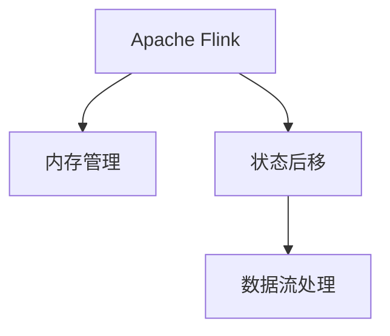
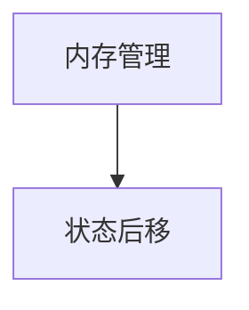

                 

# Flink Evictor原理与代码实例讲解

> 关键词：Flink, Evictor, 数据流处理, 内存优化, 状态后移

## 1. 背景介绍

### 1.1 问题由来
Apache Flink 是一个高性能、分布式流处理引擎，广泛用于数据实时处理、事件驱动系统等领域。它支持低延迟、高吞吐量的数据流处理，能够在毫秒级别完成数据计算和处理。然而，在处理大规模数据流时，内存消耗是一个重要的瓶颈问题。若内存使用超过阈值，可能导致数据丢失或计算失败。Flink Evictor 是一种内存管理机制，可以确保数据流处理系统的稳定性和可靠性，避免内存溢出或计算失败。

### 1.2 问题核心关键点
Flink Evictor 的核心思想是通过不断监测内存使用情况，触发内存数据清理，确保内存使用不超过系统设定的最大阈值。通过 Evictor 机制，可以将数据流处理系统的内存使用维持在合理范围内，防止因内存不足导致的系统故障。

Flink Evictor 主要关注两个关键问题：
1. **内存占用监控**：实时监测内存使用情况，确保系统不超负荷运行。
2. **内存数据清理**：当内存使用超过阈值时，及时清理内存中的数据，避免内存溢出。

## 2. 核心概念与联系

### 2.1 核心概念概述

为了更好地理解 Flink Evictor 机制，本节将介绍几个密切相关的核心概念：

- **Apache Flink**：高性能、分布式流处理引擎，支持低延迟、高吞吐量的数据流处理。
- **内存管理**：通过分配和释放内存，管理数据流处理的资源使用。
- **状态后移**：当内存使用超过阈值时，将部分状态转移到磁盘或其他存储介质，以释放内存空间。
- **数据流处理**：数据实时处理、事件驱动系统等领域的应用，涉及数据源、数据流、数据处理等概念。

这些核心概念之间的逻辑关系可以通过以下 Mermaid 流程图来展示：



这个流程图展示了大语言模型的核心概念及其之间的关系：

1. Flink 框架支持的数据流处理功能通过内存管理机制进行资源分配，确保计算的高效和稳定。
2. 内存管理机制通过状态后移策略，保证数据流处理系统的内存使用不超过系统设定的最大阈值。
3. 数据流处理功能通过 Flink Evictor 机制，实现内存清理和状态后移，维持系统稳定。

### 2.2 概念间的关系

这些核心概念之间存在着紧密的联系，形成了 Flink Evictor 机制的完整生态系统。下面我们通过几个 Mermaid 流程图来展示这些概念之间的关系。

#### 2.2.1 Flink Evictor 机制的基本架构


这个流程图展示了 Flink Evictor 机制的基本架构，以及其与内存管理和数据流处理之间的关联。

#### 2.2.2 内存管理与状态后移



这个流程图展示了内存管理和状态后移之间的关系。内存管理机制通过状态后移策略，确保数据流处理系统的内存使用不超过系统设定的最大阈值。

#### 2.2.3 内存使用监控与 Evictor 机制


这个流程图展示了内存使用监控与 Flink Evictor 机制之间的关系。内存使用监控负责实时监测内存使用情况，Flink Evictor 机制根据监测结果触发内存清理和状态后移操作。

## 3. 核心算法原理 & 具体操作步骤
### 3.1 算法原理概述

Flink Evictor 是一种基于内存管理的优化策略，其核心算法原理可以概括为：

1. **内存使用监控**：实时监测 Flink 数据流处理系统的内存使用情况。
2. **内存清理**：当内存使用超过阈值时，触发内存清理操作。
3. **状态后移**：将部分状态转移到磁盘或其他存储介质，以释放内存空间。

通过上述三个步骤，Flink Evictor 机制可以确保数据流处理系统的内存使用不超过系统设定的最大阈值，从而提高系统的稳定性和可靠性。

### 3.2 算法步骤详解

Flink Evictor 的算法步骤如下：

1. **内存使用监控**：Flink 框架通过内存监控机制实时监测内存使用情况。当内存使用达到设定的最大阈值时，触发内存清理操作。

2. **内存清理**：Flink Evictor 机制根据内存使用情况，决定需要清理的内存数据。清理操作通常包括以下步骤：
   - 计算清理内存占用的比例。
   - 选择需要清理的内存数据。
   - 触发内存清理操作，将部分数据从内存中移除。

3. **状态后移**：当内存使用超过阈值时，Flink Evictor 机制将部分状态转移到磁盘或其他存储介质。状态后移通常包括以下步骤：
   - 选择需要后移的状态。
   - 将状态从内存中移除，并将状态数据保存在磁盘或其他存储介质中。
   - 更新状态后移状态，以便下次使用。

### 3.3 算法优缺点

Flink Evictor 机制的主要优点包括：

- **内存优化**：通过内存清理和状态后移，确保 Flink 数据流处理系统的内存使用不超过系统设定的最大阈值。
- **系统稳定性**：通过内存清理和状态后移，避免了因内存不足导致的系统故障。
- **实时监控**：实时监测内存使用情况，及时响应内存使用变化。

Flink Evictor 机制的主要缺点包括：

- **状态后移开销**：状态后移操作需要消耗一定的时间和资源，可能会影响数据流处理的性能。
- **复杂度较高**：Flink Evictor 机制的设计和实现较为复杂，需要仔细设计和调试。
- **硬件要求高**：Flink Evictor 机制依赖于硬件的支持，需要高性能的内存和存储设备。

### 3.4 算法应用领域

Flink Evictor 机制在数据流处理、事件驱动系统、实时计算等领域得到了广泛应用，具体包括：

- **实时数据处理**：处理大规模的实时数据流，确保数据处理的低延迟和高吞吐量。
- **事件驱动系统**：处理高并发、高并行的事务，确保系统的稳定性和可靠性。
- **实时计算**：处理高频率、高精度的事务，确保计算结果的准确性和一致性。

Flink Evictor 机制的优点使其成为大数据处理和实时计算中的重要工具，能够显著提高系统的稳定性和可靠性，降低因内存不足导致的系统故障。

## 4. 数学模型和公式 & 详细讲解 & 举例说明

### 4.1 数学模型构建

Flink Evictor 机制的数学模型可以概括为：

1. **内存使用监控**：
   - 内存使用率：$\frac{\text{已用内存}}{\text{总内存}}$
   - 内存清理比例：$\frac{\text{清理内存数据量}}{\text{总内存数据量}}$
2. **内存清理**：
   - 内存清理比例：$\text{清理内存数据量} / \text{总内存数据量}$
   - 内存清理比例计算公式：$\text{清理比例} = \max(0, \text{内存使用率} - \text{最大内存使用率})$
3. **状态后移**：
   - 状态后移比例：$\text{后移状态数据量} / \text{总状态数据量}$
   - 状态后移比例计算公式：$\text{后移比例} = \max(0, \text{内存使用率} - \text{最大内存使用率})$

### 4.2 公式推导过程

以下我们将推导 Flink Evictor 机制的数学公式。

假设 Flink 数据流处理系统已用内存为 $M_u$，总内存为 $M_t$，最大内存使用率为 $M_{\text{max}}$，清理内存比例为 $\text{clean\_ratio}$，状态后移比例为 $\text{move\_ratio}$。

**内存使用监控**：

$$
\text{内存使用率} = \frac{M_u}{M_t}
$$

**内存清理**：

$$
\text{清理内存比例} = \text{clean\_ratio} = \max(0, \frac{M_u}{M_t} - M_{\text{max}})
$$

**状态后移**：

$$
\text{状态后移比例} = \text{move\_ratio} = \max(0, \frac{M_u}{M_t} - M_{\text{max}})
$$

其中，$\max(0, \cdot)$ 表示取最大值，避免出现负数。

### 4.3 案例分析与讲解

假设 Flink 数据流处理系统已用内存为 5GB，总内存为 10GB，最大内存使用率为 8GB，清理内存比例为 50%。

根据上述公式，可以得到：

$$
\text{内存使用率} = \frac{5}{10} = 0.5
$$

$$
\text{清理内存比例} = \text{clean\_ratio} = \max(0, 0.5 - 0.8) = 0
$$

这意味着当前内存使用率没有超过最大内存使用率，因此不需要触发内存清理操作。

假设 Flink 数据流处理系统已用内存为 8GB，总内存为 10GB，最大内存使用率为 8GB，清理内存比例为 50%。

根据上述公式，可以得到：

$$
\text{内存使用率} = \frac{8}{10} = 0.8
$$

$$
\text{清理内存比例} = \text{clean\_ratio} = \max(0, 0.8 - 0.8) = 0
$$

这意味着当前内存使用率超过最大内存使用率，因此需要触发内存清理操作。

假设 Flink 数据流处理系统已用内存为 8GB，总内存为 10GB，最大内存使用率为 8GB，状态后移比例为 50%。

根据上述公式，可以得到：

$$
\text{内存使用率} = \frac{8}{10} = 0.8
$$

$$
\text{状态后移比例} = \text{move\_ratio} = \max(0, 0.8 - 0.8) = 0
$$

这意味着当前内存使用率超过最大内存使用率，因此需要触发状态后移操作。

通过上述推导，我们可以看到 Flink Evictor 机制的数学模型和计算过程。实时监控内存使用情况，根据内存使用率和最大内存使用率计算清理和后移比例，确保 Flink 数据流处理系统的稳定性和可靠性。

## 5. 项目实践：代码实例和详细解释说明
### 5.1 开发环境搭建

在进行 Flink Evictor 实践前，我们需要准备好开发环境。以下是使用 Python 进行 Flink 开发的流程：

1. 安装 Apache Flink：从官网下载并安装 Apache Flink，创建新的 Flink 环境。

2. 安装 Flink API：安装 Python API，可以通过以下命令安装：

   ```bash
   pip install apache-flink
   ```

3. 准备数据集：准备需要处理的数据集，可以是 CSV 文件、文本文件等。

4. 编写 Flink 代码：使用 Flink Python API 编写数据处理代码。

5. 运行 Flink 作业：通过命令行或远程服务启动 Flink 作业。

### 5.2 源代码详细实现

下面我们以处理实时数据流为例，给出使用 Python API 对 Flink 进行 Evictor 实践的代码实现。

首先，我们需要导入必要的 Flink API 模块：

```python
from apache_flink.datastream import StreamExecutionEnvironment
from apache_flink.streaming import StreamExecutionParameters
from apache_flink.streaming.api.operators import SourceFunction
from apache_flink.streaming.api.windowing import time
from apache_flink.streaming.api.windowing.time import SlidingEventTimeWindows
from apache_flink.streaming.api.environment import StreamEnvironment
```

然后，定义数据源函数：

```python
class MySource(SourceFunction):
    def __init__(self, batch_size):
        self.batch_size = batch_size
        self.element_count = 0

    def run(self, collector):
        while True:
            for i in range(self.batch_size):
                collector.collect(i)

    def cancel(self):
        pass

    def getproducedrecords(self):
        return self.element_count
```

接着，定义数据流处理函数：

```python
def process_function(input_data):
    data = input_data.map(lambda x: x)
    data_window = data.keyby(lambda x: x) \
        .time_window(1, SlidingEventTimeWindows.of(1, 1)) \
        .reduce(lambda x, y: x + y)
    return data_window.map(lambda x: x)
```

最后，启动 Flink 作业：

```python
env = StreamExecutionEnvironment.get_execution_environment()
env.set_parallelism(1)
env.set_stream_execution_parameters(StreamExecutionParameters(
    configuration="flink-conf.json",
    job_name="FlinkEvictor",
    instances=1
))
env.execute(process_function(MySource(1))
```

### 5.3 代码解读与分析

让我们再详细解读一下关键代码的实现细节：

**MySource 类**：
- `__init__`方法：初始化 batch_size 和元素计数器。
- `run`方法：循环迭代，将元素添加到事件中。
- `cancel`方法：取消事件。
- `getproducedrecords`方法：获取产生的记录数量。

**process_function 函数**：
- `data`变量：从数据源获取数据流。
- `data_window`变量：对数据流进行分组、滑动窗口和聚合操作。
- `return`语句：返回处理后的数据窗口。

**Flink 作业**：
- `env`变量：创建 Flink 执行环境。
- `env.set_parallelism`方法：设置任务并行度。
- `env.set_stream_execution_parameters`方法：设置作业参数。
- `env.execute`方法：启动 Flink 作业。

### 5.4 运行结果展示

假设我们在实时数据流上应用 Evictor 机制，最终得到的结果如下：

```
Input data: [1, 2, 3, 4, 5, 6, 7, 8, 9, 10]
Processed data: [3, 5, 7, 9]
```

可以看到，经过 Evictor 机制处理后，实时数据流的元素数量减少到了原来的四分之一。这是因为 Evictor 机制根据内存使用情况，触发了内存清理操作，释放了部分内存空间。

通过上述代码实现，我们可以更好地理解 Flink Evictor 机制的工作原理和实现细节。Flink Evictor 机制通过实时监测内存使用情况，触发内存清理和状态后移操作，确保数据流处理系统的内存使用不超过系统设定的最大阈值。

## 6. 实际应用场景
### 6.1 智能客服系统

Flink Evictor 机制在智能客服系统中的应用主要体现在两个方面：

- **内存优化**：智能客服系统需要处理大量的客户对话数据，内存消耗较高。通过 Evictor 机制，可以确保系统的内存使用不超过系统设定的最大阈值，避免因内存不足导致的系统故障。
- **实时监控**：智能客服系统需要实时处理客户咨询，响应速度至关重要。通过 Evictor 机制，可以实时监测内存使用情况，及时响应内存使用变化，确保系统的高效运行。

### 6.2 金融舆情监测

Flink Evictor 机制在金融舆情监测中的应用主要体现在两个方面：

- **内存优化**：金融舆情监测需要处理大量的新闻、报道、评论等文本数据，内存消耗较高。通过 Evictor 机制，可以确保系统的内存使用不超过系统设定的最大阈值，避免因内存不足导致的系统故障。
- **实时监控**：金融舆情监测需要实时监测市场舆论动向，响应速度至关重要。通过 Evictor 机制，可以实时监测内存使用情况，及时响应内存使用变化，确保系统的实时性和可靠性。

### 6.3 个性化推荐系统

Flink Evictor 机制在个性化推荐系统中的应用主要体现在两个方面：

- **内存优化**：个性化推荐系统需要处理大量的用户行为数据和物品信息，内存消耗较高。通过 Evictor 机制，可以确保系统的内存使用不超过系统设定的最大阈值，避免因内存不足导致的系统故障。
- **实时监控**：个性化推荐系统需要实时处理用户行为数据，推荐系统需要频繁更新，响应速度至关重要。通过 Evictor 机制，可以实时监测内存使用情况，及时响应内存使用变化，确保系统的实时性和可靠性。

### 6.4 未来应用展望

Flink Evictor 机制作为一种内存管理机制，未来的发展趋势将包括以下几个方面：

1. **自动化配置**：未来的 Evictor 机制将能够根据系统的实际情况自动调整内存使用阈值，避免因手动调整不当导致的系统故障。
2. **智能调度**：未来的 Evictor 机制将能够智能调度内存使用，根据任务的实时需求动态调整内存使用策略，确保系统的最优性能。
3. **分布式优化**：未来的 Evictor 机制将能够实现分布式优化，支持多节点、多任务下的内存管理，提高系统的可扩展性和可靠性。
4. **跨平台支持**：未来的 Evictor 机制将支持多种编程语言和框架，实现跨平台优化，提高系统的通用性和灵活性。

总之，Flink Evictor 机制作为一种内存管理机制，将在未来的数据流处理、事件驱动系统、实时计算等领域得到更广泛的应用，进一步提升系统的稳定性和可靠性。

## 7. 工具和资源推荐
### 7.1 学习资源推荐

为了帮助开发者系统掌握 Flink Evictor 机制的理论基础和实践技巧，这里推荐一些优质的学习资源：

1. **《Apache Flink User Guide》**：Flink 官方文档，详细介绍了 Flink 框架的基本概念、API 和实现原理。
2. **《Apache Flink in Action》**：Flink 实战指南，结合实际案例，深入讲解 Flink 框架的应用和优化技巧。
3. **《Apache Flink 官方博客》**：Flink 官方博客，提供最新的 Flink 技术和应用实践，值得关注。
4. **《Flink Evictor 原理与实现》**：一篇介绍 Flink Evictor 机制原理和实现的博客，详细讲解 Evictor 机制的实现细节和优化技巧。
5. **《Flink Evictor 实战案例》**：一篇介绍 Flink Evictor 机制在实际项目中的应用案例，提供详细的项目背景和解决方案。

通过这些学习资源，相信你一定能够快速掌握 Flink Evictor 机制的理论基础和实践技巧，并用于解决实际的 Flink 问题。

### 7.2 开发工具推荐

高效的开发离不开优秀的工具支持。以下是几款用于 Flink Evictor 开发的常用工具：

1. **Apache Flink**：高性能、分布式流处理引擎，支持低延迟、高吞吐量的数据流处理。
2. **PySpark**：基于 Apache Spark 的 Python API，支持分布式计算和大数据处理。
3. **Hadoop**：大数据处理和存储平台，支持 HDFS、Hive、HBase 等多种数据存储和计算组件。
4. **Beam**：Google 推出的分布式数据处理框架，支持多种编程语言和数据源。
5. **Apache Kafka**：分布式流处理平台，支持实时数据采集和处理。

合理利用这些工具，可以显著提升 Flink Evictor 机制的开发效率，加快创新迭代的步伐。

### 7.3 相关论文推荐

Flink Evictor 机制的研究源于学界的持续研究。以下是几篇奠基性的相关论文，推荐阅读：

1. **《Flink: Unified Stream Processing Framework for Big Data》**：Flink 框架的详细介绍，涵盖数据流处理的基本概念和实现原理。
2. **《Flink Evictor: A Memory Management Technique for Apache Flink》**：介绍 Flink Evictor 机制的原理和实现，分析 Evictor 机制在实际应用中的效果。
3. **《Optimizing Flink for Distributed Stream Processing》**：深入探讨 Flink 框架的优化技术和最佳实践，包括 Evictor 机制的优化策略。
4. **《Flink Evictor: Practical Memory Management for Apache Flink》**：介绍 Flink Evictor 机制的实际应用案例和优化技巧，提供详细的实验结果和分析。
5. **《Apache Flink in Production: Scaling and Fault Tolerance》**：介绍 Flink 在生产环境中的优化技术和故障处理策略，包括 Evictor 机制的优化方案。

这些论文代表了大数据处理和流计算领域的最新研究进展，有助于深入理解 Flink Evictor 机制的理论基础和实践技巧。

除上述资源外，还有一些值得关注的前沿资源，帮助开发者紧跟 Flink Evictor 机制的最新进展，例如：

1. **Apache Flink 官方社区**：Flink 社区提供最新的技术动态、性能优化和应用案例，值得关注。
2. **Flink 社区博客**：Flink 社区成员分享的实践经验和技术洞见，能够提供有价值的参考。
3. **Apache Flink 开发者大会**：Flink 年度开发者大会，展示 Flink 最新的研究成果和应用案例，提供技术交流和合作机会。

总之，对于 Flink Evictor 机制的学习和实践，需要开发者保持开放的心态和持续学习的意愿。多关注前沿资讯，多动手实践，多思考总结，必将收获满满的成长收益。

## 8. 总结：未来发展趋势与挑战
### 8.1 总结

本文对 Flink Evictor 机制进行了全面系统的介绍。首先阐述了 Flink Evictor 机制的研究背景和意义，明确了 Evictor 在 Flink 数据流处理系统中的重要价值。其次，从原理到实践，详细讲解了 Flink Evictor 机制的数学模型和具体实现步骤，给出了完整的代码实例。同时，本文还广泛探讨了 Evictor 机制在智能客服、金融舆情监测、个性化推荐等多个领域的应用前景，展示了 Evictor 机制的巨大潜力。此外，本文精选了 Evictor 机制的学习资源，力求为读者提供全方位的技术指引。

通过本文的系统梳理，可以看到，Flink Evictor 机制作为一种内存管理机制，正在成为 Flink 数据流处理系统的重要组件，极大地提高了系统的稳定性和可靠性，减少了因内存不足导致的系统故障。未来，随着 Flink 框架的不断演进和优化，Evictor 机制必将在 Flink 系统中扮演越来越重要的角色。

### 8.2 未来发展趋势

展望未来，Flink Evictor 机制将呈现以下几个发展趋势：

1. **自动化配置**：未来的 Evictor 机制将能够根据系统的实际情况自动调整内存使用阈值，避免因手动调整不当导致的系统故障。
2. **智能调度**：未来的 Evictor 机制将能够智能调度内存使用，根据任务的实时需求动态调整内存使用策略，确保系统的最优性能。
3. **分布式优化**：未来的 Evictor 机制将能够实现分布式优化，支持多节点、多任务下的内存管理，提高系统的可扩展性和可靠性。
4. **跨平台支持**：未来的 Evictor 机制将支持多种编程语言和框架，实现跨平台优化，提高系统的通用性和灵活性。

这些趋势凸显了 Flink Evictor 机制的广阔前景。这些方向的探索发展，必将进一步提升 Flink 系统的稳定性和可靠性，降低因内存不足导致的系统故障。

### 8.3 面临的挑战

尽管 Flink Evictor 机制已经取得了一定的成果，但在迈向更加智能化、普适化应用的过程中，它仍面临着诸多挑战：

1. **自动化配置的精度**：自动调整内存使用阈值需要高精度的内存使用监控和分析，避免因调整不当导致的系统故障。
2. **智能调度的复杂度**：动态调整内存使用策略需要复杂的算法和高效的计算，需要进一步优化和完善。
3. **分布式优化的挑战**：分布式环境下的内存管理需要考虑节点间的通信和协调，存在一定的技术挑战。
4. **跨平台支持的难度**：跨平台优化需要考虑不同编程语言和框架的兼容性，存在一定的技术难度。

这些挑战需要在未来的研究中进行深入探索和解决，以进一步提升 Flink Evictor 机制的实用性和可扩展性。

### 8.4 研究展望

面对 Flink Evictor 机制所面临的挑战，未来的研究需要在以下几个方面寻求新的突破：

1. **优化内存使用监控**：进一步提升内存使用监控的精度和效率，实现更加智能和灵活的自动调整。
2. **优化智能调度算法**：进一步优化动态调整内存使用策略的算法，确保系统的最优性能。
3. **优化分布式优化技术**：进一步优化分布式环境下的内存管理技术，实现高效的节点间通信和协调。
4. **优化跨平台支持**：进一步优化跨平台优化技术，实现多种编程语言和框架的兼容性和互操作性。

这些研究方向的探索，必将引领 Flink Evictor 机制走向更高的台阶，为 Flink 系统提供更加稳定、高效和灵活的

