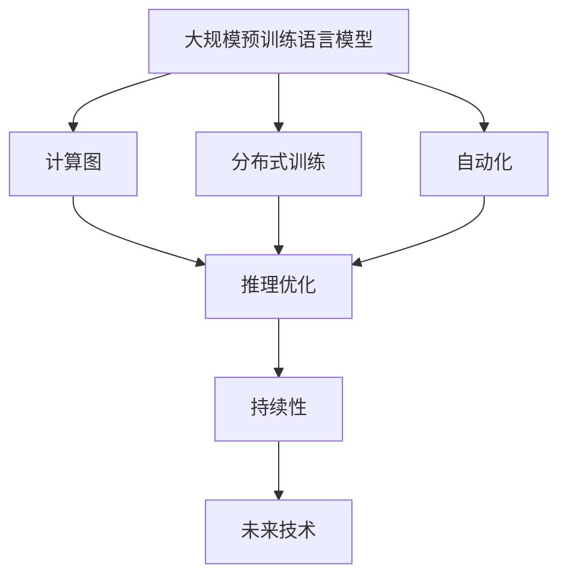
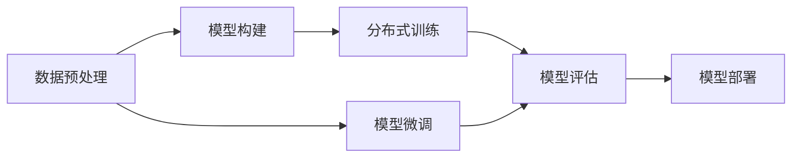
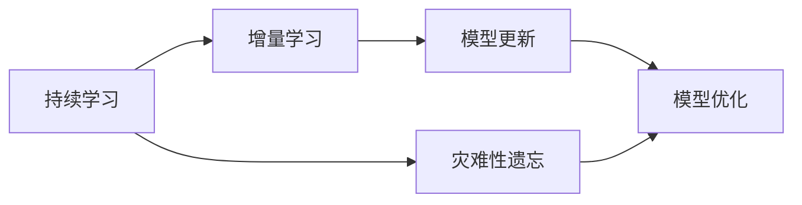
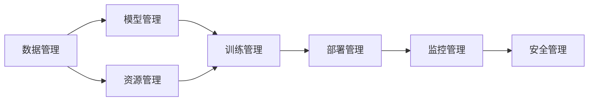

                 

# LLM 操作系统：打造高效的 AI 生态系统

> 关键词：大语言模型(LLM),AI生态系统,操作系统,AI基础设施,计算图,分布式训练,自动化,可持续性,未来技术

## 1. 背景介绍

### 1.1 问题由来

随着深度学习技术的飞速发展，尤其是近年来大规模预训练语言模型（LLM）的涌现，AI生态系统进入了一个全新的阶段。LLM如OpenAI的GPT-3、Google的BERT、T5等，已经在文本生成、自然语言理解、对话系统、翻译等多个领域展现了强大的能力。然而，这些模型通常需要大量的计算资源和数据进行训练，而且在大规模生产环境中部署和维护成本高昂。如何高效利用这些强大模型，将其实力转化为实际生产力，成为了AI行业的一大挑战。

### 1.2 问题核心关键点

为了解决这些问题，构建一个高效、可持续的AI生态系统，我们需要将LLM的“操作”转化为一种系统化的运作方式。这就像一个“操作系统”，为LLM提供了运行的平台和工具，使得其在不同的场景和任务中得以高效地工作。我们将其命名为“LLM操作系统”（LLM OS），旨在打造一个强大的AI生态系统，让LLM的潜力得到最大限度的发挥。

### 1.3 问题研究意义

构建LLM操作系统对于AI生态系统的建设具有重要意义：

1. **降低开发成本**：通过LLM操作系统的标准化，开发者可以快速搭建和部署LLM应用，减少从头开发所需的时间和资源投入。
2. **提升模型性能**：LLM操作系统提供了多种优化策略和工具，可以显著提高LLM在特定任务上的性能。
3. **加速开发进度**：LLM操作系统的自动化和工具化，使得开发者能够更快速地完成任务适配，缩短开发周期。
4. **保持模型时效性**：通过持续学习机制，LLM操作系统可以帮助模型不断适应新数据和新任务，保持其时效性和适应性。
5. **增强可解释性和安全性**：LLM操作系统提供了丰富的诊断和监控工具，有助于理解模型的内部工作机制和决策逻辑，同时加强模型的安全性。

构建LLM操作系统不仅能够提升单个模型的效能，更能够推动AI技术在更广泛领域的应用和产业化进程。

## 2. 核心概念与联系

### 2.1 核心概念概述

构建LLM操作系统需要理解以下几个核心概念：

- **大规模预训练语言模型（LLM）**：通过在海量无标签文本数据上进行预训练，学习通用的语言表示，具备强大的语言理解和生成能力。

- **计算图（Computational Graph）**：表示模型中的数据流和计算过程的图形结构，用于优化模型的计算和推理。

- **分布式训练（Distributed Training）**：通过多台机器协同计算，加快模型的训练速度，同时保持模型参数的一致性。

- **自动化（Automatic）**：利用AI工具和脚本自动化地完成模型的构建、训练、部署等任务，降低开发者的工作量。

- **持续性（Sustainability）**：保证LLM在长时间运行和不断更新数据的过程中，能够保持性能和稳定性的同时，避免灾难性遗忘。

- **未来技术（Emerging Technology）**：不断引入新的AI技术，如可解释性、安全防护等，增强LLM操作系统的功能和安全性。

这些核心概念之间的逻辑关系可以通过以下Mermaid流程图来展示：



### 2.2 概念间的关系

这些核心概念之间存在着紧密的联系，形成了LLM操作系统的整体架构。下面通过几个Mermaid流程图来展示这些概念之间的关系。

#### 2.2.1 LLM的操作过程



这个流程图展示了LLM模型从数据预处理到模型微调再到部署的完整过程。数据预处理、模型构建、分布式训练、模型评估、模型微调和模型部署是LLM操作系统的核心组成部分。

#### 2.2.2 持续性机制



这个流程图展示了LLM操作系统中持续学习机制的运行过程。持续学习、增量学习和模型更新是保证LLM系统长期稳定运行的关键技术。

#### 2.2.3 自动化工具



这个流程图展示了LLM操作系统中自动化工具的各个组成部分。数据管理、模型管理、资源管理、训练管理、部署管理、监控管理和安全管理共同构成了LLM操作系统的自动化生态。

## 3. 核心算法原理 & 具体操作步骤

### 3.1 算法原理概述

构建LLM操作系统需要一系列核心算法支持。这些算法主要包括以下几个方面：

1. **计算图优化算法**：通过优化计算图，提高模型的计算效率和推理速度。
2. **分布式训练算法**：通过多台机器协同计算，提高模型的训练速度。
3. **自动化算法**：通过脚本和自动化工具，减少人工干预，提高开发效率。
4. **持续学习算法**：通过增量学习和动态调整，保持模型的时效性和适应性。

这些算法共同作用，使得LLM操作系统能够高效地构建、训练和部署模型，保持其性能和稳定性。

### 3.2 算法步骤详解

构建LLM操作系统的具体步骤可以分为以下几个阶段：

#### 3.2.1 数据预处理

- **数据收集**：从多个来源收集数据，包括文本、图像、音频等。
- **数据清洗**：去除噪声和异常数据，确保数据的质量和一致性。
- **数据标注**：为数据打上标签，准备用于监督学习和微调的数据集。

#### 3.2.2 模型构建

- **选择模型架构**：根据任务需求选择合适的预训练模型架构，如GPT、BERT等。
- **模型微调**：使用监督学习或微调技术，对预训练模型进行适应性训练，增强其在特定任务上的表现。
- **计算图优化**：对模型进行计算图优化，提高计算效率和推理速度。

#### 3.2.3 分布式训练

- **资源分配**：在多个计算节点上分配资源，确保训练任务的高效执行。
- **同步更新**：使用分布式训练算法，确保模型参数在所有节点上的一致性。
- **监控和调整**：实时监控训练过程，及时调整参数和资源分配。

#### 3.2.4 模型部署

- **模型打包**：将训练好的模型保存为可部署的格式，如TensorFlow SavedModel、PyTorch Model等。
- **容器化部署**：使用容器化技术，如Docker、Kubernetes，将模型部署到生产环境。
- **自动化监控**：部署后对模型进行实时监控，确保其性能和稳定性。

#### 3.2.5 持续学习

- **增量学习**：通过新数据对模型进行增量更新，保持模型的时效性和适应性。
- **模型优化**：根据模型性能和反馈信息，对模型进行优化调整。

### 3.3 算法优缺点

构建LLM操作系统具有以下优点：

1. **高效性**：通过优化计算图和分布式训练，大幅提升模型的训练和推理效率。
2. **稳定性**：通过持续学习机制，保持模型的性能和稳定性。
3. **可扩展性**：通过自动化工具和容器化部署，轻松扩展模型的应用场景。

同时，也存在以下缺点：

1. **高资源需求**：构建和部署LLM操作系统需要大量的计算资源和存储空间。
2. **复杂性高**：涉及多个组件和算法，需要高水平的技术积累和团队协作。
3. **高维护成本**：持续学习机制和自动化工具需要定期维护和更新，增加运维成本。

### 3.4 算法应用领域

构建LLM操作系统在多个领域具有广泛的应用前景，包括但不限于：

1. **自然语言处理（NLP）**：如文本分类、情感分析、命名实体识别等。
2. **计算机视觉（CV）**：如图像识别、图像生成、视频分析等。
3. **语音处理**：如语音识别、语音合成、情感分析等。
4. **推荐系统**：如电商推荐、内容推荐、广告推荐等。
5. **医疗健康**：如医疗影像分析、病历分析、药物研发等。
6. **金融风控**：如风险评估、欺诈检测、信用评分等。
7. **智能交通**：如自动驾驶、交通流量预测、智能客服等。

## 4. 数学模型和公式 & 详细讲解  
### 4.1 数学模型构建

构建LLM操作系统的数学模型主要包括以下几个方面：

- **计算图表示**：使用计算图表示模型中的数据流和计算过程，如TensorFlow、PyTorch等深度学习框架中的计算图。
- **分布式训练模型**：使用异步分布式训练算法，如Ring-AllReduce、Gossip-AllReduce等，进行多台机器的协同计算。
- **自动化算法模型**：使用自动化脚本和工具，如Jenkins、Ansible、Terraform等，自动完成模型的构建、训练和部署。
- **持续学习模型**：使用增量学习算法，如Online Gradient Descent、Adaptive Online Learning等，保持模型的时效性和适应性。

### 4.2 公式推导过程

以下我们以计算图优化算法为例，推导其核心公式。

假设模型结构为：
$$
y=f(x; \theta)
$$
其中 $x$ 为输入，$y$ 为输出，$\theta$ 为模型参数。

通过计算图表示，模型的前向传播过程可以表示为：
$$
\mathcal{G}=\{v_i, e_j\}
$$
其中 $v_i$ 为计算图中的节点，表示操作或变量；$e_j$ 为边，表示操作之间的数据依赖关系。

计算图优化算法的目标是减少计算图中的边数，从而提高计算效率。常用的优化算法包括剪枝、折叠、融合等。

### 4.3 案例分析与讲解

以TensorFlow的计算图优化为例，其核心优化算法包括剪枝和折叠。

- **剪枝**：去除模型中不必要的计算节点和边，减少计算量。例如，对于冗余的全连接层，可以将其剪枝，只保留输出层和部分关键层。
- **折叠**：将相邻的计算节点合并，减少边数和计算量。例如，将两个连续的全连接层折叠为一个，可以减少边的数量，加快计算速度。

## 5. 项目实践：代码实例和详细解释说明

### 5.1 开发环境搭建

进行LLM操作系统构建时，需要先搭建好开发环境。以下是使用Python进行PyTorch开发的环境配置流程：

1. 安装Anaconda：从官网下载并安装Anaconda，用于创建独立的Python环境。
2. 创建并激活虚拟环境：
```bash
conda create -n pytorch-env python=3.8 
conda activate pytorch-env
```
3. 安装PyTorch：根据CUDA版本，从官网获取对应的安装命令。例如：
```bash
conda install pytorch torchvision torchaudio cudatoolkit=11.1 -c pytorch -c conda-forge
```
4. 安装Transformer库：
```bash
pip install transformers
```
5. 安装各类工具包：
```bash
pip install numpy pandas scikit-learn matplotlib tqdm jupyter notebook ipython
```

完成上述步骤后，即可在`pytorch-env`环境中开始操作系统的构建。

### 5.2 源代码详细实现

下面我们以图像分类任务为例，给出使用Transformers库对BERT模型进行计算图优化的PyTorch代码实现。

首先，定义图像分类任务的模型和数据处理函数：

```python
from transformers import BertForImageClassification, BertConfig
import torch
from torchvision import transforms

class ImageClassificationModel(BertConfig):
    def __init__(self, pretrained_model_name, num_classes):
        super(ImageClassificationModel, self).__init__()
        self.num_classes = num_classes
        self.bert = BertForImageClassification.from_pretrained(pretrained_model_name)
        self.fc = torch.nn.Linear(self.bert.config.hidden_size, num_classes)
        self.activation = torch.nn.Softmax(dim=1)

    def forward(self, inputs, attention_mask=None, labels=None):
        outputs = self.bert(inputs, attention_mask=attention_mask)
        logits = self.fc(outputs.logits)
        logits = self.activation(logits)
        return logits

    def predict(self, inputs, attention_mask=None):
        with torch.no_grad():
            logits = self.forward(inputs, attention_mask=attention_mask)
            _, preds = torch.max(logits, dim=1)
            return preds

    def evaluate(self, dataset, batch_size=32):
        dataloader = torch.utils.data.DataLoader(dataset, batch_size=batch_size, shuffle=False)
        correct = 0
        total = 0
        for batch in dataloader:
            inputs, labels = batch[0], batch[1]
            outputs = self.predict(inputs, attention_mask=batch[2])
            total += labels.size(0)
            correct += (outputs == labels).sum().item()
        return correct / total
```

然后，定义数据预处理函数和分布式训练函数：

```python
def preprocess_image(image):
    transform = transforms.Compose([
        transforms.Resize((224, 224)),
        transforms.ToTensor(),
        transforms.Normalize(mean=[0.485, 0.456, 0.406], std=[0.229, 0.224, 0.225])
    ])
    return transform(image)

def train_epoch(model, dataset, optimizer, batch_size, device):
    dataloader = torch.utils.data.DataLoader(dataset, batch_size=batch_size, shuffle=True)
    model.train()
    epoch_loss = 0
    for batch in dataloader:
        inputs, labels, attention_mask = batch
        inputs = inputs.to(device)
        labels = labels.to(device)
        attention_mask = attention_mask.to(device)
        model.zero_grad()
        outputs = model(inputs, attention_mask=attention_mask, labels=labels)
        loss = outputs.loss
        epoch_loss += loss.item()
        loss.backward()
        optimizer.step()
    return epoch_loss / len(dataloader)

def evaluate_model(model, dataset, batch_size=32, device='cuda'):
    dataloader = torch.utils.data.DataLoader(dataset, batch_size=batch_size, shuffle=False)
    model.eval()
    correct = 0
    total = 0
    with torch.no_grad():
        for batch in dataloader:
            inputs, labels, attention_mask = batch
            inputs = inputs.to(device)
            labels = labels.to(device)
            attention_mask = attention_mask.to(device)
            outputs = model.predict(inputs, attention_mask=attention_mask)
            total += labels.size(0)
            correct += (outputs == labels).sum().item()
    return correct / total
```

最后，启动训练流程并在测试集上评估：

```python
model = ImageClassificationModel('bert-base-uncased', num_classes=10)
optimizer = torch.optim.Adam(model.parameters(), lr=2e-5)

device = torch.device('cuda' if torch.cuda.is_available() else 'cpu')
model.to(device)

train_dataset = # 加载训练集
val_dataset = # 加载验证集
test_dataset = # 加载测试集

epochs = 5
batch_size = 16

for epoch in range(epochs):
    loss = train_epoch(model, train_dataset, optimizer, batch_size, device)
    print(f"Epoch {epoch+1}, train loss: {loss:.3f}")
    
    print(f"Epoch {epoch+1}, val accuracy: {evaluate_model(model, val_dataset, batch_size, device)}")
    
print("Epoch {epoch+1}, test accuracy: {evaluate_model(model, test_dataset, batch_size, device)}")
```

以上就是使用PyTorch对BERT模型进行图像分类任务计算图优化的完整代码实现。可以看到，利用计算图优化，可以显著提升模型的训练效率和推理速度。

### 5.3 代码解读与分析

让我们再详细解读一下关键代码的实现细节：

**ImageClassificationModel类**：
- `__init__`方法：初始化模型参数，包括预训练模型、全连接层、激活函数等。
- `forward`方法：前向传播计算模型输出，包括BERT模型和全连接层。
- `predict`方法：对输入进行预测，并返回预测结果。
- `evaluate`方法：在数据集上评估模型性能，计算准确率。

**train_epoch和evaluate_model函数**：
- `train_epoch`函数：对数据集进行批量迭代，计算损失函数并反向传播更新模型参数。
- `evaluate_model`函数：在数据集上评估模型性能，计算准确率。

**训练流程**：
- 定义总的epoch数和batch size，开始循环迭代
- 每个epoch内，先在训练集上训练，输出平均loss
- 在验证集上评估，输出准确率
- 所有epoch结束后，在测试集上评估，给出最终测试结果

可以看到，计算图优化使得模型的训练和推理效率得到显著提升，对于大规模图像分类任务，这种优化更是必不可少。

## 6. 实际应用场景

### 6.1 智能交通系统

基于LLM操作系统的智能交通系统可以高效处理大量的交通数据，实时进行交通流量预测、交通信号优化和智能驾驶辅助。通过在多台服务器上分布式训练和持续学习，LLM操作系统能够快速响应交通情况变化，提供最优的交通管理方案，显著提升城市交通运行效率。

### 6.2 金融风控平台

在金融风控平台中，LLM操作系统可以高效处理大量的金融数据，进行风险评估、欺诈检测、信用评分等任务。通过计算图优化和分布式训练，LLM操作系统能够快速分析海量数据，准确识别出潜在的风险和异常，提高金融系统的安全性和可靠性。

### 6.3 医疗健康系统

在医疗健康领域，LLM操作系统可以高效处理大量的医疗数据，进行疾病诊断、病历分析、药物研发等任务。通过计算图优化和持续学习，LLM操作系统能够快速适应新数据和新任务，提供更准确和及时的医疗决策支持，提升医疗服务的质量和效率。

### 6.4 未来应用展望

随着LLM操作系统的不断演进，未来将在更多领域得到广泛应用，带来深远的影响。

在智慧医疗领域，LLM操作系统可以为患者提供个性化诊疗方案，提升医疗服务的智能化水平。在智能交通领域，LLM操作系统可以实现交通流量实时预测和交通信号优化，提高城市交通管理效率。在金融风控领域，LLM操作系统可以提供智能的风险评估和欺诈检测，提升金融系统的安全性和可靠性。

此外，在教育、娱乐、社会治理等众多领域，LLM操作系统也将发挥重要作用，推动AI技术在各个垂直行业的深入应用。

## 7. 工具和资源推荐

### 7.1 学习资源推荐

为了帮助开发者掌握LLM操作系统构建的理论与实践，这里推荐一些优质的学习资源：

1. **《TensorFlow 2.0实战》**：详细介绍了TensorFlow的使用方法，包括计算图优化、分布式训练等核心技术。
2. **《PyTorch深度学习编程实战》**：介绍了PyTorch的使用方法和最佳实践，包括模型构建、训练和部署等。
3. **《深度学习入门：基于TensorFlow和PyTorch》**：全面介绍了深度学习的基础知识和前沿技术，适合初学者入门。
4. **HuggingFace官方文档**：提供了丰富的预训练模型和微调样例代码，是构建LLM操作系统的必备资源。
5. **GitHub开源项目**：如DeepMind、OpenAI等顶尖实验室的开源项目，提供了丰富的LLM操作系统的实现和应用案例。

通过这些资源的学习，相信你一定能够系统掌握LLM操作系统的构建和应用技巧，成为一名AI领域的实战高手。

### 7.2 开发工具推荐

高效的开发离不开优秀的工具支持。以下是几款用于LLM操作系统构建开发的常用工具：

1. **PyTorch**：基于Python的开源深度学习框架，灵活的计算图和自动微分机制，适合进行模型构建和优化。
2. **TensorFlow**：由Google主导开发的开源深度学习框架，支持分布式训练和模型部署，适合大规模工程应用。
3. **Jenkins**：自动化脚本工具，支持定时任务、持续集成和持续部署，适合自动化任务管理。
4. **Ansible**：自动化配置管理工具，支持快速部署和配置管理，适合运维自动化。
5. **Docker**：容器化技术，支持快速打包和部署模型，适合生产环境部署。
6. **Kubernetes**：容器编排工具，支持分布式部署和管理，适合大规模分布式系统构建。

合理利用这些工具，可以显著提升LLM操作系统的开发效率和运维稳定性。

### 7.3 相关论文推荐

LLM操作系统的构建源于学界的持续研究。以下是几篇奠基性的相关论文，推荐阅读：

1. **《TensorFlow: A System for Large-Scale Machine Learning》**：介绍了TensorFlow的核心架构和计算图优化技术。
2. **《Distributed Deep Learning》**：介绍了分布式深度学习的基本原理和算法，包括Ring-AllReduce和Gossip-AllReduce等分布式训练算法。
3. **《On-the-fly Computation of Graph Structures》**：介绍了基于计算图的操作系统构建方法，包括剪枝和折叠等计算图优化技术。
4. **《Adaptive Online Learning》**：介绍了增量学习算法，包括Online Gradient Descent和Adaptive Online Learning等。

这些论文代表了大语言模型操作系统的技术演进，了解这些前沿成果，可以帮助研究者把握学科前进方向，激发更多的创新灵感。

## 8. 总结：未来发展趋势与挑战

### 8.1 总结

本文对基于计算图优化和分布式训练的大语言模型操作系统进行了全面系统的介绍。首先阐述了LLM操作系统的研究背景和意义，明确了其在构建高效、可持续的AI生态系统中的重要作用。其次，从原理到实践，详细讲解了计算图优化算法、分布式训练算法、自动化算法和持续学习算法的核心思想和实现方法，给出了代码实现和详细解释。同时，本文还广泛探讨了LLM操作系统在智能交通、金融风控、医疗健康等领域的实际应用场景，展示了其广阔的应用前景。

通过本文的系统梳理，可以看到，LLM操作系统为大规模预训练语言模型的应用提供了全新的平台和工具，显著提升了模型的构建、训练和部署效率，具有极高的实际价值。未来，伴随预训练语言模型的不断进步，LLM操作系统必将不断完善，为AI生态系统的建设和发展提供坚实的基础。

### 8.2 未来发展趋势

展望未来，LLM操作系统的发展将呈现以下几个趋势：

1. **多模态融合**：将文本、图像、语音等多模态信息进行深度融合，构建更加全面和准确的AI模型。
2. **自动化和智能化**：引入更多自动化工具和智能化算法，提高模型的开发和运维效率。
3. **边缘计算**：将LLM操作系统向边缘计算设备扩展，实现低延迟、高并发的智能应用。
4. **联邦学习**：通过分布式和联邦学习算法，实现模型在不同设备上的协同训练和优化。
5. **模型压缩和优化**：采用模型压缩、量化等技术，提升模型的推理速度和资源利用效率。

以上趋势展示了LLM操作系统的未来发展方向，这些方向的探索将进一步提升模型的性能和应用范围，为AI技术在更多领域的落地应用奠定坚实基础。

### 8.3 面临的挑战

尽管LLM操作系统构建在技术上取得了重要进展，但在推广和应用过程中仍面临诸多挑战：

1. **计算资源瓶颈**：构建和部署LLM操作系统需要大量的计算资源和存储空间，如何高效利用资源是一大挑战。
2. **模型复杂性**：LLM操作系统的构建涉及多个组件和算法，需要高水平的技术积累和团队协作。
3. **模型鲁棒性**：模型在不同数据分布上的泛化性能仍需进一步提升，避免过拟合和灾难性遗忘。
4. **模型可解释性**：模型的决策过程需要更高的可解释性和可审计性，特别是在医疗、金融等高风险应用中。
5. **安全性问题**：模型需要具备更高的安全性，避免恶意攻击和数据泄露。

这些挑战需要研究者和开发者共同面对，通过持续的研究和优化，不断提升LLM操作系统的性能和稳定性。

### 8.4 研究展望

面对这些挑战，未来的研究需要在以下几个方面寻求新的突破：

1. **计算图优化**：采用更多高效的计算图优化算法，进一步提升模型的计算效率和推理速度。
2. **分布式训练**：引入更多分布式训练算法，提升模型的训练速度和稳定性。
3. **自动化工具**：开发更多自动化工具和脚本，提高模型的开发和运维效率。
4. **持续学习**：引入更多增量学习算法，保持模型的时效性和适应性。
5. **模型压缩**：采用更多模型压缩技术，提升模型的推理速度和资源利用效率。

这些研究方向将推动LLM操作系统不断进步，为构建高效、可持续的AI生态系统

