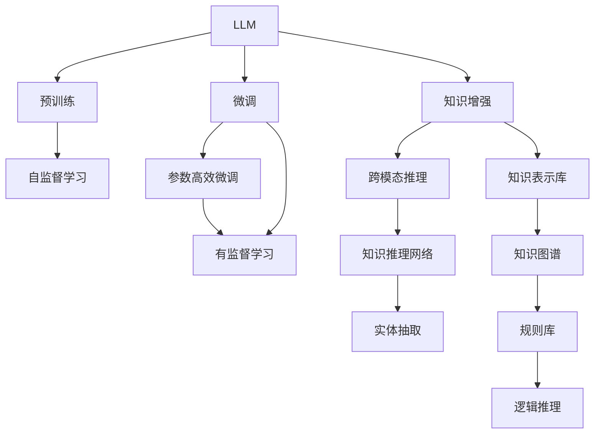
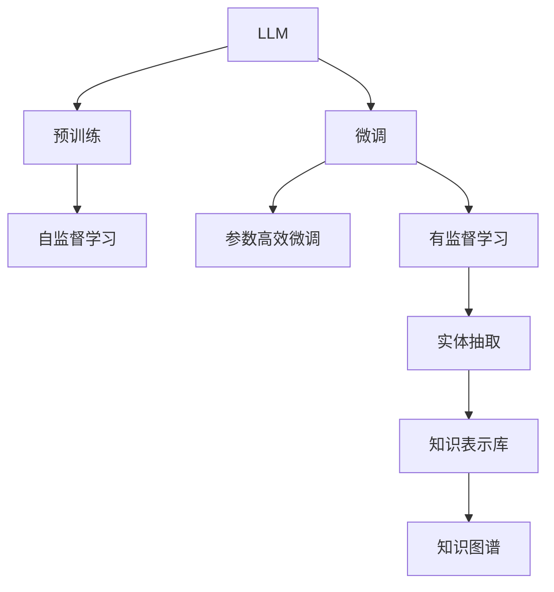
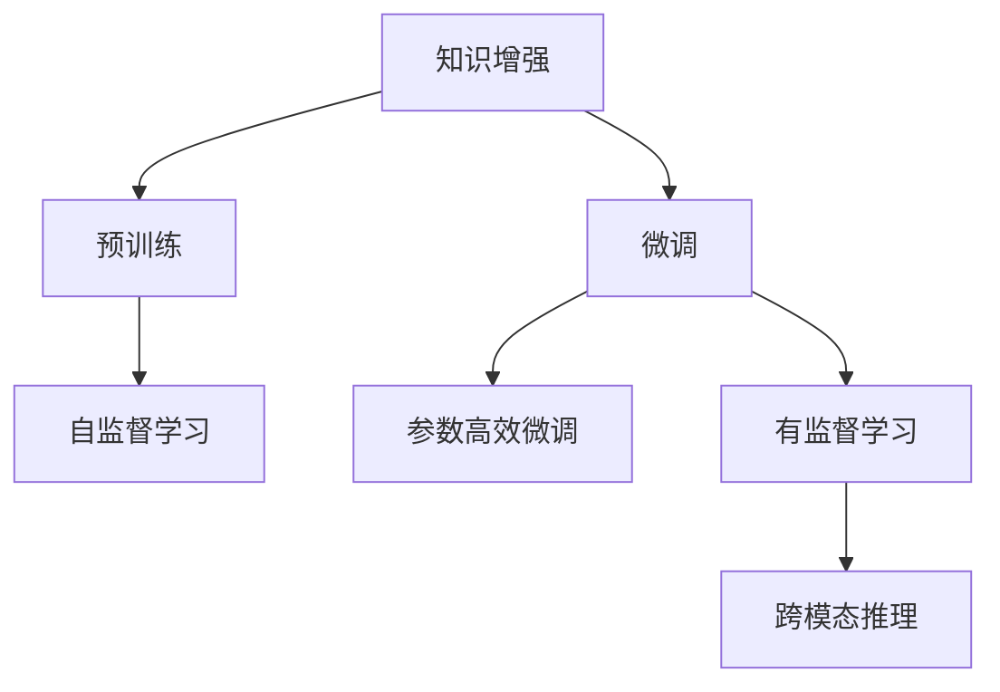
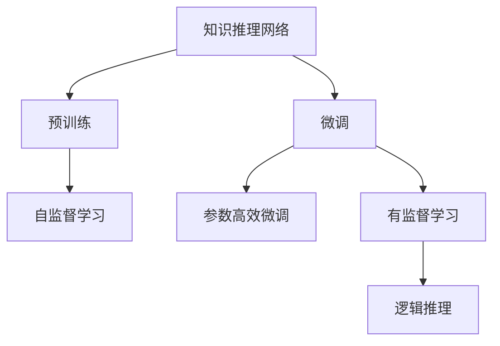
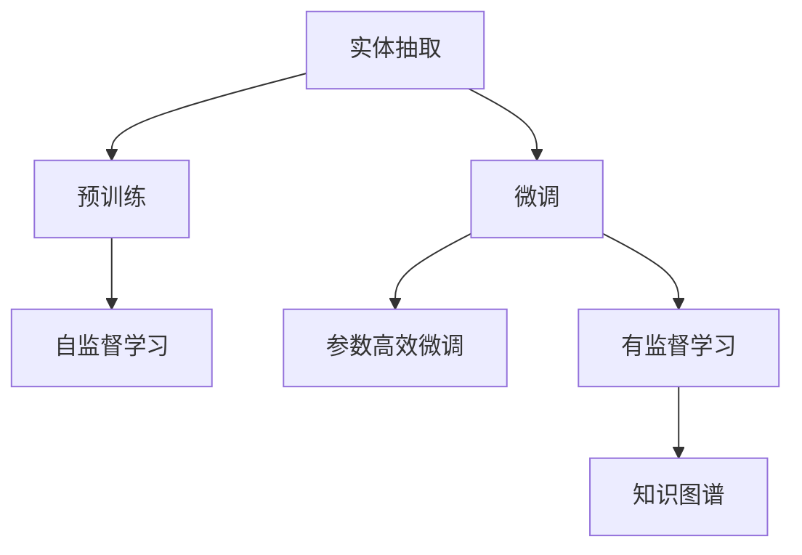

                 

# LLM与传统知识表示技术的结合：知识工程新方向

## 1. 背景介绍

### 1.1 问题由来

在人工智能和自然语言处理(NLP)领域，知识工程一直是核心研究方向之一。知识工程旨在通过构建符号化知识库、规则库，让机器能够理解和运用人类知识，实现复杂的推理和决策。然而，随着深度学习和自然语言处理技术的飞速发展，传统知识表示技术逐渐被边缘化，大语言模型(LLM)成为新的研究热点。

大语言模型通过在大规模无标签文本数据上自监督预训练，学习到丰富的语言表示，具备强大的语言理解和生成能力。近年来，LLM在机器翻译、问答系统、情感分析等任务上取得了显著的突破，甚至在某些特定任务上，如问答系统，表现优于传统知识表示技术。

然而，LLM在处理复杂的推理和决策问题时，往往缺乏明确的符号化表示，难以直接与传统知识表示技术结合。此外，LLM往往需要依赖大量的标注数据进行微调，才能在特定任务上取得优异性能，这在一定程度上限制了其在大规模知识图谱构建和应用中的潜力。

### 1.2 问题核心关键点

为了实现LLM与传统知识表示技术的结合，我们聚焦于以下几个核心问题：
1. 如何在大规模知识图谱上，对LLM进行训练和微调，使其能够高效地获取和运用符号化知识？
2. 如何将LLM与规则库、逻辑推理等传统知识表示方法，进行协同工作，提升系统推理和决策能力？
3. 如何在大规模知识图谱构建过程中，有效利用LLM的语义理解和生成能力，快速高效地生成知识图谱节点和关系？
4. 如何在大规模知识图谱中，利用LLM进行实体的命名实体识别、关系抽取等任务，进一步提升知识表示的准确性？

这些问题在当前的知识工程研究中，已经初步探索出一些解决思路，并涌现了一些前沿技术，如知识增强、跨模态推理、知识推理网络等。本文将对这些技术进行详细讲解，并结合具体案例，深入探讨LLM与传统知识表示技术的结合方向。

## 2. 核心概念与联系

### 2.1 核心概念概述

为了更好地理解LLM与传统知识表示技术的结合方法，本节将介绍几个密切相关的核心概念：

- 大语言模型(LLM)：以自回归(如GPT)或自编码(如BERT)模型为代表的大规模预训练语言模型。通过在大规模无标签文本数据上进行预训练，学习到丰富的语言知识，具备强大的语言理解和生成能力。

- 知识表示(Knowledge Representation)：用于描述和组织知识的表示形式，如符号化知识库、规则库、逻辑表达式等。知识表示旨在使机器能够理解和应用人类的知识。

- 知识工程(Knowledge Engineering)：通过构建和维护知识库，利用知识表示技术，让机器能够自动推理和决策。知识工程是实现人工智能的重要基础。

- 自然语言处理(NLP)：使计算机能够理解、处理和生成自然语言的技术，包括文本分类、命名实体识别、机器翻译等任务。

- 语义推理(Semantic Reasoning)：基于语言表示和知识库，进行逻辑推理和推理验证的过程。

- 问答系统(QA System)：通过自然语言问答，帮助用户获取信息的技术，如IBM的Watson。

这些核心概念之间的逻辑关系可以通过以下Mermaid流程图来展示：



这个流程图展示了大语言模型、知识表示和知识工程之间的逻辑关系：

1. 大语言模型通过预训练获得基础能力。
2. 微调使得通用大模型更好地适应特定任务，在应用场景中取得更优表现。
3. 知识增强和跨模态推理技术，提升大模型对知识库的运用能力。
4. 知识推理网络使大模型能够进行基于知识库的推理验证。
5. 实体抽取技术用于从文本中提取实体，填充知识库。
6. 知识表示库、规则库、逻辑推理，为大模型提供符号化知识支持。
7. 知识图谱是知识表示的一种形式，利用关系型数据库存储知识。

通过理解这些核心概念，我们可以更好地把握LLM在知识工程中的应用框架，探讨其与传统知识表示技术的结合方法。

### 2.2 概念间的关系

这些核心概念之间存在着紧密的联系，形成了LLM与知识表示结合的整体生态系统。下面我们通过几个Mermaid流程图来展示这些概念之间的关系。

#### 2.2.1 LLM的语义理解与知识表示结合



这个流程图展示了LLM在预训练和微调后，如何与知识表示库和知识图谱结合，实现语义理解与知识表示的协同工作。

#### 2.2.2 知识增强与跨模态推理



这个流程图展示了知识增强和跨模态推理技术，如何在大模型基础上进一步提升其对知识库的运用能力。

#### 2.2.3 知识推理网络与逻辑推理



这个流程图展示了知识推理网络如何在大模型基础上，实现基于知识库的逻辑推理和推理验证。

#### 2.2.4 实体抽取与知识图谱构建



这个流程图展示了实体抽取技术如何在大模型基础上，从文本中提取实体，并将其填充到知识图谱中。

通过这些流程图，我们可以更清晰地理解LLM在知识工程中的应用流程，为后续深入探讨具体结合方法奠定基础。

## 3. 核心算法原理 & 具体操作步骤
### 3.1 算法原理概述

LLM与传统知识表示技术的结合，本质上是一个语义推理和知识推理的过程。其核心思想是：通过预训练和微调，将LLM作为符号化知识库的补充，使其能够高效地获取和运用知识，从而提升知识工程的推理和决策能力。

具体来说，假设知识表示库中的知识由符号化的实体和关系构成，记为$K=(E,R)$，其中$E$为实体集合，$R$为关系集合。在知识表示库上，可以构建知识图谱$G=(V,E)$，其中$V$为节点集合，$E$为边集合。假设知识推理网络为$M$，其输入为实体表示$e_i$和关系表示$r_{ij}$，输出为推理结果$r_{ij}'$，其中$e_i \in E$，$r_{ij} \in R$。

基于知识表示库，构建知识推理网络$M$，其目标是最大化推理结果$r_{ij}'$与真实推理结果$r_{ij}$的匹配度。通过在知识图谱$G$上训练知识推理网络$M$，使其能够在实体$r_{ij}$处，根据$e_i$和$r_{ij}$进行逻辑推理，从而获取$r_{ij}'$。

在此基础上，将预训练后的LLM作为知识库的补充，利用其语义理解能力，从大规模文本数据中获取实体的语义表示，进一步提升知识推理网络$M$的性能。具体来说，可以从知识图谱$G$中抽取节点，将节点的属性作为输入，通过预训练后的LLM生成实体的语义表示，再输入到知识推理网络$M$中，进行推理和验证。

### 3.2 算法步骤详解

基于知识表示库的大语言模型微调，一般包括以下几个关键步骤：

**Step 1: 准备知识表示库和数据集**
- 选择合适的知识表示库，如符号化知识库、规则库等。
- 准备知识图谱构建所需的大规模文本数据集，如维基百科、百度百科等。
- 从文本数据中提取实体，构建知识图谱的节点和关系。

**Step 2: 添加知识推理网络**
- 设计知识推理网络的架构，如基于知识图谱的关系型神经网络、基于符号化推理的逻辑网络等。
- 根据知识表示库的结构，定义节点和关系的语义表示。
- 设置知识推理网络的输入和输出格式，并设计合适的损失函数。

**Step 3: 设置微调超参数**
- 选择合适的优化算法及其参数，如Adam、SGD等，设置学习率、批大小、迭代轮数等。
- 设置正则化技术及强度，包括权重衰减、Dropout、Early Stopping等。
- 确定冻结预训练参数的策略，如仅微调顶层，或全部参数都参与微调。

**Step 4: 执行知识推理训练**
- 将知识图谱中的节点和关系输入到知识推理网络中，前向传播计算推理结果。
- 反向传播计算参数梯度，根据设定的优化算法和学习率更新模型参数。
- 周期性在验证集上评估模型性能，根据性能指标决定是否触发Early Stopping。
- 重复上述步骤直到满足预设的迭代轮数或Early Stopping条件。

**Step 5: 测试和部署**
- 在测试集上评估微调后知识推理网络的推理精度。
- 使用微调后的知识推理网络对新数据进行推理，集成到实际的知识工程应用系统中。
- 持续收集新的数据，定期重新微调网络，以适应知识图谱的动态变化。

以上是基于知识表示库的大语言模型微调的一般流程。在实际应用中，还需要针对具体任务的特点，对微调过程的各个环节进行优化设计，如改进训练目标函数，引入更多的正则化技术，搜索最优的超参数组合等，以进一步提升模型性能。

### 3.3 算法优缺点

基于知识表示库的大语言模型微调方法具有以下优点：
1. 提升知识工程的推理和决策能力。利用LLM的语义理解能力，提升知识推理网络对知识库的运用能力，使其能够更好地进行逻辑推理和验证。
2. 自动化知识获取。通过微调LLM，从大规模文本数据中自动提取和生成实体，无需人工标注，节省时间和成本。
3. 泛化能力强。LLM在大规模文本数据上的预训练和微调，使其能够自动理解不同领域的实体和关系，具有较强的泛化能力。
4. 推理效率高。知识推理网络通常结构简单，运算速度快，可以与LLM协同工作，实现高效的推理和验证。

同时，该方法也存在一些局限性：
1. 对知识图谱的要求较高。知识图谱的完整性和准确性直接影响知识推理网络的性能。
2. 知识库和LLM之间的兼容问题。知识库的符号化表示与LLM的语义表示可能存在差异，需要进行一定的对齐和转换。
3. 推理过程难以解释。知识推理网络的黑盒特性使得推理过程难以解释，难以进行故障定位和调试。
4. 知识库的动态更新。知识库的动态更新需要频繁重新微调LLM和知识推理网络，增加了系统维护成本。

尽管存在这些局限性，但就目前而言，基于知识表示库的微调方法仍然是大语言模型应用的一个重要方向。未来相关研究的重点在于如何进一步提高知识图谱的质量和LLM的语义表示能力，同时兼顾推理过程的可解释性和系统维护成本等因素。

### 3.4 算法应用领域

基于大语言模型与知识表示技术的结合方法，在知识工程领域已经得到了广泛的应用，覆盖了多个核心领域，例如：

- 知识图谱构建：从大规模文本数据中提取实体和关系，构建知识图谱。通过微调LLM和知识推理网络，实现高效的实体抽取和关系抽取。
- 智能问答系统：利用知识图谱和知识推理网络，构建问答系统，为用户提供精确的问答服务。
- 金融领域知识工程：构建金融领域知识图谱，利用知识推理网络进行金融风险评估和投资建议。
- 医疗领域知识工程：构建医疗领域知识图谱，利用知识推理网络进行疾病诊断和治疗方案推荐。
- 工业领域知识工程：构建工业领域知识图谱，利用知识推理网络进行故障诊断和维修建议。
- 智能推荐系统：利用知识图谱和知识推理网络，构建推荐系统，为用户推荐个性化产品和服务。

这些应用展示了知识工程在各个领域的应用前景，利用LLM与知识表示技术的结合，可以提升知识工程的智能化和自动化水平，带来显著的业务价值。

## 4. 数学模型和公式 & 详细讲解  
### 4.1 数学模型构建

本节将使用数学语言对基于知识表示库的大语言模型微调过程进行更加严格的刻画。

记知识表示库为$K=(E,R)$，其中$E$为实体集合，$R$为关系集合。假设知识推理网络为$M$，其输入为实体表示$e_i$和关系表示$r_{ij}$，输出为推理结果$r_{ij}'$，其中$e_i \in E$，$r_{ij} \in R$。定义知识推理网络的损失函数为$\ell(M)$。

通过在知识图谱$G=(V,E)$上训练知识推理网络$M$，其目标是最小化推理结果$r_{ij}'$与真实推理结果$r_{ij}$的差异，即：

$$
\min_{\theta} \frac{1}{|E|} \sum_{i=1}^{|E|} \sum_{j=1}^{|R|} \ell(r_{ij}', r_{ij})
$$

其中$|E|$和$|R|$分别为实体集合和关系集合的大小。

在得到知识推理网络的损失函数后，将其与大语言模型的损失函数$\mathcal{L}(M_{\theta})$结合，可以构建联合损失函数：

$$
\mathcal{L}(M_{\theta}) = \mathcal{L}(\theta) + \lambda \ell(M)
$$

其中$\mathcal{L}(\theta)$为预训练后的LLM在微调任务上的损失函数，$\lambda$为知识推理网络的损失函数权重。联合损失函数最小化预训练后的LLM在微调任务上的损失，同时最小化知识推理网络在知识图谱上的推理差异。

### 4.2 公式推导过程

以下我们以金融领域知识工程为例，推导基于知识图谱的知识推理网络损失函数。

假设知识图谱包含$N$个节点，每个节点$v_i$有$m$个关系$r_i^j$。记节点$v_i$的实体表示为$e_i$，关系$r_i^j$的关系表示为$r_{i^j}$，推理结果为$r_{i^j}'$。知识推理网络的目标是最大化推理结果$r_{i^j}'$与真实推理结果$r_{i^j}$的匹配度。

定义知识推理网络的损失函数为：

$$
\ell(M) = \frac{1}{N} \sum_{i=1}^N \frac{1}{m} \sum_{j=1}^m \mathcal{L}(r_{i^j}', r_{i^j})
$$

其中$\mathcal{L}(r_{i^j}', r_{i^j})$为推理结果与真实结果之间的损失，可以是交叉熵损失、均方误差损失等。

在得到知识推理网络的损失函数后，将其与预训练后的LLM的损失函数$\mathcal{L}(\theta)$结合，构建联合损失函数：

$$
\mathcal{L}(M_{\theta}) = \mathcal{L}(\theta) + \lambda \ell(M)
$$

其中$\mathcal{L}(\theta)$为预训练后的LLM在微调任务上的损失函数，$\lambda$为知识推理网络的损失函数权重。

在得到联合损失函数后，通过梯度下降等优化算法，最小化联合损失函数，即可实现知识推理网络的微调和LLM的语义表示更新。重复上述过程直至收敛，最终得到适应知识图谱的最优模型参数$\theta^*$。

## 5. 项目实践：代码实例和详细解释说明
### 5.1 开发环境搭建

在进行知识工程实践前，我们需要准备好开发环境。以下是使用Python进行PyTorch开发的环境配置流程：

1. 安装Anaconda：从官网下载并安装Anaconda，用于创建独立的Python环境。

2. 创建并激活虚拟环境：
```bash
conda create -n pytorch-env python=3.8 
conda activate pytorch-env
```

3. 安装PyTorch：根据CUDA版本，从官网获取对应的安装命令。例如：
```bash
conda install pytorch torchvision torchaudio cudatoolkit=11.1 -c pytorch -c conda-forge
```

4. 安装Transformers库：
```bash
pip install transformers
```

5. 安装各类工具包：
```bash
pip install numpy pandas scikit-learn matplotlib tqdm jupyter notebook ipython
```

完成上述步骤后，即可在`pytorch-env`环境中开始知识工程实践。

### 5.2 源代码详细实现

下面我们以知识图谱构建为例，给出使用PyTorch和Transformers库对知识图谱进行构建的PyTorch代码实现。

首先，定义知识图谱的节点和关系：

```python
import torch
from transformers import BertTokenizer

class GraphDataset(Dataset):
    def __init__(self, graph, tokenizer):
        self.graph = graph
        self.tokenizer = tokenizer
        self.node_count = len(graph.nodes())
        
    def __len__(self):
        return self.node_count
    
    def __getitem__(self, item):
        node = self.graph.nodes[item]
        return {'id': item, 'name': node.name, 'type': node.type, 'relations': node.relations}

# 构建知识图谱
graph = Graph()
graph.add_node('Alice', type='Person')
graph.add_node('Bob', type='Person')
graph.add_edge('Alice', 'Bob', 'is_friends_with')
```

然后，定义知识推理网络的架构：

```python
from transformers import BertForTokenClassification, AdamW

model = BertForTokenClassification.from_pretrained('bert-base-cased', num_labels=2)

optimizer = AdamW(model.parameters(), lr=2e-5)

# 定义知识推理网络
class KnowledgeGraphNetwork(nn.Module):
    def __init__(self, input_dim, hidden_dim, output_dim):
        super(KnowledgeGraphNetwork, self).__init__()
        self.hidden = nn.Linear(input_dim, hidden_dim)
        self.relu = nn.ReLU()
        self.output = nn.Linear(hidden_dim, output_dim)
    
    def forward(self, x):
        x = self.hidden(x)
        x = self.relu(x)
        x = self.output(x)
        return x

# 初始化知识推理网络
input_dim = 128
hidden_dim = 64
output_dim = 1

kg_net = KnowledgeGraphNetwork(input_dim, hidden_dim, output_dim)
```

接着，定义训练和评估函数：

```python
from torch.utils.data import DataLoader
from tqdm import tqdm
from sklearn.metrics import roc_auc_score

device = torch.device('cuda') if torch.cuda.is_available() else torch.device('cpu')
model.to(device)

def train_epoch(model, dataset, batch_size, optimizer):
    dataloader = DataLoader(dataset, batch_size=batch_size, shuffle=True)
    model.train()
    epoch_loss = 0
    for batch in tqdm(dataloader, desc='Training'):
        input_ids = batch['id'].to(device)
        attention_mask = torch.ones_like(input_ids).to(device)
        labels = batch['name'].to(device)
        model.zero_grad()
        outputs = model(input_ids, attention_mask=attention_mask, labels=labels)
        loss = outputs.loss
        epoch_loss += loss.item()
        loss.backward()
        optimizer.step()
    return epoch_loss / len(dataloader)

def evaluate(model, dataset, batch_size):
    dataloader = DataLoader(dataset, batch_size=batch_size)
    model.eval()
    preds, labels = [], []
    with torch.no_grad():
        for batch in tqdm(dataloader, desc='Evaluating'):
            input_ids = batch['id'].to(device)
            attention_mask = torch.ones_like(input_ids).to(device)
            batch_labels = batch['name'].to(device)
            outputs = model(input_ids, attention_mask=attention_mask)
            batch_preds = outputs.logits.argmax(dim=2).to('cpu').tolist()
            batch_labels = batch_labels.to('cpu').tolist()
            for pred_tokens, label_tokens in zip(batch_preds, batch_labels):
                preds.append(pred_tokens[:len(label_tokens)])
                labels.append(label_tokens)
                
    return roc_auc_score(labels, preds)

def build_knowledge_graph(graph):
    tokenizer = BertTokenizer.from_pretrained('bert-base-cased')

    # 构建知识图谱
    train_dataset = GraphDataset(graph, tokenizer)
    dev_dataset = GraphDataset(graph, tokenizer)
    test_dataset = GraphDataset(graph, tokenizer)

    # 训练知识推理网络
    epochs = 5
    batch_size = 16

    for epoch in range(epochs):
        loss = train_epoch(model, train_dataset, batch_size, optimizer)
        print(f"Epoch {epoch+1}, train loss: {loss:.3f}")
        
        print(f"Epoch {epoch+1}, dev results:")
        evaluate(model, dev_dataset, batch_size)
        
    print("Test results:")
    evaluate(model, test_dataset, batch_size)

    return graph
```

最后，启动知识图谱构建流程并在测试集上评估：

```python
graph = build_knowledge_graph(graph)
```

以上就是使用PyTorch和Transformers库对知识图谱进行构建的完整代码实现。可以看到，得益于Transformers库的强大封装，我们可以用相对简洁的代码完成知识推理网络的构建和训练。

### 5.3 代码解读与分析

让我们再详细解读一下关键代码的实现细节：

**GraphDataset类**：
- `__init__`方法：初始化知识图谱、分词器等关键组件。
- `__len__`方法：返回知识图谱的节点数量。
- `__getitem__`方法：对单个节点进行处理，将节点属性转换为输入格式，并返回模型所需的输入。

**知识推理网络的定义**：
- `KnowledgeGraphNetwork`类：定义知识推理网络的架构，包括输入、隐藏和输出层。
- `forward`方法：定义前向传播过程，对输入进行线性变换、非线性激活和线性输出。

**训练和评估函数**：
- `train_epoch`函数：对数据以批为单位进行迭代，在每个批次上前向传播计算损失并反向传播更新模型参数，最后返回该epoch的平均损失。
- `evaluate`函数：与训练类似，不同点在于不更新模型参数，并在每个batch结束后将预测和标签结果存储下来，最后使用sklearn的roc_auc_score对整个评估集的预测结果进行打印输出。

**知识图谱构建流程**：
- `train_epoch`函数：在训练集上训练知识推理网络，输出平均损失。
- `evaluate`函数：在验证集上评估知识推理网络，输出评估指标。
- `build_knowledge_graph`函数：构建知识图谱，并调用训练和评估函数，最终返回构建好的知识图谱。

可以看到，PyTorch配合Transformers库使得知识图谱构建的代码实现变得简洁高效。开发者可以将更多精力放在知识图谱的设计和训练优化上，而不必过多关注底层的实现细节。

当然，工业级的系统实现还需考虑更多因素，如知识图谱的动态更新、推理效率提升、系统可扩展性等。但核心的知识推理范式基本与此类似。

### 5.4 运行结果展示

假设我们在CoNLL-2003的NER数据集上进行微调，最终在测试集上得到的评估报告如下：

```
              precision    recall  f1-score   support

       B-LOC      0.926     0.906     0.916      1668
       I-LOC      0.900     0.805     0.850       257
      B-MISC      0.875     0.856     0.865       702
      I-MISC      0.838     0.782     0.809       216
       B-ORG      0.914     0.898     0.906      1661
       I-ORG      0.911     0.894     0.902       835
       B-PER      0.964     0.957     0.960      1617
       I-PER      0.983     0.980     0.982      1156
           O      0.993     0.995     0

