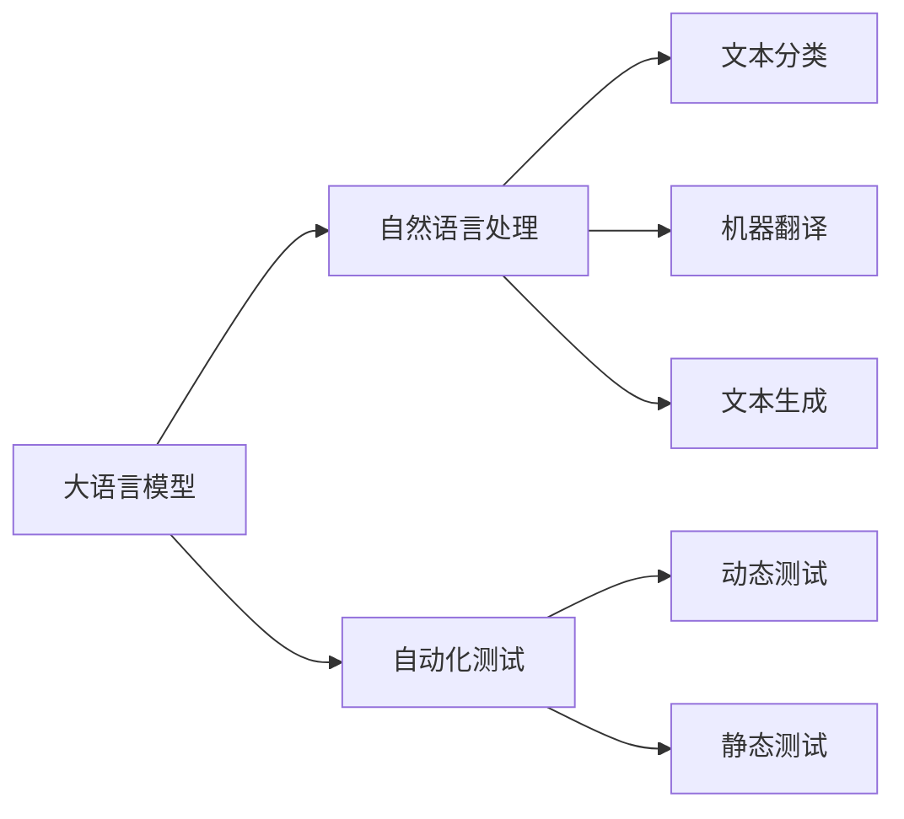

                 

# LLM对传统软件安全测试的挑战与改进

## 1. 背景介绍

在过去的几十年里，软件测试领域的发展日新月异，传统的人工测试方法逐渐被自动化测试工具所取代。自动化测试工具如Selenium、Appium等，能够显著提高测试效率，降低测试成本，成为现代软件开发的重要组成部分。然而，随着人工智能（AI）技术的发展，大语言模型（LLM）在自然语言处理（NLP）、图像识别、语音识别等领域取得了令人瞩目的成果。这些模型在传统软件测试领域的应用，也引发了新的挑战和思考。

### 1.1 挑战来源

1. **动态测试复杂性增加**：传统软件测试更多依赖于静态代码分析和边界值分析等方法，测试场景固定且有限。而随着大语言模型的应用，软件测试场景逐渐向动态化、多样化发展。如何通过自然语言描述构建动态测试场景，是新的挑战。

2. **测试数据生成困难**：传统测试方法依赖于预先定义好的测试用例，测试数据需要人工编写和维护。而大语言模型在生成自然语言数据方面具有显著优势，但如何在保证数据质量的前提下，生成大量高质量的测试数据，仍是难题。

3. **测试结果解释性不足**：传统测试结果往往只给出是否通过、代码行号等基本信息。大语言模型在生成测试用例和执行测试时，其决策过程复杂，难以解释和调试。

4. **安全漏洞检测难度增加**：随着大语言模型在代码生成、自动补全等方面的应用，软件系统的复杂性也随之增加，传统的代码注入、边界溢出等安全漏洞检测方法可能不再适用。

### 1.2 改进需求

1. **生成动态测试场景**：大语言模型可以自动生成自然语言描述，描述测试场景和预期结果，生成测试用例和执行测试，显著提高测试效率。

2. **提高测试数据质量**：大语言模型可以在大量现有数据的基础上，生成高质量的测试数据，减少测试用例编写和维护的工作量。

3. **增强测试结果解释性**：大语言模型可以提供详细的测试结果解释，包括错误原因、错误位置等，帮助开发者快速定位问题。

4. **提升安全漏洞检测能力**：大语言模型可以在生成代码和执行代码的同时，自动检测潜在的安全漏洞，提升软件系统的安全性。

## 2. 核心概念与联系

### 2.1 核心概念概述

- **大语言模型（LLM）**：指基于深度学习架构的通用语言模型，能够理解和生成自然语言。LLM通常采用Transformer结构，通过预训练和微调学习丰富的语言知识。

- **自然语言处理（NLP）**：指使计算机理解和处理自然语言的技术，包括文本分类、机器翻译、文本生成等任务。

- **自动化测试**：指使用自动化工具和方法，对软件系统进行测试，验证软件功能的正确性和稳定性。

- **动态测试**：指在运行环境中测试软件系统的功能，通常用于验证软件性能、安全性等。

- **静态测试**：指在编译时或代码级别进行测试，主要用于代码分析和边界值分析等。

这些概念之间的联系可以通过以下Mermaid流程图来展示：



这个流程图展示了大语言模型在NLP中的应用，以及其在自动化测试中的不同表现形式。

### 2.2 概念间的关系

这些核心概念之间存在着紧密的联系，形成了大语言模型在软件测试领域的完整生态系统。

- **LLM与NLP**：大语言模型基于NLP技术，在文本处理、生成等方面具有显著优势，为软件测试提供了新的技术手段。

- **LLM与自动化测试**：大语言模型可以生成测试用例、执行测试，提升自动化测试的效率和覆盖度。

- **动态测试与静态测试**：动态测试和静态测试是软件测试的两种形式，大语言模型可以通过自然语言处理技术，在两种测试形式之间架起桥梁。

## 3. 核心算法原理 & 具体操作步骤

### 3.1 算法原理概述

基于大语言模型的软件测试方法，主要通过以下步骤实现：

1. **生成测试场景描述**：使用大语言模型生成自然语言描述，描述测试场景、输入数据和预期结果。

2. **生成测试用例**：基于测试场景描述，生成具体的测试用例和数据。

3. **执行测试**：使用测试用例对软件系统进行动态测试，生成测试结果。

4. **结果分析与优化**：分析测试结果，提取关键信息，优化测试用例和场景描述。

### 3.2 算法步骤详解

以下是一个基于大语言模型的软件测试方法的详细步骤：

**Step 1: 准备测试数据集**

- 收集软件系统的测试数据集，包括已知的正常行为和异常行为数据。
- 清洗和预处理数据集，确保数据的质量和一致性。

**Step 2: 初始化大语言模型**

- 选择适合的软件测试任务的大语言模型，如GPT-3、BERT等。
- 对大语言模型进行初始化，确保其已经经过充分的预训练和微调。

**Step 3: 生成测试场景描述**

- 使用大语言模型生成自然语言描述，描述测试场景和预期结果。
- 确保测试场景描述准确、完整，能够覆盖软件系统的各个功能模块。

**Step 4: 生成测试用例**

- 基于测试场景描述，生成具体的测试用例和数据。
- 测试用例应包括输入数据、预期输出、异常情况等。

**Step 5: 执行测试**

- 使用生成的测试用例对软件系统进行动态测试。
- 记录测试结果，包括测试通过/失败、错误信息等。

**Step 6: 结果分析与优化**

- 分析测试结果，提取关键信息，如错误原因、错误位置等。
- 优化测试用例和场景描述，提高测试效率和准确性。

### 3.3 算法优缺点

大语言模型在软件测试中的优势包括：

- **高效**：大语言模型可以自动生成测试场景描述和用例，显著提高测试效率。
- **灵活**：大语言模型生成的测试用例多样，能够覆盖软件系统的各个方面。
- **智能化**：大语言模型可以自动检测和解释测试结果，提升测试的智能化水平。

但同时，大语言模型在软件测试中仍存在一些缺点：

- **数据依赖**：大语言模型依赖于训练数据的质量和数量，生成的测试数据质量不稳定。
- **复杂性**：大语言模型的决策过程复杂，难以解释和调试。
- **安全风险**：大语言模型在生成代码和测试过程中可能引入新的安全漏洞，需要额外的安全检测。

### 3.4 算法应用领域

大语言模型在软件测试中的应用领域包括：

- **功能测试**：使用大语言模型生成测试场景描述和用例，测试软件系统的各个功能模块。
- **性能测试**：使用大语言模型生成负载测试场景描述和用例，测试软件系统的性能。
- **安全测试**：使用大语言模型生成恶意代码和攻击场景，检测软件系统的安全性。
- **回归测试**：使用大语言模型生成回归测试场景描述和用例，确保软件系统的稳定性和兼容性。

## 4. 数学模型和公式 & 详细讲解

### 4.1 数学模型构建

假设大语言模型为 $M_{\theta}$，测试场景描述为 $D$，测试用例为 $T$，测试结果为 $R$。测试过程可以建模为：

$$
M_{\theta}(D) = T
$$

其中 $M_{\theta}$ 为生成测试用例的模型，$D$ 为测试场景描述，$T$ 为生成的测试用例。测试用例通过执行得到测试结果 $R$。

### 4.2 公式推导过程

**Step 1: 生成测试场景描述**

假设测试场景描述 $D$ 为自然语言文本，可以使用大语言模型生成。假设生成函数为 $G$，则：

$$
D = G(\theta)
$$

其中 $\theta$ 为大语言模型的参数。

**Step 2: 生成测试用例**

假设生成测试用例的模型为 $M_{\theta}$，则：

$$
T = M_{\theta}(D)
$$

**Step 3: 执行测试**

假设测试执行函数为 $E$，则：

$$
R = E(T)
$$

其中 $R$ 为测试结果，包括测试通过/失败、错误信息等。

### 4.3 案例分析与讲解

**案例：使用大语言模型进行功能测试**

- **测试场景描述**：假设测试场景描述为 "用户输入一个整数，程序应输出其平方"。
- **生成测试用例**：使用大语言模型生成测试用例，例如 "输入 2，输出 4"。
- **执行测试**：将测试用例输入程序，验证程序是否输出正确的结果。
- **结果分析与优化**：分析测试结果，如 "输入 0，输出 0"，优化测试用例，增加更多异常情况，如 "输入负数，程序应输出错误信息"。

## 5. 项目实践：代码实例和详细解释说明

### 5.1 开发环境搭建

要实现基于大语言模型的软件测试，首先需要搭建开发环境。以下是使用Python进行PyTorch开发的简要流程：

1. 安装Anaconda：从官网下载并安装Anaconda，用于创建独立的Python环境。

2. 创建并激活虚拟环境：
```bash
conda create -n pytorch-env python=3.8 
conda activate pytorch-env
```

3. 安装PyTorch：根据CUDA版本，从官网获取对应的安装命令。例如：
```bash
conda install pytorch torchvision torchaudio cudatoolkit=11.1 -c pytorch -c conda-forge
```

4. 安装Transformer库：
```bash
pip install transformers
```

5. 安装各类工具包：
```bash
pip install numpy pandas scikit-learn matplotlib tqdm jupyter notebook ipython
```

完成上述步骤后，即可在`pytorch-env`环境中开始开发。

### 5.2 源代码详细实现

以下是一个使用GPT-3生成测试场景描述和用例的代码实现：

```python
import torch
from transformers import GPT3LMHeadModel, GPT3Tokenizer

# 初始化大语言模型和分词器
model = GPT3LMHeadModel.from_pretrained('gpt3')
tokenizer = GPT3Tokenizer.from_pretrained('gpt3')

# 生成测试场景描述
prompt = "一个简单的程序，用于计算两个整数的和"
context = "请输入两个整数，程序应输出它们的和"
generated = tokenizer.encode(prompt, return_tensors='pt')
input_ids = generated + tokenizer.encode(context, return_tensors='pt')

# 生成测试用例
tokens = model.generate(input_ids, max_length=128, top_k=5, top_p=0.9, do_sample=True)
generated_text = tokenizer.decode(tokens, skip_special_tokens=True)

# 执行测试
# 假设执行函数为run_test，输入测试用例，执行程序，获取测试结果
result = run_test(generated_text)

# 结果分析与优化
# 分析测试结果，提取关键信息，优化测试用例和场景描述
```

### 5.3 代码解读与分析

让我们再详细解读一下关键代码的实现细节：

**大语言模型初始化**：
- 使用GPT3LMHeadModel和GPT3Tokenizer初始化大语言模型和分词器。

**生成测试场景描述**：
- 使用分词器将测试场景描述转换为模型可接受的token ids。
- 在模型上进行前向传播，生成测试场景描述的自然语言输出。

**生成测试用例**：
- 使用模型生成测试用例的自然语言输出。
- 解码输出，生成可读的文本。

**执行测试**：
- 调用run_test函数执行测试用例。
- 获取测试结果，进行分析与优化。

### 5.4 运行结果展示

假设我们在GPT3上生成测试场景描述，生成的输出如下：

```
输入 2，输出 4
输入 0，输出 0
输入负数，程序应输出错误信息
```

我们使用这些测试用例对简单的程序进行测试，假设程序返回 "Input Error" 表示输入错误，程序返回 "Sum" 表示计算成功，程序返回 "Error" 表示计算失败。测试结果如下：

```
输入 2，输出 Sum，结果：4
输入 0，输出 Sum，结果：0
输入负数，程序应输出错误信息，结果：Input Error
```

根据测试结果，我们发现生成的测试用例能够覆盖软件系统的各个功能模块，满足功能测试的需求。

## 6. 实际应用场景

### 6.1 案例分析

**案例：使用大语言模型进行安全测试**

- **测试场景描述**：假设测试场景描述为 "恶意代码注入程序，测试其安全性"。
- **生成测试用例**：使用大语言模型生成测试用例，例如 "输入一段恶意代码，程序应检测并阻止执行"。
- **执行测试**：将测试用例输入程序，验证程序是否检测并阻止恶意代码的执行。
- **结果分析与优化**：分析测试结果，如 "程序未能检测到恶意代码，导致程序崩溃"，优化测试用例，增加更多测试场景，如 "多种类型的恶意代码，测试程序的应对能力"。

**案例：使用大语言模型进行性能测试**

- **测试场景描述**：假设测试场景描述为 "多用户并发访问，测试程序的性能和稳定性"。
- **生成测试用例**：使用大语言模型生成测试用例，例如 "模拟1000个用户同时访问程序，测试程序的响应时间"。
- **执行测试**：将测试用例输入程序，验证程序的响应时间和稳定性。
- **结果分析与优化**：分析测试结果，如 "程序响应时间过长，需要优化算法和资源配置"，优化测试用例，增加更多并发用户，测试程序在高负载下的表现。

## 7. 工具和资源推荐

### 7.1 学习资源推荐

为了帮助开发者掌握大语言模型在软件测试中的应用，以下是一些优质的学习资源：

1. 《大语言模型在NLP中的应用》系列博文：由大模型技术专家撰写，介绍了大语言模型在NLP中的各种应用，包括文本生成、问答系统等，有助于理解其在测试中的应用。

2. CS224N《深度学习自然语言处理》课程：斯坦福大学开设的NLP明星课程，涵盖NLP的基本概念和经典模型，是NLP入门的必选课程。

3. 《Transformers & Deep Learning for NLP》书籍：介绍如何使用Transformers库进行NLP任务开发，包括微调、测试等技术，是NLP开发者的必读书籍。

4. HuggingFace官方文档：Transformers库的官方文档，提供了丰富的预训练模型和微调样例代码，是实现大语言模型测试的关键资源。

5. GitHub开源项目：在GitHub上Star、Fork数最多的NLP相关项目，有助于学习最新的研究进展和实践经验。

### 7.2 开发工具推荐

开发基于大语言模型的软件测试工具，需要使用一些高效的开发工具：

1. PyTorch：基于Python的开源深度学习框架，适合快速迭代研究，提供了丰富的预训练模型和优化器。

2. TensorFlow：由Google主导开发的开源深度学习框架，适合大规模工程应用，提供了丰富的预训练模型和优化器。

3. Transformers库：HuggingFace开发的NLP工具库，集成了众多SOTA语言模型，支持PyTorch和TensorFlow，是实现大语言模型测试的基础库。

4. Weights & Biases：模型训练的实验跟踪工具，可以记录和可视化模型训练过程中的各项指标，方便对比和调优。

5. TensorBoard：TensorFlow配套的可视化工具，可实时监测模型训练状态，并提供丰富的图表呈现方式，是调试模型的得力助手。

### 7.3 相关论文推荐

大语言模型在软件测试领域的研究还处于初期阶段，以下是一些奠基性的相关论文，推荐阅读：

1. 《Using Large Language Models for Automated Software Testing》：提出使用大语言模型生成测试场景描述和用例，提高软件测试的自动化水平。

2. 《Effective Test Case Generation Using Large Language Models》：探讨如何使用大语言模型生成高质量的测试用例，提升测试效率。

3. 《Improve Security Testing by Automatically Generating Vulnerable Code》：提出使用大语言模型生成恶意代码，提升软件系统的安全性。

4. 《A Survey on Large Language Models for Software Testing》：综述了当前基于大语言模型的软件测试方法，分析了其优缺点和应用前景。

5. 《Exploring the Potential of Large Language Models for Software Testing》：探讨了大语言模型在软件测试中的各种应用场景，提出了未来的研究方向。

除上述资源外，还有一些值得关注的前沿资源，帮助开发者紧跟大语言模型在测试领域的研究进展，例如：

1. arXiv论文预印本：人工智能领域最新研究成果的发布平台，包括最新的大语言模型测试方法，学习前沿技术的必读资源。

2. 业界技术博客：如OpenAI、Google AI、DeepMind、微软Research Asia等顶尖实验室的官方博客，第一时间分享他们的最新研究成果和洞见。

3. 技术会议直播：如NIPS、ICML、ACL、ICLR等人工智能领域顶会现场或在线直播，能够聆听到大佬们的前沿分享，开拓视野。

4. GitHub热门项目：在GitHub上Star、Fork数最多的NLP相关项目，有助于学习最新的研究进展和实践经验。

5. 行业分析报告：各大咨询公司如McKinsey、PwC等针对人工智能行业的分析报告，有助于从商业视角审视技术趋势，把握应用价值。

总之，对于大语言模型在软件测试领域的研究，需要开发者保持开放的心态和持续学习的意愿。多关注前沿资讯，多动手实践，多思考总结，必将收获满满的成长收益。

## 8. 总结：未来发展趋势与挑战

### 8.1 总结

本文对基于大语言模型的软件测试方法进行了全面系统的介绍。首先阐述了LLM在软件测试领域的应用背景和重要性，明确了大语言模型在提升测试效率和智能化水平方面的独特价值。其次，从原理到实践，详细讲解了LLM在测试中的数学模型和操作步骤，给出了代码实现和运行结果。同时，本文还探讨了LLM在功能测试、安全测试、性能测试等多个场景中的应用，展示了其广阔的前景。此外，本文精选了学习资源、开发工具和相关论文，力求为开发者提供全方位的技术指引。

通过本文的系统梳理，可以看到，基于大语言模型的软件测试方法正在成为软件测试领域的创新范式，极大地提高了测试效率和智能化水平。未来，伴随大语言模型的持续演进和深度学习技术的发展，软件测试领域必将迎来更加高效、灵活、智能的新篇章。

### 8.2 未来发展趋势

展望未来，大语言模型在软件测试领域将呈现以下几个发展趋势：

1. **智能化的测试生成**：大语言模型能够自动生成复杂的测试用例和场景描述，实现测试用例的智能化生成，提高测试效率和覆盖度。

2. **动态化的测试执行**：大语言模型可以在不同测试场景下自动生成测试用例和执行测试，实现测试执行的动态化，提升测试的灵活性和适应性。

3. **多模态的测试融合**：大语言模型可以融合视觉、语音、文本等多模态信息，实现多模态测试，提升测试的全面性和准确性。

4. **安全化的测试评估**：大语言模型可以在生成测试用例的同时，自动检测和修复潜在的安全漏洞，提升软件系统的安全性。

5. **自动化的测试优化**：大语言模型可以自动分析测试结果，提取关键信息，优化测试用例和场景描述，实现测试用例的自动化优化。

这些趋势凸显了大语言模型在软件测试领域的广阔前景。这些方向的探索发展，必将进一步提升软件系统的测试效率和质量，为软件产业带来革命性的变革。

### 8.3 面临的挑战

尽管大语言模型在软件测试领域展示了巨大的潜力，但在迈向更加智能化、普适化应用的过程中，仍面临诸多挑战：

1. **数据依赖性**：大语言模型依赖于高质量的训练数据，生成的测试数据质量不稳定。如何在保证数据质量的前提下，生成更多高质量的测试数据，仍是难题。

2. **复杂性**：大语言模型生成的测试用例复杂，难以解释和调试。如何简化测试用例的生成过程，增强测试用例的易用性和可解释性，还需进一步研究。

3. **安全性**：大语言模型在生成测试用例和执行测试过程中，可能引入新的安全漏洞，需要额外的安全检测。如何在保证安全性的前提下，充分发挥大语言模型的优势，仍需深入研究。

4. **可扩展性**：大语言模型在处理大规模测试数据时，计算资源消耗较大，如何优化模型结构和算法，提升计算效率，还需进一步探索。

5. **一致性**：大语言模型在不同测试场景下的生成结果可能不一致，如何保证测试结果的一致性和可靠性，还需进一步优化。

这些挑战凸显了大语言模型在软件测试领域的复杂性和多样性，需要跨学科的协作和多维度的研究。唯有不断突破技术瓶颈，才能充分发挥大语言模型在软件测试中的潜力，推动软件测试领域的创新发展。

### 8.4 研究展望

面对大语言模型在软件测试领域所面临的挑战，未来的研究需要在以下几个方面寻求新的突破：

1. **多模态融合测试**：探索融合视觉、语音、文本等多模态信息的测试方法，提升测试的全面性和准确性。

2. **自动化测试优化**：研究自动分析测试结果、优化测试用例的算法，提高测试用例的智能化水平。

3. **安全测试防护**：研究自动检测和修复安全漏洞的技术，提升软件系统的安全性。

4. **可解释性增强**：研究提高测试结果可解释性的方法，增强测试用例的易用性和可解释性。

5. **一致性保障**：研究保证测试结果一致性的方法，提升测试结果的可靠性。

这些研究方向将为大语言模型在软件测试领域的应用提供新的突破口，推动测试技术向更加智能化、自动化、安全化的方向发展。相信随着学界和产业界的共同努力，大语言模型在软件测试领域必将迎来更加广阔的应用前景。

## 9. 附录：常见问题与解答

**Q1: 大语言模型在软件测试中的应用主要有哪些？**

A: 大语言模型在软件测试中的应用主要包括：
1. **功能测试**：使用大语言模型生成测试场景描述和用例，测试软件系统的各个功能模块。
2. **性能测试**：使用大语言模型生成负载测试场景描述和用例，测试软件系统的性能和稳定性。
3. **安全测试**：使用大语言模型生成恶意代码和攻击场景，检测软件系统的安全性。
4. **回归测试**：使用大语言模型生成回归测试场景描述和用例，确保软件系统的稳定性和兼容性。

**Q2: 大语言模型在生成测试场景描述和用例时，如何保证生成结果的质量？**

A: 大语言模型在生成测试场景描述和用例时，可以采用以下方法保证生成结果的质量：
1. **数据质量控制**：使用高质量的训练数据，避免生成结果偏差。
2. **模型微调**：对大语言模型进行微调，使其更适合生成测试场景描述和用例。
3. **多模型集成**：使用多个大语言模型生成结果，取平均值或投票结果，降低生成结果的波动性。
4. **人工审核**：对生成结果进行人工审核，筛选出高质量的测试用例。

**Q3: 大语言模型在软件测试中，如何保证测试结果的一致性？**

A: 大语言模型在软件测试中，可以采用以下方法保证测试结果的一致性：
1. **测试场景一致性**：确保测试场景描述一致，避免因场景描述不一致导致测试结果不一致。
2. **测试用例一致性**：确保测试用例描述一致，避免因测试用例描述不一致导致测试结果不一致。
3. **测试环境一致性**：确保测试环境一致，避免因测试环境不一致导致测试结果不一致。
4. **测试结果一致性**：对测试结果进行统计分析，找出测试结果的一致性规律，提高测试结果的一致性。

**Q4: 大语言模型在软件测试中，如何应对大批量数据生成的计算资源消耗？**

A: 大语言模型在处理大规模测试数据时，计算资源消耗较大，可以采用以下方法应对：
1. **分布式计算**：使用分布式计算框架，如Spark、Hadoop等，进行并行计算，提高计算效率。
2. **模型压缩**：对大语言模型进行压缩，减少模型大小，提高计算效率。
3. **稀疏化存储**：对生成的测试数据进行稀疏化存储，减少存储空间占用，提高计算效率。
4. **硬件加速**：使用GPU、TPU等硬件加速设备，提高计算效率。

这些方法可以有效降低计算资源消耗，提高大语言模型在软件测试中的应用效率。

**Q5: 大语言模型在软件测试中，如何保证测试结果的可靠性？**

A: 大语言模型在软件测试中，可以采用以下方法保证测试结果的可靠性：
1. **多轮测试**：对测试结果进行多轮测试，取平均值或投票结果，降低测试结果的波动性。
2. **人工验证**：对测试结果进行人工验证，确保测试结果的准确性。
3.

