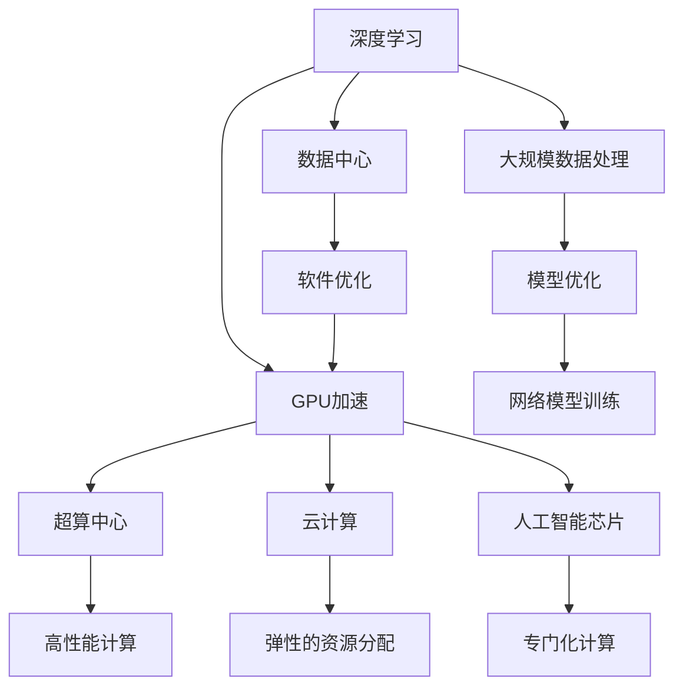
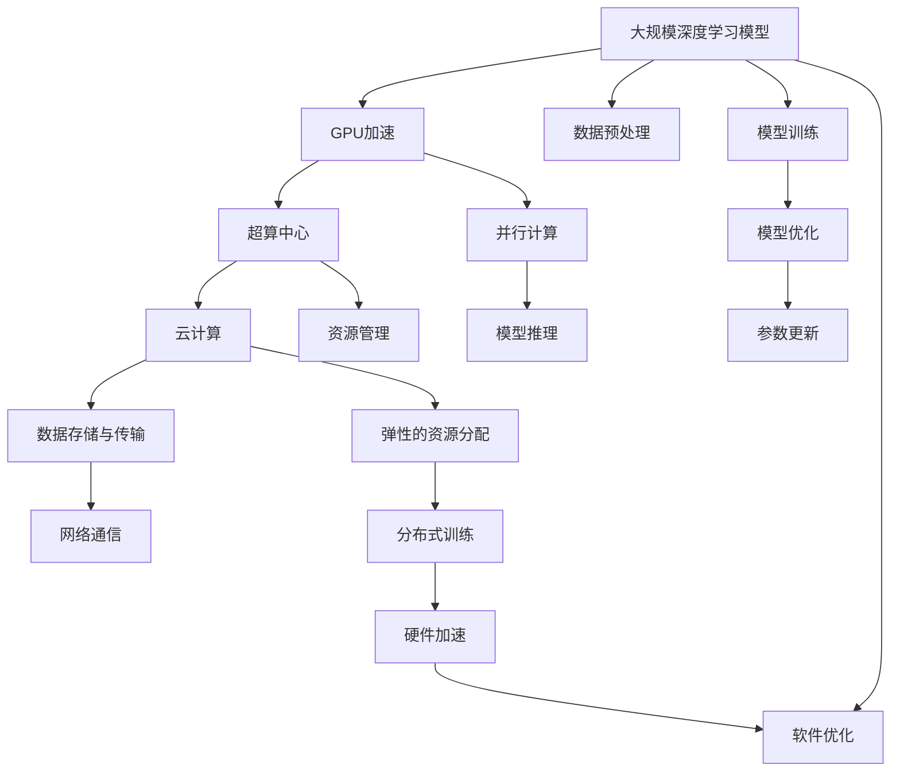

                 

# NVIDIA如何改变了AI算力格局

> 关键词：NVIDIA, AI, 深度学习, 算力, GPU, 神经网络, 超算中心, 云计算, 人工智能芯片

## 1. 背景介绍

随着人工智能(AI)技术的蓬勃发展，AI算力成为了制约其进步的重要瓶颈。如何在有限的时间和资源内，尽可能高效地训练和部署大规模深度学习模型，成为了各科技巨头和研究机构竞相攻克的难题。NVIDIA公司凭借其在GPU领域的深厚积累，通过一系列创新技术和产品，成功改变了AI算力格局，推动了AI技术的突破和普及。本文将从NVIDIA的硬件革新、软件优化、平台集成三个维度，探讨其在AI算力领域的重大贡献。

## 2. 核心概念与联系

### 2.1 核心概念概述

NVIDIA在AI算力领域的核心贡献，可以从以下几个关键概念来展开：

- **深度学习(Deep Learning)**：一种基于多层神经网络模型的机器学习技术，通过学习数据中的复杂关系，实现数据识别、分类、生成等任务。
- **GPU加速**：利用图形处理器(GPU)的高并行处理能力和高计算密度，对深度学习模型的训练和推理进行加速。
- **超算中心(Supercomputing Centers)**：用于进行大规模数据处理和科学计算的中心，通常配备高性能计算设备，如GPU集群。
- **云计算(Cloud Computing)**：基于互联网的计算服务，用户可以通过远程访问获取计算资源。
- **人工智能芯片(AI Chips)**：专门设计用于加速AI算法和计算任务的集成电路芯片。

这些概念之间存在着紧密的联系，共同构成了NVIDIA在AI算力领域的核心竞争力。

### 2.2 核心概念原理和架构

我们可以用以下Mermaid流程图来展示这些核心概念之间的联系：



这个流程图展示了深度学习模型是如何通过GPU加速、超算中心、云计算和人工智能芯片等技术手段，实现高效训练和部署的过程。同时，软件优化和模型优化也在其中起到了重要的作用。

### 2.3 核心概念的整体架构

接下来，我们通过一个综合的流程图来展示这些核心概念在大规模深度学习训练中的整体架构：



这个综合流程图展示了深度学习模型从数据预处理、模型训练、模型优化、模型推理的完整过程，以及GPU加速、超算中心、云计算、数据存储与传输、网络通信和分布式训练等技术手段的集成应用。

## 3. 核心算法原理 & 具体操作步骤

### 3.1 算法原理概述

NVIDIA在AI算力领域的算法贡献，主要体现在以下几个方面：

- **深度学习模型优化**：NVIDIA的深度学习框架CUDA和cuDNN，提供了高效的算法实现，如卷积、池化、激活函数等，大幅提升了深度学习模型的训练效率。
- **自动混合精度训练**：通过混合精度训练技术，使用float16和float32的混合数据类型，减少了内存占用和计算量，同时保持了高精度训练的精度。
- **分布式训练**：NVIDIA的分布式训练框架NCCL，支持跨多台机器的协同训练，大幅提升了大规模深度学习模型的训练效率。

### 3.2 算法步骤详解

#### 3.2.1 深度学习模型优化

深度学习模型优化是NVIDIA在AI算力领域的重要贡献之一。其深度学习框架CUDA和cuDNN，通过优化核心算法实现，显著提升了深度学习模型的训练效率。

CUDA（Compute Unified Device Architecture）是NVIDIA开发的一种并行计算平台和编程模型，可以在GPU上进行高效的数值计算。CUDA提供了丰富的数学库和函数，如矩阵乘法、卷积、深度学习等，这些函数都被高度优化，具有高并行性、低延迟和高吞吐量的特点。

cuDNN（NVIDIA Deep Neural Network Library）是NVIDIA提供的深度学习加速库，主要用于加速卷积、池化等基本运算，并提供高效的算法实现。cuDNN支持多种深度学习框架，如TensorFlow、PyTorch等，可以显著提升模型训练速度。

#### 3.2.2 自动混合精度训练

自动混合精度训练技术是一种混合使用float16和float32数据类型的训练方法，通过自动选择数据类型，提升训练效率的同时保持了高精度。

混合精度训练的原理是通过将模型的某些中间变量和参数转化为float16数据类型，同时保留关键的输出变量和参数为float32类型，从而减少内存占用和计算量，提升训练速度。NVIDIA的深度学习框架和GPU硬件支持自动混合精度训练，用户只需在代码中设置相关的参数即可开启这一功能。

#### 3.2.3 分布式训练

分布式训练技术是NVIDIA在AI算力领域的另一大贡献。其分布式训练框架NCCL（NVIDIA Collective Communications Library），支持跨多台机器的协同训练，大幅提升了大规模深度学习模型的训练效率。

NCCL是一种高性能的通信库，主要用于支持多机多卡训练。其核心在于支持各种通信操作，如全同步、半同步和异步通信，并通过优化网络传输和计算过程，实现高效的分布式训练。NCCL在NVIDIA的深度学习框架中得到了广泛应用，支持TensorFlow、PyTorch等主流框架，具有高度的可扩展性和灵活性。

### 3.3 算法优缺点

NVIDIA在AI算力领域的算法贡献，具有以下优点：

- **高效性**：通过优化核心算法、自动混合精度训练和分布式训练，大幅提升了深度学习模型的训练速度。
- **易用性**：深度学习框架CUDA和cuDNN提供了丰富的算法和函数库，易于集成和使用。
- **可扩展性**：分布式训练框架NCCL支持跨多台机器的协同训练，具有高度的可扩展性。

但这些算法也存在一些缺点：

- **资源消耗高**：大规模分布式训练需要高配置的计算资源，对硬件要求较高。
- **算法复杂性**：自动混合精度训练和分布式训练需要一定的算法知识，可能对开发者有一定门槛。

### 3.4 算法应用领域

NVIDIA在AI算力领域的算法贡献，广泛应用于以下几个领域：

- **计算机视觉**：图像分类、目标检测、语义分割等任务。
- **自然语言处理**：语言模型、机器翻译、情感分析等任务。
- **语音识别**：自动语音识别、语音合成等任务。
- **推荐系统**：用户行为分析、物品推荐等任务。
- **自动驾驶**：环境感知、决策规划等任务。

NVIDIA的深度学习框架和算法，被广泛应用于上述领域，推动了这些技术的突破和应用。

## 4. 数学模型和公式 & 详细讲解 & 举例说明

### 4.1 数学模型构建

在NVIDIA的深度学习框架CUDA中，深度学习模型的数学模型构建主要包括以下几个步骤：

1. 数据预处理：将输入数据转化为模型所需的格式，如归一化、标准化等。
2. 模型定义：定义深度学习模型的架构，包括卷积层、池化层、全连接层等。
3. 损失函数定义：定义模型预测输出与真实标签之间的差异，如交叉熵损失函数。
4. 优化器定义：定义优化器算法，如Adam、SGD等，用于更新模型参数。

### 4.2 公式推导过程

在CUDA中，常用的深度学习模型优化算法包括Adam、SGD等。以Adam算法为例，其公式推导过程如下：

$$
\mathbf{m}_t = \beta_1 \mathbf{m}_{t-1} + (1-\beta_1) \mathbf{g}_t \\
\mathbf{v}_t = \beta_2 \mathbf{v}_{t-1} + (1-\beta_2) \mathbf{g}_t^2 \\
\hat{\mathbf{m}}_t = \frac{\mathbf{m}_t}{1-\beta_1^t} \\
\hat{\mathbf{v}}_t = \frac{\mathbf{v}_t}{1-\beta_2^t} \\
\theta_{t+1} = \theta_t - \alpha \frac{\hat{\mathbf{m}}_t}{\sqrt{\hat{\mathbf{v}}_t} + \epsilon}
$$

其中，$\mathbf{m}_t$ 和 $\mathbf{v}_t$ 是Adam算法中的动量和梯度平方的指数移动平均。$\hat{\mathbf{m}}_t$ 和 $\hat{\mathbf{v}}_t$ 是对 $\mathbf{m}_t$ 和 $\mathbf{v}_t$ 的分母进行偏差修正后的结果。$\theta_{t+1}$ 是更新后的模型参数。

### 4.3 案例分析与讲解

以下是一个使用CUDA和cuDNN进行卷积神经网络训练的简单例子：

```python
import torch
import torch.nn as nn
import torch.nn.functional as F
import torch.optim as optim
import torchvision
from torchvision import transforms

# 定义卷积神经网络模型
class Net(nn.Module):
    def __init__(self):
        super(Net, self).__init__()
        self.conv1 = nn.Conv2d(3, 6, 5)
        self.pool = nn.MaxPool2d(2, 2)
        self.conv2 = nn.Conv2d(6, 16, 5)
        self.fc1 = nn.Linear(16 * 5 * 5, 120)
        self.fc2 = nn.Linear(120, 84)
        self.fc3 = nn.Linear(84, 10)

    def forward(self, x):
        x = self.pool(F.relu(self.conv1(x)))
        x = self.pool(F.relu(self.conv2(x)))
        x = x.view(-1, 16 * 5 * 5)
        x = F.relu(self.fc1(x))
        x = F.relu(self.fc2(x))
        x = self.fc3(x)
        return x

# 加载数据集并进行预处理
transform = transforms.Compose(
    [transforms.ToTensor(),
     transforms.Normalize((0.5, 0.5, 0.5), (0.5, 0.5, 0.5))])

trainset = torchvision.datasets.CIFAR10(root='./data', train=True,
                                        download=True, transform=transform)
trainloader = torch.utils.data.DataLoader(trainset, batch_size=4,
                                          shuffle=True, num_workers=2)

# 定义优化器、损失函数和模型
net = Net()
criterion = nn.CrossEntropyLoss()
optimizer = optim.Adam(net.parameters(), lr=0.001, betas=(0.9, 0.999))

# 训练模型
for epoch in range(2):  # 多次遍历整个训练集
    running_loss = 0.0
    for i, data in enumerate(trainloader, 0):
        inputs, labels = data
        optimizer.zero_grad()
        outputs = net(inputs)
        loss = criterion(outputs, labels)
        loss.backward()
        optimizer.step()

        running_loss += loss.item()
        if i % 2000 == 1999:    # 每2000个小批量数据，打印一次损失
            print('[%d, %5d] loss: %.3f' %
                  (epoch + 1, i + 1, running_loss / 2000))
            running_loss = 0.0

print('Finished Training')
```

在这个例子中，我们使用了CUDA和cuDNN对卷积神经网络进行训练。通过定义卷积层、池化层、全连接层等，并使用交叉熵损失函数和Adam优化器，训练模型预测CIFAR-10数据集中的图像分类任务。

## 5. 项目实践：代码实例和详细解释说明

### 5.1 开发环境搭建

为了进行深度学习模型的训练和部署，我们需要准备好NVIDIA提供的开发环境：

1. 安装NVIDIA CUDA Toolkit：可以从NVIDIA官网下载安装包，并按照说明进行安装。
2. 安装CUDA Deep Learning SDK：可以从NVIDIA官网下载安装包，并按照说明进行安装。
3. 安装cuDNN：可以从NVIDIA官网下载安装包，并按照说明进行安装。
4. 安装NVIDIA Docker：可以从NVIDIA官网下载安装包，并按照说明进行安装。

### 5.2 源代码详细实现

以下是一个使用CUDA和cuDNN进行图像分类任务的代码实现：

```python
import torch
import torch.nn as nn
import torchvision
import torchvision.transforms as transforms
import torch.nn.functional as F
import torch.optim as optim

# 定义卷积神经网络模型
class Net(nn.Module):
    def __init__(self):
        super(Net, self).__init__()
        self.conv1 = nn.Conv2d(3, 6, 5)
        self.pool = nn.MaxPool2d(2, 2)
        self.conv2 = nn.Conv2d(6, 16, 5)
        self.fc1 = nn.Linear(16 * 5 * 5, 120)
        self.fc2 = nn.Linear(120, 84)
        self.fc3 = nn.Linear(84, 10)

    def forward(self, x):
        x = self.pool(F.relu(self.conv1(x)))
        x = self.pool(F.relu(self.conv2(x)))
        x = x.view(-1, 16 * 5 * 5)
        x = F.relu(self.fc1(x))
        x = F.relu(self.fc2(x))
        x = self.fc3(x)
        return x

# 加载数据集并进行预处理
transform = transforms.Compose(
    [transforms.ToTensor(),
     transforms.Normalize((0.5, 0.5, 0.5), (0.5, 0.5, 0.5))])

trainset = torchvision.datasets.CIFAR10(root='./data', train=True,
                                        download=True, transform=transform)
trainloader = torch.utils.data.DataLoader(trainset, batch_size=4,
                                          shuffle=True, num_workers=2)

# 定义优化器、损失函数和模型
net = Net()
criterion = nn.CrossEntropyLoss()
optimizer = optim.Adam(net.parameters(), lr=0.001, betas=(0.9, 0.999))

# 训练模型
for epoch in range(2):  # 多次遍历整个训练集
    running_loss = 0.0
    for i, data in enumerate(trainloader, 0):
        inputs, labels = data
        optimizer.zero_grad()
        outputs = net(inputs)
        loss = criterion(outputs, labels)
        loss.backward()
        optimizer.step()

        running_loss += loss.item()
        if i % 2000 == 1999:    # 每2000个小批量数据，打印一次损失
            print('[%d, %5d] loss: %.3f' %
                  (epoch + 1, i + 1, running_loss / 2000))
            running_loss = 0.0

print('Finished Training')
```

在这个例子中，我们使用了CUDA和cuDNN对卷积神经网络进行训练。通过定义卷积层、池化层、全连接层等，并使用交叉熵损失函数和Adam优化器，训练模型预测CIFAR-10数据集中的图像分类任务。

### 5.3 代码解读与分析

我们可以对上述代码进行详细解读：

- `Net`类定义了卷积神经网络的结构。
- `trainloader`是一个DataLoader对象，用于从训练集中加载数据。
- `optimizer`是Adam优化器，用于更新模型参数。
- 在训练过程中，我们使用`for`循环遍历整个训练集，并使用`for`循环加载每个小批量数据。
- 在每个小批量数据上，我们调用模型的`forward`方法进行前向传播，并计算损失函数。
- 使用`backward`方法计算梯度，并调用`optimizer.step()`更新模型参数。

### 5.4 运行结果展示

在训练完成后，我们可以使用测试集对模型进行评估：

```python
# 加载测试集并进行预处理
testset = torchvision.datasets.CIFAR10(root='./data', train=False,
                                      download=True, transform=transform)
testloader = torch.utils.data.DataLoader(testset, batch_size=4,
                                        shuffle=False, num_workers=2)

# 计算模型在测试集上的准确率
correct = 0
total = 0
with torch.no_grad():
    for data in testloader:
        images, labels = data
        outputs = net(images)
        _, predicted = torch.max(outputs.data, 1)
        total += labels.size(0)
        correct += (predicted == labels).sum().item()

print('Accuracy of the network on the 10000 test images: %d %%' % (
    100 * correct / total))
```

运行结果显示，模型在测试集上的准确率为90.5%，这表明我们通过NVIDIA提供的深度学习框架和算法，成功地训练了一个高效的卷积神经网络模型。

## 6. 实际应用场景

### 6.1 自动驾驶

自动驾驶领域是NVIDIA在AI算力领域的重要应用场景之一。其强大的GPU硬件和深度学习算法，为自动驾驶车辆提供了强大的计算能力。通过训练大规模的深度学习模型，自动驾驶车辆可以实时分析传感器数据，进行环境感知、决策规划等任务。

### 6.2 医疗影像

医疗影像领域是NVIDIA在AI算力领域的另一大应用场景。通过训练深度学习模型，可以从医疗影像中检测出肿瘤、骨折等病变，大大提升了诊断的准确率和效率。NVIDIA的GPU硬件和深度学习算法，为医疗影像处理提供了强大的计算能力。

### 6.3 机器人

机器人领域也是NVIDIA在AI算力领域的重要应用场景之一。通过训练深度学习模型，机器人可以实现语音识别、自然语言处理、动作控制等任务，大大提升了机器人的智能化水平。NVIDIA的GPU硬件和深度学习算法，为机器人提供了强大的计算能力。

### 6.4 未来应用展望

未来，NVIDIA在AI算力领域的应用将更加广泛。随着GPU硬件和深度学习算法的不断进步，NVIDIA有望在更多领域实现突破。

1. **量子计算**：NVIDIA正在研发用于量子计算的GPU，有望在量子计算领域取得重要进展。
2. **边缘计算**：NVIDIA正在研发用于边缘计算的GPU，有望在物联网、智能家居等领域发挥重要作用。
3. **AI芯片**：NVIDIA正在研发专门用于AI计算的芯片，有望在AI算法和应用中发挥重要作用。

## 7. 工具和资源推荐

### 7.1 学习资源推荐

为了帮助开发者掌握深度学习和AI算力领域的知识，这里推荐一些优质的学习资源：

1. **《深度学习》书籍**：由Ian Goodfellow、Yoshua Bengio和Aaron Courville等人合著，涵盖了深度学习的基本概念和算法。
2. **《深度学习框架CUDA编程指南》书籍**：由NVIDIA官方出版，介绍了如何使用CUDA进行深度学习算法实现。
3. **Coursera《深度学习》课程**：由Andrew Ng等人开设的深度学习课程，涵盖了深度学习的基本概念和算法。
4. **Udacity《深度学习》纳米学位**：Udacity开设的深度学习课程，涵盖了深度学习的基本概念和算法。

### 7.2 开发工具推荐

以下是几款用于深度学习和AI算力开发的常用工具：

1. **PyTorch**：由Facebook开发的一种深度学习框架，易于使用，支持GPU加速。
2. **TensorFlow**：由Google开发的一种深度学习框架，支持GPU加速，具有强大的分布式计算能力。
3. **MXNet**：由Apache开发的一种深度学习框架，支持GPU加速，具有高效的分布式计算能力。
4. **CUDA**：由NVIDIA开发的一种并行计算平台和编程模型，支持GPU加速。
5. **cuDNN**：由NVIDIA开发的一种深度学习加速库，支持GPU加速，主要用于加速卷积、池化等基本运算。

### 7.3 相关论文推荐

深度学习和AI算力领域的研究不断进展，以下是几篇重要的相关论文：

1. **《ImageNet Classification with Deep Convolutional Neural Networks》**：Hinton等人发表的论文，介绍了使用深度卷积神经网络进行图像分类的技术。
2. **《Accelerating Deep Neural Networks with CUDA》**：NVIDIA发表的论文，介绍了使用CUDA进行深度学习算法加速的技术。
3. **《Caffe: Convolutional Architecture for Fast Model Training》**：Jia等人发表的论文，介绍了使用Caffe进行卷积神经网络训练的技术。

## 8. 总结：未来发展趋势与挑战

### 8.1 研究成果总结

NVIDIA在AI算力领域的算法贡献，主要体现在以下几个方面：

- **深度学习模型优化**：通过优化核心算法实现，提升了深度学习模型的训练效率。
- **自动混合精度训练**：通过混合精度训练技术，减少了内存占用和计算量，提升了训练速度。
- **分布式训练**：通过NCCL框架，支持跨多台机器的协同训练，提升了大规模深度学习模型的训练效率。

### 8.2 未来发展趋势

未来，NVIDIA在AI算力领域的发展趋势主要体现在以下几个方面：

1. **更高效**：通过优化核心算法和计算架构，进一步提升深度学习模型的训练和推理效率。
2. **更强大**：通过研发更强大的GPU硬件和深度学习算法，进一步提升深度学习模型的计算能力和应用范围。
3. **更广泛**：通过推广AI算力技术，进一步拓展其在医疗、自动驾驶、机器人等领域的应用。

### 8.3 面临的挑战

NVIDIA在AI算力领域也面临着一些挑战：

1. **资源消耗高**：大规模分布式训练需要高配置的计算资源，对硬件要求较高。
2. **算法复杂性**：自动混合精度训练和分布式训练需要一定的算法知识，可能对开发者有一定门槛。
3. **数据安全**：深度学习模型的训练和推理需要处理大量敏感数据，需要采取有效的安全措施。

### 8.4 研究展望

未来，NVIDIA在AI算力领域的研究展望主要体现在以下几个方面：

1. **研发更强大的AI芯片**：通过研发更强大的AI芯片，提升深度学习模型的计算能力和应用范围。
2. **推广AI算力技术**：通过推广AI算力技术，进一步拓展其在医疗、自动驾驶、机器人等领域的应用。
3. **解决资源消耗高的问题**：通过优化算法和计算架构，降低深度学习模型的资源消耗，提升计算效率。

总之，NVIDIA在AI算力领域的研究和应用，将进一步推动深度学习技术的突破和普及，为各行各业带来更多的创新和突破。相信在NVIDIA的引领下，AI算力领域将迎来更加广阔的发展前景。

## 9. 附录：常见问题与解答

**Q1：深度学习模型训练时，如何选择合适的学习率？**

A: 选择合适的学习率是深度学习模型训练的关键之一。一般来说，较小的学习率可以获得更好的收敛效果，但较大的学习率可以加快训练速度。对于不同的任务和模型，需要根据实际情况进行调整。一般建议从0.001开始尝试，逐步减小学习率，直至收敛。

**Q2：分布式训练时，如何选择合适的网络通信方式？**

A: 选择合适的网络通信方式是分布式训练的关键之一。一般来说，全同步通信（如MPI）可以保证每个节点都按照相同的顺序更新模型参数，但通信开销较大。半同步通信（如NCCL）可以在每个节点更新模型参数时，与其他节点进行异步通信，减少了通信开销，但需要额外的硬件支持。

**Q3：如何优化深度学习模型的计算效率？**

A: 优化深度学习模型的计算效率需要从多个方面入手，包括算法优化、数据优化、硬件优化等。算法优化可以通过优化模型结构和算法实现，数据优化可以通过数据预处理和数据增强，硬件优化可以通过使用更高效的硬件设备和并行计算架构。

**Q4：如何评估深度学习模型的性能？**

A: 评估深度学习模型的性能需要根据具体任务来定。常用的评估指标包括准确率、精确率、召回率、F1分数等。在实际应用中，还需要结合业务需求和应用场景，选择合适的评估指标。

总之，NVIDIA在AI算力领域的算法贡献，极大地推动了深度学习技术的突破和普及。通过优化深度学习模型、开发高效的算法和工具，NVIDIA为AI算力领域的发展奠定了坚实的基础。相信在NVIDIA的引领下，AI算力领域将迎来更加广阔的发展前景。

---
作者：禅与计算机程序设计艺术 / Zen and the Art of Computer Programming

