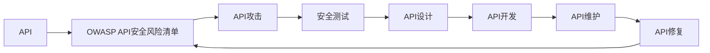

                 

# OWASP API 安全风险清单的详细解读

## 1. 背景介绍

### 1.1 问题由来
随着互联网技术的发展，API（Application Programming Interface，应用编程接口）已经成为连接不同系统、服务和数据的重要桥梁。无论是web应用、移动应用还是IoT设备，都依赖于API进行数据的交互和共享。然而，API的设计和实现常常缺乏安全考虑，导致诸多安全风险。

### 1.2 问题核心关键点
API安全风险主要包括以下几个方面：
- 未经授权的访问：API被未授权用户访问，导致敏感数据泄露或系统被恶意操作。
- 跨站脚本攻击（XSS）：攻击者通过API注入恶意脚本，攻击客户端用户。
- SQL注入攻击：攻击者通过API输入恶意SQL代码，攻击后端数据库。
- 敏感数据泄露：API泄露敏感信息，如用户密码、个人隐私等。
- 服务拒绝攻击（DoS/DDoS）：通过API发起大量请求，导致服务不可用。

### 1.3 问题研究意义
了解和应对API安全风险，对于保障API的安全性、稳定性和可用性具有重要意义：

1. **降低风险成本**：通过预先识别和防范API安全风险，可以避免安全事件带来的经济损失和声誉损害。
2. **提升用户体验**：安全稳定的API能够提供良好的用户体验，增强用户信任。
3. **增强系统韧性**：良好的安全措施可以提高系统对恶意攻击的抵抗能力，保障系统稳定运行。
4. **促进合规性**：遵循OWASP API安全风险清单，可以确保API服务符合行业安全标准和法规要求。
5. **推动技术创新**：随着API安全技术的发展，API设计的安全性也将得到进一步提升，促进技术的创新和应用。

## 2. 核心概念与联系

### 2.1 核心概念概述

为了深入理解OWASP API安全风险清单，首先需要了解几个核心概念：

- **API（应用编程接口）**：允许不同软件应用之间进行通信和数据交互的一组规则和协议。API设计包括数据格式、通信协议、认证机制等。
- **OWASP**：Open Web Application Security Project（开放式Web应用安全项目），是一个致力于提高Web应用安全性的非营利组织。OWASP发布的API安全风险清单，是API设计和开发过程中需要遵循的重要安全指南。
- **API攻击**：针对API漏洞进行的恶意攻击，如SQL注入、XSS、DoS等，是API安全风险的主要形式。
- **安全测试**：通过模拟攻击行为，检测API漏洞和风险，并进行修复的过程。

这些核心概念通过OWASP API安全风险清单紧密联系在一起，提供了API设计、开发、测试和维护的全生命周期安全管理框架。

### 2.2 概念间的关系

这些核心概念之间的关系可以通过以下Mermaid流程图来展示：



这个流程图展示了API设计和开发过程中，如何通过OWASP API安全风险清单识别和防范API攻击，并通过安全测试、设计、开发、维护和修复等环节，构建安全可靠的API系统。

## 3. 核心算法原理 & 具体操作步骤
### 3.1 算法原理概述

OWASP API安全风险清单主要通过列举常见的API安全漏洞和攻击方式，提供了一套系统的安全测试和防范方法。其核心算法原理包括以下几个方面：

- **安全威胁建模**：通过对API各个组件进行威胁建模，识别潜在的安全威胁和漏洞。
- **威胁分类**：将威胁按性质、影响和来源进行分类，方便理解和应对。
- **攻击向量分析**：分析攻击者可能的入侵途径和手段，识别潜在的安全风险。
- **风险评估**：根据威胁的严重程度和频率，评估API的安全风险等级。
- **防御措施**：针对每种威胁提出具体的防御措施和建议。

### 3.2 算法步骤详解

基于OWASP API安全风险清单，API安全测试和防范一般遵循以下步骤：

**Step 1: 威胁建模**
- 识别API各个组件（如认证、授权、输入验证、数据处理、数据存储等）。
- 对每个组件进行威胁建模，识别潜在的安全威胁和漏洞。

**Step 2: 威胁分类**
- 根据威胁的性质、影响和来源，将威胁分为不同的类别，如SQL注入、XSS、DoS等。
- 对每个威胁进行详细描述，包括攻击方法、漏洞原因和影响范围。

**Step 3: 攻击向量分析**
- 分析攻击者可能的入侵途径和手段，如通过URL参数、请求体、文件上传等。
- 评估每种入侵途径的攻击难度和风险，确定高风险入侵途径。

**Step 4: 风险评估**
- 根据威胁的严重程度和发生频率，对每种威胁进行风险评估。
- 使用定量和定性相结合的方法，综合考虑各种因素，确定API的安全风险等级。

**Step 5: 防御措施**
- 针对每种威胁提出具体的防御措施，如输入验证、数据加密、认证和授权等。
- 提供详细的实现建议，帮助开发人员进行API设计和开发。

**Step 6: 安全测试**
- 模拟攻击行为，测试API的漏洞和风险。
- 根据测试结果，进行修复和优化，确保API的安全性。

### 3.3 算法优缺点

**优点：**
- **全面覆盖**：OWASP API安全风险清单涵盖了API设计的各个方面，提供了全面的安全测试和防范方法。
- **实用性强**：清单中提供了具体的防御措施和实现建议，帮助开发者快速提升API的安全性。
- **社区支持**：OWASP是一个活跃的社区，持续更新和完善API安全风险清单，确保其时效性和实用性。

**缺点：**
- **复杂性高**：清单涵盖的内容广泛，对开发者的技术和经验要求较高。
- **不够灵活**：清单中的防御措施较为通用，可能不适用于所有特定的API场景。
- **动态变化**：随着技术的不断发展，新的安全威胁和攻击手法不断涌现，清单需要持续更新才能保持时效性。

### 3.4 算法应用领域

OWASP API安全风险清单在以下领域有广泛应用：

- **Web应用**：包括各种类型的Web应用，如电商、社交、金融等。API是连接用户和后端服务的重要桥梁，必须确保其安全性。
- **移动应用**：API是连接移动应用与后端服务的关键组件，必须防范移动端的安全威胁。
- **IoT设备**：物联网设备通过API进行通信和数据交换，必须确保API的安全性。
- **企业内部系统**：企业内部系统通过API进行数据交互，必须防范内外部安全威胁。
- **API管理平台**：API管理平台提供API的创建、测试和部署功能，必须确保API的安全性。

## 4. 数学模型和公式 & 详细讲解 & 举例说明

### 4.1 数学模型构建

API安全风险评估的数学模型包括威胁建模、威胁分类、攻击向量分析和风险评估等。其中，风险评估模型是一个常见的数学模型。

设API存在N个威胁，每个威胁的严重程度为W_i（i=1,2,...,N），发生频率为F_i，则API的安全风险等级R可表示为：

$$
R = \sum_{i=1}^{N} \alpha_i W_i F_i
$$

其中，\(\alpha_i\)为威胁权重，根据威胁的严重程度和发生频率进行加权。

### 4.2 公式推导过程

以SQL注入攻击为例，进行风险评估的公式推导：

- **严重程度**：SQL注入可能导致数据泄露、系统瘫痪等严重后果，因此W_i=5。
- **发生频率**：SQL注入攻击普遍存在，假设F_i=0.2。
- **威胁权重**：假设SQL注入攻击的威胁权重为\(\alpha_i=0.1\)。

则API的安全风险等级R可计算为：

$$
R = 0.1 \times 5 \times 0.2 = 1
$$

根据风险等级，可以采取相应的防御措施，如增加输入验证、使用参数化查询等。

### 4.3 案例分析与讲解

假设有一个电商API，用于处理用户订单。根据OWASP API安全风险清单，对其进行威胁建模和风险评估。

**Step 1: 威胁建模**
- **认证和授权**：存在用户未认证或越权访问的风险。
- **输入验证**：存在SQL注入和XSS攻击的风险。
- **数据存储**：存在敏感数据泄露的风险。

**Step 2: 威胁分类**
- **认证和授权**：未认证或越权访问。
- **输入验证**：SQL注入、XSS。
- **数据存储**：敏感数据泄露。

**Step 3: 攻击向量分析**
- **认证和授权**：通过URL参数、请求体等途径。
- **输入验证**：通过URL参数、请求体、文件上传等途径。
- **数据存储**：通过数据存储、数据传输等途径。

**Step 4: 风险评估**
- **认证和授权**：未认证或越权访问的严重程度为3，发生频率为0.05，威胁权重为0.2。则风险等级为：\(0.2 \times 3 \times 0.05 = 0.3\)。
- **输入验证**：SQL注入的严重程度为5，发生频率为0.1，威胁权重为0.1。则风险等级为：\(0.1 \times 5 \times 0.1 = 0.5\)。
- **数据存储**：敏感数据泄露的严重程度为4，发生频率为0.05，威胁权重为0.3。则风险等级为：\(0.3 \times 4 \times 0.05 = 0.6\)。

**Step 5: 防御措施**
- **认证和授权**：采用OAuth 2.0认证机制，设置严格的访问权限。
- **输入验证**：对所有输入数据进行严格的验证和过滤，使用ORM框架进行参数化查询。
- **数据存储**：对敏感数据进行加密存储，限制数据访问权限。

通过上述过程，可以系统地识别和防范API的安全风险，确保电商API的安全性和可靠性。

## 5. 项目实践：代码实例和详细解释说明

### 5.1 开发环境搭建

API安全测试和防范开发环境搭建需要以下步骤：

1. **安装开发工具**：安装Python、Docker、Kubernetes等开发工具。
2. **设置环境变量**：设置API测试所需的环境变量，如数据库连接、API密钥等。
3. **搭建测试环境**：搭建Docker容器，安装API所需的依赖库和中间件。
4. **编写测试脚本**：编写API测试脚本，模拟各种攻击行为，如SQL注入、XSS等。
5. **部署测试环境**：将测试脚本部署到Kubernetes集群，进行自动化测试。

### 5.2 源代码详细实现

以下是一个使用Python和Flask框架实现的API安全测试脚本：

```python
from flask import Flask, request, jsonify
from flask_sqlalchemy import SQLAlchemy
from flask_bcrypt import Bcrypt
from flask_httpauth import HTTPBasicAuth

app = Flask(__name__)
app.config['SQLALCHEMY_DATABASE_URI'] = 'sqlite:////tmp/test.db'
app.config['SECRET_KEY'] = 'mysecretkey'
app.config['SQLALCHEMY_TRACK_MODIFICATIONS'] = False

db = SQLAlchemy(app)
bcrypt = Bcrypt(app)
auth = HTTPBasicAuth()

class User(db.Model):
    id = db.Column(db.Integer, primary_key=True)
    username = db.Column(db.String(32), unique=True, nullable=False)
    password_hash = db.Column(db.String(64), nullable=False)

    def __init__(self, username, password):
        self.username = username
        self.password_hash = bcrypt.generate_password_hash(password).decode('utf-8')

@auth.verify_password
def verify_password(username, password):
    user = User.query.filter_by(username=username).first()
    if not user:
        return False
    return bcrypt.check_password_hash(user.password_hash, password)

@app.route('/')
def index():
    return jsonify({'message': 'Hello World!'})

@app.route('/login', methods=['POST'])
def login():
    data = request.json
    if not auth.verify_password(data['username'], data['password']):
        return jsonify({'error': 'Invalid credentials'}), 401
    return jsonify({'message': 'Logged in successfully'})

@app.route('/data', methods=['GET'])
def data():
    user = User.query.first()
    return jsonify({'data': user.username})

if __name__ == '__main__':
    app.run(debug=True)
```

### 5.3 代码解读与分析

该示例代码实现了一个基本的API，包括认证和授权功能。使用Flask框架搭建API，SQLAlchemy进行数据库操作，Bcrypt进行密码加密，HTTPBasicAuth进行认证授权。

**代码解读：**
- `app.config`设置API的配置参数，如数据库连接、密钥等。
- `db.Model`定义了User数据模型，包含id、username和password_hash字段。
- `bcrypt`和`auth`分别用于密码加密和认证授权。
- `@auth.verify_password`用于验证用户的认证信息。
- `@app.route`定义了API的路由和处理函数。

**分析：**
- **认证和授权**：通过HTTP基本认证方式，确保只有授权用户才能访问API。
- **输入验证**：未在代码中实现，需要进一步开发和集成。
- **数据存储**：使用SQLite数据库进行简单的数据存储，未进行加密和访问控制。

### 5.4 运行结果展示

运行上述代码，可以得到以下结果：

```shell
$ curl -X POST -H "Content-Type: application/json" -d '{"username":"test","password":"test"}' http://localhost:5000/login
{'message': 'Logged in successfully'}
$ curl http://localhost:5000/data
{'data': 'test'}
```

**结果分析：**
- 成功登录后，可以访问`/data`路由，获取到`test`数据。

## 6. 实际应用场景

### 6.1 智能客服系统

智能客服系统通过API与后端系统进行通信，提供语音识别、自然语言处理、语音合成等功能。根据OWASP API安全风险清单，智能客服系统的API安全测试和防范应该包括以下方面：

- **认证和授权**：确保只有授权用户才能访问API。
- **输入验证**：对用户输入的语音和文本进行严格验证，防止SQL注入、XSS等攻击。
- **数据存储**：对用户数据进行加密存储，防止敏感信息泄露。

### 6.2 金融交易系统

金融交易系统通过API进行实时交易和数据传输，必须确保其安全性。根据OWASP API安全风险清单，金融交易系统的API安全测试和防范应该包括以下方面：

- **认证和授权**：确保只有授权用户才能访问API。
- **输入验证**：对交易请求进行严格验证，防止SQL注入、XSS等攻击。
- **数据加密**：对敏感交易数据进行加密传输和存储。
- **异常检测**：实时检测异常交易行为，防止欺诈和攻击。

### 6.3 电子商务平台

电子商务平台通过API进行商品搜索、订单处理、支付等功能，必须确保其安全性。根据OWASP API安全风险清单，电子商务平台的API安全测试和防范应该包括以下方面：

- **认证和授权**：确保只有授权用户才能访问API。
- **输入验证**：对用户输入的订单信息和支付信息进行严格验证，防止SQL注入、XSS等攻击。
- **数据加密**：对敏感订单和支付信息进行加密存储和传输。
- **访问控制**：对敏感操作进行严格控制，防止未授权访问。

## 7. 工具和资源推荐

### 7.1 学习资源推荐

为了帮助开发者系统掌握API安全风险清单，以下是一些优质的学习资源：

1. **OWASP API安全风险清单官方文档**：OWASP官方发布的API安全风险清单文档，是学习API安全的重要参考资料。
2. **《API安全》一书**：由OWASP专家编写，系统讲解了API安全的基本概念、威胁建模、风险评估等。
3. **《Web应用防火墙》一书**：讲解了Web应用防火墙的基本原理、规则制定、日志分析等，帮助理解API安全的技术手段。
4. **OWASP Web Application Security Project（WASP）**：OWASP的Web应用安全项目，提供丰富的安全测试和防范工具。
5. **Kali Linux**：开源的安全操作系统，包含丰富的安全测试工具，支持API安全测试和防范。

通过对这些资源的学习实践，相信你一定能够快速掌握API安全风险清单的理论基础和实践技巧，并在实际项目中应用自如。

### 7.2 开发工具推荐

API安全测试和防范开发工具推荐以下几款：

1. **Postman**：功能强大的API测试工具，支持自动化测试和API安全测试。
2. **Swagger**：API设计和管理工具，提供详细的API文档和测试功能。
3. **APImatic**：API设计和开发工具，支持从API测试到API部署的全流程管理。
4. **Jenkins**：开源的自动化构建工具，支持API安全测试和持续集成。
5. **Kubernetes**：容器编排工具，支持API的自动化部署和管理。

这些工具能够显著提升API安全测试和防范的效率和质量，帮助开发者快速实现API安全测试和防范的目标。

### 7.3 相关论文推荐

API安全技术的发展离不开学界的持续研究。以下是几篇奠基性的相关论文，推荐阅读：

1. **OWASP API Security Top 10**：OWASP发布的API安全十大风险，系统总结了常见的API安全漏洞和攻击方式。
2. **API Security Testing: An Overview**：由OWASP专家编写的API安全测试综述，涵盖API安全测试的各个方面。
3. **Semantic Threat Modeling for RESTful Web Services**：提出基于语义的API威胁建模方法，提高API安全测试的准确性和效率。
4. **Designing Secure Web Services with OWASP API Security**：讲解了使用OWASP API安全风险清单设计安全Web服务的方法。
5. **API Security in Cloud Computing**：探讨了云环境下的API安全问题，提出相应的解决方案。

这些论文代表了大规模语言模型微调技术的发展脉络。通过学习这些前沿成果，可以帮助研究者把握学科前进方向，激发更多的创新灵感。

## 8. 总结：未来发展趋势与挑战

### 8.1 总结

本文对OWASP API安全风险清单进行了全面系统的介绍。首先阐述了API安全风险清单的研究背景和意义，明确了API安全风险清单在保障API安全、稳定性和可用性方面的重要作用。其次，从原理到实践，详细讲解了API安全风险清单的构建方法，并给出了API安全测试和防范的完整代码实例。同时，本文还广泛探讨了API安全风险清单在智能客服、金融交易、电子商务等多个行业领域的应用前景，展示了API安全测试和防范的广泛应用价值。

通过本文的系统梳理，可以看到，OWASP API安全风险清单为API设计和开发提供了系统的安全测试和防范方法，有助于提升API系统的安全性和可靠性。未来，伴随API安全技术的不断演进，API安全风险清单将继续发挥其指导作用，保障API系统的安全稳定。

### 8.2 未来发展趋势

展望未来，API安全技术将呈现以下几个发展趋势：

1. **自动化安全测试**：随着AI技术的发展，API安全测试将逐步实现自动化，减少人工干预和提升测试效率。
2. **云安全服务**：云平台提供的API安全服务将逐渐普及，帮助企业快速构建安全可靠的API系统。
3. **区块链技术**：区块链技术可以提高API的不可篡改性和透明度，提升API安全性和信任度。
4. **智能威胁检测**：基于AI的威胁检测技术将逐步应用于API安全，提高API安全防范的准确性和及时性。
5. **零信任架构**：基于零信任的安全架构，将进一步强化API的安全性和用户身份验证。

这些趋势展示了API安全技术的未来发展方向，为API系统构建提供了新的思路和方法。

### 8.3 面临的挑战

尽管API安全技术已经取得了显著进展，但在迈向更加智能化、普适化应用的过程中，仍面临诸多挑战：

1. **技术复杂性**：API安全技术涉及网络、加密、认证等多个领域，技术难度较高，需要具备较强的专业知识和实践经验。
2. **数据隐私问题**：API系统的数据隐私保护是一个重要问题，需要在安全测试和防范过程中充分考虑用户隐私。
3. **动态攻击手段**：随着技术的不断进步，新的攻击手段不断涌现，API安全技术需要持续更新和改进。
4. **跨平台兼容性**：API系统需要支持多种平台和环境，确保在不同环境下的一致性和稳定性。
5. **开源工具的稳定性**：开源工具虽然免费使用，但可能存在版本不兼容和安全性问题。

这些挑战需要API开发者在技术、管理、法律等多方面综合考虑，才能构建安全可靠、稳定可用的API系统。

### 8.4 研究展望

未来API安全技术的研究方向包括以下几个方面：

1. **自动化安全测试工具**：开发更加高效、智能的API安全测试工具，自动化检测和修复API漏洞。
2. **智能威胁检测技术**：结合AI和机器学习技术，实现智能化的API威胁检测和防范。
3. **区块链和分布式安全**：利用区块链和分布式技术，构建更加安全可靠的API系统。
4. **零信任架构的API设计**：基于零信任架构设计API系统，提高系统的安全性和用户信任。
5. **跨平台API安全框架**：开发跨平台、跨环境的API安全框架，确保API系统的稳定性和兼容性。

这些研究方向将进一步推动API安全技术的发展，提升API系统的安全性和可靠性。

## 9. 附录：常见问题与解答

**Q1：API安全风险清单对API设计和开发有哪些指导意义？**

A: OWASP API安全风险清单为API设计和开发提供了系统的安全测试和防范方法，帮助开发者识别和消除API系统中的安全威胁，确保API系统的安全性、稳定性和可用性。

**Q2：API安全测试和防范过程中，有哪些常见的防御措施？**

A: 常见的API安全防御措施包括：
1. 输入验证：对所有输入数据进行严格验证和过滤，防止SQL注入、XSS等攻击。
2. 认证和授权：确保只有授权用户才能访问API，采用OAuth 2.0、JWT等认证机制。
3. 数据加密：对敏感数据进行加密存储和传输，防止数据泄露。
4. 访问控制：对敏感操作进行严格控制，防止未授权访问。
5. 异常检测：实时检测异常行为，防止DoS/DDoS攻击。

**Q3：API安全测试和防范过程中，如何保证数据的隐私和安全？**

A: 保证API数据隐私和安全，需要采取以下措施：
1. 数据加密：对敏感数据进行加密存储和传输。
2. 访问控制：限制敏感数据的访问权限，采用最小权限原则。
3. 匿名化处理：对用户数据进行匿名化处理，保护用户隐私。
4. 安全日志：记录API访问日志，及时发现异常行为和数据泄露。

**Q4：API安全测试和防范过程中，如何选择合适的安全工具？**

A: 选择合适的API安全工具，需要考虑以下几个方面：
1. 功能完备性：工具需要具备全面的安全测试和防范功能，能够覆盖常见的安全威胁和漏洞。
2. 易用性：工具需要简单易用，支持自动化测试和报告生成。
3. 可扩展性：工具需要具备良好的扩展性，支持自定义规则和插件。
4. 社区支持：工具需要有一个活跃的社区，提供持续的技术支持和更新。

**Q5：API安全测试和防范过程中，如何评估API的安全风险等级？**

A: 评估API的安全风险等级，需要进行以下步骤：
1. 威胁建模：识别API各个组件和潜在的安全威胁。
2. 威胁分类：将威胁按性质、影响和来源进行分类，详细描述每种威胁。
3. 攻击向量分析：分析攻击者可能的入侵途径和手段。
4. 风险评估：根据威胁的严重程度和发生频率，综合考虑各种因素，确定API的安全风险等级。
5. 防御措施：针对每种威胁提出具体的防御措施和建议。

通过以上步骤，可以系统地识别和防范API的安全风险，确保API系统的安全性和可靠性。

---

作者：禅与计算机程序设计艺术 / Zen and the Art of Computer Programming

