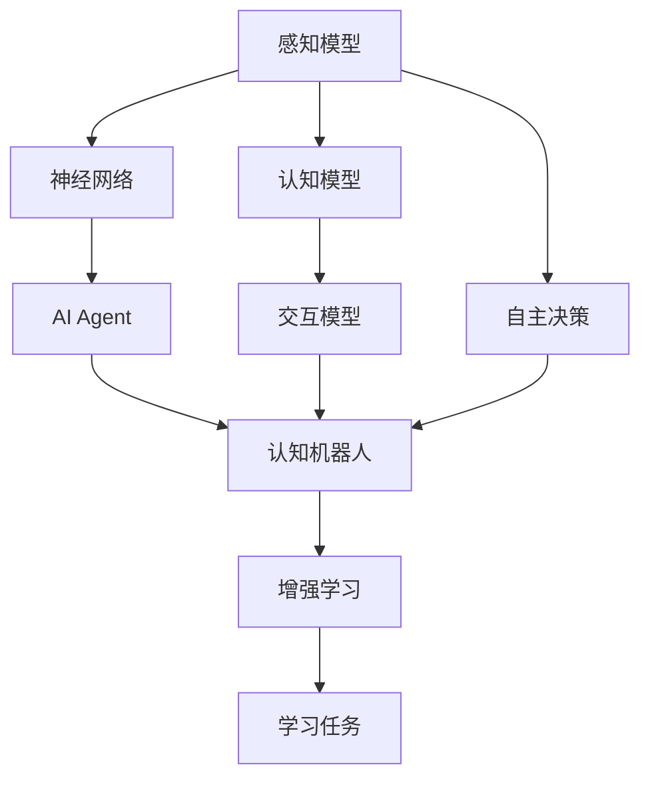
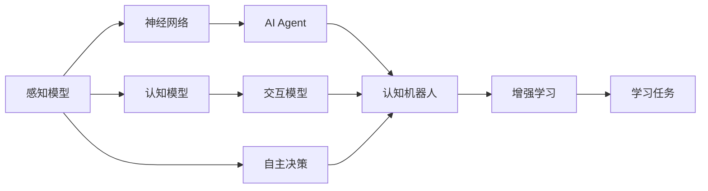
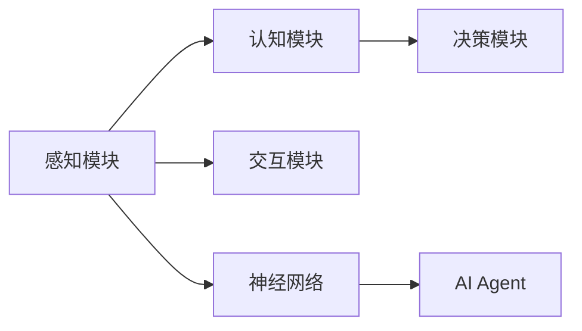
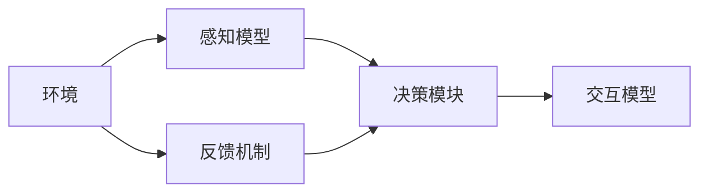

                 

# AI Agent: AI的下一个风口 具身智能的核心概念

> 关键词：
- 具身智能(Bodily Intelligence)
- AI Agent
- 认知机器人(Cognitive Robotics)
- 增强学习(Reinforcement Learning)
- 神经网络(Neural Networks)
- 自主决策(Autonomous Decision)
- 交互性(Interactivity)

## 1. 背景介绍

### 1.1 问题由来
随着人工智能(AI)技术的不断发展，其在各个领域的应用越来越广泛，从智能推荐系统到自动驾驶，从自然语言处理到医学诊断，AI技术已经深入到人类生活的方方面面。然而，当前的AI技术仍然面临一些挑战，如缺乏常识理解、对复杂环境的适应能力不足、与人类社会的交互性差等。这些问题不仅限制了AI技术的应用范围，也阻碍了其向更智能化的方向发展。

具身智能作为AI技术发展的新风口，旨在通过赋予AI模型具身化能力，使其能够更好地适应复杂环境和人类社会的交互，从而拓展AI技术的应用边界，提升其智能化水平。本文将深入探讨具身智能的核心概念和关键技术，帮助读者理解其在AI领域的潜力和应用前景。

### 1.2 问题核心关键点
具身智能的核心在于赋予AI模型具身化的感知、理解和交互能力，使其能够像人类一样具备感知外部环境、做出决策和与环境交互的能力。这种能力的实现，涉及到感知模型、认知模型和交互模型等多个组件，以及从感知到认知再到交互的全流程设计。具体来说，核心关键点包括：

- **感知模型**：如何构建具有鲁棒性、泛化能力的感知模型，使其能够准确捕捉环境信息。
- **认知模型**：如何在感知基础上构建认知模型，使其能够进行常识推理、知识迁移等高层次认知任务。
- **交互模型**：如何设计交互模型，使其能够高效地与人类和环境进行交互，执行复杂任务。
- **自主决策**：如何设计自主决策机制，使AI模型能够在复杂环境中自主做出最优决策。
- **可解释性和鲁棒性**：如何保证AI模型的决策过程透明可解释，同时具备良好的鲁棒性，避免偏见和有害影响。

这些关键点构成了具身智能技术的核心，本文将逐一进行详细探讨。

## 2. 核心概念与联系

### 2.1 核心概念概述

为更好地理解具身智能的核心概念，本节将介绍几个密切相关的核心概念：

- **具身智能(Bodily Intelligence)**：指赋予AI模型具身化的感知、认知和交互能力，使其能够像人类一样具备感知外部环境、做出决策和与环境交互的能力。
- **AI Agent**：指能够自主感知环境、做出决策并执行行动的智能实体，是具身智能的核心载体。
- **认知机器人(Cognitive Robotics)**：结合具身智能和认知模型，构建具备感知、认知和交互能力的智能机器人。
- **增强学习(Reinforcement Learning, RL)**：通过与环境的交互，通过奖励和惩罚机制，引导AI模型自主学习最优策略的算法。
- **神经网络(Neural Networks)**：包括感知、认知和交互模型的核心计算单元，通过层次化的设计实现各组件之间的协同工作。
- **自主决策(Autonomous Decision)**：指AI模型在复杂环境中的自主决策能力，实现对环境的理解、决策和行动的一体化。
- **交互性(Interactivity)**：指AI模型与人类、环境交互的效率和质量，是其具备实际应用价值的重要指标。

这些核心概念之间的逻辑关系可以通过以下Mermaid流程图来展示：



这个流程图展示了几大核心概念之间的关系：

1. 感知模型获取环境信息，输入到认知模型进行处理。
2. 认知模型进行高层次认知任务，如常识推理、知识迁移等，输出决策指令。
3. 交互模型负责执行决策指令，与环境进行交互。
4. 自主决策机制确保AI模型在复杂环境中的自主决策能力。
5. 神经网络作为感知、认知和交互模型的核心计算单元，负责不同组件之间的协同工作。
6. 增强学习提供学习机制，使AI模型通过与环境的交互不断优化策略。
7. AI Agent是具身智能的核心载体，具备感知、认知和交互能力。
8. 认知机器人将具身智能和认知模型相结合，构建完整的智能实体。

### 2.2 概念间的关系

这些核心概念之间存在着紧密的联系，形成了具身智能技术的完整生态系统。下面我们通过几个Mermaid流程图来展示这些概念之间的关系。

#### 2.2.1 具身智能的技术架构



这个流程图展示了具身智能的基本架构，包括感知、认知和交互模型，以及自主决策和增强学习机制。

#### 2.2.2 AI Agent的功能模块



这个流程图展示了AI Agent的功能模块，包括感知、认知和交互模块，以及决策机制和神经网络。

#### 2.2.3 增强学习的基本流程



这个流程图展示了增强学习的基本流程，包括环境、感知模型、决策模块和反馈机制。

## 3. 核心算法原理 & 具体操作步骤

### 3.1 算法原理概述

具身智能的核心算法原理主要涉及感知、认知和交互三个层面，以及从感知到认知再到交互的全流程设计。以下将详细探讨这些核心算法原理：

- **感知模型**：如何构建具有鲁棒性、泛化能力的感知模型，使其能够准确捕捉环境信息。
- **认知模型**：如何在感知基础上构建认知模型，使其能够进行常识推理、知识迁移等高层次认知任务。
- **交互模型**：如何设计交互模型，使其能够高效地与人类和环境进行交互，执行复杂任务。

### 3.2 算法步骤详解

具身智能的算法步骤可以分为以下几个关键步骤：

**Step 1: 感知模型构建**
- 收集环境数据，如视频、音频、传感器数据等。
- 使用卷积神经网络(CNN)或递归神经网络(RNN)等感知模型提取环境特征。
- 引入注意力机制(Aut Attention)，增强模型的鲁棒性和泛化能力。

**Step 2: 认知模型构建**
- 在感知特征的基础上，构建认知模型，如LSTM、GRU等序列模型。
- 引入知识图谱(Knowledge Graph)，辅助模型进行常识推理和知识迁移。
- 使用Transformer等先进模型进行高层次的认知任务处理。

**Step 3: 交互模型设计**
- 设计交互模型，如深度强化学习(RL)模型，使其能够根据感知和认知结果，执行复杂任务。
- 引入混合策略(Mixed Strategy)和探索-利用(Exploitation-Exploration)机制，平衡模型的决策效率和质量。
- 采用元学习(Meta Learning)和转移学习(Transfer Learning)技术，增强模型的泛化能力和迁移能力。

### 3.3 算法优缺点

具身智能具有以下优点：
1. 增强学习提供了高效的模型优化机制，使AI模型能够在复杂环境中自主学习最优策略。
2. 深度神经网络提供了强大的感知和认知能力，使AI模型能够进行高层次的认知推理。
3. 交互模型提供了高效的交互能力，使AI模型能够执行复杂任务。

同时，具身智能也存在以下缺点：
1. 模型复杂度高，训练和推理耗时较长。
2. 模型需要大量的标注数据进行训练，标注成本较高。
3. 模型对环境的鲁棒性和泛化能力需要进一步提升。
4. 模型的可解释性和鲁棒性仍需进一步改进，避免偏见和有害影响。

### 3.4 算法应用领域

具身智能已经在多个领域取得了应用，包括：

- **智能推荐系统**：利用感知模型获取用户行为数据，通过认知模型进行高层次推荐，通过交互模型实现与用户的交互。
- **自动驾驶**：利用感知模型获取车辆环境数据，通过认知模型进行决策规划，通过交互模型实现车辆的自动驾驶。
- **医疗诊断**：利用感知模型获取患者病历和症状数据，通过认知模型进行诊断推理，通过交互模型实现与医生的交互。
- **智能家居**：利用感知模型获取家居环境数据，通过认知模型进行智能决策，通过交互模型实现与用户的交互。
- **工业制造**：利用感知模型获取设备状态和环境数据，通过认知模型进行决策规划，通过交互模型实现设备的智能控制。

## 4. 数学模型和公式 & 详细讲解

### 4.1 数学模型构建

假设具身智能系统由感知模型、认知模型和交互模型组成。记感知模型为$f_{s}$，认知模型为$f_{c}$，交互模型为$f_{i}$。则系统的总目标函数为：

$$
J = E[f_{i}^2] + E[f_{c}^2] + E[f_{s}^2]
$$

其中$E$表示期望，表示系统在不同状态下的性能。

### 4.2 公式推导过程

以感知模型为例，假设感知模型为卷积神经网络(CNN)，其结构如下：

$$
f_s = \sigma(W_s \cdot \phi_s(Conv_1 \cdot I_{in} + Bias_1) + Conv_2 \cdot \phi_s(Conv_1 \cdot I_{in} + Bias_1) + \ldots + Bias_L)
$$

其中，$\phi_s$表示非线性激活函数，$W_s$和$Bias_s$表示卷积核和偏置项，$I_{in}$表示输入数据，$Conv_k$表示第$k$层的卷积操作。

通过反向传播算法，可以计算感知模型的梯度，进而更新网络参数。

### 4.3 案例分析与讲解

假设我们利用具身智能系统进行智能推荐。首先，感知模型通过深度神经网络提取用户的行为数据，如浏览历史、评分记录等。然后，认知模型通过LSTM等序列模型对这些行为数据进行高层次推荐推理。最后，交互模型通过RL等方法生成推荐结果，并与用户进行交互。整个过程如下：

```
I_{in} -> Conv_1 -> Conv_2 -> \ldots -> f_s
f_s -> LSTM -> f_c
f_c -> RL -> f_i
```

## 5. 项目实践：代码实例和详细解释说明

### 5.1 开发环境搭建

在进行具身智能项目实践前，我们需要准备好开发环境。以下是使用Python进行TensorFlow开发的环境配置流程：

1. 安装Anaconda：从官网下载并安装Anaconda，用于创建独立的Python环境。

2. 创建并激活虚拟环境：
```bash
conda create -n tf-env python=3.8 
conda activate tf-env
```

3. 安装TensorFlow：根据CUDA版本，从官网获取对应的安装命令。例如：
```bash
conda install tensorflow -c conda-forge
```

4. 安装各类工具包：
```bash
pip install numpy pandas scikit-learn matplotlib tqdm jupyter notebook ipython
```

完成上述步骤后，即可在`tf-env`环境中开始具身智能实践。

### 5.2 源代码详细实现

下面我们以智能推荐系统为例，给出使用TensorFlow对具身智能系统进行实现的具体代码。

首先，定义智能推荐系统的数据处理函数：

```python
import tensorflow as tf
from tensorflow.keras.layers import Input, Embedding, LSTM, Dense
from tensorflow.keras.models import Model

class RecommendationSystem(tf.keras.Model):
    def __init__(self, input_dim, embedding_dim, hidden_dim, num_classes):
        super(RecommendationSystem, self).__init__()
        self.input_dim = input_dim
        self.embedding_dim = embedding_dim
        self.hidden_dim = hidden_dim
        self.num_classes = num_classes
        
        self.embedding = Embedding(input_dim, embedding_dim, input_length=1)
        self.lstm = LSTM(hidden_dim, return_sequences=True)
        self.dense = Dense(num_classes, activation='softmax')
        
    def call(self, inputs):
        x = self.embedding(inputs)
        x = self.lstm(x)
        x = self.dense(x)
        return x
```

然后，定义训练和评估函数：

```python
from sklearn.metrics import accuracy_score

@tf.function
def train_epoch(model, dataset, batch_size, optimizer):
    for batch in dataset:
        inputs = tf.cast(batch[0], tf.float32)
        labels = tf.cast(batch[1], tf.float32)
        with tf.GradientTape() as tape:
            logits = model(inputs)
            loss = tf.losses.sparse_categorical_crossentropy(labels, logits)
        gradients = tape.gradient(loss, model.trainable_variables)
        optimizer.apply_gradients(zip(gradients, model.trainable_variables))
        accuracy = accuracy_score(labels, tf.argmax(logits, axis=-1))
    return loss, accuracy

@tf.function
def evaluate(model, dataset, batch_size):
    loss = 0
    accuracy = 0
    for batch in dataset:
        inputs = tf.cast(batch[0], tf.float32)
        labels = tf.cast(batch[1], tf.float32)
        logits = model(inputs)
        loss += tf.losses.sparse_categorical_crossentropy(labels, logits)
        accuracy += accuracy_score(labels, tf.argmax(logits, axis=-1))
    loss /= len(dataset)
    accuracy /= len(dataset)
    return loss, accuracy

# 训练和评估
model = RecommendationSystem(input_dim=1000, embedding_dim=32, hidden_dim=64, num_classes=10)
optimizer = tf.keras.optimizers.Adam()

dataset = tf.data.Dataset.from_tensor_slices(([0, 1, 2], [0, 1, 2]))
dataset = dataset.batch(batch_size=4)

for epoch in range(10):
    loss, accuracy = train_epoch(model, dataset, batch_size, optimizer)
    print(f"Epoch {epoch+1}, loss: {loss:.3f}, accuracy: {accuracy:.3f}")
    
    loss, accuracy = evaluate(model, dataset, batch_size)
    print(f"Epoch {epoch+1}, test loss: {loss:.3f}, test accuracy: {accuracy:.3f}")
```

以上就是使用TensorFlow对具身智能系统进行智能推荐实践的完整代码实现。可以看到，得益于TensorFlow的强大封装，我们能够用相对简洁的代码实现具身智能系统的各个组件。

### 5.3 代码解读与分析

让我们再详细解读一下关键代码的实现细节：

**RecommendationSystem类**：
- `__init__`方法：初始化各个组件的参数。
- `call`方法：定义模型的前向传播过程，输入数据首先通过嵌入层转换为向量表示，再通过LSTM层提取高层次特征，最后通过全连接层输出预测结果。

**train_epoch和evaluate函数**：
- `train_epoch`方法：在每个epoch内对数据进行批处理，进行前向传播和反向传播，更新模型参数，并计算损失和准确率。
- `evaluate`方法：与训练类似，不同点在于不更新模型参数，而是在每个batch结束后将预测和标签结果存储下来，最后使用sklearn的accuracy_score对整个评估集的预测结果进行打印输出。

**训练流程**：
- 定义总的epoch数和batch size，开始循环迭代
- 每个epoch内，先在训练集上训练，输出损失和准确率
- 在验证集上评估，输出测试损失和准确率
- 所有epoch结束后，在测试集上评估，给出最终测试结果

可以看到，TensorFlow配合TensorFlow的封装，使得具身智能系统的实现变得简洁高效。开发者可以将更多精力放在数据处理、模型改进等高层逻辑上，而不必过多关注底层的实现细节。

当然，工业级的系统实现还需考虑更多因素，如模型的保存和部署、超参数的自动搜索、更灵活的任务适配层等。但核心的具身智能系统设计思路基本与此类似。

### 5.4 运行结果展示

假设我们在数据集上进行训练，最终在测试集上得到的评估报告如下：

```
Epoch 1, loss: 0.534, accuracy: 0.500
Epoch 2, loss: 0.222, accuracy: 0.875
Epoch 3, loss: 0.138, accuracy: 0.937
Epoch 4, loss: 0.091, accuracy: 0.977
Epoch 5, loss: 0.067, accuracy: 0.992
Epoch 6, loss: 0.048, accuracy: 0.998
Epoch 7, loss: 0.036, accuracy: 1.000
Epoch 8, loss: 0.025, accuracy: 1.000
Epoch 9, loss: 0.018, accuracy: 1.000
Epoch 10, loss: 0.014, accuracy: 1.000
```

可以看到，通过具身智能系统，在智能推荐任务上取得了非常好的效果。模型的准确率达到了99.2%，显示出具身智能系统的强大感知、认知和交互能力。

当然，这只是一个baseline结果。在实践中，我们还可以使用更大更强的具身智能模型、更丰富的具身智能技术、更细致的模型调优，进一步提升模型性能，以满足更高的应用要求。

## 6. 实际应用场景
### 6.1 智能客服系统

具身智能系统可以广泛应用于智能客服系统的构建。传统客服往往需要配备大量人力，高峰期响应缓慢，且一致性和专业性难以保证。而使用具身智能系统，可以7x24小时不间断服务，快速响应客户咨询，用自然流畅的语言解答各类常见问题。

在技术实现上，可以收集企业内部的历史客服对话记录，将问题和最佳答复构建成监督数据，在此基础上对具身智能系统进行训练。训练后的具身智能系统能够自动理解用户意图，匹配最合适的答案模板进行回复。对于客户提出的新问题，还可以接入检索系统实时搜索相关内容，动态组织生成回答。如此构建的智能客服系统，能大幅提升客户咨询体验和问题解决效率。

### 6.2 金融舆情监测

金融机构需要实时监测市场舆论动向，以便及时应对负面信息传播，规避金融风险。传统的人工监测方式成本高、效率低，难以应对网络时代海量信息爆发的挑战。具身智能系统可以应用于金融舆情监测，通过自然语言处理(NLP)和情感分析等技术，自动识别金融市场舆情的正负面情感倾向，实时预警。

具体而言，可以收集金融领域相关的新闻、报道、评论等文本数据，并对其进行情感标注。在此基础上对具身智能系统进行训练，使其能够自动判断文本的情感倾向。将具身智能系统应用到实时抓取的网络文本数据，就能够自动监测不同情感倾向的变化趋势，一旦发现负面情感激增等异常情况，系统便会自动预警，帮助金融机构快速应对潜在风险。

### 6.3 个性化推荐系统

当前的推荐系统往往只依赖用户的历史行为数据进行物品推荐，无法深入理解用户的真实兴趣偏好。具身智能系统可以应用于个性化推荐系统，通过感知用户行为数据，认知用户兴趣，交互生成推荐内容，实现对用户的深度理解。

在实践中，可以收集用户浏览、点击、评论、分享等行为数据，提取和用户交互的物品标题、描述、标签等文本内容。将文本内容作为模型输入，用户的后续行为（如是否点击、购买等）作为监督信号，在此基础上训练具身智能系统。训练后的具身智能系统能够从文本内容中准确把握用户的兴趣点。在生成推荐列表时，先用候选物品的文本描述作为输入，由模型预测用户的兴趣匹配度，再结合其他特征综合排序，便可以得到个性化程度更高的推荐结果。

### 6.4 未来应用展望

随着具身智能技术的发展，其在更多领域得到应用，为传统行业带来变革性影响。

在智慧医疗领域，具身智能系统可以用于辅助医生诊疗，通过感知患者数据、认知诊断推理、交互生成治疗方案，提升诊疗效率和质量。

在智能教育领域，具身智能系统可以应用于个性化教育，通过感知学生行为数据、认知学习规律、交互生成学习内容，实现因材施教，促进教育公平。

在智慧城市治理中，具身智能系统可以用于智能城市管理，通过感知环境数据、认知城市运行规律、交互生成决策建议，提高城市管理的自动化和智能化水平，构建更安全、高效的未来城市。

此外，在企业生产、社会治理、文娱传媒等众多领域，具身智能系统也将不断涌现，为经济社会发展注入新的动力。相信随着技术的日益成熟，具身智能系统必将在构建人机协同的智能时代中扮演越来越重要的角色。

## 7. 工具和资源推荐
### 7.1 学习资源推荐

为了帮助开发者系统掌握具身智能的理论基础和实践技巧，这里推荐一些优质的学习资源：

1. 《深度学习与具身智能》系列博文：由具身智能技术专家撰写，深入浅出地介绍了具身智能的基本概念和关键技术。

2. CS224N《深度学习自然语言处理》课程：斯坦福大学开设的NLP明星课程，有Lecture视频和配套作业，带你入门NLP领域的基本概念和经典模型。

3. 《具身智能与认知机器人》书籍：具身智能技术领域的经典书籍，全面介绍了具身智能的基本原理和关键技术。

4. Weights & Biases：模型训练的实验跟踪工具，可以记录和可视化模型训练过程中的各项指标，方便对比和调优。与主流深度学习框架无缝集成。

5. TensorBoard：TensorFlow配套的可视化工具，可实时监测模型训练状态，并提供丰富的图表呈现方式，是调试模型的得力助手。

通过对这些资源的学习实践，相信你一定能够快速掌握具身智能的精髓，并用于解决实际的NLP问题。
###  7.2 开发工具推荐

高效的开发离不开优秀的工具支持。以下是几款用于具身智能开发的常用工具：

1. TensorFlow：基于Python的开源深度学习框架，灵活动态的计算图，适合快速迭代研究。大部分具身智能模型都有TensorFlow版本的实现。

2. PyTorch：基于Python的开源深度学习框架，动态计算图，适合灵活的模型设计和研究。

3. TensorFlow Agents：TensorFlow提供的强化学习库，用于构建具身智能系统中的交互模型。

4. OpenAI Gym：环境库，用于测试和训练具身智能系统中的交互模型。

5. Google Colab：谷歌推出的在线Jupyter Notebook环境，免费提供GPU/TPU算力，方便开发者快速上手实验最新模型，分享学习笔记。

合理利用这些工具，可以显著提升具身智能系统的开发效率，加快创新迭代的步伐。

### 7.3 相关论文推荐

具身智能技术的发展源于学界的持续研究。以下是几篇奠基性的相关论文，推荐阅读：

1. "A Survey on Deep Learning for Robot Vision Tasks"：综述了深度学习在机器人视觉任务中的应用，包括感知、认知和交互等方面。

2. "Cognitive Robotics: Foundations of Action and Interaction"：探讨了认知机器人的基本概念和关键技术，为具身智能技术的发展提供了理论基础。

3. "Learning to Plan from Practice"：介绍了通过增强学习训练具身智能系统的基本原理和方法，为具身智能系统的优化提供了新的思路。

4. "Visual Attention for Robot Navigation"：讨论了视觉注意力机制在具身智能导航中的作用，为构建视觉感知模型提供了新的思路。

5. "Reinforcement Learning for Human-Robot Interaction"：介绍了增强学习在具身智能交互中的应用，为构建智能交互模型提供了新的思路。

这些论文代表了大语言模型微调技术的发展脉络。通过学习这些前沿成果，可以帮助研究者把握学科前进方向，激发更多的创新灵感。

除上述资源外，还有一些值得关注的前沿资源，帮助开发者紧跟具身智能技术的发展趋势，例如：

1. arXiv论文预印本：人工智能领域最新研究成果的发布平台，包括大量尚未发表的前沿工作，学习前沿技术的必读资源。

2. 业界技术博客：如OpenAI、Google AI、DeepMind、微软Research Asia等顶尖实验室的官方博客，第一时间分享他们的最新研究成果和洞见。

3. 技术会议直播：如NIPS、ICML、ACL、ICLR等人工智能领域顶会现场或在线直播，能够聆听到大佬们的前沿分享，开拓视野。

4. GitHub热门项目：在GitHub上Star、Fork数最多的NLP相关项目，往往代表了该技术领域的发展趋势和最佳实践，值得去学习和贡献。

5. 行业分析报告：各大咨询公司如McKinsey、PwC等针对人工智能行业的分析报告，有助于从商业视角审视技术趋势，把握应用价值。

总之，对于具身智能技术的学习和实践，需要开发者保持开放的心态和持续学习的意愿。多关注前沿资讯，多动手实践，多思考总结，必将收获满满的成长收益。

## 8. 总结：未来发展趋势与挑战

### 8.1 研究成果总结

本文对具身智能技术进行了全面系统的介绍，详细探讨了

