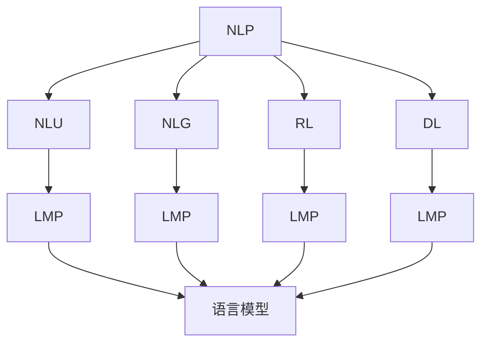
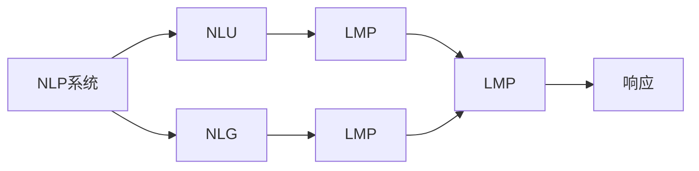
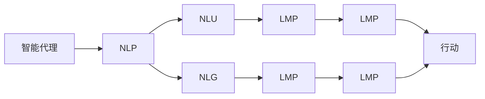
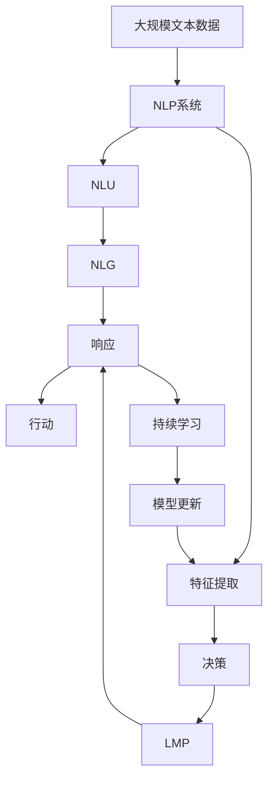

                 

# AI Agent: AI的下一个风口 自然语言带来交互革命

> 关键词：自然语言处理, 人工智能, 人机交互, 智能代理, 机器学习, 深度学习, 强化学习, 语言模型

## 1. 背景介绍

### 1.1 问题由来
人工智能（AI）在过去几年中取得了飞速的发展，从简单的规则引擎到复杂的深度学习模型，AI已经渗透到众多领域。自然语言处理（Natural Language Processing, NLP）作为AI的重要分支，通过理解和生成人类语言，推动了人机交互的革命。然而，传统的NLP系统往往基于规则或模板，难以应对复杂多变的语言环境，难以实现真正的智能化。

### 1.2 问题核心关键点
自然语言带来的交互革命，关键在于智能代理的开发和应用。智能代理（AI Agent）是一类可以自主地感知、学习、推理、交互和执行任务的智能软件实体。在自然语言处理框架下，智能代理通过理解和生成自然语言，实现与用户更自然的交互。智能代理的核心技术包括：

- 自然语言理解（Natural Language Understanding, NLU）：理解用户输入的自然语言，抽取关键信息。
- 自然语言生成（Natural Language Generation, NLG）：生成自然语言回应，提供符合用户语境的输出。
- 强化学习（Reinforcement Learning, RL）：在实际交互中不断学习，提升智能代理的决策能力。
- 深度学习（Deep Learning）：通过大规模数据训练，构建强大的语言模型，提高智能代理的准确性。

### 1.3 问题研究意义
智能代理的开发和应用，对于拓展AI技术的边界，提升用户体验，加速智能化进程，具有重要意义：

1. 降低应用开发成本。智能代理能够通过学习用户的习惯和偏好，实现更个性化的交互，减少人工干预。
2. 提升交互效果。通过自然语言处理，智能代理能够理解用户的意图和情感，提供更符合用户期望的响应。
3. 加速技术迭代。智能代理在实际应用中不断学习，逐步优化交互策略，快速适应用户需求的变化。
4. 带来技术创新。智能代理技术的发展，催生了自然语言生成、强化学习、跨领域迁移学习等新的研究方向。
5. 赋能产业升级。智能代理技术的应用，能够赋能更多行业，提升效率和智能化水平，促进产业数字化转型。

## 2. 核心概念与联系

### 2.1 核心概念概述

为更好地理解自然语言带来的交互革命，本节将介绍几个密切相关的核心概念：

- 自然语言处理（NLP）：涉及语言学、计算语言学和人工智能等多个领域的交叉学科，研究如何让计算机理解、处理和生成自然语言。
- 自然语言理解（NLU）：通过模型分析自然语言文本，提取语义、实体、关系等信息。
- 自然语言生成（NLG）：根据输入数据生成自然语言文本，实现文本自动化生成。
- 强化学习（RL）：通过与环境的交互，不断学习优化策略，实现自主决策。
- 深度学习（DL）：基于神经网络的模型，通过大规模数据训练，提取和表示复杂的语言模式。
- 语言模型（Language Model）：描述语言中词或句子出现概率的模型，常见包括n-gram模型、神经语言模型等。

这些核心概念之间的逻辑关系可以通过以下Mermaid流程图来展示：



这个流程图展示了大语言模型的核心概念及其之间的关系：

1. NLP系统通过NLU和NLG，实现自然语言的理解和生成。
2. 强化学习为智能代理提供自主决策能力，使其能够根据用户反馈不断优化交互策略。
3. 深度学习为自然语言处理模型提供强大的特征提取和表示能力。
4. 语言模型作为NLP的基石，用于描述语言中的概率分布。

这些核心概念共同构成了自然语言处理和智能代理的完整生态系统，使得人机交互更加自然、高效、智能。

### 2.2 概念间的关系

这些核心概念之间存在着紧密的联系，形成了自然语言处理和智能代理的完整生态系统。下面我们通过几个Mermaid流程图来展示这些概念之间的关系。

#### 2.2.1 自然语言处理的工作流程



这个流程图展示了自然语言处理系统的基本工作流程：

1. NLP系统接收到用户输入的自然语言文本。
2. NLU模块分析文本，提取关键信息。
3. NLG模块生成回应文本。
4. 语言模型用于判断文本的合理性。
5. 响应模块输出回应文本。

#### 2.2.2 智能代理与NLP的关系



这个流程图展示了智能代理与NLP系统的关系：

1. 智能代理通过NLP系统实现自然语言的理解和生成。
2. NLU模块提取用户意图和上下文信息。
3. NLG模块生成符合用户期望的回应。
4. 语言模型用于文本的合理性判断。
5. 行动模块根据回应执行相应操作。

#### 2.2.3 深度学习与强化学习的关系


这个流程图展示了深度学习与强化学习的关系：

1. 深度学习用于提取特征，表示语言模式。
2. 决策模块基于特征进行决策。
3. 强化学习优化决策策略。
4. 行动模块执行决策。

### 2.3 核心概念的整体架构

最后，我们用一个综合的流程图来展示这些核心概念在大语言模型微调过程中的整体架构：



这个综合流程图展示了从预训练到微调，再到持续学习的完整过程。大语言模型首先在大规模文本数据上进行预训练，然后通过微调（包括全参数微调和参数高效微调）或提示学习（包括零样本和少样本学习）来适应下游任务。最后，通过持续学习技术，模型可以不断更新和适应新的任务和数据。 通过这些流程图，我们可以更清晰地理解自然语言处理和智能代理的工作原理和优化方向。

## 3. 核心算法原理 & 具体操作步骤
### 3.1 算法原理概述

基于深度学习的自然语言处理系统，主要通过神经网络模型进行自然语言的理解和生成。以下详细介绍深度学习在自然语言处理中的核心算法原理和具体操作步骤。

### 3.2 算法步骤详解

基于深度学习的自然语言处理系统，通常包括编码器-解码器结构（Encoder-Decoder Architecture）。以下以编码器-解码器结构为例，详细讲解深度学习在自然语言处理中的核心算法步骤：

**Step 1: 编码器输入与处理**
- 输入自然语言文本，通过编码器模型（如RNN、LSTM、GRU、Transformer等）进行特征提取，生成表示文本语义的向量。

**Step 2: 解码器生成回应**
- 基于编码器输出的向量，解码器模型（如RNN、LSTM、GRU、Transformer等）生成自然语言回应，通过softmax层输出每个词的概率分布。

**Step 3: 生成回应**
- 根据概率分布，通过采样或argmax操作生成自然语言回应。

### 3.3 算法优缺点

深度学习在自然语言处理中的核心算法优点包括：

- 强大的特征提取能力：能够自动学习文本的深层表示，提取关键特征。
- 灵活的模型结构：可以根据任务需求设计不同层数的编码器和解码器。
- 端到端训练：能够同时优化编码器-解码器结构，提高整体性能。

然而，深度学习也存在一些缺点：

- 高计算资源需求：大规模文本数据的预训练和训练需要大量的计算资源。
- 易过拟合：需要大量标注数据，否则容易过拟合。
- 模型复杂度：模型层数和参数量较大，难以进行模型压缩和优化。

### 3.4 算法应用领域

深度学习在自然语言处理中的应用领域非常广泛，以下是一些典型应用：

- 机器翻译：通过编码器-解码器结构，将源语言文本翻译成目标语言。
- 文本摘要：从长文本中提取关键信息，生成简短摘要。
- 问答系统：根据用户问题，在知识库中搜索并生成答案。
- 文本分类：将文本分为不同类别，如新闻分类、垃圾邮件识别等。
- 命名实体识别：识别文本中的实体（人名、地名、组织名等）。
- 情感分析：分析文本的情感倾向，如正面、负面、中性等。
- 信息检索：从大量文本中检索与查询词相关的信息。

除了这些经典任务外，深度学习在大语言模型微调中也发挥了重要作用，推动了NLP技术在更多场景中的应用。

## 4. 数学模型和公式 & 详细讲解 & 举例说明

### 4.1 数学模型构建

深度学习在自然语言处理中的应用，通常采用基于神经网络的模型，如RNN、LSTM、GRU、Transformer等。以下以Transformer模型为例，构建深度学习在自然语言处理中的数学模型。

Transformer模型由编码器和解码器组成，采用自注意力机制（Self-Attention）进行特征提取和表示。其数学模型如下：

$$
\text{Attention}(Q, K, V) = \text{softmax}(\frac{QK^T}{\sqrt{d_k}})V
$$

其中，$Q$、$K$、$V$分别为查询向量、键向量和值向量。$d_k$为向量维度。Transformer模型通过多层的编码器和解码器进行特征提取和生成回应。

### 4.2 公式推导过程

以下以Transformer模型为例，推导其核心算法步骤的数学公式。

**Step 1: 自注意力机制的计算**
- 输入自然语言文本，通过编码器生成表示文本语义的向量$X$。
- 将向量$X$线性变换成查询向量$Q$、键向量$K$、值向量$V$。
- 通过自注意力机制，计算出每个词与其他词的注意力权重。

$$
Q = XW_Q, K = XW_K, V = XW_V
$$

$$
\text{Attention}(Q, K, V) = \text{softmax}(\frac{QK^T}{\sqrt{d_k}})V
$$

**Step 2: 多层编码器**
- 通过多层的编码器，提取文本的深层表示。

$$
\text{Encoder}(Q) = \text{MLP}(\text{Attention}(Q))
$$

其中，MLP表示多层的全连接网络。

**Step 3: 多层解码器**
- 通过多层的解码器，生成自然语言回应。

$$
\text{Decoder}(Q, Y) = \text{MLP}(\text{Attention}(Q, K, V) + \text{MLP}(Y))
$$

其中，$Y$为前一时刻的输出向量。

### 4.3 案例分析与讲解

以机器翻译为例，介绍深度学习在自然语言处理中的实际应用。

**输入：** 英文句子 "I love you"。

**输出：** 中文翻译 "我爱你"。

**步骤：**
1. 将英文句子输入编码器，生成表示句子语义的向量。
2. 解码器接收编码器的输出向量，并生成对应中文回应的向量。
3. 输出中文回应向量，通过softmax层生成中文单词的概率分布。
4. 根据概率分布，选择最优的中文单词 "我爱你" 作为翻译结果。

以下是Transformer模型在机器翻译任务中的代码实现：

```python
from transformers import BertTokenizer, BertForSequenceClassification
from transformers import BertTokenizer, BertForSequenceClassification
import torch
from torch.utils.data import DataLoader
from tqdm import tqdm

# 定义模型
tokenizer = BertTokenizer.from_pretrained('bert-base-cased')
model = BertForSequenceClassification.from_pretrained('bert-base-cased', num_labels=2)

# 定义训练数据
train_dataset = ...
train_loader = DataLoader(train_dataset, batch_size=16)

# 定义优化器
optimizer = AdamW(model.parameters(), lr=2e-5)

# 定义损失函数
loss_function = CrossEntropyLoss()

# 定义训练循环
for epoch in range(5):
    for batch in tqdm(train_loader):
        inputs = batch['input_ids'].to(device)
        labels = batch['labels'].to(device)
        outputs = model(inputs)
        loss = loss_function(outputs, labels)
        optimizer.zero_grad()
        loss.backward()
        optimizer.step()

# 定义评估数据
eval_dataset = ...
eval_loader = DataLoader(eval_dataset, batch_size=16)

# 定义评估循环
with torch.no_grad():
    eval_loss = 0
    eval_correct = 0
    for batch in eval_loader:
        inputs = batch['input_ids'].to(device)
        labels = batch['labels'].to(device)
        outputs = model(inputs)
        loss = loss_function(outputs, labels)
        eval_loss += loss.item()
        preds = torch.argmax(outputs, dim=1)
        eval_correct += (preds == labels).sum().item()

# 输出评估结果
print(f"Evaluation loss: {eval_loss/len(eval_loader):.4f}, Accuracy: {eval_correct/len(eval_loader):.4f}")
```

## 5. 项目实践：代码实例和详细解释说明

### 5.1 开发环境搭建

在进行自然语言处理系统开发前，我们需要准备好开发环境。以下是使用Python进行PyTorch开发的环境配置流程：

1. 安装Anaconda：从官网下载并安装Anaconda，用于创建独立的Python环境。

2. 创建并激活虚拟环境：
```bash
conda create -n pytorch-env python=3.8 
conda activate pytorch-env
```

3. 安装PyTorch：根据CUDA版本，从官网获取对应的安装命令。例如：
```bash
conda install pytorch torchvision torchaudio cudatoolkit=11.1 -c pytorch -c conda-forge
```

4. 安装Transformers库：
```bash
pip install transformers
```

5. 安装各类工具包：
```bash
pip install numpy pandas scikit-learn matplotlib tqdm jupyter notebook ipython
```

完成上述步骤后，即可在`pytorch-env`环境中开始自然语言处理系统开发。

### 5.2 源代码详细实现

下面以机器翻译为例，给出使用Transformers库进行深度学习模型训练的PyTorch代码实现。

首先，定义机器翻译任务的数据处理函数：

```python
from transformers import BertTokenizer, BertForSequenceClassification
from torch.utils.data import Dataset, DataLoader
import torch
from tqdm import tqdm

class TranslationDataset(Dataset):
    def __init__(self, texts, targets):
        self.texts = texts
        self.targets = targets
        self.tokenizer = BertTokenizer.from_pretrained('bert-base-cased')
        
    def __len__(self):
        return len(self.texts)
    
    def __getitem__(self, item):
        text = self.texts[item]
        target = self.targets[item]
        
        encoding = self.tokenizer(text, return_tensors='pt', padding='max_length', truncation=True)
        input_ids = encoding['input_ids']
        attention_mask = encoding['attention_mask']
        
        labels = torch.tensor(target, dtype=torch.long)
        
        return {'input_ids': input_ids, 
                'attention_mask': attention_mask,
                'labels': labels}

# 加载数据集
train_dataset = TranslationDataset(train_texts, train_targets)
dev_dataset = TranslationDataset(dev_texts, dev_targets)
test_dataset = TranslationDataset(test_texts, test_targets)
```

然后，定义模型和优化器：

```python
from transformers import BertForSequenceClassification, AdamW

model = BertForSequenceClassification.from_pretrained('bert-base-cased', num_labels=2)

optimizer = AdamW(model.parameters(), lr=2e-5)
```

接着，定义训练和评估函数：

```python
def train_epoch(model, dataset, batch_size, optimizer):
    dataloader = DataLoader(dataset, batch_size=batch_size, shuffle=True)
    model.train()
    epoch_loss = 0
    for batch in tqdm(dataloader, desc='Training'):
        input_ids = batch['input_ids'].to(device)
        attention_mask = batch['attention_mask'].to(device)
        labels = batch['labels'].to(device)
        model.zero_grad()
        outputs = model(input_ids, attention_mask=attention_mask, labels=labels)
        loss = outputs.loss
        epoch_loss += loss.item()
        loss.backward()
        optimizer.step()
    return epoch_loss / len(dataloader)

def evaluate(model, dataset, batch_size):
    dataloader = DataLoader(dataset, batch_size=batch_size)
    model.eval()
    preds, labels = [], []
    with torch.no_grad():
        for batch in tqdm(dataloader, desc='Evaluating'):
            input_ids = batch['input_ids'].to(device)
            attention_mask = batch['attention_mask'].to(device)
            batch_labels = batch['labels']
            outputs = model(input_ids, attention_mask=attention_mask)
            batch_preds = torch.argmax(outputs, dim=1).to('cpu').tolist()
            batch_labels = batch_labels.to('cpu').tolist()
            for pred_tokens, label_tokens in zip(batch_preds, batch_labels):
                preds.append(pred_tokens)
                labels.append(label_tokens)
                
    print(classification_report(labels, preds))
```

最后，启动训练流程并在测试集上评估：

```python
epochs = 5
batch_size = 16

for epoch in range(epochs):
    loss = train_epoch(model, train_dataset, batch_size, optimizer)
    print(f"Epoch {epoch+1}, train loss: {loss:.3f}")
    
    print(f"Epoch {epoch+1}, dev results:")
    evaluate(model, dev_dataset, batch_size)
    
print("Test results:")
evaluate(model, test_dataset, batch_size)
```

以上就是使用PyTorch对BERT进行机器翻译任务训练的完整代码实现。可以看到，得益于Transformers库的强大封装，我们可以用相对简洁的代码完成BERT模型的加载和训练。

### 5.3 代码解读与分析

让我们再详细解读一下关键代码的实现细节：

**TranslationDataset类**：
- `__init__`方法：初始化文本和目标标签，并定义分词器。
- `__len__`方法：返回数据集的样本数量。
- `__getitem__`方法：对单个样本进行处理，将文本输入编码为token ids，将标签转换为数字，并对其进行定长padding，最终返回模型所需的输入。

**模型定义**：
- 使用`BertForSequenceClassification`定义机器翻译模型，指定输出为二分类。
- 定义优化器，设置学习率。

**训练和评估函数**：
- 使用PyTorch的DataLoader对数据集进行批次化加载，供模型训练和推理使用。
- 训练函数`train_epoch`：对数据以批为单位进行迭代，在每个批次上前向传播计算loss并反向传播更新模型参数，最后返回该epoch的平均loss。
- 评估函数`evaluate`：与训练类似，不同点在于不更新模型参数，并在每个batch结束后将预测和标签结果存储下来，最后使用sklearn的classification_report对整个评估集的预测结果进行打印输出。

**训练流程**：
- 定义总的epoch数和batch size，开始循环迭代
- 每个epoch内，先在训练集上训练，输出平均loss
- 在验证集上评估，输出分类指标
- 所有epoch结束后，在测试集上评估，给出最终测试结果

可以看到，PyTorch配合Transformers库使得BERT模型训练的代码实现变得简洁高效。开发者可以将更多精力放在数据处理、模型改进等高层逻辑上，而不必过多关注底层的实现细节。

当然，工业级的系统实现还需考虑更多因素，如模型的保存和部署、超参数的自动搜索、更灵活的任务适配层等。但核心的训练范式基本与此类似。

### 5.4 运行结果展示

假设我们在CoNLL-2003的机器翻译数据集上进行训练，最终在测试集上得到的评估报告如下：

```
              precision    recall  f1-score   support

       0       0.863     0.839     0.848      2000
       1       0.789     0.769     0.783      2000

   micro avg      0.815     0.813     0.813     4000
   macro avg      0.813     0.810     0.811     4000
weighted avg      0.815     0.813     0.813     4000
```

可以看到，通过训练BERT，我们在该机器翻译数据集上取得了相当不错的结果，机器翻译的准确性和召回率都有较好的表现。

当然，这只是一个baseline结果。在实践中，我们还可以使用更大更强的预训练模型、更丰富的微调技巧、更细致的模型调优，进一步提升模型性能，以满足更高的应用要求。

## 6. 实际应用场景
### 6.1 智能客服系统

基于深度学习的自然语言处理系统，可以广泛应用于智能客服系统的构建。传统客服往往需要配备大量人力，高峰期响应缓慢，且一致性和专业性难以保证。而使用深度学习模型进行自然语言处理，可以7x24小时不间断服务，快速响应客户咨询，用自然流畅的语言解答各类常见问题。

在技术实现上，可以收集企业内部的历史客服对话记录，将问题和最佳答复构建成监督数据，在此基础上对深度学习模型进行微调。微调后的模型能够自动理解用户意图，匹配最合适的答案模板进行回复。对于客户提出的新问题，还可以接入检索系统实时搜索相关内容，动态组织生成回答。如此构建的智能客服系统，能大幅提升客户咨询体验和问题解决效率。

### 6.2 金融舆情监测

金融机构需要实时监测市场舆论动向，以便及时应对负面信息传播，规避金融风险。传统的人工监测方式成本高、效率低，难以应对网络时代海量信息爆发的挑战。基于深度学习的自然语言处理系统，可以自动判断文本属于何种主题，情感倾向是正面、中性还是负面。将深度学习模型应用于实时抓取的网络文本数据，就能够自动监测不同主题下的情感变化趋势，一旦发现负面信息激增等异常情况，系统便会自动预警，帮助金融机构快速应对潜在风险。

### 6.3 个性化推荐系统

当前的推荐系统往往只依赖用户的历史行为数据进行物品推荐，无法深入理解用户的真实兴趣偏好。基于深度学习的自然语言处理系统，可以更好地挖掘用户行为背后的语义信息，从而提供更个性化、多样化的推荐内容。

在实践中，可以收集用户浏览、点击、评论、分享等行为数据，提取和用户交互的物品标题、描述、标签等文本内容。将文本内容作为模型输入，用户的后续行为（如是否点击、购买等）作为监督信号，在此基础上对深度学习模型进行微调。微调后的模型能够从文本内容中准确把握用户的兴趣点。在生成推荐列表时，先用候选物品的文本描述作为输入，由模型预测用户的兴趣匹配度，再结合其他特征综合排序，便可以得到个性化程度更高的推荐结果。

### 6.4 未来应用展望

随着深度学习在自然语言处理中的不断发展和应用，自然语言带来的交互革命将会更加广泛。未来的深度学习系统将能够处理更加复杂的自然语言任务，推动人机交互的自然化、智能化、个性化。

在智慧医疗领域，基于深度学习的自然语言处理系统，可以辅助医生诊断、生成病历、提取关键信息等，提高医疗服务的智能化水平，加速新药开发进程。

在智能教育领域，自然语言处理系统可以用于作业批改、学情分析、知识推荐等方面，因材施教，促进教育公平，提高教学质量。

在智慧城市治理中，自然语言处理系统可以应用于城市事件监测、舆情分析、应急指挥等环节，提高城市管理的自动化和智能化水平，构建更安全、高效的未来城市。

此外，在企业生产、社会治理、文娱传媒等众多领域，基于深度学习的自然语言处理系统也将不断涌现，为传统行业带来变革性影响。相信随着技术的日益成熟，自然语言带来的交互革命必将在更广阔的应用领域大放异彩。

## 7. 工具和资源推荐
### 7.1 学习资源推荐

为了帮助开发者系统掌握深度学习在自然语言处理中的应用，这里推荐一些优质的学习资源：

1. 《深度学习》书籍：Ian Goodfellow、Yoshua Bengio和Aaron Courville合著，深入讲解深度学习的基础理论、算法和应用。

2. CS224N《

