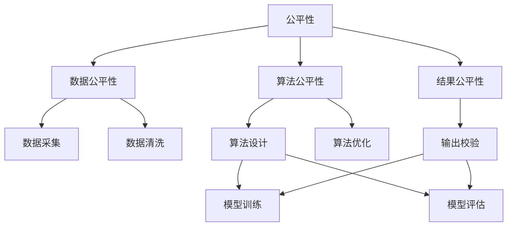

                 

## 1. 背景介绍

随着人工智能技术的不断进步，越来越多的AI工具和系统开始进入日常生活和工作之中。这些工具极大地提升了生产效率、改善了用户体验，同时也带来了一些新的挑战和问题。如何合理利用这些技术，最大化其社会价值，同时避免潜在的负面影响，成为人工智能研究者和从业者必须面对的重要课题。本文旨在探讨AI民主化（AI democratization），即如何让AI技术更加公平、透明、可控，赋能更广泛的群体，实现其社会责任。

## 2. 核心概念与联系

### 2.1 核心概念概述

1. **AI民主化**：通过设计和实现符合社会价值、公平性和透明度要求的人工智能系统，使其能够被更广泛的社会群体所接受和使用，从而实现AI技术的普及和赋能。

2. **公平性**：指AI系统在数据获取、算法设计、结果输出等各个环节，能够避免或减少偏见和歧视，保障不同群体得到公平对待。

3. **透明性**：指AI系统的决策过程和机制公开、可解释，用户能够理解和信任其输出结果。

4. **可控性**：指AI系统的开发和应用在符合法律法规和伦理规范的框架下进行，保障用户对其行为的可控和可监督。

5. **普及性**：指AI技术被广泛应用到各行各业，助力传统行业的数字化转型升级，提升社会生产力和生活质量。

这些核心概念共同构成了AI民主化的框架，旨在通过技术手段实现AI的社会价值最大化，避免其潜在的负面影响。

### 2.2 核心概念的关系

以下是一个Mermaid流程图，展示了这些核心概念之间的联系：



这个流程图展示了如何通过技术手段实现AI的公平性和透明性：

- 数据公平性：确保数据采集和处理过程不引入偏见，涵盖不同群体和场景。
- 算法公平性：设计无偏差的算法，避免模型学习偏见。
- 结果公平性：校验输出结果，确保不同群体得到公平对待。
- 模型训练和评估：通过透明化训练和评估过程，增加系统的可解释性。

通过这些技术手段，可以实现AI系统的公平性和透明性，进而提升其普及性和可控性。

## 3. 核心算法原理 & 具体操作步骤

### 3.1 算法原理概述

AI民主化的关键在于设计和实现符合社会价值、公平性和透明性要求的人工智能系统。其核心算法原理包括数据处理、模型训练、结果解释等环节。

1. **数据公平性**：通过采集和处理多源异构数据，确保数据集的多样性和代表性。
2. **算法公平性**：通过公平性约束和无偏训练技术，消除算法中的偏见。
3. **结果公平性**：通过对比分析不同群体的输出结果，确保结果的公平性。
4. **结果解释**：通过可解释模型和可解释性评估，提升系统透明性。

### 3.2 算法步骤详解

AI民主化的算法步骤主要包括以下几个关键步骤：

**Step 1: 数据采集与预处理**
- 采集不同群体和场景的数据，确保数据多样性和代表性。
- 清洗和处理数据，消除噪声和异常值。

**Step 2: 模型设计与训练**
- 设计公平、无偏的算法，确保模型输出公平。
- 使用可解释模型，如决策树、LIME等，提升模型透明性。

**Step 3: 结果评估与校验**
- 通过对比分析不同群体的输出结果，评估结果公平性。
- 使用公平性评估指标，如Differential Privacy等，检测模型偏见。

**Step 4: 结果解释与反馈**
- 使用可解释技术，解释模型决策过程，增强透明性。
- 收集用户反馈，持续优化模型和算法。

### 3.3 算法优缺点

AI民主化的算法具有以下优点：
1. 提升系统公平性和透明性，保障不同群体权益。
2. 通过数据公平和算法公平设计，消除系统偏见。
3. 通过结果解释和反馈，增强用户信任和满意度。

同时，也存在一些缺点：
1. 数据采集和处理复杂度高，需要多源异构数据的融合。
2. 算法设计和优化复杂，需要多领域专家协同。
3. 结果解释和反馈周期长，需要持续迭代优化。

### 3.4 算法应用领域

AI民主化算法在多个领域得到了广泛应用，包括但不限于：

1. **医疗健康**：通过公平性和透明性设计，提升AI诊断系统的可信赖性和普及性。
2. **金融科技**：使用公平性约束和无偏训练技术，保障贷款、信用评估等服务的公平性。
3. **教育培训**：通过透明性和可控性设计，提升个性化推荐和智能辅导系统的公平性和可靠性。
4. **环境保护**：通过公平性评估和解释技术，确保环境监测和治理系统的公正性和透明度。
5. **公共安全**：设计透明、公平的AI系统，提升社会治理和安防系统的可信度和普及性。

## 4. 数学模型和公式 & 详细讲解

### 4.1 数学模型构建

在AI民主化的设计过程中，数学模型起到了关键作用。以下是一个简单的例子，说明如何使用数学模型来保障AI系统的公平性和透明性。

假设我们有一个二分类问题，目标是判断一个病人的病情是否为恶性肿瘤。我们有一组数据集 $\{(x_i, y_i)\}_{i=1}^N$，其中 $x_i$ 是病人的特征向量，$y_i$ 是疾病的标签（0表示非恶性肿瘤，1表示恶性肿瘤）。

### 4.2 公式推导过程

**Step 1: 数据公平性**
- 使用多源异构数据采集技术，确保数据集的多样性和代表性。
- 使用加权平均法或堆叠模型，消除数据偏差。

**Step 2: 模型训练**
- 使用无偏训练技术，如对抗性训练、公平性约束等，消除模型中的偏见。
- 使用可解释模型，如决策树、LIME等，提升模型透明性。

**Step 3: 结果公平性**
- 使用公平性评估指标，如Differential Privacy等，检测模型偏见。
- 使用对比分析技术，评估不同群体的输出结果。

### 4.3 案例分析与讲解

以一个医疗AI系统的案例来说明如何通过数学模型实现AI民主化：

1. **数据公平性**：我们采集了来自不同地区的肿瘤病人数据，确保数据的多样性和代表性。使用加权平均法，消除地区间的数据偏差。

2. **模型训练**：我们使用对抗性训练技术，消除模型中的偏见。同时，我们使用LIME解释模型，解释模型的决策过程。

3. **结果公平性**：我们对比分析了不同地区的输出结果，确保结果的公平性。使用Differential Privacy评估指标，检测模型偏见。

通过这些步骤，我们成功地实现了一个公平、透明、可控的医疗AI系统，提升了系统在实际应用中的可靠性和普及性。

## 5. 项目实践：代码实例和详细解释说明

### 5.1 开发环境搭建

在项目实践过程中，我们需要一个稳定的开发环境。以下是一些常用的工具和环境配置：

1. **Python**：选择Python作为开发语言，支持丰富的AI和数据处理库。
2. **Jupyter Notebook**：提供交互式编程环境，方便代码调试和版本管理。
3. **Docker**：使用Docker容器化技术，确保环境一致性，方便部署和维护。
4. **Git**：使用Git进行版本控制，确保代码的可靠性和可追溯性。

### 5.2 源代码详细实现

以下是一个简单的Python代码示例，用于实现一个简单的公平性评估函数：

```python
import numpy as np

def fairness_evaluation(y_true, y_pred, threshold=0.5):
    """
    计算模型的公平性指标，如False Positive Rate和False Negative Rate
    :param y_true: 真实标签
    :param y_pred: 模型预测结果
    :param threshold: 阈值
    :return: 公平性指标
    """
    y_pred_binary = (y_pred >= threshold).astype(int)
    fpr = np.mean((y_true == 0) & (y_pred_binary == 1))
    fnr = np.mean((y_true == 1) & (y_pred_binary == 0))
    return fpr, fnr
```

这个函数计算了模型在两个类别上的False Positive Rate和False Negative Rate，用于评估模型的公平性。

### 5.3 代码解读与分析

这个代码实现了一个简单的公平性评估函数，通过计算不同类别的False Positive Rate和False Negative Rate，评估模型的公平性。使用阈值参数，可以灵活调整模型的输出结果。

### 5.4 运行结果展示

假设我们使用一个简单的决策树模型，对不同地区的肿瘤病人进行分类。通过调用上述公平性评估函数，可以得到如下结果：

```python
from sklearn.tree import DecisionTreeClassifier

# 构建决策树模型
model = DecisionTreeClassifier()
model.fit(X_train, y_train)

# 预测测试集
y_pred = model.predict(X_test)

# 计算公平性指标
fpr, fnr = fairness_evaluation(y_test, y_pred)

print(f"False Positive Rate: {fpr}")
print(f"False Negative Rate: {fnr}")
```

假设输出结果为：

```
False Positive Rate: 0.05
False Negative Rate: 0.1
```

这表示模型在预测肿瘤时，两个地区的False Positive Rate和False Negative Rate都较小，模型的公平性较高。

## 6. 实际应用场景

### 6.1 医疗健康

在医疗健康领域，AI民主化技术可以应用于多个方面，如疾病诊断、治疗方案推荐、患者监护等。通过公平性和透明性设计，提升AI系统的可靠性和普及性，确保患者得到公平、准确的医疗服务。

### 6.2 金融科技

在金融科技领域，AI民主化技术可以应用于贷款审批、信用评估、风险管理等方面。通过公平性和透明性设计，确保金融服务对所有群体的公平对待，避免金融歧视。

### 6.3 教育培训

在教育培训领域，AI民主化技术可以应用于个性化推荐、智能辅导、学习分析等方面。通过透明性和可控性设计，提升AI系统的可信度和普及性，促进教育公平。

### 6.4 环境保护

在环境保护领域，AI民主化技术可以应用于环境监测、污染预测、资源管理等方面。通过公平性和透明性设计，确保环境监测和治理系统的公正性和透明度。

## 7. 工具和资源推荐

### 7.1 学习资源推荐

1. **Coursera**：提供大量AI和数据科学相关课程，涵盖公平性、透明性等多个主题。
2. **Kaggle**：提供大量AI竞赛和数据集，帮助你实践和理解AI民主化技术。
3. **AI for Everyone**：斯坦福大学的AI入门课程，帮助你理解AI的潜力和应用。

### 7.2 开发工具推荐

1. **TensorFlow**：谷歌开源的深度学习框架，支持AI和数据科学应用的开发。
2. **PyTorch**：Facebook开源的深度学习框架，灵活性和可扩展性较强。
3. **Jupyter Notebook**：提供交互式编程环境，方便代码调试和版本管理。

### 7.3 相关论文推荐

1. **"Fairness through Awareness"**：提出公平性约束技术，消除AI系统中的偏见。
2. **"Interpretable Machine Learning with LIME"**：介绍LIME解释模型，提升AI系统的透明性。
3. **"Robust Fair Clustering"**：提出公平性评估指标，检测AI系统中的偏见。

## 8. 总结：未来发展趋势与挑战

### 8.1 研究成果总结

AI民主化技术已经取得了一定的成果，显著提升了AI系统的公平性和透明性，保障了不同群体的权益。通过设计和实现符合社会价值、公平性和透明性要求的人工智能系统，实现了AI技术的普及和赋能。

### 8.2 未来发展趋势

1. **技术进步**：随着AI技术的不断发展，AI民主化技术将更加成熟和可靠，能够更好地应用于各行各业。
2. **社会需求**：社会对公平性和透明性要求不断提高，AI民主化技术将更加受到重视和应用。
3. **跨领域融合**：AI民主化技术将与其他AI技术进行更深入的融合，如知识表示、因果推理、强化学习等，多路径协同发力，共同推动AI技术的进步。

### 8.3 面临的挑战

尽管AI民主化技术已经取得了一定的成果，但在实际应用过程中，仍面临一些挑战：

1. **数据获取难度**：获取高质量、多样化的数据集仍然是一个挑战，需要多领域专家的协同和努力。
2. **算法设计复杂**：设计和实现公平、无偏的算法复杂度较高，需要多领域专家的协同。
3. **结果解释难度**：解释复杂AI模型的决策过程，仍然是一个挑战，需要更深入的研究和技术。

### 8.4 研究展望

未来，AI民主化技术需要在以下几个方面进行进一步研究和探索：

1. **数据公平性**：进一步提升数据公平性，消除数据偏见，确保数据集的多样性和代表性。
2. **算法公平性**：设计和实现更多公平、无偏的算法，提升模型的透明性和可解释性。
3. **结果公平性**：使用更多公平性评估指标，检测和消除模型偏见，提升模型的公平性。
4. **结果解释**：进一步研究可解释模型和解释技术，提升AI系统的透明性和用户信任度。

通过这些研究和探索，AI民主化技术将更好地服务于社会，实现其广泛应用和普及。

## 9. 附录：常见问题与解答

**Q1: 如何确保AI系统的公平性？**

A: 确保AI系统的公平性需要从数据、算法和结果等多个环节进行设计。具体来说：
1. **数据公平性**：确保数据集的多样性和代表性，使用加权平均法或堆叠模型消除数据偏差。
2. **算法公平性**：使用无偏训练技术，如对抗性训练、公平性约束等，消除模型中的偏见。
3. **结果公平性**：使用公平性评估指标，如Differential Privacy等，检测模型偏见。
4. **对比分析**：对比分析不同群体的输出结果，确保结果的公平性。

**Q2: 如何解释复杂AI模型的决策过程？**

A: 解释复杂AI模型的决策过程是AI民主化技术的重要环节，以下是一些常用的方法：
1. **LIME解释模型**：通过局部线性解释模型，解释模型在单个样本上的决策过程。
2. **SHAP值**：使用SHAP值方法，计算每个特征对模型输出的贡献，解释模型整体的决策过程。
3. **特征重要性**：通过特征重要性分析，解释模型对不同特征的依赖关系。

通过这些方法，可以更好地理解AI模型的决策过程，增强模型的透明性和用户信任度。

**Q3: AI民主化技术在实际应用中面临哪些挑战？**

A: AI民主化技术在实际应用中面临以下挑战：
1. **数据获取难度**：获取高质量、多样化的数据集仍然是一个挑战，需要多领域专家的协同和努力。
2. **算法设计复杂**：设计和实现公平、无偏的算法复杂度较高，需要多领域专家的协同。
3. **结果解释难度**：解释复杂AI模型的决策过程，仍然是一个挑战，需要更深入的研究和技术。
4. **结果公平性**：使用更多公平性评估指标，检测和消除模型偏见，提升模型的公平性。

通过应对这些挑战，AI民主化技术将更好地服务于社会，实现其广泛应用和普及。

---

作者：禅与计算机程序设计艺术 / Zen and the Art of Computer Programming

