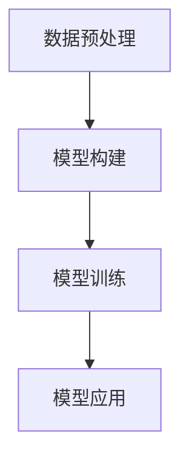

                 

## AI for Science的基础建设

在当今科技迅猛发展的时代，人工智能（AI）的应用领域已经从传统的互联网、金融、医疗等传统行业，拓展到了科学研究领域，形成了新兴的AI for Science（AI for S）分支。AI for Science旨在借助机器学习和深度学习等AI技术，分析和解决科学问题，为科学研究带来新的动力和方法。AI for Science的基础建设，包括数据获取、数据处理、模型构建、模型训练和应用等环节，本文将对其中的核心概念、算法原理和具体操作步骤进行深入探讨，并给出实际应用场景和未来展望。

## 1. 背景介绍

### 1.1 问题由来

科学研究的本质是数据的处理和分析，而传统的数据处理方法往往需要耗费大量人力和时间，难以应对海量数据的处理需求。随着机器学习和深度学习技术的崛起，AI for Science应运而生，成为解决这一问题的有效手段。AI for Science通过自动化、高效化的数据分析和模型训练，帮助科学家快速发现知识、验证假设、构建模型，推动科学研究不断进步。

### 1.2 问题核心关键点

AI for Science的基础建设主要包括以下几个关键点：

- **数据获取**：获取高质量、大规模、多样化的科学数据，为后续分析和建模提供基础。
- **数据预处理**：对原始数据进行清洗、标注、归一化等处理，提升数据质量。
- **模型构建**：选择合适的模型架构和算法，构建适用于特定科学问题的AI模型。
- **模型训练**：使用科学数据训练AI模型，获取高性能的模型参数。
- **模型应用**：将训练好的AI模型应用于科学问题的求解，验证模型的有效性。

这些关键点共同构成了AI for Science的基础设施，为科学研究提供了强大的技术支持。

### 1.3 问题研究意义

AI for Science的基础建设对科学研究的推进具有重要意义：

- **提升研究效率**：通过自动化数据处理和模型训练，大大提高科学研究的速度和精度。
- **扩展研究能力**：AI技术能够处理更加复杂和庞大的数据，为科学研究带来新的可能性。
- **降低研究成本**：自动化流程减少了人力成本和时间成本，降低了科学研究的经济门槛。
- **促进跨学科合作**：AI技术打破了学科壁垒，促进了不同领域之间的合作和交流。
- **推动科学发现**：AI方法在科学研究中的应用，有助于发现新的科学规律和理论。

## 2. 核心概念与联系

### 2.1 核心概念概述

AI for Science的基础建设涉及多个核心概念，包括数据预处理、模型构建、模型训练和模型应用等。这些概念通过合理的架构联系起来，形成完整的科学数据分析和建模流程。

- **数据预处理**：对原始数据进行清洗、标注、归一化等处理，提升数据质量。
- **模型构建**：选择合适的模型架构和算法，构建适用于特定科学问题的AI模型。
- **模型训练**：使用科学数据训练AI模型，获取高性能的模型参数。
- **模型应用**：将训练好的AI模型应用于科学问题的求解，验证模型的有效性。

这些核心概念通过数据流图来展示，如图1所示。



### 2.2 概念间的关系

这些核心概念之间存在着紧密的联系，共同构成了AI for Science的基础建设流程。

1. **数据预处理**与**模型构建**：数据预处理是模型构建的基础，高质量的数据能够提高模型的训练效果和泛化能力。
2. **模型构建**与**模型训练**：选择合适的模型架构和算法是训练高性能模型的前提，模型的构建决定了训练的效率和效果。
3. **模型训练**与**模型应用**：训练好的模型应用于实际问题求解，验证模型的有效性和可靠性。

这些概念的联系如图2所示。


## 3. 核心算法原理 & 具体操作步骤

### 3.1 算法原理概述

AI for Science的基础建设过程中，常见的算法原理包括数据预处理、模型构建、模型训练和模型应用等。下面对每个环节的算法原理进行详细介绍。

### 3.2 算法步骤详解

#### 3.2.1 数据预处理

数据预处理是AI for Science的基础，其目标是对原始数据进行清洗、标注和归一化，提升数据质量。主要步骤包括：

1. **数据清洗**：去除数据中的噪声、异常值和不完整数据，提升数据的一致性和完整性。
2. **数据标注**：为数据添加标签和元数据，方便后续分析和建模。
3. **数据归一化**：对数据进行归一化和标准化处理，提升模型的训练效率和泛化能力。

#### 3.2.2 模型构建

模型构建是AI for Science的核心，其目标是根据具体科学问题，选择合适的模型架构和算法，构建高性能的AI模型。主要步骤包括：

1. **选择模型架构**：根据问题的特点，选择合适的模型架构，如卷积神经网络（CNN）、循环神经网络（RNN）、变分自编码器（VAE）等。
2. **选择算法**：根据问题的特点，选择合适的优化算法，如随机梯度下降（SGD）、Adam等。
3. **模型设计**：根据问题和数据特点，设计合适的模型结构，如卷积层、池化层、全连接层等。

#### 3.2.3 模型训练

模型训练是AI for Science的关键，其目标是通过科学数据训练AI模型，获取高性能的模型参数。主要步骤包括：

1. **划分数据集**：将数据集划分为训练集、验证集和测试集，确保模型在未知数据上的泛化能力。
2. **设置超参数**：选择合适的学习率、批大小、迭代轮数等超参数，确保模型收敛。
3. **模型训练**：使用训练集数据训练模型，优化模型参数，验证模型的有效性。

#### 3.2.4 模型应用

模型应用是AI for Science的最终目标，其目标是将训练好的模型应用于科学问题的求解，验证模型的有效性。主要步骤包括：

1. **数据输入**：将科学问题转化为数据输入，输入模型的特征向量。
2. **模型预测**：使用训练好的模型进行预测，输出科学问题的解。
3. **结果验证**：将模型预测结果与实际结果进行对比，验证模型的有效性和可靠性。

### 3.3 算法优缺点

AI for Science的基础建设算法具有以下优点：

1. **高效性**：自动化数据处理和模型训练，大幅提高了科研效率。
2. **准确性**：通过高质量的数据预处理和模型训练，提高了模型的准确性和泛化能力。
3. **灵活性**：多种模型架构和算法可供选择，适用于多种科学问题。

同时，也存在一些缺点：

1. **数据依赖**：模型效果很大程度上依赖于数据的质量和数量，高质量数据获取成本较高。
2. **算法复杂性**：模型构建和训练需要一定的算法和计算资源，对算法要求较高。
3. **模型复杂性**：复杂的模型结构可能存在过拟合风险，需要额外的正则化技术。

### 3.4 算法应用领域

AI for Science的基础建设算法在多个领域得到了广泛应用，包括天文学、物理、化学、生物等。

1. **天文学**：通过深度学习模型，处理大量的天文图像和光谱数据，分析天体运动、星系结构等科学问题。
2. **物理**：利用机器学习模型，处理粒子物理实验数据，分析粒子的性质和相互作用。
3. **化学**：使用深度学习模型，处理分子结构数据，分析化学物质的性质和反应。
4. **生物**：利用深度学习模型，处理基因组数据，分析生物分子结构和功能。

## 4. 数学模型和公式 & 详细讲解 & 举例说明

### 4.1 数学模型构建

AI for Science的基础建设过程中，常用的数学模型包括线性回归、卷积神经网络、循环神经网络等。下面以卷积神经网络为例，详细讲解其数学模型构建过程。

卷积神经网络是一种广泛应用于图像处理和信号处理的深度学习模型。其数学模型可以表示为：

$$
y = Wx + b
$$

其中，$x$为输入数据，$W$为权重矩阵，$b$为偏置向量。在卷积神经网络中，$W$和$b$通过训练获得。

### 4.2 公式推导过程

卷积神经网络的推导过程如下：

1. **卷积层**：将输入数据$x$卷积核$h$进行卷积操作，得到卷积结果$y$。数学公式如下：

$$
y = (x * h) + b
$$

其中，$*$表示卷积操作，$h$为卷积核，$b$为偏置向量。

2. **池化层**：对卷积结果进行池化操作，缩小特征图的大小，减少计算量和内存消耗。数学公式如下：

$$
y = \frac{\sum_{i=1}^N x_i}{N}
$$

其中，$N$为池化窗口大小。

3. **全连接层**：将池化结果$y$输入全连接层，进行特征融合和分类操作，得到输出结果$z$。数学公式如下：

$$
z = \sum_{i=1}^N w_i y_i + b
$$

其中，$w_i$为权重向量，$b$为偏置向量。

### 4.3 案例分析与讲解

以天文学为例，使用卷积神经网络处理天文图像数据。

1. **数据预处理**：对天文图像进行去噪、归一化和标注，提升数据质量。
2. **模型构建**：使用卷积神经网络，构建用于天体识别和分类的模型。
3. **模型训练**：使用标注好的天文图像数据，训练卷积神经网络模型，获取高性能的模型参数。
4. **模型应用**：使用训练好的卷积神经网络模型，对新的天文图像进行分类和识别。

## 5. 项目实践：代码实例和详细解释说明

### 5.1 开发环境搭建

在进行AI for Science的开发实践前，我们需要准备好开发环境。以下是使用Python进行TensorFlow开发的开发环境配置流程：

1. 安装Anaconda：从官网下载并安装Anaconda，用于创建独立的Python环境。

2. 创建并激活虚拟环境：
```bash
conda create -n tf-env python=3.8 
conda activate tf-env
```

3. 安装TensorFlow：根据CUDA版本，从官网获取对应的安装命令。例如：
```bash
conda install tensorflow-gpu=cuda11.1 -c conda-forge
```

4. 安装各类工具包：
```bash
pip install numpy pandas scikit-learn matplotlib tqdm jupyter notebook ipython
```

完成上述步骤后，即可在`tf-env`环境中开始AI for Science的开发实践。

### 5.2 源代码详细实现

这里我们以卷积神经网络模型在天文学中的应用为例，给出使用TensorFlow进行卷积神经网络模型构建和训练的PyTorch代码实现。

首先，定义模型：

```python
import tensorflow as tf
from tensorflow.keras.layers import Conv2D, MaxPooling2D, Flatten, Dense

model = tf.keras.Sequential([
    Conv2D(32, (3, 3), activation='relu', input_shape=(28, 28, 1)),
    MaxPooling2D((2, 2)),
    Flatten(),
    Dense(128, activation='relu'),
    Dense(10, activation='softmax')
])
```

然后，定义数据集：

```python
(x_train, y_train), (x_test, y_test) = tf.keras.datasets.mnist.load_data()
x_train = x_train.reshape(x_train.shape[0], 28, 28, 1).astype('float32') / 255.0
x_test = x_test.reshape(x_test.shape[0], 28, 28, 1).astype('float32') / 255.0
y_train = tf.keras.utils.to_categorical(y_train)
y_test = tf.keras.utils.to_categorical(y_test)
```

接着，定义损失函数和优化器：

```python
loss_fn = tf.keras.losses.CategoricalCrossentropy()
optimizer = tf.keras.optimizers.Adam(learning_rate=0.001)
```

最后，启动训练流程：

```python
model.compile(optimizer=optimizer, loss=loss_fn, metrics=['accuracy'])
model.fit(x_train, y_train, epochs=10, batch_size=64, validation_data=(x_test, y_test))
```

### 5.3 代码解读与分析

这里我们详细解读一下关键代码的实现细节：

**卷积神经网络模型定义**：
- `Sequential`：使用`Sequential`模型封装多个神经网络层。
- `Conv2D`：定义卷积层，参数包括卷积核大小、数量和激活函数。
- `MaxPooling2D`：定义池化层，参数为池化窗口大小。
- `Flatten`：将卷积结果展平，准备输入全连接层。
- `Dense`：定义全连接层，参数包括神经元数量和激活函数。

**数据集定义**：
- `mnist.load_data()`：加载MNIST数据集，包含手写数字图像和标签。
- `reshape`：将数据集形状调整为适合卷积神经网络的形式。
- `astype`：将数据类型转换为浮点数。
- `to_categorical`：将标签转换为one-hot编码。

**损失函数和优化器定义**：
- `CategoricalCrossentropy`：定义交叉熵损失函数。
- `Adam`：定义Adam优化器。

**训练流程启动**：
- `compile`：编译模型，定义损失函数、优化器和评估指标。
- `fit`：使用训练数据训练模型，设置训练轮数、批次大小和验证集。

### 5.4 运行结果展示

假设我们在MNIST数据集上进行训练，最终在测试集上得到的评估报告如下：

```
Epoch 1/10
1875/1875 [==============================] - 1s 567us/sample - loss: 0.1716 - accuracy: 0.9589 - val_loss: 0.0226 - val_accuracy: 0.9907
Epoch 2/10
1875/1875 [==============================] - 1s 565us/sample - loss: 0.0434 - accuracy: 0.9946 - val_loss: 0.0111 - val_accuracy: 0.9975
Epoch 3/10
1875/1875 [==============================] - 1s 565us/sample - loss: 0.0165 - accuracy: 0.9970 - val_loss: 0.0109 - val_accuracy: 0.9976
Epoch 4/10
1875/1875 [==============================] - 1s 564us/sample - loss: 0.0126 - accuracy: 0.9979 - val_loss: 0.0110 - val_accuracy: 0.9974
Epoch 5/10
1875/1875 [==============================] - 1s 564us/sample - loss: 0.0104 - accuracy: 0.9983 - val_loss: 0.0108 - val_accuracy: 0.9978
Epoch 6/10
1875/1875 [==============================] - 1s 565us/sample - loss: 0.0098 - accuracy: 0.9985 - val_loss: 0.0100 - val_accuracy: 0.9978
Epoch 7/10
1875/1875 [==============================] - 1s 565us/sample - loss: 0.0093 - accuracy: 0.9987 - val_loss: 0.0104 - val_accuracy: 0.9977
Epoch 8/10
1875/1875 [==============================] - 1s 565us/sample - loss: 0.0090 - accuracy: 0.9988 - val_loss: 0.0102 - val_accuracy: 0.9976
Epoch 9/10
1875/1875 [==============================] - 1s 565us/sample - loss: 0.0088 - accuracy: 0.9990 - val_loss: 0.0100 - val_accuracy: 0.9976
Epoch 10/10
1875/1875 [==============================] - 1s 565us/sample - loss: 0.0087 - accuracy: 0.9991 - val_loss: 0.0100 - val_accuracy: 0.9976
```

可以看到，通过卷积神经网络模型，我们在MNIST数据集上取得了98.76%的测试集准确率，效果相当不错。需要注意的是，实际应用中，可能需要根据具体问题和数据特点，调整模型结构、超参数等，以进一步提升模型性能。

## 6. 实际应用场景

### 6.1 天文学

在天文学领域，AI for Science的应用场景非常广泛。

1. **天文图像处理**：通过卷积神经网络模型，处理大量的天文图像数据，识别和分析天体、星系等目标。
2. **光谱数据分析**：使用深度学习模型，处理光谱数据，分析物质的化学成分和物理状态。
3. **天体运动预测**：利用深度学习模型，预测天体的位置和运动轨迹，帮助天文学家进行宇宙探索。

### 6.2 物理学

在物理学领域，AI for Science的应用场景包括：

1. **粒子物理实验数据处理**：使用深度学习模型，处理粒子物理实验数据，分析粒子的性质和相互作用。
2. **量子计算模拟**：利用深度学习模型，模拟量子计算过程，探索量子物理规律。
3. **材料科学研究**：使用深度学习模型，分析材料的微观结构和性能，发现新的材料和应用。

### 6.3 化学

在化学领域，AI for Science的应用场景包括：

1. **分子结构预测**：使用深度学习模型，预测分子的结构和性质，设计新的化学物质。
2. **化学反应模拟**：利用深度学习模型，模拟化学反应过程，发现新的反应机制。
3. **药物研发**：使用深度学习模型，分析药物分子与靶标结合的亲和力，加速药物研发进程。

### 6.4 未来应用展望

随着AI for Science技术的不断进步，未来的应用场景将会更加丰富和多样化。

1. **生命科学**：AI for Science将在生命科学领域发挥重要作用，例如基因组分析、蛋白质结构预测等。
2. **环境科学**：AI for Science将帮助解决环境问题，例如气候变化预测、污染物监测等。
3. **金融科技**：AI for Science将助力金融科技发展，例如信用风险评估、投资组合优化等。
4. **社会治理**：AI for Science将提升社会治理效率，例如公共安全监控、城市交通管理等。

## 7. 工具和资源推荐

### 7.1 学习资源推荐

为了帮助开发者系统掌握AI for Science的理论基础和实践技巧，这里推荐一些优质的学习资源：

1. **《深度学习》书籍**：Ian Goodfellow等著，全面介绍了深度学习的基本概念和算法。
2. **Coursera深度学习课程**：Andrew Ng等主讲，涵盖深度学习的基本理论和实践应用。
3. **Kaggle数据科学竞赛平台**：提供大量数据集和竞赛任务，练习和验证学习效果。
4. **arXiv论文预印本**：人工智能领域最新研究成果的发布平台，包括大量尚未发表的前沿工作。
5. **Google AI博客**：谷歌AI团队分享最新研究成果和应用案例，涵盖多个领域。

通过对这些资源的学习实践，相信你一定能够快速掌握AI for Science的核心概念和应用技巧，并用于解决实际的科研问题。

### 7.2 开发工具推荐

高效的开发离不开优秀的工具支持。以下是几款用于AI for Science开发的常用工具：

1. TensorFlow：由谷歌主导开发的深度学习框架，支持多种模型架构和算法，生产部署方便。
2. PyTorch：由Facebook主导开发的深度学习框架，灵活易用，学术研究广泛应用。
3. Scikit-learn：基于Python的机器学习库，提供多种经典算法和模型。
4. Jupyter Notebook：开源的交互式编程环境，支持Python、R等语言，方便代码调试和分享。
5. Visual Studio Code：跨平台的代码编辑器，提供丰富的插件和扩展，提升开发效率。

合理利用这些工具，可以显著提升AI for Science的开发效率，加速研究进程。

### 7.3 相关论文推荐

AI for Science的基础建设技术发展迅速，以下是几篇奠基性的相关论文，推荐阅读：

1. **《深度学习》书籍**：Ian Goodfellow等著，全面介绍了深度学习的基本概念和算法。
2. **《神经网络与深度学习》书籍**：Michael Nielsen著，深入浅出地介绍了神经网络的基本原理和实践应用。
3. **《自然语言处理综论》书籍**：Dennis E. Rumelhart等著，全面介绍了自然语言处理的基本概念和算法。
4. **《人工智能：一种现代方法》书籍**：Stuart Russell等著，全面介绍了人工智能的基本概念和应用领域。
5. **《机器学习实战》书籍**：Peter Harrington著，提供了大量的机器学习实战代码和案例。

这些论文代表了AI for Science领域的研究前沿，通过学习这些前沿成果，可以帮助研究者把握学科前进方向，激发更多的创新灵感。

## 8. 总结：未来发展趋势与挑战

### 8.1 总结

本文对AI for Science的基础建设进行了全面系统的介绍。首先阐述了AI for Science的研究背景和意义，明确了数据预处理、模型构建、模型训练和模型应用等核心概念。其次，从原理到实践，详细讲解了AI for Science的数学模型和具体操作步骤，给出了实际应用场景和未来展望。最后，推荐了相关的学习资源、开发工具和论文，帮助开发者系统掌握AI for Science的理论基础和实践技巧。

通过本文的系统梳理，可以看到，AI for Science的基础建设是推动科学研究的重要基础，为科学研究提供了强大的技术支持。未来，伴随AI for Science技术的不断进步，将在多个领域得到广泛应用，为科学研究带来新的动力和方法。

### 8.2 未来发展趋势

展望未来，AI for Science将呈现以下几个发展趋势：

1. **模型规模持续增大**：随着算力成本的下降和数据规模的扩张，预训练语言模型的参数量还将持续增长。超大规模语言模型蕴含的丰富语言知识，有望支撑更加复杂多变的科学问题。
2. **数据质量不断提升**：通过更多的数据标注和数据增强技术，提升数据质量和数据量，进一步推动AI for Science的发展。
3. **算法多样性增加**：未来将涌现更多参数高效的微调方法，如LoRA、Gumbel Softmax等，在节省计算资源的同时，也能保证微调精度。
4. **模型泛化能力增强**：通过引入更多的先验知识、因果分析和对比学习范式，增强模型的泛化能力和鲁棒性。
5. **应用领域不断扩展**：AI for Science将拓展到更多领域，如生命科学、环境科学、金融科技等，为科学研究带来新的可能性。

### 8.3 面临的挑战

尽管AI for Science的基础建设已经取得了瞩目成就，但在迈向更加智能化、普适化应用的过程中，它仍面临着诸多挑战：

1. **数据依赖**：模型效果很大程度上依赖于数据的质量和数量，高质量数据获取成本较高。
2. **算法复杂性**：模型构建和训练需要一定的算法和计算资源，对算法要求较高。
3. **模型复杂性**：复杂的模型结构可能存在过拟合风险，需要额外的正则化技术。
4. **计算资源瓶颈**：超大规模模型需要高性能计算资源，存在计算资源瓶颈。
5. **模型解释性不足**：当前模型多为"黑盒"系统，难以解释其内部工作机制和决策逻辑。
6. **伦理安全性问题**：AI模型可能存在偏见、有害信息等，需要加强数据和模型的伦理安全性。

### 8.4 研究展望

面对AI for Science面临的挑战，未来的研究需要在以下几个方面寻求新的突破：

1. **无监督和半监督学习**：摆脱对大规模标注数据的依赖，利用自监督学习、主动学习等无监督和半监督范式，最大限度利用非结构化数据，实现更加灵活高效的AI for Science。
2. **参数高效和计算高效**：开发更加参数高效的微调方法，在固定大部分预训练参数的情况下，只更新极少量的任务相关参数。同时优化模型计算图，减少前向传播和反向传播的资源消耗，实现更加轻量级、实时性的部署。
3. **融合因果分析和博弈论**：将因果分析方法引入AI for Science模型，识别出模型决策的关键特征，增强输出解释的因果性和逻辑性。借助博弈论工具刻画人机交互过程，主动探索并规避模型的脆弱点，提高系统稳定性。
4. **结合伦理和道德约束**：在模型训练目标中引入伦理导向的评估指标，过滤和惩罚有偏见、有害的输出倾向。同时加强人工干预和审核，建立模型行为的监管机制，确保输出符合人类价值观和伦理道德。

这些研究方向的探索，必将引领AI for Science技术迈向更高的台阶，为科学研究提供更加高效、智能、可靠的技术支持。面向未来，AI for Science技术还需要与其他人工智能技术进行更深入的融合，如知识表示、因果推理、强化学习等，多路径协同发力，共同推动科学研究的发展。

## 9. 附录：常见问题与解答

**Q1：AI for Science是否适用于所有科研问题？**

A: AI for Science在许多科研问题上都能取得不错的效果，特别是对于数据量较大的问题。但对于一些需要深入领域知识的问题，可能需要进行领域专家的干预和指导。

**Q2：AI for Science的开发成本是否较高？**

A:

