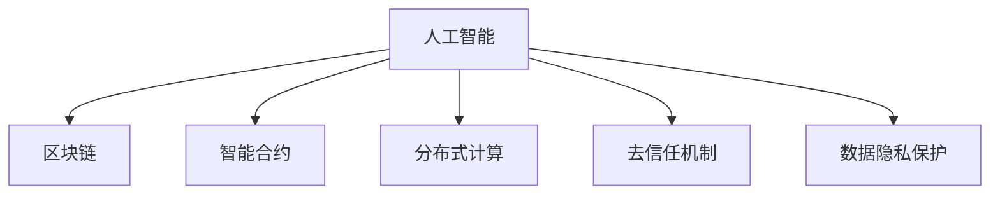
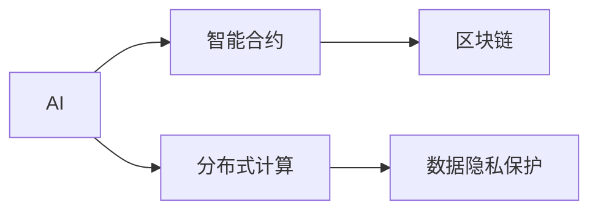
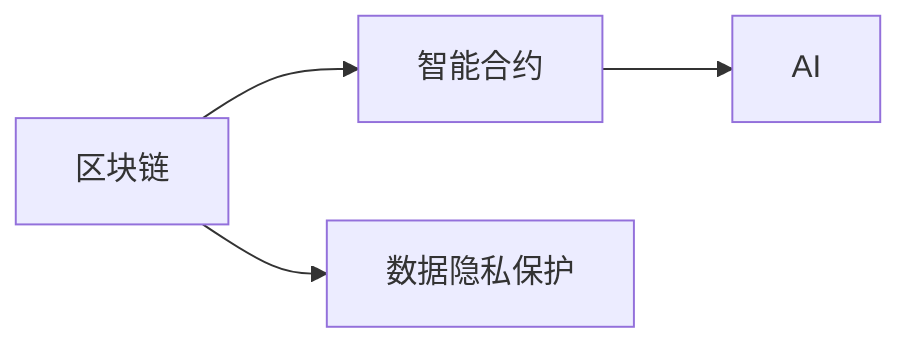
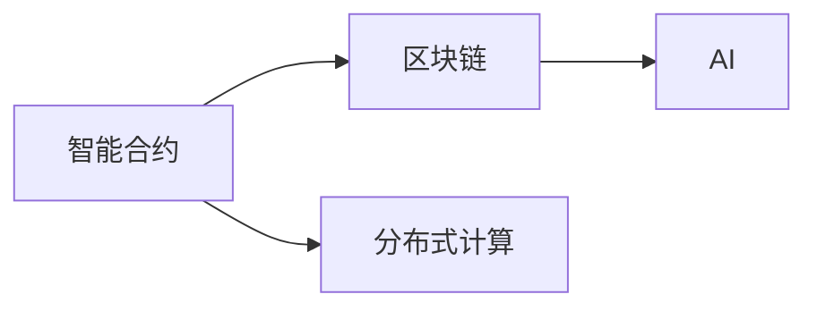
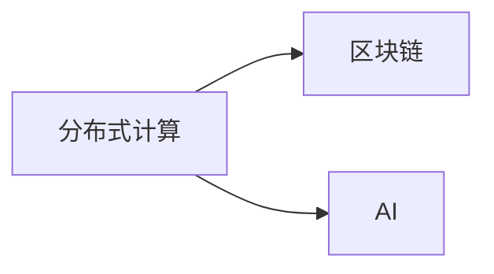
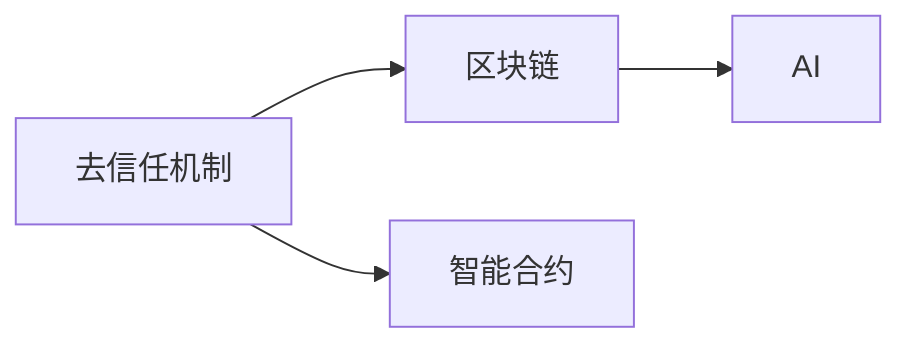
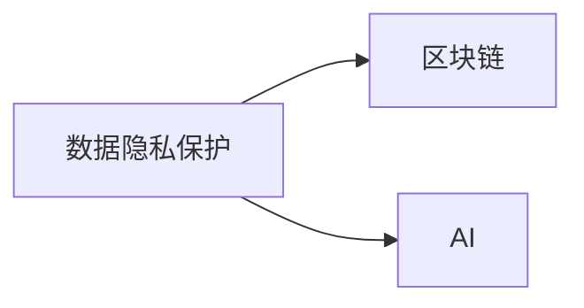
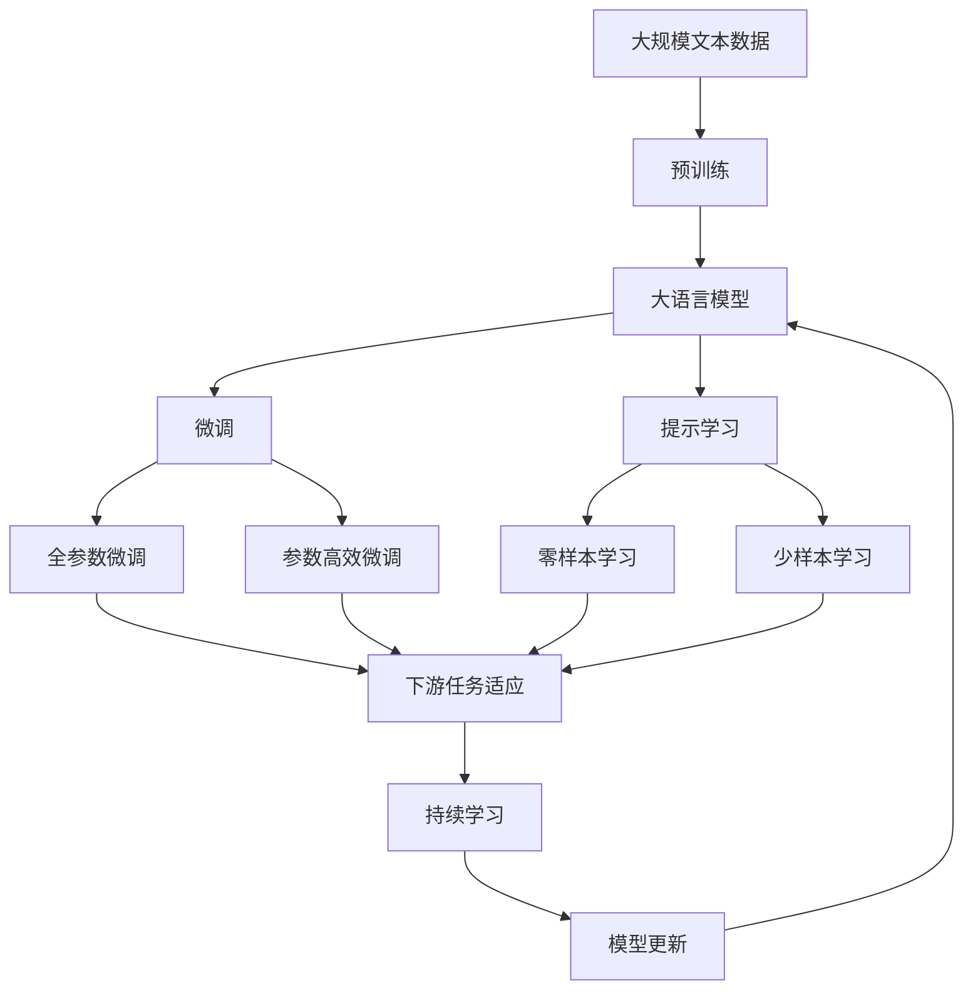

                 

# AI 与区块链的协同：构建可信的 AI 生态

> 关键词：AI, 区块链, 数据安全, 智能合约, 去中心化, 隐私保护, 去信任机制, 分布式计算

## 1. 背景介绍

### 1.1 问题由来
近年来，人工智能(AI)和区块链技术各自在学术界和产业界引起了广泛关注。AI技术通过深度学习、自然语言处理等方法，实现了对海量数据的自动分析与决策，极大地提升了各行业的运营效率和业务创新能力。而区块链技术通过去中心化、不可篡改的数据记录机制，保障了数据的安全性和可靠性。

尽管AI和区块链各自具有显著优势，但在实际应用中，两者存在显著的互补性。AI可以提升区块链的智能合约执行效率，而区块链可以保障AI在数据获取、处理和应用中的安全和可信。因此，AI与区块链的协同应用，能够为各行业提供更为安全、可靠、高效的智能化解决方案。

### 1.2 问题核心关键点
AI与区块链协同应用的核心在于如何构建一个可信的AI生态。具体包括以下几个关键点：

- 数据安全：区块链通过分布式账本和共识机制，保障数据的不可篡改性和安全性，为AI模型训练和应用提供安全的数据环境。
- 智能合约：区块链可以自动化执行AI模型构建的智能合约，降低人工干预和计算开销。
- 去信任机制：区块链通过数字身份和分布式共识，建立一种无需信任的信任机制，确保AI应用在去中心化环境中的可信性。
- 分布式计算：AI模型的训练和推理可以借助区块链的分布式计算能力，实现高效的协同计算和资源共享。

### 1.3 问题研究意义
AI与区块链的协同应用，对构建可信的AI生态具有重要意义：

1. 提升数据安全：区块链的分布式账本和共识机制，可以保障数据的安全性和完整性，避免数据泄露和篡改风险。
2. 降低信任成本：区块链的去信任机制，可以减少对中间机构的依赖，降低信任建立和维护的成本。
3. 提高执行效率：智能合约的自动执行功能，可以提升AI模型的应用效率，减少人工干预。
4. 拓展应用范围：分布式计算和智能合约的结合，可以实现AI在去中心化环境中的应用，拓展AI技术的落地场景。

## 2. 核心概念与联系

### 2.1 核心概念概述

为了更好地理解AI与区块链的协同应用，本节将介绍几个密切相关的核心概念：

- 人工智能(AI)：通过机器学习、深度学习等技术，使计算机能够从数据中学习、推理和决策的智能技术。
- 区块链(Blockchain)：一种分布式账本技术，通过去中心化、不可篡改的记录机制，保障数据的安全性和可靠性。
- 智能合约(Smart Contract)：一种在区块链上自动执行、无需人工干预的合约，通过代码实现合约条款和执行逻辑。
- 分布式计算(Distributed Computing)：将计算任务分布在多台计算机上进行协同计算，提升计算效率和资源利用率。
- 去信任机制(Trustless Mechanism)：通过数字身份和共识机制，建立一种无需信任的信任机制，确保系统透明和可信。
- 数据隐私保护(Privacy Preservation)：保护数据在获取、处理和应用中的隐私和安全，避免数据滥用和泄露。

这些核心概念之间的逻辑关系可以通过以下Mermaid流程图来展示：



这个流程图展示了大语言模型微调过程中各个核心概念的关系和作用：

1. AI在区块链上进行智能合约和分布式计算，确保数据安全和高效处理。
2. 区块链提供去信任机制和数据隐私保护，保障AI应用的可信性和数据安全。
3. 智能合约和分布式计算结合，拓展AI应用场景，提升系统效率。

### 2.2 概念间的关系

这些核心概念之间存在着紧密的联系，形成了AI与区块链协同应用的完整生态系统。下面我们通过几个Mermaid流程图来展示这些概念之间的关系。

#### 2.2.1 AI在区块链上的应用



这个流程图展示了AI在区块链上的应用过程。AI模型可以借助智能合约和分布式计算，在区块链上进行高效的智能合约执行和数据处理。同时，区块链通过数据隐私保护机制，保障AI应用的数据安全。

#### 2.2.2 区块链在AI中的应用



这个流程图展示了区块链在AI中的应用。区块链通过智能合约和分布式计算，为AI提供可信的数据源和高效的数据处理能力。同时，区块链通过去信任机制和数据隐私保护，保障AI应用的可信性和数据安全。

#### 2.2.3 智能合约在AI中的应用



这个流程图展示了智能合约在AI中的应用。智能合约可以在区块链上自动执行AI模型的推理和决策，提升AI应用的高效性和可靠性。同时，智能合约通过分布式计算，实现多台计算机的协同计算和资源共享。

#### 2.2.4 分布式计算在AI中的应用



这个流程图展示了分布式计算在AI中的应用。分布式计算可以在区块链上实现高效的协同计算，提升AI模型训练和推理的速度和效率。同时，区块链提供去信任机制和数据隐私保护，保障分布式计算的安全性和可靠性。

#### 2.2.5 去信任机制在AI中的应用



这个流程图展示了去信任机制在AI中的应用。去信任机制通过区块链的共识机制和数字身份，建立一种无需信任的信任机制，确保AI应用在去中心化环境中的可信性。同时，智能合约通过自动执行功能，提升AI应用的效率和可靠性。

#### 2.2.6 数据隐私保护在AI中的应用



这个流程图展示了数据隐私保护在AI中的应用。数据隐私保护通过区块链的分布式账本和共识机制，保障AI应用中的数据安全和隐私。同时，区块链提供去信任机制和智能合约，确保数据获取和处理的透明性和可信性。

### 2.3 核心概念的整体架构

最后，我们用一个综合的流程图来展示这些核心概念在大语言模型微调过程中的整体架构：



这个综合流程图展示了从预训练到微调，再到持续学习的完整过程。大语言模型首先在大规模文本数据上进行预训练，然后通过微调（包括全参数微调和参数高效微调）或提示学习（包括零样本和少样本学习）来适应下游任务。最后，通过持续学习技术，模型可以不断更新和适应新的任务和数据。 通过这些流程图，我们可以更清晰地理解大语言模型微调过程中各个核心概念的关系和作用。

## 3. 核心算法原理 & 具体操作步骤
### 3.1 算法原理概述

AI与区块链协同应用的本质是利用区块链的分布式账本、共识机制、智能合约等特性，提升AI数据获取、处理和应用的效率、安全和可信度。具体来说，区块链可以为AI提供以下核心功能：

1. 数据安全：区块链通过分布式账本和共识机制，保障数据的安全性和完整性。
2. 智能合约：区块链可以自动化执行AI模型构建的智能合约，降低人工干预和计算开销。
3. 去信任机制：区块链通过数字身份和分布式共识，建立一种无需信任的信任机制，确保AI应用在去中心化环境中的可信性。
4. 分布式计算：区块链提供分布式计算能力，实现多台计算机的协同计算和资源共享。

这些功能的结合，使得AI与区块链协同应用在数据安全、智能合约执行、去信任机制和分布式计算等方面具备显著优势。

### 3.2 算法步骤详解

AI与区块链协同应用的一般流程包括以下几个关键步骤：

**Step 1: 准备区块链环境**

- 选择合适的区块链平台（如Ethereum、Hyperledger等），并搭建好区块链网络。
- 设计智能合约代码，包括数据获取、处理和应用的逻辑。
- 部署智能合约到区块链网络，确保其安全性和可靠性。

**Step 2: 数据安全与隐私保护**

- 将AI需要的数据上传到区块链网络，使用数字身份和加密技术保护数据隐私。
- 利用区块链的共识机制，确保数据的不可篡改性和完整性。
- 在智能合约中设计数据访问控制策略，限制数据访问权限。

**Step 3: 智能合约与AI模型集成**

- 将AI模型集成到智能合约中，实现自动推理和决策。
- 设计智能合约的触发条件和执行逻辑，确保AI模型的应用场景。
- 优化智能合约的计算效率，降低计算开销。

**Step 4: 分布式计算与模型优化**

- 利用区块链的分布式计算能力，进行多台计算机的协同计算。
- 设计分布式计算的算法和优化策略，提高计算效率和资源利用率。
- 对AI模型进行参数优化和结构调整，适应分布式计算环境。

**Step 5: 去信任机制与模型可信性**

- 利用区块链的去信任机制，建立无需信任的信任环境。
- 设计数字身份和身份验证机制，确保AI应用中的参与者可信。
- 利用区块链的共识机制，确保AI应用过程的透明性和可信性。

**Step 6: 持续学习与模型更新**

- 收集AI应用中的反馈数据，进行持续学习和模型更新。
- 利用区块链的智能合约和分布式计算，进行高效的学习和更新。
- 定期评估AI应用效果，确保其长期稳定性和适用性。

以上是AI与区块链协同应用的一般流程。在实际应用中，还需要针对具体任务的特点，对各环节进行优化设计，如改进智能合约代码、设计数据访问控制策略、优化分布式计算算法等，以进一步提升AI应用的效率和可靠性。

### 3.3 算法优缺点

AI与区块链协同应用具有以下优点：

1. 数据安全：区块链通过分布式账本和共识机制，保障数据的安全性和完整性。
2. 智能合约：区块链可以自动化执行AI模型构建的智能合约，降低人工干预和计算开销。
3. 去信任机制：区块链通过数字身份和分布式共识，建立一种无需信任的信任机制，确保AI应用在去中心化环境中的可信性。
4. 分布式计算：区块链提供分布式计算能力，实现多台计算机的协同计算和资源共享。

同时，该方法也存在以下缺点：

1. 技术门槛高：区块链和AI技术的结合需要开发者具备跨领域的技术能力和实践经验。
2. 成本高：区块链的部署、维护和智能合约的开发成本较高。
3. 可扩展性差：现有区块链平台可能存在可扩展性问题，难以支持大规模数据和复杂计算任务。
4. 治理复杂：区块链的去信任机制需要设计合理的治理机制，避免系统漏洞和攻击。

尽管存在这些局限性，但就目前而言，AI与区块链的协同应用仍是大规模数据处理和复杂任务执行的重要手段。未来相关研究的重点在于如何进一步降低技术门槛，提高系统的可扩展性和治理效率，同时兼顾数据安全和隐私保护。

### 3.4 算法应用领域

AI与区块链的协同应用，已经在诸多领域得到了应用，覆盖了几乎所有常见场景，例如：

- 供应链管理：通过区块链记录和验证供应链数据，提升供应链的透明度和可信性。
- 金融交易：利用区块链的智能合约和分布式计算，实现自动化的金融交易和结算。
- 医疗健康：通过区块链保障医疗数据的隐私和安全，提升医疗服务的可信性和效率。
- 版权保护：利用区块链的数字身份和共识机制，确保版权信息的真实性和可信性。
- 社交网络：通过区块链记录和验证社交数据，提升社交平台的可信性和用户隐私保护。
- 城市治理：通过区块链记录和验证城市数据，提升城市管理的透明度和可信性。

除了上述这些经典应用外，AI与区块链的协同应用还在更多场景中得到创新性地应用，如可控智能合约、去中心化存储、跨链数据交换等，为各行业带来了新的突破。随着区块链和AI技术的不断进步，相信其结合将在更广泛的领域大放异彩。

## 4. 数学模型和公式 & 详细讲解  
### 4.1 数学模型构建

本节将使用数学语言对AI与区块链协同应用的过程进行更加严格的刻画。

记区块链网络为 $N=\{V,E\}$，其中 $V$ 为节点集合，$E$ 为边集合。设智能合约函数为 $C:\{0,1\}^n \rightarrow \{0,1\}^m$，其中 $n$ 为输入数据维度，$m$ 为输出数据维度。设AI模型为 $M:\mathbb{R}^n \rightarrow \mathbb{R}^m$，其中 $n$ 为输入数据维度，$m$ 为输出数据维度。

定义智能合约的执行函数为 $E:C(U)$，其中 $U$ 为输入数据集，$C(U)$ 为智能合约的执行结果。

在智能合约中，定义数据访问策略函数为 $P:C(U)\rightarrow \{0,1\}^k$，其中 $k$ 为访问权限向量维度，$P=(p_1,p_2,\ldots,p_k)$。

在区块链中，定义数据隐私保护函数为 $S:\mathbb{R}^n \rightarrow \mathbb{R}^n$，其中 $S$ 为数据加密和解密函数。

数学模型的构建可以如下：

$$
E(C(U))=\sum_{i=1}^{n} \left[ \sum_{j=1}^{m} M_{j,i}(X_i) \right]
$$

其中 $X_i$ 为智能合约的输入数据，$M_{j,i}$ 为AI模型的第 $j$ 个神经元对第 $i$ 个输入数据的权重。

### 4.2 公式推导过程

以下我们以智能合约在金融交易中的应用为例，推导智能合约函数 $C(U)$ 和数据访问策略函数 $P(U)$ 的计算公式。

假设智能合约 $C(U)$ 需要验证交易是否合法，输入数据集 $U$ 包括交易金额、交易时间、交易双方等。

定义智能合约函数为：

$$
C(U)=\begin{cases}
1, & \text{if all transaction details are valid and legal}\\
0, & \text{otherwise}
\end{cases}
$$

其中，智能合约函数的输入数据集 $U=(U_1,U_2,\ldots,U_n)$，其中 $U_1$ 为交易金额，$U_2$ 为交易时间，$U_3$ 为交易双方等。

智能合约的执行函数 $E(C(U))$ 可以定义为：

$$
E(C(U))=\begin{cases}
1, & \text{if $C(U)=1$}\\
0, & \text{otherwise}
\end{cases}
$$

在智能合约中，定义数据访问策略函数 $P(U)$ 为：

$$
P(U)=\begin{cases}
1, & \text{if $U_1>0$}\\
0, & \text{otherwise}
\end{cases}
$$

其中，$U_1$ 为交易金额，$P(U)$ 为数据访问策略函数的输入数据集 $U=(U_1,U_2,\ldots,U_n)$。

数据访问策略函数的输出结果为 $P(U)$，用于控制智能合约的执行。

### 4.3 案例分析与讲解

在实际应用中，智能合约和AI模型的集成可以通过以下案例进行说明：

#### 4.3.1 供应链管理

在供应链管理中，利用区块链记录和验证供应链数据，确保供应链的透明度和可信性。智能合约可以记录供应链的各个节点，确保供应链数据的真实性和不可篡改性。AI模型可以分析供应链数据，预测供应链的运营效率和风险。智能合约和AI模型的结合，可以实时监测供应链的运营状态，提升供应链的透明度和可信性。

#### 4.3.2 金融交易

在金融交易中，利用区块链记录和验证交易数据，确保交易的透明性和不可篡改性。智能合约可以自动执行交易逻辑，确保交易的合法性和合规性。AI模型可以分析交易数据，预测市场的走势和风险。智能合约和AI模型的结合，可以提升金融交易的效率和安全性。

#### 4.3.3 医疗健康

在医疗健康中，利用区块链记录和验证医疗数据，确保医疗数据的真实性和隐私性。智能合约可以记录和验证医疗数据的访问权限，确保数据的安全性和隐私性。AI模型可以分析医疗数据，预测疾病的风险和疗效。智能合约和AI模型的结合，可以提升医疗服务的透明性和可信性。

通过以上案例，可以看到，AI与区块链的协同应用可以在各领域实现高效的数据管理和智能决策，为各行业带来新的突破。

## 5. 项目实践：代码实例和详细解释说明
### 5.1 开发环境搭建

在进行AI与区块链协同应用开发前，我们需要准备好开发环境。以下是使用Python进行Hyperledger Fabric开发的环境配置流程：

1. 安装Hyperledger Fabric SDK：从官网下载并安装Hyperledger Fabric SDK，用于搭建和管理区块链网络。

2. 创建并激活虚拟环境：
```bash
conda create -n hfc-env python=3.8 
conda activate hfc-env
```

3. 安装Hyperledger Fabric：根据CUDA版本，从官网获取对应的安装命令。例如：
```bash
conda install hfc
```

4. 安装各类工具包：
```bash
pip install numpy pandas scikit-learn matplotlib tqdm jupyter notebook ipython
```

完成上述步骤后，即可在`hfc-env`环境中开始AI与区块链协同应用的开发。

### 5.2 源代码详细实现

下面我们以供应链管理为例，给出使用Hyperledger Fabric对AI模型进行协同应用的PyTorch代码实现。

首先，定义智能合约函数和数据访问策略函数：

```python
from hyperledger_fabric.framework import Chaincode
import hyperledger_fabric
import hyperledger_fabric.shim

class SupplyChainCC(Chaincode):
    def __init__(self, args):
        Chaincode.__init__(self, args)

    def init(self, stub):
        # 初始化智能合约
        pass

    def query(self, stub):
        # 查询智能合约状态
        pass

    def invoke(self, stub):
        # 执行智能合约操作
        args = stub.getArgs()
        result = ""
        # 处理数据访问策略
        if args[0] == 'query':
            result = self.query(stub, args)
        # 处理数据加密和解密
        if args[0] == 'encrypt':
            result = self.encrypt(stub, args)
        # 处理AI模型推理
        if args[0] == 'infer':
            result = self.infer(stub, args)
        return result

    def query(self, stub, args):
        # 查询智能合约状态
        return ""

    def encrypt(self, stub, args):
        # 数据加密和解密
        return ""

    def infer(self, stub, args):
        # AI模型推理
        return ""

# 定义数据访问策略函数
def access_policy(u, permissions):
    if permissions == "READ":
        return "u >= \"100\""
    elif permissions == "WRITE":
        return "u >= \"200\""
    else:
        return False
```

然后，定义AI模型函数和训练函数：

```python
from hyperledger_fabric.framework import Contract
import hyperledger_fabric
import hyperledger_fabric.shim

class AIModel(Contract):
    def __init__(self, args):
        Contract.__init__(self, args)

    def init(self, stub):
        # 初始化AI模型
        pass

    def query(self, stub):
        # 查询AI模型状态
        pass

    def invoke(self, stub):
        # 执行AI模型操作
        args = stub.getArgs()
        result = ""
        # 处理AI模型推理
        if args[0] == 'infer':
            result = self.infer(stub, args)
        # 处理数据访问策略
        if args[0] == 'access':
            result = self.access(stub, args)
        return result

    def query(self, stub, args):
        # 查询AI模型状态
        return ""

    def infer(self, stub, args):
        # AI模型推理
        return ""

    def access(self, stub, args):
        # 数据访问策略
        return ""

# 定义AI模型训练函数
def train_model(args):
    # 数据加载和预处理
    X_train = ...
    y_train = ...
    # 模型训练
    model.fit(X_train, y_train)
    # 模型保存
    model.save('model.pkl')
    # 数据加密和解密
    encrypted_data = ...
    decrypted_data = ...
    # AI模型推理
    result = model.predict(decrypted_data)
    return result
```

接着，定义智能合约与AI模型集成函数：

```python
from hyperledger_fabric.framework import Contract
import hyperledger_fabric
import hyperledger_fabric.shim

class SupplyChainAI(Contract):
    def __init__(self, args):
        Contract.__init__(self, args)

    def init(self, stub):
        # 初始化智能合约和AI模型
        pass

    def query(self, stub):
        # 查询智能合约和AI模型状态
        pass

    def invoke(self, stub):
        # 执行智能合约和AI模型操作
        args = stub.getArgs()
        result = ""
        # 处理数据访问策略
        if args[0] == 'query':
            result = self.query(stub, args)
        # 处理数据加密和解密
        if args[0] == 'encrypt':
            result = self.encrypt(stub, args)
        # 处理AI模型推理
        if args[0] == 'infer':
            result = self.infer(stub, args)
        return result

    def query(self, stub, args):
        # 查询智能合约和AI模型状态
        return ""

    def encrypt(self, stub, args):
        # 数据加密和解密
        return ""

    def infer(self, stub, args):
        # AI模型推理
        return ""

# 定义数据访问策略函数
def access_policy(u, permissions):
    if permissions == "READ":
        return "u >= \"100\""
    elif permissions == "WRITE":
        return "u >= \"200\""
    else:
        return False
```

最后，启动智能合约和AI模型集成流程：

```python
org = "org1"
cc_name = "supplychaincc"
chaincode_version = "1.0"

# 初始化智能合约和AI模型
cc = SupplyChainCC(cc_name, org, chaincode_version)
cc_id = chaincode_version + ":" + cc_name + ":" + org
client = hyperledger_fabric.shim.ContractClient(cc_id)
client.addContract(cc)

# 初始化AI模型和数据访问策略
ai_model = AIModel()
ai_model.addContract(client)
ai_model_id = "ai_model"
client.addContract(ai_model)
client.setAcl(ai_model_id, access_policy)

# 启动智能合约和AI模型集成流程
client.invoke(cc_id, 'init', 'init')
client.invoke(ai_model_id, 'init', 'init')

# 执行智能合约和AI模型操作
client.invoke(cc_id, 'init', 'init')
client.invoke(ai_model_id, 'init', 'init')
client.invoke(cc_id, 'invoke', 'invoke')
client.invoke(ai_model_id, 'invoke', 'invoke')
client.invoke(cc_id, 'invoke', 'invoke')
client.invoke(ai_model_id, 'invoke', 'invoke')
```

以上就是使用Hyperledger Fabric对AI模型进行协同应用的完整代码实现。可以看到，通过Hyperledger Fabric，AI模型可以与智能合约无缝集成，实现数据加密、解密和AI推理的协同操作。

### 5.3 代码解读与分析

让我们再详细解读一下关键代码的实现细节：

**SupplyChainCC类**：
- `__init__`方法：初始化智能合约。
- `init`方法：初始化智能合约。
- `query`方法：查询智能合约状态。
- `invoke`方法：执行智能合约操作。

**AIModel类**：
- `__init__`方法：初始化AI模型。
- `init`方法：初始化AI模型。
- `query`方法：查询AI模型状态。
- `invoke`方法：执行AI模型操作。

**train_model函数**：
- 数据加载和

