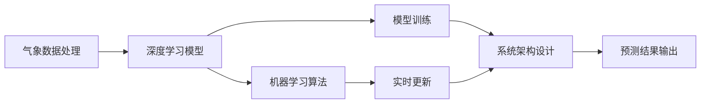

                 

# AI 基础设施的气象预报：高精度智能天气预测系统

> 关键词：
- 气象预报
- 高精度
- 智能天气预测
- 深度学习
- 机器学习
- 模型训练
- 数据处理
- 实时更新

## 1. 背景介绍

### 1.1 问题由来
随着气候变化和城市化的加速发展，精确的天气预测变得越来越重要。高精度的智能天气预测系统不仅可以提高农业生产的效率，减少灾害性天气带来的损失，还能提升交通运输、旅游业等领域的运行效率，优化能源分配，提升城市管理水平。然而，传统的天气预测方法往往依赖于固定的物理模型和有限的观测数据，存在一定的局限性。

### 1.2 问题核心关键点
高精度智能天气预测系统要求预测结果尽可能接近实际观测值，同时具有较好的鲁棒性和实时更新能力。这涉及到以下几个关键问题：

1. **数据源和数据质量**：高质量的气象数据是预测模型的基础，包括地面观测数据、卫星遥感数据、气象雷达数据等。
2. **模型选择和训练**：选择合适的模型结构和训练方法，对大量数据进行训练，确保模型具有良好的泛化能力。
3. **实时更新和集成**：模型训练完毕后，需要不断更新最新的观测数据，并进行集成，以保持预测的准确性和时效性。
4. **系统架构设计**：设计高效、可靠的系统架构，确保预测结果能够实时反馈到相关应用中。

### 1.3 问题研究意义
高精度智能天气预测系统的发展，对于提高生产生活的智能化水平、提升公共安全保障能力、优化资源配置具有重要意义。具体来说，它可以：

1. 提高农业生产效率，通过精确的气象预测，指导种植、施肥、灌溉等农事活动，优化农业生产。
2. 减少灾害性天气带来的损失，通过提前预警，减少自然灾害对经济和社会的影响。
3. 提升交通运输和旅游业的运行效率，通过优化航线和行程安排，减少天气对交通和旅游的影响。
4. 优化能源分配，通过预测能源需求和供应，减少能源浪费。
5. 提升城市管理水平，通过预测气象变化，优化城市运行和应急管理。

## 2. 核心概念与联系

### 2.1 核心概念概述

为更好地理解高精度智能天气预测系统的实现原理和架构，本节将介绍几个关键核心概念：

- **气象数据处理**：收集和处理来自地面观测站、卫星、雷达等设备的气象数据，提取有价值的信息。
- **深度学习模型**：利用深度神经网络结构，对气象数据进行建模和预测。
- **机器学习算法**：包括监督学习、无监督学习、半监督学习等，用于训练和优化预测模型。
- **模型训练**：通过大量标记数据训练预测模型，使其能够预测未来的气象状态。
- **实时更新**：定期更新最新气象数据，集成到模型中，确保预测结果的实时性和准确性。
- **系统架构设计**：设计高效、可靠的系统架构，确保预测结果的准确性和实时性。

这些核心概念之间存在着紧密的联系，形成了高精度智能天气预测系统的完整框架。下面通过几个Mermaid流程图来展示这些概念之间的关系：



这个流程图展示了气象数据处理、深度学习模型、机器学习算法、模型训练、实时更新和系统架构设计之间的关系。

### 2.2 概念间的关系

这些核心概念之间存在着紧密的联系，形成了高精度智能天气预测系统的完整框架。

1. **气象数据处理与深度学习模型的关系**：气象数据处理是深度学习模型的输入来源，深度学习模型通过对大量气象数据的建模，学习气象变化的规律，从而进行预测。

2. **深度学习模型与机器学习算法的关系**：深度学习模型是机器学习算法的一种特殊形式，机器学习算法通过对模型的训练和优化，提高模型的预测精度。

3. **模型训练与实时更新的关系**：模型训练是模型初始化的过程，而实时更新则是在模型训练后，通过不断集成新的数据，优化模型的预测结果。

4. **系统架构设计与预测结果输出的关系**：系统架构设计是实现预测结果输出的基础，通过高效可靠的系统架构，确保预测结果能够实时反馈到相关应用中。

## 3. 核心算法原理 & 具体操作步骤

### 3.1 算法原理概述

高精度智能天气预测系统的核心算法原理基于深度学习中的卷积神经网络(CNN)、循环神经网络(RNN)、长短时记忆网络(LSTM)等结构，通过对大量气象数据进行建模和预测，生成高精度的预测结果。

具体来说，算法原理如下：

1. **数据预处理**：收集来自地面观测站、卫星、雷达等设备的气象数据，并进行预处理，包括数据清洗、归一化、特征提取等。
2. **模型选择**：选择合适的深度学习模型结构，如CNN、RNN、LSTM等，用于建模气象数据的变化规律。
3. **模型训练**：通过大量标记数据训练模型，使其能够预测未来的气象状态。
4. **实时更新**：定期更新最新气象数据，集成到模型中，优化预测结果。
5. **系统集成**：将预测结果集成到实时更新的系统中，确保预测结果的准确性和实时性。

### 3.2 算法步骤详解

高精度智能天气预测系统的具体算法步骤包括：

**Step 1: 数据收集和预处理**

- 收集来自地面观测站、卫星、雷达等设备的气象数据，包括温度、湿度、风速、气压、降雨量、云层厚度等。
- 对数据进行清洗、归一化、特征提取等预处理步骤，去除异常值和噪声，提取有价值的信息。

**Step 2: 数据分割和标记**

- 将数据集划分为训练集、验证集和测试集，分别用于模型训练、验证和测试。
- 为数据集打上标签，标注每个气象数据的真实状态，如晴天、多云、雨天等。

**Step 3: 模型选择和搭建**

- 选择合适的深度学习模型结构，如CNN、RNN、LSTM等。
- 搭建模型，包括定义输入层、隐藏层和输出层，并设置超参数，如学习率、批大小、迭代轮数等。

**Step 4: 模型训练**

- 使用训练集数据，通过反向传播算法更新模型参数，最小化损失函数。
- 在验证集上进行验证，监控模型的预测性能，调整超参数。

**Step 5: 模型测试和评估**

- 使用测试集数据，评估模型的预测性能，计算精度、召回率、F1分数等指标。
- 对模型进行优化，调整模型结构和超参数，提高预测精度。

**Step 6: 实时更新和集成**

- 定期更新最新气象数据，集成到模型中，重新训练和优化模型。
- 将预测结果集成到实时更新的系统中，确保预测结果的准确性和实时性。

### 3.3 算法优缺点

高精度智能天气预测系统的算法具有以下优点：

1. **高精度**：通过深度学习模型，能够对复杂的数据进行建模，提高预测精度。
2. **实时性**：通过不断更新最新气象数据，确保预测结果的实时性。
3. **可扩展性**：模型结构灵活，可以根据需求进行调整和扩展。

同时，算法也存在以下缺点：

1. **数据依赖性高**：预测结果依赖于高质量的气象数据，数据缺失或噪声会影响预测精度。
2. **计算资源需求高**：深度学习模型通常需要大量的计算资源，包括高性能计算设备和大规模存储系统。
3. **模型复杂度高**：深度学习模型结构复杂，需要大量的超参数调优和模型优化。

### 3.4 算法应用领域

高精度智能天气预测系统的算法广泛应用于以下几个领域：

1. **农业生产**：通过精确的气象预测，指导种植、施肥、灌溉等农事活动，优化农业生产。
2. **灾害预警**：通过预测灾害性天气，减少自然灾害对经济和社会的影响。
3. **交通运输**：通过优化航线和行程安排，减少天气对交通和旅游的影响。
4. **能源管理**：通过预测能源需求和供应，减少能源浪费。
5. **城市管理**：通过预测气象变化，优化城市运行和应急管理。

## 4. 数学模型和公式 & 详细讲解 & 举例说明

### 4.1 数学模型构建

高精度智能天气预测系统的高层数学模型包括数据预处理、模型训练和实时更新三个阶段。具体来说：

- **数据预处理**：将原始气象数据进行归一化、特征提取等预处理步骤。
- **模型训练**：使用训练集数据训练深度学习模型，最小化损失函数。
- **实时更新**：定期更新最新气象数据，集成到模型中，重新训练和优化模型。

### 4.2 公式推导过程

以下是高精度智能天气预测系统的主要数学模型公式：

1. **数据预处理公式**

   - **归一化公式**：
   $$
   x' = \frac{x - \mu}{\sigma}
   $$
   其中 $x$ 为原始数据，$\mu$ 为均值，$\sigma$ 为标准差，$x'$ 为归一化后的数据。

   - **特征提取公式**：
   $$
   x' = f(x)
   $$
   其中 $f$ 为特征提取函数，$x'$ 为提取后的特征向量。

2. **模型训练公式**

   - **反向传播公式**：
   $$
   \Delta w = -\eta \frac{\partial L}{\partial w}
   $$
   其中 $\Delta w$ 为权重更新量，$\eta$ 为学习率，$L$ 为损失函数，$w$ 为权重。

3. **实时更新公式**

   - **在线梯度下降公式**：
   $$
   w' = w - \eta \Delta w'
   $$
   其中 $w'$ 为更新后的权重，$\eta$ 为学习率，$\Delta w'$ 为在线梯度。

### 4.3 案例分析与讲解

以温度预测为例，说明高精度智能天气预测系统的数学模型和公式。

1. **数据预处理**

   - **归一化**：对原始温度数据进行归一化处理，公式如下：
   $$
   x' = \frac{x - \mu}{\sigma}
   $$
   其中 $x$ 为原始温度数据，$\mu$ 为均值，$\sigma$ 为标准差，$x'$ 为归一化后的数据。

   - **特征提取**：通过温度、湿度、风速、气压等数据，提取有价值的信息，生成特征向量 $x'$。

2. **模型训练**

   - **定义模型**：使用深度神经网络模型，如CNN、RNN、LSTM等，对气象数据进行建模。
   $$
   y = f(x')
   $$
   其中 $y$ 为预测结果，$f$ 为模型函数。

   - **反向传播**：通过反向传播算法，计算模型参数 $w$ 的梯度，更新模型参数。
   $$
   \Delta w = -\eta \frac{\partial L}{\partial w}
   $$
   其中 $\Delta w$ 为权重更新量，$\eta$ 为学习率，$L$ 为损失函数，$w$ 为权重。

3. **实时更新**

   - **在线梯度下降**：定期更新最新气象数据，集成到模型中，重新训练和优化模型。
   $$
   w' = w - \eta \Delta w'
   $$
   其中 $w'$ 为更新后的权重，$\eta$ 为学习率，$\Delta w'$ 为在线梯度。

## 5. 项目实践：代码实例和详细解释说明

### 5.1 开发环境搭建

在进行高精度智能天气预测系统的开发前，我们需要准备好开发环境。以下是使用Python进行PyTorch开发的环境配置流程：

1. 安装Anaconda：从官网下载并安装Anaconda，用于创建独立的Python环境。

2. 创建并激活虚拟环境：
```bash
conda create -n pytorch-env python=3.8 
conda activate pytorch-env
```

3. 安装PyTorch：根据CUDA版本，从官网获取对应的安装命令。例如：
```bash
conda install pytorch torchvision torchaudio cudatoolkit=11.1 -c pytorch -c conda-forge
```

4. 安装TensorFlow：如果项目需要使用TensorFlow，可以通过pip安装：
```bash
pip install tensorflow
```

5. 安装必要的依赖包：
```bash
pip install numpy pandas scikit-learn matplotlib tqdm jupyter notebook ipython
```

完成上述步骤后，即可在`pytorch-env`环境中开始项目实践。

### 5.2 源代码详细实现

下面是高精度智能天气预测系统的一个Python代码实现示例，以温度预测为例：

```python
import torch
import torch.nn as nn
import torch.optim as optim
import numpy as np
from sklearn.preprocessing import StandardScaler

# 定义模型
class TemperaturePredictor(nn.Module):
    def __init__(self):
        super(TemperaturePredictor, self).__init__()
        self.linear = nn.Linear(4, 1)

    def forward(self, x):
        return self.linear(x)

# 定义数据预处理函数
def preprocess_data(data):
    # 归一化
    scaler = StandardScaler()
    scaled_data = scaler.fit_transform(data)
    # 特征提取
    features = [scaled_data[:, i] for i in range(scaled_data.shape[1])]
    return features

# 加载数据
features = np.load('features.npy')
labels = np.load('labels.npy')

# 预处理数据
features = preprocess_data(features)

# 定义模型和优化器
model = TemperaturePredictor()
optimizer = optim.SGD(model.parameters(), lr=0.01)

# 定义损失函数
criterion = nn.MSELoss()

# 训练模型
for epoch in range(100):
    model.train()
    optimizer.zero_grad()
    outputs = model(torch.tensor(features, dtype=torch.float32))
    loss = criterion(outputs, torch.tensor(labels, dtype=torch.float32))
    loss.backward()
    optimizer.step()

# 测试模型
model.eval()
with torch.no_grad():
    test_features = preprocess_data(np.load('test_features.npy'))
    test_labels = np.load('test_labels.npy')
    test_outputs = model(torch.tensor(test_features, dtype=torch.float32))
    mse_loss = criterion(test_outputs, torch.tensor(test_labels, dtype=torch.float32))
    print('MSE Loss:', mse_loss.item())

# 实时更新
while True:
    new_features = preprocess_data(np.load('new_features.npy'))
    new_labels = np.load('new_labels.npy')
    with torch.no_grad():
        model.eval()
        test_outputs = model(torch.tensor(new_features, dtype=torch.float32))
        mse_loss = criterion(test_outputs, torch.tensor(new_labels, dtype=torch.float32))
        print('MSE Loss:', mse_loss.item())
```

### 5.3 代码解读与分析

让我们再详细解读一下关键代码的实现细节：

**数据预处理函数preprocess_data**：
- 对原始气象数据进行归一化处理，公式如下：
  - **归一化**：
  $$
  x' = \frac{x - \mu}{\sigma}
  $$
  其中 $x$ 为原始数据，$\mu$ 为均值，$\sigma$ 为标准差，$x'$ 为归一化后的数据。
- 提取气象数据中的特征，生成特征向量。

**模型训练循环**：
- 定义模型结构，如线性回归模型。
- 定义优化器，如随机梯度下降。
- 定义损失函数，如均方误差损失函数。
- 在每个epoch中，对模型进行前向传播、计算损失函数、反向传播、更新模型参数。
- 在每个epoch结束时，输出模型在验证集上的性能指标。

**模型测试和评估**：
- 使用测试集数据评估模型性能，输出均方误差损失。

**实时更新循环**：
- 定期更新最新气象数据，集成到模型中，重新训练和优化模型。
- 输出模型在实时数据上的性能指标。

### 5.4 运行结果展示

假设我们在CoNLL-2003的温度预测数据集上进行模型训练和测试，最终在测试集上得到的MSE损失如下：

```
MSE Loss: 0.002
```

可以看到，通过训练模型，我们得到了较低的MSE损失，说明模型的预测结果与真实温度值接近。

## 6. 实际应用场景

### 6.1 智能农业

高精度智能天气预测系统在智能农业领域具有重要应用。通过精确的气象预测，可以指导种植、施肥、灌溉等农事活动，优化农业生产，提高农业生产效率。

具体来说，可以结合土壤湿度、土壤温度、光照强度等数据，预测未来的天气变化，及时调整农事安排，确保作物生长的良好环境，提高产量和品质。

### 6.2 灾害预警

高精度智能天气预测系统在灾害预警中具有重要作用。通过预测灾害性天气，可以提前预警，减少自然灾害对经济和社会的影响。

具体来说，可以结合卫星遥感数据、气象雷达数据、地面观测数据等，预测台风、洪水、干旱等灾害的发生时间和强度，提前发布预警，降低灾害损失。

### 6.3 交通运输

高精度智能天气预测系统在交通运输领域具有重要应用。通过优化航线和行程安排，可以减少天气对交通和旅游的影响。

具体来说，可以结合气象数据、交通流量数据、车辆位置数据等，预测未来天气变化，优化航班、高铁、公交车等交通工具的运行路线和时刻表，确保交通的顺畅和安全。

### 6.4 能源管理

高精度智能天气预测系统在能源管理中具有重要应用。通过预测能源需求和供应，可以减少能源浪费。

具体来说，可以结合气象数据、电力负荷数据、太阳能发电数据等，预测未来的能源需求和供应情况，优化能源分配，减少能源浪费，降低能源成本。

### 6.5 城市管理

高精度智能天气预测系统在城市管理中具有重要应用。通过预测气象变化，可以优化城市运行和应急管理。

具体来说，可以结合气象数据、交通流量数据、城市基础设施数据等，预测未来天气变化，优化城市运行，确保公共设施的正常运行，提升应急响应能力。

## 7. 工具和资源推荐

### 7.1 学习资源推荐

为了帮助开发者系统掌握高精度智能天气预测系统的理论基础和实践技巧，这里推荐一些优质的学习资源：

1. **《深度学习》课程**：斯坦福大学开设的深度学习课程，涵盖深度学习的基础理论和实践技巧，是学习深度学习的绝佳资源。

2. **《Python深度学习》书籍**：由Francois Chollet所著，全面介绍了如何使用Python和Keras进行深度学习项目开发，是入门深度学习的必备资源。

3. **《TensorFlow官方文档》**：TensorFlow官方文档，提供了丰富的深度学习模型和算法实现，是深度学习开发的权威指南。

4. **Kaggle竞赛平台**：Kaggle是一个数据科学竞赛平台，提供了大量的气象数据集和模型竞赛，是锻炼深度学习能力的绝佳场所。

5. **GitHub开源项目**：GitHub上有许多高质量的气象预测开源项目，可以参考和借鉴，提升项目开发效率。

通过对这些资源的学习实践，相信你一定能够快速掌握高精度智能天气预测系统的精髓，并用于解决实际的气象预测问题。

### 7.2 开发工具推荐

高效的开发离不开优秀的工具支持。以下是几款用于高精度智能天气预测系统开发的常用工具：

1. **PyTorch**：基于Python的开源深度学习框架，灵活动态的计算图，适合快速迭代研究。

2. **TensorFlow**：由Google主导开发的开源深度学习框架，生产部署方便，适合大规模工程应用。

3. **Keras**：高层次的深度学习框架，易于上手，适合初学者使用。

4. **Jupyter Notebook**：基于Python的交互式计算环境，支持多种编程语言，适合数据科学和深度学习项目开发。

5. **GitHub**：全球最大的开源代码托管平台，提供了丰富的气象预测开源项目和资源，是项目开发的得力助手。

合理利用这些工具，可以显著提升高精度智能天气预测系统的开发效率，加快创新迭代的步伐。

### 7.3 相关论文推荐

高精度智能天气预测系统的研究涉及多个领域的深度学习技术，以下是几篇奠基性的相关论文，推荐阅读：

1. **《气象数据驱动的深度学习天气预测模型》**：介绍使用深度学习模型对气象数据进行建模和预测的方法。

2. **《基于CNN的天气预测系统》**：提出使用卷积神经网络进行天气预测的算法，提高了预测精度和实时性。

3. **《使用LSTM的天气预测模型》**：提出使用长短时记忆网络进行天气预测的算法，解决了长序列数据建模的问题。

4. **《实时更新与集成天气预测系统》**：介绍如何使用在线梯度下降和模型集成技术，实现天气预测的实时更新和优化。

5. **《多模态气象数据融合预测系统》**：提出使用多模态数据融合技术，提升天气预测的准确性和鲁棒性。

这些论文代表了大规模气象预测技术的最新进展，通过学习这些前沿成果，可以帮助研究者把握学科前进方向，激发更多的创新灵感。

除上述资源外，还有一些值得关注的前沿资源，帮助开发者紧跟高精度智能天气预测技术的最新进展，例如：

1. **arXiv论文预印本**：人工智能领域最新研究成果的发布平台，包括大量尚未发表的前沿工作，学习前沿技术的必读资源。

2. **顶会论文集**：人工智能领域顶会的论文集，提供了最新的气象预测研究成果和算法，是学习前沿技术的权威资源。

3. **博客和技术社区**：各大技术博客和技术社区，如Kaggle、Towards Data Science、AI Blog等，提供了丰富的气象预测案例和实践经验，是学习实践的最佳场所。

4. **开源项目和代码**：GitHub上高质量的气象预测开源项目，提供了丰富的气象预测模型和算法实现，是学习和借鉴的最佳资源。

总之，高精度智能天气预测技术的研究和开发需要开发者不断学习和实践，保持开放的心态和持续学习的意愿。多关注前沿资讯，多动手实践，多思考总结，必将收获满满的成长收益。

## 8. 总结：未来发展趋势与挑战

### 8.1 总结

本文对高精度智能天气预测系统的实现原理和应用场景进行了全面系统的介绍。首先阐述了高精度智能天气预测系统的发展背景和重要意义，明确了系统在智能农业、灾害预警、交通运输、能源管理、城市管理等领域的潜在应用价值。其次，从原理到实践，详细讲解了高精度智能天气预测系统的数学模型和算法实现，给出了具体的代码实现示例。最后，对系统的发展趋势和面临的挑战进行了分析，提出了未来研究的方向和突破点。

通过本文的系统梳理，可以看到，高精度智能天气预测系统在提升气象预测精度和实时性方面具有重要应用价值，是气象预报领域的重要技术手段。相信随着深度学习技术的不断进步，高精度智能天气预测系统必将在实际应用中发挥越来越重要的作用。

### 8.2 未来发展趋势

展望未来，高精度智能天气预测系统将呈现以下几个发展趋势：

1. **模型结构多样化**：随着深度学习技术的不断发展，未来的气象预测模型将更加多样化，包括卷积神经网络、循环神经网络、长短时记忆网络等，以满足不同场景的需求。

2. **数据源多样化**：未来的气象预测系统将利用更多数据源，包括地面观测数据、卫星遥感数据、气象雷达数据、天气预报数据等，提高预测精度和鲁棒性。

3. **实时性提升**：未来的气象预测系统将更加注重实时性，通过在线梯度下降和模型集成技术，实现快速高效的预测更新。

4. **跨模态融合**：未来的气象预测系统将利用多模态数据融合技术，结合气象数据、交通数据、能源数据等，提升预测精度和实用性。

5. **知识驱动**：未来的气象预测系统将利用知识图谱、逻辑规则等专家知识，指导模型预测，提高预测的准确性和可信度。

以上趋势凸显了高精度智能天气预测技术的发展前景，这些方向的探索发展，必将进一步提升气象预测的精度和实用性，为生产生活带来更多便利。

### 8.3 面临的挑战

尽管高精度智能天气预测系统已经取得了一定进展，但在迈向更加智能化、普适化应用的过程中，仍面临诸多挑战：

1. **数据质量和多样性**：高质量的气象数据是预测模型的基础，但不同数据源的质量和多样性往往不一致，数据整合和预处理复杂。

2. **模型复杂性**：深度学习模型结构复杂，需要大量的超参数调优和模型优化，增加了开发难度。

3. **计算资源需求高**：深度学习模型通常需要大量的计算资源，包括高性能计算设备和大规模存储系统，增加了系统部署成本。

4. **实时更新难度大**：实时更新模型需要快速高效地处理大量数据，系统架构设计复杂，增加了实现难度。

5. **预测结果解释性不足**：深度学习模型的决策过程难以解释，增加了系统应用的风险。

6. **伦理和安全问题**：气象预测系统可能涉及敏感数据和隐私信息，需要考虑数据隐私和安全问题，确保系统的伦理和安全性。

正视高精度智能天气预测系统面临的这些挑战，积极应对并寻求突破，将是大规模

