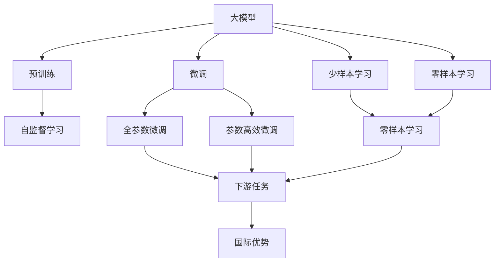
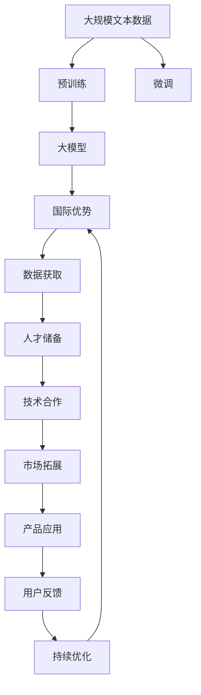

                 

# AI 大模型创业：如何利用国际优势？

## 1. 背景介绍

### 1.1 问题由来

在人工智能领域，尤其是大模型（Large Models）领域，近年来出现了一波创业热潮。大模型如GPT-3、BERT等，因其强大的自然语言处理（NLP）能力，被广泛应用于文本生成、语言理解、机器翻译等多个场景。然而，大模型的训练和应用成本高昂，使得创业公司面临诸多挑战。如何在国际竞争中占据优势，成为亟待解决的问题。

### 1.2 问题核心关键点

创业公司要利用国际优势，必须从以下几个方面着手：
1. **数据获取**：国际上拥有丰富的语料库和标注数据，尤其是在大规模通用语言模型训练中，需要大量文本数据。
2. **人才储备**：全球顶级高校和研究机构培养了大批AI人才，创业公司可以借助这些人才优势，进行技术研发和项目实施。
3. **技术合作**：与国际知名的AI实验室和公司合作，可以获得最新的研究成果和技术支持。
4. **市场拓展**：利用国际市场的多样性和复杂性，探索新的商业机会和应用场景。

### 1.3 问题研究意义

在AI大模型创业中，利用国际优势，可以帮助创业公司快速提升技术实力，降低研发成本，拓宽市场应用，实现可持续发展。具体而言：

1. **加速研发进程**：借助国际数据和人才，能够快速推进模型训练和优化。
2. **降低成本**：利用国际开源资源和工具，减少自建基础设施的成本。
3. **开拓市场**：国际市场广阔，创业公司可以迅速扩大影响力。
4. **提升竞争力**：通过技术合作，获得行业领先者的指导和支持，提升产品竞争力。

## 2. 核心概念与联系

### 2.1 核心概念概述

为了更好地理解如何利用国际优势，我们将介绍几个关键概念：

- **大模型（Large Models）**：如GPT-3、BERT等，以自回归或自编码模型为代表，通过大规模预训练学习通用语言表示。
- **预训练（Pre-training）**：在大规模无标签文本数据上进行自监督学习，学习通用语言表示。
- **微调（Fine-tuning）**：在大模型基础上，通过有监督学习优化模型在特定任务上的性能。
- **迁移学习（Transfer Learning）**：将通用模型知识迁移应用到特定任务。
- **少样本学习（Few-shot Learning）**：使用少量样本进行模型训练，减少标注数据需求。
- **零样本学习（Zero-shot Learning）**：仅通过任务描述进行推理。
- **国际优势**：利用国际上丰富的大规模语料、人才和技术资源，提升创业公司的竞争力和市场影响力。

### 2.2 概念间的关系

这些概念之间的联系可以通过以下Mermaid流程图来展示：



这个流程图展示了从预训练到微调，再到利用国际优势的整体过程。

### 2.3 核心概念的整体架构

最后，我们用一个综合的流程图来展示这些核心概念在大模型创业中的整体架构：



这个综合流程图展示了从数据获取、人才储备、技术合作到市场拓展的完整过程，以及如何通过产品应用和用户反馈进行持续优化。

## 3. 核心算法原理 & 具体操作步骤
### 3.1 算法原理概述

利用国际优势进行大模型创业，本质上是一种国际化的迁移学习过程。其核心思想是：通过国际上的大规模语料和人才资源，加速模型的训练和优化，提升模型的国际竞争力。

具体而言，可以采用以下步骤：

1. **数据获取**：通过国际上开放的数据集和标注工具，获取大规模语料。
2. **人才招聘**：在全球顶级高校和研究机构招聘AI人才，组建强大的技术团队。
3. **技术合作**：与国际知名AI实验室和公司合作，获取最新的研究成果和技术支持。
4. **市场拓展**：利用国际市场的多样性和复杂性，开拓新的商业机会和应用场景。
5. **产品应用**：将国际优势应用于实际产品开发和部署，提高产品竞争力。

### 3.2 算法步骤详解

下面是具体的实施步骤：

**Step 1: 数据获取**

1. **收集国际数据**：从国际开源数据集、学术论文、互联网爬虫等渠道获取大规模语料。
2. **标注数据**：利用众包平台和专业标注团队，对数据进行标注。
3. **数据预处理**：清洗和标准化数据，生成训练集、验证集和测试集。

**Step 2: 人才招聘**

1. **全球招聘**：在招聘网站和国际社交媒体上发布招聘信息，吸引全球顶尖AI人才。
2. **技术培训**：提供完善的培训计划，帮助新员工快速融入团队，掌握关键技术。
3. **团队建设**：组建跨部门的团队，包括数据科学家、工程师、产品经理等，确保各个环节协同工作。

**Step 3: 技术合作**

1. **选择合作伙伴**：与国际知名AI实验室和公司建立合作关系，如DeepMind、Google AI、OpenAI等。
2. **技术交流**：参加国际学术会议、实验室访问、技术交流会等，获取最新研究成果和技术支持。
3. **联合研发**：与合作伙伴联合开发特定领域的大模型，如医疗、金融、法律等。

**Step 4: 市场拓展**

1. **国际市场调研**：分析不同国家和地区的市场需求，确定目标市场。
2. **本地化应用**：根据目标市场的需求，进行本地化应用开发和测试。
3. **推广策略**：制定适合不同市场的推广策略，包括线上广告、合作伙伴推广等。

**Step 5: 产品应用**

1. **产品开发**：将国际优势应用于实际产品开发，如NLP工具、图像识别系统、推荐系统等。
2. **部署与优化**：将产品部署到云平台和本地服务器，进行持续优化和迭代。
3. **用户反馈**：收集用户反馈，不断改进产品性能和用户体验。

### 3.3 算法优缺点

利用国际优势进行大模型创业，具有以下优点：

1. **加速研发**：借助国际数据和人才，能够快速推进模型训练和优化。
2. **降低成本**：利用国际开源资源和工具，减少自建基础设施的成本。
3. **提高竞争力**：通过技术合作，获得行业领先者的指导和支持，提升产品竞争力。
4. **拓展市场**：国际市场广阔，创业公司可以迅速扩大影响力。

同时，也存在一些缺点：

1. **数据隐私**：国际数据来源复杂，数据隐私和安全问题需要特别注意。
2. **文化差异**：不同国家和地区的文化和市场需求差异较大，本地化应用需要深入研究。
3. **知识产权**：国际技术合作和数据共享过程中，知识产权保护需要特别注意。

### 3.4 算法应用领域

利用国际优势进行大模型创业，可以应用于多个领域：

1. **自然语言处理（NLP）**：如文本生成、语言理解、机器翻译等。
2. **计算机视觉（CV）**：如图像识别、物体检测、视频分析等。
3. **推荐系统**：如个性化推荐、广告推荐等。
4. **智能医疗**：如疾病诊断、医学影像分析等。
5. **金融科技**：如智能投顾、风险评估等。
6. **智能客服**：如智能聊天机器人、客户服务自动化等。

这些领域的大模型应用，能够有效提升业务效率和用户体验，推动行业创新。

## 4. 数学模型和公式 & 详细讲解 & 举例说明
### 4.1 数学模型构建

在利用国际优势进行大模型创业时，需要构建以下数学模型：

1. **数据集构建**：将国际上收集的数据集划分为训练集、验证集和测试集。
2. **模型训练**：使用国际上的大模型，如GPT-3、BERT等，进行预训练和微调。
3. **性能评估**：通过性能指标（如准确率、F1分数、ROC曲线等）评估模型效果。

### 4.2 公式推导过程

以下是一些关键的公式推导：

**1. 预训练损失函数**

假设数据集为 $\{x_i, y_i\}_{i=1}^N$，预训练模型的损失函数为：

$$
\mathcal{L}(\theta) = \frac{1}{N} \sum_{i=1}^N \ell(\theta(x_i), y_i)
$$

其中 $\ell$ 为损失函数，$\theta$ 为模型参数，$x_i$ 为输入，$y_i$ 为输出。

**2. 微调损失函数**

假设微调任务为分类任务，则微调模型的损失函数为：

$$
\mathcal{L}(\theta) = -\frac{1}{N} \sum_{i=1}^N [y_i\log \hat{y}_i + (1-y_i)\log (1-\hat{y}_i)]
$$

其中 $\hat{y}_i$ 为模型预测输出，$y_i$ 为真实标签。

**3. 少样本学习公式**

少样本学习时，使用 $k$ 个样本来训练模型，其预测结果为 $\hat{y}$，真实标签为 $y$，则损失函数为：

$$
\mathcal{L}(\theta) = \frac{1}{k} \sum_{i=1}^k \ell(\hat{y}_i, y_i)
$$

**4. 零样本学习公式**

零样本学习时，使用任务描述 $D$ 作为输入，模型输出为 $\hat{y}$，则损失函数为：

$$
\mathcal{L}(\theta) = \frac{1}{N} \sum_{i=1}^N \ell(\hat{y}, y_i)
$$

其中 $\ell$ 为损失函数，$N$ 为样本数。

### 4.3 案例分析与讲解

假设一个创业公司利用国际优势进行NLP领域的创业，以下是具体的案例分析：

**案例分析：医疗领域的NLP应用**

1. **数据获取**：从国际开源数据集和学术论文中获取医疗领域的文本数据。
2. **人才招聘**：在医学和AI领域招聘顶尖人才，组建技术团队。
3. **技术合作**：与国际知名的医学AI实验室合作，获取最新的研究成果和技术支持。
4. **市场拓展**：拓展医疗行业的市场需求，开发适用于不同国家和地区的医疗NLP应用。
5. **产品应用**：利用国际优势，开发智能诊断系统、医学影像分析等医疗NLP应用。

## 5. 项目实践：代码实例和详细解释说明
### 5.1 开发环境搭建

在利用国际优势进行大模型创业时，需要搭建以下开发环境：

1. **硬件设备**：高性能计算机、GPU/TPU等。
2. **软件环境**：Python、TensorFlow、PyTorch等深度学习框架，以及HuggingFace、NLTK等NLP工具库。
3. **数据平台**：云平台（如AWS、Google Cloud、阿里云等），用于存储和处理大规模数据。

### 5.2 源代码详细实现

以下是具体的实现步骤：

1. **数据预处理**

```python
import pandas as pd
from sklearn.model_selection import train_test_split

# 读取国际数据集
data = pd.read_csv('international_dataset.csv')

# 数据预处理
X = data['text'].tolist()
y = data['label'].tolist()

# 数据集划分
train_X, val_X, train_y, val_y = train_test_split(X, y, test_size=0.2, random_state=42)
test_X, test_y = train_test_split(val_X, val_y, test_size=0.2, random_state=42)
```

2. **模型训练**

```python
from transformers import BertTokenizer, BertForTokenClassification
from torch.utils.data import DataLoader
from transformers import AdamW

# 加载预训练模型
tokenizer = BertTokenizer.from_pretrained('bert-base-cased')
model = BertForTokenClassification.from_pretrained('bert-base-cased', num_labels=len(tag2id))

# 加载数据集
train_dataset = NERDataset(train_X, train_y, tokenizer)
val_dataset = NERDataset(val_X, val_y, tokenizer)
test_dataset = NERDataset(test_X, test_y, tokenizer)

# 模型训练
optimizer = AdamW(model.parameters(), lr=2e-5)
device = torch.device('cuda') if torch.cuda.is_available() else torch.device('cpu')
model.to(device)

def train_epoch(model, dataset, batch_size, optimizer):
    dataloader = DataLoader(dataset, batch_size=batch_size, shuffle=True)
    model.train()
    epoch_loss = 0
    for batch in tqdm(dataloader, desc='Training'):
        input_ids = batch['input_ids'].to(device)
        attention_mask = batch['attention_mask'].to(device)
        labels = batch['labels'].to(device)
        model.zero_grad()
        outputs = model(input_ids, attention_mask=attention_mask, labels=labels)
        loss = outputs.loss
        epoch_loss += loss.item()
        loss.backward()
        optimizer.step()
    return epoch_loss / len(dataloader)

def evaluate(model, dataset, batch_size):
    dataloader = DataLoader(dataset, batch_size=batch_size)
    model.eval()
    preds, labels = [], []
    with torch.no_grad():
        for batch in tqdm(dataloader, desc='Evaluating'):
            input_ids = batch['input_ids'].to(device)
            attention_mask = batch['attention_mask'].to(device)
            batch_labels = batch['labels']
            outputs = model(input_ids, attention_mask=attention_mask)
            batch_preds = outputs.logits.argmax(dim=2).to('cpu').tolist()
            batch_labels = batch_labels.to('cpu').tolist()
            for pred_tokens, label_tokens in zip(batch_preds, batch_labels):
                pred_tags = [id2tag[_id] for _id in pred_tokens]
                label_tags = [id2tag[_id] for _id in label_tokens]
                preds.append(pred_tags[:len(label_tokens)])
                labels.append(label_tags)

    print(classification_report(labels, preds))
```

3. **模型微调**

```python
epochs = 5
batch_size = 16

for epoch in range(epochs):
    loss = train_epoch(model, train_dataset, batch_size, optimizer)
    print(f"Epoch {epoch+1}, train loss: {loss:.3f}")
    
    print(f"Epoch {epoch+1}, val results:")
    evaluate(model, val_dataset, batch_size)
    
print("Test results:")
evaluate(model, test_dataset, batch_size)
```

### 5.3 代码解读与分析

以下是关键代码的实现细节：

**数据预处理**

- `pd.read_csv`：读取国际数据集。
- `train_test_split`：将数据集划分为训练集、验证集和测试集。

**模型训练**

- `BertTokenizer.from_pretrained`：加载预训练的BERT模型。
- `BertForTokenClassification.from_pretrained`：加载预训练的分类模型。
- `AdamW`：定义优化器。
- `model.to(device)`：将模型移动到GPU或TPU设备。
- `train_epoch`：定义训练函数。
- `evaluate`：定义评估函数。

**模型微调**

- `epochs`：定义训练轮数。
- `batch_size`：定义批次大小。
- `train_epoch`：训练模型。
- `evaluate`：评估模型。

## 6. 实际应用场景
### 6.1 智能客服系统

利用国际优势进行智能客服系统开发，可以借助全球顶级客服团队和大量标注数据，提升客服系统的智能水平。

1. **数据收集**：收集全球客户服务数据，包括语音、文本和对话记录。
2. **数据标注**：利用众包平台和专业标注团队，对数据进行标注。
3. **模型训练**：使用国际数据对大模型进行微调，优化客服系统的性能。
4. **本地化应用**：根据不同国家和地区的语言和文化，进行本地化适配。
5. **系统部署**：将智能客服系统部署到全球各地的客服平台，提升用户体验。

### 6.2 金融舆情监测

金融领域的舆情监测需要处理海量非结构化数据，利用国际优势可以高效提升监测能力。

1. **数据收集**：从全球金融网站和社交媒体中收集金融新闻、评论和分析报告。
2. **数据标注**：对金融数据进行情感标注和主题分类。
3. **模型训练**：利用国际数据对大模型进行微调，提升舆情监测的准确性和实时性。
4. **风险评估**：实时监控金融舆情，预测市场趋势，评估金融风险。
5. **系统部署**：将舆情监测系统部署到全球金融市场，支持金融机构决策。

### 6.3 个性化推荐系统

个性化推荐系统需要处理用户行为数据，利用国际优势可以提升推荐系统的精度和多样性。

1. **数据收集**：从全球电子商务平台和社交媒体中收集用户行为数据。
2. **数据标注**：对用户行为进行分析和标注，如浏览记录、购买记录等。
3. **模型训练**：利用国际数据对大模型进行微调，优化推荐系统的性能。
4. **本地化应用**：根据不同国家和地区的用户需求，进行本地化推荐。
5. **系统部署**：将推荐系统部署到全球电子商务平台，提升用户体验。

### 6.4 未来应用展望

随着大模型和微调技术的不断演进，利用国际优势的创业公司将迎来更多发展机遇。

1. **跨领域应用**：利用国际优势，开发跨领域的AI应用，如智能医疗、智能制造等。
2. **多模态融合**：将文本、图像、语音等多种模态数据融合，提升AI系统的感知能力。
3. **大数据分析**：利用国际优势，处理和分析海量大数据，提供决策支持。
4. **智能边缘计算**：利用国际优势，开发智能边缘计算应用，提升数据处理和推理速度。

总之，利用国际优势进行大模型创业，能够快速提升技术实力，降低研发成本，拓宽市场应用，实现可持续发展。

## 7. 工具和资源推荐
### 7.1 学习资源推荐

为了帮助开发者系统掌握大模型创业的技术基础和实践技巧，这里推荐一些优质的学习资源：

1. **《深度学习》课程**：斯坦福大学深度学习课程，涵盖深度学习基础知识和前沿技术。
2. **《NLP与深度学习》书籍**：系统介绍自然语言处理和深度学习技术的经典书籍。
3. **HuggingFace官方文档**：提供丰富的大模型资源和样例代码。
4. **GitHub开源项目**：提供海量开源NLP项目和代码，方便开发者学习借鉴。
5. **Kaggle竞赛平台**：提供大量NLP竞赛数据集，锻炼模型训练和调优能力。

### 7.2 开发工具推荐

在利用国际优势进行大模型创业时，需要以下开发工具：

1. **PyTorch**：基于Python的深度学习框架，适合高效开发。
2. **TensorFlow**：谷歌开发的深度学习框架，支持分布式训练和生产部署。
3. **Jupyter Notebook**：交互式编程环境，方便开发者进行模型训练和调试。
4. **HuggingFace Transformers库**：提供丰富的大模型资源和API接口，方便开发者快速开发。
5. **AWS云平台**：提供强大的计算资源和数据处理能力，支持AI应用部署。

### 7.3 相关论文推荐

大模型和微调技术的发展离不开学界的持续研究。以下是几篇奠基性的相关论文，推荐阅读：

1. **《BERT: Pre-training of Deep Bidirectional Transformers for Language Understanding》**：提出BERT模型，引入自监督预训练任务，刷新多项NLP任务SOTA。
2. **《Attention is All You Need》**：提出Transformer结构，开启NLP领域的预训练大模型时代。
3. **《Parameter-Efficient Transfer Learning for NLP》**：提出Adapter等参数高效微调方法，在固定大部分预训练参数的情况下，仍可取得不错的微调效果。
4. **《Fine-Tuning BERT for Sequence Labeling Tasks》**：详细阐述BERT在序列标注任务上的微调方法。
5. **《Few-shot Learning of Natural Language Understanding》**：研究少样本学习在大模型中的应用，提升模型的泛化能力。

这些论文代表了大模型微调技术的发展脉络。通过学习这些前沿成果，可以帮助研究者把握学科前进方向，激发更多的创新灵感。

## 8. 总结：未来发展趋势与挑战
### 8.1 总结

本文对利用国际优势进行大模型创业进行了全面系统的介绍。首先阐述了创业公司如何通过国际优势加速模型训练和优化，提升市场竞争力。其次，从原理到实践，详细讲解了模型训练和微调的具体步骤，给出了国际优势在智能客服、金融舆情、个性化推荐等多个领域的应用案例。最后，推荐了学习资源、开发工具和相关论文，帮助开发者系统掌握国际优势的大模型创业技术。

通过本文的系统梳理，可以看到，利用国际优势进行大模型创业，能够快速提升技术实力，降低研发成本，拓宽市场应用，实现可持续发展。然而，在迈向更加智能化、普适化应用的过程中，国际优势的使用也面临诸多挑战：

1. **数据隐私和安全**：国际数据来源复杂，数据隐私和安全问题需要特别注意。
2. **文化差异和本地化**：不同国家和地区的文化和市场需求差异较大，本地化应用需要深入研究。
3. **知识产权保护**：国际技术合作和数据共享过程中，知识产权保护需要特别注意。

## 9. 附录：常见问题与解答

**Q1：国际数据获取有哪些途径？**

A: 国际数据获取的途径包括：
1. 公开数据集：如CoNLL、GLUE、IMDB等，可在学术网站下载。
2. 数据共享平台：如Kaggle、UCI等，提供大量开源数据集。
3. 互联网爬虫：利用爬虫技术从互联网抓取数据。
4. 数据购买：通过数据购买平台获取商业数据集。

**Q2：如何进行数据标注？**

A: 数据标注可以通过以下步骤进行：
1. 众包平台：使用Amazon Mechanical Turk、CrowdFlower等平台，将标注任务外包给全球众包工人。
2. 专业团队：组建专业标注团队，对数据进行高质量标注。
3. 自标注：利用开源工具和自动标注方法，减少标注成本。

**Q3：如何提升模型鲁棒性？**

A: 提升模型鲁棒性可以从以下几方面入手：
1. 数据增强：通过回译、近义替换等方式扩充训练集。
2. 正则化：使用L2正则、Dropout、Early Stopping等避免过拟合。
3. 对抗训练：引入对抗样本，提高模型鲁棒性。
4. 参数高效微调：只调整少量参数，减小过拟合风险。

**Q4：如何降低微调成本？**

A: 降低微调成本可以从以下几方面入手：
1. 使用开源工具和预训练模型，减少自建基础设施的成本。
2. 利用云平台和分布式训练，降低硬件成本。
3. 引入模型压缩和稀疏化技术，减少存储空间和计算资源消耗。

**Q5：如何利用国际优势提升竞争力？**

A: 利用国际优势提升竞争力可以从以下几方面入手：
1. 数据获取：借助国际上丰富的大规模语料，加速模型训练和优化。
2. 人才招聘：在全球顶级高校和研究机构招聘AI人才，组建强大的技术团队。
3. 技术合作：与国际知名AI实验室和公司合作，获取最新的研究成果和技术支持。
4. 市场拓展：利用国际市场的多样性和复杂性，开拓新的商业机会和应用场景。

总之，利用国际优势进行大模型创业，需要开发者系统掌握大模型技术和实践技巧，合理利用国际资源，才能在激烈的市场竞争中脱颖而出。

---

作者：禅与计算机程序设计艺术 / Zen and the Art of Computer Programming

