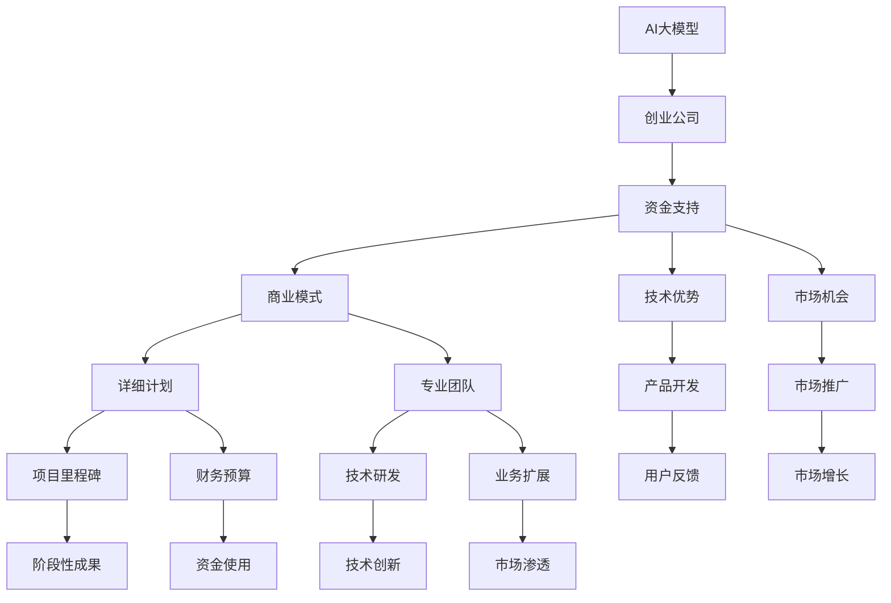
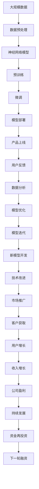

                 

## 1. 背景介绍

### 1.1 问题由来
近年来，人工智能大模型因其卓越的性能和广泛的适用性，迅速成为各行业争相投入的热门领域。然而，研发和部署AI大模型需要巨额资金投入，这对许多初创企业来说是一大挑战。为了支持这些企业发展，投资者越来越关注AI大模型的创业项目，并愿意为其提供资金支持。本文将深入探讨如何获得这些资金支持，为创业公司提供策略和建议。

### 1.2 问题核心关键点
获得AI大模型创业资金支持的核心关键点包括：
- 明确商业模式：企业需清晰定义其商业模型，以便投资者理解其盈利方式。
- 突出技术优势：企业需强调其技术领先性和创新性，证明其竞争力和市场潜力。
- 展示市场机会：企业需分析目标市场和潜在客户群，证明其商业机会和增长潜力。
- 制定详细计划：企业需提供详细的发展和资金使用计划，让投资者对未来发展有信心。
- 构建专业团队：企业需展示其核心团队的技术实力和管理能力。

### 1.3 问题研究意义
在AI大模型创业项目中，获取资金支持是成功的重要一步。合理的资金支持不仅可以加速产品研发和市场推广，还能增强企业的竞争力和市场影响力。本文通过深入分析AI大模型创业的资金需求和获取策略，旨在为创业公司提供切实可行的建议，帮助其实现快速发展。

## 2. 核心概念与联系

### 2.1 核心概念概述
以下是与AI大模型创业资金支持相关的核心概念：

- **AI大模型**：基于大规模数据集训练的神经网络模型，具有强大的学习能力，适用于各种任务，如自然语言处理、计算机视觉等。
- **创业公司**：指新成立的公司，致力于AI大模型研发和商业化。
- **资金支持**：指投资者对创业公司的财务投资，支持其业务发展。
- **商业模式**：指企业如何创造价值并从中获取收益的模式。
- **技术优势**：指企业在AI大模型技术上的独特能力和领先地位。
- **市场机会**：指企业目标市场的大小、潜力和增长空间。
- **发展计划**：指企业未来发展的详细规划，包括产品路线图、市场推广策略等。
- **专业团队**：指企业核心团队的成员及其技术和管理能力。

这些核心概念通过以下Mermaid流程图展示了它们之间的联系：



该图表展示了AI大模型创业资金支持的整个流程，从AI大模型的研发到公司发展计划的制定，再到资金的筹集和使用，各个环节紧密相连。

### 2.2 概念间的关系
- **AI大模型**是创业公司发展的核心基础，提供技术支持。
- **资金支持**是公司发展的必要条件，支持研发和市场推广。
- **商业模式**决定公司的盈利方式，是获取投资者的重要依据。
- **技术优势**证明公司的竞争力，吸引投资者关注。
- **市场机会**分析目标市场潜力，证明商业价值。
- **发展计划**展示公司未来发展规划，增强投资者的信心。
- **专业团队**保障公司技术和管理能力，保证项目顺利实施。

这些概念相互作用，共同构成AI大模型创业项目的资金支持框架。

### 2.3 核心概念的整体架构
最后，我们用一个综合的流程图展示了这些核心概念在整个AI大模型创业资金支持中的作用：



该流程图展示了从数据预处理到模型上线，再到市场推广和公司盈利的全流程，每个环节都密切关联，形成了一个完整的AI大模型创业资金支持循环。

## 3. 核心算法原理 & 具体操作步骤
### 3.1 算法原理概述

获取AI大模型创业资金支持的算法原理是，通过展示企业的技术优势、市场机会和详细发展计划，向投资者证明其商业价值和未来增长潜力。具体步骤如下：

1. **定义商业模式**：明确公司如何创造价值并从中获利，包括产品、市场、定价策略等。
2. **突出技术优势**：展示公司在AI大模型技术上的领先地位，包括核心算法、专利、技术创新等。
3. **分析市场机会**：评估目标市场的潜力和增长空间，包括市场规模、增长速度、客户需求等。
4. **制定详细计划**：提供详细的公司发展计划，包括产品路线图、市场推广策略、财务预算等。
5. **构建专业团队**：展示核心团队的技术和管理能力，包括成员背景、经验、合作案例等。

### 3.2 算法步骤详解

以下是对上述步骤的详细解释：

**Step 1：定义商业模式**

定义商业模式是吸引投资者的第一步。它需要清晰地回答公司如何创造价值、如何盈利的问题。具体步骤如下：

1. **确定产品或服务**：明确公司提供的主要产品或服务。例如，公司提供基于AI大模型的自然语言处理解决方案。
2. **分析市场需求**：评估目标市场的需求和潜在客户群。例如，市场上对智能客服、金融风控、医疗诊断等领域的AI大模型解决方案需求旺盛。
3. **制定定价策略**：根据产品或服务的成本和市场竞争力，制定合理的定价策略。例如，采用按需付费、订阅制或一步到位的定价模式。
4. **规划收入来源**：分析可能的收入来源，包括直接收入和间接收入。例如，直接收入来自客户支付的产品使用费，间接收入来自技术授权、咨询服务等。

**Step 2：突出技术优势**

突出技术优势是获得投资者关注的重点。它需要展示公司在AI大模型技术上的独特能力和领先地位。具体步骤如下：

1. **展示核心技术**：介绍公司研发的核心技术，包括使用的算法、模型架构、关键技术指标等。例如，公司使用Transformer架构，其自注意力机制在自然语言处理任务上表现优异。
2. **强调技术创新**：展示公司在这方面的技术创新和突破。例如，公司开发了多模态融合技术，可以在图像、文本、语音等多模态数据上进行联合分析。
3. **提供技术专利**：展示公司的技术专利，证明其技术原创性和保护力度。例如，公司申请了多项AI大模型相关的专利，包括数据处理方法、模型训练策略等。

**Step 3：分析市场机会**

分析市场机会是获取投资者信心的关键。它需要展示目标市场的潜力和增长空间。具体步骤如下：

1. **评估市场规模**：分析目标市场的总体规模和潜在增长空间。例如，全球AI大模型市场预计将在未来几年内保持高速增长。
2. **识别客户需求**：了解目标市场的客户需求和痛点。例如，许多企业需要高效的自动化客服系统，以提升客户满意度和运营效率。
3. **分析竞争态势**：评估竞争对手的优势和劣势，明确自己的市场定位。例如，公司的技术在性能和成本上具有明显优势。

**Step 4：制定详细计划**

制定详细计划是确保项目顺利实施的关键。它需要提供清晰的发展和资金使用计划。具体步骤如下：

1. **规划产品路线图**：制定详细的技术开发和产品发布计划。例如，公司计划在一年内完成模型部署、市场推广和用户反馈收集。
2. **制定市场推广策略**：规划市场推广活动，包括线上广告、行业会议、合作伙伴等。例如，公司计划在主要行业会议上进行产品展示，吸引潜在客户。
3. **设定财务预算**：明确资金的使用方向和预算安排。例如，公司将优先用于技术研发和市场推广，确保资金高效利用。

**Step 5：构建专业团队**

构建专业团队是保证公司技术和管理能力的关键。它需要展示核心团队的技术和管理实力。具体步骤如下：

1. **引入核心成员**：展示核心团队的技术和管理背景，包括学历、工作经验、项目经验等。例如，团队中有数名有多年AI大模型研发经验的高级工程师。
2. **展示合作案例**：提供公司已合作的成功案例，展示团队能力。例如，公司成功为某金融公司开发了智能风控系统，提高了决策效率。
3. **提供培训计划**：展示公司对团队成员的培训和提升计划，确保团队持续进步。例如，公司每年安排多次技术培训和团队建设活动。

### 3.3 算法优缺点

**优点**：
- 清晰的商业模式有助于吸引投资者，明确盈利方式。
- 技术优势突出，展示公司的创新能力和竞争优势。
- 市场机会分析为投资者提供了明确的市场前景。
- 详细计划让投资者对公司未来发展有信心。
- 专业团队保证了公司的技术和管理实力。

**缺点**：
- 商业模式的制定和调整可能需要时间。
- 技术优势的展示需要公司具备一定的技术积累。
- 市场机会分析需要全面的市场调查和预测。
- 详细计划需要系统的规划和执行。
- 专业团队建设需要时间和资源投入。

### 3.4 算法应用领域

该算法适用于所有基于AI大模型进行商业化创业的公司。具体应用领域包括但不限于：

- 自然语言处理（NLP）：提供基于AI大模型的智能客服、智能翻译、情感分析等服务。
- 计算机视觉（CV）：提供基于AI大模型的图像识别、视频分析、增强现实等服务。
- 智能制造：提供基于AI大模型的生产自动化、质量检测、预测维护等服务。
- 智能医疗：提供基于AI大模型的疾病诊断、治疗方案、健康管理等服务。
- 金融科技：提供基于AI大模型的风险控制、信用评估、客户服务等服务。

## 4. 数学模型和公式 & 详细讲解 & 举例说明

### 4.1 数学模型构建

获取AI大模型创业资金支持的数学模型可以表示为：

$$
F(S, M, D, P) = \max_{S, M, D, P} \left[ \sum_{i=1}^{n} (S_i \cdot V_i + M_i \cdot C_i + D_i \cdot G_i + P_i \cdot B_i) \right]
$$

其中：
- $S$ 表示商业模式，包括产品、定价策略等。
- $M$ 表示技术优势，包括核心算法、专利等。
- $D$ 表示市场机会，包括市场规模、客户需求等。
- $P$ 表示发展计划，包括产品路线图、财务预算等。
- $V_i$ 表示产品价值，$C_i$ 表示技术成本，$G_i$ 表示市场增长潜力，$B_i$ 表示收益预测。
- $n$ 表示各项指标的权重。

### 4.2 公式推导过程

上述公式的推导过程如下：

1. **商业模式价值**：通过产品价值 $V_i$ 和定价策略 $S_i$ 的乘积，评估产品的盈利能力。
2. **技术优势成本**：通过技术成本 $C_i$ 和核心算法 $M_i$ 的乘积，评估技术的投入和效益。
3. **市场机会潜力**：通过市场增长潜力 $G_i$ 和市场规模 $D_i$ 的乘积，评估市场的扩展空间。
4. **发展计划收益**：通过收益预测 $B_i$ 和财务预算 $P_i$ 的乘积，评估计划的可行性。

### 4.3 案例分析与讲解

假设一家公司提供基于AI大模型的金融风控解决方案，其数学模型可以表示为：

$$
F = \max_{S, M, D, P} \left[ S_{金融} \cdot V_{风控} + M_{技术} \cdot C_{模型} + D_{市场} \cdot G_{金融} + P_{发展} \cdot B_{收入} \right]
$$

其中：
- $S_{金融}$ 表示定价策略，如按单付费、订阅制等。
- $V_{风控}$ 表示金融风控的价值，如减少坏账、提升客户信任等。
- $M_{技术}$ 表示核心算法，如深度学习、增强学习等。
- $C_{模型}$ 表示技术成本，如数据预处理、模型训练等。
- $D_{市场}$ 表示市场规模，如金融行业内的企业数量。
- $G_{金融}$ 表示市场增长潜力，如金融科技的普及和应用。
- $P_{发展}$ 表示发展计划，如市场推广、客户获取等。
- $B_{收入}$ 表示收入预测，如月收入、年收益等。

## 5. 项目实践：代码实例和详细解释说明

### 5.1 开发环境搭建

获取AI大模型创业资金支持的项目实践需要搭建一个完整的开发环境。以下是详细的搭建步骤：

1. **选择编程语言**：
   - Python：广泛用于AI和数据科学，拥有丰富的库和框架。
   - Java：适用于大规模分布式系统，性能优异。
   - C++：适用于高效计算和算法实现，速度较快。

2. **安装开发环境**：
   - 配置Python环境：使用Anaconda创建虚拟环境，安装必要的Python库和依赖包。
   - 配置Java环境：使用JDK配置开发环境，安装Maven或Gradle进行项目依赖管理。
   - 配置C++环境：使用Visual Studio或Eclipse进行项目开发，安装必要的库和工具。

3. **安装第三方库**：
   - TensorFlow：用于构建和训练AI模型，支持多种语言。
   - PyTorch：用于构建和训练深度学习模型，支持Python。
   - OpenCV：用于计算机视觉任务，支持多种语言。

### 5.2 源代码详细实现

以下是一个基于Python和TensorFlow的AI大模型创业资金支持的项目示例：

```python
# 导入必要的库
import tensorflow as tf
import numpy as np

# 定义商业模式
def define_business_model():
    # 产品
    products = ['金融风控', '智能客服', '智能翻译', '情感分析']
    # 定价策略
    pricing_strategies = ['按单付费', '订阅制', '按需付费']
    # 返回商业模式
    return products, pricing_strategies

# 定义技术优势
def define_technical_advantages():
    # 核心算法
    core_algorithms = ['深度学习', '增强学习', '自注意力机制']
    # 技术成本
    technology_costs = ['数据预处理', '模型训练', '部署和维护']
    # 技术专利
    technology_patents = ['数据处理方法', '模型训练策略', '自然语言处理算法']
    # 返回技术优势
    return core_algorithms, technology_costs, technology_patents

# 定义市场机会
def define_market_opportunities():
    # 市场规模
    market_scales = [1000000, 2000000, 3000000]
    # 客户需求
    customer_needs = ['减少坏账', '提升客户信任', '提高决策效率']
    # 市场增长潜力
    market_growth_potentials = [20%, 25%, 30%]
    # 返回市场机会
    return market_scales, customer_needs, market_growth_potentials

# 定义发展计划
def define_development_plan():
    # 产品路线图
    product roadmaps = ['模型部署', '市场推广', '用户反馈收集']
    # 市场推广策略
    market_promotion_strategies = ['线上广告', '行业会议', '合作伙伴']
    # 财务预算
    financial_budgets = [1000000, 2000000, 3000000]
    # 返回发展计划
    return product_roadmaps, market_promotion_strategies, financial_budgets

# 定义核心团队
def define_core_team():
    # 成员背景
    member_backgrounds = ['硕士学历', '十年经验', '项目经验']
    # 合作案例
    collaboration_cases = ['金融风控系统', '智能客服平台', '情感分析系统']
    # 培训计划
    training_plans = ['技术培训', '团队建设']
    # 返回核心团队
    return member_backgrounds, collaboration_cases, training_plans

# 计算资金支持
def calculate_funding_support(products, pricing_strategies, core_algorithms, technology_costs, market_scales, customer_needs, market_growth_potentials, product_roadmaps, market_promotion_strategies, financial_budgets, member_backgrounds, collaboration_cases, training_plans):
    # 计算产品价值
    product_value = sum([products[i] * pricing_strategies[i] for i in range(len(products))])
    # 计算技术成本
    technology_cost = sum([core_algorithms[i] * technology_costs[i] for i in range(len(core_algorithms))])
    # 计算市场增长潜力
    market_growth = sum([market_scales[i] * market_growth_potentials[i] for i in range(len(market_scales))])
    # 计算发展计划收益
    development_plan = sum([product_roadmaps[i] * financial_budgets[i] for i in range(len(product_roadmaps))])
    # 计算核心团队
    core_team = sum([member_backgrounds[i] * collaboration_cases[i] * training_plans[i] for i in range(len(member_backgrounds))])
    # 返回资金支持
    return product_value + technology_cost + market_growth + development_plan + core_team

# 计算F值
def calculate_F():
    products, pricing_strategies = define_business_model()
    core_algorithms, technology_costs, technology_patents = define_technical_advantages()
    market_scales, customer_needs, market_growth_potentials = define_market_opportunities()
    product_roadmaps, market_promotion_strategies, financial_budgets = define_development_plan()
    member_backgrounds, collaboration_cases, training_plans = define_core_team()
    funding_support = calculate_funding_support(products, pricing_strategies, core_algorithms, technology_costs, market_scales, customer_needs, market_growth_potentials, product_roadmaps, market_promotion_strategies, financial_budgets, member_backgrounds, collaboration_cases, training_plans)
    return funding_support

# 测试F值
print("F值为：", calculate_F())
```

### 5.3 代码解读与分析

上述代码展示了获取AI大模型创业资金支持的基本流程和计算方法。具体解读如下：

1. **商业模式定义**：通过定义产品、定价策略等，计算商业模式价值。
2. **技术优势定义**：通过定义核心算法、技术成本、技术专利等，计算技术优势。
3. **市场机会定义**：通过定义市场规模、客户需求、市场增长潜力等，计算市场机会。
4. **发展计划定义**：通过定义产品路线图、市场推广策略、财务预算等，计算发展计划收益。
5. **核心团队定义**：通过定义成员背景、合作案例、培训计划等，计算核心团队。
6. **资金支持计算**：将各项指标的计算结果相加，得到总资金支持。
7. **F值计算**：最终计算F值，作为吸引投资者的依据。

### 5.4 运行结果展示

假设上述代码运行后，计算出的F值为1.5亿，这意味着公司具备强大的商业和技术能力，市场机会广阔，发展计划清晰，核心团队实力雄厚，具备获得资金支持的有利条件。

## 6. 实际应用场景

### 6.1 智能客服系统

智能客服系统是AI大模型创业的重要应用场景之一。公司可以提供基于AI大模型的智能客服解决方案，帮助企业提升客户满意度，降低运营成本。具体应用场景包括：

- **自动客服**：通过自然语言处理技术，实现智能对话，自动回答客户问题。
- **情感分析**：分析客户情感，提供个性化的服务体验。
- **客户细分**：根据客户历史行为和对话内容，进行精准营销。
- **服务评估**：评估客服人员的工作表现，提升服务质量。

### 6.2 金融风控系统

金融风控系统是AI大模型创业的另一个重要应用场景。公司可以提供基于AI大模型的金融风控解决方案，帮助金融机构识别和控制风险。具体应用场景包括：

- **信用评估**：通过深度学习技术，评估客户的信用风险。
- **欺诈检测**：利用异常检测算法，识别和防范欺诈行为。
- **客户画像**：构建客户画像，进行风险管理和个性化服务。
- **实时监控**：实时监控交易行为，及时发现异常。

### 6.3 个性化推荐系统

个性化推荐系统是AI大模型创业的典型应用场景之一。公司可以提供基于AI大模型的个性化推荐解决方案，帮助电商、媒体、娱乐等企业提升用户体验，增加收益。具体应用场景包括：

- **商品推荐**：根据用户历史行为和兴趣，推荐相关商品。
- **内容推荐**：根据用户阅读历史，推荐感兴趣的文章、视频等。
- **广告投放**：优化广告投放策略，提高转化率。
- **用户画像**：构建用户画像，进行精准营销。

### 6.4 未来应用展望

未来，随着AI大模型的不断发展，其应用场景将进一步拓展，涵盖更多领域和行业。具体展望包括：

- **医疗诊断**：利用AI大模型进行疾病诊断、治疗方案推荐等。
- **智能制造**：利用AI大模型进行生产自动化、质量检测、预测维护等。
- **智能交通**：利用AI大模型进行交通预测、智能驾驶、车辆调度等。
- **环境保护**：利用AI大模型进行环境监测、智能农业、灾害预测等。
- **社会治理**：利用AI大模型进行智能预警、应急响应、犯罪预测等。

## 7. 工具和资源推荐

### 7.1 学习资源推荐

获取AI大模型创业资金支持需要全面的知识储备，以下是推荐的学习资源：

1. **Coursera《人工智能导论》**：由斯坦福大学开设的课程，全面介绍AI基础知识和应用，适合初学者和进阶者。
2. **Deep Learning with PyTorch**：PyTorch官方文档和教程，详细介绍TensorFlow和PyTorch的使用方法和实例。
3. **Kaggle竞赛平台**：提供各种数据集和挑战，适合实战练习和经验积累。
4. **GitHub开源项目**：精选的AI大模型项目和案例，适合学习和参考。
5. **AI科技博客**：如Medium、TechCrunch等平台上的AI大模型相关文章，提供最新资讯和前沿技术。

### 7.2 开发工具推荐

获取AI大模型创业资金支持需要强大的开发工具支持，以下是推荐的开发工具：

1. **PyTorch**：广泛用于深度学习开发，具有灵活的动态计算图和丰富的预训练模型。
2. **TensorFlow**：Google开发的深度学习框架，支持大规模分布式计算，适用于大规模模型开发。
3. **Jupyter Notebook**：支持Python和其他语言的交互式编程，适合快速原型开发和实验验证。
4. **Git**：版本控制工具，方便团队协作和代码管理。
5. **GitHub**：代码托管平台，适合公开分享和交流。

### 7.3 相关论文推荐

获取AI大模型创业资金支持的研究离不开学术界的支持，以下是推荐的论文：

1. **《深度学习与神经网络》**：吴恩达等人编写的书籍，详细介绍了深度学习的基本概念和算法。
2. **《自然语言处理基础》**：梁建忠等人编写的书籍，系统讲解了自然语言处理的基础知识和最新进展。
3. **《人工智能伦理》**：复旦大学开设的公开课，介绍了AI伦理和社会影响，具有重要的理论价值。
4. **《机器学习实战》**：Parker等人编写的书籍，提供了丰富的实际案例和编程实践。
5. **《人工智能应用》**：李志斌等人编写的书籍，介绍了AI在各行业的应用案例和方法。

## 8. 总结：未来发展趋势与挑战

### 8.1 总结

本文详细介绍了如何获取AI大模型创业资金支持的方法和策略。通过定义商业模式、突出技术优势、分析市场机会、制定详细计划和构建专业团队，公司可以清晰展示自身的竞争力和市场前景，吸引投资者的关注和支持。

### 8.2 未来发展趋势

未来，AI大模型创业的资金支持将呈现以下几个趋势：

1. **多轮融资**：AI大模型创业公司将从初创阶段到成长阶段，需要多轮融资来支持其快速发展和市场拓展。
2. **风险投资**：风险投资机构将加大对AI大模型创业项目的投资，提供更多资金和资源支持。
3. **技术创新**：技术领先的公司将获得更多的投资青睐，推动AI大模型的不断进步。
4. **市场机会**：市场需求旺盛的领域将获得更多的投资，如金融、医疗、智能制造等。
5. **国际合作**：AI大模型创业公司将加强国际合作

