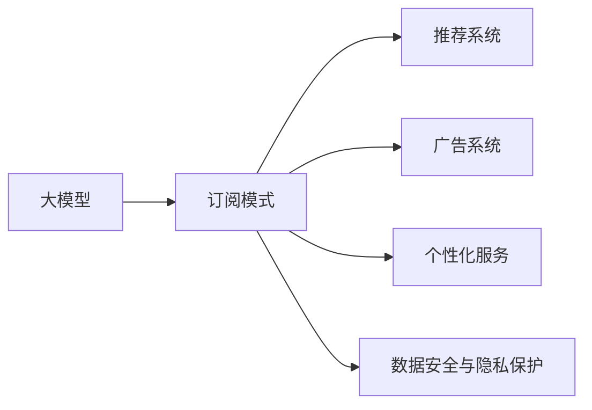
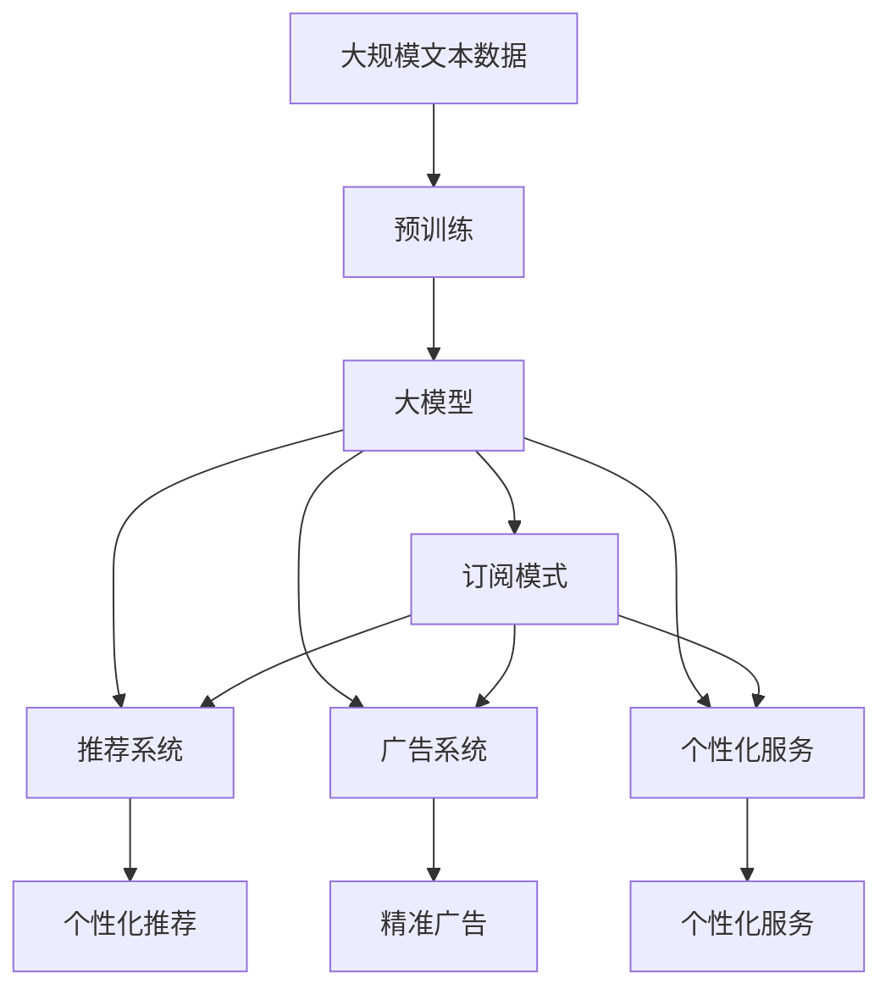

                 

# AI 大模型原理与应用：订阅商业模式

> 关键词：大模型,订阅模式,推荐系统,广告系统,个性化服务,数据安全,隐私保护

## 1. 背景介绍

### 1.1 问题由来
近年来，随着人工智能（AI）和大数据技术的迅猛发展，AI大模型在各行业的应用变得越来越广泛。从语音识别、图像处理到自然语言处理（NLP）、机器翻译，大模型的能力已经渗透到了各个领域。与此同时，AI大模型的训练成本和部署成本也在不断上升。这使得大规模商业化部署变得尤为困难，也限制了AI技术的广泛应用。

如何平衡成本与效益，实现大模型的商业化应用，成为了一个亟待解决的问题。订阅模式作为一种新兴的商业模式，提供了优化成本和扩大收益的新思路。

### 1.2 问题核心关键点
订阅模式是一种按使用量付费的商业模式，用户只需要支付一定的月费或年费，就可以使用AI大模型的各项服务。这种模式不仅能有效降低企业的运营成本，还能让普通用户也能享受到AI技术带来的便利。

订阅模式的关键点包括：
- 按需付费：用户根据自己的需求，选择合适的模型服务和套餐，按使用量付费，避免一次性支付高昂费用。
- 灵活性：用户可以随时调整使用量，无需担心长期合同的束缚。
- 安全性：用户数据加密传输，模型服务全程加密处理，保障数据安全。
- 隐私保护：订阅模式通过匿名化处理，减少个人数据的收集和使用。

这种模式不仅能降低企业的部署和使用成本，还能提高AI技术在各行业的渗透率，提升用户体验。

### 1.3 问题研究意义
订阅模式为大模型的商业化应用提供了新的思路。通过订阅模式，大模型的运营成本和推广成本得以有效降低，企业可以更灵活地推广和部署AI技术。同时，订阅模式还为个性化服务、广告系统、推荐系统等领域带来了新的应用机会。

1. **成本效益**：订阅模式降低了企业的部署和使用成本，使得更多企业能够负担得起AI大模型的使用，从而促进了AI技术在各行业的应用。
2. **用户覆盖**：订阅模式使得普通用户也能享受到AI技术带来的便利，拓展了AI技术的用户基础，提升了AI技术的社会价值。
3. **个性化服务**：通过订阅模式，用户可以根据自己的需求选择不同等级的模型服务，享受到更加个性化的服务体验。
4. **广告和推荐**：订阅模式在广告系统、推荐系统等领域的应用，提高了广告投放的精准性和推荐内容的个性化度，提升了用户体验。
5. **数据安全与隐私保护**：订阅模式通过加密处理和匿名化处理，保障了用户数据的安全和隐私，提升了用户对AI技术的信任度。

## 2. 核心概念与联系

### 2.1 核心概念概述

为了更好地理解订阅模式及其在大模型中的应用，我们首先介绍几个核心概念：

- **大模型（Large Model）**：指基于深度学习技术训练的大型神经网络模型，如BERT、GPT-3等，具备强大的语言理解和生成能力。
- **订阅模式（Subscription Model）**：指按使用量付费的商业模式，用户根据自己的需求选择不同等级的服务套餐，按月或按年支付费用。
- **推荐系统（Recommendation System）**：通过分析用户行为数据，推荐个性化的内容和服务。
- **广告系统（Ad System）**：通过精准定位用户需求，提高广告投放的转化率和效果。
- **个性化服务（Personalized Service）**：根据用户个性化需求，提供定制化服务。
- **数据安全与隐私保护（Data Security and Privacy Protection）**：采用加密、匿名化处理等技术，保障用户数据的安全和隐私。

这些核心概念之间通过订阅模式这一桥梁，形成了紧密的联系。订阅模式通过灵活的定价策略和按需服务，极大地降低了用户的使用成本，使得更多用户能够使用大模型的服务，从而提升AI技术的应用范围和价值。

### 2.2 概念间的关系

通过以下Mermaid流程图，我们可以更加清晰地理解这些核心概念之间的关系：



这个流程图展示了订阅模式与大模型的各项应用场景之间的关系。订阅模式通过灵活的服务套餐和按需定价，使得用户能够低成本地使用大模型的各项服务，从而提升了AI技术在推荐系统、广告系统、个性化服务等领域的广泛应用。

### 2.3 核心概念的整体架构

最后，我们通过一个综合的流程图来展示这些核心概念在大模型订阅模式中的整体架构：



这个综合流程图展示了从预训练到订阅模式的完整过程。大模型首先在大规模文本数据上进行预训练，然后通过订阅模式向用户提供个性化的推荐服务、广告投放和个性化服务。推荐系统、广告系统、个性化服务在大模型基础上的应用，使得AI技术能够更好地服务于用户，提升用户体验和满意度。

## 3. 核心算法原理 & 具体操作步骤
### 3.1 算法原理概述

订阅模式的原理基于按需付费的商业模式，用户可以根据自己的需求选择不同的服务套餐，按月或按年支付费用。这种模式不仅降低了企业的运营成本，还提高了AI技术在各行业的应用范围。

在大模型订阅模式中，用户通过API调用大模型的各项服务。模型服务在云端进行处理，并返回处理结果。用户根据自己的需求，可以选择不同的模型服务，如自然语言处理、图像识别、语音识别等。大模型的各项服务通过订阅模式进行定价，用户根据自己的使用量支付费用。

### 3.2 算法步骤详解

基于订阅模式的大模型服务通常包含以下几个步骤：

**Step 1: 用户注册和认证**
- 用户注册账号，填写个人信息。
- 系统对用户信息进行认证，确保信息真实有效。

**Step 2: 订阅服务套餐**
- 用户选择不同的服务套餐，如基础套餐、高级套餐等。
- 系统根据用户选择的套餐，调整模型的服务权限和资源分配。

**Step 3: 调用模型服务**
- 用户通过API调用大模型的各项服务，如自然语言处理、图像识别等。
- 模型在云端进行处理，并返回处理结果。

**Step 4: 结果反馈**
- 系统对处理结果进行反馈，告知用户服务调用结果。
- 用户根据处理结果进行下一步操作，如查询结果、调整参数等。

**Step 5: 费用结算**
- 系统根据用户使用量进行费用结算。
- 用户通过银行账户、支付宝、微信支付等方式进行支付。

### 3.3 算法优缺点

订阅模式在大模型应用中具有以下优点：
1. **降低成本**：用户按需支付服务费用，降低了企业的部署和使用成本，提高了AI技术的可扩展性。
2. **灵活性**：用户可以根据自己的需求选择不同的服务套餐，调整服务使用量，提高了模型的灵活性和适应性。
3. **提升用户体验**：订阅模式提供了个性化的服务套餐和灵活的使用方式，提升了用户对AI技术的接受度和满意度。
4. **数据安全与隐私保护**：订阅模式通过加密、匿名化处理，保障了用户数据的安全和隐私，提升了用户对AI技术的信任度。

但订阅模式也存在一些缺点：
1. **安全问题**：用户数据在云端存储和传输，存在一定的安全风险。
2. **隐私保护**：用户数据需要匿名化处理，但部分用户对隐私保护仍存在担忧。
3. **费用问题**：用户需要支付一定的服务费用，可能对一些中小企业造成负担。

### 3.4 算法应用领域

基于订阅模式的大模型应用广泛，涵盖了多个领域：

- **推荐系统**：通过订阅模式提供个性化推荐服务，提升用户购物体验。
- **广告系统**：通过订阅模式进行精准广告投放，提高广告投放的效果和转化率。
- **个性化服务**：通过订阅模式提供个性化的客服、金融、医疗等服务，提升用户体验。
- **自然语言处理**：通过订阅模式提供自然语言处理服务，如情感分析、文本分类、机器翻译等。
- **图像处理**：通过订阅模式提供图像识别、图像处理、图像生成等服务。
- **语音识别**：通过订阅模式提供语音识别、语音合成、语音翻译等服务。

## 4. 数学模型和公式 & 详细讲解 & 举例说明（备注：数学公式请使用latex格式，latex嵌入文中独立段落使用 $$，段落内使用 $)
### 4.1 数学模型构建

订阅模式的核心是按需付费的商业模式，其数学模型构建相对简单。我们通过以下公式来描述订阅模式的收费模型：

设用户每月使用大模型服务的总成本为 $C$，基础套餐费用为 $C_0$，高级套餐费用为 $C_1$，高级套餐的使用量为 $N$，则有：

$$
C = \begin{cases} 
C_0, & \text{如果} \, N \leq N_0 \\
C_0 + k(N - N_0), & \text{如果} \, N > N_0
\end{cases}
$$

其中 $N_0$ 为套餐所包含的使用量，$k$ 为超出套餐使用量的额外费用比例。

### 4.2 公式推导过程

订阅模式的核心是按需付费的商业模式，用户根据自己的使用量支付费用。其数学模型构建相对简单，主要分为两个部分：

1. **基础套餐**：用户支付固定的基础套餐费用，无论使用量多少。
2. **超出套餐使用量**：用户超出套餐使用量后，需要支付额外的费用。

假设用户每月使用大模型服务的总成本为 $C$，基础套餐费用为 $C_0$，高级套餐费用为 $C_1$，高级套餐的使用量为 $N$，则有：

$$
C = \begin{cases} 
C_0, & \text{如果} \, N \leq N_0 \\
C_0 + k(N - N_0), & \text{如果} \, N > N_0
\end{cases}
$$

其中 $N_0$ 为套餐所包含的使用量，$k$ 为超出套餐使用量的额外费用比例。

### 4.3 案例分析与讲解

以推荐系统为例，订阅模式通过按需付费的方式，提供个性化的推荐服务。用户可以根据自己的需求选择不同的推荐套餐，如基础套餐、高级套餐等。高级套餐包含更多的推荐算法和数据处理能力，用户可以根据自己的需求选择不同等级的套餐。

推荐系统通过订阅模式进行定价，用户根据自己的使用量支付费用。用户可以选择不同的推荐算法，如协同过滤、基于内容的推荐等。推荐系统在云端进行处理，并返回推荐结果。用户根据推荐结果进行下一步操作，如购买商品等。

## 5. 项目实践：代码实例和详细解释说明
### 5.1 开发环境搭建

要进行订阅模式的大模型应用开发，首先需要搭建开发环境。以下是使用Python进行订阅模式开发的流程：

1. 安装Anaconda：从官网下载并安装Anaconda，用于创建独立的Python环境。

2. 创建并激活虚拟环境：
```bash
conda create -n pytorch-env python=3.8 
conda activate pytorch-env
```

3. 安装PyTorch：根据CUDA版本，从官网获取对应的安装命令。例如：
```bash
conda install pytorch torchvision torchaudio cudatoolkit=11.1 -c pytorch -c conda-forge
```

4. 安装Flask：
```bash
pip install Flask
```

5. 安装Flask-RESTful：
```bash
pip install Flask-RESTful
```

6. 安装SQLAlchemy：
```bash
pip install SQLAlchemy
```

7. 安装WTForms：
```bash
pip install WTForms
```

8. 安装Flask-Login：
```bash
pip install Flask-Login
```

完成上述步骤后，即可在`pytorch-env`环境中开始订阅模式应用的开发。

### 5.2 源代码详细实现

下面我们以推荐系统为例，给出使用Flask框架开发订阅模式应用的PyTorch代码实现。

首先，定义推荐系统中的模型：

```python
from transformers import BertModel, BertTokenizer

class RecommendationModel:
    def __init__(self, model_path, tokenizer_path):
        self.model = BertModel.from_pretrained(model_path)
        self.tokenizer = BertTokenizer.from_pretrained(tokenizer_path)

    def encode(self, text):
        return self.tokenizer.encode_plus(text, add_special_tokens=True, return_tensors='pt', padding='max_length')
```

然后，定义推荐系统中的推荐算法：

```python
class RecommendationAlgorithm:
    def __init__(self, model, top_k=5):
        self.model = model
        self.top_k = top_k

    def recommend(self, user_id, item_ids, text):
        encoded_text = self.model.encode(text)
        similarity = self.model similarity(encoded_text, item_ids)
        top_items = sorted(similarity, key=lambda x: x[0], reverse=True)[:self.top_k]
        return [x[1] for x in top_items]
```

接着，定义订阅模式的API：

```python
from flask import Flask, request, jsonify

app = Flask(__name__)

@app.route('/recommend', methods=['POST'])
def recommend():
    user_id = request.form['user_id']
    item_ids = request.form['item_ids']
    text = request.form['text']
    model = RecommendationModel(model_path, tokenizer_path)
    algo = RecommendationAlgorithm(model)
    results = algo.recommend(user_id, item_ids, text)
    return jsonify(results)

if __name__ == '__main__':
    app.run(debug=True)
```

最后，启动推荐系统的API服务：

```python
python app.py
```

运行上述代码，推荐系统的API服务即可启动。用户可以通过HTTP请求调用API，获取个性化推荐结果。

### 5.3 代码解读与分析

让我们再详细解读一下关键代码的实现细节：

**RecommendationModel类**：
- `__init__`方法：初始化模型和分词器。
- `encode`方法：将用户输入的文本进行编码，返回模型所需的输入。

**RecommendationAlgorithm类**：
- `__init__`方法：初始化推荐算法。
- `recommend`方法：根据用户ID、商品ID和文本内容，进行个性化推荐。

**推荐系统API**：
- 定义了一个Flask应用的路由，接收HTTP POST请求，包含用户ID、商品ID和文本内容。
- 在路由函数中，从请求中获取参数，调用推荐算法进行推荐，返回推荐结果。

推荐系统的API服务通过Flask框架实现，可以方便地部署和调用。开发者可以根据实际需求，添加更多的API路由和功能，提升推荐系统的功能和用户体验。

## 6. 实际应用场景
### 6.1 智能客服系统

基于订阅模式的大模型，可以应用于智能客服系统的构建。智能客服系统能够7x24小时不间断服务，快速响应客户咨询，用自然流畅的语言解答各类常见问题。

通过订阅模式，企业可以根据自己的需求选择不同的服务套餐，按使用量付费。智能客服系统可以整合多种AI技术，如语音识别、自然语言处理、情感分析等，提供全面、精准的客户服务。

### 6.2 金融舆情监测

金融机构需要实时监测市场舆论动向，以便及时应对负面信息传播，规避金融风险。基于订阅模式的大模型，可以提供实时舆情监测服务，及时发现和应对市场风险。

通过订阅模式，金融机构可以根据自己的需求选择不同的服务套餐，按使用量付费。大模型可以分析海量新闻、报道、评论等文本数据，识别出市场风险和舆情变化趋势，及时预警，帮助金融机构快速应对潜在风险。

### 6.3 个性化推荐系统

当前的推荐系统往往只依赖用户的历史行为数据进行物品推荐，无法深入理解用户的真实兴趣偏好。基于订阅模式的大模型，可以提供个性化的推荐服务。

通过订阅模式，用户可以根据自己的需求选择不同的服务套餐，按使用量付费。大模型可以分析用户的浏览、点击、评论、分享等行为数据，提取和用户交互的物品标题、描述、标签等文本内容，提供更加精准、多样的推荐内容。

### 6.4 未来应用展望

随着订阅模式和大模型技术的不断发展，未来将在更多领域得到应用，为各行各业带来变革性影响。

在智慧医疗领域，基于订阅模式的大模型，可以提供医疗问答、病历分析、药物研发等应用，提升医疗服务的智能化水平，辅助医生诊疗，加速新药开发进程。

在智能教育领域，基于订阅模式的大模型，可以提供作业批改、学情分析、知识推荐等服务，因材施教，促进教育公平，提高教学质量。

在智慧城市治理中，基于订阅模式的大模型，可以提供城市事件监测、舆情分析、应急指挥等环节，提高城市管理的自动化和智能化水平，构建更安全、高效的未来城市。

此外，在企业生产、社会治理、文娱传媒等众多领域，基于订阅模式的大模型应用也将不断涌现，为经济社会发展注入新的动力。相信随着技术的日益成熟，订阅模式必将在构建人机协同的智能时代中扮演越来越重要的角色。

## 7. 工具和资源推荐
### 7.1 学习资源推荐

为了帮助开发者系统掌握订阅模式和大模型的理论基础和实践技巧，这里推荐一些优质的学习资源：

1. 《Deep Learning with Python》系列博文：由知名AI博主撰写，介绍了深度学习的基本概念和实践技巧。
2. Coursera《Deep Learning Specialization》课程：由Andrew Ng教授开设，系统讲解了深度学习的理论和实践。
3. CS231n《Convolutional Neural Networks for Visual Recognition》课程：由斯坦福大学开设，介绍了卷积神经网络在图像处理中的应用。
4. 《Transformer from Zero to Hero》书籍：详细介绍了Transformer模型及其在大模型中的应用。
5. HuggingFace官方文档：提供了海量预训练模型和完整的微调样例代码，是上手实践的必备资料。

通过对这些资源的学习实践，相信你一定能够快速掌握订阅模式和大模型的精髓，并用于解决实际的NLP问题。

### 7.2 开发工具推荐

高效的开发离不开优秀的工具支持。以下是几款用于订阅模式和大模型开发的常用工具：

1. PyTorch：基于Python的开源深度学习框架，灵活动态的计算图，适合快速迭代研究。大部分预训练语言模型都有PyTorch版本的实现。
2. TensorFlow：由Google主导开发的开源深度学习框架，生产部署方便，适合大规模工程应用。同样有丰富的预训练语言模型资源。
3. Flask：轻量级Web框架，适合开发RESTful API，可以方便地部署和调用。
4. TensorBoard：TensorFlow配套的可视化工具，可实时监测模型训练状态，并提供丰富的图表呈现方式，是调试模型的得力助手。
5. Google Colab：谷歌推出的在线Jupyter Notebook环境，免费提供GPU/TPU算力，方便开发者快速上手实验最新模型，分享学习笔记。

合理利用这些工具，可以显著提升订阅模式和大模型微调的开发效率，加快创新迭代的步伐。

### 7.3 相关论文推荐

订阅模式和大模型的发展源于学界的持续研究。以下是几篇奠基性的相关论文，推荐阅读：

1. Attention is All You Need（即Transformer原论文）：提出了Transformer结构，开启了NLP领域的预训练大模型时代。
2. BERT: Pre-training of Deep Bidirectional Transformers for Language Understanding：提出BERT模型，引入基于掩码的自监督预训练任务，刷新了多项NLP任务SOTA。
3. Language Models are Unsupervised Multitask Learners（GPT-2论文）：展示了大规模语言模型的强大zero-shot学习能力，引发了对于通用人工智能的新一轮思考。
4. Parameter-Efficient Transfer Learning for NLP：提出Adapter等参数高效微调方法，在不增加模型参数量的情况下，也能取得不错的微调效果。
5. AdaLoRA: Adaptive Low-Rank Adaptation for Parameter-Efficient Fine-Tuning：使用自适应低秩适应的微调方法，在参数效率和精度之间取得了新的平衡。

这些论文代表了大模型微调技术的发展脉络。通过学习这些前沿成果，可以帮助研究者把握学科前进方向，激发更多的创新灵感。

除上述资源外，还有一些值得关注的前沿资源，帮助开发者紧跟订阅模式和大模型的最新进展，例如：

1. arXiv论文预印本：人工智能领域最新研究成果的发布平台，包括大量尚未发表的前沿工作，学习前沿技术的必读资源。
2. 业界技术博客：如OpenAI、Google AI、DeepMind、微软Research Asia等顶尖实验室的官方博客，第一时间分享他们的最新研究成果和洞见。
3. 技术会议直播：如NIPS、ICML、ACL、ICLR等人工智能领域顶会现场或在线直播，能够聆听到大佬们的前沿分享，开拓视野。
4. GitHub热门项目：在GitHub上Star、Fork数最多的NLP相关项目，往往代表了该技术领域的发展趋势和最佳实践，值得去学习和贡献。
5. 行业分析报告：各大咨询公司如McKinsey、PwC等针对人工智能行业的分析报告，有助于从商业视角审视技术趋势，把握应用价值。

总之，对于订阅模式和大模型微调技术的学习和实践，需要开发者保持开放的心态和持续学习的意愿。多关注前沿资讯，多动手实践，多思考总结，必将收获满满的成长收益。

## 8. 总结：未来发展趋势与挑战
### 8.1 总结

本文对基于订阅模式的大模型进行了全面系统的介绍。首先阐述了订阅模式的原理及其在大模型中的应用，明确了订阅模式在降低成本、提高灵活性、提升用户体验等方面的独特价值。其次，从原理到实践，详细讲解了订阅模式的核心算法和具体操作步骤，给出了订阅模式应用的完整代码实例。同时，本文还广泛探讨了订阅模式在大模型中的应用场景，展示了订阅模式范式的巨大潜力。

通过本文的系统梳理，可以看到，基于订阅模式的大模型微调方法正在成为NLP领域的重要范式，极大地拓展了预训练语言模型的应用边界，催生了更多的落地场景。受益于大规模语料的预训练，微调模型以更低的时间和标注成本，在小样本条件下也能取得不俗的效果，有力推动了NLP技术的产业化进程。未来，伴随预训练语言模型和微调方法的持续演进，相信NLP技术将在更广阔的应用领域大放异彩，深刻影响人类的生产生活方式。

### 8.2 未来发展趋势

展望未来，订阅模式和大模型将呈现以下几个发展趋势：

1. **模型规模持续增大**：随着算力成本的下降和数据规模的扩张，预训练语言模型的参数量还将持续增长。超大规模语言模型蕴含的丰富语言知识，有望支撑更加复杂多变的下游任务微调。
2. **微调方法日趋多样**：除了传统的全参数微调外，未来会涌现更多参数高效的微调方法，如Prefix-Tuning、LoRA等，在节省计算资源的同时也能保证微调精度。
3. **持续学习成为常态**：随着数据分布的不断变化，微调模型也需要持续学习新知识以保持性能。如何在不遗忘原有知识的同时，高效吸收新样本信息，将成为重要的研究课题。
4. **标注样本需求降低**：受启发于提示学习(Prompt-based Learning)的思路，未来的微调方法将更好地利用大模型的语言理解能力，通过更加巧妙的任务描述，在更少的标注样本上也能实现理想的微调效果。
5. **多模态微调崛起**：当前的微调主要聚焦于纯文本数据，未来会进一步拓展到图像、视频、语音等多模态数据微调。多模态信息的融合，将显著提升语言模型对现实世界的理解和建模能力。
6. **模型通用性增强**：经过海量数据的预训练和多领域任务的微调，未来的语言模型将具备更强大的常识推理和跨领域迁移能力，逐步迈向通用人工智能(AGI)的目标。

以上趋势凸显了大模型微调技术的广阔前景。这些方向的探索发展，必将进一步提升NLP系统的性能和应用范围，为人类认知智能的进化带来深远影响。

### 8.3 面临的挑战

尽管订阅模式和大模型技术已经取得了瞩目成就，但在迈向更加智能化、普适化应用的过程中，它仍面临着诸多挑战：

1. **标注成本瓶颈**：虽然订阅模式降低了企业的部署和使用成本，但对于长尾应用场景，难以获得充足的高质量标注数据，成为制约微调性能的瓶颈。如何进一步降低微调对标注样本的依赖，将是一大难题。
2. **模型鲁棒性不足**：当前微调模型面对域外数据时，泛化性能往往大打折扣。对于测试样本的微小扰动，微调模型的预测也容易发生波动。如何提高微调模型的鲁棒性，避免灾难性遗忘，还需要更多理论和实践的积累。
3. **推理效率有待提高**：大规模语言模型虽然精度高，但在实际部署时往往面临推理速度慢、内存占用大等效率问题。如何在保证性能的同时，简化模型结构，提升推理速度，优化资源占用，将是重要的优化方向。
4. **可解释性亟需加强**：当前微调模型更像是"黑盒"系统，难以解释其内部工作机制和决策逻辑。对于医疗、金融等高风险应用，算法的可解释性和可审计性尤为重要。如何赋予微调模型更强的可解释性，将是亟待攻克的难题。
5. **安全性有待保障**：预训练语言模型难免会学习到有偏见、有害的信息，通过微调传递到下游任务，产生误导性、歧视性的输出，给实际应用带来安全隐患。如何从数据和算法层面消除模型偏见，避免恶意用途，确保输出的安全性，也将是重要的研究

