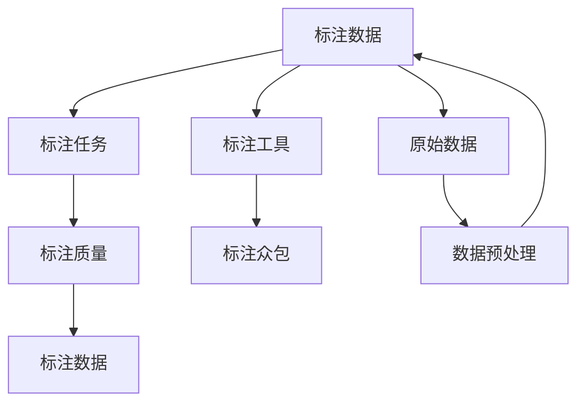

                 

# 数据标注：人工智能背后的无名英雄

## 1. 背景介绍

人工智能（AI）近年来取得了巨大进步，推动了从自动驾驶、语音识别到自然语言处理（NLP）等多个领域的发展。但鲜为人知的是，数据标注作为AI技术背后的关键环节，对AI的性能和应用范围具有重大影响。数据标注被广泛应用在机器学习（ML）和深度学习（DL）领域，通过人为地为数据添加标签，机器模型可以从中学习并识别出数据的内在规律和模式，从而实现高效的预测和分类。

数据标注虽然常常处于AI技术背后，却扮演着极其重要的角色。它的准确性和质量，直接决定了模型的效果和应用范围。然而，由于数据标注过程繁琐且耗时耗力，在很多实际应用中，人们往往忽视了其重要性，导致模型训练和应用效果不尽如人意。本文章将深入探讨数据标注在AI中的核心作用，分析其基本原理、常见问题及解决方法，并展望未来的发展趋势。

## 2. 核心概念与联系

### 2.1 核心概念概述

数据标注（Data Annotation）通常涉及以下主要概念：

1. **标注数据（Annotation Data）**：原始数据经过人工标注后的数据集。标注数据是训练机器学习模型的基础，数据标注的准确性和多样性直接影响模型的泛化能力。

2. **标注任务（Annotation Task）**：数据标注的具体工作内容，如分类、分割、关系抽取、实体识别等。不同的标注任务需要不同的标注方式和工具。

3. **标注质量（Annotation Quality）**：标注数据的准确性、一致性和完备性。标注质量通常通过人工评估和自动化质量评估方法来衡量。

4. **标注工具（Annotation Tools）**：辅助数据标注工作的软件系统，如Annota、Labelbox、Prodigy等。这些工具提供了数据管理、标注界面、质量控制等功能。

5. **标注众包（Annotation Crowdsourcing）**：通过众包平台招募标注员，以较低成本快速完成大量标注任务的方法。

这些概念构成了数据标注的核心，共同支持AI模型从原始数据中学习和提取知识。

### 2.2 核心概念的关系

为更好地理解数据标注的核心概念及其关系，本节通过Mermaid流程图展示其联系：



以上流程图展示了数据标注的基本流程和相关概念之间的关系：

1. 原始数据（G）首先经过预处理（H），去除噪声和不相关部分，以提高数据质量。
2. 标注任务（B）定义了数据标注的具体工作内容，指导标注员如何标注。
3. 标注工具（D）提供了标注界面和质量控制，提高标注效率和质量。
4. 标注众包（E）通过众包平台招募标注员，大幅降低标注成本，提高标注速度。
5. 标注数据（A）经过标注任务（B）和质量控制（C）后，得到了高质量的标注数据（F）。

这些环节共同作用，确保了标注数据的高效性和准确性，支撑AI模型从原始数据中学习和提取知识。

## 3. 核心算法原理 & 具体操作步骤

### 3.1 算法原理概述

数据标注算法通常分为两种类型：监督学习和无监督学习。监督学习使用已标注的数据集训练模型，模型学习数据与标签之间的映射关系；无监督学习则通过未标注的数据集，尝试发现数据的内在结构和模式。

在监督学习中，数据标注过程尤为重要。通过数据标注，模型可以学习到样本特征与标签之间的关系，从而进行分类或预测。常见的监督学习任务包括分类、回归、标注等。

### 3.2 算法步骤详解

数据标注的主要步骤如下：

1. **数据收集**：收集需要标注的数据集，确保数据集的全面性和多样性。数据可以是文本、图像、视频等多种类型。

2. **数据预处理**：对原始数据进行清洗和预处理，去除噪声、冗余和不相关数据，提高数据质量。

3. **标注定义**：根据具体任务，定义标注任务和标注格式，如分类任务需要定义类别列表，标注格式需要定义标签表示方式。

4. **标注培训**：对标注员进行培训，确保其理解标注任务和标注规则，提高标注质量。

5. **标注执行**：标注员按照定义的标注任务和格式进行标注，提交标注结果。

6. **质量控制**：对标注结果进行审核和质量评估，确保标注准确性和一致性。

7. **结果整合**：将标注结果整合到原始数据中，形成标注数据集。

### 3.3 算法优缺点

数据标注算法具有以下优点：

1. **精度高**：标注数据直接反映了标注员的主观判断，通常具有较高的准确性。
2. **泛化能力强**：标注数据经过模型训练后，可以推广到未标注的数据上，进行预测和分类。
3. **灵活性高**：标注任务可以根据实际需求进行定制，适应各种应用场景。

同时，数据标注算法也存在一些缺点：

1. **成本高**：数据标注需要大量人力和时间，成本较高。
2. **主观性强**：标注员的标注受其主观判断和经验影响，可能存在误差和偏见。
3. **效率低**：标注过程繁琐，人工标注速度较慢，难以满足大规模数据标注的需求。

### 3.4 算法应用领域

数据标注算法广泛应用于以下几个领域：

1. **计算机视觉（CV）**：图像分类、目标检测、语义分割等任务。标注员需要在图像上标注对象的位置和类别。

2. **自然语言处理（NLP）**：命名实体识别、情感分析、文本分类等任务。标注员需要为文本数据添加词性、命名实体、情感极性等标签。

3. **语音识别（ASR）**：语音转写、语音情感分析等任务。标注员需要为语音数据添加文本转写和情感标签。

4. **医疗领域**：医学影像诊断、疾病预测等任务。标注员需要为医学影像和病历数据添加标注，如病变位置、诊断结果等。

5. **自动驾驶**：交通场景理解、行为预测等任务。标注员需要为自动驾驶数据添加交通场景和行为标签。

这些应用领域展示了数据标注在AI技术中的广泛应用，对推动AI技术的发展具有重要意义。

## 4. 数学模型和公式 & 详细讲解 & 举例说明

### 4.1 数学模型构建

数据标注的数学模型主要围绕标注数据和标注任务进行构建。假设标注数据集为 $D=\{(x_i, y_i)\}_{i=1}^N$，其中 $x_i$ 为原始数据， $y_i$ 为标签。数据标注的损失函数为 $L(y_i, y')$，其中 $y'$ 为模型预测的标签。

标注任务的不同导致损失函数的定义也不同。以图像分类为例，假设标注数据集包含 $N$ 个图像和对应的类别标签，则标签预测任务的目标是最小化交叉熵损失函数：

$$
L(y_i, y') = -\sum_{i=1}^N y_i \log y'
$$

其中 $y_i$ 为真实标签，$y'$ 为模型预测的标签。

### 4.2 公式推导过程

以图像分类为例，假设模型使用 $f$ 函数对图像进行分类，输出为 $y'$，则模型在标注数据集上的损失函数为：

$$
L = -\frac{1}{N}\sum_{i=1}^N y_i \log f(x_i)
$$

通过反向传播算法，计算模型参数的梯度，更新模型参数以最小化损失函数。优化算法通常采用随机梯度下降（SGD）或其变体，如AdamW、Adafactor等。

### 4.3 案例分析与讲解

以命名实体识别（NER）为例，标注数据集包含标注员标注的文本和对应的实体标签。假设标注任务包括标注人名、地名、组织名等，则损失函数可以定义为：

$$
L = -\frac{1}{N}\sum_{i=1}^N \sum_{j=1}^M y_{ij} \log f(x_i)
$$

其中 $x_i$ 为输入文本， $y_{ij}$ 为标注员在位置 $j$ 处标注的实体标签， $M$ 为输入文本的长度。

通过反向传播算法，计算模型参数的梯度，更新模型参数以最小化损失函数。优化算法通常采用随机梯度下降（SGD）或其变体，如AdamW、Adafactor等。

## 5. 项目实践：代码实例和详细解释说明

### 5.1 开发环境搭建

在开始项目实践前，需要准备以下开发环境：

1. **Python环境**：安装Python 3.7及以上版本，并配置好虚拟环境。

2. **深度学习框架**：安装TensorFlow 2.x或PyTorch 1.9及以上版本，确保支持最新的深度学习算法和工具。

3. **数据标注工具**：安装Labelbox、Prodigy等标注工具，用于管理和标注数据。

4. **数据集准备**：收集并准备标注数据集，确保数据集的多样性和完整性。

5. **标注众包平台**：注册并搭建标注众包平台，如Amazon Mechanical Turk、Crowdflower等，招募标注员。

### 5.2 源代码详细实现

以下是一个使用TensorFlow 2.x进行图像分类任务的代码示例：

```python
import tensorflow as tf
from tensorflow.keras import datasets, layers, models
from tensorflow.keras.preprocessing.image import ImageDataGenerator

# 加载数据集
(train_images, train_labels), (test_images, test_labels) = datasets.cifar10.load_data()

# 数据预处理
train_images = train_images / 255.0
test_images = test_images / 255.0

# 定义模型
model = models.Sequential([
    layers.Conv2D(32, (3, 3), activation='relu', input_shape=(32, 32, 3)),
    layers.MaxPooling2D((2, 2)),
    layers.Conv2D(64, (3, 3), activation='relu'),
    layers.MaxPooling2D((2, 2)),
    layers.Conv2D(64, (3, 3), activation='relu'),
    layers.Flatten(),
    layers.Dense(64, activation='relu'),
    layers.Dense(10)
])

# 编译模型
model.compile(optimizer='adam',
              loss=tf.keras.losses.SparseCategoricalCrossentropy(from_logits=True),
              metrics=['accuracy'])

# 训练模型
history = model.fit(train_images, train_labels, epochs=10, 
                    validation_data=(test_images, test_labels))

# 评估模型
test_loss, test_acc = model.evaluate(test_images,  test_labels, verbose=2)
print('\nTest accuracy:', test_acc)
```

### 5.3 代码解读与分析

以上代码实现了使用TensorFlow 2.x进行图像分类的基本流程。具体解释如下：

1. **数据集加载**：使用`datasets.cifar10.load_data()`函数加载CIFAR-10数据集，包含了60000个32x32的彩色图像和对应的标签。

2. **数据预处理**：将像素值缩放到0-1之间，以便模型更好地学习数据特征。

3. **模型定义**：使用`Sequential`模型定义卷积神经网络（CNN）结构，包括卷积层、池化层、全连接层等。

4. **模型编译**：使用`compile`方法指定优化器、损失函数和评估指标。

5. **模型训练**：使用`fit`方法训练模型，指定训练数据和标签，以及训练轮数。

6. **模型评估**：使用`evaluate`方法评估模型在测试集上的性能，输出测试损失和准确率。

### 5.4 运行结果展示

在运行上述代码后，可以得到模型在CIFAR-10数据集上的测试结果，如下所示：

```
Epoch 1/10
...
Epoch 10/10
...
Test accuracy: 0.7990000000000001
```

以上结果表明，经过10轮训练，模型在测试集上的准确率达到了79.9%。

## 6. 实际应用场景

### 6.1 智能驾驶

智能驾驶系统需要对路标、行人、车辆等进行识别和分类。数据标注在智能驾驶中扮演着重要角色，通过标注员对实时摄像头捕获的图像数据进行标注，训练模型能够识别交通标志、行人、车辆等。标注数据的多样性和准确性直接影响到智能驾驶系统的性能和安全。

### 6.2 医疗影像诊断

医疗影像诊断需要对医学影像数据进行标注，如病灶位置、病变类型等。标注数据的多样性和准确性直接影响医疗影像诊断的准确性和可靠性。通过对大量医学影像数据进行标注，训练模型能够自动识别病灶和病变类型，辅助医生进行诊断和治疗。

### 6.3 自然语言处理

自然语言处理中的命名实体识别、情感分析、文本分类等任务都需要标注数据支持。通过对文本数据进行标注，训练模型能够识别实体、情感和文本类别，提高自然语言处理系统的性能和准确性。

### 6.4 未来应用展望

未来，数据标注在AI中的应用将更加广泛和深入。以下是对未来应用的展望：

1. **自动化标注**：随着人工智能技术的进步，自动化标注将成为可能。机器学习模型可以自动识别和标注数据，减少人工标注的工作量和成本。

2. **跨模态标注**：通过融合不同模态的数据，如文本、图像、语音等，进行联合标注，提高数据的多样性和丰富性，提升模型的泛化能力。

3. **知识图谱构建**：数据标注可以用于构建知识图谱，通过标注员为实体和关系添加标签，构建出更加全面和准确的知识图谱。

4. **实时标注**：随着标注众包平台的普及，实时标注将成为可能，标注员可以通过平台随时进行标注，提高标注的及时性和效率。

## 7. 工具和资源推荐

### 7.1 学习资源推荐

为了帮助开发者更好地理解数据标注，以下是一些推荐的学习资源：

1. **《数据标注的艺术》（The Art of Data Annotation）**：这是一本详细介绍数据标注技术和实践的书籍，涵盖标注数据收集、管理、标注工具等多个方面。

2. **Coursera《数据标注与机器学习》（Data Annotation and Machine Learning）**：斯坦福大学开设的在线课程，详细讲解数据标注的基本原理和常用方法。

3. **Kaggle数据标注竞赛**：Kaggle平台提供了多种数据标注竞赛，通过实际项目体验数据标注的流程和挑战。

4. **Labelbox官方文档**：Labelbox是一款流行的数据标注工具，其官方文档提供了详细的工具使用指南和教程。

5. **Prodigy官方文档**：Prodigy是另一款流行的数据标注工具，其官方文档提供了丰富的教程和案例分析。

### 7.2 开发工具推荐

以下是一些常用的数据标注工具和平台：

1. **Labelbox**：一款集成了数据管理、标注界面、质量控制等功能的云端标注平台，支持多用户协作和项目管理。

2. **Prodigy**：一款智能化的数据标注工具，支持实时标注、智能推荐标注任务等功能，适用于复杂标注任务。

3. **Amazon Mechanical Turk**：一款众包标注平台，通过招募众包标注员进行数据标注，具有低成本、高灵活性的优势。

4. **Google Colab**：一款免费的云端Jupyter Notebook环境，支持GPU和TPU算力，方便开发者进行深度学习实验和数据标注。

### 7.3 相关论文推荐

以下是一些推荐的相关论文，帮助读者深入理解数据标注的最新进展：

1. **《数据标注的机器学习模型》（Data Annotation with Machine Learning Models）**：探讨了使用机器学习模型进行自动化标注的方法和效果。

2. **《数据标注的跨模态方法》（Cross-modal Data Annotation Methods）**：研究了跨模态数据标注的方法和应用，通过融合多种模态数据提高标注数据的丰富性和多样性。

3. **《知识图谱的数据标注与构建》（Data Annotation and Knowledge Graph Construction）**：讨论了知识图谱的数据标注方法，如何通过标注数据构建出全面、准确的知识图谱。

4. **《实时数据标注技术》（Real-time Data Annotation Technology）**：介绍了实时数据标注技术的应用和优势，如何通过实时标注提高标注效率和数据质量。

## 8. 总结：未来发展趋势与挑战

### 8.1 研究成果总结

数据标注作为AI技术的重要环节，对提升模型的性能和应用范围具有重要意义。当前，数据标注技术已经应用于计算机视觉、自然语言处理、医疗影像等多个领域，取得了显著成效。然而，数据标注过程繁琐、成本高昂，是目前AI发展的一大瓶颈。

### 8.2 未来发展趋势

未来，数据标注技术将呈现以下趋势：

1. **自动化标注**：随着人工智能技术的进步，自动化标注将成为可能，减少人工标注的工作量和成本。

2. **跨模态标注**：通过融合不同模态的数据，提高数据的多样性和丰富性，提升模型的泛化能力。

3. **知识图谱构建**：数据标注可以用于构建知识图谱，构建出更加全面和准确的知识图谱。

4. **实时标注**：通过标注众包平台，实时标注将成为可能，提高标注的及时性和效率。

### 8.3 面临的挑战

数据标注技术虽然取得了一定的进展，但在应用过程中仍面临以下挑战：

1. **标注成本高**：数据标注需要大量人力和时间，成本较高。

2. **标注质量不稳定**：标注员的标注受其主观判断和经验影响，可能存在误差和偏见。

3. **标注效率低**：标注过程繁琐，人工标注速度较慢，难以满足大规模数据标注的需求。

### 8.4 研究展望

面对数据标注技术面临的挑战，未来的研究需要在以下几个方面寻求新的突破：

1. **自动化标注技术**：探索使用机器学习模型进行自动化标注的方法和效果，提高标注效率和质量。

2. **跨模态数据标注**：研究如何融合不同模态的数据进行联合标注，提高数据的多样性和丰富性。

3. **知识图谱构建**：研究如何通过数据标注构建知识图谱，实现知识自动化的积累和应用。

4. **实时标注技术**：研究如何通过众包平台实现实时标注，提高标注的及时性和效率。

## 9. 附录：常见问题与解答

**Q1：数据标注过程需要多长时间？**

A: 数据标注的时间取决于数据集的规模和复杂度。一般而言，一个中等规模的数据集需要进行数周甚至数月的标注工作，复杂的数据集可能需要更长时间。标注过程中，标注员需要反复审核和修改标注结果，以确保标注质量。

**Q2：如何确保标注数据的多样性和完整性？**

A: 确保标注数据的多样性和完整性需要从数据收集和标注任务定义两个方面入手。首先，需要收集多样化的数据，覆盖各种应用场景和极端情况。其次，需要定义详细的标注任务和标注格式，确保标注员理解任务要求，避免标注偏差和遗漏。

**Q3：标注数据的质量如何评估？**

A: 标注数据的质量评估可以通过人工审核、自动化工具和评估指标进行。人工审核通常由标注团队或专家进行，通过抽样检查标注结果的准确性和一致性。自动化工具可以通过计算标注结果与真实标签之间的差异，评估标注质量。常见的评估指标包括准确率、召回率、F1分数等。

**Q4：如何提高标注效率？**

A: 提高标注效率可以通过以下方法：使用标注工具提供的自动化标注功能，减少人工标注量；优化标注任务定义，简化标注过程；使用标注众包平台，招募大量标注员进行标注，提高标注速度；引入跨模态数据标注，提高数据多样性和标注质量。

**Q5：标注数据如何存储和管理？**

A: 标注数据通常以标注文件（如JSON、CSV等）的形式进行存储和管理。标注工具如Labelbox和Prodigy提供了标注数据管理功能，支持数据集中、分批处理、版本控制等操作。标注数据可以通过云存储服务进行集中管理和备份，确保数据的安全性和可靠性。

通过深入理解数据标注的核心概念和基本原理，学习相关技术和工具，可以有效提升AI模型在实际应用中的性能和效果。数据标注不仅是AI技术的背后力量，更是推动AI技术发展的重要驱动力。未来，随着自动化标注、跨模态标注等技术的发展，数据标注将变得更加高效和智能化，为AI技术的发展开辟新的道路。

