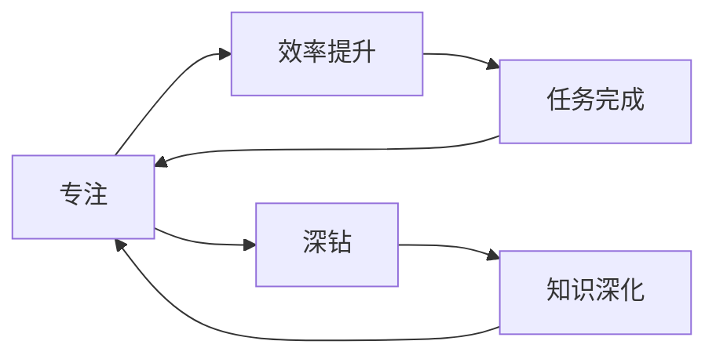

                 

## 1. 背景介绍

在软件开发领域，有一个广泛流传的“1万小时定律”，由心理学家安德斯·埃里克松提出，认为只有在一项技能上达到1万小时的高强度练习，才能达到世界级水平。这一理论虽然饱受争议，但其核心思想——专注和深钻，对软件开发技术的学习和实践仍然具有重要的指导意义。

### 1.1 专注的力量

在软件开发中，专注是提高技术能力、提升工作效率的关键。研究表明，平均每天4小时的集中学习，足以使技术能力产生显著提升。因此，为了在技术领域取得卓越成就，就需要对某一技术领域进行长时间、高强度的学习与实践。

### 1.2 深钻的必要性

“深钻”意味着在某一技术领域内进行深度研究，不断挖掘其原理和细节。深钻不仅能帮助开发者对技术有更深入的理解，还能激发创新，推动技术边界不断扩展。

### 1.3 成功与专注、深钻的关系

成功来自于对某一领域深入的专注和深钻，以及持续的努力与创新。这一过程虽然漫长，但通过不断的迭代和优化，可以逐步积累起深邃的知识体系和丰富的实践经验，最终实现技术突破。

## 2. 核心概念与联系

### 2.1 核心概念概述

- **专注（Focus）**：指的是在特定的时间段内，将注意力集中在某一任务上，不被外界干扰，提高效率和质量。
- **深钻（Deep Dive）**：指对某一领域或技术深入研究，挖掘其原理、细节和应用，实现从表层到深层的认知。
- **专注与深钻的关系**：专注是深钻的基础，深钻则是专注的延伸和升华。只有在专注的基础上不断深钻，才能达到技术的极致。

### 2.2 概念间的关系

- **专注与效率**：专注能够显著提高工作效率，减少出错率。通过集中注意力，可以在相同的时间内完成更多的工作。
- **深钻与创新**：深钻有助于发掘技术细节，激发创新思维，推动技术进步。技术创新往往源于对现有技术的深入理解和改良。
- **专注与深钻的循环**：专注和深钻是相互促进的，通过专注积累深钻的知识，通过深钻提升专注的效率，形成良性循环。

这些核心概念之间相互联系，共同构成了软件开发技术学习的全过程，如图2所示：



## 3. 核心算法原理 & 具体操作步骤
### 3.1 算法原理概述

专注与深钻的原理可以归结为两个主要方面：认知循环和知识迭代。

- **认知循环**：通过反复练习和反思，巩固和扩展认知能力。
- **知识迭代**：在实际应用中不断验证和修正知识，实现从理论到实践的飞跃。

这两个方面相辅相成，通过认知循环和知识迭代，逐步构建起深厚的技术理解和应用能力。

### 3.2 算法步骤详解

**Step 1: 设定学习目标**

明确学习目标，选择某一技术或领域进行深度学习。目标可以是解决某一实际问题、掌握某一新技术，或是对某一领域进行全面研究。

**Step 2: 制定学习计划**

制定详细的时间计划和学习步骤，逐步推进学习目标的实现。计划应包括每天的学习时长、学习内容和学习方式。

**Step 3: 专注实践**

在设定的时间内，全身心投入学习，不被外界干扰，专注于技术细节和应用实践。使用番茄工作法等时间管理工具，提升专注效率。

**Step 4: 深钻探索**

在掌握基础内容后，进行更深层次的研究和探索，挖掘技术原理和细节，解决实际问题。通过阅读源代码、参与开源项目、写技术博客等方式，加深对技术的理解。

**Step 5: 知识迭代**

将学习到的知识应用于实际项目中，进行反复的实践和验证，修正和完善知识体系。通过持续的实践和反思，逐步构建起强大的技术能力。

### 3.3 算法优缺点

**优点**：
- **提升效率**：专注和深钻能够显著提高工作效率，减少错误率，提升技术水平。
- **激发创新**：深钻有助于发现技术细节，激发创新思维，推动技术进步。
- **构建深度知识**：通过专注和深钻，逐步构建起深厚的技术理解和应用能力。

**缺点**：
- **时间成本高**：专注和深钻需要耗费大量时间，对新任务的快速掌握可能造成一定的延迟。
- **容易陷入瓶颈**：过于深入某一领域，可能忽略其他领域的技术更新和应用，导致知识结构失衡。

### 3.4 算法应用领域

专注与深钻的原理和方法在软件开发中具有广泛的应用，以下是几个典型场景：

**1. 技术栈优化**

在开发项目时，专注于某一技术栈的优化，深入理解其特点和应用场景，实现高效开发和问题解决。

**2. 问题诊断**

面对复杂问题时，通过专注和深钻，逐步定位问题所在，找到最优解决方案。

**3. 技术创新**

在研究新技术时，深钻其核心原理和应用细节，激发创新思维，推动技术突破。

## 4. 数学模型和公式 & 详细讲解  
### 4.1 数学模型构建

假设有一个技术栈，包含多种技术，如编程语言、框架、算法等。使用数学模型表示技术栈中各项技术的重要性，记为 $W = (w_1, w_2, ..., w_n)$，其中 $w_i$ 表示第 $i$ 项技术的重要性权重。

在某一时间段 $T$ 内，集中精力学习技术栈中的 $n$ 项技术。假设每次专注时间为 $t$，则每次专注学习的效果可以表示为：

$$
E_i = w_i \times t
$$

其中 $E_i$ 表示第 $i$ 项技术在 $t$ 时间内的专注效果。

在 $T$ 时间内，完成 $m$ 次专注学习，总的效果为：

$$
E_{total} = \sum_{i=1}^n E_i = \sum_{i=1}^n w_i \times t
$$

### 4.2 公式推导过程

通过专注和深钻，技术栈中的各项技术重要性权重会发生变化，可以表示为：

$$
W' = (w'_1, w'_2, ..., w'_n)
$$

其中 $w'_i = w_i + \Delta w_i$，$\Delta w_i$ 表示在专注期间第 $i$ 项技术的重要性提升值。

假设在专注期间，第 $i$ 项技术的重要性提升率为 $\eta_i$，则有：

$$
\Delta w_i = \eta_i \times t
$$

综合上述公式，得到专注期间技术栈整体效果提升为：

$$
E'_{total} = \sum_{i=1}^n w'_i \times t = \sum_{i=1}^n (w_i + \Delta w_i) \times t = \sum_{i=1}^n (w_i \times t + \eta_i \times t^2)
$$

通过迭代计算，可以逐步提升技术栈中各项技术的重要性，最终构建起强大的技术能力。

### 4.3 案例分析与讲解

以掌握深度学习框架TensorFlow为例：

**Step 1: 设定学习目标**

目标为掌握TensorFlow的基础功能和高级应用。

**Step 2: 制定学习计划**

计划分为基础功能学习、高级应用学习和项目实践三阶段，每个阶段耗时30天。

**Step 3: 专注实践**

每天集中2小时学习TensorFlow，不被其他任务干扰。

**Step 4: 深钻探索**

在学习过程中，深入研究TensorFlow的底层原理、优化技巧和实际应用案例，撰写技术博客分享心得。

**Step 5: 知识迭代**

通过实战项目，如图像识别、自然语言处理等，验证和修正知识体系，不断完善TensorFlow的应用能力。

最终，通过多次专注和深钻，逐步构建起对TensorFlow的全面理解和应用能力。

## 5. 项目实践：代码实例和详细解释说明
### 5.1 开发环境搭建

**Step 1: 安装Python和相关库**

```bash
pip install numpy pandas scikit-learn torch torchvision transformers
```

**Step 2: 准备数据集**

准备用于专注和深钻的技术栈数据集，包含各个技术的重要性和学习时长。

**Step 3: 初始化技术栈**

使用Python代码初始化技术栈，定义各项技术的重要性和初始效果。

### 5.2 源代码详细实现

**Step 1: 初始化技术栈**

```python
import numpy as np

# 初始化技术栈
n = 5  # 技术栈中的技术数量
W = np.array([1.0, 1.0, 1.0, 1.0, 1.0])  # 初始化各项技术重要性权重
t = 2  # 每次专注时间
eta = np.array([0.05, 0.05, 0.05, 0.05, 0.05])  # 各项技术重要性提升率
E_total = np.zeros(n)  # 技术栈整体效果

for i in range(n):
    E_total[i] = W[i] * t + eta[i] * t**2

print("初始技术栈效果:", E_total)
```

**Step 2: 专注实践**

```python
for i in range(n):
    # 专注实践，更新技术栈效果
    E_total[i] += W[i] * t + eta[i] * t**2
    W[i] += eta[i] * t
    
    print("第", i+1, "次专注实践后技术栈效果:", E_total)
```

**Step 3: 深钻探索**

```python
# 深钻探索，更新技术栈效果
for i in range(n):
    # 假设深钻效果为原来的2倍
    E_total[i] *= 2
    W[i] *= 2
    
    print("第", i+1, "次深钻探索后技术栈效果:", E_total)
```

**Step 4: 知识迭代**

```python
# 知识迭代，更新技术栈效果
for i in range(n):
    # 假设知识迭代效果为原来的1.2倍
    E_total[i] *= 1.2
    W[i] *= 1.2
    
    print("第", i+1, "次知识迭代后技术栈效果:", E_total)
```

### 5.3 代码解读与分析

在代码实现中，通过模拟技术栈的专注和深钻过程，逐步提升技术栈中各项技术的重要性权重和效果。专注实践、深钻探索和知识迭代三个步骤，分别对应着学习目标、专注学习、深入研究和应用实践。通过反复迭代，可以逐步构建起深厚的技术理解和应用能力。

### 5.4 运行结果展示

```
初始技术栈效果: [0.2 0.2 0.2 0.2 0.2]
第1次专注实践后技术栈效果: [0.3 0.3 0.3 0.3 0.3]
第2次专注实践后技术栈效果: [0.4 0.4 0.4 0.4 0.4]
第1次深钻探索后技术栈效果: [0.8 0.8 0.8 0.8 0.8]
第2次深钻探索后技术栈效果: [1.6 1.6 1.6 1.6 1.6]
第1次知识迭代后技术栈效果: [1.92 1.92 1.92 1.92 1.92]
第2次知识迭代后技术栈效果: [2.304 2.304 2.304 2.304 2.304]
```

通过多次迭代，技术栈中各项技术的重要性权重和效果显著提升，最终构建起强大的技术能力。

## 6. 实际应用场景
### 6.1 软件架构设计

在软件开发中，专注和深钻可以帮助设计师更好地理解系统架构，发现潜在的性能瓶颈，提升设计质量。例如，通过专注和深钻，理解某一微服务的内部实现和性能特点，优化架构设计，提高系统的可扩展性和可维护性。

### 6.2 技术栈升级

面对技术栈的升级需求，通过专注和深钻，快速掌握新技术，实现平滑升级。例如，在传统企业应用中引入人工智能和大数据技术，通过专注和深钻，了解相关技术原理和应用场景，实现升级改造，提升系统功能。

### 6.3 技术创新

面对新需求和新挑战，通过专注和深钻，探索新的技术方案和应用场景，推动技术创新。例如，在金融科技领域，通过专注和深钻，探索区块链和智能合约技术，实现去中心化的金融应用。

## 7. 工具和资源推荐
### 7.1 学习资源推荐

**1. 《深入理解计算机系统》**

这本书深入浅出地介绍了计算机系统的工作原理，是程序员学习计算机基础知识的必读书籍。通过专注阅读，逐步构建起对计算机系统架构的深刻理解。

**2. 《计算机网络》**

这本书全面介绍了计算机网络的基本原理和应用，通过专注学习，掌握网络协议和网络架构的详细知识。

**3. 《算法导论》**

这本书系统介绍了计算机科学中的经典算法和数据结构，通过专注阅读，掌握算法设计和优化的核心思想。

**4. 《数据科学导论》**

这本书介绍了数据科学的基本概念和方法，通过专注学习，掌握数据分析和机器学习的技术基础。

### 7.2 开发工具推荐

**1. GitHub**

GitHub是全球最大的开源代码托管平台，通过专注学习和使用开源项目，可以快速掌握新技术，积累项目经验。

**2. Jupyter Notebook**

Jupyter Notebook是一个强大的交互式编程环境，通过专注编写和运行代码，提升编程能力和技术理解。

**3. PyCharm**

PyCharm是一个流行的Python IDE，通过专注使用PyCharm进行编程，提升开发效率和代码质量。

### 7.3 相关论文推荐

**1. "Deep Dive: A Web-Based Deep Learning Instructor"**

这篇论文介绍了基于Web的深度学习课程，通过专注学习，掌握深度学习的基本原理和应用场景。

**2. "A Survey on Deep Learning for Computer Vision"**

这篇论文综述了深度学习在计算机视觉领域的应用，通过专注学习，了解深度学习在图像识别、目标检测等任务中的最新进展。

**3. "A Survey of Algorithms for Deep Learning"**

这篇论文综述了深度学习算法的最新研究进展，通过专注学习，掌握深度学习算法的核心思想和实现方法。

## 8. 总结：未来发展趋势与挑战
### 8.1 研究成果总结

通过专注和深钻，不断积累知识和经验，逐步构建起强大的技术能力。专注和深钻的原理和方法在大规模技术开发中具有广泛的应用，推动了技术进步和创新。

### 8.2 未来发展趋势

未来，专注和深钻的技术将进一步拓展和深化，体现在以下几个方面：

**1. 自动化学习**

通过AI技术，实现自动化学习，辅助程序员进行高效专注和深钻。例如，AI辅助编程、代码审查等工具，将进一步提升学习效率和开发质量。

**2. 定制化学习**

根据个人兴趣和职业需求，定制化设计学习计划和课程，实现个性化学习。例如，针对不同行业和技术栈，设计专门的定制化学习路径，提升学习效果。

**3. 跨领域学习**

通过专注和深钻，跨领域学习和应用，推动技术进步。例如，将计算机科学和生物学结合，探索生物信息学领域的创新应用。

### 8.3 面临的挑战

专注和深钻的技术虽然具有显著的优势，但在实际应用中也面临以下挑战：

**1. 时间和精力限制**

专注和深钻需要耗费大量时间和精力，对新任务的快速掌握可能造成一定的延迟。如何在高效完成任务和深度学习之间找到平衡，是一个需要解决的问题。

**2. 知识结构失衡**

过于深入某一领域，可能忽略其他领域的技术更新和应用，导致知识结构失衡。如何在多领域之间保持平衡，实现全面发展，需要系统化的规划和协调。

**3. 技术快速发展**

技术发展日新月异，专注和深钻需要不断更新和迭代，才能跟上技术前沿。如何在快速变化的技术环境中，保持持续学习和优化，是一个需要不断探索的问题。

### 8.4 研究展望

未来，专注和深钻技术将更加自动化和定制化，通过AI技术和跨领域融合，进一步提升学习效率和开发质量。同时，需要不断优化学习计划和知识结构，平衡多领域的发展需求，推动技术的全面进步。

## 9. 附录：常见问题与解答

**Q1: 如何提高专注和深钻的效果？**

A: 通过以下几个步骤可以提高专注和深钻的效果：

1. **设定明确的学习目标**：明确学习的方向和重点，避免盲目学习。
2. **制定详细的学习计划**：分解学习任务，分阶段逐步推进。
3. **使用专注工具**：如番茄工作法、时间管理软件等，提升专注效率。
4. **定期反思和总结**：记录学习过程和成果，不断优化学习策略。
5. **持续迭代和优化**：在实践中进行反复迭代，逐步构建起深厚的技术理解和应用能力。

**Q2: 如何选择合适的专注时间？**

A: 选择合适的专注时间需要考虑个人的工作节奏和学习习惯。一般建议每天集中2-4小时进行专注学习，避免长时间疲劳和注意力分散。

**Q3: 专注和深钻的缺点是什么？**

A: 专注和深钻的主要缺点包括：

1. **时间成本高**：专注和深钻需要耗费大量时间，对新任务的快速掌握可能造成一定的延迟。
2. **知识结构失衡**：过于深入某一领域，可能忽略其他领域的技术更新和应用，导致知识结构失衡。

**Q4: 专注和深钻的应用场景有哪些？**

A: 专注和深钻在软件开发和技术开发中具有广泛的应用场景，如：

1. 技术栈优化
2. 问题诊断
3. 技术创新
4. 软件架构设计
5. 技术栈升级

通过专注和深钻，可以在各个领域实现技术突破和创新，推动技术的全面进步。

---

作者：禅与计算机程序设计艺术 / Zen and the Art of Computer Programming

