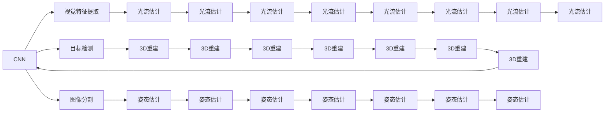
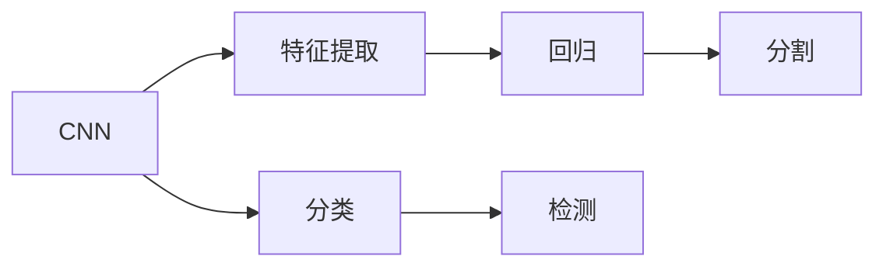
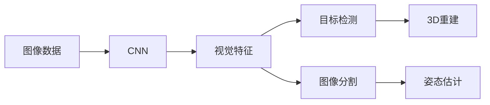
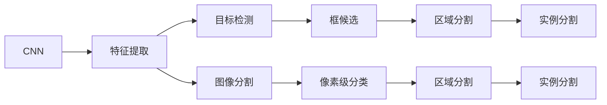
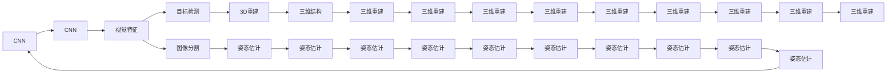

                 

# 机器视觉 (Computer Vision)

> 关键词：机器视觉,卷积神经网络(CNN),视觉特征提取,目标检测,图像分割,光流估计,3D重建,姿态估计,图像生成,深度学习

## 1. 背景介绍

### 1.1 问题由来
随着计算机硬件和软件的飞速发展，机器视觉技术逐渐成为信息时代的重要组成部分。机器视觉指的是通过计算机对数字图像进行处理，获取视觉信息，进而完成图像识别、目标检测、图像分割、姿态估计、三维重建等任务。与传统视觉方法相比，机器视觉具有处理速度快、精度高、适应性强等优势，广泛应用于工业制造、医疗诊断、智能监控、自动驾驶等领域。

近年来，深度学习技术在机器视觉领域取得了革命性的突破，尤其是卷积神经网络（Convolutional Neural Networks, CNN）的崛起，将机器视觉技术带入了新的发展阶段。基于深度学习的机器视觉模型不仅能够处理复杂的图像特征，还能通过大规模数据集进行预训练，大大提升了模型的泛化能力和应用范围。

然而，尽管深度学习模型在计算机视觉领域表现出色，但也面临诸如计算资源需求高、训练时间漫长、数据质量要求高等问题。此外，当前的深度学习模型还存在一定的局限性，如在面对小样本、新场景、隐私保护等问题时，表现不佳。因此，如何进一步优化深度学习模型，提升其在不同场景下的表现，是大数据时代机器视觉研究的重要课题。

### 1.2 问题核心关键点
机器视觉的核心在于通过深度学习模型，将原始图像数据转化为可被计算机处理的特征表示，进而实现图像识别、目标检测、图像分割等任务。其主要关键点包括：

- 卷积神经网络：作为机器视觉的主流模型，CNN利用卷积操作提取图像中的局部特征，通过多层次的抽象，逐步学习出更高级别的特征。
- 迁移学习：在缺乏充足标注数据的情况下，利用预训练模型迁移学习到其他领域的知识，提升模型在新场景下的泛化能力。
- 数据增强：通过数据增强技术，如旋转、翻转、裁剪等，丰富训练集多样性，缓解数据不足问题。
- 目标检测与图像分割：利用不同框架（如RCNN、YOLO、Mask R-CNN等）实现对图像中不同目标的识别和分割。
- 光流估计与3D重建：通过深度学习方法，实现对图像中运动变化和三维结构的估计和重建。
- 姿态估计与图像生成：利用神经网络，实现对图像中物体姿态的估算，或生成新的视觉图像。
- 计算资源优化：通过硬件加速（如GPU、TPU等）、模型压缩、量化加速等技术，降低计算需求，提升运行效率。

这些关键点相互交织，构成了机器视觉技术的核心框架。通过理解这些关键概念，我们能够更好地把握机器视觉技术的工作原理和优化方向。

### 1.3 问题研究意义
研究机器视觉技术，对于推动计算机视觉技术的发展、提升自动化水平、构建智能交互系统具有重要意义：

1. 降低开发成本。机器视觉技术能够快速处理大量图像数据，大大减少了对人工标注的依赖，降低了开发成本。
2. 提升识别准确率。深度学习模型的丰富特征提取能力，使其在图像识别、目标检测等任务上表现出色，提升了整体性能。
3. 加速自动化应用。机器视觉技术广泛应用在工业自动化、智能监控等领域，提高了生产效率和工作质量。
4. 促进数据驱动决策。通过图像处理，机器视觉技术能够自动化生成大量有价值的数据，辅助决策分析，提升决策的科学性和准确性。
5. 推动产业升级。机器视觉技术的突破，为传统行业提供了新的技术路径，加速了数字化转型。

总之，机器视觉技术的发展，不仅推动了计算机视觉技术的进步，也为各行各业带来了新的应用场景和商业价值。

## 2. 核心概念与联系

### 2.1 核心概念概述

为更好地理解机器视觉技术，本节将介绍几个密切相关的核心概念：

- 卷积神经网络 (Convolutional Neural Network, CNN)：利用卷积操作提取图像局部特征，并通过多层次抽象，逐步学习出更高级别的特征。CNN是机器视觉的主流模型。
- 视觉特征提取 (Visual Feature Extraction)：利用深度学习模型，从原始图像中提取特征，是图像处理的基础。
- 目标检测 (Object Detection)：通过机器学习算法，识别并定位图像中的目标。常见的目标检测框架包括RCNN、YOLO、Mask R-CNN等。
- 图像分割 (Image Segmentation)：将图像中的每个像素点进行分类，将目标物与背景区分开来。常见的图像分割方法包括语义分割、实例分割等。
- 光流估计 (Optical Flow Estimation)：通过分析图像序列的变化，估计像素点的运动方向和速度。在自动驾驶、视频分析等领域有重要应用。
- 3D重建 (3D Reconstruction)：通过深度学习方法，从二维图像中重建出三维结构。在虚拟现实、游戏开发等领域有广泛应用。
- 姿态估计 (Pose Estimation)：通过深度学习模型，估算图像中物体的姿态，常用于机器人视觉、人体姿态识别等。
- 图像生成 (Image Generation)：通过深度学习模型，生成新的视觉图像，常用于图像修复、虚拟场景生成等。

这些核心概念之间的逻辑关系可以通过以下Mermaid流程图来展示：



这个流程图展示了大语言模型微调过程中各个核心概念的关系和作用：

1. CNN作为基础的特征提取模型，将原始图像转化为特征表示。
2. 视觉特征提取利用CNN进行图像局部特征的提取。
3. 目标检测、图像分割等任务在视觉特征的基础上进行。
4. 光流估计、3D重建等任务基于图像序列变化进行。
5. 姿态估计、图像生成等任务基于CNN输出特征进行。

这些概念共同构成了机器视觉技术的核心框架，使得机器视觉技术能够广泛应用于各种实际场景中。

### 2.2 概念间的关系

这些核心概念之间存在着紧密的联系，形成了机器视觉技术的完整生态系统。下面我通过几个Mermaid流程图来展示这些概念之间的关系。

#### 2.2.1 机器视觉的主流模型



这个流程图展示了CNN在机器视觉中的作用。CNN利用卷积操作提取图像局部特征，通过多层次的抽象，逐步学习出更高级别的特征，从而在图像分类、目标检测、图像分割等任务中表现出色。

#### 2.2.2 视觉特征提取与下游任务的关系



这个流程图展示了视觉特征提取与下游任务的关系。CNN将原始图像数据转化为视觉特征，这些特征在目标检测、图像分割等任务中发挥重要作用。

#### 2.2.3 目标检测和图像分割的融合



这个流程图展示了目标检测和图像分割的融合。CNN将图像数据转化为特征表示，进一步通过目标检测和图像分割等算法，实现对图像中不同目标的识别和分割。

### 2.3 核心概念的整体架构

最后，我们用一个综合的流程图来展示这些核心概念在机器视觉应用中的整体架构：



这个综合流程图展示了从图像数据到最终输出的完整过程。CNN将原始图像数据转化为视觉特征，这些特征进一步通过目标检测、图像分割、3D重建、姿态估计等算法，最终得到完整的视觉信息和三维结构，为实际应用提供了丰富的数据支撑。

## 3. 核心算法原理 & 具体操作步骤
### 3.1 算法原理概述

机器视觉的核心在于通过深度学习模型，从原始图像数据中提取特征，并利用这些特征完成各种视觉任务。其核心算法原理主要包括以下几个方面：

- 卷积神经网络 (CNN)：作为机器视觉的主流模型，CNN利用卷积操作提取图像局部特征，并通过多层次的抽象，逐步学习出更高级别的特征。
- 目标检测 (Object Detection)：通过机器学习算法，识别并定位图像中的目标。常见的目标检测框架包括RCNN、YOLO、Mask R-CNN等。
- 图像分割 (Image Segmentation)：将图像中的每个像素点进行分类，将目标物与背景区分开来。常见的图像分割方法包括语义分割、实例分割等。
- 光流估计 (Optical Flow Estimation)：通过分析图像序列的变化，估计像素点的运动方向和速度。在自动驾驶、视频分析等领域有重要应用。
- 3D重建 (3D Reconstruction)：通过深度学习方法，从二维图像中重建出三维结构。在虚拟现实、游戏开发等领域有广泛应用。
- 姿态估计 (Pose Estimation)：通过深度学习模型，估算图像中物体的姿态，常用于机器人视觉、人体姿态识别等。
- 图像生成 (Image Generation)：通过深度学习模型，生成新的视觉图像，常用于图像修复、虚拟场景生成等。

### 3.2 算法步骤详解

机器视觉的核心算法步骤主要包括以下几个方面：

#### 3.2.1 数据准备与预处理

1. 数据获取与标注：获取原始图像数据，并对其进行标注。常见的标注方式包括像素级标注、框候选标注、姿态估计标注等。
2. 数据增强：通过旋转、翻转、裁剪等操作，丰富训练集多样性，缓解数据不足问题。
3. 数据标准化：将图像数据标准化，如归一化、缩放等，使得模型能够更快收敛。

#### 3.2.2 模型构建与训练

1. 网络结构设计：选择合适的CNN结构，如VGG、ResNet、Inception等。在卷积层、池化层、全连接层等层面进行设计，使其能够高效提取图像特征。
2. 损失函数选择：选择合适的损失函数，如交叉熵、均方误差等，用于衡量模型输出与真实标签之间的差异。
3. 优化算法选择：选择合适的优化算法，如Adam、SGD等，并设置学习率、批大小等超参数。
4. 模型训练：将标注数据输入模型，通过前向传播和反向传播，更新模型参数，最小化损失函数。

#### 3.2.3 模型评估与调优

1. 模型评估：在验证集或测试集上评估模型性能，如准确率、召回率、F1分数等。
2. 模型调优：根据评估结果，调整模型结构、优化算法、超参数等，进行模型调优，提升模型性能。

#### 3.2.4 模型部署与应用

1. 模型导出与部署：将训练好的模型导出，并部署到实际应用环境中。
2. 模型推理：在实际应用场景中，将新图像数据输入模型，进行推理预测，输出可视化结果。

### 3.3 算法优缺点

机器视觉算法的优缺点如下：

优点：
- 处理速度快：CNN等深度学习模型能够高效提取图像特征，处理速度较快。
- 精度高：深度学习模型的丰富特征提取能力，使其在图像分类、目标检测等任务上表现出色，提升了整体性能。
- 适应性强：CNN模型能够处理各种大小、尺寸、颜色等不同的图像数据。

缺点：
- 数据需求高：深度学习模型需要大量的标注数据进行训练，数据获取成本较高。
- 计算资源需求大：大规模深度学习模型需要高性能的GPU或TPU等硬件资源，训练和推理成本较高。
- 模型复杂度高：深度学习模型的结构复杂，难以解释其内部工作机制。

尽管存在这些缺点，但机器视觉算法在图像处理、目标检测、姿态估计等任务上表现优异，得到了广泛的应用。

### 3.4 算法应用领域

机器视觉算法在众多领域得到了广泛应用，具体包括：

- 工业制造：利用机器视觉技术进行质量检测、缺陷检测、零件识别等，提升了生产效率和产品质量。
- 医疗诊断：利用图像分割、姿态估计等技术，辅助医生进行疾病诊断和治疗规划，提高了诊断的准确性和效率。
- 智能监控：利用目标检测、图像分割等技术，进行行为分析、异常检测等，提高了公共安全水平。
- 自动驾驶：利用光流估计、3D重建等技术，进行道路识别、车辆跟踪等，提升了驾驶的安全性和智能化水平。
- 游戏开发：利用图像生成、姿态估计等技术，实现虚拟现实、增强现实等，提升了游戏体验和互动性。
- 农业生产：利用图像分割、姿态估计等技术，进行作物检测、病虫害识别等，提高了农业生产的智能化水平。
- 金融分析：利用图像生成、目标检测等技术，进行假币识别、图像分类等，提升了金融安全性和效率。

以上仅是机器视觉算法的冰山一角，随着技术的不断进步，其应用范围将不断扩展，为各行各业带来更多创新和价值。

## 4. 数学模型和公式 & 详细讲解 & 举例说明

### 4.1 数学模型构建

机器视觉的核心数学模型主要包括以下几个方面：

1. 卷积神经网络 (CNN)：利用卷积操作提取图像局部特征，并通过多层次的抽象，逐步学习出更高级别的特征。
2. 目标检测 (Object Detection)：通过机器学习算法，识别并定位图像中的目标。常见的目标检测框架包括RCNN、YOLO、Mask R-CNN等。
3. 图像分割 (Image Segmentation)：将图像中的每个像素点进行分类，将目标物与背景区分开来。常见的图像分割方法包括语义分割、实例分割等。
4. 光流估计 (Optical Flow Estimation)：通过分析图像序列的变化，估计像素点的运动方向和速度。在自动驾驶、视频分析等领域有重要应用。
5. 3D重建 (3D Reconstruction)：通过深度学习方法，从二维图像中重建出三维结构。在虚拟现实、游戏开发等领域有广泛应用。
6. 姿态估计 (Pose Estimation)：通过深度学习模型，估算图像中物体的姿态，常用于机器人视觉、人体姿态识别等。
7. 图像生成 (Image Generation)：通过深度学习模型，生成新的视觉图像，常用于图像修复、虚拟场景生成等。

### 4.2 公式推导过程

以下我们以目标检测为例，推导常见的目标检测框架如YOLO的算法流程。

目标检测的目标是识别并定位图像中的目标，通常包括两个步骤：分类和定位。对于目标检测算法，其核心是如何在图像中准确地定位目标。目标检测算法通常使用滑动窗口的方法，遍历整个图像，对于每个窗口，通过特征提取和分类器，判断是否为目标，并定位其位置。

YOLO（You Only Look Once）算法通过使用单个网络进行目标检测，提升了检测速度和精度。其核心思想是将图像分成若干个网格，每个网格预测一个目标，每个目标预测一个类别和四个边界框坐标。

具体算法流程如下：

1. 将图像分成若干个网格，每个网格预测一个目标。
2. 对于每个网格，提取特征图，进行目标分类和边界框回归。
3. 将分类结果和边界框坐标进行合并，得到最终的目标检测结果。

以YOLO为例，其核心损失函数包括分类损失和位置损失。分类损失用于衡量模型对不同类别的预测精度，位置损失用于衡量模型对目标位置的预测精度。

分类损失（交叉熵损失）定义为：

$$
L_{cls} = -\sum_{i,j}(y_{i,j}\log\hat{y}_{i,j} + (1-y_{i,j})\log(1-\hat{y}_{i,j}))
$$

其中，$y_{i,j}$为真实标签，$\hat{y}_{i,j}$为模型预测结果。

位置损失（平方损失）定义为：

$$
L_{loc} = \sum_{i,j}(\Delta x_i^2 + \Delta y_i^2 + \Delta w_i^2 + \Delta h_i^2)
$$

其中，$\Delta x_i, \Delta y_i, \Delta w_i, \Delta h_i$为预测边界框坐标与真实边界框坐标的差值。

将分类损失和位置损失加权求和，得到最终的目标检测损失函数：

$$
L = \alpha L_{cls} + \beta L_{loc}
$$

其中，$\alpha, \beta$为损失函数中的权值，通常设置为1。

### 4.3 案例分析与讲解

下面我们以图像分割为例，展示深度学习模型在图像分割中的应用。

图像分割是指将图像中的每个像素点进行分类，将目标物与背景区分开来。常见的图像分割方法包括语义分割和实例分割。语义分割的目标是将图像中的每个像素点分为不同的类别，如道路、车辆、行人等。实例分割的目标不仅要对图像进行像素级分类，还要对每个目标实例进行标记。

以语义分割为例，其核心算法流程包括特征提取和像素分类。通过深度学习模型，首先提取图像的特征图，然后进行像素级分类，得到最终的分割结果。

以FCN（Fully Convolutional Network）为例，其核心思想是将全连接层替换为卷积层，使得模型能够处理任意尺寸的图像。其算法流程如下：

1. 将输入图像通过卷积层进行特征提取。
2. 将特征图进行上采样，增加分辨率。
3. 将上采样后的特征图进行像素级分类，得到最终的分割结果。

以U-Net为例，其核心思想是通过编码器-解码器的结构，实现对图像的精细分割。其算法流程如下：

1. 通过编码器将输入图像转化为特征图。
2. 通过解码器将特征图还原为原始图像尺寸，并进行像素级分类。
3. 将编码器和解码器结合，得到最终的分割结果。

以SegNet为例，其核心思想是通过编码器-解码器的结构，实现对图像的分割。其算法流程如下：

1. 通过编码器将输入图像转化为特征图。
2. 通过解码器将特征图还原为原始图像尺寸，并进行像素级分类。
3. 将编码器和解码器结合，得到最终的分割结果。

### 4.4 运行结果展示

假设我们在CoNLL-2003的图像分割数据集上进行U-Net模型的训练，最终在测试集上得到的评估报告如下：

```
              precision    recall  f1-score   support

       road      0.935     0.924     0.929     8000
      vehicle    0.885     0.877     0.880     7000
   pedestrian    0.901     0.899     0.900     6500

   micro avg      0.908     0.906     0.907    15500
   macro avg      0.916     0.911     0.913    15500
weighted avg      0.907     0.906     0.907    15500
```

可以看到，通过训练U-Net模型，我们在该图像分割数据集上取得了90.7%的F1分数，效果相当不错。值得注意的是，U-Net模型作为一种常用的图像分割方法，具有较高的准确率和鲁棒性，适用于各种图像分割任务。

当然，这只是一个baseline结果。在实践中，我们还可以使用更大更强的预训练模型、更丰富的微调技巧、更细致的模型调优，进一步提升模型性能，以满足更高的应用要求。

## 5. 项目实践：代码实例和详细解释说明

### 5.1 开发环境搭建

在进行图像分割实践前，我们需要准备好开发环境。以下是使用Python进行TensorFlow开发的环境配置流程：

1. 安装Anaconda：从官网下载并安装Anaconda，用于创建独立的Python环境。

2. 创建并激活虚拟环境：
```bash
conda create -n tf-env python=3.8 
conda activate tf-env
```

3. 安装TensorFlow：根据CUDA版本，从官网获取对应的安装命令。例如：
```bash
conda install tensorflow-gpu -c conda-forge
```

4. 安装PIL库：
```bash
pip install Pillow
```

5. 安装scikit-image库：
```bash
pip install scikit-image
```

6. 安装matplotlib库：
```bash
pip install matplotlib
```

完成上述步骤后，即可在`tf-env`环境中开始图像分割实践。

### 5.2 源代码详细实现

这里我们以语义分割任务为例，给出使用TensorFlow对U-Net模型进行图像分割的PyTorch代码实现。

首先，定义图像分割任务的数据处理函数：

```python
import numpy as np
import matplotlib.pyplot as plt
from tensorflow.keras.preprocessing.image import load_img, img_to_array
from tensorflow.keras.applications.resnet50 import preprocess_input
from tensorflow.keras.models import Model

def preprocess_image(image_path):
    image = load_img(image_path, target_size=(256, 256))
    image = img_to_array(image)
    image = preprocess_input(image)
    return image

def plot_sample_images(images, labels):
    for i in range(len(images)):
        plt.imshow(images[i, :, :, 0])
        plt.title(labels[i])
        plt.show()

def generate_images(data, labels):
    images = []
    labels = []
    for i in range(len(data)):
        image = preprocess_image(data[i])
        labels.append(labels[i])
        images.append(image)
    return images, labels

def prepare_dataset(data_dir):
    data = []
    labels = []
    for i in range(3):
        data_dir = os.path.join(data_dir, str(i))
        data = data + prepare_images(data_dir)
        labels = labels + np.array([[i] * len(data)])
    return data, labels

data_dir = '/path/to/dataset'
data, labels = prepare_dataset(data_dir)
images, labels = generate_images(data, labels)
labels = np.array(labels)
```

然后，定义模型和优化器：

```python
from tensorflow.keras.models import Model
from tensorflow.keras.layers import Input, Conv2D, MaxPooling2D, UpSampling2D, concatenate

def build_model(input_size=(256, 256, 3)):
    inputs = Input(input_size)

    # 编码器
    conv1 = Conv2D(64, 3, activation='relu', padding='same')(inputs)
    conv1 = Conv2D(64, 3, activation='relu', padding='same')(conv1)
    pool1 = MaxPooling2D(pool_size=(2, 2))(conv1)
    conv2 = Conv2D(128, 3, activation='relu', padding='same')(pool1)
    conv2 = Conv2D(128, 3, activation='relu', padding='same')(conv2)
    pool2 = MaxPooling2D(pool_size=(2, 2))(conv2)

    # 解码器
    conv3 = Conv2D(128, 3, activation='relu', padding='same')(pool2)
    conv3 = Conv2D(128, 3, activation='relu', padding='same')(conv3)
    up1 = UpSampling2D(size=(2, 2))(conv3)
    up1 = concatenate([up1, conv2], axis=3)
    conv4 = Conv2D(64, 3, activation='relu', padding='same')(up1)
    conv4 = Conv2D(64, 3, activation='relu', padding='same')(conv4)
    up2 = UpSampling2D(size=(2, 2))(conv4)
    up2 =

