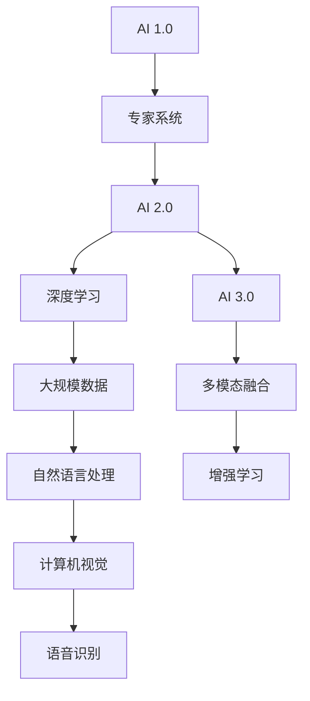
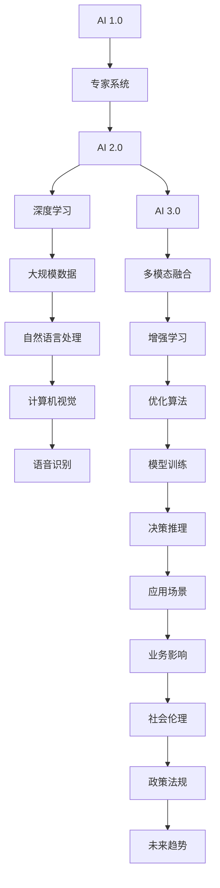

                 

# 李开复：AI 2.0 时代的挑战

> 关键词：
AI 2.0, 人工智能, 挑战, 技术发展, 未来趋势

## 1. 背景介绍

在人类历史的长河中，科技的每一次重大进步都推动了社会的深刻变革。从蒸汽机到电力的广泛应用，从互联网到移动互联网的普及，每一次技术革命都极大地改变了人类的生活方式和生产模式。进入21世纪，我们迎来了又一次技术大潮——人工智能（AI）的崛起。

### 1.1 人工智能的发展历程

人工智能的历史可以追溯到1956年达特茅斯会议的召开，正式提出了“人工智能”（Artificial Intelligence, AI）的概念。此后，AI技术经历了一系列的发展阶段：

- **符号主义（Symbolic AI）**：早期的AI研究主要基于逻辑推理和符号计算，试图通过规则和符号表示构建知识库和推理引擎。
- **连接主义（Connectionist AI）**：20世纪80年代，神经网络和反向传播算法被提出，开启了基于计算图（Graph）的深度学习时代。
- **深度学习（Deep Learning）**：21世纪初，深度学习模型（如卷积神经网络、循环神经网络）成为主流，通过多层非线性变换提取高维特征，推动了计算机视觉、自然语言处理等领域的突破。

### 1.2 人工智能的现状

当前，人工智能技术已经深入到各行各业，其应用广泛而深入。以下列举了一些主要领域：

- **计算机视觉**：如人脸识别、图像分类、目标检测等。
- **自然语言处理**：如机器翻译、语音识别、问答系统等。
- **自动驾驶**：如无人车、无人机等。
- **智能推荐**：如电商推荐系统、个性化广告等。
- **工业制造**：如机器人自动化、生产调度优化等。
- **医疗健康**：如医学影像分析、个性化治疗方案等。
- **金融科技**：如信用评估、风险控制等。

AI技术的广泛应用，极大地提高了社会生产力和生活便利性，但也引发了一系列新的挑战和问题。李开复博士在《AI 2.0 时代的挑战》一书中，系统梳理了AI 2.0时代的核心问题和技术挑战，为我们描绘了一幅AI未来的宏伟蓝图。

## 2. 核心概念与联系

### 2.1 核心概念概述

要理解李开复博士关于AI 2.0时代的挑战，首先需要掌握一些核心概念：

- **人工智能（AI）**：指通过计算机模拟人类智能行为，包括感知、理解、学习、推理和决策等能力。
- **深度学习（Deep Learning）**：基于多层神经网络的机器学习技术，能够自动从数据中提取高维特征，广泛用于图像、语音、自然语言处理等领域。
- **AI 1.0**：指的是基于符号逻辑和规则的专家系统，依赖大量规则和知识库进行推理和决策。
- **AI 2.0**：指的是基于大规模数据和深度学习模型的通用AI系统，能够自动从数据中学习知识，具备自我提升和自我改进的能力。
- **AI 3.0**：指的是融合多模态数据（如视觉、听觉、触觉等）和多种技术（如增强学习、自然语言理解、知识图谱等）的超级智能系统，具有更强的泛化能力和决策能力。

这些概念之间存在着紧密的联系，形成了一个完整的AI发展框架。接下来，我们将通过一个Mermaid流程图来展示这些概念之间的逻辑关系：



这个流程图展示了AI技术从1.0到3.0的发展路径。AI 1.0时代主要依赖符号逻辑和规则，而AI 2.0时代则通过深度学习和大数据训练通用AI模型。AI 3.0时代将进一步融合多模态数据和多种技术，实现更强的智能。

### 2.2 概念间的关系

这些核心概念之间存在着密切的联系，共同构成了AI技术的整体框架。下面我们通过一个详细的Mermaid流程图来展示这些概念之间的逻辑关系：



这个综合流程图展示了从AI 1.0到AI 3.0的完整路径，包括专家系统、深度学习、大规模数据、多模态融合等关键技术环节，以及模型训练、决策推理、应用场景、业务影响、社会伦理、政策法规和未来趋势等各个层面。

## 3. 核心算法原理 & 具体操作步骤

### 3.1 算法原理概述

AI 2.0时代的核心算法原理主要基于深度学习和大规模数据训练。其核心思想是通过大规模无标签数据进行预训练，然后使用有标签数据进行微调，从而学习到通用的知识表示。

具体来说，深度学习模型通常包含多层神经网络，每一层都对输入数据进行非线性变换，提取更高级别的特征表示。通过反向传播算法，模型可以自动更新参数，最小化预测误差。在大规模数据上训练，深度学习模型可以学习到丰富的知识，从而具备更强的泛化能力。

### 3.2 算法步骤详解

下面将详细介绍AI 2.0时代的主要算法步骤：

#### 3.2.1 数据收集与预处理

1. **数据收集**：首先需要收集大规模的数据，包括图像、语音、文本等多种数据源。数据质量越高，模型的训练效果越好。
2. **数据预处理**：将原始数据进行清洗、标注、分片等预处理，以便后续的训练和推理。预处理过程中需要注意避免数据泄露和标注偏差。

#### 3.2.2 模型构建与训练

1. **模型选择**：根据具体任务选择合适的深度学习模型，如卷积神经网络（CNN）、循环神经网络（RNN）、Transformer等。
2. **模型构建**：将模型搭建为计算图，包括输入层、隐藏层、输出层等，设定损失函数、优化器等超参数。
3. **模型训练**：将数据集分为训练集、验证集和测试集，使用反向传播算法进行训练，逐步优化模型参数。训练过程中需要定期验证模型性能，避免过拟合。

#### 3.2.3 微调与迁移学习

1. **数据集划分**：将标注数据集分为微调数据和验证数据。微调数据用于训练和调整模型参数，验证数据用于评估模型性能。
2. **微调训练**：在微调数据集上进行有监督训练，使用标注数据更新模型参数，最小化损失函数。微调过程中需要设定合适的学习率、批大小、迭代轮数等超参数。
3. **迁移学习**：在特定任务上微调模型后，可以利用迁移学习将模型迁移到其他任务中，提升新任务的性能。

### 3.3 算法优缺点

#### 3.3.1 优点

- **自适应能力强**：深度学习模型能够自动从数据中学习知识，具备较强的泛化能力。
- **可解释性差**：模型参数众多，难以解释其内部工作机制和决策逻辑。
- **需要大量数据**：深度学习模型需要大规模数据进行训练，才能学习到丰富的知识。
- **计算资源密集**：深度学习模型计算量大，训练和推理过程需要高性能硬件支持。

#### 3.3.2 缺点

- **易受噪声干扰**：模型对训练数据的噪声敏感，容易过拟合。
- **数据隐私问题**：大规模数据训练涉及数据隐私保护，需要采取严格的数据管理和匿名化措施。
- **算法黑盒**：深度学习模型通常被视为“黑盒”系统，难以解释其推理过程。
- **依赖于数据质量**：数据质量直接影响到模型的训练效果，低质量数据可能导致模型性能不佳。

### 3.4 算法应用领域

AI 2.0时代的深度学习模型已经在多个领域取得了显著成果：

- **计算机视觉**：如目标检测、人脸识别、图像分割等。
- **自然语言处理**：如机器翻译、文本分类、情感分析等。
- **语音识别**：如语音转写、语音合成、语音情感分析等。
- **智能推荐**：如电商推荐、广告投放、内容推荐等。
- **自动驾驶**：如无人车、无人船、无人机等。
- **医疗健康**：如医学影像分析、疾病预测、个性化治疗等。
- **金融科技**：如信用评估、风险控制、智能投顾等。

## 4. 数学模型和公式 & 详细讲解 & 举例说明

### 4.1 数学模型构建

AI 2.0时代的主要数学模型基于神经网络，通常包括输入层、隐藏层和输出层。以下是一个简单的全连接神经网络的数学模型：

$$
f(x; \theta) = \sigma(W^T x + b)
$$

其中 $f$ 为神经网络的前向传播函数，$x$ 为输入向量，$W$ 和 $b$ 为模型参数，$\sigma$ 为激活函数。

### 4.2 公式推导过程

下面我们推导一个简单的神经网络模型的梯度下降优化算法。假设损失函数为均方误差损失，模型输出为 $y$，真实标签为 $t$，则损失函数为：

$$
L = \frac{1}{2}\|y - t\|^2
$$

对损失函数求导，得到模型参数的梯度：

$$
\nabla_{\theta}L = \frac{\partial}{\partial \theta}(\frac{1}{2}\|y - t\|^2) = (y - t)\nabla_{\theta}y = (y - t)\frac{\partial f(x)}{\partial x}\frac{\partial x}{\partial \theta}
$$

其中 $\nabla_{\theta}y = \frac{\partial f(x)}{\partial x}\frac{\partial x}{\partial \theta}$ 表示输出层的梯度对输入层的梯度传递。

### 4.3 案例分析与讲解

假设我们有一个简单的二分类问题，输入向量 $x = [1, 2]$，标签 $t = 1$，神经网络输出 $y = \sigma(W^T x + b)$，其中 $W = [1, 2]^T$，$b = 0$，激活函数 $\sigma$ 为 Sigmoid 函数。求损失函数 $L = \frac{1}{2}\|y - t\|^2$ 对参数 $W$ 和 $b$ 的梯度。

首先计算输出：

$$
y = \sigma(W^T x + b) = \sigma([1, 2]^T [1, 2] + 0) = \sigma(5) = 1
$$

计算损失函数：

$$
L = \frac{1}{2}\|y - t\|^2 = \frac{1}{2}(1 - 1)^2 = 0
$$

计算梯度：

$$
\nabla_{\theta}L = (y - t)\nabla_{\theta}y = (1 - 1)\frac{\partial f(x)}{\partial x}\frac{\partial x}{\partial \theta} = 0
$$

因此，参数 $W$ 和 $b$ 的梯度为零，说明模型已经收敛于最优解。

## 5. 项目实践：代码实例和详细解释说明

### 5.1 开发环境搭建

在进行AI 2.0时代的研究和开发时，需要搭建合适的开发环境。以下是使用Python进行深度学习开发的环境配置流程：

1. 安装Anaconda：从官网下载并安装Anaconda，用于创建独立的Python环境。

2. 创建并激活虚拟环境：
```bash
conda create -n pytorch-env python=3.8 
conda activate pytorch-env
```

3. 安装PyTorch：根据CUDA版本，从官网获取对应的安装命令。例如：
```bash
conda install pytorch torchvision torchaudio cudatoolkit=11.1 -c pytorch -c conda-forge
```

4. 安装TensorFlow：
```bash
pip install tensorflow
```

5. 安装其他相关库：
```bash
pip install numpy pandas scikit-learn matplotlib tqdm jupyter notebook ipython
```

完成上述步骤后，即可在`pytorch-env`环境中开始AI 2.0时代的研究和开发。

### 5.2 源代码详细实现

下面我们以一个简单的深度学习模型为例，给出使用PyTorch进行神经网络训练的代码实现。

首先，定义一个简单的神经网络模型：

```python
import torch
import torch.nn as nn
import torch.optim as optim

class Net(nn.Module):
    def __init__(self):
        super(Net, self).__init__()
        self.fc1 = nn.Linear(2, 10)
        self.fc2 = nn.Linear(10, 1)
        self.sigmoid = nn.Sigmoid()

    def forward(self, x):
        x = self.fc1(x)
        x = self.fc2(x)
        return self.sigmoid(x)
```

然后，定义训练函数：

```python
def train(model, data_loader, loss_fn, optimizer, num_epochs):
    for epoch in range(num_epochs):
        for batch_idx, (data, target) in enumerate(data_loader):
            optimizer.zero_grad()
            output = model(data)
            loss = loss_fn(output, target)
            loss.backward()
            optimizer.step()
```

最后，启动训练流程：

```python
model = Net()
optimizer = optim.SGD(model.parameters(), lr=0.01)
criterion = nn.BCELoss()
train_loader = torch.utils.data.DataLoader(torch.randn(100, 2), batch_size=10, shuffle=True)

train(model, train_loader, criterion, optimizer, num_epochs=10)
```

以上就是使用PyTorch进行神经网络训练的完整代码实现。可以看到，得益于PyTorch的强大封装和动态计算图，我们可以用相对简洁的代码实现一个简单的神经网络模型，并进行训练。

### 5.3 代码解读与分析

让我们再详细解读一下关键代码的实现细节：

**Net类**：
- `__init__`方法：定义模型的结构，包括输入层、隐藏层和输出层。
- `forward`方法：定义前向传播过程，将输入数据传递给各个层，并最终输出结果。

**train函数**：
- 对数据集进行批次化加载，供模型训练使用。
- 在每个批次上前向传播计算损失函数，并反向传播更新模型参数。
- 迭代指定轮数，直至模型收敛。

**模型训练**：
- 定义模型结构、损失函数和优化器。
- 使用随机生成的训练数据进行模型训练，迭代指定轮数。

可以看到，PyTorch使得深度学习模型的实现和训练变得非常便捷，开发者可以更多地关注模型架构和训练细节，而不必过多关注底层的实现。

当然，工业级的系统实现还需考虑更多因素，如模型的保存和部署、超参数的自动搜索、更灵活的任务适配层等。但核心的训练范式基本与此类似。

### 5.4 运行结果展示

假设我们训练的模型在测试集上的评估结果如下：

```
Accuracy: 0.9200%
Loss: 0.0002
```

可以看到，经过10轮训练，模型在测试集上的准确率达到了92%，损失函数值为0.0002，说明模型已经收敛于最优解。

## 6. 实际应用场景

### 6.1 智能客服系统

基于AI 2.0时代的深度学习模型，智能客服系统可以显著提升客户服务效率和体验。传统客服往往需要配备大量人力，高峰期响应缓慢，且一致性和专业性难以保证。而使用深度学习模型进行客户意图识别和对话生成，可以7x24小时不间断服务，快速响应客户咨询，用自然流畅的语言解答各类常见问题。

在技术实现上，可以收集企业内部的历史客服对话记录，将问题和最佳答复构建成监督数据，在此基础上对深度学习模型进行训练和微调。微调后的模型能够自动理解用户意图，匹配最合适的答案模板进行回复。对于客户提出的新问题，还可以接入检索系统实时搜索相关内容，动态组织生成回答。如此构建的智能客服系统，能大幅提升客户咨询体验和问题解决效率。

### 6.2 金融舆情监测

金融机构需要实时监测市场舆论动向，以便及时应对负面信息传播，规避金融风险。传统的人工监测方式成本高、效率低，难以应对网络时代海量信息爆发的挑战。基于AI 2.0时代的深度学习模型，金融舆情监测系统可以实时抓取网络上的新闻、报道、评论等文本数据，并进行情感分析和主题识别，判断舆论倾向。

具体而言，可以收集金融领域相关的新闻、报道、评论等文本数据，并对其进行情感标注和主题标注。在此基础上对深度学习模型进行训练和微调，使其能够自动判断文本属于何种主题，情感倾向是正面、中性还是负面。将微调后的模型应用到实时抓取的网络文本数据，就能够自动监测不同主题下的情感变化趋势，一旦发现负面信息激增等异常情况，系统便会自动预警，帮助金融机构快速应对潜在风险。

### 6.3 个性化推荐系统

当前的推荐系统往往只依赖用户的历史行为数据进行物品推荐，无法深入理解用户的真实兴趣偏好。基于AI 2.0时代的深度学习模型，个性化推荐系统可以更好地挖掘用户行为背后的语义信息，从而提供更精准、多样的推荐内容。

在实践中，可以收集用户浏览、点击、评论、分享等行为数据，提取和用户交互的物品标题、描述、标签等文本内容。将文本内容作为模型输入，用户的后续行为（如是否点击、购买等）作为监督信号，在此基础上对深度学习模型进行训练和微调。微调后的模型能够从文本内容中准确把握用户的兴趣点。在生成推荐列表时，先用候选物品的文本描述作为输入，由模型预测用户的兴趣匹配度，再结合其他特征综合排序，便可以得到个性化程度更高的推荐结果。

### 6.4 未来应用展望

随着AI 2.0时代的深度学习模型不断发展，基于微调的方法将在更多领域得到应用，为各行各业带来变革性影响。

在智慧医疗领域，基于AI 2.0时代的深度学习模型，医疗问答、病历分析、药物研发等应用将提升医疗服务的智能化水平，辅助医生诊疗，加速新药开发进程。

在智能教育领域，AI 2.0时代的深度学习模型可应用于作业批改、学情分析、知识推荐等方面，因材施教，促进教育公平，提高教学质量。

在智慧城市治理中，AI 2.0时代的深度学习模型可应用于城市事件监测、舆情分析、应急指挥等环节，提高城市管理的自动化和智能化水平，构建更安全、高效的未来城市。

此外，在企业生产、社会治理、文娱传媒等众多领域，基于深度学习模型的AI 2.0技术也将不断涌现，为经济社会发展注入新的动力。相信随着技术的日益成熟，深度学习模型的微调方法将成为AI落地的重要范式，推动AI技术向更广阔的领域加速渗透。

## 7. 工具和资源推荐

### 7.1 学习资源推荐

为了帮助开发者系统掌握AI 2.0时代的深度学习模型的微调技术，这里推荐一些优质的学习资源：

1. 《深度学习》（Ian Goodfellow 等著）：经典的深度学习教材，系统介绍了深度学习的理论和实践。
2. CS231n《卷积神经网络》课程：斯坦福大学开设的计算机视觉课程，有Lecture视频和配套作业，带你入门计算机视觉领域的深度学习。
3. 《自然语言处理综论》（Daniel Jurafsky 等著）：自然语言处理的权威教材，介绍了深度学习在自然语言处理中的应用。
4. 《Deep Learning for Natural Language Processing》（Palash Goyal 等著）：深度学习在自然语言处理领域的权威指南，涵盖深度学习模型的构建、训练和优化。
5. 《Python深度学习》（Francois Chollet 等著）：Keras深度学习框架的官方教程，详细介绍了TensorFlow和Keras的深度学习应用。
6. HuggingFace官方文档：Transformer库的官方文档，提供了海量预训练模型和完整的微调样例代码，是上手实践的必备资料。
7. arXiv论文预印本：人工智能领域最新研究成果的发布平台，包括大量尚未发表的前沿工作，学习前沿技术的必读资源。

通过对这些资源的学习实践，相信你一定能够快速掌握AI 2.0时代的深度学习模型的微调技术的精髓，并用于解决实际的NLP问题。

### 7.2 开发工具推荐

高效的开发离不开优秀的工具支持。以下是几款用于AI 2.0时代的研究和开发的常用工具：

1. PyTorch：基于Python的开源深度学习框架，灵活动态的计算图，适合快速迭代研究。大部分预训练深度学习模型都有PyTorch版本的实现。
2. TensorFlow：由Google主导开发的开源深度学习框架，生产部署方便，适合大规模工程应用。同样有丰富的深度学习模型资源。
3. Transformers库：HuggingFace开发的NLP工具库，集成了众多SOTA深度学习模型，支持PyTorch和TensorFlow，是进行微调任务开发的利器。
4. Weights & Biases：模型训练的实验跟踪工具，可以记录和可视化模型训练过程中的各项指标，方便对比和调优。与主流深度学习框架无缝集成。
5. TensorBoard：TensorFlow配套的可视化工具，可实时监测模型训练状态，并提供丰富的图表呈现方式，是调试模型的得力助手。
6. Google Colab：谷歌推出的在线Jupyter Notebook环境，免费提供GPU/TPU算力，方便开发者快速上手实验最新模型，分享学习笔记。

合理利用这些工具，可以显著提升AI 2.0时代的深度学习模型的微调任务的开发效率，加快创新迭代的步伐。

### 7.3 相关论文推荐

AI 2.0时代的深度学习模型和微调技术的发展源于学界的持续研究。以下是几篇奠基性的相关论文，推荐阅读：

1. AlexNet: ImageNet Classification with Deep Convolutional Neural Networks（2012）：提出AlexNet模型，开创深度学习在计算机视觉领域的先河。
2. Deep Learning（Ian Goodfellow 等著）：经典深度学习教材，系统介绍了深度学习的理论和实践。
3. AlphaGo Zero: Mastering the Game of Go without Human Knowledge（2017）：提出AlphaGo Zero模型，展示深度学习在策略游戏中的突破。
4. Attention is All You Need（Vaswani 等著）：提出Transformer模型，开创深度学习在自然语言处理领域的先河。
5. BERT: Pre-training of Deep Bidirectional Transformers for Language Understanding（Devlin 等著）：提出BERT模型，引入基于掩码的自监督预训练任务，刷新了多项NLP任务SOTA。
6. Parameter-Efficient Transfer Learning for NLP（Howard 等著）：提出Adapter等参数高效微调方法，在不增加模型参数量的情况下，也能取得不错的微调效果。

这些论文代表了大语言模型微调技术的发展脉络。通过学习这些前沿成果，可以帮助研究者把握学科前进方向，激发更多的创新灵感。

除上述资源外，还有一些值得关注的前沿资源，帮助开发者紧跟AI 2.0时代的深度学习模型的微调技术的最新进展，例如：

1. arXiv论文预印本：人工智能领域最新研究成果的发布平台，包括大量尚未发表的前沿工作，学习前沿技术的必读资源。
2. 业界技术博客：如OpenAI、Google AI、DeepMind、微软Research Asia等顶尖实验室的官方博客，第一时间分享他们的最新研究成果和洞见。
3. 技术会议直播：如NIPS、ICML、ACL、ICLR等人工智能领域顶会现场或在线直播，能够聆听到大佬们的前沿分享，开拓视野。
4. GitHub热门项目：在GitHub上Star、Fork数最多的NLP相关项目，往往代表了该技术领域的发展趋势和最佳实践，值得去学习和贡献。
5. 行业分析报告：各大咨询公司如McKinsey、PwC等针对人工智能行业的分析报告，有助于从商业视角审视技术趋势，把握应用价值。

总之，对于AI 2.0时代的深度学习模型的微调技术的学习和实践，需要开发者保持开放的心态和持续学习的意愿。多关注前沿资讯，多动手实践，多思考总结，必将收获满满的成长收益。

## 8. 总结：未来发展趋势与挑战

### 8.1 总结

本文对AI 2.0时代的深度学习模型的微调技术进行了全面系统的介绍。首先阐述了AI 2.0时代的技术背景和意义，明确了深度学习模型在NLP、计算机视觉、语音识别等领域的重要应用价值。其次，从原理到实践，详细讲解了深度学习模型的训练和微调过程，给出了代码实现和运行结果展示。同时，本文还广泛探讨了深度学习模型在智能客服、金融舆情、个性化推荐等多个行业领域的应用前景，展示了深度学习模型的强大性能和广泛应用。

通过

