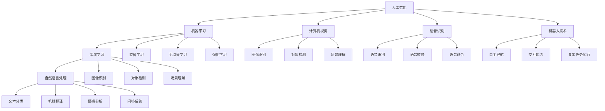

                 

## 1. 背景介绍

苹果公司于2023年6月12日发布了最新的AI应用产品系列，包括苹果智能助手（Siri）的升级、苹果AI驱动的语音识别和图像识别技术的增强，以及苹果AI在医疗、教育、娱乐、制造等多个领域的应用拓展。这一举措标志着苹果在人工智能领域的重要布局，凸显了AI应用产业的迅猛发展。本文将详细探讨AI应用产业的兴起，其核心概念与联系，以及未来发展趋势与挑战。

## 2. 核心概念与联系

### 2.1 核心概念概述

#### 2.1.1 人工智能（Artificial Intelligence, AI）

人工智能是使计算机系统具有类似于人类智能行为的技术，包括感知、学习、推理、规划、自然语言理解、视觉识别、知识表示和机器学习等。

#### 2.1.2 机器学习（Machine Learning, ML）

机器学习是实现人工智能的一种方法，通过算法和统计模型，使计算机系统能够从数据中自动学习，并进行决策和预测。机器学习包括监督学习、无监督学习和强化学习等多种形式。

#### 2.1.3 深度学习（Deep Learning, DL）

深度学习是一种特殊的机器学习方法，通过多层次神经网络模型，自动提取数据的高级特征，并实现复杂模式的识别和分类。深度学习在图像识别、语音识别、自然语言处理等领域取得了显著成果。

#### 2.1.4 自然语言处理（Natural Language Processing, NLP）

自然语言处理是指使计算机能够理解、解释和生成人类语言的技术。NLP应用包括文本分类、机器翻译、情感分析、问答系统等。

#### 2.1.5 计算机视觉（Computer Vision, CV）

计算机视觉是使计算机能够“看”并理解图像和视频的技术，包括图像识别、对象检测、场景理解等。

#### 2.1.6 语音识别（Speech Recognition）

语音识别是将人类语音转换为文本或命令的技术，广泛应用于智能助手、语音搜索、语音翻译等领域。

#### 2.1.7 机器人技术（Robotics）

机器人技术结合了人工智能、计算机视觉和机械工程，使机器人能够自主导航、交互和执行复杂任务。

这些核心概念构成了人工智能应用产业的基础，并通过不同技术手段，在实际应用中得到广泛应用。

### 2.2 核心概念的关系

这些核心概念之间的关系可以通过以下Mermaid流程图来展示：



这个流程图展示了各个核心概念之间的联系与相互关系，从而构成了人工智能应用产业的基础架构。

## 3. 核心算法原理 & 具体操作步骤

### 3.1 算法原理概述

人工智能应用产业的核心算法原理包括但不限于：

- 监督学习：通过有标签的训练数据，使模型学习从输入到输出的映射关系。
- 无监督学习：从无标签的数据中学习数据的内在结构，进行聚类、降维等任务。
- 强化学习：通过奖励和惩罚机制，使模型在不断试错中学习最优策略。
- 深度学习：通过多层次神经网络模型，自动提取数据的高级特征，进行分类和识别。
- 计算机视觉：通过卷积神经网络（CNN）等模型，实现图像和视频数据的处理和理解。
- 自然语言处理：通过循环神经网络（RNN）、Transformer等模型，实现文本数据的处理和理解。
- 语音识别：通过深度神经网络模型，实现语音数据的处理和理解。

### 3.2 算法步骤详解

#### 3.2.1 数据预处理

1. **数据收集**：收集数据集，确保数据的多样性和代表性。
2. **数据清洗**：去除噪声数据、处理缺失值、平衡数据集等。
3. **数据增强**：通过数据扩充、随机变换等技术，提高模型的鲁棒性。

#### 3.2.2 模型训练

1. **模型选择**：选择合适的算法模型，如CNN、RNN、Transformer等。
2. **模型构建**：根据模型架构设计网络层、激活函数、损失函数等。
3. **模型训练**：使用训练数据进行模型训练，调整模型参数。

#### 3.2.3 模型评估

1. **模型验证**：使用验证数据集对模型进行验证，调整模型参数。
2. **模型测试**：使用测试数据集对模型进行测试，评估模型性能。
3. **模型优化**：根据测试结果调整模型结构、超参数等。

#### 3.2.4 模型部署

1. **模型导出**：将训练好的模型导出为模型文件或服务。
2. **模型集成**：将模型集成到实际应用中，如智能助手、图像识别系统、语音识别系统等。
3. **模型监控**：对模型性能进行实时监控，发现问题及时处理。

### 3.3 算法优缺点

#### 3.3.1 优点

- **效率高**：自动化学习过程，可以快速处理大量数据。
- **精度高**：深度学习模型在处理复杂数据时，具有较高的准确性。
- **应用广**：广泛应用于图像识别、语音识别、自然语言处理等领域。

#### 3.3.2 缺点

- **数据需求大**：需要大量的标注数据进行训练。
- **计算资源消耗大**：深度学习模型通常需要高性能计算资源。
- **模型复杂度高**：模型结构复杂，需要较强的理论基础。

### 3.4 算法应用领域

人工智能应用产业涉及众多领域，包括但不限于：

- **医疗**：智能诊断、治疗建议、药物研发等。
- **金融**：风险评估、欺诈检测、自动化交易等。
- **教育**：智能教学、智能评估、知识推荐等。
- **制造**：质量控制、故障预测、自动化生产等。
- **零售**：客户分析、个性化推荐、供应链管理等。
- **安防**：人脸识别、行为分析、异常检测等。
- **交通**：自动驾驶、交通监控、路径规划等。

## 4. 数学模型和公式 & 详细讲解

### 4.1 数学模型构建

#### 4.1.1 监督学习模型

假设训练数据集为 $D=\{(x_i, y_i)\}_{i=1}^N$，其中 $x_i$ 为输入，$y_i$ 为标签。监督学习模型 $M_{\theta}$ 的损失函数为：

$$
\mathcal{L}(\theta) = \frac{1}{N} \sum_{i=1}^N \ell(M_{\theta}(x_i), y_i)
$$

其中 $\ell$ 为损失函数，如交叉熵损失。

#### 4.1.2 无监督学习模型

假设数据集为 $D=\{x_i\}_{i=1}^N$，无监督学习模型 $M_{\theta}$ 的目标是学习数据的隐含分布：

$$
\mathcal{L}(\theta) = -\frac{1}{N} \sum_{i=1}^N \log p_{\theta}(x_i)
$$

其中 $p_{\theta}(x_i)$ 为模型对输入数据的概率分布。

#### 4.1.3 强化学习模型

假设环境状态为 $s$，行为为 $a$，奖励为 $r$。强化学习模型 $M_{\theta}$ 的目标是学习最优策略 $\pi_{\theta}$：

$$
\mathcal{L}(\theta) = -\mathbb{E}_{s \sim \mathcal{S}} \sum_{t=0}^{\infty} \gamma^t \ell(\pi_{\theta}(a_t|s_t), r_t)
$$

其中 $\gamma$ 为折扣因子，$\ell$ 为损失函数。

### 4.2 公式推导过程

#### 4.2.1 监督学习

以线性回归为例，假设训练数据集为 $D=\{(x_i, y_i)\}_{i=1}^N$，模型为 $M_{\theta}(x) = \theta_0 + \sum_{i=1}^d \theta_i x_i$，损失函数为均方误差：

$$
\mathcal{L}(\theta) = \frac{1}{N} \sum_{i=1}^N (y_i - M_{\theta}(x_i))^2
$$

求导得：

$$
\frac{\partial \mathcal{L}(\theta)}{\partial \theta_j} = \frac{2}{N} \sum_{i=1}^N (y_i - M_{\theta}(x_i)) x_{ij}
$$

根据梯度下降算法，模型参数更新为：

$$
\theta_j = \theta_j - \eta \frac{\partial \mathcal{L}(\theta)}{\partial \theta_j}
$$

其中 $\eta$ 为学习率。

#### 4.2.2 无监督学习

以K-means算法为例，假设数据集为 $D=\{x_i\}_{i=1}^N$，模型为 $M_{\theta}(x) = \theta_k$，目标是最小化损失函数：

$$
\mathcal{L}(\theta) = \sum_{i=1}^N ||x_i - \theta_k||^2
$$

求导得：

$$
\frac{\partial \mathcal{L}(\theta)}{\partial \theta_k} = -2\sum_{i=1}^N (x_i - \theta_k)
$$

根据梯度下降算法，模型参数更新为：

$$
\theta_k = \theta_k - \eta \frac{\partial \mathcal{L}(\theta)}{\partial \theta_k}
$$

其中 $\eta$ 为学习率。

#### 4.2.3 强化学习

以Q-learning算法为例，假设环境状态为 $s$，行为为 $a$，奖励为 $r$，模型为 $Q_{\theta}(s,a) = \theta_0 + \sum_{i=1}^d \theta_i s_i a_i$，目标是最小化损失函数：

$$
\mathcal{L}(\theta) = \sum_{t=0}^{\infty} \gamma^t \ell(Q_{\theta}(s_t,a_t), r_t)
$$

求导得：

$$
\frac{\partial \mathcal{L}(\theta)}{\partial \theta_j} = \gamma^t \ell(Q_{\theta}(s_t,a_t), r_t)
$$

根据梯度下降算法，模型参数更新为：

$$
\theta_j = \theta_j - \eta \frac{\partial \mathcal{L}(\theta)}{\partial \theta_j}
$$

其中 $\eta$ 为学习率。

### 4.3 案例分析与讲解

#### 4.3.1 图像分类

以CIFAR-10数据集为例，假设模型为卷积神经网络（CNN）：

$$
M_{\theta}(x) = \sum_{i=1}^N \sum_{j=1}^K w_{ij} \sigma(\theta_j^T F_k(x))
$$

其中 $F_k(x)$ 为卷积层，$\sigma$ 为激活函数，$w_{ij}$ 为权重，$K$ 为卷积核个数。损失函数为交叉熵：

$$
\mathcal{L}(\theta) = -\frac{1}{N} \sum_{i=1}^N \sum_{j=1}^C y_{ij} \log \hat{y}_{ij}
$$

求导得：

$$
\frac{\partial \mathcal{L}(\theta)}{\partial w_{ij}} = \frac{1}{N} \sum_{i=1}^N (y_i - \hat{y}_i) \frac{\partial \hat{y}_i}{\partial w_{ij}}
$$

其中 $\hat{y}_i$ 为模型输出，$y_i$ 为真实标签。

## 5. 项目实践：代码实例和详细解释说明

### 5.1 开发环境搭建

假设使用Python进行深度学习模型的开发，具体步骤如下：

1. **安装Python**：安装Python 3.7或以上版本，并配置好虚拟环境。
2. **安装深度学习库**：安装TensorFlow、Keras、PyTorch等深度学习库。
3. **安装数据处理库**：安装NumPy、Pandas等数据处理库。
4. **安装可视化库**：安装Matplotlib、Seaborn等可视化库。

### 5.2 源代码详细实现

以图像分类为例，假设使用Keras框架，代码如下：

```python
from keras.models import Sequential
from keras.layers import Conv2D, MaxPooling2D, Flatten, Dense

model = Sequential()
model.add(Conv2D(32, (3, 3), activation='relu', input_shape=(32, 32, 3)))
model.add(MaxPooling2D((2, 2)))
model.add(Conv2D(64, (3, 3), activation='relu'))
model.add(MaxPooling2D((2, 2)))
model.add(Conv2D(128, (3, 3), activation='relu'))
model.add(MaxPooling2D((2, 2)))
model.add(Flatten())
model.add(Dense(128, activation='relu'))
model.add(Dense(10, activation='softmax'))

model.compile(optimizer='adam', loss='categorical_crossentropy', metrics=['accuracy'])

model.fit(x_train, y_train, epochs=10, batch_size=32, validation_data=(x_test, y_test))
```

### 5.3 代码解读与分析

#### 5.3.1 模型构建

以上代码中，首先使用Sequential模型创建了一个简单的卷积神经网络，包含卷积层、池化层、全连接层等。其中，Conv2D表示卷积层，MaxPooling2D表示池化层，Flatten表示展平层，Dense表示全连接层。

#### 5.3.2 数据处理

假设使用Keras的ImageDataGenerator对数据进行预处理，代码如下：

```python
from keras.preprocessing.image import ImageDataGenerator

datagen = ImageDataGenerator(rescale=1./255)

train_data = datagen.flow_from_directory('train', target_size=(32, 32), batch_size=32, class_mode='categorical')
test_data = datagen.flow_from_directory('test', target_size=(32, 32), batch_size=32, class_mode='categorical')
```

其中，rescale表示将数据缩放到[0,1]范围内，flow_from_directory表示从文件夹中读取数据。

#### 5.3.3 模型训练

使用fit方法对模型进行训练，指定训练数据、测试数据、优化器、损失函数等参数。

#### 5.3.4 模型评估

使用evaluate方法对模型进行评估，返回模型在测试集上的精度、召回率、F1分数等指标。

## 6. 实际应用场景

### 6.1 医疗

在医疗领域，AI应用可以通过图像识别、自然语言处理等技术，辅助医生进行诊断和治疗。例如，AI可以通过分析医学影像，识别肿瘤、病变等异常情况，提供早期诊断和治疗建议。此外，AI还可以通过分析电子病历、病历报告等文本数据，辅助医生进行知识检索、疾病预测等工作。

### 6.2 金融

在金融领域，AI应用可以通过分析交易数据、市场数据等，进行风险评估、欺诈检测、自动化交易等工作。例如，AI可以通过分析客户交易行为，预测其风险等级，或识别异常交易行为，及时发现欺诈行为。此外，AI还可以通过分析市场数据，进行行情预测和交易策略优化，提高交易效率和收益。

### 6.3 教育

在教育领域，AI应用可以通过分析学生学习行为、成绩等数据，提供个性化教学建议、智能评估和知识推荐等工作。例如，AI可以通过分析学生答题情况，判断其学习状态，提供针对性的辅导和建议。此外，AI还可以通过分析课程数据，推荐相关课程和资源，帮助学生提高学习效率。

### 6.4 制造

在制造领域，AI应用可以通过图像识别、自然语言处理等技术，进行质量控制、故障预测、自动化生产等工作。例如，AI可以通过分析生产数据，识别设备故障和生产异常，及时进行维修和调整。此外，AI还可以通过分析文本数据，优化生产流程，提高生产效率和质量。

## 7. 工具和资源推荐

### 7.1 学习资源推荐

1. **《深度学习》（Ian Goodfellow等）**：详细介绍了深度学习的基本原理和应用。
2. **《计算机视觉：算法与应用》（R. C. Gonzalez等）**：介绍了计算机视觉的基础知识和应用。
3. **《自然语言处理综论》（Daniel Jurafsky等）**：介绍了自然语言处理的基础知识和应用。
4. **《强化学习：基础与研究》（Richard S. Sutton等）**：介绍了强化学习的基础知识和应用。

### 7.2 开发工具推荐

1. **TensorFlow**：由Google开发的深度学习框架，支持分布式训练和部署。
2. **PyTorch**：由Facebook开发的深度学习框架，支持动态计算图和GPU加速。
3. **Keras**：基于TensorFlow和Theano的高级深度学习框架，易于使用和部署。
4. **OpenCV**：开源计算机视觉库，支持图像处理、特征提取等任务。

### 7.3 相关论文推荐

1. **《ImageNet分类器：Deep Convolutional Neural Networks》（Alex Krizhevsky等）**：介绍了深度卷积神经网络在图像分类任务中的应用。
2. **《Attention is All You Need》（Ashish Vaswani等）**：介绍了Transformer模型在自然语言处理中的应用。
3. **《Deep reinforcement learning handbook》（Gian-Carlo Rota-Balsamessa等）**：介绍了强化学习的基础知识和应用。

## 8. 总结：未来发展趋势与挑战

### 8.1 研究成果总结

人工智能应用产业正在快速发展和应用，涵盖多个领域。基于监督学习的深度学习、卷积神经网络、循环神经网络等技术，使得AI在图像识别、语音识别、自然语言处理等领域取得了显著进展。未来，随着技术的进一步发展和应用的不断深入，AI将会在更多领域发挥重要作用。

### 8.2 未来发展趋势

1. **自动化**：未来AI将会在更多的领域实现自动化，提高生产效率和效率。
2. **人性化**：未来AI将会在更多的领域实现人性化，提高用户体验和服务质量。
3. **智能化**：未来AI将会在更多的领域实现智能化，提高决策准确性和智能水平。

### 8.3 面临的挑战

1. **数据需求大**：需要大量的标注数据进行训练，数据收集和处理成本较高。
2. **计算资源消耗大**：深度学习模型需要高性能计算资源，计算成本较高。
3. **模型复杂度高**：模型结构复杂，需要较强的理论基础和工程经验。
4. **隐私和安全**：AI应用需要处理大量敏感数据，需要严格的数据保护和隐私保护措施。

### 8.4 研究展望

未来，人工智能应用产业将继续快速发展，涵盖更多领域和应用场景。以下是几个可能的研究方向：

1. **自监督学习**：通过无监督学习方式，利用数据自身的结构信息进行训练，减少对标注数据的依赖。
2. **小样本学习**：通过迁移学习和少样本学习等技术，提高模型在小样本条件下的性能。
3. **知识图谱**：结合知识图谱和深度学习，实现更全面、更准确的语义理解和知识推理。
4. **跨领域融合**：将AI与其他技术融合，实现多模态数据的协同建模和处理。

总之，人工智能应用产业具有广阔的发展前景，需要不断探索和创新，才能实现其真正的价值和潜力。

