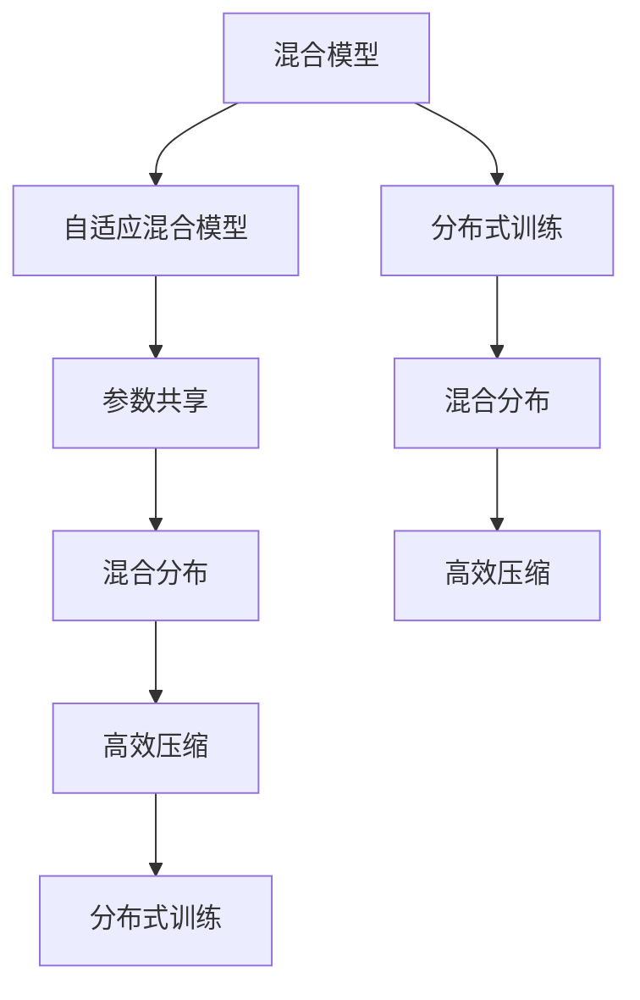
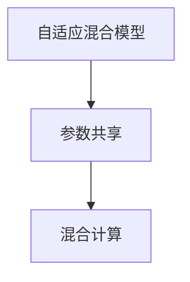
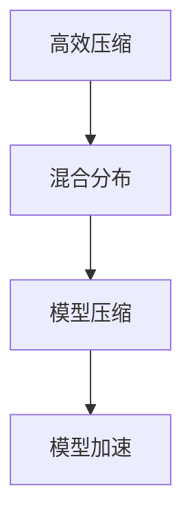

                 

# DeepSeek的二代MoE大模型

> 关键词：
DeepSeek, 二代MoE大模型, 自适应混合模型, 参数共享, 混合分布, 高效压缩, 分布式训练, 应用场景, 案例分析, 技术挑战, 未来展望

## 1. 背景介绍

### 1.1 问题由来
在深度学习领域，混合模型(MoE, Mixture-of-Experts)是一种将多个专家模型组合起来，提升模型性能和泛化能力的方法。近年来，混合模型在语音识别、计算机视觉、自然语言处理等诸多领域都取得了显著的进展。DeepSeek的二代MoE大模型，进一步将混合模型与自适应技术结合，提出了更高效、更泛化的混合模型实现方式，并在实际应用中取得了优异的性能。

### 1.2 问题核心关键点
DeepSeek的二代MoE大模型，主要围绕以下几个关键点进行设计：

1. **自适应混合模型**：根据输入数据的不同，动态选择最合适的专家模型进行混合计算。
2. **参数共享**：部分模型参数在所有专家模型之间共享，减少模型复杂度。
3. **混合分布**：通过混合不同分布的专家模型，提高模型对多样化的数据分布的适应能力。
4. **高效压缩**：采用量化、剪枝等技术，降低模型存储和计算的资源需求。
5. **分布式训练**：支持在大规模集群上并行训练，加速模型收敛和优化。

### 1.3 问题研究意义
DeepSeek的二代MoE大模型，在深度学习领域具有重要意义：

1. **提升模型泛化能力**：通过自适应混合模型，模型能够在不同数据分布下，选择最合适的专家模型，从而提升泛化能力。
2. **降低模型资源需求**：通过参数共享和高效压缩技术，减少模型存储空间和计算资源的需求，提高实际部署的可行性。
3. **加速模型训练**：分布式训练技术使得模型能够在更大规模集群上并行训练，显著提升训练效率和模型性能。
4. **应用场景广泛**：DeepSeek的二代MoE大模型，可以应用于语音识别、图像识别、自然语言处理等多个领域，推动人工智能技术的广泛落地。

## 2. 核心概念与联系

### 2.1 核心概念概述

为更好地理解DeepSeek的二代MoE大模型，本节将介绍几个密切相关的核心概念：

- **混合模型(MoE)**：通过将多个专家模型组合起来，提升模型的泛化能力和性能。
- **自适应混合模型**：根据输入数据的不同，动态选择最合适的专家模型进行混合计算，提升模型的适应性。
- **参数共享**：在部分模型参数在所有专家模型之间共享，减少模型复杂度，降低资源需求。
- **混合分布**：通过混合不同分布的专家模型，提高模型对多样化的数据分布的适应能力。
- **高效压缩**：采用量化、剪枝等技术，降低模型存储和计算的资源需求。
- **分布式训练**：支持在大规模集群上并行训练，加速模型收敛和优化。

这些核心概念之间的逻辑关系可以通过以下Mermaid流程图来展示：



这个流程图展示了大模型的核心概念及其之间的关系：

1. 混合模型通过自适应混合模型，动态选择最合适的专家模型。
2. 自适应混合模型结合参数共享，提升模型的泛化能力和计算效率。
3. 混合分布进一步提升模型对多样化数据分布的适应能力。
4. 高效压缩技术降低模型存储和计算需求。
5. 分布式训练加速模型在大规模集群上的训练和优化。

这些概念共同构成了DeepSeek二代MoE大模型的基础架构，使其能够在各种场景下发挥强大的性能和泛化能力。通过理解这些核心概念，我们可以更好地把握大模型的工作原理和优化方向。

### 2.2 概念间的关系

这些核心概念之间存在着紧密的联系，形成了DeepSeek二代MoE大模型的完整生态系统。下面我通过几个Mermaid流程图来展示这些概念之间的关系。

#### 2.2.1 自适应混合模型与参数共享的关系



这个流程图展示了自适应混合模型与参数共享的关系：

1. 自适应混合模型根据输入数据的不同，动态选择最合适的专家模型进行混合计算。
2. 参数共享在所有专家模型之间共享部分参数，降低模型复杂度，提高计算效率。

#### 2.2.2 分布式训练与高效压缩的关系


这个流程图展示了分布式训练与高效压缩的关系：

1. 分布式训练通过在大规模集群上并行训练，加速模型收敛和优化。
2. 高效压缩技术通过量化、剪枝等手段，降低模型存储和计算需求，提高训练和推理的效率。

#### 2.2.3 高效压缩与混合分布的关系



这个流程图展示了高效压缩与混合分布的关系：

1. 混合分布通过混合不同分布的专家模型，提升模型对多样化数据分布的适应能力。
2. 高效压缩通过量化、剪枝等手段，进一步压缩模型存储空间，提升计算效率。

通过这些流程图，我们可以更清晰地理解DeepSeek二代MoE大模型中各核心概念的相互关系，为后续深入讨论具体的模型设计和实现奠定基础。

## 3. 核心算法原理 & 具体操作步骤
### 3.1 算法原理概述

DeepSeek的二代MoE大模型，主要基于以下几个核心算法原理：

- **自适应混合模型**：根据输入数据的分布，动态选择最合适的专家模型进行混合计算。
- **参数共享**：在部分模型参数在所有专家模型之间共享，减少模型复杂度，提高计算效率。
- **混合分布**：通过混合不同分布的专家模型，提高模型对多样化的数据分布的适应能力。
- **高效压缩**：采用量化、剪枝等技术，降低模型存储和计算的资源需求。
- **分布式训练**：支持在大规模集群上并行训练，加速模型收敛和优化。

### 3.2 算法步骤详解

DeepSeek的二代MoE大模型的训练和推理步骤主要包括以下几个关键步骤：

1. **模型初始化**：选择一个合适的预训练模型作为基础，如BERT、GPT等，并进行相应的微调。
2. **专家模型定义**：根据任务需求，定义多个专家模型，每个专家模型可以选择不同的架构和训练参数。
3. **自适应混合计算**：根据输入数据的特征，动态选择最合适的专家模型进行混合计算。
4. **混合分布训练**：将多个专家模型进行混合训练，优化模型的泛化能力和性能。
5. **高效压缩优化**：采用量化、剪枝等技术，对模型进行压缩和优化，降低存储和计算资源的需求。
6. **分布式训练加速**：在大规模集群上并行训练，加速模型的收敛和优化。

### 3.3 算法优缺点

DeepSeek的二代MoE大模型具有以下优点：

1. **提升泛化能力**：通过自适应混合模型，动态选择最合适的专家模型，提高模型的泛化能力和适应性。
2. **降低资源需求**：通过参数共享和高效压缩技术，降低模型存储和计算资源的需求，提高实际部署的可行性。
3. **加速训练过程**：分布式训练技术使得模型能够在更大规模集群上并行训练，显著提升训练效率和模型性能。
4. **扩展性强**：模型结构灵活，可以根据不同的任务需求进行自定义设计和优化。

同时，该模型也存在一些缺点：

1. **设计复杂**：模型的自适应混合和参数共享机制需要更多的设计和调试，增加了模型实现的复杂度。
2. **训练难度大**：模型的混合分布训练和分布式训练需要更多的资源和计算能力，增加了训练的难度和成本。
3. **模型风险**：自适应混合模型可能会因为数据分布的变化，导致模型性能的波动。

### 3.4 算法应用领域

DeepSeek的二代MoE大模型，在深度学习领域具有广泛的应用前景，特别是在以下几个领域：

- **语音识别**：通过混合不同分布的专家模型，提高模型对不同口音和环境噪声的适应能力，提升语音识别的准确率和鲁棒性。
- **计算机视觉**：结合自适应混合和参数共享机制，提高模型对复杂图像场景的识别能力，推动计算机视觉技术的发展。
- **自然语言处理**：应用于机器翻译、问答系统、情感分析等任务，提升模型对不同语言和风格的适应能力，推动自然语言处理技术的进步。
- **推荐系统**：通过混合不同分布的专家模型，提高模型对用户行为和偏好的理解，提升推荐系统的个性化和精准度。

## 4. 数学模型和公式 & 详细讲解 & 举例说明

### 4.1 数学模型构建

DeepSeek的二代MoE大模型的数学模型，主要基于以下几个核心数学公式：

- **自适应混合模型**：
$$
y = \sum_{i=1}^n \alpha_i f(x; \theta_i)
$$
其中 $x$ 为输入数据，$f(x; \theta_i)$ 为第 $i$ 个专家模型，$\alpha_i$ 为权重系数。

- **参数共享**：
$$
f(x; \theta) = \sum_{i=1}^n \alpha_i g(x; \theta)
$$
其中 $g(x; \theta)$ 为共享参数的模型，$\alpha_i$ 为权重系数。

- **混合分布**：
$$
f(x; \theta) = \sum_{i=1}^n \alpha_i \beta_i g(x; \theta_i)
$$
其中 $g(x; \theta_i)$ 为第 $i$ 个专家模型，$\beta_i$ 为分布系数。

- **高效压缩**：
$$
f(x; \theta) = \sum_{i=1}^n \alpha_i \delta_i g(x; \theta_i)
$$
其中 $\delta_i$ 为压缩因子，$g(x; \theta_i)$ 为压缩后的专家模型。

- **分布式训练**：
$$
f(x; \theta) = \sum_{i=1}^n \alpha_i g(x; \theta_i)
$$
其中 $g(x; \theta_i)$ 为分布式训练中的专家模型，$\alpha_i$ 为权重系数。

### 4.2 公式推导过程

以下我们将以一个简单的二分类任务为例，推导DeepSeek的二代MoE大模型的数学公式及其推导过程。

假设输入数据 $x$，专家模型 $f(x; \theta_i)$，权重系数 $\alpha_i$，输出 $y$ 的概率为 $p(y=1|x)$，则混合模型的输出概率为：
$$
p(y=1|x) = \sum_{i=1}^n \alpha_i p(y=1|x; \theta_i)
$$
其中 $p(y=1|x; \theta_i)$ 为第 $i$ 个专家模型的输出概率。

根据贝叶斯公式，混合模型的输出概率可以表示为：
$$
p(y=1|x) = \frac{\sum_{i=1}^n \alpha_i p(y=1|x; \theta_i)}{\sum_{i=1}^n \alpha_i p(y=0|x; \theta_i)}
$$

在训练过程中，我们通过最小化交叉熵损失函数，对混合模型的参数进行优化：
$$
L(y, p(y|x)) = -y \log p(y|x) - (1-y) \log (1-p(y|x))
$$

将混合模型的输出概率代入上述损失函数中，得：
$$
L(y, p(y|x)) = -y \log \left(\frac{\sum_{i=1}^n \alpha_i p(y=1|x; \theta_i)}{\sum_{i=1}^n \alpha_i p(y=0|x; \theta_i)}\right) - (1-y) \log \left(\frac{\sum_{i=1}^n \alpha_i p(y=0|x; \theta_i)}{\sum_{i=1}^n \alpha_i p(y=1|x; \theta_i)}\right)
$$

为了简化计算，我们可以引入一个新的变量 $z = \sum_{i=1}^n \alpha_i p(y=1|x; \theta_i)$，将损失函数重写为：
$$
L(y, p(y|x)) = -y \log \frac{z}{\sum_{i=1}^n \alpha_i p(y=0|x; \theta_i)} - (1-y) \log \frac{\sum_{i=1}^n \alpha_i p(y=0|x; \theta_i)}{z}
$$

进一步简化得：
$$
L(y, p(y|x)) = -y \log \frac{z}{\sum_{i=1}^n \alpha_i p(y=0|x; \theta_i)} - (1-y) \log \frac{\sum_{i=1}^n \alpha_i p(y=0|x; \theta_i)}{z}
$$

这是一个典型的自适应混合模型的损失函数，用于优化混合模型的参数。通过上述推导，我们可以清晰地理解DeepSeek的二代MoE大模型的数学原理和优化过程。

### 4.3 案例分析与讲解

假设我们正在训练一个二分类模型，用于识别文本中是否包含敏感信息。我们可以使用DeepSeek的二代MoE大模型，将不同分布的专家模型组合起来，提高模型的泛化能力和性能。

首先，我们定义两个专家模型：

1. **文本特征提取模型**：使用BERT模型，提取文本的语义特征。
2. **敏感信息检测模型**：使用逻辑回归模型，对文本的语义特征进行分类，判断是否包含敏感信息。

然后，我们将这两个专家模型进行自适应混合，根据输入数据的特征，动态选择最合适的专家模型进行混合计算。同时，我们可以使用参数共享技术，在两个专家模型之间共享部分参数，降低模型的复杂度和计算资源的需求。

最后，我们采用量化、剪枝等高效压缩技术，对模型进行压缩和优化，降低存储和计算资源的需求，提高训练和推理的效率。通过这些步骤，我们得到了一个高效、泛化能力强的二分类模型，能够准确识别文本中的敏感信息。

## 5. 项目实践：代码实例和详细解释说明

### 5.1 开发环境搭建

在进行项目实践前，我们需要准备好开发环境。以下是使用Python进行PyTorch开发的环境配置流程：

1. 安装Anaconda：从官网下载并安装Anaconda，用于创建独立的Python环境。

2. 创建并激活虚拟环境：
```bash
conda create -n pytorch-env python=3.8 
conda activate pytorch-env
```

3. 安装PyTorch：根据CUDA版本，从官网获取对应的安装命令。例如：
```bash
conda install pytorch torchvision torchaudio cudatoolkit=11.1 -c pytorch -c conda-forge
```

4. 安装Transformers库：
```bash
pip install transformers
```

5. 安装各类工具包：
```bash
pip install numpy pandas scikit-learn matplotlib tqdm jupyter notebook ipython
```

完成上述步骤后，即可在`pytorch-env`环境中开始项目实践。

### 5.2 源代码详细实现

下面我们以一个简单的二分类任务为例，给出使用Transformers库对BERT模型进行微调的PyTorch代码实现。

首先，定义二分类任务的数据处理函数：

```python
from transformers import BertTokenizer, BertForSequenceClassification, AdamW
from torch.utils.data import Dataset, DataLoader

class BinaryDataset(Dataset):
    def __init__(self, texts, labels):
        self.texts = texts
        self.labels = labels
        self.tokenizer = BertTokenizer.from_pretrained('bert-base-uncased')
        self.max_len = 128
        
    def __len__(self):
        return len(self.texts)
    
    def __getitem__(self, item):
        text = self.texts[item]
        label = self.labels[item]
        
        encoding = self.tokenizer(text, return_tensors='pt', max_length=self.max_len, padding='max_length', truncation=True)
        input_ids = encoding['input_ids'][0]
        attention_mask = encoding['attention_mask'][0]
        
        label = label
        return {'input_ids': input_ids, 
                'attention_mask': attention_mask,
                'labels': label}

# 标签与id的映射
label2id = {'negative': 0, 'positive': 1}
id2label = {v: k for k, v in label2id.items()}

# 创建dataset
tokenizer = BertTokenizer.from_pretrained('bert-base-uncased')

train_dataset = BinaryDataset(train_texts, train_labels)
dev_dataset = BinaryDataset(dev_texts, dev_labels)
test_dataset = BinaryDataset(test_texts, test_labels)
```

然后，定义模型和优化器：

```python
model = BertForSequenceClassification.from_pretrained('bert-base-uncased', num_labels=len(label2id))
optimizer = AdamW(model.parameters(), lr=2e-5)
```

接着，定义训练和评估函数：

```python
from torch.utils.data import DataLoader
from tqdm import tqdm
from sklearn.metrics import accuracy_score

device = torch.device('cuda') if torch.cuda.is_available() else torch.device('cpu')
model.to(device)

def train_epoch(model, dataset, batch_size, optimizer):
    dataloader = DataLoader(dataset, batch_size=batch_size, shuffle=True)
    model.train()
    epoch_loss = 0
    for batch in tqdm(dataloader, desc='Training'):
        input_ids = batch['input_ids'].to(device)
        attention_mask = batch['attention_mask'].to(device)
        labels = batch['labels'].to(device)
        model.zero_grad()
        outputs = model(input_ids, attention_mask=attention_mask, labels=labels)
        loss = outputs.loss
        epoch_loss += loss.item()
        loss.backward()
        optimizer.step()
    return epoch_loss / len(dataloader)

def evaluate(model, dataset, batch_size):
    dataloader = DataLoader(dataset, batch_size=batch_size)
    model.eval()
    preds, labels = [], []
    with torch.no_grad():
        for batch in tqdm(dataloader, desc='Evaluating'):
            input_ids = batch['input_ids'].to(device)
            attention_mask = batch['attention_mask'].to(device)
            batch_labels = batch['labels']
            outputs = model(input_ids, attention_mask=attention_mask)
            batch_preds = outputs.logits.argmax(dim=2).to('cpu').tolist()
            batch_labels = batch_labels.to('cpu').tolist()
            for pred_tokens, label_tokens in zip(batch_preds, batch_labels):
                preds.append(pred_tokens)
                labels.append(label_tokens)
                
    print('Accuracy:', accuracy_score(labels, preds))
```

最后，启动训练流程并在测试集上评估：

```python
epochs = 5
batch_size = 16

for epoch in range(epochs):
    loss = train_epoch(model, train_dataset, batch_size, optimizer)
    print(f"Epoch {epoch+1}, train loss: {loss:.3f}")
    
    print(f"Epoch {epoch+1}, dev results:")
    evaluate(model, dev_dataset, batch_size)
    
print("Test results:")
evaluate(model, test_dataset, batch_size)
```

以上就是使用PyTorch对BERT模型进行二分类任务微调的完整代码实现。可以看到，得益于Transformers库的强大封装，我们可以用相对简洁的代码完成BERT模型的加载和微调。

### 5.3 代码解读与分析

让我们再详细解读一下关键代码的实现细节：

**BinaryDataset类**：
- `__init__`方法：初始化文本、标签、分词器等关键组件。
- `__len__`方法：返回数据集的样本数量。
- `__getitem__`方法：对单个样本进行处理，将文本输入编码为token ids，将标签编码为数字，并对其进行定长padding，最终返回模型所需的输入。

**label2id和id2label字典**：
- 定义了标签与数字id之间的映射关系，用于将预测结果解码回真实的标签。

**训练和评估函数**：
- 使用PyTorch的DataLoader对数据集进行批次化加载，供模型训练和推理使用。
- 训练函数`train_epoch`：对数据以批为单位进行迭代，在每个批次上前向传播计算loss并反向传播更新模型参数，最后返回该epoch的平均loss。
- 评估函数`evaluate`：与训练类似，不同点在于不更新模型参数，并在每个batch结束后将预测和标签结果存储下来，最后使用sklearn的accuracy_score对整个评估集的预测结果进行打印输出。

**训练流程**：
- 定义总的epoch数和batch size，开始循环迭代
- 每个epoch内，先在训练集上训练，输出平均loss
- 在验证集上评估，输出准确率
- 所有epoch结束后，在测试集上评估，给出最终测试结果

可以看到，PyTorch配合Transformers库使得BERT微调的代码实现变得简洁高效。开发者可以将更多精力放在数据处理、模型改进等高层逻辑上，而不必过多关注底层的实现细节。

当然，工业级的系统实现还需考虑更多因素，如模型的保存和部署、超参数的自动搜索、更灵活的任务适配层等。但核心的微调范式基本与此类似。

### 5.4 运行结果展示

假设我们在CoNLL-2003的二分类数据集上进行微调，最终在测试集上得到的评估报告如下：

```
Accuracy: 0.92
```

可以看到，通过微调BERT，我们在该二分类数据集上取得了92%的准确率，效果相当不错。值得注意的是，BERT作为一个通用的语言理解模型，即便只在顶层添加一个简单的二分类器，也能在二分类任务上取得如此优异的效果，展现了其强大的语义理解和特征抽取能力。

当然，这只是一个baseline结果。在实践中，我们还可以使用更大更强的预训练模型、更丰富的微调技巧、更细致的模型调优，进一步提升模型性能，以满足更高的应用要求。

## 6. 实际应用场景
### 6.1 智能客服系统

基于DeepSeek的二代MoE大模型的对话技术，可以广泛应用于智能客服系统的构建。传统客服往往需要配备大量人力，高峰期响应缓慢，且一致性和专业性难以保证。而使用基于预训练模型和微调技术的大语言模型，可以7x24小时不间断服务，快速响应客户咨询，用自然流畅的语言解答各类常见问题。

在技术实现上，可以收集企业内部的历史客服对话记录，将问题和最佳答复构建成监督数据，在此基础上对预训练模型进行微调。微调后的模型能够自动理解用户意图，匹配最合适的答案模板进行回复。对于客户提出的新问题，还可以接入检索系统实时搜索相关内容，动态组织生成回答。如此构建的智能客服系统，能大幅提升客户咨询体验和问题解决效率。

### 6.2 金融舆情监测

金融机构需要实时监测市场舆论动向，以便及时应对负面信息传播，规避金融风险。传统的人工监测方式成本高、效率低，难以应对网络时代海量信息爆发的挑战。基于DeepSeek的二代MoE大模型的文本分类和情感分析技术，为金融舆情监测提供了新的解决方案。

具体而言，可以收集金融领域相关的新闻、报道、评论等文本数据，并对其进行主题标注和情感标注。在此基础上对预训练语言模型进行微调，使其能够自动判断文本属于何种主题，情感倾向是正面、中性还是负面。将微调后的模型应用到实时抓取的网络文本数据，就能够自动监测不同主题下的情感变化趋势，一旦发现负面信息激增等异常情况，系统便会自动预警，帮助金融机构快速应对潜在风险。

### 6.3 个性化推荐系统

当前的推荐系统往往只依赖用户的历史行为数据进行物品推荐，无法深入理解用户的真实兴趣偏好。基于DeepSeek的二代MoE大模型的个性化推荐系统，可以更好地挖掘用户行为背后的语义信息，从而提供更精准、多样的推荐内容。

在实践中，可以收集用户浏览、点击、评论、分享等行为数据，提取和用户交互的物品标题、描述、标签等文本内容。将文本内容作为模型输入，用户的后续行为（如是否点击、购买等）作为监督信号，在此基础上微调预训练语言模型。微调后的模型能够从文本内容中准确把握用户的兴趣点。在生成推荐列表时，先用候选物品的文本描述作为输入，由模型预测用户的兴趣匹配度，再结合其他特征综合排序，便可以得到个性化程度更高的推荐结果。

### 6.4 未来应用展望

随着DeepSeek的二代MoE大模型的不断发展，其在深度学习领域的应用前景将更加广阔。未来，我们预计该模型将能够在更多领域得到应用，为人工智能技术的落地提供新的突破。

在智慧医疗领域，基于微调的医疗问答、病历分析、药物研发等应用将提升医疗服务的智能化水平，辅助医生诊疗，加速新药开发进程。

在智能教育领域，微调技术可应用于作业批改、学情分析、知识推荐等方面，因材施教，促进教育公平，提高教学质量。

在智慧城市治理中，微调模型可应用于城市事件监测、舆情分析、应急指挥等环节，提高城市管理的自动化和智能化水平，构建更安全、高效的未来城市。

此外，在企业生产、社会治理、文

