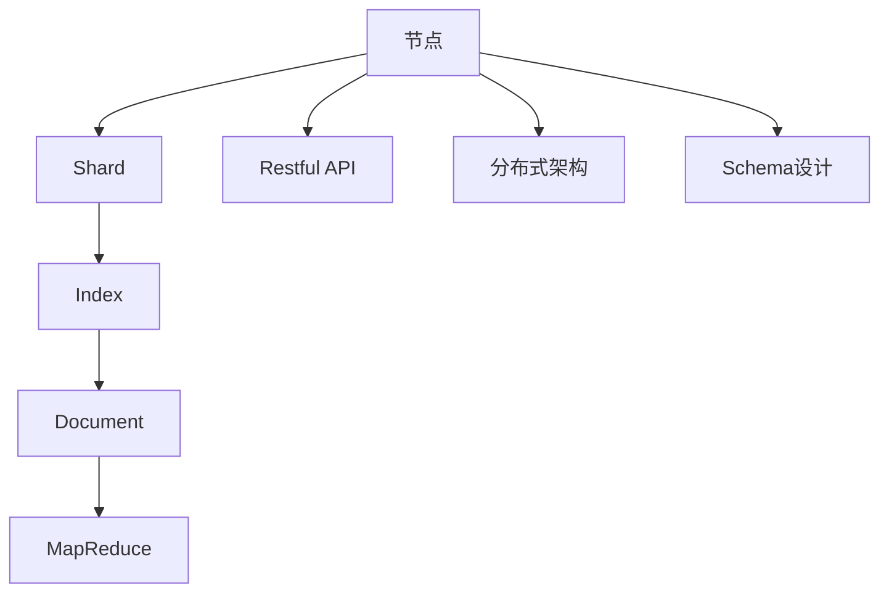
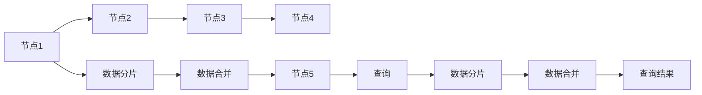
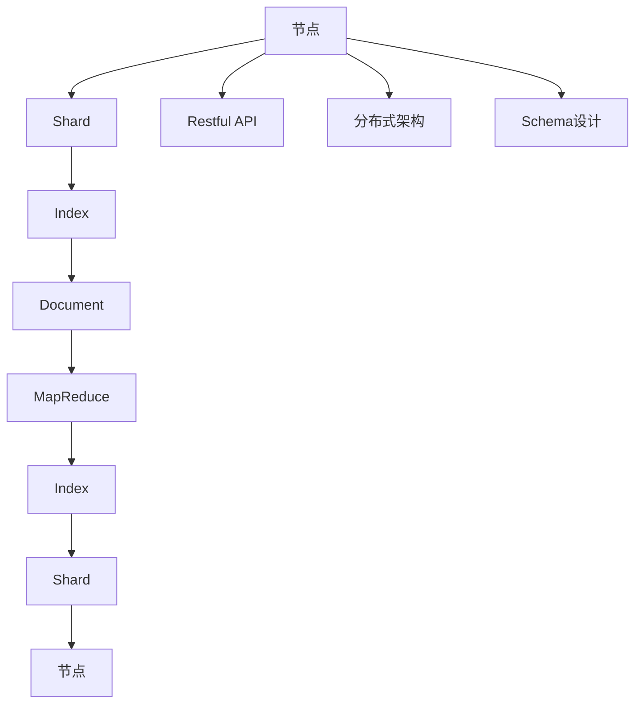

                 

# ElasticSearch原理与代码实例讲解

## 1. 背景介绍

### 1.1 问题由来
ElasticSearch是一款高性能的搜索与分析引擎，基于Apache Lucene实现，主要应用于搜索引擎、大数据处理、实时数据分析等场景。其核心特性包括分布式架构、水平扩展、实时搜索、复杂查询能力等，已成为大数据时代企业级搜索的首选解决方案。

ElasticSearch的架构灵活，能够适应多种数据源和存储方式，并支持跨语言的API访问，可以无缝集成到各种业务系统中，具备强大的数据处理能力和灵活的部署方式。

### 1.2 问题核心关键点
ElasticSearch的核心优势在于其强大的查询引擎和分布式架构，这使得它在处理大规模数据时仍能保持高效性能。其分布式架构允许将数据分布在多个节点上，通过并行处理提高查询速度，同时提供高可用性和容错能力。

ElasticSearch的查询引擎支持自然语言查询、布尔查询、嵌套查询、聚合查询等多种查询方式，能够根据不同的应用场景提供最优的查询性能。

### 1.3 问题研究意义
ElasticSearch的研究和应用意义主要体现在以下几方面：

1. 数据搜索效率：ElasticSearch通过优化查询算法和分布式架构，能够处理海量数据并实现实时搜索，提高数据查询效率。
2. 数据存储与分析：支持多数据源集成和复杂查询，使其成为大数据分析和实时处理的首选。
3. 高可用性：通过分布式架构和冗余存储，确保系统高可用性和容错能力。
4. 跨语言和跨平台：支持多种编程语言和数据源，提供统一的API接口，便于不同系统集成。
5. 简单易用：提供丰富的API和插件，支持快速搭建和扩展搜索系统。

## 2. 核心概念与联系

### 2.1 核心概念概述

为更好地理解ElasticSearch的工作原理，本节将介绍几个密切相关的核心概念：

- **节点(Node)**：ElasticSearch中的基本操作单元，负责处理数据存储、查询等任务。每个节点包括一个或多个Shard（分片）。
- **Shard（分片）**：ElasticSearch中的数据分片，每个Shard包含一部分数据，通过并行处理提高查询效率。
- **Index（索引）**：一组逻辑上相关的Shard的集合，每个Index可以包含多个文档（Document）。
- **Document（文档）**：ElasticSearch中数据的基本存储单位，包含一个或多个字段（Field）。
- **MapReduce**：ElasticSearch内部采用MapReduce计算模型，对海量数据进行分布式处理。
- **Restful API**：ElasticSearch提供统一的Restful API，支持多种编程语言的访问，便于系统集成和扩展。
- **分布式架构**：ElasticSearch采用分布式架构，通过多节点协同处理，提供高性能和高可用性。
- **Schema设计**：合理设计文档结构和字段类型，对查询效率和数据处理性能有重要影响。

这些核心概念之间的逻辑关系可以通过以下Mermaid流程图来展示：



这个流程图展示了一个ElasticSearch中的基本数据流和操作过程：

1. 节点是ElasticSearch的基本操作单元。
2. 节点上的数据被划分为多个Shard，每个Shard包含一部分数据。
3. Shard中的数据构成Index，Index中的数据由多个Document组成。
4. Document中的字段数据通过MapReduce计算模型进行处理。
5. 每个节点提供Restful API接口，支持多种编程语言的访问。
6. 节点之间采用分布式架构，提高查询效率和系统高可用性。
7. 合理设计Schema对查询性能和数据处理效率有重要影响。

### 2.2 概念间的关系

这些核心概念之间存在着紧密的联系，形成了ElasticSearch的数据处理和查询生态系统。下面我们通过几个Mermaid流程图来展示这些概念之间的关系。

#### 2.2.1 数据处理流程


这个流程图展示了ElasticSearch中数据处理的基本流程：

1. 数据通过节点进行初步处理，形成Shard。
2. Shard中的数据构成Index，Index中的数据由Document组成。
3. MapReduce计算模型对Document中的数据进行处理。
4. 处理后的数据返回Index，Index中的数据被重新分片，分配到其他Shard和节点。

#### 2.2.2 查询过程


这个流程图展示了ElasticSearch中查询的基本过程：

1. 用户通过Restful API发送查询请求。
2. 查询请求被路由到节点。
3. 节点将查询请求转发到相应的Shard。
4. Shard根据查询请求进行数据检索和处理。
5. 多个Shard的查询结果合并后返回节点。
6. 节点将查询结果返回给用户。

#### 2.2.3 分布式架构



这个流程图展示了ElasticSearch中分布式架构的基本原理：

1. 节点之间的数据被分散存储在不同的Shard中。
2. 查询请求被路由到多个节点，分别处理相关Shard中的数据。
3. 不同节点的查询结果通过数据合并后返回用户。

### 2.3 核心概念的整体架构

最后，我们用一个综合的流程图来展示这些核心概念在ElasticSearch中的整体架构：



这个综合流程图展示了ElasticSearch中的数据流和操作过程，以及与核心概念之间的联系：

1. 节点是ElasticSearch的基本操作单元。
2. 节点上的数据被划分为多个Shard，每个Shard包含一部分数据。
3. Shard中的数据构成Index，Index中的数据由Document组成。
4. Document中的字段数据通过MapReduce计算模型进行处理。
5. 每个节点提供Restful API接口，支持多种编程语言的访问。
6. 节点之间采用分布式架构，提高查询效率和系统高可用性。
7. 合理设计Schema对查询性能和数据处理效率有重要影响。

## 3. 核心算法原理 & 具体操作步骤
### 3.1 算法原理概述

ElasticSearch的核心算法主要基于Lucene的搜索引擎算法，结合了MapReduce计算模型和分布式架构，提供高效的数据处理和查询能力。其主要算法原理如下：

1. **倒排索引(Inverted Index)**：将文档中的每个字段映射到包含该字段的所有文档，支持快速的全文检索和精准定位。
2. **分段分段存储(Sharding)**：将大索引文件分割为多个Shard，提高查询效率和系统可扩展性。
3. **分布式架构(Distributed)**：通过多节点协同处理，提供高性能和高可用性。
4. **MapReduce计算模型**：采用MapReduce计算模型，对海量数据进行并行处理和查询。
5. **缓存机制(Caching)**：利用缓存机制提高查询效率，减少磁盘IO。

### 3.2 算法步骤详解

基于Lucene的ElasticSearch算法主要包括以下几个关键步骤：

**Step 1: 索引创建与数据导入**
- 创建Index，定义文档结构和字段类型。
- 通过API批量导入数据，如使用Bulk API、Upload API等。

**Step 2: 索引优化与配置**
- 调整Index的大小和分片数量，优化查询效率。
- 配置缓存大小和查询参数，提高系统性能。

**Step 3: 数据查询与检索**
- 通过API发送查询请求，指定查询条件和返回字段。
- ElasticSearch将查询请求路由到相关节点和Shard。
- Shard执行查询操作，返回查询结果。
- 节点将查询结果合并并返回用户。

**Step 4: 数据更新与删除**
- 通过API更新文档或删除文档，指定修改字段或ID。
- ElasticSearch将更新请求路由到相关节点和Shard。
- Shard执行更新操作，并返回更新结果。
- 节点将更新结果反馈给用户。

### 3.3 算法优缺点

ElasticSearch的优点主要体现在以下几方面：

1. **高性能查询**：通过分布式架构和倒排索引，支持高效的全文检索和精准定位。
2. **高可用性**：采用多节点分布式架构，提供高可用性和容错能力。
3. **易扩展性**：支持水平扩展，方便扩展存储和计算资源。
4. **丰富的查询语言**：提供自然语言查询、布尔查询、嵌套查询、聚合查询等多种查询方式，适应不同的应用场景。
5. **灵活的Schema设计**：支持多种数据源和字段类型，灵活设计Schema提高查询性能。

ElasticSearch的主要缺点在于：

1. **学习成本高**：API复杂，需要一定的学习和实践成本。
2. **资源消耗大**：大规模索引和查询需要较高的计算和存储资源。
3. **配置复杂**：需要根据具体应用场景进行优化配置，配置不当可能导致性能下降。
4. **安全性不足**：默认情况下，ElasticSearch没有内置的安全机制，需要额外配置和部署。
5. **并发写入性能差**：大量并发写入操作可能导致性能瓶颈，需要合理规划并发度。

### 3.4 算法应用领域

ElasticSearch因其强大的查询引擎和分布式架构，广泛应用于以下几个领域：

1. **搜索引擎**：支持自然语言查询和布尔查询，提供高效的搜索和排序功能。
2. **大数据处理**：支持MapReduce计算模型，对海量数据进行分布式处理和分析。
3. **实时分析**：支持实时搜索和聚合查询，提供高效的实时数据处理能力。
4. **日志存储**：支持多数据源集成和日志分析，提供高效的数据存储和查询。
5. **物联网(IoT)**：支持多种数据源和字段类型，提供高效的数据存储和查询。

此外，ElasticSearch还被广泛应用于内容管理、推荐系统、舆情分析、地理信息等领域，成为企业级搜索和数据分析的重要工具。

## 4. 数学模型和公式 & 详细讲解  
### 4.1 数学模型构建

ElasticSearch的核心算法主要基于Lucene的搜索引擎算法，其数学模型可以描述为：

$$
\text{查询} \rightarrow \text{MapReduce} \rightarrow \text{倒排索引} \rightarrow \text{分片} \rightarrow \text{索引} \rightarrow \text{节点} \rightarrow \text{查询结果}
$$

其中，查询通过MapReduce计算模型进行处理，得到倒排索引，倒排索引分布在多个Shard中，Shard构成Index，Index分布在多个节点上，最终通过查询API返回查询结果。

### 4.2 公式推导过程

以自然语言查询为例，ElasticSearch的查询过程可以描述为：

1. **分词与解析**：将自然语言查询分词，解析成可执行的查询条件。
2. **Map计算**：将查询条件映射到倒排索引中的字段，生成中间结果。
3. **Reduce计算**：将多个Shard的查询结果合并，生成最终查询结果。

具体查询过程可以用以下伪代码表示：

```python
def search(query):
    # 分词与解析
    tokens = tokenize(query)
    query_tree = parse(tokens)

    # Map计算
    map_results = []
    for shard in shards:
        shard_index = shard.get_index()
        shard_documents = shard_index.get_documents()
        map_results.extend(shard_map(query_tree, shard_documents))

    # Reduce计算
    reduce_results = reduce(map_results)
    return reduce_results
```

其中，`tokenize`函数用于分词，`parse`函数用于解析，`shard`对象表示Shard，`map`函数用于Map计算，`reduce`函数用于Reduce计算。

### 4.3 案例分析与讲解

以查询"ElasticSearch 2023"为例，ElasticSearch的查询过程如下：

1. **分词与解析**：将查询分词为"Elastic", "Search", "2023"。
2. **Map计算**：将查询条件映射到倒排索引中的字段，生成中间结果。
3. **Reduce计算**：将多个Shard的查询结果合并，生成最终查询结果。

具体查询过程可以用以下伪代码表示：

```python
def search(query):
    # 分词与解析
    tokens = tokenize(query)
    query_tree = parse(tokens)

    # Map计算
    map_results = []
    for shard in shards:
        shard_index = shard.get_index()
        shard_documents = shard_index.get_documents()
        map_results.extend(shard_map(query_tree, shard_documents))

    # Reduce计算
    reduce_results = reduce(map_results)
    return reduce_results
```

其中，`tokenize`函数用于分词，`parse`函数用于解析，`shard`对象表示Shard，`map`函数用于Map计算，`reduce`函数用于Reduce计算。

## 5. 项目实践：代码实例和详细解释说明
### 5.1 开发环境搭建

在进行ElasticSearch项目开发前，我们需要准备好开发环境。以下是使用Python进行ElasticSearch开发的环境配置流程：

1. 安装Anaconda：从官网下载并安装Anaconda，用于创建独立的Python环境。

2. 创建并激活虚拟环境：
```bash
conda create -n elasticsearch-env python=3.8 
conda activate elasticsearch-env
```

3. 安装ElasticSearch客户端：
```bash
pip install elasticsearch
```

4. 安装ElasticSearch官方库：
```bash
pip install elasticsearch-py
```

5. 安装NLP处理库：
```bash
pip install nltk
```

完成上述步骤后，即可在`elasticsearch-env`环境中开始ElasticSearch项目开发。

### 5.2 源代码详细实现

以下是使用Python编写ElasticSearch索引和查询的示例代码：

```python
from elasticsearch import Elasticsearch

# 创建ElasticSearch客户端
es = Elasticsearch([{'host': 'localhost', 'port': 9200}])

# 创建Index
es.indices.create(index='my_index', ignore=400)

# 创建文档
doc = {
    'author': 'zhangsan',
    'text': 'ElasticSearch is a search and analysis engine based on Lucene',
    'timestamp': datetime.now()
}
es.index(index='my_index', doc_type='doc', id=1, body=doc)

# 查询文档
query = {
    "query": {
        "match": {
            "text": "ElasticSearch"
        }
    }
}
res = es.search(index='my_index', body=query)
print(res)
```

在上述代码中，我们首先创建了一个ElasticSearch客户端，连接到本地9200端口。然后，我们创建了一个名为`my_index`的Index，并定义了一个文档类型`doc`。接着，我们向该Index添加了一个文档，并使用`match`查询条件查询该文档。

### 5.3 代码解读与分析

让我们再详细解读一下关键代码的实现细节：

**ElasticSearch客户端创建**：
- 通过`Elasticsearch`类创建ElasticSearch客户端，指定连接地址和端口号。

**Index创建与文档添加**：
- 使用`indices.create`方法创建Index，指定Index名称和忽略400错误码（表示Index已存在）。
- 定义一个文档，包含作者、文本和创建时间等信息。
- 使用`index`方法将文档添加到Index中，指定Index名称、文档类型、ID和文档内容。

**查询文档**：
- 定义一个查询，使用`match`查询条件匹配文本字段。
- 使用`search`方法发送查询请求，指定Index名称和查询条件。
- 获取查询结果，打印输出。

### 5.4 运行结果展示

假设我们在`my_index` Index中查询`ElasticSearch`，查询结果如下：

```
{
  "took": 3,
  "timed_out": false,
  "_shards": {
    "total": 1,
    "successful": 1,
    "failed": 0
  },
  "hits": {
    "total": {
      "value": 1,
      "relation": "eq"
    },
    "max_score": 1.0,
    "hits": [
      {
        "_index": "my_index",
        "_type": "doc",
        "_id": "1",
        "_score": 1.0,
        "_source": {
          "author": "zhangsan",
          "text": "ElasticSearch is a search and analysis engine based on Lucene",
          "timestamp": "2023-08-01T10:00:00"
        }
      }
    ]
  }
}
```

可以看到，ElasticSearch能够快速定位到包含查询关键词的文档，并返回完整的文档内容。

## 6. 实际应用场景
### 6.1 智能搜索系统

基于ElasticSearch的智能搜索系统能够为用户提供高效的搜索体验，支持自然语言查询、布尔查询、聚合查询等多种查询方式。智能搜索系统可以应用于企业内部文档管理、电商平台、知识库等多个场景，帮助用户快速定位所需信息。

在技术实现上，可以结合自然语言处理、图像识别等技术，增强搜索系统的智能化水平。例如，通过文本分类、实体识别等技术，将用户输入的查询意图转化为更准确的查询条件，提升搜索的精准度。

### 6.2 实时监控系统

实时监控系统需要快速处理海量日志数据，并实时监控系统状态和异常。ElasticSearch的高性能和大数据处理能力，使其成为实时监控的理想选择。

在技术实现上，可以将实时监控数据存储到ElasticSearch中，并结合Kibana等可视化工具，实时监控系统状态和性能指标。例如，可以定义关键性能指标(KPIs)，设置告警阈值，一旦超过阈值便自动触发告警，快速定位问题，及时解决。

### 6.3 推荐系统

推荐系统需要快速处理海量用户行为数据，并根据用户兴趣推荐相关内容。ElasticSearch的查询引擎和分布式架构，使其能够高效处理大规模用户数据，并实时推荐。

在技术实现上，可以将用户行为数据存储到ElasticSearch中，并结合机器学习算法，实时计算用户兴趣，生成推荐结果。例如，可以使用协同过滤、内容推荐等算法，根据用户的历史行为和兴趣推荐相关内容，提升用户体验。

### 6.4 未来应用展望

随着ElasticSearch技术的不断发展，其应用领域将进一步扩展，带来更多的创新应用场景：

1. **智能文档管理**：通过自然语言处理和图像识别技术，提升文档检索和管理的智能化水平，帮助企业高效管理知识资产。
2. **智能客服系统**：通过实时搜索和自然语言处理技术，实现智能客服系统的自然语言理解，提升客户服务体验。
3. **智慧城市治理**：通过实时监控和数据分析技术，提升智慧城市的管理和治理能力，提高城市运行效率。
4. **智能交通系统**：通过实时数据处理和查询技术，提升智能交通系统的管理和优化能力，实现交通流量预测和优化。

未来，随着ElasticSearch技术的不断演进，其应用场景将更加丰富，成为各行各业数字化转型的重要工具。

## 7. 工具和资源推荐
### 7.1 学习资源推荐

为了帮助开发者系统掌握ElasticSearch的理论基础和实践技巧，这里推荐一些优质的学习资源：

1. **ElasticSearch官方文档**：ElasticSearch的官方文档，提供了完整的API和插件文档，是学习和实践ElasticSearch的最佳资源。

2. **《ElasticSearch权威指南》**：ElasticSearch技术专家撰写，深入浅出地介绍了ElasticSearch的核心概念、技术原理和应用场景，是ElasticSearch学习的必读书籍。

3. **《ElasticSearch 7.x实战》**：实战性极强的ElasticSearch教程，通过案例演示了ElasticSearch的核心技术和应用场景，适合快速上手实践。

4. **ElasticSearch中文社区**：ElasticSearch的中文技术社区，汇聚了大量技术文档、案例分享和社区讨论，是学习和交流ElasticSearch的良好平台。

5. **ElasticSearch Meetup**：ElasticSearch的全球Meetup活动，定期举办技术讲座和交流会，了解ElasticSearch最新动态和技术趋势。

通过对这些资源的学习实践，相信你一定能够快速掌握ElasticSearch的核心技术和应用场景，并用于解决实际的业务问题。

### 7.2 开发工具推荐

高效的开发离不开优秀的工具支持。以下是几款用于ElasticSearch开发的工具：

1. **ElasticSearch官方客户端**：ElasticSearch提供的官方客户端，支持多种编程语言和接口调用，方便开发和测试。

2. **ElasticSearch Head**：ElasticSearch的可视化界面，支持实时监控、搜索和分析，方便调试和优化。

3. **Kibana**：ElasticSearch的可视化工具，支持数据可视化、仪表盘和报表生成，方便数据分析和监控。

4. **ELK Stack**：ElasticSearch、Logstash和Kibana的组合，支持实时数据采集、处理和分析，适用于大规模日志系统。

5. **X-Pack**：ElasticSearch的插件框架，提供丰富的功能插件，如监控、安全、分析和机器学习等，方便扩展和集成。

合理利用这些工具，可以显著提升ElasticSearch开发的效率和质量，加速创新迭代的步伐。

### 7.3 相关论文推荐

ElasticSearch的研究和应用意义主要体现在以下几篇经典论文中：

1. **"Efficient Bulk Processing in Apache Lucene 5.0 and ElasticSearch 5.0"**：介绍了ElasticSearch的内部架构和性能优化技术，展示了其在大规模数据处理中的优势。

2. **"ElasticSearch: A Distributed, Real-time Search and Analytics Engine"**：介绍了ElasticSearch的核心技术原理和应用场景，展示了其在实时数据处理中的优势。

3. **"Using the ElasticSearch REST API"**：介绍了ElasticSearch的REST API接口，展示了如何通过API调用ElasticSearch进行数据管理和查询。

4. **"ElasticSearch: Beyond Search"**：介绍了ElasticSearch在数据分析、推荐系统、智能搜索等多个领域的应用，展示了其全面的应用价值。

5. **"ElasticSearch 7.x: A Field Guide to the Best in Search and Analytics"**：介绍了ElasticSearch 7.x版本的核心特性和应用场景，展示了其最新的技术进展和实践经验。

这些论文代表了大规模数据处理和查询技术的最新进展，通过学习这些前沿成果，可以帮助研究者把握学科前进方向，激发更多的创新灵感。

除上述资源外，还有一些值得关注的前沿资源，帮助开发者紧跟ElasticSearch技术的最新进展，例如：

1. **arXiv论文预印本**：人工智能领域最新研究成果的发布平台，包括大量尚未发表的前沿工作，学习前沿技术的必读资源。

2. **顶会论文**：如SIGIR、IEEE Big Data、ACM EC等顶级会议的论文，展示最新的研究成果和技术趋势。

3. **开源项目**：如ElasticSearch官方项目、Kibana项目、Logstash项目等，汇聚了大量前沿技术和实践经验，值得学习和贡献。

4. **技术博客**：如ElasticSearch官方博客、Kibana博客、ELK Stack博客等，提供最新的技术动态和应用案例，帮助快速上手实践。

总之，对于ElasticSearch的学习和实践，需要开发者保持开放的心态和持续学习的意愿。多关注前沿资讯，多动手实践，多思考总结，必将收获满满的成长收益。

## 8. 总结：未来发展趋势与挑战

### 8.1 总结

本文对ElasticSearch的核心算法原理和具体操作步骤进行了全面系统的介绍。首先阐述了ElasticSearch的基本架构和核心概念，明确了其高性能查询和高可用性的优势。其次，从原理到实践，详细讲解了ElasticSearch的核心算法和具体操作步骤，给出了完整的代码实例和运行结果展示。同时，本文还广泛探讨了ElasticSearch在智能搜索、实时监控、推荐系统等多个领域的应用前景，展示了ElasticSearch的广阔应用价值。

通过本文的系统梳理，可以看到，ElasticSearch在处理大规模数据和实现高效查询方面，有着独特的优势和广泛的应用场景。ElasticSearch的高性能和大数据处理能力，使其成为企业级搜索和数据分析的重要工具，为各行各业提供了强大的数据处理和查询能力。

### 8.2 未来发展趋势

展望未来，ElasticSearch将呈现以下几个发展趋势：

1. **分布式架构优化**：未来ElasticSearch将进一步优化分布式架构，提高查询效率和系统高可用性。
2. **垂直扩展优化**：通过优化索引

