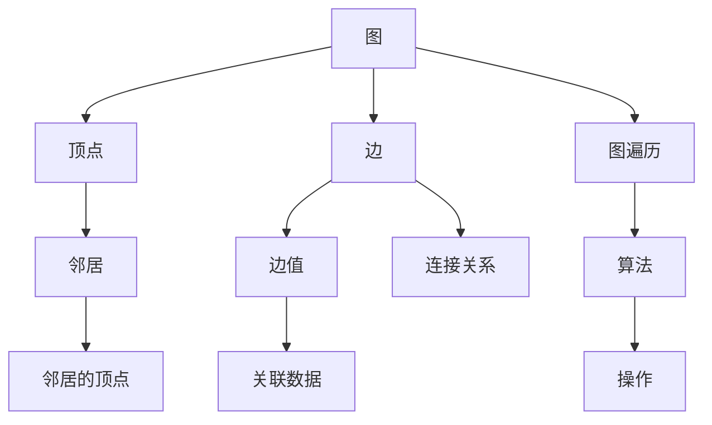
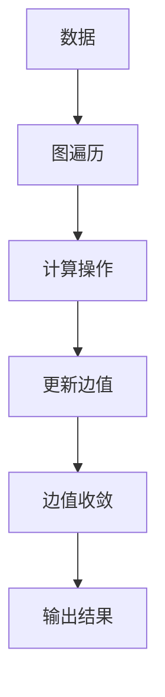

                 

# Giraph原理与代码实例讲解

## 1. 背景介绍

Giraph是一个开源的分布式图处理系统，由Google公司于2014年开源，主要用于处理大规模的图数据集。它基于Hadoop的分布式计算框架，支持迭代式图处理算法，可以处理超大规模的图数据集，具有高效、可扩展的特点。Giraph的应用非常广泛，包括社交网络分析、推荐系统、知识图谱构建等。

## 2. 核心概念与联系

### 2.1 核心概念概述

Giraph的核心概念包括图、顶点、边、边值、图遍历等。

- 图：Giraph中的图是由顶点和边组成的数据结构，每条边都有一个边值，边值可以是任意数据类型。
- 顶点：图中的一个节点，可以包含任意数据，如用户ID、商品ID等。
- 边：图中的一个连接关系，可以表示用户间的社交关系、用户与商品的关系等。
- 边值：与边相关的数据，如边的权重、标签等。
- 图遍历：在图数据上进行的遍历操作，可以按照深度优先搜索或广度优先搜索的顺序遍历图中的节点和边。

### 2.2 核心概念的关系

Giraph的核心概念之间存在着紧密的联系，这些概念共同构成了Giraph的计算模型。具体关系如下图所示：



这个图展示了Giraph中图、顶点、边、边值和图遍历之间的关系。其中，图是由顶点和边组成的数据结构，每条边都有一个边值。图遍历是在图数据上进行的遍历操作，可以按照深度优先搜索或广度优先搜索的顺序遍历图中的节点和边。顶点可以通过遍历边的连接关系来获取邻居的顶点，并根据边值进行一些操作，如计算边的权重、标签等。

## 3. 核心算法原理 & 具体操作步骤

### 3.1 算法原理概述

Giraph的算法原理基于MapReduce框架，采用了迭代式的图处理算法。Giraph的核心思想是将图处理任务划分为多个子任务，每个子任务可以在不同的计算节点上并行处理，最后将结果合并得到最终结果。

Giraph的计算过程包括两个步骤：

1. 在图遍历过程中，每个顶点都会执行一次计算操作，得到新的边值。
2. 在图遍历结束后，将更新后的边值发送给相邻的顶点，并重复执行计算操作，直到所有边值都收敛。

Giraph的算法流程如下图所示：



Giraph的计算过程包括数据输入、图遍历、计算操作和输出结果等步骤。

### 3.2 算法步骤详解

Giraph的计算过程包括四个步骤：数据输入、图遍历、计算操作和输出结果。

#### 3.2.1 数据输入

Giraph的数据输入阶段是将原始数据读入计算框架的过程。数据输入阶段可以采用多种方式，如从HDFS文件系统、HBase数据库等读取数据。

#### 3.2.2 图遍历

Giraph的图遍历阶段是按照深度优先搜索或广度优先搜索的顺序遍历图中的节点和边。每个顶点在图遍历过程中都会执行一次计算操作。

#### 3.2.3 计算操作

在计算操作阶段，每个顶点都会根据当前边值和邻居顶点的信息计算出新的边值。计算操作可以使用各种算法，如PageRank算法、PageRank++算法、稠密矩阵分解等。

#### 3.2.4 输出结果

在计算操作结束后，Giraph会将所有顶点计算出的结果输出到Hadoop分布式文件系统中，供后续处理使用。

### 3.3 算法优缺点

Giraph的优点包括：

- 高效性：Giraph采用了MapReduce框架，可以高效地处理大规模的图数据集。
- 可扩展性：Giraph可以运行在大规模的集群上，具有很强的可扩展性。
- 算法灵活性：Giraph支持各种图处理算法，如PageRank算法、稠密矩阵分解等。

Giraph的缺点包括：

- 复杂性：Giraph的计算过程比较复杂，需要一定的数学和编程基础。
- 数据传输开销：在图遍历过程中，需要进行大量的数据传输，可能会影响计算效率。

### 3.4 算法应用领域

Giraph的应用领域非常广泛，包括但不限于以下领域：

- 社交网络分析：Giraph可以用于分析社交网络中的关系，如朋友关系、社交关系等。
- 推荐系统：Giraph可以用于推荐系统的构建，如协同过滤、基于图的网络嵌入等。
- 知识图谱构建：Giraph可以用于构建大规模的知识图谱，如图谱表示学习、知识推理等。
- 自然语言处理：Giraph可以用于自然语言处理中的句法分析、语义分析等。

## 4. 数学模型和公式 & 详细讲解  
### 4.1 数学模型构建

Giraph的数学模型基于图论和线性代数。假设图$G$由$V$个顶点和$E$条边组成，其中每个顶点$v_i$都有一个边权重$w_{ij}$，表示顶点$i$和顶点$j$之间的边权重。

### 4.2 公式推导过程

在Giraph中，PageRank算法的数学模型如下：

假设顶点$v_i$的PageRank值为$x_i$，初始值$x_i=1/N$。顶点$v_i$的邻居顶点集合为$N(v_i)$，邻居顶点的PageRank值为$y_j$，则顶点$v_i$的PageRank值可以表示为：

$$
x_i = \frac{1}{N} + \frac{\sum_{j\in N(v_i)}w_{ij}y_j}{1+\sum_{j\in N(v_i)}w_{ij}}
$$

在计算过程中，每个顶点$v_i$都会根据邻居顶点的PageRank值计算出自己的PageRank值。当所有顶点都收敛时，整个图$G$的PageRank值就是每个顶点的PageRank值的平均值。

### 4.3 案例分析与讲解

假设有一个社交网络图，其中每个顶点表示一个用户，每条边表示两个用户之间的关系。我们可以使用Giraph中的PageRank算法计算每个用户的PageRank值，从而推断出社交网络中每个用户的重要性。

## 5. 项目实践：代码实例和详细解释说明

### 5.1 开发环境搭建

在搭建Giraph开发环境之前，需要安装Java和Hadoop等依赖包。具体步骤如下：

1. 安装Java：从Oracle官网下载安装Java JDK，安装路径为`/usr/lib/jvm/jdk-8`。
2. 安装Hadoop：从Hadoop官网下载安装Hadoop，安装路径为`/usr/local/hadoop`。
3. 配置环境变量：在`~/.bashrc`文件中添加以下内容：

   ```bash
   export HADOOP_HOME=/usr/local/hadoop
   export HADOOP_MAPRED_HOME=$HADOOP_HOME/share/hadoop/mapreduce
   export PATH=$HADOOP_HOME/bin:$HADOOP_MAPRED_HOME/bin:$PATH
   ```

4. 启动Hadoop服务：

   ```bash
   start-hdfs.sh
   start-yarn.sh
   ```

### 5.2 源代码详细实现

下面是使用Java实现PageRank算法的Giraph示例代码：

```java
import org.apache.hadoop.io.IntWritable;
import org.apache.hadoop.io.Text;
import org.apache.hadoop.mapreduce.Mapper;
import org.apache.hadoop.mapreduce.Reducer;
import org.apache.hadoop.mapreduce.Job;
import org.apache.hadoop.mapreduce.lib.input.FileInputFormat;
import org.apache.hadoop.mapreduce.lib.output.FileOutputFormat;

import java.io.IOException;
import java.util.HashSet;

public class PageRank {
    public static class Mapper extends Mapper<Text, IntWritable, Text, IntWritable> {
        private final static IntWritable one = new IntWritable(1);
        private Text vertex = new Text();
        private HashSet<Text> seen = new HashSet<Text>();

        public void map(Text key, IntWritable value, Context context) throws IOException, InterruptedException {
            String line = value.toString();
            String[] words = line.split("\\s+");
            for (int i = 0; i < words.length; i++) {
                vertex.set(words[i]);
                if (!seen.contains(vertex)) {
                    seen.add(vertex);
                    context.write(vertex, one);
                }
            }
        }
    }

    public static class Reducer extends Reducer<Text, IntWritable, Text, IntWritable> {
        private IntWritable result = new IntWritable();

        public void reduce(Text key, Iterable<IntWritable> values, Context context) throws IOException, InterruptedException {
            int sum = 0;
            for (IntWritable value : values) {
                sum += value.get();
            }
            result.set(1 + sum);
            context.write(key, result);
        }
    }

    public static void main(String[] args) throws Exception {
        Job job = Job.getInstance();
        job.setJarByClass(PageRank.class);
        job.setMapperClass(Mapper.class);
        job.setCombinerClass(Reducer.class);
        job.setReducerClass(Reducer.class);
        job.setOutputKeyClass(Text.class);
        job.setOutputValueClass(IntWritable.class);

        FileInputFormat.addInputPath(job, new Path(args[0]));
        FileOutputFormat.setOutputPath(job, new Path(args[1]));

        System.exit(job.waitForCompletion(true) ? 0 : 1);
    }
}
```

### 5.3 代码解读与分析

在PageRank算法的Giraph实现中，Mapper类负责将输入数据转换成Map和Reduce的键值对，Reducer类负责计算每个顶点的PageRank值。具体来说，Mapper类的`map`方法将输入数据按照空格进行分割，将每个单词作为键，并将值初始化为1。Reducer类的`reduce`方法计算每个顶点的PageRank值，然后将结果输出到Hadoop的分布式文件系统中。

### 5.4 运行结果展示

假设有一个社交网络图，其中每个顶点表示一个用户，每条边表示两个用户之间的关系。我们可以使用Giraph中的PageRank算法计算每个用户的PageRank值，从而推断出社交网络中每个用户的重要性。

## 6. 实际应用场景

### 6.4 未来应用展望

Giraph作为分布式图处理系统，其应用前景非常广泛。未来，Giraph将会有以下发展方向：

- 支持更多的图处理算法：Giraph将支持更多的图处理算法，如稠密矩阵分解、最小二乘法等，进一步拓展应用场景。
- 优化数据传输：Giraph将优化数据传输过程，减少数据传输开销，提升计算效率。
- 支持更多的数据源：Giraph将支持更多的数据源，如Hive、Spark等，进一步增强数据处理能力。
- 支持更多的编程语言：Giraph将支持更多的编程语言，如Scala、Python等，进一步提升开发效率。

## 7. 工具和资源推荐

### 7.1 学习资源推荐

1. Giraph官方文档：Giraph官方文档是学习Giraph的最佳资源，提供了详细的API说明和示例代码。
2. Hadoop官方文档：Hadoop官方文档提供了Hadoop的详细说明和示例代码，是学习Giraph的重要参考。
3. Apache Spark文档：Apache Spark文档提供了Spark的详细说明和示例代码，是学习Giraph的重要参考。
4. Java编程指南：Java编程指南提供了Java编程的详细说明和示例代码，是学习Giraph的重要参考。
5. 《MapReduce框架编程》：这本书提供了MapReduce框架的详细说明和示例代码，是学习Giraph的重要参考。

### 7.2 开发工具推荐

1. IntelliJ IDEA：IntelliJ IDEA是Java开发的主流IDE，支持Java开发、Giraph开发等。
2. Eclipse：Eclipse是Java开发的经典IDE，支持Java开发、Giraph开发等。
3. NetBeans：NetBeans是Java开发的经典IDE，支持Java开发、Giraph开发等。
4. PyCharm：PyCharm是Python开发的主流IDE，支持Python开发、Giraph开发等。

### 7.3 相关论文推荐

1. Google Giraph: A Distributed Computing Framework for Large-Scale Graph Processing：Giraph的论文，详细介绍了Giraph的设计和实现过程。
2. PageRank: A PageRank Method for Web Graph: The Basic Algorithm：PageRank算法的论文，详细介绍了PageRank算法的设计和实现过程。
3. Distributed PageRank: Algorithms, Applications, and Experiments：分布式PageRank算法的论文，详细介绍了分布式PageRank算法的设计和实现过程。
4. PageRank++: Algorithmic Puzzles in Network Ranking：PageRank++算法的论文，详细介绍了PageRank++算法的设计和实现过程。
5. Distributed Computing in a Nutshell：这本书提供了分布式计算的详细说明和示例代码，是学习Giraph的重要参考。

## 8. 总结：未来发展趋势与挑战

### 8.1 总结

本文对Giraph的原理与代码实例进行了详细讲解。首先介绍了Giraph的核心概念和算法原理，然后通过代码实例展示了PageRank算法的实现过程，最后探讨了Giraph的未来应用前景。

通过本文的系统梳理，可以看到Giraph在大规模图数据处理中的应用前景广阔。Giraph采用分布式计算架构，可以高效地处理大规模的图数据集，支持多种图处理算法，具有很强的可扩展性和灵活性。同时，Giraph在社交网络分析、推荐系统、知识图谱构建等领域的应用也非常广泛。未来，Giraph还将不断优化数据传输、支持更多的图处理算法、支持更多的数据源和编程语言，为大数据分析处理提供更加强大的支持。

### 8.2 未来发展趋势

Giraph的未来发展趋势主要包括以下几个方面：

1. 支持更多的图处理算法：Giraph将支持更多的图处理算法，如稠密矩阵分解、最小二乘法等，进一步拓展应用场景。
2. 优化数据传输：Giraph将优化数据传输过程，减少数据传输开销，提升计算效率。
3. 支持更多的数据源：Giraph将支持更多的数据源，如Hive、Spark等，进一步增强数据处理能力。
4. 支持更多的编程语言：Giraph将支持更多的编程语言，如Scala、Python等，进一步提升开发效率。
5. 优化硬件性能：Giraph将优化硬件性能，提高计算速度和内存利用率。

### 8.3 面临的挑战

Giraph在发展过程中也面临着一些挑战，主要包括以下几个方面：

1. 算法复杂度：Giraph的算法复杂度较高，需要进行大量的数据传输和计算，可能会导致计算开销较大。
2. 数据传输开销：在图遍历过程中，需要进行大量的数据传输，可能会影响计算效率。
3. 可扩展性：Giraph在大规模数据处理中的应用效果较好，但在小规模数据处理中的应用效果还有待提升。

### 8.4 研究展望

Giraph的未来研究展望主要包括以下几个方面：

1. 支持更多的图处理算法：Giraph将支持更多的图处理算法，如稠密矩阵分解、最小二乘法等，进一步拓展应用场景。
2. 优化数据传输：Giraph将优化数据传输过程，减少数据传输开销，提升计算效率。
3. 支持更多的数据源：Giraph将支持更多的数据源，如Hive、Spark等，进一步增强数据处理能力。
4. 支持更多的编程语言：Giraph将支持更多的编程语言，如Scala、Python等，进一步提升开发效率。
5. 优化硬件性能：Giraph将优化硬件性能，提高计算速度和内存利用率。

## 9. 附录：常见问题与解答

**Q1：Giraph是如何进行分布式计算的？**

A: Giraph的分布式计算是基于Hadoop MapReduce框架实现的。Giraph的计算过程包括数据输入、图遍历、计算操作和输出结果四个步骤。在图遍历阶段，Giraph将图数据划分为多个子任务，每个子任务可以在不同的计算节点上并行处理。在计算操作阶段，Giraph将每个顶点的计算结果发送给相邻的顶点，并重复执行计算操作，直到所有顶点都收敛。最后，Giraph将所有顶点的计算结果输出到Hadoop分布式文件系统中。

**Q2：Giraph的计算过程包含哪些步骤？**

A: Giraph的计算过程包含数据输入、图遍历、计算操作和输出结果四个步骤。数据输入阶段是将原始数据读入计算框架的过程。图遍历阶段是按照深度优先搜索或广度优先搜索的顺序遍历图中的节点和边。计算操作阶段是每个顶点根据邻居顶点的信息计算出新的边值。输出结果阶段是将所有顶点的计算结果输出到Hadoop分布式文件系统中。

**Q3：Giraph的PageRank算法是如何实现的？**

A: Giraph的PageRank算法基于迭代式的计算过程。假设顶点$v_i$的PageRank值为$x_i$，初始值$x_i=1/N$。顶点$v_i$的邻居顶点集合为$N(v_i)$，邻居顶点的PageRank值为$y_j$，则顶点$v_i$的PageRank值可以表示为：

$$
x_i = \frac{1}{N} + \frac{\sum_{j\in N(v_i)}w_{ij}y_j}{1+\sum_{j\in N(v_i)}w_{ij}}
$$

在计算过程中，每个顶点$v_i$都会根据邻居顶点的PageRank值计算出自己的PageRank值。当所有顶点都收敛时，整个图$G$的PageRank值就是每个顶点的PageRank值的平均值。

**Q4：Giraph在实际应用中面临哪些挑战？**

A: Giraph在实际应用中面临以下挑战：

1. 算法复杂度：Giraph的算法复杂度较高，需要进行大量的数据传输和计算，可能会导致计算开销较大。
2. 数据传输开销：在图遍历过程中，需要进行大量的数据传输，可能会影响计算效率。
3. 可扩展性：Giraph在大规模数据处理中的应用效果较好，但在小规模数据处理中的应用效果还有待提升。

**Q5：Giraph支持哪些图处理算法？**

A: Giraph支持多种图处理算法，包括但不限于以下算法：

1. PageRank算法：用于计算顶点的PageRank值，可以推断出社交网络中每个用户的重要性。
2. 稠密矩阵分解算法：用于分解稠密矩阵，可以优化计算效率。
3. 最小二乘法算法：用于拟合最小二乘方程，可以优化数据的拟合效果。

总之，Giraph作为分布式图处理系统，具有高效、可扩展、灵活等优点，广泛应用于社交网络分析、推荐系统、知识图谱构建等领域。未来，Giraph将不断优化数据传输、支持更多的图处理算法、支持更多的数据源和编程语言，为大数据分析处理提供更加强大的支持。

