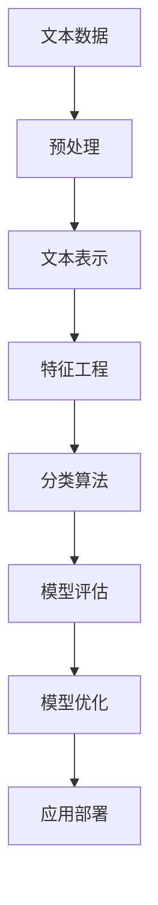

好的,我明白了您的要求。以下是按照您提供的目录结构和约束条件撰写的技术博客文章正文部分:

# Python机器学习实战:自然语言处理中的文本分类技术

## 1. 背景介绍

### 1.1 问题的由来

在当今的信息时代,我们每天都会产生和接收大量的文本数据,无论是网页、电子邮件、社交媒体还是其他形式的数字文本。随着数据量的激增,有效地组织和理解这些海量文本数据变得至关重要。文本分类作为自然语言处理(NLP)的一个核心任务,旨在自动将文本文档归类到预定义的类别中,为有效管理和利用文本数据提供了强有力的支持。

### 1.2 研究现状

早期的文本分类方法主要基于规则和词典,需要大量的人工干预和领域知识。随着机器学习技术的发展,基于统计模型的监督式和无监督式文本分类方法逐渐占据主导地位。近年来,随着深度学习的兴起,利用神经网络进行文本表示和分类的方法取得了卓越的成绩,推动了文本分类技术的飞速发展。

### 1.3 研究意义

文本分类技术在许多领域都有广泛的应用,例如:

- 垃圾邮件过滤
- 新闻分类
- 情感分析
- 主题识别
- 智能客服等

高效准确的文本分类能够帮助我们从海量文本数据中快速获取有价值的信息,为决策提供支持。因此,研究和优化文本分类算法对于提高信息处理效率和质量至关重要。

### 1.4 本文结构

本文将重点介绍Python机器学习库中常用的文本分类算法和实现方法,内容包括:

- 自然语言处理中的核心概念
- 文本分类算法原理和步骤
- 数学模型和公式推导
- 项目实践和代码示例
- 实际应用场景分析
- 工具和资源推荐
- 未来发展趋势与挑战

## 2. 核心概念与联系

在自然语言处理中,有几个核心概念与文本分类任务密切相关:

1. **文本表示(Text Representation)**
   - 将原始文本转换为机器可以理解的数值向量表示
   - 常用方法包括One-Hot编码、TF-IDF、Word Embedding等

2. **特征工程(Feature Engineering)**
   - 从文本数据中提取有意义的特征
   - 常用方法包括N-gram、POS标注、命名实体识别等

3. **分类算法(Classification Algorithms)**
   - 将文本映射到预定义的类别标签
   - 常用算法包括朴素贝叶斯、支持向量机、决策树、神经网络等

4. **模型评估(Model Evaluation)**
   - 使用准确率、精确率、召回率、F1分数等指标评估模型性能

5. **预处理(Preprocessing)**
   - 对原始文本进行标准化、去除停用词和语法规范化等预处理

这些概念相互关联,共同构建了文本分类的完整流程。合理地将它们结合使用是获得良好分类性能的关键。



## 3. 核心算法原理与具体操作步骤

### 3.1 算法原理概述

常用的文本分类算法可以分为以下几类:

1. **朴素贝叶斯分类器**
   - 基于贝叶斯定理计算文档属于每个类别的概率
   - 简单高效,常用于文本分类基准

2. **支持向量机(SVM)**
   - 将文本表示为向量,寻找最优超平面将不同类别分隔
   - 具有良好的泛化能力,适用于高维稀疏数据

3. **决策树和随机森林**
   - 基于特征构建决策树模型进行分类
   - 随机森林通过集成多个决策树提高性能

4. **神经网络**
   - 利用深度学习模型自动学习文本特征表示
   - 常用网络包括RNN、CNN、Transformer等

不同算法有不同的适用场景和优缺点特征,合理选择和配置对应用效果影响很大。

### 3.2 算法步骤详解

以朴素贝叶斯分类器为例,其主要步骤如下:

1. **文本预处理**
   - 对文本进行分词、去除停用词等预处理

2. **构建词袋模型**
   - 使用One-Hot或TF-IDF等方式将文本转为特征向量

3. **训练朴素贝叶斯模型**
   - 计算每个单词在不同类别下的条件概率
   - 使用贝叶斯公式计算文档属于每个类别的概率

4. **模型评估和优化**
   - 使用测试集评估模型性能
   - 调整平滑参数、特征选择等优化模型

5. **模型应用和部署**
   - 将训练好的模型应用到实际场景
   - 持续优化和维护模型

### 3.3 算法优缺点

**优点**:

- 原理简单,易于理解和实现
- 对缺失数据不太敏感
- 适合处理高维稀疏数据
- 计算高效,可用于大规模数据集

**缺点**:

- 朴素假设在实际中常常不成立
- 无法学习特征之间的相关性
- 对数据分布变化敏感
- 分类性能上限较低

### 3.4 算法应用领域

朴素贝叶斯分类器由于其简单高效的特点,被广泛应用于以下领域:

- 垃圾邮件过滤
- 新闻分类
- 个人兴趣推荐
- 情感分析
- 主题识别等

在这些场景中,朴素贝叶斯分类器常常作为基准模型,或者与其他算法相结合以提高性能。

## 4. 数学模型和公式详细讲解举例说明

### 4.1 数学模型构建

朴素贝叶斯分类器的核心是基于贝叶斯定理计算文档属于每个类别的条件概率:

$$P(c|d) = \frac{P(d|c)P(c)}{P(d)}$$

其中:
- $P(c|d)$ 是文档d属于类别c的条件概率(后验概率)
- $P(d|c)$ 是在已知类别c的情况下产生文档d的概率(似然概率)
- $P(c)$ 是类别c的先验概率
- $P(d)$ 是文档d的边缘概率

由于分母 $P(d)$ 对所有类别是相同的,所以我们只需要最大化分子部分:

$$\hat{c} = \arg\max_{c} P(d|c)P(c)$$

假设单词在文档中是相互独立的(朴素假设),则:

$$P(d|c) = \prod_{i=1}^{n}P(w_i|c)$$

其中 $w_i$ 是文档d中的第i个单词。

### 4.2 公式推导过程

对于给定的文档d,我们可以计算它属于每个类别的概率,并选择概率最大的类别作为预测结果:

$$\begin{align}
\hat{c} &= \arg\max_c P(c|d) \
        &= \arg\max_c \frac{P(d|c)P(c)}{P(d)} \
        &= \arg\max_c P(d|c)P(c) \
        &= \arg\max_c \left( \prod_{i=1}^{n}P(w_i|c) \right) P(c)
\end{align}$$

其中:

- $P(w_i|c)$ 可以通过训练数据的统计计算得到
- $P(c)$ 可以通过训练数据中每个类别的文档数量估计得到

为了避免由于单词个数过多导致概率值过小的问题,通常会对概率进行平滑处理,常用的方法是拉普拉斯平滑:

$$P(w_i|c) = \frac{N_{w_i,c} + \alpha}{N_c + \alpha n_V}$$

- $N_{w_i,c}$ 是单词 $w_i$ 在类别c中出现的次数
- $N_c$ 是类别c中所有单词的总数
- $n_V$ 是词汇表的大小
- $\alpha$ 是平滑参数,通常取1

### 4.3 案例分析与讲解

假设我们有一个电影评论数据集,需要将评论分为"正面"和"负面"两类。给定一条评论文本"This movie is amazing! The acting was great and the story was captivating."。

首先对文本进行预处理和特征提取,假设得到的词袋向量为:

```python
doc_vector = {"this": 1, "movie": 1, "is": 1, "amazing": 1, "the": 2, "acting": 1, "was": 2, "great": 1, "and": 1, "story": 1, "captivating": 1}
```

已知在训练数据中:

- 正面评论类别的先验概率 $P(pos) = 0.6$
- 负面评论类别的先验概率 $P(neg) = 0.4$
- 在正面评论中,单词"amazing"的条件概率 $P(amazing|pos) = 0.03$
- 在负面评论中,单词"amazing"的条件概率 $P(amazing|neg) = 0.001$
- ...

我们可以计算该文档属于正面评论和负面评论的概率:

$$\begin{align}
P(pos|d) &\propto P(d|pos)P(pos) \
         &= \prod_{w \in d} P(w|pos) \times 0.6 \
         &= (0.03 \times 0.02 \times ... ) \times 0.6
\end{align}$$

$$\begin{align}
P(neg|d) &\propto P(d|neg)P(neg) \
         &= \prod_{w \in d} P(w|neg) \times 0.4 \
         &= (0.001 \times 0.005 \times ... ) \times 0.4
\end{align}$$

由于 $P(pos|d) > P(neg|d)$,因此我们将该评论分类为正面评论。

### 4.4 常见问题解答

1. **为什么需要做平滑处理?**

   平滑处理是为了避免由于某些单词在训练数据中从未出现而导致概率值为0的情况。这会导致整个乘积为0,无法正确计算后验概率。平滑处理通过给每个单词一个小的非零概率,可以有效解决这个问题。

2. **朴素贝叶斯分类器的朴素假设是什么?为什么需要这个假设?**

   朴素贝叶斯分类器假设单词在文档中是相互独立的,即一个单词出现与其他单词无关。这个假设明显是不合理的,但它大大简化了模型,使得计算更加高效。在实践中,尽管这个假设常常不成立,但朴素贝叶斯分类器仍能取得很好的性能。

3. **为什么要对先验概率取对数?**

   由于单词的条件概率通常是一个很小的值,如果直接相乘,很容易导致下溢出。取对数可以将乘法转换为加法,避免下溢出的问题,同时也不会影响最大值的选择。

## 5. 项目实践:代码实例和详细解释说明

### 5.1 开发环境搭建

在Python中,我们可以使用scikit-learn库中的朴素贝叶斯模块来快速构建文本分类模型。首先需要安装相关的Python包:

```bash
pip install scikit-learn nltk
```

然后在代码中导入所需的模块:

```python
import nltk
from sklearn.feature_extraction.text import CountVectorizer
from sklearn.naive_bayes import MultinomialNB
```

### 5.2 源代码详细实现

```python
# 样例数据
corpus = [
    "This is a good movie",
    "An amazing show, I loved it!",
    "The acting was poor and the plot was confusing.",
    "A terrible film, don't watch it."
]
labels = [1, 1, 0, 0]  # 1表示正面评论,0表示负面评论

# 文本预处理
from nltk.corpus import stopwords
stop_words = set(stopwords.words('english'))

def preprocess(text):
    text = text.lower()  # 转为小写
    tokens = nltk.word_tokenize(text)  # 分词
    tokens = [t for t