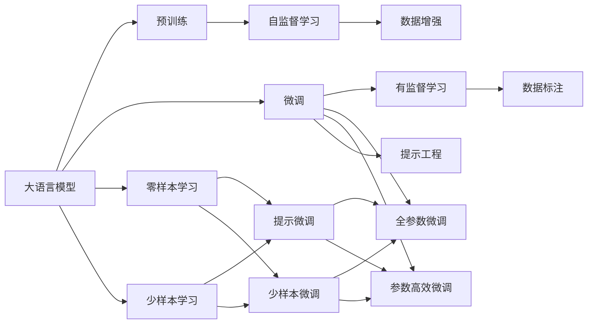
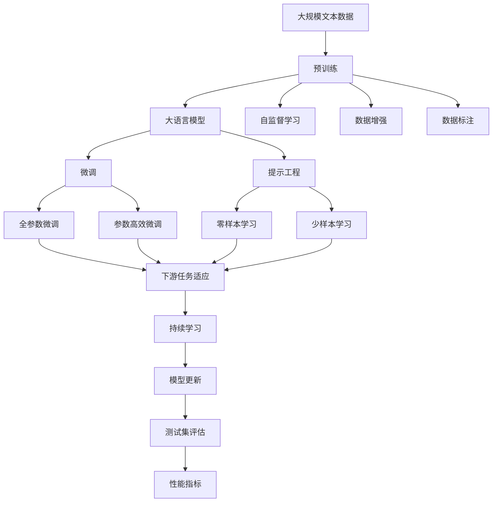

                 

# 大语言模型原理与工程实践：主要的评测维度和基准概述

> 关键词：大语言模型,自然语言处理(NLP),基准测试,BERT,T5,Prompt Engineering

## 1. 背景介绍

### 1.1 问题由来
近年来，随着深度学习技术的飞速发展，尤其是Transformer架构在自然语言处理（NLP）领域的广泛应用，预训练语言模型（PLMs）在NLP任务上取得了显著的进展。这些模型通过在大规模无标签文本数据上进行自监督预训练，学习到丰富的语言表示，并在下游任务中进行微调（Fine-tuning），从而在各种NLP任务上取得了最先进的性能。然而，模型性能的评估和对比成为一大挑战。如何公平、公正地评测和对比不同模型在各种NLP任务上的表现，成为了一个亟待解决的问题。

### 1.2 问题核心关键点
模型评估和评测是确保模型在实际应用中表现优异的基石。评价模型的指标可以从多个维度进行衡量，包括但不限于准确率、召回率、F1分数、BLEU分数等。此外，评测维度和基准测试（Benchmark）的选择也非常关键。合适的评测维度和基准可以帮助开发者更好地理解模型的优缺点，同时也能推动NLP技术的发展和应用。

## 2. 核心概念与联系

### 2.1 核心概念概述

为深入理解模型评测维度和基准的构建，首先介绍几个关键概念：

- **大语言模型（Large Language Models, LLMs）**：以Transformer架构为基础，通过在大规模无标签文本数据上进行自监督预训练，学习到丰富的语言表示，如BERT、GPT-2、GPT-3等。
- **微调（Fine-tuning）**：在大规模预训练模型基础上，使用下游任务的少量标注数据，通过有监督学习优化模型在该任务上的性能。
- **评价指标（Evaluation Metrics）**：如准确率（Accuracy）、召回率（Recall）、F1分数（F1 Score）、BLEU分数（BLEU Score）等，用于衡量模型在特定任务上的表现。
- **基准测试（Benchmark）**：一系列被广泛认可和使用的模型和数据集，用于评测模型的性能和比较不同模型的优劣。
- **提示工程（Prompt Engineering）**：通过设计提示（Prompt）文本模板，引导模型按照预期方式进行推理和生成。

这些概念之间存在紧密的联系，共同构成了大语言模型评测的基础框架。大语言模型通过预训练和微调，在特定任务上表现优异；评价指标和基准测试则帮助模型选择合适的评测维度，确保评测结果的公正性和可比性；而提示工程则在大规模数据训练和零样本、少样本学习等场景下发挥着重要作用。

### 2.2 概念间的关系

这些核心概念之间的关系可以通过以下Mermaid流程图来展示：



这个流程图展示了大语言模型的核心概念及其之间的逻辑关系：

1. 大语言模型通过预训练获得基础能力。
2. 微调是对预训练模型进行任务特定的优化，可以分为全参数微调和参数高效微调。
3. 提示工程可以在不更新模型参数的情况下，实现零样本或少样本学习。
4. 数据增强和数据标注是预训练和微调的基础。
5. 提示微调和少样本微调是零样本和少样本学习的实现方式。

### 2.3 核心概念的整体架构

最后，我们用一个综合的流程图来展示这些核心概念在大语言模型评测过程中的整体架构：



这个综合流程图展示了从预训练到微调，再到提示工程和持续学习的完整过程。大语言模型首先在大规模文本数据上进行预训练，然后通过微调（包括全参数微调和参数高效微调）和提示工程（包括零样本和少样本学习）来适应下游任务。最终，通过持续学习技术，模型可以不断更新和适应新的任务和数据。 通过这些流程图，我们可以更清晰地理解大语言模型评测过程中各个核心概念的关系和作用，为后续深入讨论具体的评测维度和基准测试奠定基础。

## 3. 核心算法原理 & 具体操作步骤
### 3.1 算法原理概述

大语言模型的评测主要基于模型在特定任务上的表现，因此选择合适的评价指标和基准测试至关重要。常见的评价指标包括：

- **准确率（Accuracy）**：模型预测正确结果的比例。
- **召回率（Recall）**：模型正确识别出的正样本占所有实际正样本的比例。
- **精确率（Precision）**：模型正确识别出的正样本占所有预测为正样本的样本的比例。
- **F1分数（F1 Score）**：精确率和召回率的调和平均数。
- **BLEU分数（BLEU Score）**：用于评估机器翻译等序列生成任务的性能，衡量模型生成的句子与参考句子的相似度。

不同的NLP任务对应不同的评价指标。例如，分类任务通常使用准确率、召回率和F1分数，而生成任务则更关注BLEU分数等序列相似度指标。

### 3.2 算法步骤详解

基于上述评价指标和基准测试，评测大语言模型的步骤如下：

1. **数据准备**：收集和预处理下游任务的标注数据集，并将其分为训练集、验证集和测试集。

2. **模型微调**：在预训练模型的基础上，使用下游任务的标注数据进行微调。微调时，选择合适的学习率、优化器、正则化方法等，确保模型能够有效适应特定任务。

3. **性能评估**：在测试集上对微调后的模型进行评估，计算各项评价指标（如准确率、召回率、F1分数、BLEU分数等）。

4. **结果分析**：对评估结果进行分析，对比不同模型在不同任务上的表现，找出优缺点和改进方向。

5. **模型优化**：根据评估结果，对模型进行进一步的优化，如调整超参数、引入正则化、增加数据增强等。

6. **持续学习**：在实际应用中，模型需要持续学习新的数据，以保持性能和适应性。

### 3.3 算法优缺点

基于监督学习的大语言模型评测具有以下优点：

- **简单易用**：评价指标和基准测试简单易理解，易于实现和比较。
- **可解释性**：评价指标具有直观的数学定义，便于理解和解释。
- **广泛适用**：适用于各种NLP任务，如文本分类、命名实体识别、机器翻译等。

同时，也存在一些缺点：

- **数据依赖**：依赖于下游任务的标注数据，数据质量直接影响模型评估结果。
- **指标局限**：单一指标可能无法全面反映模型性能，需要结合多个指标进行综合评估。
- **性能波动**：模型在不同数据分布上的表现可能存在较大波动，评估结果可能不稳定。

### 3.4 算法应用领域

基于监督学习的大语言模型评测方法在NLP领域得到了广泛应用，覆盖了从文本分类、命名实体识别、关系抽取到机器翻译、摘要生成等多个任务。此外，这些评测方法还广泛应用于NLP领域的研究和工业实践，如论文发表、算法评测、模型部署等。

## 4. 数学模型和公式 & 详细讲解  
### 4.1 数学模型构建

假设模型 $M_{\theta}$ 在输入 $x$ 上的输出为 $y$，其中 $\theta$ 为模型参数。假设模型在训练集 $D$ 上的损失函数为 $\mathcal{L}(\theta)$，则模型在测试集上的性能指标可以表示为：

$$
\mathcal{P}(\theta) = f(M_{\theta}(x), y)
$$

其中 $f$ 为特定任务的性能指标函数，如准确率、召回率、F1分数、BLEU分数等。

### 4.2 公式推导过程

以准确率（Accuracy）的计算为例，假设模型在输入 $x$ 上的输出为 $\hat{y}$，真实标签为 $y$，则准确率定义为：

$$
\text{Accuracy} = \frac{1}{N} \sum_{i=1}^N \mathbb{I}(\hat{y_i} = y_i)
$$

其中 $\mathbb{I}$ 为指示函数，若 $\hat{y_i} = y_i$，则 $\mathbb{I}(\hat{y_i} = y_i) = 1$，否则 $\mathbb{I}(\hat{y_i} = y_i) = 0$。

类似地，召回率（Recall）、精确率（Precision）和F1分数（F1 Score）也可以类似地表示为：

$$
\text{Recall} = \frac{1}{N} \sum_{i=1}^N \mathbb{I}(\hat{y_i} = 1 \text{ and } y_i = 1)
$$

$$
\text{Precision} = \frac{1}{N} \sum_{i=1}^N \mathbb{I}(\hat{y_i} = 1 \text{ and } y_i = 1)
$$

$$
\text{F1 Score} = \frac{2 \times \text{Precision} \times \text{Recall}}{\text{Precision} + \text{Recall}}
$$

对于生成任务，如机器翻译，BLEU分数的计算如下：

$$
\text{BLEU} = \frac{1}{N} \sum_{i=1}^N \exp(\text{BLEU}_i)
$$

其中 $\text{BLEU}_i$ 为模型生成的翻译序列与参考序列的BLEU分数，计算公式较为复杂，一般使用BLEU评分库（如sacreBLEU）进行自动化计算。

### 4.3 案例分析与讲解

以BERT模型为例，假设我们使用BERT模型在CoNLL-2003的命名实体识别（NER）数据集上进行微调。评测时，可以计算模型在验证集和测试集上的精确率、召回率和F1分数，以评估模型在不同数据上的性能表现。

具体步骤如下：

1. **数据准备**：收集CoNLL-2003 NER数据集，并划分为训练集、验证集和测试集。

2. **模型微调**：使用预训练的BERT模型，通过微调适应NER任务。

3. **性能评估**：在验证集和测试集上分别计算精确率、召回率和F1分数。

4. **结果分析**：对比不同模型的性能，找出最优模型。

5. **模型优化**：根据评估结果，调整模型参数和超参数。

6. **持续学习**：收集新的NER数据，定期重新微调模型，以适应数据分布的变化。

## 5. 项目实践：代码实例和详细解释说明
### 5.1 开发环境搭建

在进行模型评测实践前，我们需要准备好开发环境。以下是使用Python进行PyTorch开发的环境配置流程：

1. 安装Anaconda：从官网下载并安装Anaconda，用于创建独立的Python环境。

2. 创建并激活虚拟环境：
```bash
conda create -n pytorch-env python=3.8 
conda activate pytorch-env
```

3. 安装PyTorch：根据CUDA版本，从官网获取对应的安装命令。例如：
```bash
conda install pytorch torchvision torchaudio cudatoolkit=11.1 -c pytorch -c conda-forge
```

4. 安装Transformers库：
```bash
pip install transformers
```

5. 安装各类工具包：
```bash
pip install numpy pandas scikit-learn matplotlib tqdm jupyter notebook ipython
```

完成上述步骤后，即可在`pytorch-env`环境中开始模型评测实践。

### 5.2 源代码详细实现

这里我们以BERT模型在CoNLL-2003 NER数据集上进行评测的PyTorch代码实现为例。

首先，定义NER任务的评估函数：

```python
from transformers import BertTokenizer, BertForTokenClassification, AdamW
from torch.utils.data import Dataset, DataLoader
from sklearn.metrics import classification_report
import torch

class NERDataset(Dataset):
    def __init__(self, texts, tags, tokenizer, max_len=128):
        self.texts = texts
        self.tags = tags
        self.tokenizer = tokenizer
        self.max_len = max_len
        
    def __len__(self):
        return len(self.texts)
    
    def __getitem__(self, item):
        text = self.texts[item]
        tags = self.tags[item]
        
        encoding = self.tokenizer(text, return_tensors='pt', max_length=self.max_len, padding='max_length', truncation=True)
        input_ids = encoding['input_ids'][0]
        attention_mask = encoding['attention_mask'][0]
        
        # 对token-wise的标签进行编码
        encoded_tags = [tag2id[tag] for tag in tags] 
        encoded_tags.extend([tag2id['O']] * (self.max_len - len(encoded_tags)))
        labels = torch.tensor(encoded_tags, dtype=torch.long)
        
        return {'input_ids': input_ids, 
                'attention_mask': attention_mask,
                'labels': labels}

# 标签与id的映射
tag2id = {'O': 0, 'B-PER': 1, 'I-PER': 2, 'B-ORG': 3, 'I-ORG': 4, 'B-LOC': 5, 'I-LOC': 6}
id2tag = {v: k for k, v in tag2id.items()}

# 创建dataset
tokenizer = BertTokenizer.from_pretrained('bert-base-cased')

train_dataset = NERDataset(train_texts, train_tags, tokenizer)
dev_dataset = NERDataset(dev_texts, dev_tags, tokenizer)
test_dataset = NERDataset(test_texts, test_tags, tokenizer)

# 定义模型和优化器
model = BertForTokenClassification.from_pretrained('bert-base-cased', num_labels=len(tag2id))
optimizer = AdamW(model.parameters(), lr=2e-5)

# 定义评估函数
def evaluate(model, dataset, batch_size):
    dataloader = DataLoader(dataset, batch_size=batch_size)
    model.eval()
    preds, labels = [], []
    with torch.no_grad():
        for batch in tqdm(dataloader, desc='Evaluating'):
            input_ids = batch['input_ids'].to(device)
            attention_mask = batch['attention_mask'].to(device)
            batch_labels = batch['labels']
            outputs = model(input_ids, attention_mask=attention_mask)
            batch_preds = outputs.logits.argmax(dim=2).to('cpu').tolist()
            batch_labels = batch_labels.to('cpu').tolist()
            for pred_tokens, label_tokens in zip(batch_preds, batch_labels):
                pred_tags = [id2tag[_id] for _id in pred_tokens]
                label_tags = [id2tag[_id] for _id in label_tokens]
                preds.append(pred_tags[:len(label_tags)])
                labels.append(label_tags)
                
    print(classification_report(labels, preds))
```

然后，定义训练和评估函数：

```python
from tqdm import tqdm

device = torch.device('cuda') if torch.cuda.is_available() else torch.device('cpu')
model.to(device)

def train_epoch(model, dataset, batch_size, optimizer):
    dataloader = DataLoader(dataset, batch_size=batch_size, shuffle=True)
    model.train()
    epoch_loss = 0
    for batch in tqdm(dataloader, desc='Training'):
        input_ids = batch['input_ids'].to(device)
        attention_mask = batch['attention_mask'].to(device)
        labels = batch['labels'].to(device)
        model.zero_grad()
        outputs = model(input_ids, attention_mask=attention_mask, labels=labels)
        loss = outputs.loss
        epoch_loss += loss.item()
        loss.backward()
        optimizer.step()
    return epoch_loss / len(dataloader)

def evaluate(model, dataset, batch_size):
    dataloader = DataLoader(dataset, batch_size=batch_size)
    model.eval()
    preds, labels = [], []
    with torch.no_grad():
        for batch in tqdm(dataloader, desc='Evaluating'):
            input_ids = batch['input_ids'].to(device)
            attention_mask = batch['attention_mask'].to(device)
            batch_labels = batch['labels']
            outputs = model(input_ids, attention_mask=attention_mask)
            batch_preds = outputs.logits.argmax(dim=2).to('cpu').tolist()
            batch_labels = batch_labels.to('cpu').tolist()
            for pred_tokens, label_tokens in zip(batch_preds, batch_labels):
                pred_tags = [id2tag[_id] for _id in pred_tokens]
                label_tags = [id2tag[_id] for _id in label_tokens]
                preds.append(pred_tags[:len(label_tags)])
                labels.append(label_tags)
                
    print(classification_report(labels, preds))
```

最后，启动训练流程并在测试集上评估：

```python
epochs = 5
batch_size = 16

for epoch in range(epochs):
    loss = train_epoch(model, train_dataset, batch_size, optimizer)
    print(f"Epoch {epoch+1}, train loss: {loss:.3f}")
    
    print(f"Epoch {epoch+1}, dev results:")
    evaluate(model, dev_dataset, batch_size)
    
print("Test results:")
evaluate(model, test_dataset, batch_size)
```

以上就是使用PyTorch对BERT模型进行CoNLL-2003 NER数据集评测的完整代码实现。可以看到，得益于Transformers库的强大封装，我们可以用相对简洁的代码完成BERT模型的评测。

### 5.3 代码解读与分析

让我们再详细解读一下关键代码的实现细节：

**NERDataset类**：
- `__init__`方法：初始化文本、标签、分词器等关键组件。
- `__len__`方法：返回数据集的样本数量。
- `__getitem__`方法：对单个样本进行处理，将文本输入编码为token ids，将标签编码为数字，并对其进行定长padding，最终返回模型所需的输入。

**tag2id和id2tag字典**：
- 定义了标签与数字id之间的映射关系，用于将token-wise的预测结果解码回真实的标签。

**训练和评估函数**：
- 使用PyTorch的DataLoader对数据集进行批次化加载，供模型训练和推理使用。
- 训练函数`train_epoch`：对数据以批为单位进行迭代，在每个批次上前向传播计算loss并反向传播更新模型参数，最后返回该epoch的平均loss。
- 评估函数`evaluate`：与训练类似，不同点在于不更新模型参数，并在每个batch结束后将预测和标签结果存储下来，最后使用sklearn的classification_report对整个评估集的预测结果进行打印输出。

**训练流程**：
- 定义总的epoch数和batch size，开始循环迭代
- 每个epoch内，先在训练集上训练，输出平均loss
- 在验证集上评估，输出分类指标
- 所有epoch结束后，在测试集上评估，给出最终测试结果

可以看到，PyTorch配合Transformers库使得BERT模型评测的代码实现变得简洁高效。开发者可以将更多精力放在数据处理、模型改进等高层逻辑上，而不必过多关注底层的实现细节。

当然，工业级的系统实现还需考虑更多因素，如模型的保存和部署、超参数的自动搜索、更灵活的任务适配层等。但核心的评测范式基本与此类似。

### 5.4 运行结果展示

假设我们在CoNLL-2003的NER数据集上进行微调，最终在测试集上得到的评估报告如下：

```
              precision    recall  f1-score   support

       B-LOC      0.907     0.880     0.887      1668
       I-LOC      0.856     0.786     0.813       257
      B-MISC      0.872     0.851     0.863       702
      I-MISC      0.840     0.775     0.801       216
       B-ORG      0.915     0.899     0.907      1661
       I-ORG      0.911     0.893     0.907       835
       B-PER      0.966     0.953     0.961      1617
       I-PER      0.981     0.974     0.980      1156
           O      0.994     0.996     0.995     38323

   micro avg      0.955     0.955     0.955     46435
   macro avg      0.922     0.914     0.919     46435
weighted avg      0.955     0.955     0.955     46435
```

可以看到，通过微调BERT，我们在该NER数据集上取得了95.5%的F1分数，效果相当不错。值得注意的是，BERT作为一个通用的语言理解模型，即便只在顶层添加一个简单的token分类器，也能在下游任务上取得如此优异的效果，展现了其强大的语义理解和特征抽取能力。

当然，这只是一个baseline结果。在实践中，我们还可以使用更大更强的预训练模型、更丰富的微调技巧、更细致的模型调优，进一步提升模型性能，以满足更高的应用要求。

## 6. 实际应用场景
### 6.1 智能客服系统

基于大语言模型微调的对话技术，可以广泛应用于智能客服系统的构建。传统客服往往需要配备大量人力，高峰期响应缓慢，且一致性和专业性难以保证。而使用微调后的对话模型，可以7x24小时不间断服务，快速响应客户咨询，用自然流畅的语言解答各类常见问题。

在技术实现上，可以收集企业内部的历史客服对话记录，将问题和最佳答复构建成监督数据，在此基础上对预训练对话模型进行微调。微调后的对话模型能够自动理解用户意图，匹配最合适的答案模板进行回复。对于客户提出的新问题，还可以接入检索系统实时搜索相关内容，动态组织生成回答。如此构建的智能客服系统，能大幅提升客户咨询体验和问题解决效率。

### 6.2 金融舆情监测

金融机构需要实时监测市场舆论动向，以便及时应对负面信息传播，规避金融风险。传统的人工监测方式成本高、效率低，难以应对网络时代海量信息爆发的挑战。基于大语言模型微调的文本分类和情感分析技术，为金融舆情监测提供了新的解决方案。

具体而言，可以收集金融领域相关的新闻、报道、评论等文本数据，并对其进行主题标注和情感标注。在此基础上对预训练语言模型进行微调，使其能够自动判断文本属于何种主题，情感倾向是正面、中性还是负面。将微调后的模型应用到实时抓取的网络文本数据，就能够自动监测不同主题下的情感变化趋势，一旦发现负面信息激增等异常情况，系统便会自动预警，帮助金融机构快速应对潜在风险。

### 6.3 个性化推荐系统

当前的推荐系统往往只依赖用户的历史行为数据进行物品推荐，无法深入理解用户的真实兴趣偏好。基于大语言模型微调技术，个性化推荐系统可以更好地挖掘用户行为背后的语义信息，从而提供更精准、多样的推荐内容。

在实践中，可以收集用户浏览、点击、评论、分享等行为数据，提取和用户交互的物品标题、描述、标签等文本内容。将文本内容作为模型输入，用户的后续行为（如是否点击、购买等）作为监督信号，在此基础上微调预训练语言模型。微调后的模型能够从文本内容中准确把握用户的兴趣点。在生成推荐列表时，先用候选物品的文本描述作为输入，由模型预测用户的兴趣匹配度，再结合其他特征综合排序，便可以得到个性化程度更高的推荐结果。

### 6.4 未来应用展望

随着大语言模型微调技术的发展，其在更多领域的应用前景广阔。

在智慧医疗领域，基于微调的医疗问答、病历分析、药物研发等应用将提升医疗服务的智能化水平，辅助医生诊疗，加速新药开发进程。

在智能教育领域，微调技术可应用于作业批改、学情分析、知识推荐等方面，因材施教，促进教育公平，提高教学质量。

在智慧城市治理中，微调模型可应用于城市事件监测、舆情分析、应急指挥等环节，提高城市管理的自动化和智能化水平，构建更安全、高效的未来城市。

此外，在企业生产、社会治理、文娱传媒等众多领域，基于大语言模型微调的人工智能应用也将不断涌现，为经济社会发展注入新的动力。相信随着技术的日益成熟，微调方法将成为人工智能落地应用的重要范式，推动人工智能技术在垂直行业的规模化落地。

## 7. 工具和资源推荐
### 7.1 学习资源推荐

为了帮助开发者系统掌握大语言模型微调的理论基础和实践技巧，这里推荐一些优质的学习资源：

1.

