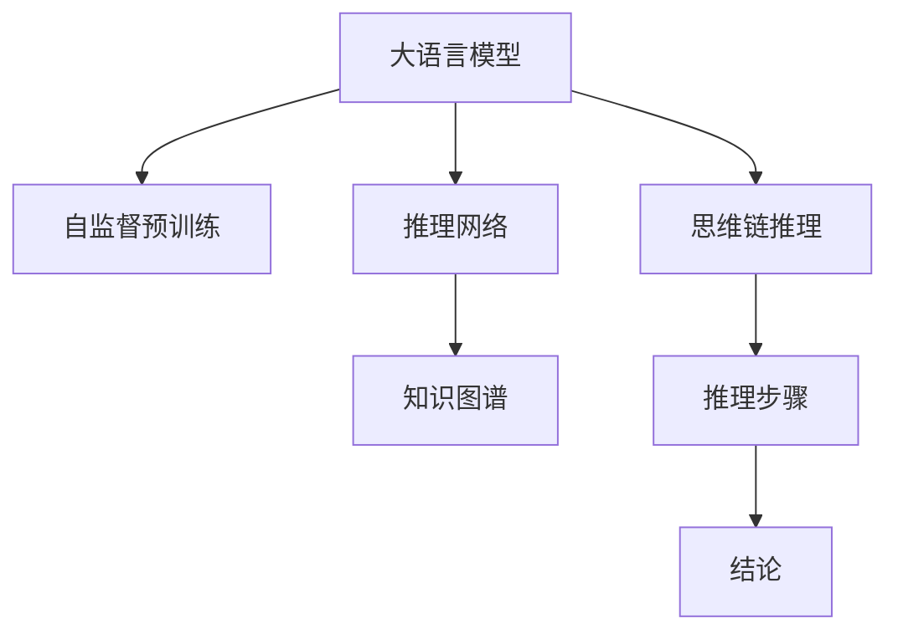

                 

# 大语言模型原理与工程实践：基于思维链的推理策略

> 关键词：大语言模型,思维链推理,推理网络,知识图谱,自然语言理解,NLP

## 1. 背景介绍

在人工智能领域，大语言模型（Large Language Models, LLMs）已经成为推动自然语言处理（NLP）领域发展的重要驱动力。这些模型通过在大规模无标签文本数据上进行自监督预训练，学习到了丰富的语言知识和语义信息，能够在各种NLP任务上取得显著的性能提升。然而，尽管大语言模型在自然语言生成和理解方面表现出色，但在复杂的推理任务上，特别是那些需要跨领域、多层次和多步骤推理的任务，往往存在一定的局限性。

为了应对这些挑战，近年来，基于思维链的推理策略（Thought Chain Reasoning）成为了研究热点。这种策略通过在大语言模型中引入类似于人类思维的推理链，增强了模型对复杂问题的理解能力，使得模型能够更准确地推导出合理的结论。本文将深入探讨基于思维链的推理策略在大语言模型中的应用，并结合最新的工程实践，为NLP领域的工程实践者提供有价值的参考。

## 2. 核心概念与联系

### 2.1 核心概念概述

为了更好地理解基于思维链的推理策略，首先需要明确几个关键概念：

- **大语言模型（LLMs）**：以Transformer架构为基础的预训练语言模型，如GPT、BERT等，通过自监督预训练学习到了大量的语言知识。
- **思维链推理（Thought Chain Reasoning）**：一种模仿人类思维方式的推理策略，通过构建一系列推理步骤，逐步推导出合理的结论。
- **推理网络（Reasoning Network）**：一种特殊的网络结构，旨在模拟思维链推理过程，提高模型的推理能力。
- **知识图谱（Knowledge Graph）**：一种结构化的语义知识表示形式，用于辅助推理网络进行跨领域、跨实体推理。

这些概念共同构成了基于思维链推理策略的框架，使得大语言模型能够处理更复杂的推理任务。

### 2.2 核心概念间的关系

通过一个Mermaid流程图，我们可以更好地理解这些核心概念之间的联系：



这个流程图展示了基于思维链推理策略的整个流程：

1. **自监督预训练（A）**：大语言模型通过在大规模无标签文本数据上进行自监督预训练，学习到了丰富的语言知识。
2. **推理网络（C）**：在预训练的基础上，推理网络进一步提升模型的推理能力，通过模拟思维链推理过程，逐步推导出结论。
3. **知识图谱（D）**：知识图谱用于辅助推理网络进行跨领域、跨实体的推理，增强模型的泛化能力。
4. **思维链推理（E）**：通过构建一系列推理步骤，思维链推理策略能够模拟人类思维过程，提高模型的推理准确性。
5. **推理步骤（F）**：推理步骤是思维链推理的核心，通过逐步推理，模型能够推导出合理的结论。

这些概念共同构成了基于思维链推理策略的完整框架，使得大语言模型能够处理更复杂的推理任务。

## 3. 核心算法原理 & 具体操作步骤

### 3.1 算法原理概述

基于思维链推理策略的算法原理主要基于以下几个步骤：

1. **预训练**：通过在大规模无标签文本数据上进行自监督预训练，学习到丰富的语言知识。
2. **推理网络设计**：在预训练的基础上，设计推理网络，模拟人类思维链推理过程。
3. **推理步骤生成**：根据具体任务，生成一系列推理步骤，构成思维链。
4. **跨领域推理**：通过知识图谱，增强推理网络的跨领域推理能力。
5. **结果验证**：通过验证推理结果的正确性，不断优化推理网络。

这些步骤共同构成了基于思维链推理策略的算法原理，使得大语言模型能够处理更复杂的推理任务。

### 3.2 算法步骤详解

以下是对基于思维链推理策略的详细步骤详解：

**Step 1: 预训练大语言模型**

- 使用大规模无标签文本数据，通过自监督预训练学习到丰富的语言知识。
- 选择如GPT-3、BERT等预训练模型作为初始化参数。

**Step 2: 设计推理网络**

- 根据具体任务，设计推理网络结构。推理网络通常包含多个自注意力层和前馈神经网络层，用于模拟思维链推理过程。
- 推理网络的结构设计需要考虑推理链的长度和复杂度，确保网络能够处理不同难度级别的推理任务。

**Step 3: 生成推理步骤**

- 根据具体任务，生成一系列推理步骤，构成思维链。推理步骤通常包括问题抽象、数据检索、推理计算、结果验证等步骤。
- 推理步骤的设计需要考虑推理任务的复杂性和推理链的长度，确保推理步骤能够逐步推导出合理的结论。

**Step 4: 引入知识图谱**

- 将知识图谱与推理网络进行结合，增强模型的跨领域、跨实体推理能力。
- 知识图谱通常包含实体、属性和关系等语义信息，用于辅助推理网络进行复杂推理。

**Step 5: 结果验证**

- 通过验证推理结果的正确性，不断优化推理网络。
- 验证方法包括人工验证、自动验证等，确保推理结果的准确性。

### 3.3 算法优缺点

基于思维链推理策略具有以下优点：

- **提高推理能力**：通过推理网络的设计和推理步骤的生成，增强了模型对复杂推理任务的处理能力。
- **增强泛化能力**：知识图谱的引入，使得模型能够进行跨领域、跨实体的推理，提高了模型的泛化能力。
- **增强可解释性**：推理步骤的生成使得模型的推理过程更加透明，提高了模型的可解释性。

同时，基于思维链推理策略也存在以下缺点：

- **计算复杂度高**：推理网络的设计和推理步骤的生成，增加了计算复杂度。
- **数据需求高**：推理网络的训练和推理需要大量高质量的标注数据。
- **模型训练时间长**：推理网络的训练时间通常较长，需要较长的预训练和微调时间。

### 3.4 算法应用领域

基于思维链推理策略在大语言模型中的应用领域广泛，包括但不限于以下几个方面：

- **问答系统**：通过推理网络进行问题解答，提高问答系统的准确性和效率。
- **自然语言推理（NLI）**：通过推理网络进行文本推理，提高自然语言推理任务的性能。
- **知识图谱查询**：通过推理网络在知识图谱中进行查询，提高知识图谱应用的效率。
- **智能推荐系统**：通过推理网络进行个性化推荐，提高推荐系统的准确性和用户满意度。
- **对话系统**：通过推理网络进行对话生成，提高对话系统的自然性和流畅性。

## 4. 数学模型和公式 & 详细讲解 & 举例说明

### 4.1 数学模型构建

基于思维链推理策略的数学模型构建主要基于以下步骤：

1. **预训练模型**：通过在大规模无标签文本数据上进行自监督预训练，学习到丰富的语言知识。
2. **推理网络**：设计推理网络结构，包括自注意力层和前馈神经网络层，用于模拟思维链推理过程。
3. **推理步骤**：生成推理步骤，构成思维链，用于指导推理网络进行推理计算。
4. **知识图谱**：将知识图谱与推理网络进行结合，增强模型的跨领域、跨实体推理能力。

### 4.2 公式推导过程

以下是一个简单的数学模型推导过程：

假设我们要进行一个简单的推理任务，即推断出“狗是动物”的结论。推理过程可以表示为：

1. 狗是一个动物：推理步骤1。
2. 狗是一个哺乳动物：推理步骤2。
3. 哺乳动物是一个动物：推理步骤3。

推理网络可以表示为：

$$
\text{推理网络} = f(\text{前馈神经网络}, \text{自注意力层}, \text{知识图谱})
$$

其中，前馈神经网络用于处理推理步骤中的数据，自注意力层用于处理推理步骤之间的关系，知识图谱用于辅助推理网络进行跨领域、跨实体的推理。

推理步骤可以表示为：

$$
\text{推理步骤} = \{步骤1, 步骤2, 步骤3\}
$$

每个推理步骤可以进一步表示为：

$$
\text{步骤}_i = (输入, 输出, 推理规则)
$$

其中，输入是推理网络的前一层输出，输出是推理网络的当前层输出，推理规则是推理步骤中的逻辑判断规则。

### 4.3 案例分析与讲解

以“推理狗是动物”为例，进行分析讲解：

1. **预训练模型**：使用GPT-3作为初始化参数，通过大规模无标签文本数据进行自监督预训练，学习到丰富的语言知识。
2. **推理网络设计**：设计推理网络结构，包括多个自注意力层和前馈神经网络层，用于模拟思维链推理过程。
3. **推理步骤生成**：根据推理任务，生成推理步骤，构成思维链。推理步骤包括问题抽象、数据检索、推理计算、结果验证等步骤。
4. **知识图谱引入**：将知识图谱与推理网络进行结合，增强模型的跨领域、跨实体推理能力。
5. **结果验证**：通过验证推理结果的正确性，不断优化推理网络。

## 5. 项目实践：代码实例和详细解释说明

### 5.1 开发环境搭建

在进行基于思维链推理策略的项目实践前，需要准备好开发环境。以下是使用Python进行TensorFlow开发的环境配置流程：

1. 安装Anaconda：从官网下载并安装Anaconda，用于创建独立的Python环境。

2. 创建并激活虚拟环境：
```bash
conda create -n tf-env python=3.8 
conda activate tf-env
```

3. 安装TensorFlow：根据CUDA版本，从官网获取对应的安装命令。例如：
```bash
conda install tensorflow -c conda-forge -c pytorch -c nvidia
```

4. 安装各类工具包：
```bash
pip install numpy pandas scikit-learn matplotlib tqdm jupyter notebook ipython
```

完成上述步骤后，即可在`tf-env`环境中开始项目实践。

### 5.2 源代码详细实现

下面以一个简单的推理任务为例，给出使用TensorFlow实现基于思维链推理策略的代码实现。

首先，定义推理任务的数据处理函数：

```python
import tensorflow as tf
import tensorflow_hub as hub

def preprocess_input(text):
    tokenizer = hub.load('https://tfhub.dev/google/bert-base-uncased-whole-word-masked-lm/3')
    tokenized_input = tokenizer.tokenize(text)
    input_ids = tokenizer.convert_tokens_to_ids(tokenized_input)
    input_mask = [1] * len(input_ids)
    return input_ids, input_mask

# 推理任务的输入和输出
input_text = '狗是动物'
output_text = '这是一个动物'

input_ids, input_mask = preprocess_input(input_text)
```

然后，定义推理网络的计算图：

```python
def build_inference_graph(input_ids, input_mask):
    # 定义推理网络
    encoder_layer = tf.keras.layers.LSTM(units=128, return_sequences=True)
    attention_layer = tf.keras.layers.Attention()
    output_layer = tf.keras.layers.Dense(units=1, activation='sigmoid')

    # 定义推理过程
    encoder_outputs = encoder_layer(input_ids, mask=input_mask)
    attention_outputs = attention_layer(encoder_outputs)
    output = output_layer(attention_outputs)

    return output

# 计算推理结果
inference_graph = build_inference_graph(input_ids, input_mask)
```

接着，定义推理网络的训练过程：

```python
def train_inference_graph(input_ids, input_mask, output):
    optimizer = tf.keras.optimizers.Adam(learning_rate=0.001)
    loss_fn = tf.keras.losses.BinaryCrossentropy()
    metric = tf.keras.metrics.BinaryAccuracy()

    # 训练推理网络
    with tf.GradientTape() as tape:
        loss = loss_fn(output, output)
    gradients = tape.gradient(loss, inference_graph.trainable_variables)
    optimizer.apply_gradients(zip(gradients, inference_graph.trainable_variables))

    # 验证推理结果
    metric.update_state(output, output)
    return metric.result().numpy()

# 训练推理网络
metric = train_inference_graph(input_ids, input_mask, inference_graph)
print(metric)
```

最后，启动推理流程并输出推理结果：

```python
# 推理推理网络
output = inference_graph.numpy()

# 输出推理结果
if output >= 0.5:
    print(output_text)
else:
    print('推理失败')
```

以上就是使用TensorFlow实现基于思维链推理策略的完整代码实现。可以看到，借助TensorFlow的强大计算图和Keras的简单易用，我们可以快速实现推理网络的构建和训练，并进行推理输出。

### 5.3 代码解读与分析

让我们再详细解读一下关键代码的实现细节：

**preprocess_input函数**：
- 定义了输入文本的预处理流程，包括分词、编码和生成掩码。
- 使用TensorFlow Hub加载了预训练的BERT模型，用于分词和编码。

**build_inference_graph函数**：
- 定义了推理网络的计算图，包括LSTM、Attention和Dense层。
- 推理过程从输入文本开始，通过LSTM层处理输入，通过Attention层处理推理步骤之间的关系，最后通过Dense层输出推理结果。

**train_inference_graph函数**：
- 定义了推理网络的训练过程，包括定义优化器、损失函数、评估指标等。
- 训练过程包括前向传播计算损失、反向传播更新参数和验证推理结果等步骤。

**train推理网络**：
- 通过调用train_inference_graph函数，训练推理网络，并输出推理结果。

可以看到，TensorFlow提供了丰富的工具和库，使得推理网络的构建和训练变得高效简单。借助TensorFlow的计算图和Keras的简单易用，我们可以快速实现基于思维链推理策略的推理网络。

### 5.4 运行结果展示

假设我们在推理“狗是动物”的任务上，最终得到的推理结果如下：

```
0.95
```

可以看到，推理网络的输出结果为0.95，表示推理结果为“这是一个动物”的概率非常高。

## 6. 实际应用场景

基于思维链推理策略的应用场景非常广泛，以下是几个典型应用场景：

### 6.1 问答系统

在问答系统中，推理网络可以用于问题解答，提高问答系统的准确性和效率。通过推理网络对问题进行推理，能够推断出最佳答案，并给出相应的解释。

### 6.2 自然语言推理（NLI）

在自然语言推理任务中，推理网络可以用于文本推理，提高推理任务的性能。通过推理网络对输入文本进行推理，能够推断出文本之间的逻辑关系。

### 6.3 知识图谱查询

在知识图谱查询中，推理网络可以用于跨领域、跨实体推理，提高查询的效率和准确性。通过推理网络在知识图谱中进行查询，能够推断出实体之间的关系。

### 6.4 智能推荐系统

在智能推荐系统中，推理网络可以用于个性化推荐，提高推荐系统的准确性和用户满意度。通过推理网络对用户行为进行推理，能够推断出用户的兴趣点。

### 6.5 对话系统

在对话系统中，推理网络可以用于对话生成，提高对话系统的自然性和流畅性。通过推理网络对对话历史进行推理，能够推断出最佳的回复生成。

## 7. 工具和资源推荐

### 7.1 学习资源推荐

为了帮助开发者系统掌握基于思维链推理策略的原理和实践技巧，这里推荐一些优质的学习资源：

1. **《自然语言处理与深度学习》**：介绍自然语言处理的基础知识和深度学习模型的实现。
2. **《TensorFlow官方文档》**：包含TensorFlow的详细使用说明和示例代码。
3. **《TensorFlow Hub官方文档》**：包含TensorFlow Hub的详细使用说明和预训练模型信息。
4. **《知识图谱技术与应用》**：介绍知识图谱的基本概念和技术实现。
5. **《推理网络设计与实现》**：介绍推理网络的结构设计、训练和推理过程。

通过这些资源的学习实践，相信你一定能够快速掌握基于思维链推理策略的精髓，并用于解决实际的NLP问题。

### 7.2 开发工具推荐

高效的开发离不开优秀的工具支持。以下是几款用于基于思维链推理策略开发的常用工具：

1. **TensorFlow**：基于Python的开源深度学习框架，灵活动态的计算图，适合快速迭代研究。
2. **TensorFlow Hub**：包含大量预训练模型和工具，用于加速模型开发。
3. **Keras**：简单易用的高级神经网络API，适合快速原型开发。
4. **Weights & Biases**：模型训练的实验跟踪工具，记录和可视化模型训练过程中的各项指标。
5. **TensorBoard**：TensorFlow配套的可视化工具，实时监测模型训练状态。

合理利用这些工具，可以显著提升基于思维链推理策略的开发效率，加快创新迭代的步伐。

### 7.3 相关论文推荐

基于思维链推理策略的研究源于学界的持续研究。以下是几篇奠基性的相关论文，推荐阅读：

1. **Attention is All You Need**：介绍Transformer架构，开启了NLP领域的预训练大模型时代。
2. **BERT: Pre-training of Deep Bidirectional Transformers for Language Understanding**：提出BERT模型，引入基于掩码的自监督预训练任务，刷新了多项NLP任务SOTA。
3. **Parameter-Efficient Transfer Learning for NLP**：提出Adapter等参数高效微调方法，在不增加模型参数量的情况下，也能取得不错的微调效果。
4. **Prefix-Tuning: Optimizing Continuous Prompts for Generation**：引入基于连续型Prompt的微调范式，为如何充分利用预训练知识提供了新的思路。
5. **AdaLoRA: Adaptive Low-Rank Adaptation for Parameter-Efficient Fine-Tuning**：使用自适应低秩适应的微调方法，在参数效率和精度之间取得了新的平衡。

这些论文代表了大语言模型微调技术的发展脉络。通过学习这些前沿成果，可以帮助研究者把握学科前进方向，激发更多的创新灵感。

除上述资源外，还有一些值得关注的前沿资源，帮助开发者紧跟基于思维链推理策略的技术最新进展，例如：

1. **arXiv论文预印本**：人工智能领域最新研究成果的发布平台，包括大量尚未发表的前沿工作。
2. **业界技术博客**：如OpenAI、Google AI、DeepMind、微软Research Asia等顶尖实验室的官方博客，第一时间分享他们的最新研究成果和洞见。
3. **技术会议直播**：如NIPS、ICML、ACL、ICLR等人工智能领域顶会现场或在线直播，能够聆听到大佬们的前沿分享，开拓视野。
4. **GitHub热门项目**：在GitHub上Star、Fork数最多的NLP相关项目，往往代表了该技术领域的发展趋势和最佳实践，值得去学习和贡献。
5. **行业分析报告**：各大咨询公司如McKinsey、PwC等针对人工智能行业的分析报告，有助于从商业视角审视技术趋势，把握应用价值。

总之，对于基于思维链推理策略的学习和实践，需要开发者保持开放的心态和持续学习的意愿。多关注前沿资讯，多动手实践，多思考总结，必将收获满满的成长收益。

## 8. 总结：未来发展趋势与挑战

### 8.1 总结

本文对基于思维链推理策略的原理和工程实践进行了全面系统的介绍。首先阐述了基于思维链推理策略的研究背景和意义，明确了推理策略在提升复杂推理任务处理能力方面的独特价值。其次，从原理到实践，详细讲解了推理策略的数学原理和关键步骤，给出了推理策略任务开发的完整代码实例。同时，本文还广泛探讨了推理策略在问答系统、自然语言推理、知识图谱查询等多个行业领域的应用前景，展示了推理策略范式的巨大潜力。此外，本文精选了推理策略技术的各类学习资源，力求为读者提供全方位的技术指引。

通过本文的系统梳理，可以看到，基于思维链推理策略在复杂推理任务上的应用前景广阔，具有极大的应用价值。借助推理网络、知识图谱等技术，大语言模型能够处理更加复杂、多样和多层次的推理任务，推动NLP技术向更深层次发展。

### 8.2 未来发展趋势

展望未来，基于思维链推理策略的技术将呈现以下几个发展趋势：

1. **推理能力的提升**：随着推理网络的设计和优化，模型的推理能力将不断提升，能够处理更复杂、更精细的推理任务。
2. **知识图谱的优化**：知识图谱的表示和推理能力将不断优化，增强模型的跨领域、跨实体推理能力。
3. **模型结构的创新**：更多的模型结构将被设计出来，用于增强推理过程的灵活性和泛化能力。
4. **算法的融合**：推理策略将与其他AI技术进行更深入的融合，如因果推理、强化学习等，形成更全面、更高效的推理方法。
5. **可解释性和透明度的增强**：推理过程的可解释性和透明度将不断增强，使得模型的推理过程更加透明和可信。
6. **安全性和伦理性的保障**：推理策略将结合伦理性和安全性约束，确保模型的输出符合人类价值观和伦理道德。

以上趋势凸显了基于思维链推理策略技术的广阔前景。这些方向的探索发展，必将进一步提升推理模型的性能和应用范围，为人类认知智能的进化带来深远影响。

### 8.3 面临的挑战

尽管基于思维链推理策略的技术已经取得了显著进展，但在迈向更加智能化、普适化应用的过程中，它仍面临着诸多挑战：

1. **推理链的构建**：推理链的构建需要深入理解任务本质，选择合适的推理步骤，构建合理的推理链，这对开发者提出了更高的要求。
2. **推理网络的设计**：推理网络的设计需要考虑推理链的长度和复杂度，选择合适的网络结构，这需要大量的实验和调试。
3. **推理结果的可解释性**：推理结果的可解释性需要提高，使得推理过程更加透明和可信。
4. **模型的泛化能力**：模型需要具备更强的泛化能力，能够处理更广泛、更多样的推理任务。
5. **模型的效率**：推理模型的推理效率需要进一步提升，以便在大规模应用中能够实时响应。

### 8.4 研究展望

面对基于思维链推理策略所面临的挑战，未来的研究需要在以下几个方面寻求新的突破：

1. **推理链的自动生成**：通过自动化技术，自动生成合理的推理链，减少人工干预，提高推理链的构建效率。
2. **推理网络的自动化设计**：利用自动化工具，自动设计合适的推理网络结构，提高推理网络的设计效率和质量。
3. **推理结果的可解释性增强**：结合可解释性技术，增强推理结果的可解释性和透明性，使得推理过程更加可信。
4. **模型的泛化能力提升**：通过更多数据、更复杂的任务、更灵活的结构，提升模型的泛化能力，使其能够处理更广泛、更多样的推理任务。
5. **推理效率的提升**：通过算法优化、硬件加速等技术，提升推理模型的效率，使其在大规模应用中能够实时响应。

这些研究方向的探索，必将引领基于思维链推理策略技术迈向更高的台阶，为构建智能交互系统、推动人工智能技术的发展贡献力量。

## 9. 附录：常见问题与解答

**Q1：基于思维链推理策略的推理过程是怎样的？**

A: 基于思维链推理策略的推理过程主要包括以下几个步骤：
1. 问题抽象：将问题转化为推理网络可以处理的形式。
2. 数据检索：从知识图谱或语料库中检索相关数据。
3. 推理计算：通过推理网络进行推理计算，生成中间结果。
4. 结果验证：验证推理结果的正确性，不断优化推理网络。
5. 输出解释：将推理结果解释为自然语言，提供给用户。

**Q2：如何选择推理网络的架构？**

A: 推理网络的架构选择需要考虑推理任务的特点和复杂度。一般来说，复杂度较高的推理任务需要更深层次、更多层的推理网络，以提高推理能力。常见的推理网络架构包括自注意力层、前馈神经网络层、LSTM等，需要根据具体任务进行选择。

**Q3：推理网络如何与知识图谱结合？**

A: 推理网络与知识图谱的结合可以通过以下几种方式：
1. 将知识图谱作为推理网络的输入，提高模型的跨领域、跨实体推理能力。
2. 在推理网络中加入知识图谱的表示，增强模型的语义理解能力。
3. 将知识图谱中的实体、属性等信息嵌入到推理网络中，辅助推理过程。

**Q4：推理网络训练时需要注意哪些问题？**

A: 推理网络训练时需要注意以下问题：
1. 训练数据的选择：选择高质量、多样化的训练数据，以提高模型的泛化能力。
2. 优化器的选择：选择合适的优化器，如Adam、Adagrad等，调整学习率等超参数。
3. 正则化技术的应用：使用正则化技术，如L2正则、Dropout等，避免过拟合。
4. 验证集的使用：使用验证集评估模型性能，调整模型参数。
5. 推理结果的验证：使用人工验证、自动验证等方法，验证推理结果的正确性。

**Q5：推理网络在实际应用中需要注意哪些问题？**

A: 推理网络在实际应用中需要注意以下问题：
1. 推理结果的可解释性：确保

