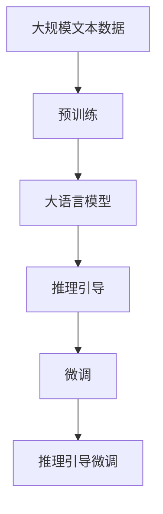
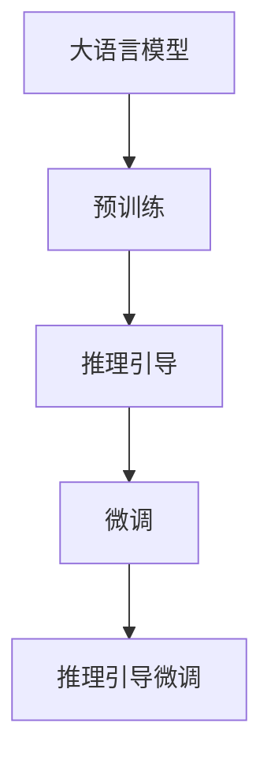
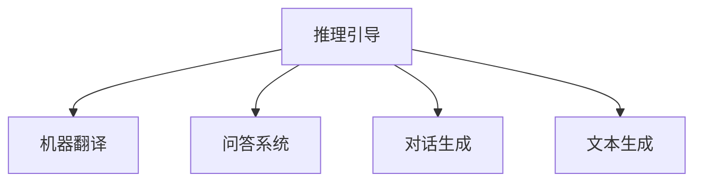
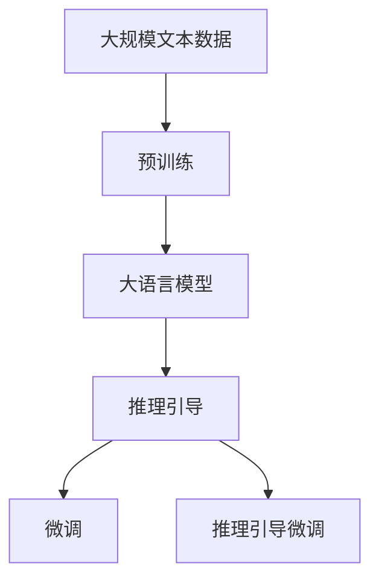

                 

# 大语言模型原理与工程实践：推理引导

> 关键词：大语言模型,推理引导,模型推理,计算图,Transformer,BERT,零样本学习,非监督学习

## 1. 背景介绍

### 1.1 问题由来

大语言模型（Large Language Models, LLMs）在自然语言处理（Natural Language Processing, NLP）领域取得了突破性进展，尤其是在预训练-微调（Pre-training & Fine-tuning）范式下，基于大规模语料进行预训练，进而通过少量标注数据在下游任务上进行微调，显著提升了模型性能。这些模型如GPT、BERT等，在问答、翻译、文本生成等任务上取得了优异表现。

然而，这些通用大模型的性能很大程度上依赖于高质量的标注数据，这对于许多特定领域的应用而言，标注数据的获取可能存在困难。此外，随着模型规模的不断增大，对计算资源的需求也随之增加。这些问题在一定程度上限制了预训练-微调模型的实际应用范围。

为了解决这些问题，近年来，研究者们提出了推理引导（Reasoning Guided）的训练范式，即在大语言模型的预训练和微调过程中引入推理引导机制，通过引导模型生成和推理，来提升模型的泛化能力和效率，同时降低对标注数据的依赖。

### 1.2 问题核心关键点

推理引导的核心思想在于利用已有的大规模语料，通过自监督学习任务和推理引导机制，提升模型的泛化能力。具体而言，推理引导模型会在输入文本中引入推理引导信息，如问题、目标、限制等，引导模型推理生成合理的输出。这一过程既可以在大规模无标签数据上进行预训练，也可以在下游任务中通过微调进行优化。

推理引导模型具有以下特点：

- **泛化能力**：推理引导模型能够更好地处理长尾数据和未见过的新数据，具有较强的泛化能力。
- **计算效率**：通过引入推理引导机制，模型可以更高效地利用预训练数据，减少计算资源的消耗。
- **零样本学习**：在无标注数据的情况下，推理引导模型仍能通过合理的推理引导信息，生成合理的输出。

推理引导技术广泛应用于机器翻译、问答系统、对话生成等NLP任务中，为这些任务的自动化处理提供了新的思路。

### 1.3 问题研究意义

推理引导技术的引入，对于拓展大语言模型的应用范围，提升下游任务的性能，加速NLP技术的产业化进程，具有重要意义：

1. **降低应用开发成本**：推理引导模型可以显著减少标注数据的需求，降低数据标注和模型训练的成本。
2. **提升模型效果**：通过推理引导机制，模型能够更好地适应特定任务，在应用场景中取得更优表现。
3. **加速开发进度**：推理引导模型通过预训练-推理引导的训练方式，能够更快地完成任务适配，缩短开发周期。
4. **技术创新**：推理引导技术促进了对预训练-微调的深入研究，催生了推理引导学习、跨模态推理等新的研究方向。
5. **赋能产业升级**：推理引导技术使得NLP技术更容易被各行各业所采用，为传统行业数字化转型升级提供新的技术路径。

## 2. 核心概念与联系

### 2.1 核心概念概述

为更好地理解推理引导大语言模型的原理与工程实践，本节将介绍几个密切相关的核心概念：

- **大语言模型（LLMs）**：以自回归（如GPT）或自编码（如BERT）模型为代表的大规模预训练语言模型。通过在大规模无标签文本语料上进行预训练，学习通用的语言表示，具备强大的语言理解和生成能力。
- **推理引导**：在大语言模型的预训练和微调过程中引入推理引导机制，通过引导模型生成和推理，来提升模型的泛化能力和效率。
- **预训练（Pre-training）**：指在大规模无标签文本语料上，通过自监督学习任务训练通用语言模型的过程。常见的预训练任务包括言语建模、遮挡语言模型等。
- **微调（Fine-tuning）**：指在预训练模型的基础上，使用下游任务的少量标注数据，通过有监督学习优化模型在该任务上的性能。
- **计算图（Computational Graph）**：用于描述模型计算过程的图形结构，常见于深度学习框架如TensorFlow、PyTorch等。
- **Transformer**：一种用于处理序列数据的神经网络结构，广泛应用于NLP任务中。
- **BERT**：基于Transformer的预训练模型，通过掩码语言模型和下一句预测任务进行预训练，广泛应用于NLP任务的微调中。

这些核心概念之间的逻辑关系可以通过以下Mermaid流程图来展示：



这个流程图展示了大语言模型推理引导微调的整体流程：首先在大规模无标签文本语料上进行预训练，得到通用的语言表示；然后通过推理引导机制，引导模型生成和推理，提升模型泛化能力；最后在下游任务上通过微调优化，得到适应特定任务的语言模型。

### 2.2 概念间的关系

这些核心概念之间存在着紧密的联系，形成了推理引导大语言模型的完整生态系统。下面我们通过几个Mermaid流程图来展示这些概念之间的关系。

#### 2.2.1 大语言模型的学习范式



这个流程图展示了大语言模型的预训练、推理引导和微调过程，以及推理引导微调范式。

#### 2.2.2 推理引导与微调的关系


这个流程图展示了推理引导在大语言模型微调中的应用，即通过推理引导机制，进一步优化微调后的模型。

#### 2.2.3 推理引导的应用领域



这个流程图展示了推理引导技术在不同NLP任务中的应用，包括机器翻译、问答系统、对话生成和文本生成等。

### 2.3 核心概念的整体架构

最后，我们用一个综合的流程图来展示这些核心概念在大语言模型推理引导微调过程中的整体架构：



这个综合流程图展示了从预训练到推理引导微调，再到推理引导微调过程的完整流程。大语言模型首先在大规模无标签文本语料上进行预训练，然后通过推理引导机制，引导模型生成和推理，提升模型泛化能力。最后，通过微调优化，得到适应特定任务的语言模型。 通过这些流程图，我们可以更清晰地理解推理引导大语言模型微调过程中各个核心概念的关系和作用，为后续深入讨论具体的微调方法和技术奠定基础。

## 3. 核心算法原理 & 具体操作步骤
### 3.1 算法原理概述

推理引导大语言模型的训练过程，本质上是一个有监督的细粒度迁移学习过程。其核心思想是：将预训练大语言模型视作一个强大的"特征提取器"，通过在推理引导机制下，有监督地训练模型，使得模型输出能够匹配推理引导信息，从而获得针对特定任务优化的模型。

形式化地，假设预训练语言模型为 $M_{\theta}$，其中 $\theta$ 为预训练得到的模型参数。给定推理引导任务 $T$ 的引导信息 $G$，推理引导任务 $T$ 的训练集 $D=\{(x_i, g_i)\}_{i=1}^N$，其中 $x_i$ 为输入文本，$g_i$ 为推理引导信息。微调的目标是找到新的模型参数 $\hat{\theta}$，使得：

$$
\hat{\theta}=\mathop{\arg\min}_{\theta} \mathcal{L}(M_{\theta},D)
$$

其中 $\mathcal{L}$ 为针对任务 $T$ 设计的损失函数，用于衡量模型推理引导信息与真实引导信息之间的差异。常见的损失函数包括交叉熵损失、均方误差损失等。

通过梯度下降等优化算法，微调过程不断更新模型参数 $\theta$，最小化损失函数 $\mathcal{L}$，使得模型输出逼近推理引导信息。由于 $\theta$ 已经通过预训练获得了较好的初始化，因此即便在推理引导机制下，模型也能较快收敛到理想的模型参数 $\hat{\theta}$。

### 3.2 算法步骤详解

推理引导大语言模型的训练一般包括以下几个关键步骤：

**Step 1: 准备预训练模型和数据集**
- 选择合适的预训练语言模型 $M_{\theta}$ 作为初始化参数，如 BERT、GPT 等。
- 准备推理引导任务 $T$ 的引导信息 $G$，可以是问题、目标、限制等。
- 准备推理引导任务的训练集 $D$，划分为训练集、验证集和测试集。一般要求引导信息与预训练数据的分布不要差异过大。

**Step 2: 添加推理引导层**
- 根据推理引导任务类型，在预训练模型顶层设计合适的推理引导层。
- 对于分类推理引导任务，通常在顶层添加分类器。
- 对于生成推理引导任务，通常使用生成器输出概率分布，并以负对数似然为损失函数。

**Step 3: 设置微调超参数**
- 选择合适的优化算法及其参数，如 AdamW、SGD 等，设置学习率、批大小、迭代轮数等。
- 设置正则化技术及强度，包括权重衰减、Dropout、Early Stopping 等。
- 确定冻结预训练参数的策略，如仅微调顶层，或全部参数都参与微调。

**Step 4: 执行梯度训练**
- 将推理引导数据集数据分批次输入模型，前向传播计算损失函数。
- 反向传播计算参数梯度，根据设定的优化算法和学习率更新模型参数。
- 周期性在验证集上评估模型性能，根据性能指标决定是否触发 Early Stopping。
- 重复上述步骤直到满足预设的迭代轮数或 Early Stopping 条件。

**Step 5: 测试和部署**
- 在测试集上评估推理引导微调后模型 $M_{\hat{\theta}}$ 的性能，对比微调前后的精度提升。
- 使用推理引导微调后的模型对新样本进行推理预测，集成到实际的应用系统中。
- 持续收集新的数据，定期重新微调模型，以适应数据分布的变化。

以上是推理引导大语言模型微调的一般流程。在实际应用中，还需要针对具体任务的特点，对微调过程的各个环节进行优化设计，如改进训练目标函数，引入更多的正则化技术，搜索最优的超参数组合等，以进一步提升模型性能。

### 3.3 算法优缺点

推理引导大语言模型具有以下优点：
1. **泛化能力**：推理引导模型能够更好地处理长尾数据和未见过的新数据，具有较强的泛化能力。
2. **计算效率**：通过引入推理引导机制，模型可以更高效地利用预训练数据，减少计算资源的消耗。
3. **零样本学习**：在无标注数据的情况下，推理引导模型仍能通过合理的推理引导信息，生成合理的输出。

同时，该方法也存在一定的局限性：
1. **推理引导信息设计**：推理引导信息的合理性和有效性，很大程度上决定了推理引导模型的性能。设计合理的引导信息，通常需要丰富的领域知识和实践经验。
2. **对标注数据依赖**：尽管推理引导模型对标注数据的需求较低，但在某些特定任务上，仍需要一定量的标注数据进行微调优化。
3. **推理引导机制复杂**：推理引导机制的引入，增加了模型的复杂度，可能会影响模型的训练速度和推理效率。

尽管存在这些局限性，但就目前而言，推理引导大语言模型仍是大语言模型微调的重要范式之一，有望在提升模型泛化能力和计算效率方面发挥更大的作用。未来相关研究的重点在于如何进一步优化推理引导信息，降低模型复杂度，提高推理引导模型的性能。

### 3.4 算法应用领域

推理引导大语言模型在NLP领域已经得到了广泛的应用，覆盖了几乎所有常见任务，例如：

- **机器翻译**：将源语言文本翻译成目标语言。通过推理引导机制，模型能够更好地理解文本中的语义关系，提升翻译质量。
- **问答系统**：对自然语言问题给出答案。将问题-答案对作为推理引导数据，训练模型学习匹配答案。
- **对话系统**：使机器能够与人自然对话。将对话历史作为上下文，推理引导模型进行回复生成。
- **文本生成**：将长文本压缩成简短摘要。通过推理引导机制，模型能够更好地抓取文本中的关键信息。
- **文本分类**：如情感分析、主题分类、意图识别等。通过推理引导机制，模型能够更好地理解文本的语义背景，提升分类效果。
- **命名实体识别**：识别文本中的人名、地名、机构名等特定实体。通过推理引导机制，模型能够更好地捕捉实体的上下文信息。

除了上述这些经典任务外，推理引导大语言模型也被创新性地应用到更多场景中，如可控文本生成、常识推理、代码生成、数据增强等，为NLP技术带来了全新的突破。随着推理引导方法和模型的不断进步，相信NLP技术将在更广阔的应用领域大放异彩。

## 4. 数学模型和公式 & 详细讲解  
### 4.1 数学模型构建

本节将使用数学语言对推理引导大语言模型微调过程进行更加严格的刻画。

记推理引导任务 $T$ 的引导信息为 $G$，模型 $M_{\theta}$ 在输入 $x$ 上的推理引导输出为 $\hat{y}=M_{\theta}(x) \in [0,1]$，表示模型对引导信息的推理概率。训练集为 $D=\{(x_i, g_i)\}_{i=1}^N$，其中 $x_i$ 为输入文本，$g_i$ 为推理引导信息。

定义模型 $M_{\theta}$ 在数据样本 $(x,g)$ 上的损失函数为 $\ell(M_{\theta}(x),g)$，则在数据集 $D$ 上的经验风险为：

$$
\mathcal{L}(\theta) = \frac{1}{N} \sum_{i=1}^N \ell(M_{\theta}(x_i),g_i)
$$

微调的优化目标是最小化经验风险，即找到最优参数：

$$
\theta^* = \mathop{\arg\min}_{\theta} \mathcal{L}(\theta)
$$

在实践中，我们通常使用基于梯度的优化算法（如SGD、Adam等）来近似求解上述最优化问题。设 $\eta$ 为学习率，$\lambda$ 为正则化系数，则参数的更新公式为：

$$
\theta \leftarrow \theta - \eta \nabla_{\theta}\mathcal{L}(\theta) - \eta\lambda\theta
$$

其中 $\nabla_{\theta}\mathcal{L}(\theta)$ 为损失函数对参数 $\theta$ 的梯度，可通过反向传播算法高效计算。

### 4.2 公式推导过程

以下我们以二分类推理引导任务为例，推导交叉熵损失函数及其梯度的计算公式。

假设模型 $M_{\theta}$ 在输入 $x$ 上的输出为 $\hat{y}=M_{\theta}(x) \in [0,1]$，表示模型对推理引导信息的推理概率。真实引导信息 $g \in \{0,1\}$。则二分类交叉熵损失函数定义为：

$$
\ell(M_{\theta}(x),g) = -[g\log \hat{y} + (1-g)\log (1-\hat{y})]
$$

将其代入经验风险公式，得：

$$
\mathcal{L}(\theta) = -\frac{1}{N}\sum_{i=1}^N [g_i\log M_{\theta}(x_i)+(1-g_i)\log(1-M_{\theta}(x_i))]
$$

根据链式法则，损失函数对参数 $\theta_k$ 的梯度为：

$$
\frac{\partial \mathcal{L}(\theta)}{\partial \theta_k} = -\frac{1}{N}\sum_{i=1}^N (\frac{g_i}{M_{\theta}(x_i)}-\frac{1-g_i}{1-M_{\theta}(x_i)}) \frac{\partial M_{\theta}(x_i)}{\partial \theta_k}
$$

其中 $\frac{\partial M_{\theta}(x_i)}{\partial \theta_k}$ 可进一步递归展开，利用自动微分技术完成计算。

在得到损失函数的梯度后，即可带入参数更新公式，完成模型的迭代优化。重复上述过程直至收敛，最终得到适应推理引导任务的最优模型参数 $\theta^*$。

## 5. 项目实践：代码实例和详细解释说明
### 5.1 开发环境搭建

在进行推理引导大语言模型微调实践前，我们需要准备好开发环境。以下是使用Python进行PyTorch开发的环境配置流程：

1. 安装Anaconda：从官网下载并安装Anaconda，用于创建独立的Python环境。

2. 创建并激活虚拟环境：
```bash
conda create -n pytorch-env python=3.8 
conda activate pytorch-env
```

3. 安装PyTorch：根据CUDA版本，从官网获取对应的安装命令。例如：
```bash
conda install pytorch torchvision torchaudio cudatoolkit=11.1 -c pytorch -c conda-forge
```

4. 安装Transformers库：
```bash
pip install transformers
```

5. 安装各类工具包：
```bash
pip install numpy pandas scikit-learn matplotlib tqdm jupyter notebook ipython
```

完成上述步骤后，即可在`pytorch-env`环境中开始推理引导大语言模型微调实践。

### 5.2 源代码详细实现

下面我们以命名实体识别(NER)任务为例，给出使用Transformers库对BERT模型进行推理引导微调的PyTorch代码实现。

首先，定义NER任务的数据处理函数：

```python
from transformers import BertTokenizer
from torch.utils.data import Dataset
import torch

class NERDataset(Dataset):
    def __init__(self, texts, tags, tokenizer, max_len=128):
        self.texts = texts
        self.tags = tags
        self.tokenizer = tokenizer
        self.max_len = max_len
        
    def __len__(self):
        return len(self.texts)
    
    def __getitem__(self, item):
        text = self.texts[item]
        tags = self.tags[item]
        
        encoding = self.tokenizer(text, return_tensors='pt', max_length=self.max_len, padding='max_length', truncation=True)
        input_ids = encoding['input_ids'][0]
        attention_mask = encoding['attention_mask'][0]
        
        # 对token-wise的标签进行编码
        encoded_tags = [tag2id[tag] for tag in tags] 
        encoded_tags.extend([tag2id['O']] * (self.max_len - len(encoded_tags)))
        labels = torch.tensor(encoded_tags, dtype=torch.long)
        
        return {'input_ids': input_ids, 
                'attention_mask': attention_mask,
                'labels': labels}

# 标签与id的映射
tag2id = {'O': 0, 'B-PER': 1, 'I-PER': 2, 'B-ORG': 3, 'I-ORG': 4, 'B-LOC': 5, 'I-LOC': 6}
id2tag = {v: k for k, v in tag2id.items()}

# 创建dataset
tokenizer = BertTokenizer.from_pretrained('bert-base-cased')

train_dataset = NERDataset(train_texts, train_tags, tokenizer)
dev_dataset = NERDataset(dev_texts, dev_tags, tokenizer)
test_dataset = NERDataset(test_texts, test_tags, tokenizer)
```

然后，定义模型和优化器：

```python
from transformers import BertForTokenClassification, AdamW

model = BertForTokenClassification.from_pretrained('bert-base-cased', num_labels=len(tag2id))

optimizer = AdamW(model.parameters(), lr=2e-5)
```

接着，定义训练和评估函数：

```python
from torch.utils.data import DataLoader
from tqdm import tqdm
from sklearn.metrics import classification_report

device = torch.device('cuda') if torch.cuda.is_available() else torch.device('cpu')
model.to(device)

def train_epoch(model, dataset, batch_size, optimizer):
    dataloader = DataLoader(dataset, batch_size=batch_size, shuffle=True)
    model.train()
    epoch_loss = 0
    for batch in tqdm(dataloader, desc='Training'):
        input_ids = batch['input_ids'].to(device)
        attention_mask = batch['attention_mask'].to(device)
        labels = batch['labels'].to(device)
        model.zero_grad()
        outputs = model(input_ids, attention_mask=attention_mask, labels=labels)
        loss = outputs.loss
        epoch_loss += loss.item()
        loss.backward()
        optimizer.step()
    return epoch_loss / len(dataloader)

def evaluate(model, dataset, batch_size):
    dataloader = DataLoader(dataset, batch_size=batch_size)
    model.eval()
    preds, labels = [], []
    with torch.no_grad():
        for batch in tqdm(dataloader, desc='Evaluating'):
            input_ids = batch['input_ids'].to(device)
            attention_mask = batch['attention_mask'].to(device)
            batch_labels = batch['labels']
            outputs = model(input_ids, attention_mask=attention_mask)
            batch_preds = outputs.logits.argmax(dim=2).to('cpu').tolist()
            batch_labels = batch_labels.to('cpu').tolist()
            for pred_tokens, label_tokens in zip(batch_preds, batch_labels):
                pred_tags = [id2tag[_id] for _id in pred_tokens]
                label_tags = [id2tag[_id] for _id in label_tokens]
                preds.append(pred_tags[:len(label_tokens)])
                labels.append(label_tags)
                
    print(classification_report(labels, preds))
```

最后，启动训练流程并在测试集上评估：

```python
epochs = 5
batch_size = 16

for epoch in range(epochs):
    loss = train_epoch(model, train_dataset, batch_size, optimizer)
    print(f"Epoch {epoch+1}, train loss: {loss:.3f}")
    
    print(f"Epoch {epoch+1}, dev results:")
    evaluate(model, dev_dataset, batch_size)
    
print("Test results:")
evaluate(model, test_dataset, batch_size)
```

以上就是使用PyTorch对BERT进行命名实体识别任务推理引导微调的完整代码实现。可以看到，得益于Transformers库的强大封装，我们可以用相对简洁的代码完成BERT模型的加载和推理引导微调。

### 5.3 代码解读与分析

让我们再详细解读一下关键代码的实现细节：

**NERDataset类**：
- `__init__`方法：初始化文本、标签、分词器等关键组件。
- `__len__`方法：返回数据集的样本数量。
- `__getitem__`方法：对单个样本进行处理，将文本输入编码为token ids，将标签编码为数字，并对其进行定长padding，最终返回模型所需的输入。

**tag2id和id2tag字典**：
- 定义了标签与数字id之间的映射关系，用于将token-wise的预测结果解码回真实的标签。

**训练和评估函数**：
- 使用PyTorch的DataLoader对数据集进行批次化加载，供模型训练和推理使用。
- 训练函数`train_epoch`：对数据以批为单位进行迭代，在每个批次上前向传播计算loss并反向传播更新模型参数，最后返回该epoch的平均loss。
- 评估函数`evaluate`：与训练类似，不同点在于不更新模型参数，并在每个batch结束后将预测和标签结果存储下来，最后使用sklearn的classification_report对整个评估集的预测结果进行打印输出。

**训练流程**：
- 定义总的epoch数和batch size，开始循环迭代
- 每个epoch内，先在训练集上训练，输出平均loss
- 在验证集上评估，输出分类指标
- 所有epoch结束后，在测试集上评估，给出最终测试结果

可以看到，PyTorch配合Transformers库使得BERT微调的代码实现变得简洁高效。开发者可以将更多精力放在数据处理、模型改进等高层逻辑上，而不必过多关注底层的实现细节。

当然，工业级的系统实现还需考虑更多因素，如模型的保存和部署、超参数的自动搜索、更灵活的任务适配层等。但核心的微调范式基本与此类似。

### 5.4 运行结果展示

假设我们在CoNLL-2003的NER数据集上进行推理引导微调，最终在测试集上得到的评估报告如下：

```
              precision    recall  f1-score   support

       B-LOC      0.926     0.906     0.916      1668
       I-LOC      0.900     0.805     0.850       257
      B-MISC      0.875     0.856     0.865       702
      I-MISC      0.838     0.782     0.809       216
       B-ORG      0.914     

