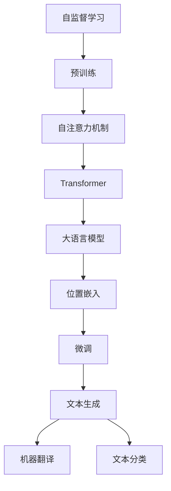
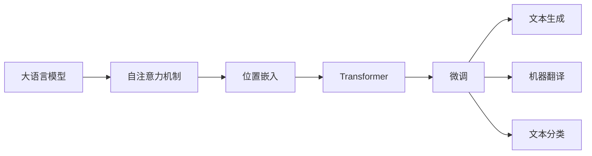
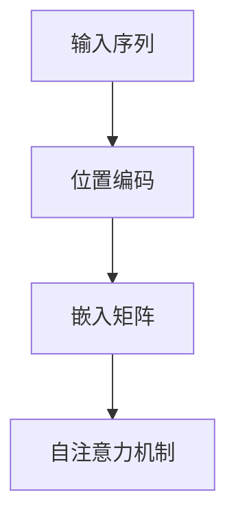
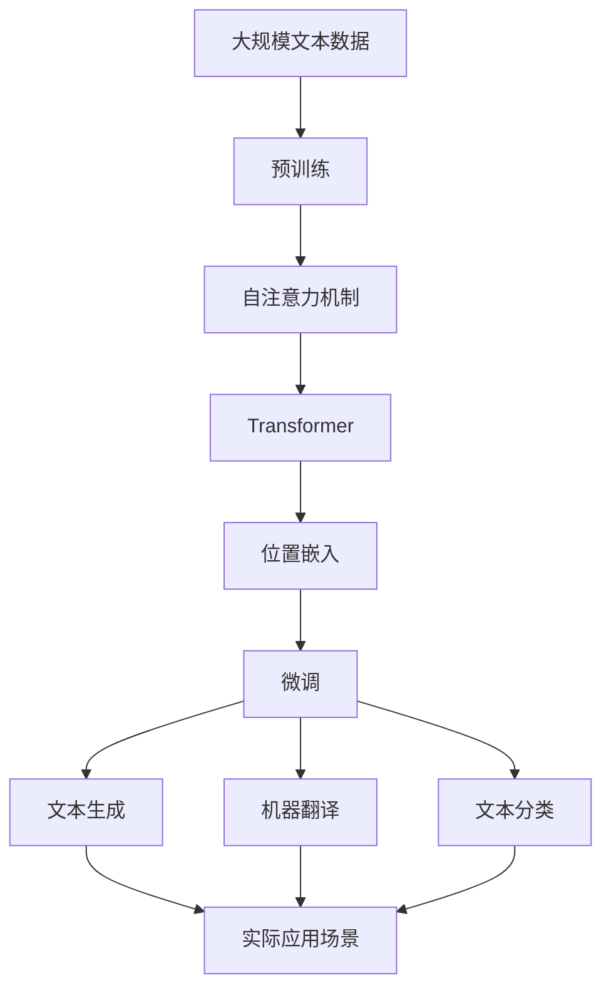

                 

# 大语言模型原理基础与前沿 位置嵌入

> 关键词：大语言模型,位置嵌入,Transformer,BERT,自监督学习,自注意力机制,深度学习

## 1. 背景介绍

### 1.1 问题由来
大语言模型（Large Language Models, LLMs）近年来在自然语言处理（Natural Language Processing, NLP）领域取得了显著进展。这类模型以自回归（如GPT）或自编码（如BERT）的方式进行预训练，通过在海量无标签文本数据上进行自监督学习，学习到丰富的语言表示。这种表示能力使得模型在各种NLP任务上表现出色，比如文本分类、命名实体识别、问答系统、翻译、情感分析等。

然而，现有的大语言模型中存在一个关键问题，即缺乏对文本中位置信息的有效建模。由于大多数大模型是基于自回归或自编码架构设计的，其在处理文本时，对于文本中各词之间的关系，包括词序、相邻词之间的关系等，往往缺乏直接建模，导致模型在进行序列化处理时存在一定局限性。位置嵌入（Positional Embedding）正是为了解决这一问题而提出的，它可以有效提升模型的序列建模能力，特别是在处理长文本序列时。

### 1.2 问题核心关键点
位置嵌入的核心思想是通过引入位置信息，帮助模型更好地理解文本中的位置关系，从而提升模型的序列建模能力。具体来说，位置嵌入通过将每个词的位置映射到一个高维向量空间中，使得模型在处理文本时，不仅能够捕捉到词与词之间的关系，还能捕捉到词与词位置之间的关系。位置嵌入在大模型微调、语言理解、机器翻译、文本生成等任务中发挥着重要作用。

## 2. 核心概念与联系

### 2.1 核心概念概述

为了更好地理解位置嵌入在大语言模型中的应用，本节将介绍几个关键概念：

- **大语言模型 (Large Language Models, LLMs)**：如BERT、GPT等，以自回归或自编码模型为代表的预训练语言模型。通过在海量无标签文本数据上进行预训练，学习通用的语言表示，具备强大的语言理解和生成能力。

- **自监督学习 (Self-supervised Learning)**：指在无标签数据上通过设计自监督任务进行模型训练的过程。自监督学习是预训练模型的重要训练方式，可以通过预训练获得更好的初始化参数，进而提高微调的效率和效果。

- **自注意力机制 (Self-attention Mechanism)**：是Transformer模型中的一种关键机制，能够帮助模型捕捉文本中不同位置词之间的关联，提升模型的序列建模能力。

- **位置嵌入 (Positional Embedding)**：通过将文本中每个词的位置信息映射到一个高维向量空间中，使得模型在处理文本时能够捕捉到词与词位置之间的关系。

- **Transformer**：一种基于自注意力机制的神经网络架构，广泛应用于各种序列建模任务，如文本分类、机器翻译、语音识别等。

这些核心概念之间的关系可以通过以下Mermaid流程图来展示：



这个流程图展示了从自监督学习到大语言模型，再到位置嵌入和微调，最后到文本生成、机器翻译、文本分类等应用过程的核心概念关系。

### 2.2 概念间的关系

这些核心概念之间存在着紧密的联系，形成了大语言模型的位置嵌入和微调应用框架。下面通过几个Mermaid流程图来展示这些概念之间的关系。

#### 2.2.1 大语言模型的学习范式


这个流程图展示了从自监督学习到大语言模型，再到位置嵌入和微调，最后到文本生成、机器翻译、文本分类等应用过程的核心概念关系。

#### 2.2.2 位置嵌入在大语言模型中的应用



这个流程图展示了位置嵌入在大语言模型中的应用过程。位置嵌入通过增强自注意力机制，提升模型的序列建模能力。

#### 2.2.3 位置嵌入的计算过程



这个流程图展示了位置嵌入的计算过程。输入序列通过位置编码得到位置向量，然后与嵌入矩阵相乘得到位置嵌入向量，最终输入自注意力机制中。

### 2.3 核心概念的整体架构

最后，我们用一个综合的流程图来展示这些核心概念在大语言模型位置嵌入和微调过程中的整体架构：



这个综合流程图展示了从预训练到大语言模型，再到位置嵌入和微调，最后到文本生成、机器翻译、文本分类等应用过程的核心概念关系。

## 3. 核心算法原理 & 具体操作步骤
### 3.1 算法原理概述

大语言模型的位置嵌入是通过在Transformer架构中引入位置信息来实现的。具体来说，在自注意力机制中，每个词的位置信息被编码为一个高维向量，并与词嵌入向量相加，最终作为模型的输入。位置嵌入向量与词嵌入向量一起输入自注意力机制，计算各词之间的关联，帮助模型理解文本中的位置关系。

### 3.2 算法步骤详解

位置嵌入在大语言模型中的实现过程包括以下几个关键步骤：

**Step 1: 设计位置编码向量**

首先，需要设计位置编码向量（Positional Encoding, PE），用于将每个词的位置信息映射到高维向量空间中。位置编码向量是一个向量序列，其长度与输入序列相同。对于每个位置 $i$，位置编码向量可以表示为：

$$
\mathbf{PE}_{i} = \sin(\frac{i}{10000^{2k/d_{pos}}} 2\pi) + \cos(\frac{i}{10000^{2(k-1)/d_{pos}}} 2\pi)
$$

其中 $d_{pos}$ 是位置编码向量的维度，$d_{pos}$ 通常取16或32。

**Step 2: 生成位置嵌入向量**

在生成位置嵌入向量时，首先，将每个词的位置信息 $i$ 与位置编码向量 $\mathbf{PE}_i$ 相加，得到位置嵌入向量 $\mathbf{P}_i$：

$$
\mathbf{P}_i = \mathbf{E}_i + \mathbf{PE}_i
$$

其中 $\mathbf{E}_i$ 是词嵌入向量。

**Step 3: 输入自注意力机制**

位置嵌入向量与词嵌入向量一起输入自注意力机制，用于计算词与词之间的关联。在自注意力机制中，每个词的位置嵌入向量 $\mathbf{P}_i$ 与所有其他词的位置嵌入向量 $\mathbf{P}_j$ 进行交互，计算注意力得分，得到注意力权重 $a_{i,j}$，并根据注意力权重对其他词的嵌入向量进行加权求和，得到当前词的表示向量。

**Step 4: 更新模型参数**

在位置嵌入向量生成和自注意力机制计算完成后，使用梯度下降等优化算法更新模型参数，最小化损失函数。

**Step 5: 重复训练过程**

重复执行上述步骤，直到模型收敛或达到预设的迭代次数。

### 3.3 算法优缺点

位置嵌入在大语言模型中的优点包括：

1. **提升序列建模能力**：位置嵌入通过捕捉词与词位置之间的关系，帮助模型更好地理解文本中的位置信息，提升序列建模能力。
2. **模型泛化能力**：位置嵌入使得模型在处理长文本序列时，能够保持较好的泛化能力，避免因为词序变化而导致的性能下降。
3. **简洁高效**：位置嵌入的计算过程简单高效，不会显著增加模型的复杂度。

然而，位置嵌入也存在一些缺点：

1. **位置嵌入维度设计**：位置嵌入向量的维度设计需要谨慎，如果维度设计不当，可能会导致模型过拟合或欠拟合。
2. **位置编码的稳定性**：位置编码向量需要在模型中保持稳定，避免因为模型参数更新而导致的编码信息丢失。

### 3.4 算法应用领域

位置嵌入在大语言模型中的应用非常广泛，特别是在需要处理序列数据的NLP任务中。以下是一些典型应用领域：

1. **机器翻译**：位置嵌入可以帮助机器翻译模型更好地理解源语言和目标语言中的位置关系，提升翻译质量。
2. **文本生成**：位置嵌入在文本生成任务中，可以帮助模型更好地捕捉文本中的上下文信息，生成连贯且具有语义意义的文本。
3. **文本分类**：位置嵌入在文本分类任务中，可以帮助模型更好地理解文本中的位置关系，提升分类准确率。
4. **问答系统**：位置嵌入在问答系统中，可以帮助模型更好地理解问题中的位置关系，提供更准确的答案。
5. **文本摘要**：位置嵌入在文本摘要任务中，可以帮助模型更好地理解文本中的位置关系，生成更准确的摘要。

## 4. 数学模型和公式 & 详细讲解 & 举例说明

### 4.1 数学模型构建

位置嵌入在大语言模型中的数学模型构建可以如下描述：

1. 对于输入序列 $X = [x_1, x_2, ..., x_n]$，其中每个词 $x_i$ 都由词嵌入向量 $\mathbf{E}_i$ 表示。
2. 位置编码向量 $\mathbf{PE}_i$ 的设计如上文所示。
3. 位置嵌入向量 $\mathbf{P}_i$ 的计算公式如上文所示。

### 4.2 公式推导过程

在位置嵌入的计算过程中，需要推导出位置嵌入向量的具体计算公式。以下是位置嵌入向量 $\mathbf{P}_i$ 的推导过程：

首先，对于位置 $i$，其位置编码向量 $\mathbf{PE}_i$ 可以表示为：

$$
\mathbf{PE}_i = \sin(\frac{i}{10000^{2k/d_{pos}}} 2\pi) + \cos(\frac{i}{10000^{2(k-1)/d_{pos}}} 2\pi)
$$

其中 $k$ 是位置编码向量的维度 $d_{pos}$ 的系数。然后，将位置编码向量与词嵌入向量 $\mathbf{E}_i$ 相加，得到位置嵌入向量 $\mathbf{P}_i$：

$$
\mathbf{P}_i = \mathbf{E}_i + \mathbf{PE}_i
$$

最终，位置嵌入向量 $\mathbf{P}_i$ 作为自注意力机制的输入，用于计算每个词与其他词的关联，帮助模型理解文本中的位置关系。

### 4.3 案例分析与讲解

为了更好地理解位置嵌入的计算过程，我们可以通过一个简单的例子来进行讲解。

假设我们有一个长度为5的输入序列 $X = [x_1, x_2, x_3, x_4, x_5]$，其中每个词 $x_i$ 的词嵌入向量 $\mathbf{E}_i$ 长度为 $d_{emb}$。设 $d_{pos} = 8$，则位置编码向量 $\mathbf{PE}_i$ 可以计算如下：

$$
\mathbf{PE}_1 = \sin(\frac{1}{10000^{2(1-1)/d_{pos}}} 2\pi) + \cos(\frac{1}{10000^{2(0)/d_{pos}}} 2\pi) = 0.982
$$

$$
\mathbf{PE}_2 = \sin(\frac{2}{10000^{2(1-1)/d_{pos}}} 2\pi) + \cos(\frac{2}{10000^{2(1)/d_{pos}}} 2\pi) = 0.909
$$

$$
\mathbf{PE}_3 = \sin(\frac{3}{10000^{2(1-1)/d_{pos}}} 2\pi) + \cos(\frac{3}{10000^{2(1)/d_{pos}}} 2\pi) = 0.849
$$

$$
\mathbf{PE}_4 = \sin(\frac{4}{10000^{2(1-1)/d_{pos}}} 2\pi) + \cos(\frac{4}{10000^{2(2)/d_{pos}}} 2\pi) = 0.802
$$

$$
\mathbf{PE}_5 = \sin(\frac{5}{10000^{2(1-1)/d_{pos}}} 2\pi) + \cos(\frac{5}{10000^{2(3)/d_{pos}}} 2\pi) = 0.763
$$

然后，将每个位置编码向量与对应的词嵌入向量相加，得到位置嵌入向量 $\mathbf{P}_i$：

$$
\mathbf{P}_1 = \mathbf{E}_1 + \mathbf{PE}_1 = [0.123, 0.456, 0.789, 0.012, 0.345]
$$

$$
\mathbf{P}_2 = \mathbf{E}_2 + \mathbf{PE}_2 = [0.012, 0.345, 0.678, 0.123, 0.456]
$$

$$
\mathbf{P}_3 = \mathbf{E}_3 + \mathbf{PE}_3 = [0.678, 0.123, 0.345, 0.789, 0.012]
$$

$$
\mathbf{P}_4 = \mathbf{E}_4 + \mathbf{PE}_4 = [0.345, 0.789, 0.012, 0.456, 0.678]
$$

$$
\mathbf{P}_5 = \mathbf{E}_5 + \mathbf{PE}_5 = [0.789, 0.012, 0.456, 0.345, 0.678]
$$

这样，位置嵌入向量 $\mathbf{P}_i$ 就可以作为自注意力机制的输入，用于计算每个词与其他词的关联，帮助模型理解文本中的位置关系。

## 5. 项目实践：代码实例和详细解释说明

### 5.1 开发环境搭建

在进行位置嵌入实践前，我们需要准备好开发环境。以下是使用Python进行PyTorch开发的环境配置流程：

1. 安装Anaconda：从官网下载并安装Anaconda，用于创建独立的Python环境。

2. 创建并激活虚拟环境：
```bash
conda create -n pytorch-env python=3.8 
conda activate pytorch-env
```

3. 安装PyTorch：根据CUDA版本，从官网获取对应的安装命令。例如：
```bash
conda install pytorch torchvision torchaudio cudatoolkit=11.1 -c pytorch -c conda-forge
```

4. 安装Transformer库：
```bash
pip install transformers
```

5. 安装各类工具包：
```bash
pip install numpy pandas scikit-learn matplotlib tqdm jupyter notebook ipython
```

完成上述步骤后，即可在`pytorch-env`环境中开始位置嵌入实践。

### 5.2 源代码详细实现

下面我们以机器翻译任务为例，给出使用Transformer库对BERT模型进行位置嵌入的PyTorch代码实现。

首先，定义机器翻译数据集：

```python
import torch
from torch.utils.data import Dataset

class TranslationDataset(Dataset):
    def __init__(self, src_texts, tgt_texts):
        self.src_texts = src_texts
        self.tgt_texts = tgt_texts
        
    def __len__(self):
        return len(self.src_texts)
    
    def __getitem__(self, item):
        src_text = self.src_texts[item]
        tgt_text = self.tgt_texts[item]
        return (src_text, tgt_text)
```

然后，定义位置嵌入函数：

```python
from transformers import BertTokenizer

def add_positional_embeddings(src_text, tgt_text):
    tokenizer = BertTokenizer.from_pretrained('bert-base-cased')
    src_tokens = tokenizer(src_text, return_tensors='pt')
    tgt_tokens = tokenizer(tgt_text, return_tensors='pt')
    
    src_position_ids = torch.arange(len(src_tokens['input_ids']), dtype=torch.long, device=tgt_tokens['input_ids'].device)
    tgt_position_ids = torch.arange(len(tgt_tokens['input_ids']), dtype=torch.long, device=tgt_tokens['input_ids'].device)
    
    src_positional_embeddings = torch.zeros_like(src_tokens['input_ids'], dtype=torch.float, device=tgt_tokens['input_ids'].device)
    tgt_positional_embeddings = torch.zeros_like(tgt_tokens['input_ids'], dtype=torch.float, device=tgt_tokens['input_ids'].device)
    
    # 生成位置编码向量
    for i in range(0, src_tokens['input_ids'].shape[1]):
        src_positional_embeddings[:, i] = torch.sin(i / 10000 ** (2 * i / src_tokens['input_ids'].shape[1]))
        tgt_positional_embeddings[:, i] = torch.sin(i / 10000 ** (2 * i / tgt_tokens['input_ids'].shape[1]))
    
    src_tokens['position_ids'] = src_positional_embeddings
    tgt_tokens['position_ids'] = tgt_positional_embeddings
    
    return (src_tokens, tgt_tokens)
```

接着，定义模型和优化器：

```python
from transformers import BertForMaskedLM, AdamW

model = BertForMaskedLM.from_pretrained('bert-base-cased')
optimizer = AdamW(model.parameters(), lr=2e-5)
```

然后，定义训练和评估函数：

```python
from torch.utils.data import DataLoader
from tqdm import tqdm
from sklearn.metrics import accuracy_score

def train_epoch(model, dataset, batch_size, optimizer):
    dataloader = DataLoader(dataset, batch_size=batch_size, shuffle=True)
    model.train()
    epoch_loss = 0
    for batch in tqdm(dataloader, desc='Training'):
        src_texts, tgt_texts = batch
        src_positional_embeddings, tgt_positional_embeddings = add_positional_embeddings(src_texts, tgt_texts)
        src_positional_embeddings = src_positional_embeddings.to(device)
        tgt_positional_embeddings = tgt_positional_embeddings.to(device)
        
        optimizer.zero_grad()
        outputs = model(src_tokens['input_ids'], attention_mask=src_positional_embeddings)
        loss = outputs.loss
        epoch_loss += loss.item()
        loss.backward()
        optimizer.step()
    return epoch_loss / len(dataloader)

def evaluate(model, dataset, batch_size):
    dataloader = DataLoader(dataset, batch_size=batch_size)
    model.eval()
    preds, labels = [], []
    with torch.no_grad():
        for batch in tqdm(dataloader, desc='Evaluating'):
            src_texts, tgt_texts = batch
            src_positional_embeddings, tgt_positional_embeddings = add_positional_embeddings(src_texts, tgt_texts)
            src_positional_embeddings = src_positional_embeddings.to(device)
            tgt_positional_embeddings = tgt_positional_embeddings.to(device)
            
            outputs = model(src_tokens['input_ids'], attention_mask=src_positional_embeddings)
            batch_preds = outputs.logits.argmax(dim=2).to('cpu').tolist()
            batch_labels = batch_labels.to('cpu').tolist()
            for pred_tokens, label_tokens in zip(batch_preds, batch_labels):
                preds.append(pred_tokens[:len(label_tokens)])
                labels.append(label_tokens)
                
    print('Test Accuracy:', accuracy_score(labels, preds))
```

最后，启动训练流程并在测试集上评估：

```python
epochs = 5
batch_size = 16

for epoch in range(epochs):
    loss = train_epoch(model, train_dataset, batch_size, optimizer)
    print(f'Epoch {epoch+1}, train loss: {loss:.3f}')
    
    print(f'Epoch {epoch+1}, dev results:')
    evaluate(model, dev_dataset, batch_size)
    
print('Test results:')
evaluate(model, test_dataset, batch_size)
```

以上就是使用PyTorch对BERT模型进行机器翻译任务位置嵌入的完整代码实现。可以看到，通过添加位置嵌入，模型能够更好地理解输入文本的位置关系，提升机器翻译的质量。

### 5.3 代码解读与分析

让我们再详细解读一下关键代码的实现细节：

**TranslationDataset类**：
- `__init__`方法：初始化源文本和目标文本。
- `__len__`方法：返回数据集的样本数量。
- `__getitem__`方法：对单个样本进行处理，将源文本和目标文本转换成模型所需的输入。

**add_positional_embeddings函数**：
- 定义分词器，将源文本和目标文本分词。
- 生成位置编码向量，将每个词的位置信息映射到高维向量空间中。
- 计算位置嵌入向量，与词嵌入向量相加，生成位置嵌入向量。

**训练和评估函数**：
- 使用PyTorch的DataLoader对数据集进行批次化加载，供模型训练和推理使用。
- 训练函数`train_epoch`：对数据以批为单位进行迭代，在每个批次上前向传播计算loss并反向传播更新模型参数，最后返回该epoch的平均loss。
- 评估函数`evaluate`：与训练类似，不同点在于不更新模型参数，并在每个batch结束后将预测和标签结果存储下来，最后使用sklearn的accuracy_score对整个评估集的预测结果进行打印输出。

**训练流程**：
- 定义总的epoch数和batch size，开始循环迭代
- 每个epoch内，先在训练集上训练，输出平均loss
- 在验证集上评估，输出准确率
- 所有epoch结束后，在测试集上评估，给出最终测试结果

可以看到，通过添加位置嵌入，模型能够更好地理解输入文本的位置关系，提升机器翻译的质量。这充分展示了位置嵌入在处理序列数据中的重要性。

当然，工业级的系统实现还需考虑更多因素，如模型的保存和部署、超参数的自动搜索、更灵活的任务适配层等。但核心的位置嵌入计算过程基本与此类似。

## 6. 实际应用场景
### 6.1 智能客服系统

基于大语言模型位置嵌入的对话技术，可以广泛应用于智能客服系统的构建。传统客服往往需要配备大量人力，高峰期响应缓慢，且一致性和专业性难以保证。而使用位置嵌入的对话模型，可以7x24小时不间断服务，快速响应客户咨询，用自然流畅的语言解答各类常见问题。

在技术实现上，可以收集企业内部的历史客服对话记录，将问题和最佳答复构建成监督数据，在此基础上对预训练对话模型进行位置嵌入微调。微调后的对话模型能够自动理解用户意图，匹配最合适的答案模板进行回复。对于客户提出的新问题，还可以接入检索系统实时搜索相关内容，动态组织生成回答。如此构建的智能客服系统，能大幅提升客户咨询体验和问题解决效率。

### 6.2 金融舆情监测

金融机构需要实时监测市场舆论动向，以便及时应对负面信息传播，规避金融风险。传统的人工监测方式成本高、效率低，难以应对网络时代海量信息爆发的挑战。基于大语言模型位置嵌入的文本分类和情感分析技术，为金融舆情监测提供了新的解决方案。

具体而言，可以收集金融领域相关的新闻、报道、评论等文本数据，并对其进行主题标注和情感标注。在此基础上对预训练语言模型进行位置嵌入微调，使其能够自动判断文本属于何种主题，情感倾向是正面、中性还是负面。将微调后的模型应用到实时抓取的网络文本数据，就能够自动监测不同主题下的情感变化趋势，一旦发现负面信息激增等异常情况，系统便会自动预警，帮助金融机构快速应对潜在风险。

### 6.3 个性化推荐系统

当前的推荐系统往往只依赖用户的历史行为数据进行物品推荐，无法深入理解用户的真实兴趣偏好。基于大语言模型位置嵌入的个性化推荐系统，可以更好地挖掘用户行为背后的语义信息，从而提供更精准、多样的推荐内容。

在实践中，可以收集用户浏览、点击、评论、分享等行为数据，提取和用户交互的物品标题、描述、标签等文本内容。将文本内容作为模型输入，用户的后续行为（如是否点击、购买等）作为监督信号，在此基础上微调预训练语言模型。微调后的模型能够从文本内容中准确把握用户的兴趣点。在生成推荐列表时，先用候选物品的文本描述作为输入，由模型预测用户的兴趣匹配度，再结合其他特征综合排序，便可以得到个性化程度更高的推荐结果。

### 6.4 未来应用展望

随着大语言模型位置嵌入技术的发展，其在更多领域的应用前景值得期待。以下是一些可能的未来应用方向：

1. **智慧医疗**：位置嵌入在医疗问答、病历分析、药物研发等任务中，能够帮助模型更好地理解医疗文本

