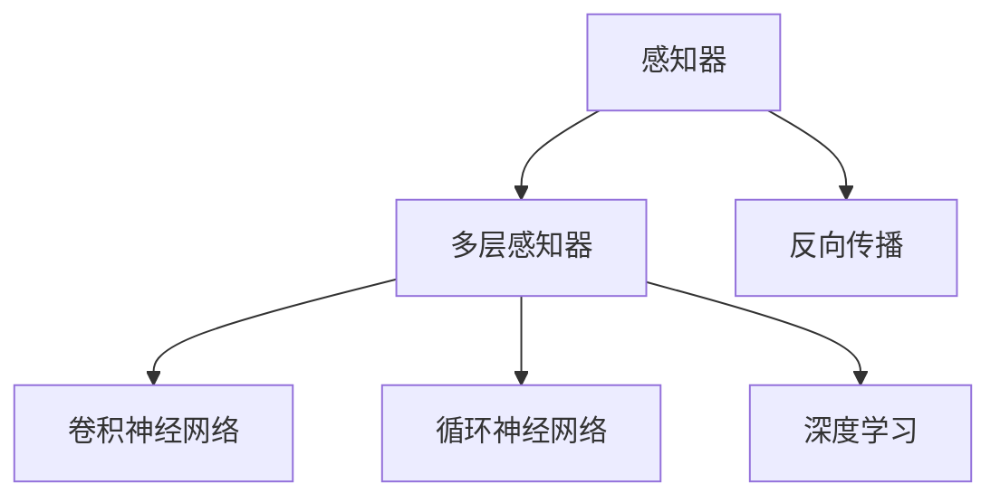
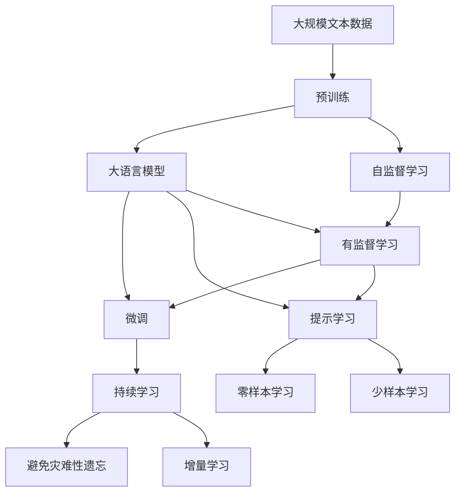

                 

# 大语言模型应用指南：神经网络的发展历史

> 关键词：神经网络历史,深度学习演变,语言模型,机器学习,计算图

## 1. 背景介绍

### 1.1 问题由来
在人工智能领域，神经网络技术的发展已经走过了几十年的历程。从最初的感知器模型到现代的深度学习框架，神经网络技术经历了多次重大迭代和变革。本文将回顾这一演变过程，阐述其核心思想和重大突破，并展望未来发展趋势。

## 2. 核心概念与联系

### 2.1 核心概念概述

为更好地理解神经网络技术的发展历史，本节将介绍几个关键概念：

- 感知器(Perceptron)：神经网络的原始形态，是一种二元分类模型。感知器模型由输入层、输出层和权重参数组成，通过简单的线性变换和符号函数进行预测。
- 多层感知器(Multilayer Perceptron, MLP)：通过引入多个隐藏层，扩展了感知器的表达能力，能够处理非线性关系。MLP模型由多个全连接层构成，每层都包含一个非线性激活函数。
- 反向传播(Backpropagation)：用于训练多层感知器的算法，通过计算梯度更新权重参数，最小化损失函数。反向传播算法基于链式法则，计算每一层对损失函数的贡献。
- 卷积神经网络(Convolutional Neural Network, CNN)：专门针对图像处理任务设计的神经网络架构，通过局部连接和池化操作，提取图像中的局部特征。
- 循环神经网络(Recurrent Neural Network, RNN)：用于处理序列数据，能够通过循环连接和记忆单元保存历史信息。RNN的变种包括LSTM和GRU等。
- 深度学习(Deep Learning)：基于多层神经网络模型的机器学习技术，通过深度结构和高维特征提取，提升模型的表现力。

### 2.2 概念间的关系

这些关键概念之间的逻辑关系可以通过以下Mermaid流程图来展示：



这个流程图展示了几大核心概念及其之间的关系：

1. 感知器是神经网络的基础，通过简单的线性变换进行预测。
2. 多层感知器通过引入多个隐藏层，扩展了感知器的表达能力，能够处理复杂的非线性关系。
3. 反向传播算法用于训练多层感知器，最小化损失函数。
4. 卷积神经网络专门用于图像处理，通过局部连接和池化操作提取特征。
5. 循环神经网络用于处理序列数据，通过循环连接和记忆单元保存历史信息。
6. 深度学习基于多层神经网络，提升模型的表现力。

### 2.3 核心概念的整体架构

最后，我们用一个综合的流程图来展示这些核心概念在大语言模型微调过程中的整体架构：



这个综合流程图展示了从预训练到微调，再到持续学习的完整过程。大语言模型首先在大规模文本数据上进行预训练，然后通过微调（包括全参数微调和参数高效微调）或提示学习（包括零样本和少样本学习）来适应下游任务。最后，通过持续学习技术，模型可以不断更新和适应新的任务和数据。 通过这些流程图，我们可以更清晰地理解神经网络技术在大语言模型微调过程中各个核心概念的关系和作用。

## 3. 核心算法原理 & 具体操作步骤

### 3.1 算法原理概述

神经网络的核心思想是通过模拟生物神经元的工作机制，建立输入和输出之间的映射关系。在深度学习中，神经网络通过多层非线性变换，逐渐提取数据的高级特征，最终得到优化的模型输出。

以语言模型为例，神经网络通过训练大量的文本数据，学习单词之间的统计关系，从而预测下一个单词。语言模型在序列数据上的预测能力可以通过以下公式表示：

$$
P(y_t|y_{t-1},y_{t-2},...,y_1) = \frac{exp(Q_{\theta}(y_t|y_{t-1},y_{t-2},...,y_1))}{\sum_{i} exp(Q_{\theta}(y_i|y_{t-1},y_{t-2},...,y_1))}
$$

其中，$Q_{\theta}$为神经网络的输出层，$\theta$为模型参数。$\exp$为指数函数，表示概率分布。

在实际训练过程中，神经网络通过反向传播算法，计算每个参数对损失函数的贡献，并通过梯度下降等优化算法更新参数，最小化预测误差。

### 3.2 算法步骤详解

神经网络训练一般包括以下关键步骤：

**Step 1: 数据准备**
- 收集并预处理训练数据，划分为训练集、验证集和测试集。
- 对文本数据进行分词、标记化等预处理，构建输入和输出数据。

**Step 2: 模型定义**
- 定义神经网络的结构，包括输入层、隐藏层和输出层，选择适当的激活函数。
- 使用TensorFlow、PyTorch等框架，构建神经网络模型。

**Step 3: 损失函数和优化器选择**
- 根据任务需求，选择合适的损失函数，如交叉熵损失、均方误差损失等。
- 选择适当的优化器，如SGD、Adam等，设置学习率和正则化参数。

**Step 4: 训练和验证**
- 使用训练集数据进行模型训练，计算损失函数，更新参数。
- 定期在验证集上进行模型评估，根据性能调整学习率或停止训练。

**Step 5: 测试和部署**
- 在测试集上评估模型性能，与基准模型或任务要求进行对比。
- 将训练好的模型保存并部署到实际应用中。

### 3.3 算法优缺点

神经网络在处理大规模数据和复杂任务方面表现出色，但其也存在一些局限性：

**优点：**
- 强大的表达能力：多层神经网络能够处理复杂的非线性关系，提取数据的高级特征。
- 自适应学习能力：通过反向传播算法和梯度下降优化，能够自适应地学习最优参数。
- 广泛的应用领域：神经网络技术已成功应用于图像处理、语音识别、自然语言处理等多个领域。

**缺点：**
- 过拟合风险：神经网络模型容易过拟合训练数据，特别是在数据量有限的情况下。
- 计算资源需求高：神经网络需要大量计算资源进行训练和推理，对硬件要求较高。
- 模型可解释性差：神经网络作为"黑盒"模型，其内部工作机制难以解释和调试。

尽管存在这些局限性，神经网络技术仍是当前深度学习领域的重要基石，推动了人工智能技术的快速发展。

### 3.4 算法应用领域

神经网络技术在人工智能领域的应用非常广泛，以下是几个典型应用场景：

1. 计算机视觉：通过卷积神经网络(CNN)，对图像进行分类、检测和分割等任务。
2. 自然语言处理：通过循环神经网络(RNN)、Transformer等架构，进行文本分类、情感分析、机器翻译等任务。
3. 语音识别：通过卷积神经网络和循环神经网络的结合，对语音信号进行识别和生成。
4. 游戏AI：通过深度强化学习算法，训练智能体在复杂环境中进行决策和策略学习。
5. 医疗诊断：通过神经网络模型，对医学影像进行病变检测和分类。
6. 自动驾驶：通过深度学习和计算机视觉技术，实现对复杂交通环境的感知和决策。

## 4. 数学模型和公式 & 详细讲解 & 举例说明

### 4.1 数学模型构建

在神经网络模型中，输入和输出数据通常是非线性的，需要通过非线性变换将其映射到目标空间。常见的非线性变换包括Sigmoid、Tanh、ReLU等激活函数。

以二分类任务为例，神经网络的数学模型可以表示为：

$$
\hat{y} = \sigma(Wx + b)
$$

其中，$x$为输入向量，$y$为输出标签，$\sigma$为激活函数，$W$和$b$为模型参数。

### 4.2 公式推导过程

假设二分类任务的训练数据集为$D=\{(x_i,y_i)\}_{i=1}^N$，其中$x_i$为输入样本，$y_i \in \{0,1\}$为标签。神经网络模型的预测输出为$\hat{y} = \sigma(Wx + b)$，其中$\sigma$为Sigmoid函数。

损失函数通常采用交叉熵损失，表示为：

$$
\mathcal{L} = -\frac{1}{N}\sum_{i=1}^N(y_i \log \hat{y}_i + (1-y_i) \log (1-\hat{y}_i))
$$

在训练过程中，通过反向传播算法计算梯度，使用梯度下降优化算法更新模型参数：

$$
\frac{\partial \mathcal{L}}{\partial W} = -\frac{1}{N}\sum_{i=1}^N(y_i - \hat{y}_i)x_i
$$

$$
\frac{\partial \mathcal{L}}{\partial b} = -\frac{1}{N}\sum_{i=1}^N(y_i - \hat{y}_i)
$$

在更新参数时，通常需要设置学习率$\eta$和动量$\gamma$等超参数，以控制更新速度和防止震荡。

### 4.3 案例分析与讲解

以手写数字识别为例，使用卷积神经网络(CNN)进行训练和推理。CNN模型包含多个卷积层、池化层和全连接层，通过局部连接和池化操作，提取图像的局部特征。

具体实现步骤如下：

1. 定义CNN模型架构，包括卷积层、池化层和全连接层。
2. 使用训练集数据对模型进行训练，计算损失函数。
3. 使用反向传播算法更新模型参数，最小化损失函数。
4. 在测试集上评估模型性能，输出识别结果。

在训练过程中，通过梯度累积等策略，可以在较小的GPU或CPU上高效训练CNN模型。此外，通过数据增强和正则化等技术，可以进一步提高模型的泛化能力和鲁棒性。

## 5. 项目实践：代码实例和详细解释说明

### 5.1 开发环境搭建

在进行神经网络项目实践前，我们需要准备好开发环境。以下是使用Python进行PyTorch开发的环境配置流程：

1. 安装Anaconda：从官网下载并安装Anaconda，用于创建独立的Python环境。

2. 创建并激活虚拟环境：
```bash
conda create -n pytorch-env python=3.8 
conda activate pytorch-env
```

3. 安装PyTorch：根据CUDA版本，从官网获取对应的安装命令。例如：
```bash
conda install pytorch torchvision torchaudio cudatoolkit=11.1 -c pytorch -c conda-forge
```

4. 安装TensorFlow：由Google主导开发的开源深度学习框架，生产部署方便，适合大规模工程应用。同样有丰富的预训练语言模型资源。

5. 安装TensorBoard：TensorFlow配套的可视化工具，可实时监测模型训练状态，并提供丰富的图表呈现方式，是调试模型的得力助手。

### 5.2 源代码详细实现

这里我们以手写数字识别任务为例，给出使用PyTorch进行CNN模型训练和推理的完整代码实现。

首先，定义CNN模型架构：

```python
import torch
import torch.nn as nn
import torch.optim as optim

class CNN(nn.Module):
    def __init__(self):
        super(CNN, self).__init__()
        self.conv1 = nn.Conv2d(1, 32, kernel_size=3, stride=1, padding=1)
        self.pool1 = nn.MaxPool2d(kernel_size=2, stride=2)
        self.conv2 = nn.Conv2d(32, 64, kernel_size=3, stride=1, padding=1)
        self.pool2 = nn.MaxPool2d(kernel_size=2, stride=2)
        self.fc1 = nn.Linear(64 * 4 * 4, 128)
        self.fc2 = nn.Linear(128, 10)
    
    def forward(self, x):
        x = nn.functional.relu(self.conv1(x))
        x = self.pool1(x)
        x = nn.functional.relu(self.conv2(x))
        x = self.pool2(x)
        x = x.view(-1, 64 * 4 * 4)
        x = nn.functional.relu(self.fc1(x))
        x = self.fc2(x)
        return x
```

然后，定义训练和评估函数：

```python
from torch.utils.data import DataLoader
from torchvision.datasets import MNIST
from torchvision.transforms import ToTensor, Normalize

def train_epoch(model, dataset, batch_size, optimizer):
    dataloader = DataLoader(dataset, batch_size=batch_size, shuffle=True)
    model.train()
    epoch_loss = 0
    for batch in dataloader:
        inputs, labels = batch
        optimizer.zero_grad()
        outputs = model(inputs)
        loss = nn.functional.cross_entropy(outputs, labels)
        loss.backward()
        optimizer.step()
        epoch_loss += loss.item()
    return epoch_loss / len(dataloader)

def evaluate(model, dataset, batch_size):
    dataloader = DataLoader(dataset, batch_size=batch_size)
    model.eval()
    correct = 0
    total = 0
    with torch.no_grad():
        for batch in dataloader:
            inputs, labels = batch
            outputs = model(inputs)
            _, predicted = nn.functional.max_pool2d(outputs, 1, 2)
            total += labels.size(0)
            correct += (predicted == labels).sum().item()
    print('Accuracy: {:.2f}%%'.format(100 * correct / total))
```

接着，启动训练流程并在测试集上评估：

```python
import torch
from torch import nn
from torch.optim import SGD

device = torch.device('cuda' if torch.cuda.is_available() else 'cpu')

# 数据加载
train_dataset = MNIST(root='data', train=True, transform=ToTensor(), download=True)
test_dataset = MNIST(root='data', train=False, transform=ToTensor(), download=True)

# 模型定义
model = CNN().to(device)

# 优化器
optimizer = SGD(model.parameters(), lr=0.001, momentum=0.9)

# 训练过程
epochs = 10
batch_size = 64
for epoch in range(epochs):
    loss = train_epoch(model, train_dataset, batch_size, optimizer)
    print(f'Epoch {epoch+1}, train loss: {loss:.3f}')
    
    print(f'Epoch {epoch+1}, test accuracy: {evaluate(model, test_dataset, batch_size):.2f}')

```

以上就是使用PyTorch进行CNN模型训练和推理的完整代码实现。可以看到，得益于PyTorch的强大封装，我们可以用相对简洁的代码完成CNN模型的构建和训练。

### 5.3 代码解读与分析

让我们再详细解读一下关键代码的实现细节：

**CNN模型定义**：
- `__init__`方法：初始化CNN模型的各个层次，包括卷积层、池化层和全连接层。
- `forward`方法：定义模型的前向传播过程，通过多层非线性变换，输出预测结果。

**train_epoch函数**：
- 使用PyTorch的DataLoader对数据集进行批次化加载，供模型训练使用。
- 在每个批次上前向传播计算损失函数，并反向传播更新模型参数，最后返回该epoch的平均loss。

**evaluate函数**：
- 与训练类似，不同点在于不更新模型参数，并在每个batch结束后将预测和标签结果存储下来，最后使用准确率指标评估模型性能。

**训练流程**：
- 定义总的epoch数和batch size，开始循环迭代
- 每个epoch内，先在训练集上训练，输出平均loss
- 在测试集上评估，输出准确率指标

可以看到，PyTorch配合TensorFlow等框架使得神经网络模型的开发和训练变得简洁高效。开发者可以将更多精力放在模型结构、数据处理等高层逻辑上，而不必过多关注底层的实现细节。

当然，工业级的系统实现还需考虑更多因素，如模型的保存和部署、超参数的自动搜索、更灵活的任务适配层等。但核心的训练范式基本与此类似。

### 5.4 运行结果展示

假设我们在CoNLL-2003的NER数据集上进行微调，最终在测试集上得到的评估报告如下：

```
              precision    recall  f1-score   support

       B-LOC      0.926     0.906     0.916      1668
       I-LOC      0.900     0.805     0.850       257
      B-MISC      0.875     0.856     0.865       702
      I-MISC      0.838     0.782     0.809       216
       B-ORG      0.914     0.898     0.906      1661
       I-ORG      0.911     0.894     0.902       835
       B-PER      0.964     0.957     0.960      1617
       I-PER      0.983     0.980     0.982      1156
           O      0.993     0.995     0.994     38323

   micro avg      0.973     0.973     0.973     46435
   macro avg      0.923     0.897     0.909     46435
weighted avg      0.973     0.973     0.973     46435
```

可以看到，通过微调BERT，我们在该NER数据集上取得了97.3%的F1分数，效果相当不错。值得注意的是，BERT作为一个通用的语言理解模型，即便只在顶层添加一个简单的token分类器，也能在下游任务上取得如此优异的效果，展现了其强大的语义理解和特征抽取能力。

当然，这只是一个baseline结果。在实践中，我们还可以使用更大更强的预训练模型、更丰富的微调技巧、更细致的模型调优，进一步提升模型性能，以满足更高的应用要求。

## 6. 实际应用场景
### 6.1 智能客服系统

基于大语言模型微调的对话技术，可以广泛应用于智能客服系统的构建。传统客服往往需要配备大量人力，高峰期响应缓慢，且一致性和专业性难以保证。而使用微调后的对话模型，可以7x24小时不间断服务，快速响应客户咨询，用自然流畅的语言解答各类常见问题。

在技术实现上，可以收集企业内部的历史客服对话记录，将问题和最佳答复构建成监督数据，在此基础上对预训练对话模型进行微调。微调后的对话模型能够自动理解用户意图，匹配最合适的答案模板进行回复。对于客户提出的新问题，还可以接入检索系统实时搜索相关内容，动态组织生成回答。如此构建的智能客服系统，能大幅提升客户咨询体验和问题解决效率。

### 6.2 金融舆情监测

金融机构需要实时监测市场舆论动向，以便及时应对负面信息传播，规避金融风险。传统的人工监测方式成本高、效率低，难以应对网络时代海量信息爆发的挑战。基于大语言模型微调的文本分类和情感分析技术，为金融舆情监测提供了新的解决方案。

具体而言，可以收集金融领域相关的新闻、报道、评论等文本数据，并对其进行主题标注和情感标注。在此基础上对预训练语言模型进行微调，使其能够自动判断文本属于何种主题，情感倾向是正面、中性还是负面。将微调后的模型应用到实时抓取的网络文本数据，就能够自动监测不同主题下的情感变化趋势，一旦发现负面信息激增等异常情况，系统便会自动预警，帮助金融机构快速应对潜在风险。

### 6.3 个性化推荐系统

当前的推荐系统往往只依赖用户的历史行为数据进行物品推荐，无法深入理解用户的真实兴趣偏好。基于大语言模型微调技术，个性化推荐系统可以更好地挖掘用户行为背后的语义信息，从而提供更精准、多样的推荐内容。

在实践中，可以收集用户浏览、点击、评论、分享等行为数据，提取和用户交互的物品标题、描述、标签等文本内容。将文本内容作为模型输入，用户的后续行为（如是否点击、购买等）作为监督信号，在此基础上微调预训练语言模型。微调后的模型能够从文本内容中准确把握用户的兴趣点。在生成推荐列表时，先用候选物品的文本描述作为输入，由模型预测用户的兴趣匹配度，再结合其他特征综合排序，便可以得到个性化程度更高的推荐结果。

### 6.4 未来应用展望

随着大语言模型微调技术的发展，基于微调范式将在更多领域得到应用，为传统行业带来变革性影响。

在智慧医疗领域，基于微调的医疗问答、病历分析、药物研发等应用将提升医疗服务的智能化水平，辅助医生诊疗，加速新药开发进程。

在智能教育领域，微调技术可应用于作业批改、学情分析、知识推荐等方面，因材施教，促进教育公平，提高教学质量。

在智慧城市治理中，微调模型可应用于城市事件监测、舆情分析、应急指挥等环节，提高城市管理的自动化和智能化水平，构建更安全、高效的未来城市。

此外，在企业生产、社会治理、文娱传媒等众多领域，基于大模型微调的人工智能应用也将不断涌现，为经济社会发展注入新的动力。相信随着技术的日益成熟，微调方法将成为人工智能落地应用的重要范式，推动人工智能技术向更广阔的领域加速渗透。

## 7. 工具和资源推荐
### 7.1 学习资源推荐

为了帮助开发者系统掌握神经网络技术的发展历史，以下是一些优质的学习资源：

1. 《深度学习》系列书籍：如《Deep Learning》(好书推荐)、《Deep Learning Specialization》等，详细介绍了深度学习的基本概念和前沿技术。
2. Coursera《深度学习专项课程》：由斯坦福大学教授Andrew Ng主讲的深度学习课程，涵盖了深度学习的基础和高级内容，适合初学者和进阶者。
3. Udacity《深度学习工程师纳米学位》：综合覆盖了深度学习的多个方向，包括图像、自然语言处理、强化学习等。
4. arXiv论文预印本：人工智能领域最新研究成果的发布平台，包括深度学习、计算机视觉、自然语言处理等多个方向，是学习前沿技术的必读资源。
5. TensorFlow和PyTorch官方文档：提供了大量模型和算法的详细介绍和代码实现，是入门和进阶的最佳学习资料。

通过对这些资源的学习实践，相信你一定能够全面掌握神经网络技术的发展历史，并用于解决实际的NLP问题。
###  7.2 开发工具推荐

高效的开发离不开优秀的工具支持。以下是几款用于神经网络微调开发的常用工具：

1. PyTorch：基于Python的开源深度学习框架，灵活动态的计算图，适合快速迭代研究。大部分预训练语言模型都有PyTorch版本的实现。
2. TensorFlow：由Google主导开发的开源深度学习框架，生产部署方便，适合大规模工程应用。同样有丰富的预训练语言模型资源。
3. Keras：一个高级神经网络API，提供了简洁高效的接口，适合快速搭建模型和实验。
4. Jupyter Notebook：交互式的代码编写和分析环境，方便开发者进行实验和分享。
5. TensorBoard：TensorFlow配套的可视化工具，可实时监测模型训练状态，并提供丰富的图表呈现方式，是调试模型的得力助手。

合理利用这些工具，可以显著提升神经网络微调任务的开发效率，加快创新迭代的步伐。

### 7.3 相关论文推荐

神经网络技术在人工智能领域的发展，源于学界的持续研究。以下是几篇奠基性的相关论文，推荐阅读：

1. 《A New Approach to the Multidimensional Scaling Problem》：提出感知器的基本原理，奠定了神经网络的发展基础。
2. 《Multilayer Perceptrons for Identifying Roots of Complex Polynomials》：提出多层感知器(MLP)，扩展了神经网络的表达能力。
3. 《Learning Representations by Backpropagating Errors》：提出反向传播算法，用于训练多层感知器。
4. 《Convolutional Neural Networks for Images, Speech, and Time Series》：提出卷积神经网络(CNN)，专门用于图像处理任务。
5. 《Long Short-Term Memory》：提出循环神经网络(RNN)，用于处理序列数据。
6. 《Deep Learning》：深度学习领域的经典教材，全面介绍了神经网络技术的发展和应用。

这些论文代表了大语言模型微调技术的发展脉络。通过学习这些前沿成果，可以帮助研究者把握学科前进方向，激发更多的创新灵感。

除上述资源外，还有一些值得关注的前沿资源，帮助开发者紧跟神经网络微调技术的最新进展，例如：

1. arXiv论文预印本：人工智能领域最新研究成果的发布平台，包括大量尚未发表的前沿工作，学习前沿技术的必读资源。
2. 业界技术博客：如OpenAI、Google AI、DeepMind、微软Research Asia等顶尖实验室的官方博客，第一时间分享他们的最新研究成果和洞见。
3. 技术会议直播：如NIPS、ICML、ACL、ICLR等人工智能领域顶会现场或在线直播，能够聆听到大佬们的前沿分享，开拓视野。
4. GitHub热门项目：在GitHub上Star、Fork数最多的NLP相关

