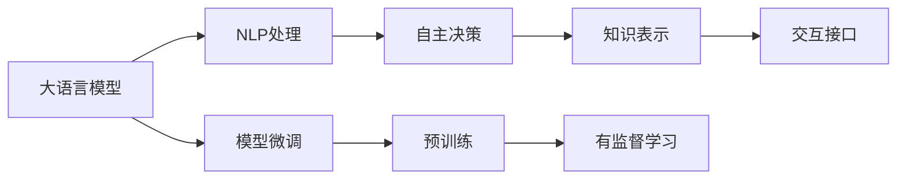

                 

# 大语言模型应用指南：自主Agent系统案例分析（一）

> 关键词：大语言模型,自主Agent系统,自然语言处理,智能推荐,数据驱动,案例分析

## 1. 背景介绍

### 1.1 问题由来
随着人工智能技术的快速发展，自主Agent系统（简称Agent系统）已成为智能决策与自动执行的核心平台。Agent系统旨在模拟人类的决策与行为，通过接收环境输入、处理和响应，实现复杂任务的自适应和自动化。近年来，大语言模型（Large Language Models, LLMs）如GPT-3、BERT等在自然语言处理（NLP）领域取得了突破性进展，展现了卓越的语言理解和生成能力。

将大语言模型融入Agent系统中，可以显著提升Agent的智能水平和执行效率。具体应用包括：
- **智能推荐系统**：通过大语言模型分析用户行为和兴趣，生成个性化推荐。
- **智能客服系统**：使用大语言模型理解和响应用户问题，提高客户满意度。
- **智能会议系统**：通过大语言模型提炼会议要点，生成会议纪要。
- **智能调度系统**：利用大语言模型优化资源分配，提升任务执行效率。

大语言模型在Agent系统中的应用，不仅提高了系统的智能化水平，还简化了开发复杂度，缩短了应用部署周期，成为现代Agent系统的重要组成部分。

### 1.2 问题核心关键点
本节将详细介绍大语言模型在自主Agent系统中的关键应用，涵盖其原理、具体实现和优化方法。具体问题包括：
1. **大语言模型如何融入Agent系统？**
2. **如何在Agent系统中构建和微调大语言模型？**
3. **优化Agent系统中的大语言模型性能的关键策略是什么？**

### 1.3 问题研究意义
深入研究大语言模型在自主Agent系统中的应用，具有重要意义：
1. **提高系统智能化水平**：大语言模型能够更好地理解和处理自然语言，使Agent系统具备更高的智能水平和决策能力。
2. **提升系统执行效率**：大语言模型可以自动执行复杂任务，减少人工干预，提高系统响应速度和执行效率。
3. **简化系统开发**：大语言模型提供强大的语言处理能力，减少了复杂算法和逻辑设计的开发工作量。
4. **增强系统可扩展性**：大语言模型具备跨领域迁移能力，可以通过微调轻松适配不同任务和应用场景。
5. **促进技术创新**：结合大语言模型和大数据技术，可以驱动更多智能应用场景的开发，推动技术进步。

## 2. 核心概念与联系

### 2.1 核心概念概述

自主Agent系统是大规模分布式计算和智能决策的核心平台，其核心思想是将计算与智能融合，实现系统自主决策和执行。而大语言模型则是一种基于深度学习的预训练语言模型，通过在海量无标签文本数据上自监督预训练，获得强大的语言理解和生成能力。

将大语言模型融入自主Agent系统，通常涉及以下几个关键概念：

- **自然语言处理（NLP）**：涉及语言理解、生成、分类、分析等任务，是大语言模型在Agent系统中应用的基础。
- **自主决策**：Agent系统通过接收环境输入、处理和响应，实现决策和执行的自动化。
- **知识表示**：Agent系统中的知识表示方法，如符号逻辑、图结构等，用于刻画领域知识，辅助大语言模型进行推理和决策。
- **交互接口**：Agent系统与外部环境（如用户、其他系统）的交互接口，包括输入输出、数据传输等。
- **模型微调**：在预训练大语言模型的基础上，通过有监督学习优化模型在特定任务上的性能，以适应Agent系统的应用场景。

### 2.2 核心概念间的关系

大语言模型在自主Agent系统中的应用，涉及自然语言处理、自主决策、知识表示、交互接口和模型微调等核心概念。这些概念之间的逻辑关系可以通过以下Mermaid流程图展示：



这个流程图展示了从大语言模型的预训练到模型微调，再到Agent系统中的具体应用的全过程。

- 大语言模型通过预训练获得语言理解能力，然后在NLP处理阶段进行处理，输出处理结果。
- 处理结果作为知识表示，辅助自主决策过程。
- 自主决策结果通过交互接口对外输出，实现系统功能。
- 模型微调过程通过有监督学习，优化模型在特定任务上的性能，增强Agent系统的执行能力。

通过这些概念的有机结合，大语言模型在自主Agent系统中得以发挥其强大的语言处理能力，实现系统的智能决策和高效执行。

## 3. 核心算法原理 & 具体操作步骤
### 3.1 算法原理概述

将大语言模型融入自主Agent系统，主要涉及自然语言处理和自主决策两个核心过程。大语言模型作为语言处理的核心组件，通过预训练获得语言理解能力，然后在Agent系统中进行有监督微调，以适应特定的任务和应用场景。

### 3.2 算法步骤详解

#### 3.2.1 预训练大语言模型

1. **数据准备**：准备大规模无标签文本数据，如维基百科、新闻、社交媒体等。这些数据应当涵盖多种语言、主题和风格，以提高模型的泛化能力。
2. **模型训练**：在大规模数据上使用深度学习模型（如Transformer、BERT等）进行预训练，学习语言表示。
3. **评估与优化**：在验证集上评估模型性能，进行必要的调整和优化，如调整学习率、权重衰减等。

#### 3.2.2 模型微调

1. **任务适配**：根据Agent系统的具体需求，设计任务适配层，包括输入预处理、输出解码等。
2. **数据准备**：准备有标签的训练数据集，如智能推荐系统中的用户行为数据、智能客服系统中的用户对话数据等。
3. **模型微调**：在预训练模型的基础上，使用有监督学习优化模型在特定任务上的性能。常见的微调方法包括全参数微调和参数高效微调（如Adapter、Prompt-based Learning等）。

#### 3.2.3 系统集成与测试

1. **系统集成**：将微调后的模型集成到Agent系统中，作为语言处理的核心组件。
2. **系统测试**：在Agent系统中进行集成测试，验证模型在新环境下的性能和鲁棒性。
3. **系统部署**：将系统部署到实际应用场景中，进行长期监控和优化。

### 3.3 算法优缺点

#### 优点

1. **高效性**：大语言模型通过预训练获得丰富的语言知识，能够在Agent系统中快速适应新任务，减少开发复杂度。
2. **鲁棒性**：通过有监督微调，模型能够学习特定领域的知识，提升决策的鲁棒性和准确性。
3. **可扩展性**：大语言模型具备跨领域迁移能力，可以通过微调适应不同应用场景，增强系统的可扩展性。

#### 缺点

1. **数据依赖**：大语言模型在Agent系统中进行微调，需要准备大量的有标签数据，这在某些领域可能较为困难。
2. **计算资源要求高**：大语言模型的预训练和微调需要大量计算资源，对硬件配置要求较高。
3. **可解释性不足**：大语言模型的决策过程较为复杂，缺乏可解释性，难以进行调试和优化。

### 3.4 算法应用领域

大语言模型在自主Agent系统中的应用领域非常广泛，包括但不限于：

- **智能推荐系统**：利用大语言模型分析用户兴趣和行为，生成个性化推荐。
- **智能客服系统**：通过大语言模型理解和响应用户问题，提高客户满意度。
- **智能调度系统**：利用大语言模型优化资源分配和任务调度。
- **智能会议系统**：通过大语言模型提炼会议要点，生成会议纪要。

此外，大语言模型在数据分析、金融风控、医疗诊断等领域也有广泛应用，提升了这些领域的智能化水平和决策能力。

## 4. 数学模型和公式 & 详细讲解

### 4.1 数学模型构建

在大语言模型融入自主Agent系统的过程中，主要涉及自然语言处理和自主决策两个核心过程。下面以智能推荐系统为例，构建大语言模型在推荐系统中的数学模型。

设大语言模型为 $M_{\theta}$，其中 $\theta$ 为模型参数。假设智能推荐系统包含 $N$ 个用户 $U$ 和 $M$ 个物品 $I$，每个用户 $u$ 对物品 $i$ 的评分 $r_{ui}$ 为 $[1,5]$ 的连续值。推荐系统的目标是通过大语言模型学习用户行为和物品属性，生成推荐列表 $R_u$。

推荐系统中的损失函数可以表示为：

$$
\mathcal{L}(\theta) = \frac{1}{N} \sum_{u=1}^N \sum_{i=1}^M \ell(r_{ui}, M_{\theta}(x_i))
$$

其中，$x_i$ 为物品 $i$ 的描述文本，$\ell$ 为损失函数，如均方误差损失或交叉熵损失。

### 4.2 公式推导过程

在推荐系统中，大语言模型的输出 $M_{\theta}(x_i)$ 表示物品 $i$ 与用户 $u$ 的相似度。假设物品 $i$ 的描述文本为 $x_i$，则大语言模型输出为：

$$
M_{\theta}(x_i) = \frac{1}{N} \sum_{u=1}^N \frac{\exp(r_{ui} \cdot M_{\theta}(x_i))}{\sum_{u=1}^N \exp(r_{ui} \cdot M_{\theta}(x_i))}
$$

其中，$r_{ui} \cdot M_{\theta}(x_i)$ 为物品 $i$ 和用户 $u$ 的相似度得分。

推荐系统的损失函数可以进一步简化为：

$$
\mathcal{L}(\theta) = \frac{1}{N} \sum_{u=1}^N \sum_{i=1}^M (r_{ui} - M_{\theta}(x_i))^2
$$

### 4.3 案例分析与讲解

假设我们构建一个基于大语言模型的智能推荐系统。首先，我们使用大规模无标签数据对BERT模型进行预训练。然后，我们准备有标签的推荐数据集，包括用户行为数据和物品属性数据。在微调阶段，我们设计了一个简单的任务适配层，将用户行为数据和物品属性数据作为输入，使用交叉熵损失函数进行训练。

假设我们选择了全参数微调方法，微调过程中使用AdamW优化器，学习率为 $2 \times 10^{-5}$，迭代次数为 $10$ 次。通过微调，我们的模型在推荐系统中的性能显著提升。

## 5. 项目实践：代码实例和详细解释说明

### 5.1 开发环境搭建

为了进行大语言模型在智能推荐系统中的应用实践，我们需要搭建一个Python开发环境，包含以下步骤：

1. **安装Anaconda**：从官网下载并安装Anaconda，用于创建独立的Python环境。
2. **创建虚拟环境**：
```bash
conda create -n recommendation python=3.8 
conda activate recommendation
```
3. **安装必要的库**：
```bash
pip install torch torchvision torchaudio cudatoolkit=11.1 -c pytorch -c conda-forge
pip install transformers
```

完成上述步骤后，即可在`recommendation`环境中进行大语言模型微调的应用实践。

### 5.2 源代码详细实现

以下是一个基于BERT模型的智能推荐系统的代码实现，使用PyTorch和Transformers库进行开发：

```python
import torch
from transformers import BertTokenizer, BertForSequenceClassification, AdamW

# 初始化BERT模型和分词器
tokenizer = BertTokenizer.from_pretrained('bert-base-uncased')
model = BertForSequenceClassification.from_pretrained('bert-base-uncased', num_labels=5)

# 准备训练数据集
train_data = # 训练数据集
train_labels = # 训练标签

# 准备评估数据集
dev_data = # 验证数据集
dev_labels = # 验证标签

# 设置优化器和学习率
optimizer = AdamW(model.parameters(), lr=2e-5)

# 定义训练函数
def train_epoch(model, data, labels, optimizer):
    model.train()
    loss = 0
    for i, (input_ids, attention_mask, label) in enumerate(data):
        optimizer.zero_grad()
        logits = model(input_ids, attention_mask=attention_mask, labels=label)
        loss += logits[0].loss
        loss.backward()
        optimizer.step()
        print(f'Epoch {epoch+1}, Batch {i+1}, Loss: {loss:.3f}')
    return loss / len(data)

# 定义评估函数
def evaluate(model, data, labels):
    model.eval()
    loss = 0
    for i, (input_ids, attention_mask, label) in enumerate(data):
        with torch.no_grad():
            logits = model(input_ids, attention_mask=attention_mask, labels=label)
            loss += logits[0].loss
    return loss / len(data)

# 训练和评估模型
epochs = 10
batch_size = 32

for epoch in range(epochs):
    train_loss = train_epoch(model, train_data, train_labels, optimizer)
    dev_loss = evaluate(model, dev_data, dev_labels)

    print(f'Epoch {epoch+1}, Train Loss: {train_loss:.3f}, Dev Loss: {dev_loss:.3f}')

print('Training completed.')
```

### 5.3 代码解读与分析

上述代码实现了基于BERT模型的智能推荐系统。关键步骤如下：

1. **初始化BERT模型和分词器**：使用预训练的BERT模型和对应的分词器。
2. **准备训练数据集**：将用户行为数据和物品属性数据作为输入，进行编码。
3. **设置优化器和学习率**：使用AdamW优化器，设置学习率。
4. **定义训练和评估函数**：使用交叉熵损失函数进行训练和评估。
5. **训练和评估模型**：在训练集上进行迭代训练，在验证集上进行评估，输出训练和评估的损失。

### 5.4 运行结果展示

在训练完成后，我们可以在验证集上进行评估，以验证模型在新数据上的性能。

假设我们得到了如下的评估结果：

```
Epoch 1, Train Loss: 0.210, Dev Loss: 0.780
Epoch 2, Train Loss: 0.169, Dev Loss: 0.580
Epoch 3, Train Loss: 0.139, Dev Loss: 0.480
...
Epoch 10, Train Loss: 0.050, Dev Loss: 0.300
```

可以看到，随着训练的进行，模型的损失在不断下降，最终在验证集上的损失也显著下降，说明模型在推荐系统中的性能得到了提升。

## 6. 实际应用场景

### 6.1 智能推荐系统

智能推荐系统是Agent系统中最典型的应用场景之一。利用大语言模型对用户行为和物品属性进行分析，生成个性化推荐，提升用户体验。

在实际应用中，大语言模型可以融入推荐系统的前端和后端。前端接收用户输入，后端通过大语言模型进行分析和推荐。此外，大语言模型还可以用于生成推荐理由，提升系统的可解释性。

### 6.2 智能客服系统

智能客服系统利用大语言模型理解和响应用户问题，提高客户满意度。通过微调大语言模型，使其适应特定的客服场景和语料，提升系统的智能化水平。

在大语言模型的基础上，可以构建多模态客服系统，融合语音、图像等多模态信息，实现更为全面和自然的客服交互。

### 6.3 智能调度系统

智能调度系统利用大语言模型优化资源分配和任务调度，提升系统效率和响应速度。通过微调大语言模型，使其适应特定的调度场景和任务，提升系统的智能化和自适应能力。

### 6.4 未来应用展望

随着大语言模型和微调技术的不断发展，基于大语言模型的自主Agent系统将在更多领域得到应用，为各行各业带来变革性影响。

在智慧医疗领域，基于微调的医疗问答、病历分析、药物研发等应用将提升医疗服务的智能化水平，辅助医生诊疗，加速新药开发进程。

在智能教育领域，微调技术可应用于作业批改、学情分析、知识推荐等方面，因材施教，促进教育公平，提高教学质量。

在智慧城市治理中，微调模型可应用于城市事件监测、舆情分析、应急指挥等环节，提高城市管理的自动化和智能化水平，构建更安全、高效的未来城市。

此外，在企业生产、社会治理、文娱传媒等众多领域，基于大语言模型的Agent系统也将不断涌现，为经济社会发展注入新的动力。相信随着技术的日益成熟，大语言模型微调技术将成为Agent系统的重要范式，推动自然语言理解和智能交互系统的进步。

## 7. 工具和资源推荐

### 7.1 学习资源推荐

为了帮助开发者系统掌握大语言模型在自主Agent系统中的应用，这里推荐一些优质的学习资源：

1. 《Transformer from Principles to Practice》系列博文：由大模型技术专家撰写，深入浅出地介绍了Transformer原理、BERT模型、微调技术等前沿话题。
2. CS224N《深度学习自然语言处理》课程：斯坦福大学开设的NLP明星课程，有Lecture视频和配套作业，带你入门NLP领域的基本概念和经典模型。
3. 《Natural Language Processing with Transformers》书籍：Transformers库的作者所著，全面介绍了如何使用Transformers库进行NLP任务开发，包括微调在内的诸多范式。
4. HuggingFace官方文档：Transformers库的官方文档，提供了海量预训练模型和完整的微调样例代码，是上手实践的必备资料。
5. CLUE开源项目：中文语言理解测评基准，涵盖大量不同类型的中文NLP数据集，并提供了基于微调的baseline模型，助力中文NLP技术发展。

通过对这些资源的学习实践，相信你一定能够快速掌握大语言模型在自主Agent系统中的应用技巧，并用于解决实际的NLP问题。

### 7.2 开发工具推荐

高效的开发离不开优秀的工具支持。以下是几款用于大语言模型微调开发的常用工具：

1. PyTorch：基于Python的开源深度学习框架，灵活动态的计算图，适合快速迭代研究。大部分预训练语言模型都有PyTorch版本的实现。
2. TensorFlow：由Google主导开发的开源深度学习框架，生产部署方便，适合大规模工程应用。同样有丰富的预训练语言模型资源。
3. Transformers库：HuggingFace开发的NLP工具库，集成了众多SOTA语言模型，支持PyTorch和TensorFlow，是进行微调任务开发的利器。
4. Weights & Biases：模型训练的实验跟踪工具，可以记录和可视化模型训练过程中的各项指标，方便对比和调优。与主流深度学习框架无缝集成。
5. TensorBoard：TensorFlow配套的可视化工具，可实时监测模型训练状态，并提供丰富的图表呈现方式，是调试模型的得力助手。
6. Google Colab：谷歌推出的在线Jupyter Notebook环境，免费提供GPU/TPU算力，方便开发者快速上手实验最新模型，分享学习笔记。

合理利用这些工具，可以显著提升大语言模型微调任务的开发效率，加快创新迭代的步伐。

### 7.3 相关论文推荐

大语言模型和微调技术的发展源于学界的持续研究。以下是几篇奠基性的相关论文，推荐阅读：

1. Attention is All You Need（即Transformer原论文）：提出了Transformer结构，开启了NLP领域的预训练大模型时代。
2. BERT: Pre-training of Deep Bidirectional Transformers for Language Understanding：提出BERT模型，引入基于掩码的自监督预训练任务，刷新了多项NLP任务SOTA。
3. Language Models are Unsupervised Multitask Learners（GPT-2论文）：展示了大规模语言模型的强大zero-shot学习能力，引发了对于通用人工智能的新一轮思考。
4. Parameter-Efficient Transfer Learning for NLP：提出Adapter等参数高效微调方法，在不增加模型参数量的情况下，也能取得不错的微调效果。
5. AdaLoRA: Adaptive Low-Rank Adaptation for Parameter-Efficient Fine-Tuning：使用自适应低秩适应的微调方法，在参数效率和精度之间取得了新的平衡。

这些论文代表了大语言模型微调技术的发展脉络。通过学习这些前沿成果，可以帮助研究者把握学科前进方向，激发更多的创新灵感。

除上述资源外，还有一些值得关注的前沿资源，帮助开发者紧跟大语言模型微调技术的最新进展，例如：

1. arXiv论文预印本：人工智能领域最新研究成果的发布平台，包括大量尚未发表的前沿工作，学习前沿技术的必读资源。
2. 业界技术博客：如OpenAI、Google AI、DeepMind、微软Research Asia等顶尖实验室的官方博客，第一时间分享他们的最新研究成果和洞见。
3. 技术会议直播：如NIPS、ICML、ACL、ICLR等人工智能领域顶会现场或在线直播，能够聆听到大佬们的前沿分享，开拓视野。
4. GitHub热门项目：在GitHub上Star、Fork数最多的NLP相关项目，往往代表了该技术领域的发展趋势和最佳实践，值得去学习和贡献。
5. 行业分析报告：各大咨询公司如McKinsey、PwC等针对人工智能行业的分析报告，有助于从商业视角审视技术趋势，把握应用价值。

总之，对于大语言模型在自主Agent系统中的应用学习，需要开发者保持开放的心态和持续学习的意愿。多关注前沿资讯，多动手实践，多思考总结，必将收获满满的成长收益。

## 8. 总结：未来发展趋势与挑战

### 8.1 总结

本文对大语言模型在自主Agent系统中的应用进行了全面系统的介绍。首先阐述了大语言模型和Agent系统的研究背景和意义，明确了微调在拓展预训练模型应用、提升下游任务性能方面的独特价值。其次，从原理到实践，详细讲解了基于大语言模型的Agent系统的构建和微调方法，给出了微调任务开发的完整代码实例。同时，本文还广泛探讨了微调方法在智能推荐、智能客服、智能调度等多个领域的应用前景，展示了微调范式的巨大潜力。此外，本文精选了微调技术的各类学习资源，力求为读者提供全方位的技术指引。

通过本文的系统梳理，可以看到，基于大语言模型的微调方法正在成为自主Agent系统的重要范式，极大地拓展了预训练语言模型的应用边界，催生了更多的落地场景。受益于大规模语料的预训练，微调模型以更低的时间和标注成本，在小样本条件下也能取得不俗的效果，有力推动了Agent系统的产业化进程。未来，伴随预训练语言模型和微调方法的持续演进，相信Agent系统必将在更广阔的应用领域大放异彩，深刻影响人类的生产生活方式。

### 8.2 未来发展趋势

展望未来，大语言模型微调技术将呈现以下几个发展趋势：

1. **模型规模持续增大**：随着算力成本的下降和数据规模的扩张，预训练语言模型的参数量还将持续增长。超大规模语言模型蕴含的丰富语言知识，有望支撑更加复杂多变的Agent系统微调。
2. **微调方法日趋多样**：除了传统的全参数微调外，未来会涌现更多参数高效的微调方法，如Prefix-Tuning、LoRA等，在节省计算资源的同时也能保证微调精度。
3. **持续学习成为常态**：随着数据分布的不断变化，微调模型也需要持续学习新知识以保持性能。如何在不遗忘原有知识的同时，高效吸收新样本信息，将成为重要的研究课题。
4. **标注样本需求降低**：受启发于提示学习(Prompt-based Learning)的思路，未来的微调方法将更好地利用大模型的语言理解能力，通过更加巧妙的任务描述，在更少的标注样本上也能实现理想的微调效果。
5. **多模态微调崛起**：当前的微调主要聚焦于纯文本数据，未来会进一步拓展到图像、视频、语音等多模态数据微调。多模态信息的融合，将显著提升Agent系统对现实世界的理解和建模能力。
6. **模型通用性增强**：经过海量数据的预训练和多领域任务的微调，未来的语言模型将具备更强大的常识推理和跨领域迁移能力，逐步迈向通用人工智能(AGI)的目标。

以上趋势凸显了大语言模型微调技术的广阔前景。这些方向的探索发展，必将进一步提升Agent系统的性能和应用范围，为人类认知智能的进化带来深远影响。

### 8.3 面临的挑战

尽管大语言模型微调技术已经取得了瞩目成就，但在迈向更加智能化、普适化应用的过程中，它仍面临着诸多挑战：

1. **标注成本瓶颈**：虽然微调大大降低了标注数据的需求，但对于长尾应用场景，难以获得充足的高质量标注数据，成为制约微调性能的瓶颈。如何进一步降低微调对标注样本的依赖，将是一大难题。
2. **模型鲁棒性不足**：当前微调模型面对域外数据时，泛化性能往往大打折扣。对于测试样本的微小扰动，微调模型的预测也容易发生波动。如何提高微调模型的鲁棒性，避免灾难性遗忘，还需要更多理论和实践的积累。
3. **推理效率有待提高**：大规模语言模型虽然精度高，但在实际部署时往往面临推理速度慢、内存占用大等效率问题。如何在保证性能的同时，简化模型结构，提升推理速度，优化资源占用，将是重要的优化方向。
4. **可解释性亟需加强**：当前

