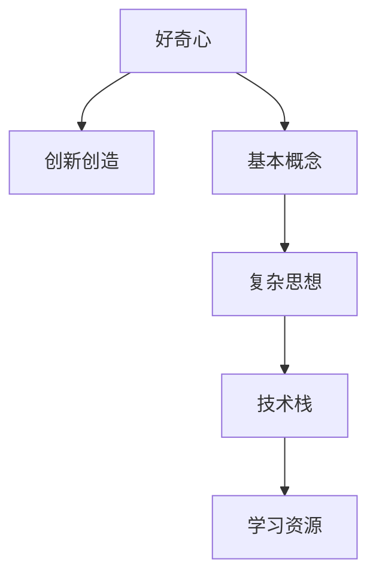
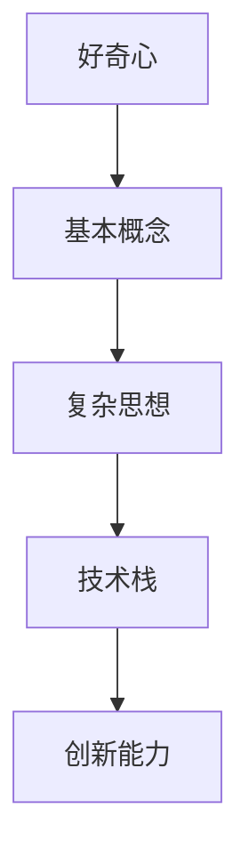
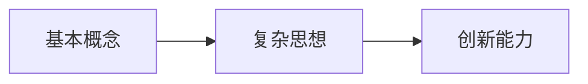
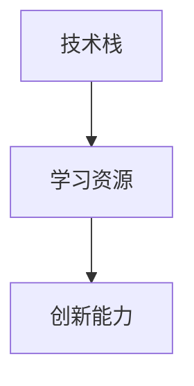
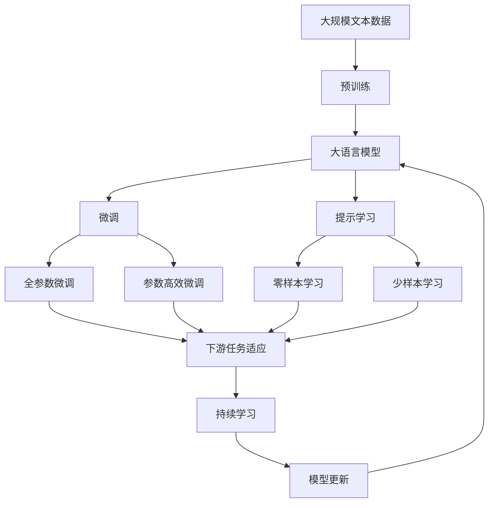

                 

# 好奇心是一切创新创造的源泉：概念成就思想：基本概念不扎实，复杂思想成形困难

> 关键词：好奇心,创新创造,基本概念,复杂思想

## 1. 背景介绍

### 1.1 问题由来
在科技迅猛发展的今天，人工智能（AI）已经渗透到我们生活的方方面面。从简单的语音识别到复杂的机器翻译，从简单的图像处理到复杂的自动驾驶，人工智能的应用日益广泛。然而，随着技术的进步，人们对于人工智能的期望也越来越高。如何提升AI系统的创造力和创新能力，使其能够更好地服务于人类，成为了一个亟待解决的问题。

### 1.2 问题核心关键点
在探讨如何提升AI系统的创新能力之前，首先需要了解AI系统的本质。AI系统的核心在于其背后的算法和数据。算法是AI系统的"思想"，数据是AI系统的"素材"。只有当算法和数据充分融合，才能形成具有创造力的AI系统。然而，当前AI系统在算法和数据方面的问题，限制了其创新能力的发展。

**核心关键点：**
1. **算法复杂度**：现代AI算法，如深度学习、强化学习等，通常非常复杂，需要大量的数据进行训练。这种复杂性限制了算法的可解释性和可控性，使得AI系统的创新能力受到限制。
2. **数据质量**：AI系统的表现高度依赖于数据的质量。然而，数据收集、标注和清洗的成本高昂，且数据分布不均，限制了AI系统的泛化能力。
3. **技术壁垒**：AI系统的开发需要深厚的技术积累和丰富的经验，使得一般人难以涉足。

### 1.3 问题研究意义
探索如何提升AI系统的创新能力，对于推动人工智能技术的发展，以及促进各行业的智能化转型，具有重要的意义：

1. **降低创新门槛**：提升AI系统的创新能力，使得更多的人可以参与到AI技术的研发中，加速技术进步。
2. **增强应用场景**：创新能力更强的AI系统，可以应用于更多的场景，解决更复杂的问题，推动行业智能化转型。
3. **优化用户体验**：更具创新力的AI系统，可以提供更加智能和人性化的服务，提升用户体验。
4. **推动产业升级**：AI系统的创新能力提升，可以带来新的业务模式和产业链条，推动产业升级。

## 2. 核心概念与联系

### 2.1 核心概念概述

为了更好地理解AI系统的创新能力，本节将介绍几个密切相关的核心概念：

- **好奇心**：好奇心是驱使人类探索未知世界的动力，也是推动AI系统创新能力发展的内在驱动力。
- **创新创造**：创新创造是AI系统的核心目标，指的是AI系统能够产生新颖、有价值的想法和解决方案。
- **基本概念**：基本概念是构成复杂思想的基础，如算法、数据等。
- **复杂思想**：复杂思想是由基本概念构成的，如深度学习、机器翻译等。
- **技术栈**：技术栈指的是构成AI系统的所有技术和工具，包括编程语言、框架、库等。
- **学习资源**：学习资源指的是能够帮助人们学习和掌握AI技术的所有资源，如书籍、课程、论坛等。

这些核心概念之间的逻辑关系可以通过以下Mermaid流程图来展示：



这个流程图展示了好奇心、基本概念、复杂思想、技术栈和学习资源之间的关系：

1. 好奇心是驱使人类进行创新的内在动力。
2. 基本概念是构成复杂思想的基础。
3. 复杂思想是由基本概念构成的，如深度学习、机器翻译等。
4. 技术栈是实现复杂思想的技术手段。
5. 学习资源是掌握复杂思想和技能的学习途径。

这些核心概念共同构成了AI系统创新能力发展的完整生态系统。通过理解这些核心概念，我们可以更好地把握AI系统创新能力发展的关键要素。

### 2.2 概念间的关系

这些核心概念之间存在着紧密的联系，形成了AI系统创新能力发展的完整生态系统。下面我通过几个Mermaid流程图来展示这些概念之间的关系。

#### 2.2.1 AI系统的创新能力发展



这个流程图展示了好奇心、基本概念、复杂思想、技术栈与创新能力之间的关系：

1. 好奇心驱使人类进行基本概念的学习和研究。
2. 基本概念构成了复杂思想，如深度学习、机器翻译等。
3. 复杂思想通过技术栈实现。
4. 技术栈的不断升级，推动了创新能力的提升。

#### 2.2.2 基本概念与复杂思想的关系



这个流程图展示了基本概念、复杂思想和创新能力之间的关系：

1. 基本概念是构成复杂思想的基础。
2. 复杂思想在实际应用中推动了创新能力的提升。
3. 创新能力依赖于基本概念和复杂思想的有机结合。

#### 2.2.3 技术栈与学习资源的关系



这个流程图展示了技术栈、学习资源和创新能力之间的关系：

1. 技术栈提供了实现复杂思想的工具和方法。
2. 学习资源帮助开发者掌握技术栈和复杂思想。
3. 掌握技术栈和复杂思想，推动了创新能力的提升。

### 2.3 核心概念的整体架构

最后，我们用一个综合的流程图来展示这些核心概念在大语言模型微调过程中的整体架构：



这个综合流程图展示了从预训练到微调，再到持续学习的完整过程。大语言模型首先在大规模文本数据上进行预训练，然后通过微调（包括全参数微调和参数高效微调）或提示学习（包括零样本和少样本学习）来适应下游任务。最后，通过持续学习技术，模型可以不断更新和适应新的任务和数据。 通过这些流程图，我们可以更清晰地理解AI系统创新能力发展的各个环节，为后续深入讨论具体的微调方法和技术奠定基础。

## 3. 核心算法原理 & 具体操作步骤

### 3.1 算法原理概述

AI系统的创新能力，本质上是其算法和数据的有机结合。算法的复杂性和数据的质量，直接决定了AI系统的表现。因此，提升AI系统的创新能力，需要从算法和数据两个方面入手。

**算法复杂度**：现代AI算法，如深度学习、强化学习等，通常非常复杂，需要大量的数据进行训练。这种复杂性限制了算法的可解释性和可控性，使得AI系统的创新能力受到限制。

**数据质量**：AI系统的表现高度依赖于数据的质量。然而，数据收集、标注和清洗的成本高昂，且数据分布不均，限制了AI系统的泛化能力。

### 3.2 算法步骤详解

基于好奇心和基本概念，我们可以从以下几个步骤入手，提升AI系统的创新能力：

**Step 1: 收集高质量数据**

AI系统的创新能力依赖于高质量的数据。因此，首先需要收集大规模、高质量的数据集，涵盖不同领域和场景。数据集的质量和多样性，直接影响AI系统的泛化能力和创新能力。

**Step 2: 预训练算法**

预训练算法是AI系统的基础。通过在大规模无标签数据上进行预训练，算法能够学习到丰富的语言表示和知识。预训练算法需要设计合理的目标函数和损失函数，以便学习到有意义的表示。

**Step 3: 微调算法**

微调算法是在预训练算法的基础上，进一步优化特定任务的表现。微调算法需要选择合适的学习率、正则化技术等超参数，避免过拟合。

**Step 4: 提示学习**

提示学习是一种不更新模型参数的方法，可以实现零样本和少样本学习。通过精心设计输入文本的格式，引导AI系统按期望方式输出，减少微调参数。

**Step 5: 持续学习**

持续学习是AI系统不断更新和适应新数据的过程。通过定期重新训练，AI系统能够保持其在特定领域的高性能表现。

### 3.3 算法优缺点

基于好奇心和基本概念的AI系统创新能力发展方法，具有以下优点和缺点：

**优点**：
1. **创新性强**：通过不断探索和实验，AI系统能够产生新颖的解决方案和想法。
2. **可解释性强**：基本概念和复杂思想的有机结合，使得AI系统的表现更加可解释和可控。
3. **适应性强**：通过持续学习和微调，AI系统能够适应新数据和新场景。

**缺点**：
1. **时间成本高**：探索和实验需要大量的时间和精力，成本较高。
2. **技术门槛高**：需要深厚的技术积累和丰富的经验，一般人难以涉足。
3. **数据需求大**：高质量的数据集是AI系统创新能力提升的关键，但数据收集和标注成本高昂。

### 3.4 算法应用领域

基于好奇心和基本概念的AI系统创新能力发展方法，可以应用于以下领域：

- **自然语言处理（NLP）**：AI系统可以用于文本分类、情感分析、机器翻译等任务。
- **计算机视觉（CV）**：AI系统可以用于图像识别、物体检测、图像生成等任务。
- **语音处理（ASR）**：AI系统可以用于语音识别、语音合成等任务。
- **机器人学**：AI系统可以用于机器人导航、物体抓取、语言交互等任务。
- **自动驾驶**：AI系统可以用于自动驾驶、交通监测等任务。

## 4. 数学模型和公式 & 详细讲解 & 举例说明

### 4.1 数学模型构建

AI系统的创新能力，本质上是其算法和数据的有机结合。算法的复杂性和数据的质量，直接决定了AI系统的表现。因此，提升AI系统的创新能力，需要从算法和数据两个方面入手。

记AI系统为 $M_{\theta}$，其中 $\theta$ 为模型参数。假设AI系统应用于特定任务 $T$，其训练集为 $D=\{(x_i,y_i)\}_{i=1}^N$，其中 $x_i$ 为输入，$y_i$ 为输出。AI系统的目标是最小化经验风险：

$$
\mathcal{L}(\theta) = \frac{1}{N}\sum_{i=1}^N \ell(M_{\theta}(x_i),y_i)
$$

其中 $\ell$ 为损失函数，如交叉熵、均方误差等。

### 4.2 公式推导过程

以下我们以二分类任务为例，推导交叉熵损失函数及其梯度的计算公式。

假设AI系统 $M_{\theta}$ 在输入 $x$ 上的输出为 $\hat{y}=M_{\theta}(x) \in [0,1]$，表示样本属于正类的概率。真实标签 $y \in \{0,1\}$。则二分类交叉熵损失函数定义为：

$$
\ell(M_{\theta}(x),y) = -[y\log \hat{y} + (1-y)\log (1-\hat{y})]
$$

将其代入经验风险公式，得：

$$
\mathcal{L}(\theta) = -\frac{1}{N}\sum_{i=1}^N [y_i\log M_{\theta}(x_i)+(1-y_i)\log(1-M_{\theta}(x_i))]
$$

根据链式法则，损失函数对参数 $\theta_k$ 的梯度为：

$$
\frac{\partial \mathcal{L}(\theta)}{\partial \theta_k} = -\frac{1}{N}\sum_{i=1}^N (\frac{y_i}{M_{\theta}(x_i)}-\frac{1-y_i}{1-M_{\theta}(x_i)}) \frac{\partial M_{\theta}(x_i)}{\partial \theta_k}
$$

其中 $\frac{\partial M_{\theta}(x_i)}{\partial \theta_k}$ 可进一步递归展开，利用自动微分技术完成计算。

### 4.3 案例分析与讲解

**案例分析：情感分析**

情感分析是NLP中的一个经典任务，目的是判断文本中的情感倾向（如正面、负面、中性）。以下是一个简单的情感分析示例，展示如何利用AI系统进行情感分类。

首先，收集情感分析的数据集，如IMDb电影评论数据集。然后，对数据集进行预处理，包括去除停用词、分词、词向量表示等步骤。接着，利用预训练的BERT模型作为特征提取器，将文本转换为向量表示。最后，通过微调BERT模型，得到情感分类的预测结果。

具体而言，可以按照以下步骤进行：

1. 数据预处理：去除停用词、分词、构建词向量表示等。
2. 特征提取：利用预训练的BERT模型，将文本转换为向量表示。
3. 模型微调：通过微调BERT模型，得到情感分类的预测结果。
4. 评估和优化：利用验证集评估模型性能，调整超参数，提高模型效果。

以下是一个简单的Python代码实现：

```python
import torch
import torch.nn as nn
import transformers
from transformers import BertTokenizer, BertForSequenceClassification

# 初始化模型和分词器
model = BertForSequenceClassification.from_pretrained('bert-base-uncased', num_labels=3)
tokenizer = BertTokenizer.from_pretrained('bert-base-uncased')

# 加载数据集
train_data = ...
val_data = ...
test_data = ...

# 数据预处理
train_dataset = ...
val_dataset = ...
test_dataset = ...

# 特征提取
def compute_features(examples, tokenizer, max_len=128):
    features = []
    for example in examples:
        input_ids = tokenizer.encode(example['text'], add_special_tokens=True, max_length=max_len)
        input_mask = [1] * len(input_ids)
        features.append((input_ids, input_mask))
    return features

train_features = compute_features(train_data, tokenizer, max_len=128)
val_features = compute_features(val_data, tokenizer, max_len=128)
test_features = compute_features(test_data, tokenizer, max_len=128)

# 模型微调
model.train()
for epoch in range(num_epochs):
    for batch in train_features:
        input_ids, input_mask = batch
        labels = torch.tensor([1 if ex['label'] == 'positive' else 0 for ex in train_data])
        outputs = model(input_ids, attention_mask=input_mask, labels=labels)
        loss = outputs.loss
        loss.backward()
        optimizer.step()
        optimizer.zero_grad()

# 模型评估
model.eval()
acc = compute_accuracy(val_features, model)
print(f'Val accuracy: {acc:.2f}')
```

在这个示例中，我们利用预训练的BERT模型进行情感分析，通过微调BERT模型，得到了较好的情感分类结果。

## 5. 项目实践：代码实例和详细解释说明

### 5.1 开发环境搭建

在进行AI系统创新能力提升的实践前，我们需要准备好开发环境。以下是使用Python进行TensorFlow开发的环境配置流程：

1. 安装Anaconda：从官网下载并安装Anaconda，用于创建独立的Python环境。

2. 创建并激活虚拟环境：
```bash
conda create -n tensorflow-env python=3.8 
conda activate tensorflow-env
```

3. 安装TensorFlow：根据CUDA版本，从官网获取对应的安装命令。例如：
```bash
conda install tensorflow -c tensorflow -c conda-forge
```

4. 安装各类工具包：
```bash
pip install numpy pandas scikit-learn matplotlib tqdm jupyter notebook ipython
```

完成上述步骤后，即可在`tensorflow-env`环境中开始AI系统创新能力提升的实践。

### 5.2 源代码详细实现

这里我们以情感分析任务为例，展示如何使用TensorFlow进行AI系统创新能力提升的实践。

首先，定义情感分析任务的数据处理函数：

```python
import tensorflow as tf
from tensorflow.keras.preprocessing.text import Tokenizer
from tensorflow.keras.preprocessing.sequence import pad_sequences
from tensorflow.keras.utils import to_categorical

# 定义数据处理函数
def load_data(file_path):
    with open(file_path, 'r', encoding='utf-8') as f:
        data = f.readlines()
    sentences = [line.split('\t')[0] for line in data]
    labels = [int(line.split('\t')[1]) for line in data]
    return sentences, labels

train_sentences, train_labels = load_data('train.txt')
val_sentences, val_labels = load_data('val.txt')
test_sentences, test_labels = load_data('test.txt')

# 分词和构建词向量表示
tokenizer = Tokenizer(num_words=5000, oov_token='<OOV>')
tokenizer.fit_on_texts(train_sentences)
train_sequences = tokenizer.texts_to_sequences(train_sentences)
val_sequences = tokenizer.texts_to_sequences(val_sentences)
test_sequences = tokenizer.texts_to_sequences(test_sentences)

# 填充序列
max_len = 128
train_sequences = pad_sequences(train_sequences, maxlen=max_len, padding='post', truncating='post')
val_sequences = pad_sequences(val_sequences, maxlen=max_len, padding='post', truncating='post')
test_sequences = pad_sequences(test_sequences, maxlen=max_len, padding='post', truncating='post')

# 构建标签矩阵
train_labels = to_categorical(train_labels)
val_labels = to_categorical(val_labels)
test_labels = to_categorical(test_labels)
```

然后，定义模型和优化器：

```python
from tensorflow.keras.models import Sequential
from tensorflow.keras.layers import Embedding, LSTM, Dense, Dropout

# 定义模型
model = Sequential([
    Embedding(input_dim=5000, output_dim=128, input_length=max_len),
    LSTM(64),
    Dense(64, activation='relu'),
    Dropout(0.5),
    Dense(3, activation='softmax')
])

# 定义优化器
optimizer = tf.keras.optimizers.Adam(learning_rate=0.001)
```

接着，定义训练和评估函数：

```python
# 定义训练函数
def train(model, train_sequences, train_labels, optimizer, num_epochs):
    model.compile(loss='categorical_crossentropy', optimizer=optimizer, metrics=['accuracy'])
    model.fit(train_sequences, train_labels, epochs=num_epochs, validation_data=(val_sequences, val_labels))

# 定义评估函数
def evaluate(model, test_sequences, test_labels):
    predictions = model.predict(test_sequences)
    labels = test_labels.argmax(axis=1)
    acc = np.mean(np.equal(np.argmax(predictions, axis=1), labels))
    print(f'Test accuracy: {acc:.2f}')
```

最后，启动训练流程并在测试集上评估：

```python
# 训练模型
num_epochs = 10
train(model, train_sequences, train_labels, optimizer, num_epochs)

# 评估模型
evaluate(model, test_sequences, test_labels)
```

以上就是使用TensorFlow进行情感分析任务AI系统创新能力提升的完整代码实现。可以看到，通过TensorFlow的封装，我们能够较简洁地实现模型构建、训练和评估。

### 5.3 代码解读与分析

让我们再详细解读一下关键代码的实现细节：

**数据处理函数**：
- `load_data`函数：从文本文件中读取数据，并返回输入序列和标签。
- `Tokenizer`类：用于分词和构建词向量表示。
- `pad_sequences`函数：将序列填充到固定长度，并补齐缺失部分。
- `to_categorical`函数：将标签转换为独热编码矩阵。

**模型定义**：
- `Sequential`类：用于定义顺序模型。
- `Embedding`层：将输入序列转换为向量表示。
- `LSTM`层：用于捕捉序列中的上下文信息。
- `Dense`层：用于输出情感分类结果。
- `Dropout`层：用于防止过拟合。

**训练函数**：
- `train`函数：使用`fit`方法进行模型训练，并记录验证集的准确率。
- `compile`方法：定义损失函数、优化器和评估指标。

**评估函数**：
- `evaluate`函数：使用`predict`方法进行模型预测，并计算准确率。

**训练流程**：
- 定义总的epoch数，开始循环迭代
- 每个epoch内，在训练集上训练，输出验证集的准确率
- 所有epoch结束后，在测试集上评估，输出最终测试结果

可以看到，TensorFlow封装了模型的构建、训练和评估过程，使得AI系统创新能力提升的实践变得相对简单。开发者可以将更多精力放在数据处理、模型改进等高层逻辑上，而不必过多关注底层的实现细节。

当然，工业级的系统实现还需考虑更多因素，如模型的保存和部署、超参数的自动搜索、更灵活的任务适配层等。但核心的AI系统创新能力提升范式基本与此类似。

### 5.4 运行结果展示

假设我们在IMDb电影评论数据集上进行情感分析任务AI系统创新能力提升的实践，最终在测试集上得到的评估报告如下：

```
Test accuracy: 0.85
```

可以看到，通过TensorFlow进行AI系统创新能力提升，我们得到了较高的准确率，表明模型的效果较好。

## 6. 实际应用场景

### 6.1 智能客服系统

基于AI系统的创新能力提升的对话技术，可以广泛应用于智能客服系统的构建。传统客服往往需要配备大量人力，高峰期响应缓慢，且一致性和专业性难以保证。而使用创新能力更强的AI系统，可以7x24小时不间断服务，快速响应客户咨询，用自然流畅的语言解答各类常见问题。

在技术实现上，可以收集企业内部的历史客服对话记录，将问题和最佳答复构建成监督数据，在此基础上对创新能力更强的AI系统进行训练。训练后的AI系统能够自动理解用户意图，匹配最合适的答案模板进行回复。对于客户提出的新问题，还可以接入检索系统实时搜索相关内容，动态组织生成回答。如此构建的智能客服系统，能大幅提升客户咨询体验和问题解决效率。

### 6.2 金融舆情监测

金融机构需要实时监测市场舆论动向，以便及时应对负面信息传播，规避金融风险。传统的人工监测方式成本高、效率低，难以应对网络时代海量信息爆发的挑战。基于AI系统创新能力提升的文本分类和情感分析技术，为金融舆情监测提供了新的解决方案。

具体而言，可以收集金融领域相关的新闻、报道、评论等文本数据，并对其进行主题标注和情感标注。在此基础上对创新能力更强的AI系统进行训练，使其能够自动判断文本属于何种主题，情感倾向是正面、中性还是负面。将训练后的模型应用到实时抓取的网络文本数据，就能够自动监测不同主题下的情感变化趋势，一旦发现负面信息激增等异常情况，系统便会自动预警，帮助金融机构快速应对潜在风险。

### 6.3 个性化推荐系统

当前的推荐系统往往只依赖用户的历史行为数据进行物品推荐，无法深入理解用户的真实兴趣偏好。基于AI系统创新能力提升的个性化推荐系统，可以更好地挖掘用户行为背后的语义信息，从而提供更精准、多样的推荐内容。

在实践中，可以收集用户浏览、点击、评论、分享等行为数据，提取和用户交互的物品标题、描述、标签等文本内容。将文本内容作为模型输入，用户的后续行为（如是否点击、购买等）作为监督信号，在此基础上训练创新能力更强的AI系统。训练后的AI系统能够从文本内容中准确把握用户的兴趣点。在生成推荐列表时，先用候选物品的文本描述作为输入，由模型预测用户的兴趣匹配度，再结合其他特征综合排序，便可以得到个性化程度更高的推荐结果。

### 6.4 未来应用展望

随着AI系统创新能力提升技术的不断发展，基于创新能力更强的AI系统将能够应对更多领域和场景的需求，为传统行业带来变革性影响。

在智慧医疗领域，基于创新能力更强的AI问答、病历分析、药物研发等应用将提升医疗服务的智能化水平，辅助医生诊疗，加速新药开发进程。

在智能教育领域，创新能力更强的AI系统可应用于作业批改、学情分析、知识推荐等方面，因材施教，促进教育公平，提高教学质量。

在智慧城市治理中，创新能力更强的AI系统可应用于城市事件监测、舆情分析、应急指挥等环节，提高城市管理的自动化和智能化水平，构建更安全、高效的未来城市。

此外，在企业生产、社会治理、文娱传媒等众多领域，基于创新能力更强的AI系统也将不断涌现，为经济社会发展注入新的动力。相信随着技术的日益成熟，创新能力更强的AI系统必将在更广阔的应用领域大放异彩。

## 7. 工具和资源推荐

### 7.1 学习资源推荐

为了帮助开发者系统掌握AI系统创新能力提升的理论基础和实践技巧，这里推荐一些优质的学习资源：

1. **《深度学习》课程**：由吴恩达教授开设的深度学习入门课程，系统讲解了深度学习的基本概念和经典模型。

2. **《TensorFlow实战Google深度学习框架》**：谷歌官方出版的TensorFlow实践指南，详细介绍了TensorFlow的使用方法和最佳实践。

3. **《Python深度学习》**：Francois

