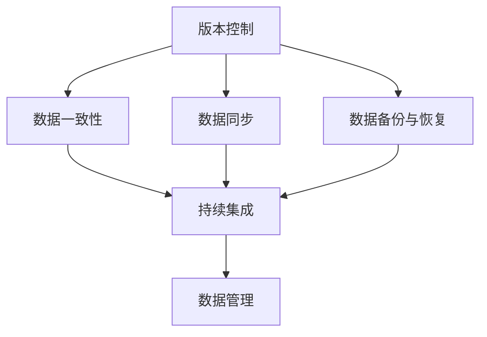
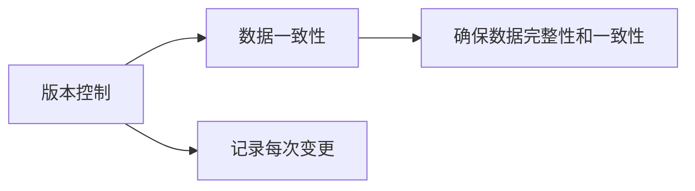
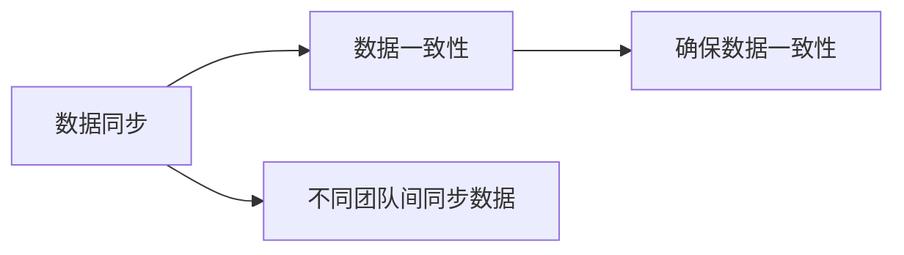
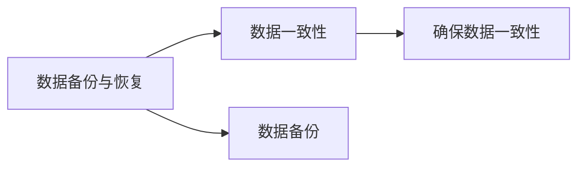
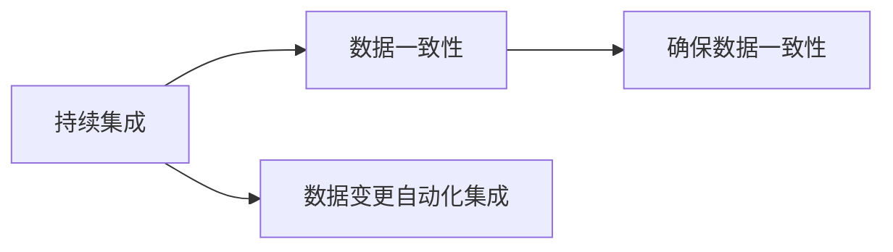
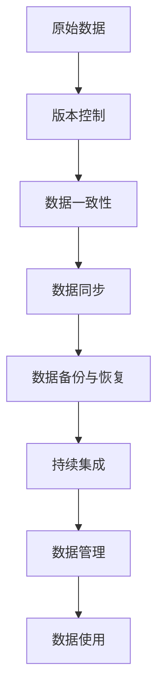

                 

# 数据版本控制与数据管理原理与代码实战案例讲解

> 关键词：数据版本控制,数据管理,版本合并冲突,数据同步,数据备份恢复,持续集成,持续部署,DevOps

## 1. 背景介绍

在当今的数字化时代，数据的生产、存储、处理和利用已经成为了企业和组织的核心能力。然而，数据的管理和维护却是一个复杂且容易出错的过程。特别是当数据规模不断增长，且数据由多个团队协作开发时，数据版本控制和数据管理就变得尤为重要。数据版本控制能够确保数据的完整性、一致性和可追溯性，从而为数据管理和分析提供坚实的基础。本文将详细讲解数据版本控制的原理与实践，并通过实际案例展示数据版本控制与数据管理的最佳实践。

### 1.1 问题由来
随着软件开发逐渐从封闭的团队开发向开放的社区合作转型，数据管理也面临着类似的挑战。数据版本控制的引入，旨在解决数据管理和协作中的多个难题，包括数据版本冲突、数据一致性维护、数据备份与恢复、数据同步等。数据版本控制不仅仅是一种技术手段，更是一种组织协作、数据管理的方法论，是数据生命周期管理的核心环节。

### 1.2 问题核心关键点
数据版本控制的核心理念在于通过版本控制工具，记录数据文件的每次变更，并追踪变更的历史记录，以确保数据的完整性和一致性。关键点包括：
- **版本控制工具**：如Git、SVN等，记录文件的历史变更。
- **数据一致性**：确保每次变更不会破坏数据原有的完整性和一致性。
- **数据同步**：不同团队间数据的一致性同步。
- **数据备份与恢复**：数据在发生灾难时的快速恢复。
- **持续集成**：数据变更的自动化集成与验证。

这些关键点共同构成了数据版本控制的完整框架，帮助团队在复杂的数据管理环境中，确保数据的安全和可用。

## 2. 核心概念与联系

### 2.1 核心概念概述

在深入讲解数据版本控制的原理之前，我们先概述一下与数据版本控制密切相关的几个核心概念：

- **版本控制（Version Control）**：记录文件的历史变更，追踪变更的历史记录。
- **数据一致性（Data Consistency）**：确保每次变更不会破坏数据原有的完整性和一致性。
- **数据同步（Data Synchronization）**：不同团队间数据的一致性同步。
- **数据备份与恢复（Data Backup and Recovery）**：数据在发生灾难时的快速恢复。
- **持续集成（Continuous Integration, CI）**：数据变更的自动化集成与验证。

这些概念间的关系可以用以下Mermaid流程图来展示：



该流程图展示了数据版本控制的几个关键组件间的关系：

1. 版本控制是数据管理的起点，记录每次变更。
2. 数据一致性是版本控制的核心目标，确保数据完整性和一致性。
3. 数据同步确保团队间数据的一致性。
4. 数据备份与恢复为数据提供灾难恢复机制。
5. 持续集成是数据变更的自动化集成与验证。

这些组件共同构成了数据版本控制的完整生态系统，为数据管理和协作提供坚实的技术保障。

### 2.2 概念间的关系

数据版本控制的几个关键概念之间存在着紧密的联系，形成了数据管理的完整流程。下面我们通过几个Mermaid流程图来展示这些概念之间的关系。

#### 2.2.1 数据版本控制与数据一致性的关系



这个流程图展示了版本控制与数据一致性间的关系：版本控制记录每次变更，数据一致性确保这些变更不会破坏数据原有的完整性和一致性。

#### 2.2.2 数据同步与数据一致性的关系



这个流程图展示了数据同步与数据一致性间的关系：数据同步确保不同团队间的数据一致性，数据一致性确保数据的完整性和一致性。

#### 2.2.3 数据备份与恢复与数据一致性的关系



这个流程图展示了数据备份与恢复与数据一致性间的关系：数据备份与恢复为数据提供灾难恢复机制，数据一致性确保数据备份和恢复过程中的完整性和一致性。

#### 2.2.4 持续集成与数据一致性的关系



这个流程图展示了持续集成与数据一致性间的关系：持续集成是数据变更的自动化集成与验证，数据一致性确保数据变更的完整性和一致性。

### 2.3 核心概念的整体架构

最后，我们用一个综合的流程图来展示数据版本控制的整体架构：



该综合流程图展示了从原始数据到最终数据管理的完整过程，各个环节互相衔接，确保数据的完整性、一致性和可用性。

## 3. 核心算法原理 & 具体操作步骤

### 3.1 算法原理概述

数据版本控制的核心算法原理基于一种称为“内容寻址存储（Content-Addressable Storage, CAS）”的机制。CAS机制通过记录文件的唯一标识（如哈希值）来管理文件的版本，而不是通过文件名或路径。每次文件变更时，系统会生成新的哈希值，从而实现对文件版本的管理。

### 3.2 算法步骤详解

以下详细介绍数据版本控制的具体步骤：

1. **版本控制工具的安装和配置**：
   - 安装Git、SVN等版本控制工具，并配置本地和远程仓库。
   - 初始化仓库，创建本地仓库和远程仓库的映射关系。

2. **提交文件变更**：
   - 使用版本控制工具提交文件的变更记录，包括添加、修改、删除等操作。
   - 提交时，版本控制工具会自动生成新的哈希值，并记录变更的历史。

3. **数据一致性维护**：
   - 在每次提交变更前，进行数据一致性检查，确保变更不会破坏数据的完整性和一致性。
   - 对于重要数据，可以设定一致性检查策略，确保数据变更的安全性。

4. **数据同步**：
   - 使用版本控制工具的同步功能，将本地仓库的数据同步到远程仓库。
   - 同步过程中，确保数据的完整性和一致性，避免数据冲突和损坏。

5. **数据备份与恢复**：
   - 定期进行数据备份，保存关键数据和变更记录。
   - 发生灾难时，通过备份恢复数据，确保数据的可用性。

6. **持续集成**：
   - 将数据变更自动化集成到持续集成系统（如Jenkins、GitLab CI等）中。
   - 自动化验证数据变更，确保数据一致性和质量。

### 3.3 算法优缺点

数据版本控制的主要优点包括：
- **历史追踪**：记录文件的历史变更，方便追溯数据变更过程。
- **协作管理**：支持多团队协作，确保数据的一致性和可用性。
- **数据恢复**：通过备份和恢复机制，确保数据的快速恢复。

主要缺点包括：
- **学习成本**：初学者需要学习版本控制工具的使用方法。
- **复杂性**：对于大规模数据，版本控制可能会变得复杂，影响效率。
- **权限管理**：需要仔细管理团队成员的权限，避免数据泄露和篡改。

### 3.4 算法应用领域

数据版本控制在多个领域都有广泛应用，包括但不限于以下几方面：

- **软件开发**：记录代码变更，管理项目版本，支持团队协作。
- **文档管理**：记录文档变更，支持文档的版本历史管理。
- **数据分析**：记录数据变更，支持数据版本的历史追踪和恢复。
- **内容管理**：记录内容变更，支持内容的版本管理和发布。

此外，数据版本控制在企业数据管理和数据科学项目中也有重要应用，通过数据版本控制，可以确保数据的完整性和一致性，从而为数据分析和决策提供可靠的基础。

## 4. 数学模型和公式 & 详细讲解 & 举例说明

### 4.1 数学模型构建

数据版本控制的核心是记录文件的哈希值和变更历史。假设有一个文件 $f$，其内容为 $x$，则其哈希值为 $H(f)$。每次对文件进行变更时，文件内容更新为 $x'$，新的哈希值为 $H(f')$。版本控制工具记录每次变更的哈希值和时间戳，形成变更历史列表 $V$。

数学上，可以定义一个函数 $V(x)$ 来表示文件 $f$ 的变更历史。函数 $V(x)$ 的输入为文件内容 $x$，输出为文件的变更历史列表。例如，对于文件 $f$ 的两次变更 $x_1$ 和 $x_2$，其变更历史可以表示为：

$$
V(f) = [(x_1, H(x_1), t_1), (x_2, H(x_2), t_2)]
$$

其中 $t_1$ 和 $t_2$ 分别表示两次变更的时间戳。

### 4.2 公式推导过程

假设在文件 $f$ 的两次变更之间，还有一次冲突 $x_c$，导致文件无法正确合并。在解决冲突后，文件内容更新为 $x'$，新的哈希值为 $H(x')$。冲突解决的历史可以表示为：

$$
V(f) = [(x_1, H(x_1), t_1), (x_c, H(x_c), t_c), (x', H(x'), t_3)]
$$

其中 $t_c$ 表示冲突发生的时间戳。

在解决冲突后，新的文件内容 $x'$ 可以通过文件合并算法得到。假设解决冲突的算法为 $M$，则有：

$$
x' = M(x_1, x_c, x_2)
$$

在解决冲突时，需要确保新文件内容的哈希值 $H(x')$ 与旧的哈希值 $H(x_1)$、$H(x_c)$ 和 $H(x_2)$ 之间是一致的。即：

$$
H(x') = H(M(x_1, x_c, x_2))
$$

这一过程可以通过哈希函数的性质和合并算法的正确性来确保。

### 4.3 案例分析与讲解

下面以一个实际的案例来展示数据版本控制的实践过程。

假设有一份项目文档 $f$，其内容如下：

```
这是一个项目文档示例
```

项目成员 $A$ 和 $B$ 分别对其进行了两次编辑：

- $A$ 在 $t_1$ 时间点更新了文档内容：

$$
x_1 = "这是一个项目文档示例"
$$

- $B$ 在 $t_2$ 时间点更新了文档内容：

$$
x_2 = "这是一个修改后的项目文档示例"
$$

使用版本控制工具，记录 $A$ 和 $B$ 的变更历史：

$$
V(f) = [(x_1, H(x_1), t_1), (x_2, H(x_2), t_2)]
$$

在 $B$ 编辑完成后，$A$ 在同一时间点进行了编辑，导致冲突。冲突解决后，文件内容更新为 $x'$：

$$
x' = M(x_1, x_c, x_2)
$$

其中 $x_c$ 表示冲突的内容，$M$ 表示解决冲突的算法。解决冲突后，新的哈希值为 $H(x')$，此时 $H(x')$ 应当与 $H(x_1)$、$H(x_c)$ 和 $H(x_2)$ 一致。

假设冲突解决后，文件内容为：

$$
x' = "这是一个最终的项目文档示例"
$$

则新的哈希值为：

$$
H(x') = H(x')
$$

此时，版本控制工具更新变更历史列表：

$$
V(f) = [(x_1, H(x_1), t_1), (x_c, H(x_c), t_c), (x', H(x'), t_3)]
$$

其中 $t_c$ 和 $t_3$ 分别表示冲突发生和解决的时间戳。

## 5. 项目实践：代码实例和详细解释说明

### 5.1 开发环境搭建

在进行数据版本控制实践前，我们需要准备好开发环境。以下是使用Python进行Git版本控制的环境配置流程：

1. 安装Git：从官网下载并安装Git。
2. 创建本地仓库：在本地目录创建一个Git仓库。
3. 初始化仓库：使用Git初始化本地仓库，并设置远程仓库地址。
4. 配置Git用户信息：设置Git用户的邮箱和用户名。

完成上述步骤后，即可在本地仓库中进行文件版本控制。

### 5.2 源代码详细实现

这里我们以Git版本控制为例，展示如何进行文件版本控制和数据一致性维护。

首先，创建一个本地Git仓库，并初始化仓库：

```bash
git init
```

然后，添加要版本控制的文件，并提交第一次变更：

```bash
git add .
git commit -m "Initial commit"
```

接着，可以进行多次变更，每次变更后都要提交记录：

```bash
git add .
git commit -m "Updated the content"
```

在提交变更时，Git会自动计算文件的哈希值，并记录变更历史。

### 5.3 代码解读与分析

让我们再详细解读一下关键代码的实现细节：

- `git init`：初始化本地仓库。
- `git add .`：将所有修改的文件添加到暂存区。
- `git commit -m "message"`：提交变更记录，并添加提交信息。

在每次提交变更时，Git会自动计算文件的哈希值，并记录变更的历史。这一过程确保了数据的一致性和完整性，为后续的数据版本管理和恢复提供了可靠的基础。

### 5.4 运行结果展示

假设我们对一个项目文档进行了多次编辑，以下是Git提交记录的示例：

```
commit f4ddb2b2b0e2ca8ac2875f864e3cacfc2faf6cd9
Author: User <user@example.com>
Date:   Mon Oct 11 14:20:15 2021 -0700

    Updated the content

commit 88fb5dccb68aaa9b1a75b4453b770e4493e8d0e5
Author: User <user@example.com>
Date:   Mon Oct 11 14:20:10 2021 -0700

    Added a new feature

commit d3c3742a7df2314d3efcc9518febf3a6e28b58c2
Author: User <user@example.com>
Date:   Mon Oct 11 14:18:39 2021 -0700

    Fixed a bug
```

可以看到，Git自动记录了每次变更的时间戳、作者信息和变更内容，为我们提供了完整的文件版本历史。

## 6. 实际应用场景

### 6.1 软件开发

在软件开发中，版本控制是不可或缺的。开发者通过版本控制工具记录代码的变更历史，团队成员协作开发时，通过合并变更解决冲突，确保代码的一致性和完整性。版本控制还支持分支管理、代码回滚等操作，方便开发者的版本管理和协作开发。

### 6.2 文档管理

在文档管理中，版本控制同样发挥重要作用。文档的多次修订和编辑可能导致版本冲突，通过版本控制工具，可以记录每次文档的变更历史，确保文档的完整性和一致性。团队成员通过查看历史记录，了解文档的演变过程，快速找到最新的文档版本。

### 6.3 数据分析

在数据分析中，数据版本控制用于记录数据文件的变更历史，确保数据的完整性和一致性。数据分析师通过查看数据变更历史，了解数据的变化过程，快速定位数据问题，确保分析结果的准确性。

### 6.4 未来应用展望

随着数据规模的不断增长和数据管理的复杂化，数据版本控制的未来应用将更加广泛。以下是几个可能的应用方向：

- **大数据版本控制**：对于大规模数据集，使用分布式版本控制系统，支持数据的并行处理和版本管理。
- **自动化数据变更管理**：结合持续集成系统，实现数据变更的自动化管理和验证。
- **多版本数据访问控制**：根据用户权限，提供多版本的访问控制，确保数据的安全和隐私。
- **数据一致性检测工具**：开发数据一致性检测工具，自动检测数据变更中的问题，确保数据的完整性和一致性。

未来，随着数据科学和人工智能技术的发展，数据版本控制将与数据管理和分析工具深度融合，成为数据管理和协作的重要保障。

## 7. 工具和资源推荐

### 7.1 学习资源推荐

为了帮助开发者系统掌握数据版本控制的理论基础和实践技巧，这里推荐一些优质的学习资源：

1. **《Pro Git》**：由Linus Torvalds和 others著，是Git官方文档和指南，详细介绍了Git的基本概念和使用方法。
2. **《Git权威指南》**：由Jon Loeliger著，是一本深入浅出介绍Git的实用指南，适合初学者和进阶开发者。
3. **《学习Git》**：由Gary McLean入門，是一份简明易懂的Git教程，适合Git新手入门。
4. **《Git From The Command Line》**：由John Morstyn著，通过命令行教程，详细讲解Git的基本操作。
5. **Git官方文档**：Git官方文档提供了Git的详尽说明，包括配置、命令、协作等。

通过对这些资源的学习实践，相信你一定能够快速掌握Git版本控制的精髓，并用于解决实际的数据版本控制问题。

### 7.2 开发工具推荐

高效的数据版本控制离不开优秀的工具支持。以下是几款用于数据版本控制和数据管理的常用工具：

1. **Git**：Git是全球最流行的版本控制工具，支持分布式版本控制、分支管理、合并冲突解决等功能。
2. **SVN**：Subversion是另一个流行的版本控制工具，支持集中式版本控制、文件锁机制等功能。
3. **GitHub**：GitHub是一个基于Git的版本控制平台，提供代码托管、协作开发、版本管理等功能。
4. **GitLab**：GitLab是一个全功能的Git版本管理平台，支持持续集成、持续部署、代码审查等功能。
5. **Bitbucket**：Bitbucket是Atlassian开发的版本控制平台，支持分布式版本控制、协作开发、任务管理等功能。

合理利用这些工具，可以显著提升数据版本控制的开发效率，加快创新迭代的步伐。

### 7.3 相关论文推荐

数据版本控制技术的发展源于学界的持续研究。以下是几篇奠基性的相关论文，推荐阅读：

1. **《A Comparison of Version Control Systems》**：一篇综述性论文，比较了多个版本控制系统，包括Git、SVN、Mercurial等。
2. **《A Survey of Version Control Systems》**：一篇系统性回顾论文，详细介绍了版本控制系统的历史、原理、实现和应用。
3. **《Collaborative Version Control: Principles and Experience》**：一篇关于协作版本控制的经典论文，介绍了协作版本控制的设计原则和实际应用。
4. **《Git: The Future of Version Control》**：一篇关于Git的论文，介绍了Git的设计思想、实现机制和未来展望。

这些论文代表了大数据版本控制技术的发展脉络。通过学习这些前沿成果，可以帮助研究者把握学科前进方向，激发更多的创新灵感。

除上述资源外，还有一些值得关注的前沿资源，帮助开发者紧跟数据版本控制技术的最新进展，例如：

1. **arXiv论文预印本**：人工智能领域最新研究成果的发布平台，包括大量尚未发表的前沿工作，学习前沿技术的必读资源。
2. **Git官方博客**：Git官方博客提供了Git的最新更新、使用技巧和社区讨论，帮助你了解Git的最新动态。
3. **GitHub官方博客**：GitHub官方博客提供了GitHub的最新功能、使用指南和社区活动，帮助你掌握GitHub的最佳实践。
4. **GitLab官方博客**：GitLab官方博客提供了GitLab的最新更新、使用技巧和社区活动，帮助你了解GitLab的最新动态。
5. **Bitbucket官方博客**：Bitbucket官方博客提供了Bitbucket的最新更新、使用技巧和社区活动，帮助你掌握Bitbucket的最佳实践。

总之，对于数据版本控制技术的学习和实践，需要开发者保持开放的心态和持续学习的意愿。多关注前沿资讯，多动手实践，多思考总结，必将收获满满的成长收益。

## 8. 总结：未来发展趋势与挑战

### 8.1 总结

本文对数据版本控制的原理与实践进行了全面系统的介绍。首先阐述了数据版本控制的重要性和应用场景，明确了版本控制在数据管理和协作中的核心作用。其次，从原理到实践，详细讲解了数据版本控制的数学模型和核心算法，并通过实际案例展示了数据版本控制的实践过程。最后，讨论了数据版本控制的未来发展趋势和面临的挑战，提出了未来研究的展望。

通过本文的系统梳理，可以看到，数据版本控制在数字化时代具有重要的应用价值，是数据管理和协作的重要手段。未来，随着数据规模的不断增长和数据管理的复杂化，数据版本控制技术也将不断演进，为数据管理和协作提供更高效、更可靠的支持。

### 8.2 未来发展趋势

展望未来，数据版本控制的未来应用将呈现以下几个发展趋势：

1. **分布式版本控制**：随着数据规模的增长，分布式版本控制系统将成为主流，支持大规模数据的版本管理和同步。
2. **自动化管理**：结合持续集成系统，实现数据变更的自动化管理，减少人工干预，提高数据管理的效率和质量。
3. **数据一致性检测**：开发数据一致性检测工具，自动检测数据变更中的问题，确保数据的完整性和一致性。
4. **多版本数据管理**：根据用户权限，提供多版本的访问控制，确保数据的安全和隐私。
5. **实时数据版本管理**：支持实时数据变更的版本管理和同步，满足高频数据处理的需要。

以上趋势凸显了数据版本控制的广阔前景。这些方向的探索发展，必将进一步提升数据版本控制的效率和可靠性，为数据管理和协作提供更坚实的基础。

### 8.3 面临的挑战

尽管数据版本控制技术已经取得了显著进展，但在迈向更加智能化、普适化应用的过程中，它仍面临着诸多挑战：

1. **学习成本高**：版本控制工具的使用需要一定的学习成本，尤其是对于初学者。
2. **复杂性高**：对于大规模数据，版本控制可能会变得复杂，影响效率。
3. **权限管理困难**：需要仔细管理团队成员的权限，避免数据泄露和篡改。
4. **数据冲突管理**：在团队协作中，版本冲突管理是一个难题，需要高效的合并冲突机制。
5. **数据恢复困难**：在灾难恢复时，数据恢复的复杂性和成本较高，需要高效的备份和恢复机制。

这些挑战需要我们在实践中不断优化和改进，才能使数据版本控制技术更好地服务于数据管理和协作。

### 8.4 研究展望

面对数据版本控制所面临的挑战，未来的研究需要在以下几个方面寻求新的突破：

1. **简化工具使用**：开发更加易用的版本控制工具，减少学习成本和复杂性。
2. **优化冲突管理**：引入智能化的冲突解决机制，减少手动干预，提高数据管理的效率。
3. **改进备份和恢复**：开发高效的备份和恢复机制，确保数据的快速恢复和可用性。
4. **支持多版本管理**：提供多版本的访问控制和管理机制，确保数据的安全和隐私。
5. **结合数据治理**：将数据版本控制与数据治理技术深度融合，形成更全面、可靠的数据管理方案。

这些研究方向的探索，必将引领数据版本控制技术迈向更高的台阶，为数据管理和协作提供更高效、更可靠的支持。面向未来，数据版本控制技术还需要与其他数据管理和分析工具进行更深入的融合，共同推动数据管理的进步。

## 9. 附录：常见问题与解答

**Q1：什么是数据版本控制？**

A: 数据版本控制是一种记录文件历史变更的工具，用于管理文件的不同版本，确保数据的完整性和一致性。

**Q2：数据版本控制的主要作用是什么？**

A: 数据版本控制的主要作用包括：
1. 记录文件的历史变更，方便追溯数据变更过程。
2. 支持多团队协作，确保数据的一致性和可用性。
3. 提供数据备份和恢复机制，确保数据的快速恢复。
4. 自动化验证数据变更，确保数据一致性和质量。

**Q3：如何选择版本控制工具？**

A: 选择版本控制工具时，需要考虑以下因素：
1. 团队规模：大型团队适合使用分布式版本控制工具（如Git），小型团队可以使用集中式版本控制工具（如SVN）。
2. 协作方式：需要支持多种协作方式（如分支管理、合并冲突解决等）。
3. 功能需求：需要支持多版本管理、代码审查、权限控制等功能。
4. 社区支持：需要考虑工具的社区支持和技术支持。

**Q4：版本控制工具的优缺点是什么？**

A: 版本控制工具的主要

