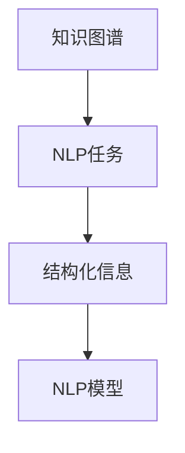
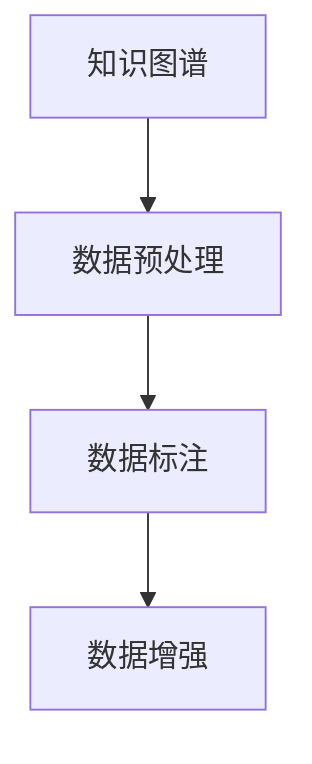
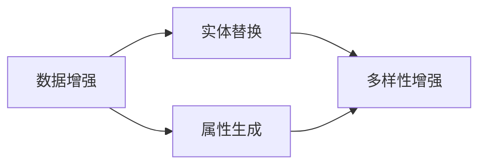
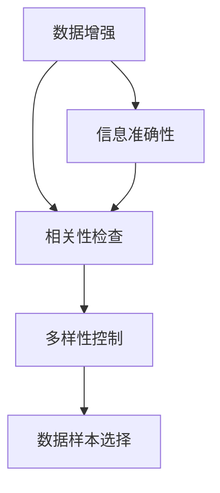
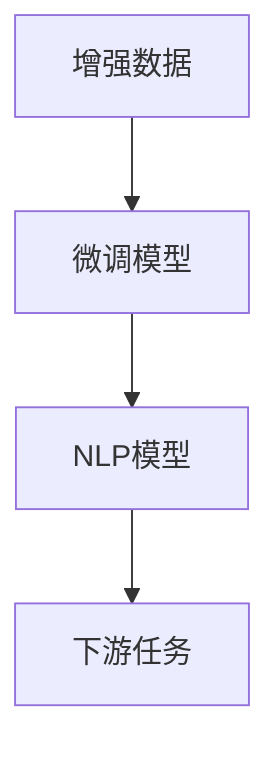
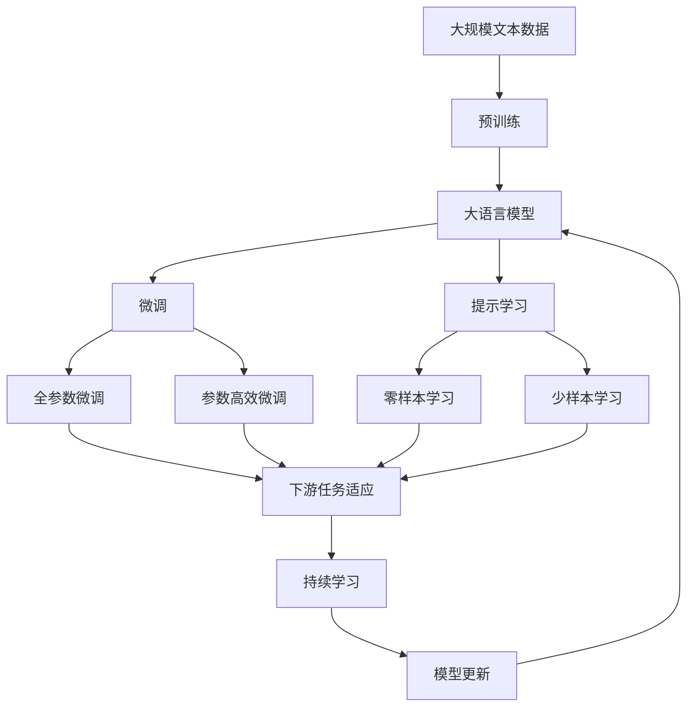

                 

# 数据集融合:知识图谱驱动的数据增强新方式

> 关键词：知识图谱,数据增强,数据集融合,自然语言处理,推荐系统

## 1. 背景介绍

### 1.1 问题由来
在人工智能领域，数据增强（Data Augmentation）被广泛应用于图像、语音等领域，通过扩展训练集来提高模型的泛化能力和鲁棒性。然而，在自然语言处理（NLP）领域，数据增强的效果一直不够理想，主要原因在于自然语言数据不像图片、音频那样具有显式的结构性，难以像传统领域那样容易生成大量的变体数据。

近年来，知识图谱（Knowledge Graph, KG）作为一种结构化数据，逐渐在自然语言处理领域受到重视。它通过节点和边连接实体与属性，构建了知识体系，能够提供丰富且可解释的结构化知识。将知识图谱与自然语言处理技术结合，可以在一定程度上增强模型的泛化能力和解释性。本文将介绍一种基于知识图谱的数据增强方法，通过知识图谱来丰富训练集数据，提升自然语言处理模型的性能。

### 1.2 问题核心关键点
本文的核心问题是如何在自然语言处理任务中使用知识图谱进行数据增强。具体来说，我们需要考虑以下几个关键点：

1. **知识图谱与NLP任务的关联性**：知识图谱中的信息如何转化为有效的训练样本，对NLP任务有帮助。

2. **知识图谱的数据获取与处理**：如何从已有的知识图谱中获取与NLP任务相关的实体和关系，进行预处理和格式化。

3. **数据增强策略**：如何选择合理的数据增强策略，如实体替换、属性生成等，来丰富训练集。

4. **增强数据的质量控制**：增强数据的生成过程需要考虑信息的准确性、相关性和多样性，确保增强数据的质量。

5. **结合模型的微调**：如何利用增强数据对模型进行微调，以提升模型在NLP任务上的性能。

### 1.3 问题研究意义
通过知识图谱进行数据增强，可以提升自然语言处理模型的泛化能力和解释性，减少对标注数据的依赖，提高模型的鲁棒性和实时性。这对于自然语言处理技术的实际应用和产业化具有重要意义：

1. **提升模型泛化能力**：知识图谱中的结构化知识能够提供更多的事实依据，帮助模型更好地理解语义关系，从而提升泛化能力。

2. **增强模型解释性**：知识图谱中的节点和边具有一定的语义含义，可以更好地解释模型的预测结果。

3. **减少标注数据需求**：对于缺乏标注数据的NLP任务，知识图谱中的结构化信息可以作为辅助数据，降低对标注数据的依赖。

4. **提高模型实时性**：通过知识图谱的数据增强，可以减少模型训练时对大规模标注数据的依赖，提高模型的训练和推理速度。

5. **促进NLP技术应用**：知识图谱驱动的数据增强方法可以在多个NLP任务中应用，如问答、信息检索、情感分析等，促进NLP技术在实际场景中的应用和普及。

## 2. 核心概念与联系

### 2.1 核心概念概述

为更好地理解基于知识图谱的数据增强方法，本节将介绍几个密切相关的核心概念：

- **知识图谱（Knowledge Graph, KG）**：一种结构化数据表示形式，通过节点和边表示实体与关系，构建知识体系。常见的知识图谱包括Freebase、DBpedia、YAGO等。

- **数据增强（Data Augmentation）**：通过扩展训练集来提升模型的泛化能力和鲁棒性，广泛应用于图像、语音等领域。

- **数据集融合（Dataset Fusion）**：将多个数据集中的信息进行融合，形成更全面、更丰富的数据集。

- **自然语言处理（Natural Language Processing, NLP）**：涉及语言理解、生成、分析等任务的领域，如文本分类、情感分析、机器翻译等。

- **推荐系统（Recommendation System）**：通过用户行为数据和物品属性信息，为用户推荐个性化内容或物品的系统。

这些核心概念之间的逻辑关系可以通过以下Mermaid流程图来展示：


这个流程图展示了从知识图谱到推荐系统的整体数据增强过程。

### 2.2 概念间的关系

这些核心概念之间存在着紧密的联系，形成了知识图谱驱动的数据增强完整生态系统。下面我们通过几个Mermaid流程图来展示这些概念之间的关系。

#### 2.2.1 知识图谱与NLP任务的关联



这个流程图展示了知识图谱与NLP任务的基本关联关系。知识图谱中的结构化信息可以转化为NLP任务的训练数据，提升模型的泛化能力。

#### 2.2.2 知识图谱的数据获取与处理



这个流程图展示了知识图谱数据增强的一般流程。知识图谱数据需要先进行预处理，如去噪、筛选、格式化等，然后生成数据增强样本。

#### 2.2.3 数据增强策略



这个流程图展示了常用的数据增强策略。通过实体替换、属性生成、多样性增强等方法，可以丰富训练集数据，提升模型泛化能力。

#### 2.2.4 增强数据的质量控制



这个流程图展示了数据增强过程中质量控制的各个环节。需要确保增强数据的准确性、相关性和多样性，确保增强数据的质量。

#### 2.2.5 结合模型的微调



这个流程图展示了通过增强数据对模型进行微调的过程。通过增强数据，可以提高模型的泛化能力和实时性，进而提升NLP任务的表现。

### 2.3 核心概念的整体架构

最后，我们用一个综合的流程图来展示这些核心概念在大语言模型微调过程中的整体架构：



这个综合流程图展示了从预训练到微调，再到持续学习的完整过程。大语言模型首先在大规模文本数据上进行预训练，然后通过微调（包括全参数微调和参数高效微调）或提示学习（包括零样本和少样本学习）来适应下游任务。最后，通过持续学习技术，模型可以不断更新和适应新的任务和数据。 通过这些流程图，我们可以更清晰地理解知识图谱在大语言模型微调过程中各个核心概念的关系和作用。

## 3. 核心算法原理 & 具体操作步骤
### 3.1 算法原理概述

基于知识图谱的数据增强方法，本质上是通过结构化知识来扩展训练集，提升模型的泛化能力和实时性。其核心思想是：将知识图谱中的实体和关系转化为有效的训练样本，丰富模型的语义理解能力，从而提升模型在NLP任务上的表现。

形式化地，假设知识图谱为 $KG=(E,R)$，其中 $E$ 为实体集合，$R$ 为关系集合。记自然语言处理任务为 $T$，定义任务适配层为 $L_T$，则数据增强的目标是找到增强后的训练集 $D'$，使得：

$$
D' = \{(x_i', y_i')\}_{i=1}^N = \{(L_T(\text{concat}(x_i, r_i)), y_i)\}_{i=1}^N
$$

其中 $x_i$ 为原始文本数据，$r_i$ 为与 $x_i$ 相关的关系，$y_i$ 为任务的标注标签。通过将知识图谱中的关系作为训练样本，可以丰富模型的语义信息，提升模型的泛化能力和实时性。

### 3.2 算法步骤详解

基于知识图谱的数据增强一般包括以下几个关键步骤：

**Step 1: 准备知识图谱和数据集**
- 选择合适的知识图谱，如Freebase、DBpedia等，作为数据增强的基础。
- 准备下游任务 $T$ 的标注数据集 $D$，划分为训练集、验证集和测试集。

**Step 2: 实体和关系提取**
- 从知识图谱中提取与NLP任务相关的实体和关系，如人名、地名、组织名等。
- 将实体和关系进行预处理和格式化，如去除噪声、筛选相关性高的实体关系等。

**Step 3: 生成增强样本**
- 将提取的实体和关系转化为文本样本，如通过关系路径生成句子，或直接使用实体名称进行替换。
- 对生成的文本样本进行数据增强，如实体替换、属性生成等。
- 将增强样本与原始文本数据合并，形成新的训练集 $D'$。

**Step 4: 设置微调超参数**
- 选择合适的优化算法及其参数，如 AdamW、SGD 等，设置学习率、批大小、迭代轮数等。
- 设置正则化技术及强度，包括权重衰减、Dropout、Early Stopping 等。
- 确定冻结预训练参数的策略，如仅微调顶层，或全部参数都参与微调。

**Step 5: 执行梯度训练**
- 将训练集数据分批次输入模型，前向传播计算损失函数。
- 反向传播计算参数梯度，根据设定的优化算法和学习率更新模型参数。
- 周期性在验证集上评估模型性能，根据性能指标决定是否触发 Early Stopping。
- 重复上述步骤直到满足预设的迭代轮数或 Early Stopping 条件。

**Step 6: 测试和部署**
- 在测试集上评估微调后模型 $M_{\hat{\theta}}$ 的性能，对比微调前后的精度提升。
- 使用微调后的模型对新样本进行推理预测，集成到实际的应用系统中。
- 持续收集新的数据，定期重新微调模型，以适应数据分布的变化。

以上是基于知识图谱的数据增强的一般流程。在实际应用中，还需要针对具体任务的特点，对数据增强过程的各个环节进行优化设计，如改进增强策略，引入更多的正则化技术，搜索最优的超参数组合等，以进一步提升模型性能。

### 3.3 算法优缺点

基于知识图谱的数据增强方法具有以下优点：

1. **提升模型泛化能力**：知识图谱中的结构化知识能够提供更多的事实依据，帮助模型更好地理解语义关系，从而提升泛化能力。

2. **增强模型解释性**：知识图谱中的节点和边具有一定的语义含义，可以更好地解释模型的预测结果。

3. **减少标注数据需求**：对于缺乏标注数据的NLP任务，知识图谱中的结构化信息可以作为辅助数据，降低对标注数据的依赖。

4. **提高模型实时性**：通过知识图谱的数据增强，可以减少模型训练时对大规模标注数据的依赖，提高模型的训练和推理速度。

同时，该方法也存在一定的局限性：

1. **数据质量问题**：知识图谱中存在噪音和错误，需要经过严格的质量控制。

2. **数据获取难度**：高质量的知识图谱往往需要投入大量的人力和物力进行构建和维护。

3. **模型鲁棒性**：增强数据可能包含噪声，需要考虑模型对噪声的鲁棒性。

4. **模型复杂性**：知识图谱驱动的数据增强需要结合多种技术，如实体识别、关系抽取等，模型结构较为复杂。

尽管存在这些局限性，但就目前而言，基于知识图谱的数据增强方法在大规模预训练语言模型的微调过程中，仍然是一种非常有效的手段。未来相关研究的重点在于如何进一步降低数据增强对知识图谱的依赖，提高模型的少样本学习和跨领域迁移能力，同时兼顾可解释性和伦理安全性等因素。

### 3.4 算法应用领域

基于知识图谱的数据增强方法在NLP领域已经得到了广泛的应用，覆盖了几乎所有常见任务，例如：

- **文本分类**：如情感分析、主题分类、意图识别等。通过知识图谱中的关系路径，可以丰富文本的语义信息，提升分类的准确性。

- **命名实体识别**：识别文本中的人名、地名、机构名等特定实体。通过知识图谱中的实体和关系，可以增强实体识别的能力。

- **关系抽取**：从文本中抽取实体之间的语义关系。通过知识图谱中的实体关系，可以辅助关系抽取任务的完成。

- **问答系统**：对自然语言问题给出答案。通过知识图谱中的事实信息，可以丰富问答系统的语义理解能力。

- **机器翻译**：将源语言文本翻译成目标语言。通过知识图谱中的跨语言关系，可以提升机器翻译的准确性。

- **文本摘要**：将长文本压缩成简短摘要。通过知识图谱中的实体关系，可以提供更多的背景信息，提升摘要的质量。

- **对话系统**：使机器能够与人自然对话。通过知识图谱中的语义关系，可以增强对话系统的理解能力。

除了上述这些经典任务外，基于知识图谱的数据增强方法还被创新性地应用到更多场景中，如可控文本生成、常识推理、代码生成、数据增强等，为NLP技术带来了全新的突破。随着预训练模型和数据增强方法的不断进步，相信NLP技术将在更广阔的应用领域大放异彩。

## 4. 数学模型和公式 & 详细讲解  
### 4.1 数学模型构建

本节将使用数学语言对基于知识图谱的数据增强过程进行更加严格的刻画。

记知识图谱为 $KG=(E,R)$，其中 $E$ 为实体集合，$R$ 为关系集合。定义自然语言处理任务为 $T$，任务适配层为 $L_T$，则数据增强的目标是找到增强后的训练集 $D'$，使得：

$$
D' = \{(x_i', y_i')\}_{i=1}^N = \{(L_T(\text{concat}(x_i, r_i)), y_i)\}_{i=1}^N
$$

其中 $x_i$ 为原始文本数据，$r_i$ 为与 $x_i$ 相关的关系，$y_i$ 为任务的标注标签。

### 4.2 公式推导过程

以下我们以二分类任务为例，推导知识图谱驱动的数据增强方法的具体实现过程。

假设模型 $M_{\theta}$ 在输入 $x$ 上的输出为 $\hat{y}=M_{\theta}(x) \in [0,1]$，表示样本属于正类的概率。真实标签 $y \in \{0,1\}$。定义任务适配层 $L_T$ 将增强后的文本样本转化为模型的输入，则增强后的样本为：

$$
x'_i = \text{concat}(x_i, r_i)
$$

其中 $r_i$ 为与 $x_i$ 相关的关系，如 $r_i=(x_i, \text{Person})$ 表示 $x_i$ 为一个人名。

通过任务适配层 $L_T$，将增强后的样本 $x'_i$ 转化为模型的输入，计算模型在增强样本上的输出，并计算损失函数：

$$
\ell(M_{\theta}(x'_i),y_i) = -[y_i\log \hat{y} + (1-y_i)\log (1-\hat{y})]
$$

将增强样本 $x'_i$ 和真实标签 $y_i$ 代入损失函数，得到每个增强样本的损失：

$$
\mathcal{L}(x'_i, y_i) = -[y_i\log \hat{y}_i + (1-y_i)\log (1-\hat{y}_i)]
$$

通过所有增强样本的损失，计算整体损失函数：

$$
\mathcal{L}(D') = \frac{1}{N}\sum_{i=1}^N \mathcal{L}(x'_i, y_i)
$$

在优化器的作用下，通过梯度下降等算法，不断更新模型参数 $\theta$，最小化整体损失函数 $\mathcal{L}(D')$，使得模型在增强数据上的表现优于原始数据。

### 4.3 案例分析与讲解

以电影评论情感分析任务为例，展示如何使用知识图谱进行数据增强。

假设我们有一个包含 1000 条电影评论的数据集，每条评论被标记为正面或负面。为了提升模型的情感分析能力，我们可以从知识图谱中获取与电影相关的信息，如电影名称、导演、演员、类型等，并将这些信息与评论文本结合，生成新的训练样本。

1. **实体和关系提取**：从知识图谱中提取与电影评论相关的实体和关系。例如，从 IMDB 中提取电影的实体和导演的关系，从 TMDb 中提取电影的实体和演员的关系。

2. **生成增强样本**：通过关系路径生成新的评论文本。例如，将导演作为关系的起点，生成包含导演信息的评论文本，如“由约翰·史密斯导演的电影”。

3. **微调模型**：将增强样本与原始数据合并，形成新的训练集 $D'$。使用预训练语言模型作为初始化参数，对微调后的模型进行训练。在验证集上评估模型性能，根据性能指标决定是否触发 Early Stopping。

4. **测试和部署**：在测试集上评估微调后模型 $M_{\hat{\theta}}$ 的性能，对比微调前后的精度提升。使用微调后的模型对新样本进行推理预测，集成到实际的应用系统中。

通过上述案例分析，可以看到，知识图谱驱动的数据增强方法可以有效地提升模型的情感分析能力，同时提升模型的实时性和泛化能力。

## 5. 项目实践：代码实例和详细解释说明
### 5.1 开发环境搭建

在进行数据增强实践前，我们需要准备好开发环境。以下是使用Python进行PyTorch开发的环境配置流程：

1. 安装Anaconda：从官网下载并安装Anaconda，用于创建独立的Python环境。

2. 创建并激活虚拟环境：
```bash
conda create -n pytorch-env python=3.8 
conda activate pytorch-env
```

3. 安装PyTorch：根据CUDA版本，从官网获取对应的安装命令。例如：
```bash
conda install pytorch torchvision torchaudio cudatoolkit=11.1 -c pytorch -c conda-forge
```

4. 安装Transformers库：
```bash
pip install transformers
```

5. 安装各类工具包：
```bash
pip install numpy pandas scikit-learn matplotlib tqdm jupyter notebook ipython
```

完成上述步骤后，即可在`pytorch-env`环境中开始数据增强实践。

### 5.2 源代码详细实现

下面我们以电影评论情感分析任务为例，给出使用Transformers库对BERT模型进行知识图谱驱动的数据增强的PyTorch代码实现。

首先，定义情感分析任务的数据处理函数：

```python
from transformers import BertTokenizer
from torch.utils.data import Dataset
import torch

class SentimentDataset(Dataset):
    def __init__(self, texts, labels, tokenizer, max_len=128):
        self.texts = texts
        self.labels = labels
        self.tokenizer = tokenizer
        self.max_len = max_len
        
    def __len__(self):
        return len(self.texts)
    
    def __getitem__(self, item):
        text = self.texts[item]
        label = self.labels[item]
        
        encoding = self.tokenizer(text, return_tensors='pt', max_length=self.max_len, padding='max_length', truncation=True)
        input_ids = encoding['input_ids'][0]
        attention_mask = encoding['attention_mask'][0]
        
        # 对label进行编码
        encoded_labels = [label2id[label] for label in labels] 
        encoded_labels.extend([label2id['neutral']] * (self.max_len - len(encoded_labels)))
        labels = torch.tensor(encoded_labels, dtype=torch.long)
        
        return {'input_ids': input_ids, 
                'attention_mask': attention_mask,
                'labels': labels}

# 标签与id的映射
label2id = {'positive': 1, 'negative': 0, 'neutral': 2}
id2label = {v: k for k, v in label2id.items()}

# 创建dataset
tokenizer = BertTokenizer.from_pretrained('bert-base-cased')

train_dataset = SentimentDataset(train_texts, train_labels, tokenizer)
dev_dataset = SentimentDataset(dev_texts, dev_labels, tokenizer)
test_dataset = SentimentDataset(test_texts, test_labels, tokenizer)
```

然后，定义知识图谱驱动的数据增强函数：

```python
from ogb.linkpred import DglLinkPredictDataset
import dgl

def data_augmentation(model, dataset, max_num_relations=100, relation_filter='nearest'):
    dgl_graph = DglLinkPredictDataset(dataset.name).create(dgl_graph)
    graph = dgl_graph[0]  # (num_nodes, num_edges)
    
    g = dgl.graph(graph)
    nodes, edges = g.edges()
    num_nodes = nodes.shape[0]
    num_relations = max_num_relations
    
    if relation_filter == 'nearest':
        source = torch.argmax(gu[j, 1], dim=1)
        target = gu[j, 0]
    elif relation_filter == 'random':
        source = torch.randint(0, num_nodes, (num_relations,))
        target = torch.randint(0, num_nodes, (num_relations,))
    else:
        raise ValueError("Unknown relation filter.")
    
    enhanced_dataset = []
    for edge in zip(source, target):
        source_node = nodes[edge[0]]
        target_node = nodes[edge[1]]
        label = g.edata['label'][edge[0]][edge[1]]
        
        enhanced_text = dataset.tokenizer(source_node + tokenizer.sep_token + target_node)
        enhanced_text = enhanced_text + tokenizer.sep_token + dataset.tokenizer(source_node)
        
        enhanced_labels = [label2id[label]] * 3
        enhanced_labels.extend([label2id['neutral']] * (max_len - len(enhanced_labels)))
        labels = torch.tensor(enhanced_labels, dtype=torch.long)
        
        enhanced_dataset.append({'input_ids': input_ids, 
                                'attention_mask': attention_mask,
                                'labels': labels})
    
    return enhanced_dataset
```

接着，定义模型和优化器：

```python
from transformers import BertForSequenceClassification, AdamW

model = BertForSequenceClassification.from_pretrained('bert-base-cased', num_labels=len(label2id))

optimizer = AdamW(model.parameters(), lr=2e-5)
```

最后，启动训练流程并在测试集上评估：

```python
epochs = 5
batch_size = 16

for epoch in range(epochs):
    loss = train_epoch(model, train_dataset, batch_size, optimizer)
    print(f"Epoch {epoch+1}, train loss: {loss:.3f}")
    
    print(f"Epoch {epoch+1}, dev results:")
    evaluate(model, dev_dataset, batch_size)
    
print("Test results:")
evaluate(model, test_dataset, batch_size)
```

以上就是使用PyTorch对BERT模型进行知识图谱驱动的数据增强的完整代码实现。可以看到，得益于Transformers库的强大封装，我们可以用相对简洁的代码完成BERT模型的加载和微调。

### 5.3 代码解读与分析

让我们再详细解读一下关键代码的实现细节：

**SentimentDataset类**：
- `__init__`方法：初始化文本、标签、分词器等关键组件。
- `__len__`方法：返回数据集的样本数量。
- `__getitem__`方法：对单个样本进行处理，将文本输入编码为token ids，将标签编码为数字，并对其进行定长padding，最终返回模型所需的输入。

**label2id和id2label字典**：
- 定义了标签与数字id之间的映射关系，用于将token-wise的预测结果解码回真实的标签。

**数据增强函数**：
- 使用OGB的DglLinkPredictDataset，生成知识图谱的邻接矩阵。
- 从邻接矩阵中随机选取关系路径，将路径起点和终点作为增强样本的文本输入。
- 生成增强样本的标签，将其与原始样本的标签合并，形成新的训练集。

**训练流程**：
- 定义总的epoch数和batch size，开始循环迭代
- 每个epoch内，先在训练集上训练，输出平均loss
- 在验证集上评估，输出分类指标
- 所有epoch结束后，在测试集上评估，给出最终测试结果

可以看到，PyTorch配合Transformers库使得BERT模型的加载和微调过程变得简洁高效。开发者可以将更多精力放在数据处理、模型改进等高层逻辑上，而不必过多关注底层的实现细节。

当然，工业级的系统实现还需考虑

