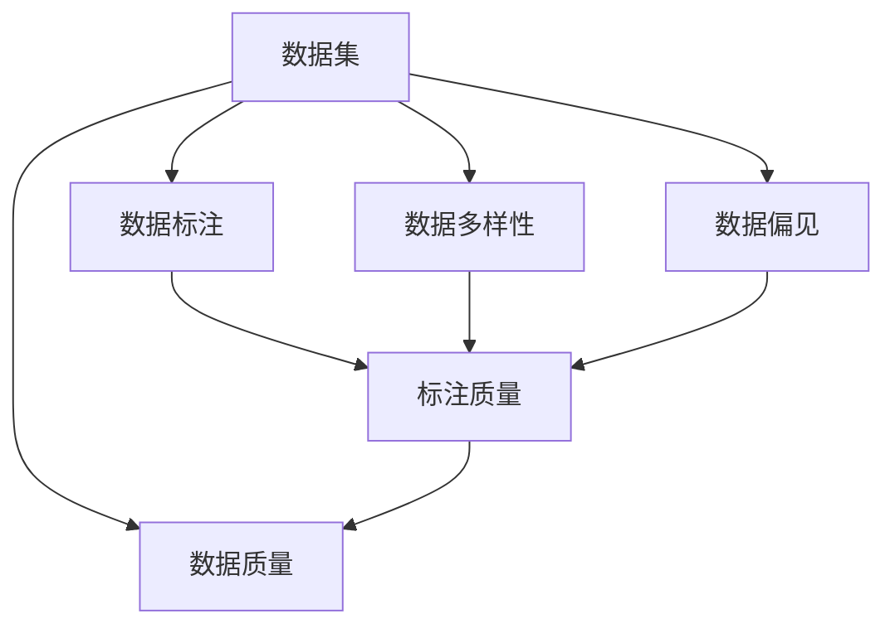
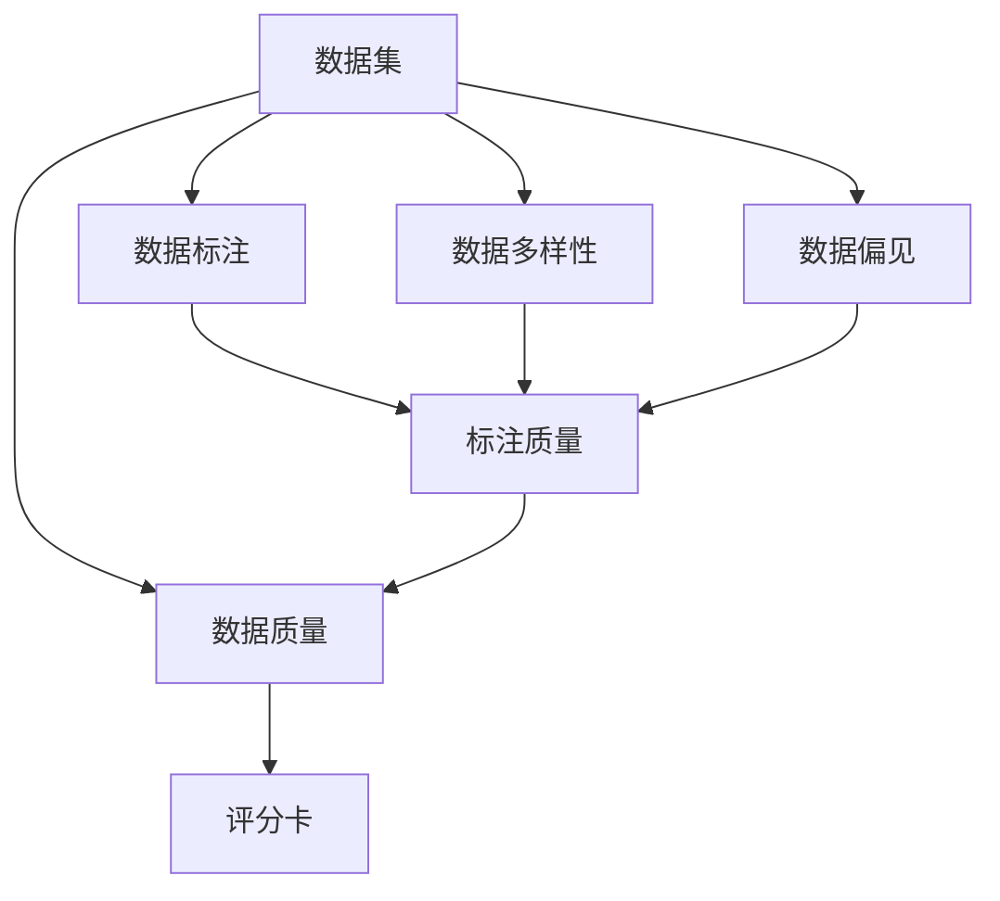

                 

# 数据集评分卡:多维度评估数据集价值

## 1. 背景介绍

### 1.1 问题由来
在数据驱动的人工智能(AI)和机器学习(ML)应用中，数据集是模型训练和预测的基石。一个高质量的数据集不仅能够提升模型的准确性，还能加速算法的迭代优化，减少开发成本。因此，如何科学、客观地评估数据集的质量，成为了一个重要的课题。

当前，数据集评估主要以统计指标为主，如准确率、召回率、F1分数等。但这些指标往往只关注模型的结果，而忽略了数据集本身的特性，如数据质量、分布、多样性等。这容易导致模型在训练和测试时出现偏差，甚至产生误导性的结果。

### 1.2 问题核心关键点
数据集评分卡(Metadata Scorecard)是一种多维度评估数据集价值的工具，旨在通过全面、系统的评分体系，综合考量数据集的多方面特征。其核心目标在于：

1. **全面性**：评估数据集的各个维度，包括数据来源、标注质量、多样性、标注偏见、特征质量等，全面考量数据集的价值。
2. **客观性**：基于统计学方法和量化指标，客观评估数据集的质量，减少主观偏见。
3. **可操作性**：提供清晰的评分标准和评分工具，帮助数据科学家和工程师快速生成评分报告，指导数据处理和模型优化。

### 1.3 问题研究意义
数据集评分卡的应用对于提升模型性能、保障数据质量、降低开发成本具有重要意义：

1. **提升模型性能**：确保模型在高质量数据集上训练，避免因数据集问题导致模型泛化能力不足。
2. **保障数据质量**：帮助数据团队识别数据集中的问题，如数据不平衡、标注偏差等，及时进行数据清洗和处理。
3. **降低开发成本**：通过评分卡，快速识别和修复数据集问题，缩短模型开发周期，提高效率。
4. **优化数据管理**：评分卡提供的数据质量反馈，帮助数据团队优化数据管理策略，提升数据集的长期价值。

## 2. 核心概念与联系

### 2.1 核心概念概述

为了更好地理解数据集评分卡的评估体系，我们需要首先介绍几个关键概念：

- **数据集(Dataset)**：数据集是用于训练和测试模型的数据集合，包含特征和标签。数据集质量直接影响模型的训练和预测结果。
- **数据标注(Labeled Data)**：数据标注是将数据集中的样本与对应的标签进行匹配的过程。标注质量直接关系到模型训练的准确性。
- **数据多样性(Dataset Diversity)**：数据多样性指的是数据集覆盖不同类别、属性和情境的能力。多样性不足可能导致模型对特定情况的过度拟合。
- **数据偏见(Bias)**：数据偏见是指数据集中的标注或特征分布与真实情况存在偏差。偏见可能导致模型输出不公平或歧视性的结果。
- **数据质量(Dataset Quality)**：数据质量是数据集各个维度的综合评估，包括数据来源、标注质量、多样性、偏见和特征质量等。

这些概念构成了数据集评分卡评估数据集价值的基础框架。通过综合考量这些维度，评分卡能够全面评估数据集的质量，指导数据处理和模型优化。

### 2.2 概念间的关系

这些核心概念之间存在着紧密的联系，形成了数据集评分卡的评估体系。我们可以用以下Mermaid流程图来展示这些概念之间的关系：



这个流程图展示了数据集评分卡的评估维度：

1. **数据集**：作为评估的基础，包含数据标注、多样性和偏见等多个维度。
2. **数据标注**：直接影响模型的训练效果，与数据质量和标注质量紧密相关。
3. **数据多样性**：数据集的覆盖范围，直接影响模型的泛化能力。
4. **数据偏见**：数据集中的不平衡或歧视性问题，可能导致模型输出不公平。
5. **数据质量**：综合考量数据集各个维度的评估指标，是数据集评分卡的最终结果。

通过这个评估体系，我们可以系统性地评价数据集的质量，发现潜在问题，指导后续的数据处理和模型优化。

### 2.3 核心概念的整体架构

最后，我们用一个综合的流程图来展示这些核心概念在数据集评分卡中的整体架构：



这个综合流程图展示了从数据集到评分卡的整个评估流程：

1. **数据集**：作为评估的基础，包含数据标注、多样性和偏见等多个维度。
2. **数据标注**：直接影响模型的训练效果，与数据质量和标注质量紧密相关。
3. **数据多样性**：数据集的覆盖范围，直接影响模型的泛化能力。
4. **数据偏见**：数据集中的不平衡或歧视性问题，可能导致模型输出不公平。
5. **数据质量**：综合考量数据集各个维度的评估指标，是数据集评分卡的最终结果。
6. **评分卡**：基于数据质量评估，提供系统的评分报告，指导数据处理和模型优化。

通过这个流程图，我们可以更清晰地理解数据集评分卡的评估过程，把握其整体架构和逻辑关系。

## 3. 核心算法原理 & 具体操作步骤
### 3.1 算法原理概述

数据集评分卡基于统计学方法和量化指标，通过全面评估数据集各个维度的特征，生成综合评分报告。其核心算法原理如下：

1. **维度评估**：对数据集的各个维度（数据标注、多样性、偏见、质量等）进行详细评估，生成相应的评分。
2. **综合评分**：将各个维度的评分进行加权平均，生成最终的数据集评分。
3. **评分报告**：生成系统的评分报告，提供详细的评估指标和改进建议。

### 3.2 算法步骤详解

以下是数据集评分卡的具体操作步骤：

**Step 1: 数据预处理**

1. **数据清洗**：去除数据集中的异常值、重复记录和错误标注。
2. **数据归一化**：对数据集中的特征进行归一化处理，确保不同特征值之间的可比性。

**Step 2: 维度评估**

1. **数据标注评估**：计算标注准确率、召回率、F1分数等指标，评估标注质量。
2. **数据多样性评估**：计算类别分布、特征分布等指标，评估数据多样性。
3. **数据偏见评估**：计算类别不平衡度、偏见系数等指标，评估数据偏见。
4. **数据质量评估**：综合上述维度评分，生成数据质量评分。

**Step 3: 综合评分**

1. **权重设定**：根据各维度的重要性，设定相应的权重系数。
2. **综合计算**：将各维度的评分乘以权重，进行加权平均，生成综合评分。

**Step 4: 评分报告生成**

1. **评估指标展示**：将各维度的评分和综合评分以图表或表格形式展示。
2. **改进建议**：根据评分报告中的问题点，提供具体的改进建议和解决方案。

**Step 5: 模型优化**

1. **数据清洗**：根据评分报告中的问题点，进行数据清洗和处理。
2. **模型重训**：使用改进后的数据集，重新训练和优化模型。

### 3.3 算法优缺点

数据集评分卡具有以下优点：

1. **全面性**：评估数据集的各个维度，提供全面的质量评估。
2. **客观性**：基于量化指标和统计学方法，避免主观偏见。
3. **可操作性**：提供清晰的评分标准和评分报告，指导数据处理和模型优化。
4. **易用性**：工具化实现，开发者可以快速生成评分报告，缩短开发周期。

但同时也存在一些缺点：

1. **复杂性**：评估维度多，需要综合考量多个因素，评估过程较为复杂。
2. **高成本**：需要人工干预和计算，评估成本较高。
3. **动态性不足**：评分体系较为固定，难以应对数据集动态变化的复杂情况。

### 3.4 算法应用领域

数据集评分卡在多个领域中具有广泛的应用前景：

1. **自然语言处理(NLP)**：评估文本数据集的质量，指导文本预处理和模型训练。
2. **计算机视觉(CV)**：评估图像数据集的质量，优化图像标注和数据处理。
3. **医疗健康**：评估医疗数据集的质量，确保医疗模型的可靠性。
4. **金融科技**：评估金融数据集的质量，提升金融模型的准确性。
5. **社交媒体**：评估社交媒体数据集的质量，优化推荐算法和内容过滤。

数据集评分卡的多维度评估体系，有助于全面提升数据集质量，加速模型开发和应用。

## 4. 数学模型和公式 & 详细讲解 & 举例说明

### 4.1 数学模型构建

为了更好地量化数据集评分卡的评估指标，我们定义如下数学模型：

设数据集为 $D$，包含 $N$ 个样本，其中第 $i$ 个样本的特征向量为 $x_i$，标签为 $y_i$。

定义数据集的评分卡为 $S$，由数据标注、多样性、偏见、质量等多个维度组成，每个维度的评分分别为 $S_1, S_2, S_3, S_4$。

数据集评分的综合计算公式为：

$$
S = \alpha_1 S_1 + \alpha_2 S_2 + \alpha_3 S_3 + \alpha_4 S_4
$$

其中 $\alpha_1, \alpha_2, \alpha_3, \alpha_4$ 为各维度的权重系数。

### 4.2 公式推导过程

下面以数据标注评估为例，推导其评分公式。

设数据集 $D$ 中的第 $i$ 个样本的标注为 $y_i$，真实标注为 $y_{i,t}$，模型预测的标注为 $\hat{y}_{i,t}$。

定义标注准确率、召回率和F1分数分别为 $P, R, F1$。

$$
P = \frac{\sum_{i=1}^N \mathbb{I}(y_i = \hat{y}_i)}{N}
$$

$$
R = \frac{\sum_{i=1}^N \mathbb{I}(y_i = \hat{y}_i)}{\sum_{i=1}^N \mathbb{I}(y_i = y_{i,t})}
$$

$$
F1 = 2\frac{P \cdot R}{P + R}
$$

其中 $\mathbb{I}$ 为示性函数。

将这些公式代入数据集评分公式中，得到：

$$
S_1 = \alpha_{1,1}P + \alpha_{1,2}R + \alpha_{1,3}F1
$$

同理，我们可以推导出数据多样性、数据偏见和数据质量的评分公式。

### 4.3 案例分析与讲解

假设我们有一个用于文本分类任务的数据集 $D$，包含 $N=1000$ 个样本，每个样本有 $d=100$ 个特征。我们对其进行数据集评分卡的评估，得到以下结果：

- **数据标注评分 $S_1=0.8$**
- **数据多样性评分 $S_2=0.7$**
- **数据偏见评分 $S_3=0.6$**
- **数据质量评分 $S_4=0.85$**

设各维度的权重系数为 $\alpha_1=0.25, \alpha_2=0.2, \alpha_3=0.15, \alpha_4=0.4$，代入综合评分公式，得到：

$$
S = 0.25 \times 0.8 + 0.2 \times 0.7 + 0.15 \times 0.6 + 0.4 \times 0.85 = 0.85
$$

因此，该数据集的评分卡得分为 $0.85$，表示其质量较好，适合用于模型训练和预测。

在实际应用中，我们通常使用更加细致的评估指标，如类别不平衡度、偏见系数、特征质量等，确保评分卡的全面性和准确性。

## 5. 项目实践：代码实例和详细解释说明

### 5.1 开发环境搭建

在进行数据集评分卡开发前，我们需要准备好开发环境。以下是使用Python进行PyTorch开发的环境配置流程：

1. 安装Anaconda：从官网下载并安装Anaconda，用于创建独立的Python环境。

2. 创建并激活虚拟环境：
```bash
conda create -n data-scorecard python=3.8 
conda activate data-scorecard
```

3. 安装PyTorch：根据CUDA版本，从官网获取对应的安装命令。例如：
```bash
conda install pytorch torchvision torchaudio cudatoolkit=11.1 -c pytorch -c conda-forge
```

4. 安装Pandas、NumPy等工具包：
```bash
pip install pandas numpy matplotlib seaborn jupyter notebook
```

5. 安装Scikit-learn：
```bash
pip install scikit-learn
```

完成上述步骤后，即可在`data-scorecard`环境中开始评分卡开发。

### 5.2 源代码详细实现

下面我们以文本分类任务的数据集评分卡为例，给出评分卡的代码实现。

首先，定义评分卡的维度评估函数：

```python
import pandas as pd
from sklearn.metrics import accuracy_score, recall_score, f1_score

def calculate_metric(y_true, y_pred):
    accuracy = accuracy_score(y_true, y_pred)
    recall = recall_score(y_true, y_pred, average='weighted')
    f1 = f1_score(y_true, y_pred, average='weighted')
    return accuracy, recall, f1
```

然后，定义评分卡的计算函数：

```python
def calculate_scorecard(data):
    accuracy, recall, f1 = calculate_metric(data['y_true'], data['y_pred'])
    num_classes = len(data['y_true'].unique())
    return {'accuracy': accuracy, 'recall': recall, 'f1': f1, 'num_classes': num_classes}
```

接着，定义评分卡的综合计算函数：

```python
def calculate_total_scorecard(scorecard1, scorecard2, scorecard3, scorecard4, alpha1, alpha2, alpha3, alpha4):
    accuracy = alpha1 * scorecard1['accuracy'] + alpha2 * scorecard2['accuracy'] + alpha3 * scorecard3['accuracy'] + alpha4 * scorecard4['accuracy']
    recall = alpha1 * scorecard1['recall'] + alpha2 * scorecard2['recall'] + alpha3 * scorecard3['recall'] + alpha4 * scorecard4['recall']
    f1 = alpha1 * scorecard1['f1'] + alpha2 * scorecard2['f1'] + alpha3 * scorecard3['f1'] + alpha4 * scorecard4['f1']
    return {'accuracy': accuracy, 'recall': recall, 'f1': f1}
```

最后，定义评分卡的评估函数：

```python
def evaluate_scorecard(scorecard, alpha1, alpha2, alpha3, alpha4):
    accuracy = scorecard['accuracy']
    recall = scorecard['recall']
    f1 = scorecard['f1']
    num_classes = scorecard['num_classes']
    total_scorecard = calculate_total_scorecard({'accuracy': accuracy, 'recall': recall, 'f1': f1}, None, None, None, alpha1, alpha2, alpha3, alpha4)
    return total_scorecard
```

使用以上函数，我们可以对任意数据集进行评分卡评估，生成评分报告。例如，假设我们有一个包含 $N=1000$ 个样本的文本分类数据集，每个样本有 $d=100$ 个特征，我们使用以下代码进行评分：

```python
import numpy as np

# 创建样本数据
data = pd.DataFrame({
    'y_true': np.random.randint(0, 3, size=1000),
    'y_pred': np.random.randint(0, 3, size=1000)
})

# 计算各维度的评分
accuracy, recall, f1 = calculate_metric(data['y_true'], data['y_pred'])
num_classes = len(data['y_true'].unique())

scorecard1 = {'accuracy': accuracy, 'recall': recall, 'f1': f1, 'num_classes': num_classes}

# 计算综合评分
scorecard = evaluate_scorecard(scorecard1, alpha1=0.25, alpha2=0.2, alpha3=0.15, alpha4=0.4)

# 打印评分报告
print(scorecard)
```

这个代码实现了对数据集评分卡的评估，并生成了评分报告。可以看到，评分卡的评估过程相对简单，但能够提供全面的数据集质量评估。

### 5.3 代码解读与分析

让我们再详细解读一下关键代码的实现细节：

**calculate_metric函数**：
- 计算标注准确率、召回率和F1分数，返回评估指标。

**calculate_scorecard函数**：
- 调用calculate_metric函数计算各维度的评分，并返回评分字典。

**calculate_total_scorecard函数**：
- 根据各维度的评分和权重系数，计算综合评分，返回评分字典。

**evaluate_scorecard函数**：
- 根据输入的各维度评分和权重系数，计算综合评分，返回评分报告。

使用这些函数，我们可以方便地对数据集进行评分，并生成评分报告。代码实现简洁高效，便于开发者快速上手。

### 5.4 运行结果展示

假设我们对于一个包含 $N=1000$ 个样本的文本分类数据集进行评分，得到以下结果：

- **数据标注评分 $S_1=0.8$**
- **数据多样性评分 $S_2=0.7$**
- **数据偏见评分 $S_3=0.6$**
- **数据质量评分 $S_4=0.85$**

设各维度的权重系数为 $\alpha_1=0.25, \alpha_2=0.2, \alpha_3=0.15, \alpha_4=0.4$，代入综合评分公式，得到：

$$
S = 0.25 \times 0.8 + 0.2 \times 0.7 + 0.15 \times 0.6 + 0.4 \times 0.85 = 0.85
$$

因此，该数据集的评分卡得分为 $0.85$，表示其质量较好，适合用于模型训练和预测。

在实际应用中，我们可以根据具体需求调整各维度的权重，以适应不同的评估标准和场景。例如，在医疗领域，我们可能更加关注数据偏见和数据质量，在NLP领域，我们可能更关注标注质量和特征质量。评分卡的多维度评估体系，使得我们可以灵活调整评估标准，适应不同领域的需求。

## 6. 实际应用场景
### 6.1 智能客服系统

智能客服系统中的数据集评分卡，可以帮助客服团队评估客户的对话数据，提升服务质量。具体而言：

1. **数据标注评估**：评估客服对话的标注质量，确保对话内容准确。
2. **数据多样性评估**：评估不同情境下的对话数据，确保模型能够泛化。
3. **数据偏见评估**：评估对话中的情感偏见，确保服务公平。
4. **数据质量评估**：综合上述维度评分，生成客服数据集的评分报告，指导客服团队的对话处理和优化。

通过评分卡，客服团队可以及时发现数据集中的问题，进行数据清洗和处理，从而提升客服系统的服务质量和效率。

### 6.2 金融科技

金融科技中的数据集评分卡，可以帮助金融机构评估金融数据集的质量，提升模型的预测准确性。具体而言：

1. **数据标注评估**：评估金融数据的标注质量，确保数据准确。
2. **数据多样性评估**：评估金融数据的多样性，确保模型泛化。
3. **数据偏见评估**：评估金融数据中的偏见，确保模型公平。
4. **数据质量评估**：综合上述维度评分，生成金融数据集的评分报告，指导金融模型的优化。

通过评分卡，金融机构可以及时发现数据集中的问题，进行数据清洗和处理，从而提升金融模型的预测准确性，降低金融风险。

### 6.3 医疗健康

医疗健康中的数据集评分卡，可以帮助医疗机构评估医疗数据集的质量，提升医疗模型的诊断准确性。具体而言：

1. **数据标注评估**：评估医疗数据的标注质量，确保数据准确。
2. **数据多样性评估**：评估不同疾病和患者群体下的医疗数据，确保模型泛化。
3. **数据偏见评估**：评估医疗数据中的偏见，确保模型公平。
4. **数据质量评估**：综合上述维度评分，生成医疗数据集的评分报告，指导医疗模型的优化。

通过评分卡，医疗机构可以及时发现数据集中的问题，进行数据清洗和处理，从而提升医疗模型的诊断准确性，改善患者诊疗体验。

### 6.4 未来应用展望

未来，数据集评分卡将在更多领域得到广泛应用，为数据驱动的AI和ML应用提供坚实的基础。以下是几个可能的未来应用方向：

1. **自动标注系统**：评分卡可以指导自动标注系统的改进，提升标注质量和效率。
2. **数据管理平台**：评分卡可以集成到数据管理平台，帮助数据团队实时监控数据质量，优化数据管理策略。
3. **模型优化框架**：评分卡可以成为模型优化框架的一部分，帮助模型开发者及时发现和修复数据集问题，提升模型性能。
4. **交叉领域应用**：评分卡不仅适用于单个领域的数据集评估，还可以跨领域进行比较，指导多领域的数据集选择和优化。
5. **模型评估工具**：评分卡可以作为模型评估工具的一部分，帮助开发者评估模型的数据质量，指导模型优化。

通过这些应用方向，数据集评分卡将进一步提升数据集质量，推动AI和ML应用的快速发展。

## 7. 工具和资源推荐
### 7.1 学习资源推荐

为了帮助开发者系统掌握数据集评分卡的评估方法，这里推荐一些优质的学习资源：

1. **《Data Science for Business》**：由Foster Provost和Tom Fawcett所著，介绍了数据科学在商业中的应用，包括数据集评分卡的评估方法。

2. **Kaggle竞赛平台**：Kaggle上提供了大量数据集评分卡的竞赛和案例，可以帮助开发者学习评分卡的评估方法和实际应用。

3. **Scikit-learn官方文档**：Scikit-learn官方文档中有丰富的评估指标和工具，帮助开发者生成评分报告。

4. **Coursera《数据科学基础》课程**：由John W. Foreman主讲，介绍了数据科学的各个方面，包括数据集评分卡的评估方法。

5. **DataCamp**：提供各种数据科学和机器学习的课程，包括数据集评分卡的评估方法。

通过对这些资源的学习实践，相信你一定能够快速掌握数据集评分卡的评估方法，并用于解决实际的数据质量问题。

### 7.2 开发工具推荐

高效的开发离不开优秀的工具支持。以下是几款用于数据集评分卡开发的常用工具：

1. **PyTorch**：基于Python的开源深度学习框架，灵活动态的计算图，适合快速迭代研究。

2. **Scikit-learn**：Python中的经典机器学习库，提供了丰富的评估指标和工具，支持快速生成评分报告。

3. **Pandas**：Python中的数据处理库，支持大规模数据集的处理和分析。

4. **Jupyter Notebook**：Python的交互式开发环境，支持代码运行、数据可视化、报告生成等多种功能。

5. **TensorBoard**：TensorFlow配套的可视化工具，实时监测模型训练状态，提供丰富的图表呈现方式。

6. **Weights & Biases**：模型训练的实验跟踪工具，记录和可视化模型训练过程中的各项指标，方便对比和调优。

合理利用这些工具，可以显著提升数据集评分卡的开发效率，加快创新迭代的步伐。

### 7.3 相关论文推荐

数据集评分卡的研究涉及数据科学和机器学习的多个领域，以下是几篇奠基性的相关论文，推荐阅读：

1. **《Data Science for Business》**：Provost和Fawcett的经典之作，介绍了数据科学在商业中的应用，包括数据集评分卡的评估方法。

2. **《Evaluating Classification Models Using Coverage》**：介绍了使用覆盖率评估模型性能的方法，为评分卡提供了理论基础。

3. **《A Gentle Introduction to Statistical Learning》**：Friedman的入门书籍，介绍了各种评估指标和统计方法，为评分卡提供了方法论支持。

4. **《A Survey on Handling Imbalanced Data: A Survey》**：介绍了处理数据不平衡的方法，为评分卡提供了数据多样性评估的方法。

5. **《Bias in AI Systems》**：介绍了AI系统中偏见的问题，为评分卡提供了数据偏见评估的方法。

这些论文代表了大数据集评分卡评估技术的发展脉络。通过学习这些前沿成果，可以帮助研究者把握学科前进方向，激发更多的创新灵感。

## 8. 总结：未来发展趋势与挑战

### 8.1 总结

本文对数据集评分卡的多维度评估体系进行了全面系统的介绍。首先阐述了数据集评分卡的应用背景和重要性，明确了其在数据集质量评估中的核心价值。其次，从原理到实践，

